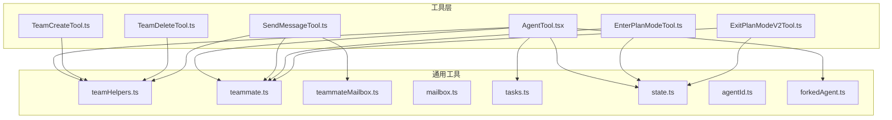
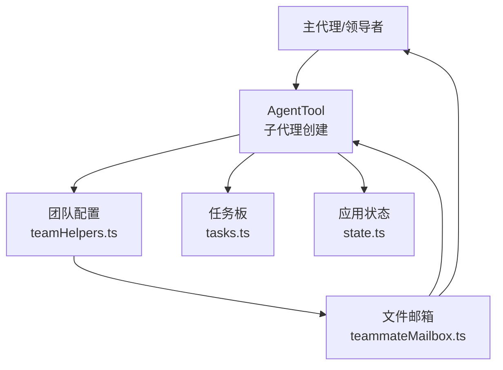
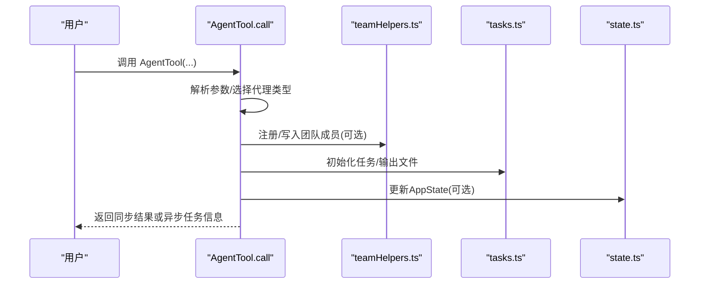
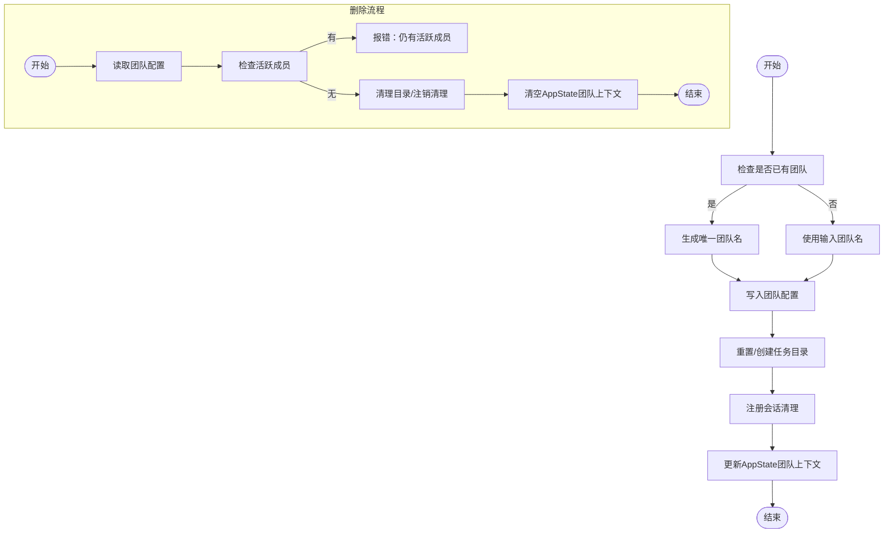
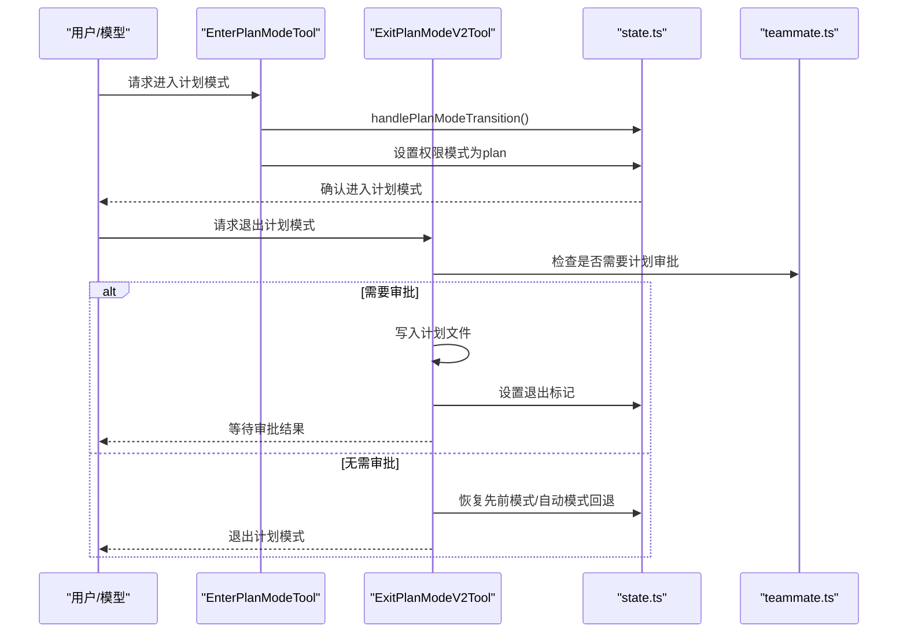
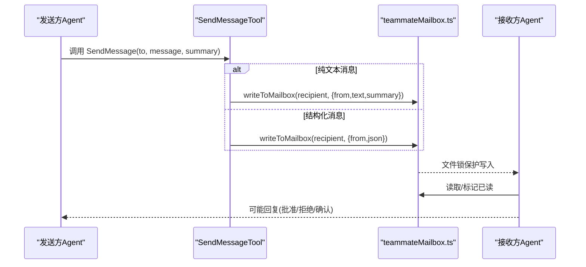
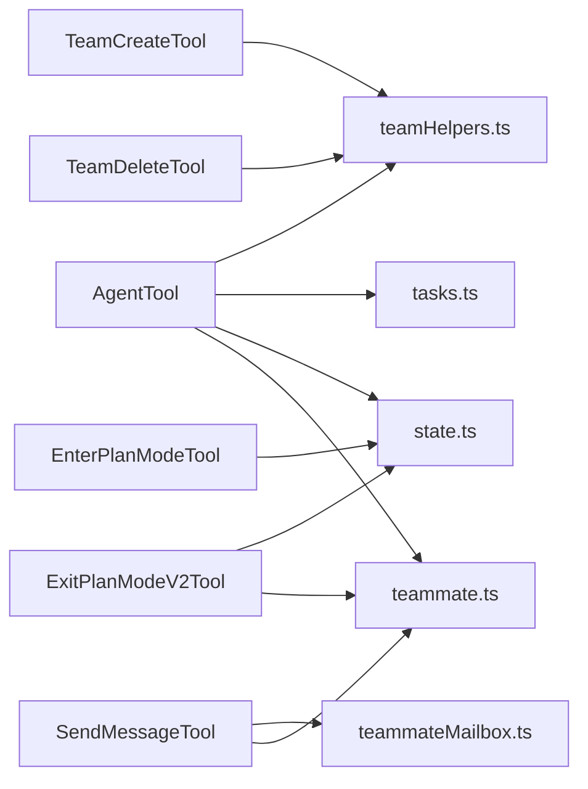

# 代理协作工具

<cite>
**本文引用的文件**
- [AgentTool.tsx](file://src/tools/AgentTool/AgentTool.tsx)
- [TeamCreateTool.ts](file://src/tools/TeamCreateTool/TeamCreateTool.ts)
- [TeamDeleteTool.ts](file://src/tools/TeamDeleteTool/TeamDeleteTool.ts)
- [EnterPlanModeTool.ts](file://src/tools/EnterPlanModeTool/EnterPlanModeTool.ts)
- [ExitPlanModeV2Tool.ts](file://src/tools/ExitPlanModeTool/ExitPlanModeV2Tool.ts)
- [SendMessageTool.ts](file://src/tools/SendMessageTool/SendMessageTool.ts)
- [teammate.ts](file://src/utils/teammate.ts)
- [teamHelpers.ts](file://src/utils/swarm/teamHelpers.ts)
- [teammateMailbox.ts](file://src/utils/teammateMailbox.ts)
- [mailbox.ts](file://src/utils/mailbox.ts)
- [tasks.ts](file://src/utils/tasks.ts)
- [state.ts](file://src/bootstrap/state.ts)
- [agentId.ts](file://src/utils/agentId.ts)
- [forkedAgent.ts](file://src/utils/forkedAgent.ts)
- [README.md](file://README.md)
</cite>

## 目录
1. [简介](#简介)
2. [项目结构](#项目结构)
3. [核心组件](#核心组件)
4. [架构总览](#架构总览)
5. [详细组件分析](#详细组件分析)
6. [依赖关系分析](#依赖关系分析)
7. [性能考虑](#性能考虑)
8. [故障排查指南](#故障排查指南)
9. [结论](#结论)
10. [附录](#附录)

## 简介
本技术文档围绕代理协作工具体系，系统阐述以下能力的设计与实现：
- 子代理创建（AgentTool）：支持同步/异步子代理、工作树隔离、远程隔离、fork 子代理等模式。
- 团队协作（TeamCreate/TeamDelete）：团队生命周期管理、成员登记、任务板初始化与清理。
- 计划模式切换（EnterPlanMode/ExitPlanMode）：计划模式入口与出口、权限模式切换、计划审批流程。
- 消息传递（SendMessage）：跨进程/跨会话的消息协议、广播、请求-响应、关机请求与审批。

文档同时深入解释代理生命周期管理、任务分配机制、通信协议、权限控制、状态同步与错误处理，并提供最佳实践与性能优化建议。

## 项目结构
该仓库采用按功能域分层的组织方式：
- tools：工具定义与实现，如 AgentTool、TeamCreateTool、TeamDeleteTool、EnterPlanModeTool、ExitPlanModeV2Tool、SendMessageTool。
- utils：通用工具库，包括 swarm 团队协作、邮箱信箱、任务管理、权限模式、代理身份等。
- bootstrap：应用状态与引导逻辑，如模式切换、会话状态、特性开关。
- services：服务层，如分析埋点、MCP、远程桥接等。
- tasks：任务生命周期与存储，如本地/远程/子代理任务。
- 其他：命令、组件、类型、钩子等。

**图表来源**
- [AgentTool.tsx:196-800](file://src/tools/AgentTool/AgentTool.tsx#L196-L800)
- [TeamCreateTool.ts:74-241](file://src/tools/TeamCreateTool/TeamCreateTool.ts#L74-L241)
- [TeamDeleteTool.ts:32-140](file://src/tools/TeamDeleteTool/TeamDeleteTool.ts#L32-L140)
- [EnterPlanModeTool.ts:36-127](file://src/tools/EnterPlanModeTool/EnterPlanModeTool.ts#L36-L127)
- [ExitPlanModeV2Tool.ts:147-494](file://src/tools/ExitPlanModeTool/ExitPlanModeV2Tool.ts#L147-L494)
- [SendMessageTool.ts:520-918](file://src/tools/SendMessageTool/SendMessageTool.ts#L520-L918)
- [teamHelpers.ts:1-684](file://src/utils/swarm/teamHelpers.ts#L1-L684)
- [teammate.ts:1-293](file://src/utils/teammate.ts#L1-L293)
- [teammateMailbox.ts:1-1184](file://src/utils/teammateMailbox.ts#L1-L1184)
- [mailbox.ts:1-73](file://src/utils/mailbox.ts#L1-L73)
- [tasks.ts:728-845](file://src/utils/tasks.ts#L728-L845)
- [state.ts:1327-1374](file://src/bootstrap/state.ts#L1327-L1374)
- [agentId.ts:1-200](file://src/utils/agentId.ts#L1-L200)
- [forkedAgent.ts:331-369](file://src/utils/forkedAgent.ts#L331-L369)

**章节来源**
- [README.md:609-646](file://README.md#L609-L646)

## 核心组件
- 子代理创建（AgentTool）
  - 支持同步/异步子代理、fork 子代理、工作树隔离、远程隔离、MCP 服务器校验、权限模式注入、工作目录覆盖、名称注册用于 SendMessage 路由。
- 团队协作（TeamCreate/TeamDelete）
  - 创建团队配置与任务目录、注册会话清理、设置 AppState 团队上下文；删除团队时清理目录、注销会话清理、清空颜色映射与领导团队名。
- 计划模式切换（EnterPlanMode/ExitPlanMode）
  - 进入计划模式更新权限模式与过渡标记；退出计划模式持久化计划、触发计划审批或本地退出、恢复先前模式、处理自动模式门禁回退。
- 消息传递（SendMessage）
  - 写入文件型邮箱、支持一对一、广播、结构化消息（关机请求/响应、计划审批请求/响应）、跨会话桥接消息发送、权限检查与输入校验。

**章节来源**
- [AgentTool.tsx:196-800](file://src/tools/AgentTool/AgentTool.tsx#L196-L800)
- [TeamCreateTool.ts:74-241](file://src/tools/TeamCreateTool/TeamCreateTool.ts#L74-L241)
- [TeamDeleteTool.ts:32-140](file://src/tools/TeamDeleteTool/TeamDeleteTool.ts#L32-L140)
- [EnterPlanModeTool.ts:36-127](file://src/tools/EnterPlanModeTool/EnterPlanModeTool.ts#L36-L127)
- [ExitPlanModeV2Tool.ts:147-494](file://src/tools/ExitPlanModeTool/ExitPlanModeV2Tool.ts#L147-L494)
- [SendMessageTool.ts:520-918](file://src/tools/SendMessageTool/SendMessageTool.ts#L520-L918)

## 架构总览
下图展示多代理协作的整体架构：主代理作为编排者，通过 AgentTool 派生子代理；TeamCreate/TeamDelete 管理团队生命周期；EnterPlanMode/ExitPlanMode 控制计划模式；SendMessage 提供跨进程/跨会话通信。

**图表来源**
- [AgentTool.tsx:239-800](file://src/tools/AgentTool/AgentTool.tsx#L239-L800)
- [teamHelpers.ts:64-90](file://src/utils/swarm/teamHelpers.ts#L64-L90)
- [teammateMailbox.ts:56-192](file://src/utils/teammateMailbox.ts#L56-L192)
- [tasks.ts:728-845](file://src/utils/tasks.ts#L728-L845)
- [state.ts:1327-1374](file://src/bootstrap/state.ts#L1327-L1374)

## 详细组件分析

### 子代理创建（AgentTool）
- 功能要点
  - 多 Spawn 模式：同步、异步、fork 子代理、工作树隔离、远程隔离。
  - 权限与模式：根据 agent 定义与上下文注入权限模式，组装工作线程工具池。
  - 工作树隔离：基于 git worktree 的隔离路径，变更检测与清理。
  - 名称路由：为可寻址子代理写入名称到 agentNameRegistry，便于 SendMessage 路由。
  - 远程隔离：通过 Teleport 到远端环境运行。
- 生命周期
  - 异步子代理注册到任务系统，支持进度事件、摘要、输出文件读取。
  - 同步子代理在当前回合内阻塞，结束后返回结果。
- 错误处理
  - MCP 服务器连接/认证检查、必需服务器缺失时抛错。
  - fork 子代理递归限制、fork 子代不可再 fork。
  - 工作树清理失败降级为日志记录。

**图表来源**
- [AgentTool.tsx:239-800](file://src/tools/AgentTool/AgentTool.tsx#L239-L800)
- [teamHelpers.ts:175-182](file://src/utils/swarm/teamHelpers.ts#L175-L182)
- [tasks.ts:728-845](file://src/utils/tasks.ts#L728-L845)
- [state.ts:1327-1374](file://src/bootstrap/state.ts#L1327-L1374)

**章节来源**
- [AgentTool.tsx:196-800](file://src/tools/AgentTool/AgentTool.tsx#L196-L800)

### 团队协作（TeamCreate/TeamDelete）
- TeamCreate
  - 生成唯一团队名、确定团队领导代理 ID、写入团队配置、重置/创建任务目录、注册会话清理、更新 AppState 团队上下文。
- TeamDelete
  - 校验无活跃成员、清理团队与任务目录、注销会话清理、清空颜色映射、清除领导团队名、清空 AppState inbox。

**图表来源**
- [TeamCreateTool.ts:128-241](file://src/tools/TeamCreateTool/TeamCreateTool.ts#L128-L241)
- [TeamDeleteTool.ts:71-140](file://src/tools/TeamDeleteTool/TeamDeleteTool.ts#L71-L140)
- [teamHelpers.ts:175-182](file://src/utils/swarm/teamHelpers.ts#L175-L182)
- [tasks.ts:728-845](file://src/utils/tasks.ts#L728-L845)

**章节来源**
- [TeamCreateTool.ts:74-241](file://src/tools/TeamCreateTool/TeamCreateTool.ts#L74-L241)
- [TeamDeleteTool.ts:32-140](file://src/tools/TeamDeleteTool/TeamDeleteTool.ts#L32-L140)
- [teamHelpers.ts:1-684](file://src/utils/swarm/teamHelpers.ts#L1-L684)
- [tasks.ts:728-845](file://src/utils/tasks.ts#L728-L845)

### 计划模式切换（EnterPlanMode/ExitPlanMode）
- EnterPlanMode
  - 校验通道限制、更新模式过渡标记、设置权限模式为 plan。
- ExitPlanMode
  - 校验当前处于 plan 模式、持久化计划、触发计划审批（若需要）、恢复先前模式、处理自动模式门禁回退、生成工具结果消息。

**图表来源**
- [EnterPlanModeTool.ts:77-102](file://src/tools/EnterPlanModeTool/EnterPlanModeTool.ts#L77-L102)
- [ExitPlanModeV2Tool.ts:243-418](file://src/tools/ExitPlanModeTool/ExitPlanModeV2Tool.ts#L243-L418)
- [state.ts:1349-1371](file://src/bootstrap/state.ts#L1349-L1371)
- [teammate.ts:149-156](file://src/utils/teammate.ts#L149-L156)

**章节来源**
- [EnterPlanModeTool.ts:36-127](file://src/tools/EnterPlanModeTool/EnterPlanModeTool.ts#L36-L127)
- [ExitPlanModeV2Tool.ts:147-494](file://src/tools/ExitPlanModeTool/ExitPlanModeV2Tool.ts#L147-L494)
- [state.ts:1327-1374](file://src/bootstrap/state.ts#L1327-L1374)
- [teammate.ts:149-156](file://src/utils/teammate.ts#L149-L156)

### 消息传递（SendMessage）
- 功能与协议
  - 文件型邮箱：每个代理在团队内有独立收件箱文件，写入/读取/标记已读均带锁。
  - 结构化消息：关机请求/批准/拒绝、计划审批请求/响应、权限请求/响应、空闲通知等。
  - 路由：一对一、广播、跨会话桥接（Remote Control）、Unix Domain Socket。
- 输入校验与权限
  - 校验 to 地址格式、跨会话消息仅允许纯文本、要求摘要、关机响应必须发送给团队领导。
  - 跨会话桥接消息需显式授权。
- 流程
  - 消息写入邮箱后，接收方通过轮询或订阅感知更新。

**图表来源**
- [SendMessageTool.ts:520-918](file://src/tools/SendMessageTool/SendMessageTool.ts#L520-L918)
- [teammateMailbox.ts:134-192](file://src/utils/teammateMailbox.ts#L134-L192)
- [mailbox.ts:1-73](file://src/utils/mailbox.ts#L1-L73)

**章节来源**
- [SendMessageTool.ts:520-918](file://src/tools/SendMessageTool/SendMessageTool.ts#L520-L918)
- [teammateMailbox.ts:1-1184](file://src/utils/teammateMailbox.ts#L1-L1184)
- [mailbox.ts:1-73](file://src/utils/mailbox.ts#L1-L73)

## 依赖关系分析
- 组件耦合
  - AgentTool 依赖 teamHelpers、tasks、state、teammate、forkedAgent 等，体现强业务耦合但职责清晰。
  - TeamCreate/TeamDelete 依赖 teamHelpers 与 tasks，负责团队与任务目录的生命周期。
  - SendMessage 依赖 teammateMailbox 与 teammate，提供跨进程/跨会话通信。
  - EnterPlanMode/ExitPlanMode 依赖 state 与 teammate，控制模式切换与审批。
- 外部依赖
  - 文件系统（邮箱、团队配置、任务目录）。
  - Git（工作树隔离）。
  - 远程桥接（Remote Control）。
- 循环依赖
  - 通过动态导入与模块边界避免循环依赖（例如 AgentTool 对 tools.ts 的延迟导入）。

**图表来源**
- [AgentTool.tsx:196-800](file://src/tools/AgentTool/AgentTool.tsx#L196-L800)
- [TeamCreateTool.ts:74-241](file://src/tools/TeamCreateTool/TeamCreateTool.ts#L74-L241)
- [TeamDeleteTool.ts:32-140](file://src/tools/TeamDeleteTool/TeamDeleteTool.ts#L32-L140)
- [SendMessageTool.ts:520-918](file://src/tools/SendMessageTool/SendMessageTool.ts#L520-L918)
- [EnterPlanModeTool.ts:36-127](file://src/tools/EnterPlanModeTool/EnterPlanModeTool.ts#L36-L127)
- [ExitPlanModeV2Tool.ts:147-494](file://src/tools/ExitPlanModeTool/ExitPlanModeV2Tool.ts#L147-L494)
- [teamHelpers.ts:1-684](file://src/utils/swarm/teamHelpers.ts#L1-L684)
- [teammateMailbox.ts:1-1184](file://src/utils/teammateMailbox.ts#L1-L1184)
- [teammate.ts:1-293](file://src/utils/teammate.ts#L1-L293)
- [tasks.ts:728-845](file://src/utils/tasks.ts#L728-L845)
- [state.ts:1327-1374](file://src/bootstrap/state.ts#L1327-L1374)

**章节来源**
- [AgentTool.tsx:196-800](file://src/tools/AgentTool/AgentTool.tsx#L196-L800)
- [TeamCreateTool.ts:74-241](file://src/tools/TeamCreateTool/TeamCreateTool.ts#L74-L241)
- [TeamDeleteTool.ts:32-140](file://src/tools/TeamDeleteTool/TeamDeleteTool.ts#L32-L140)
- [SendMessageTool.ts:520-918](file://src/tools/SendMessageTool/SendMessageTool.ts#L520-L918)
- [EnterPlanModeTool.ts:36-127](file://src/tools/EnterPlanModeTool/EnterPlanModeTool.ts#L36-L127)
- [ExitPlanModeV2Tool.ts:147-494](file://src/tools/ExitPlanModeTool/ExitPlanModeV2Tool.ts#L147-L494)

## 性能考虑
- 并发与锁
  - 邮箱写入使用文件锁与指数退避重试，避免并发写入冲突。
- I/O 优化
  - 团队/任务目录清理采用异步并行，减少等待时间。
- 缓存与复用
  - fork 子代理继承父系统提示与工具集，减少重复计算。
- 资源隔离
  - 工作树隔离降低文件系统争用，提高稳定性。
- 异步执行
  - AgentTool 在需要时强制异步执行，避免阻塞主回合并导致输入队列积压。

[本节为通用指导，不直接分析具体文件]

## 故障排查指南
- 团队相关
  - TeamDelete 报告仍有活跃成员：先向队友发送关机请求并等待批准，再执行清理。
  - 无法读取团队配置：检查团队目录是否存在、权限是否正确。
- 计划模式
  - EnterPlanMode/ExitPlanMode 在特定通道下被禁用：检查通道配置与工具启用状态。
  - 退出计划模式后自动模式不可用：检查自动模式门禁状态与回退逻辑。
- 消息传递
  - 跨会话桥接消息失败：确认桥接句柄存在且处于活动状态，纯文本消息才能跨会话发送。
  - 邮箱读写异常：检查文件锁是否被占用、磁盘空间与权限。
- 子代理
  - MCP 服务器未就绪：等待连接/认证完成后再调用；检查服务器列表与工具可用性。
  - fork 子代理递归：确保不在 fork 子代内部再次发起 fork。

**章节来源**
- [TeamDeleteTool.ts:71-140](file://src/tools/TeamDeleteTool/TeamDeleteTool.ts#L71-L140)
- [ExitPlanModeV2Tool.ts:167-178](file://src/tools/ExitPlanModeTool/ExitPlanModeV2Tool.ts#L167-L178)
- [SendMessageTool.ts:604-718](file://src/tools/SendMessageTool/SendMessageTool.ts#L604-L718)
- [teammateMailbox.ts:134-192](file://src/utils/teammateMailbox.ts#L134-L192)
- [AgentTool.tsx:369-410](file://src/tools/AgentTool/AgentTool.tsx#L369-L410)

## 结论
该代理协作工具体系以明确的职责划分与严格的权限控制为基础，结合文件型邮箱与任务板，实现了多代理的高效协作。通过 EnterPlanMode/ExitPlanMode 的计划审批机制与 SendMessage 的结构化消息协议，系统在保证安全的同时提供了灵活的沟通与决策流程。配合工作树隔离、远程隔离与异步执行，能够满足复杂任务的并行与隔离需求。建议在生产环境中关注并发锁、I/O 与资源清理策略，持续优化性能与可靠性。

[本节为总结性内容，不直接分析具体文件]

## 附录
- 最佳实践
  - 使用 TeamCreate/TeamDelete 管理团队生命周期，避免遗留目录。
  - 在需要时启用计划模式，确保复杂任务经过审批后再实施。
  - 使用 SendMessage 的结构化消息进行跨进程/跨会话通信，避免纯文本歧义。
  - 子代理尽量使用异步模式，避免阻塞主回路。
- 性能优化
  - 合理使用工作树隔离，避免频繁创建/销毁。
  - 批量清理任务与团队目录，减少 I/O 峰值。
  - 使用文件锁与重试策略提升并发写入稳定性。

[本节为通用指导，不直接分析具体文件]