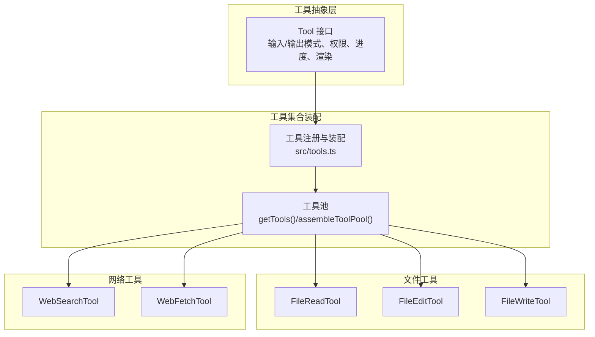
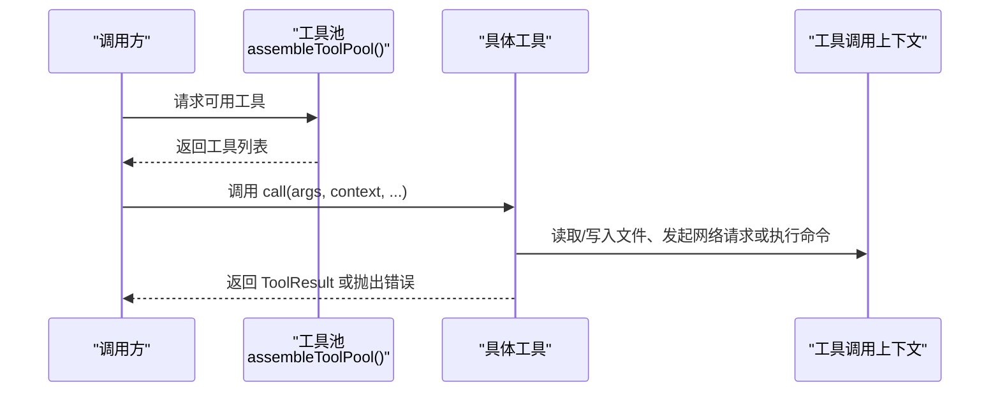
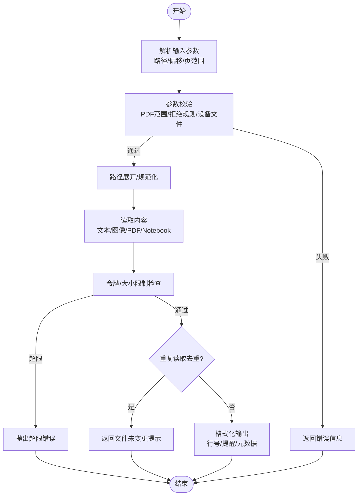
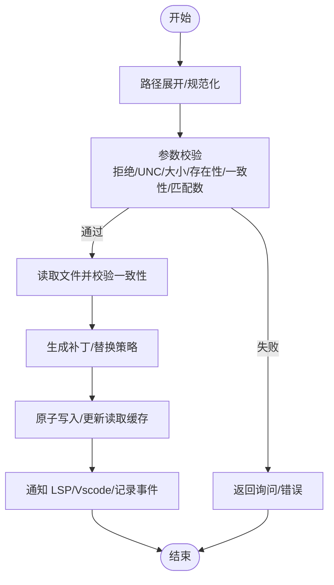
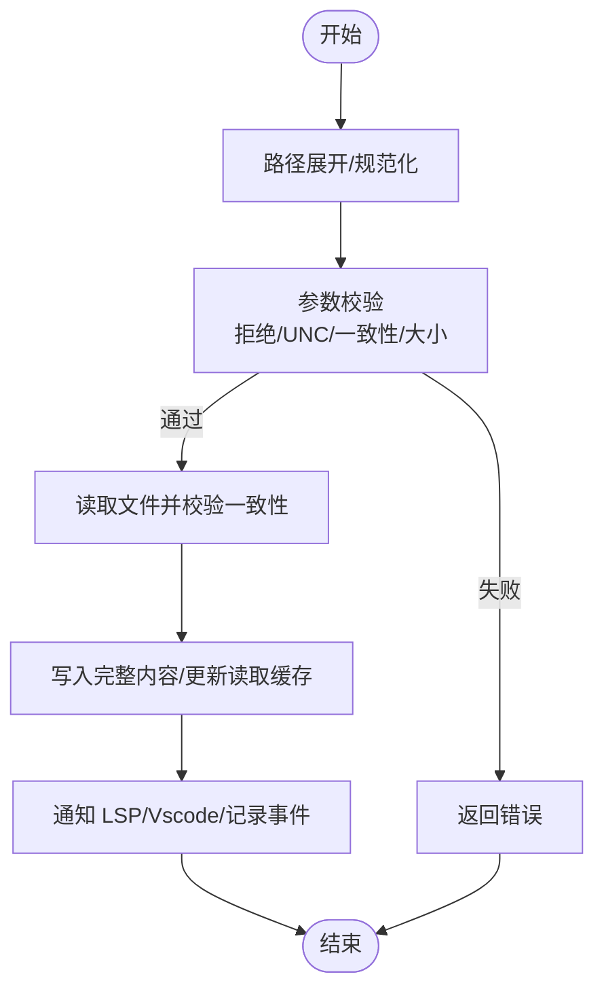
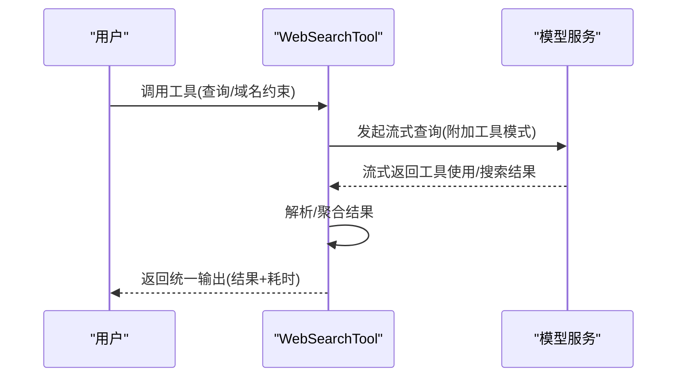
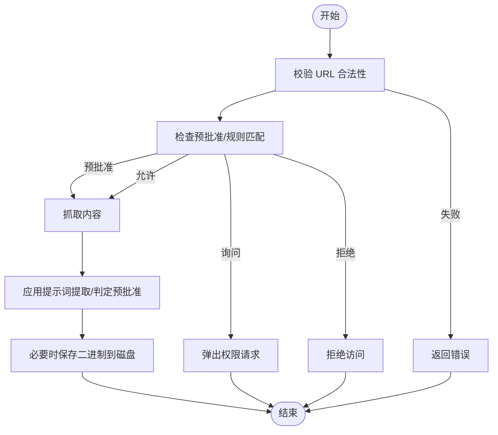
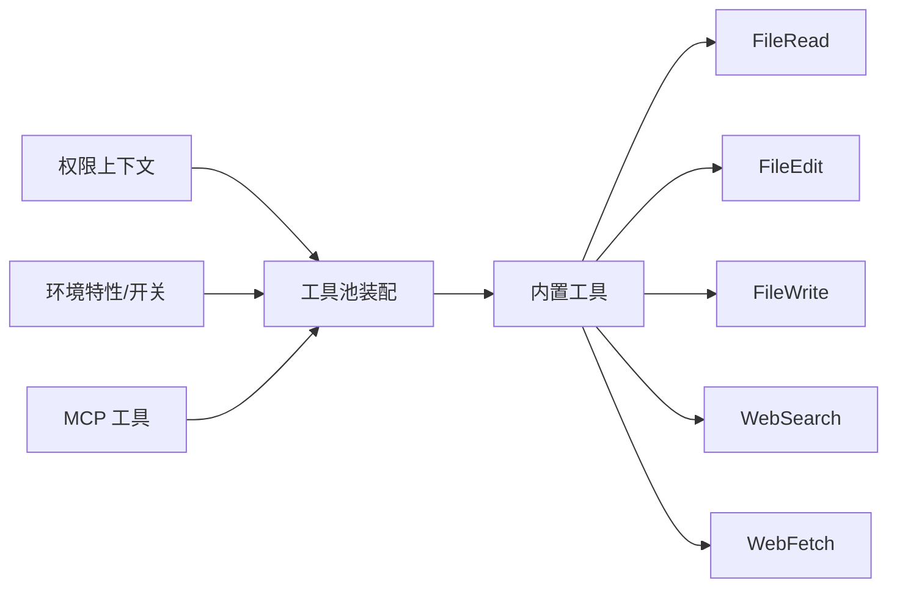

# 内置工具详解

<cite>
**本文档引用的文件**
- [src/tools.ts](file://src/tools.ts)
- [src/Tool.ts](file://src/Tool.ts)
- [src/tools/FileReadTool/FileReadTool.ts](file://src/tools/FileReadTool/FileReadTool.ts)
- [src/tools/FileEditTool/FileEditTool.ts](file://src/tools/FileEditTool/FileEditTool.ts)
- [src/tools/FileWriteTool/FileWriteTool.ts](file://src/tools/FileWriteTool/FileWriteTool.ts)
- [src/tools/WebSearchTool/WebSearchTool.ts](file://src/tools/WebSearchTool/WebSearchTool.ts)
- [src/tools/WebFetchTool/WebFetchTool.ts](file://src/tools/WebFetchTool/WebFetchTool.ts)
</cite>

## 目录
1. [简介](#简介)
2. [项目结构](#项目结构)
3. [核心组件](#核心组件)
4. [架构总览](#架构总览)
5. [详细组件分析](#详细组件分析)
6. [依赖关系分析](#依赖关系分析)
7. [性能考量](#性能考量)
8. [故障排查指南](#故障排查指南)
9. [结论](#结论)
10. [附录](#附录)

## 简介
本文件面向 Claude Code 内置工具系统的使用者与维护者，系统性梳理文件操作工具（FileRead、FileEdit、FileWrite）、系统工具（Bash、PowerShell）、网络工具（WebSearch、WebFetch）与代理工具（AgentTool）的设计理念、实现机制与使用场景。重点阐述工具的权限控制、安全沙箱、参数校验、错误处理与结果格式化，并给出最佳实践与性能优化建议。

## 项目结构
内置工具体系由统一的工具抽象层与具体工具实现组成：
- 工具抽象层：定义工具接口、输入输出模式、权限与进度回调等通用能力
- 工具集合装配：按运行环境与权限上下文动态组装可用工具集
- 具体工具：文件读写编辑、Web 搜索与抓取、命令行执行、代理编排等

图表来源
- [src/tools.ts:193-390](file://src/tools.ts#L193-L390)
- [src/Tool.ts:362-695](file://src/Tool.ts#L362-L695)

章节来源
- [src/tools.ts:193-390](file://src/tools.ts#L193-L390)
- [src/Tool.ts:362-695](file://src/Tool.ts#L362-L695)

## 核心组件
- 工具接口与默认行为
  - 工具通过统一接口声明名称、输入/输出模式、并发安全、只读/破坏性、权限检查、摘要与活动描述、渲染与错误消息等
  - 提供默认实现（如默认允许、非并发安全、非破坏性、默认权限放行），便于工具快速实现
- 工具装配与过滤
  - 基于权限上下文与环境特性（如是否启用 REPL、工作树模式、PowerShell 工具等）装配工具集
  - 支持拒绝规则过滤、去重（内置优先）、REPL 模式下隐藏原语工具等
- 运行时上下文
  - 工具调用上下文包含文件读缓存、命令列表、调试/思考配置、MCP 客户端与资源、会话状态更新器等

章节来源
- [src/Tool.ts:362-695](file://src/Tool.ts#L362-L695)
- [src/tools.ts:271-390](file://src/tools.ts#L271-L390)

## 架构总览
工具系统采用“抽象接口 + 动态装配 + 权限控制”的分层设计：
- 抽象层：Tool 接口定义工具能力边界
- 装配层：根据权限与特性生成工具池
- 执行层：工具在上下文中执行，支持进度回调、错误处理与结果渲染

图表来源
- [src/tools.ts:345-367](file://src/tools.ts#L345-L367)
- [src/Tool.ts:379-385](file://src/Tool.ts#L379-L385)

## 详细组件分析

### 文件读取工具（FileRead）
- 设计要点
  - 只读、并发安全；支持文本、图片、PDF、Jupyter Notebook 多类型输出
  - 输入参数：文件路径、偏移行、行数、PDF 页范围
  - 输出类型：文本、图像、PDF、拆分后的页面、文件未变更提示
  - 安全与限制：设备文件阻断、二进制扩展名检测、UNC 路径延迟处理、最大令牌与大小限制
  - 性能优化：重复读取去重、自动内存文件新鲜度前缀、令牌估算与实际计数结合
- 参数校验
  - PDF 页范围解析与上限检查
  - 路径展开与权限拒绝规则匹配
  - 设备文件路径阻断
- 错误处理
  - 文件不存在时尝试替代 macOS 截图路径变体，再回退相似文件与 CWD 建议
- 结果格式化
  - 文本：带行号、可选安全提醒、内存文件时间戳前缀
  - 图像/PDF：返回元数据或补充文档块参数
- 使用场景
  - 快速审阅大文件片段、提取 PDF 页面、查看图片尺寸信息、读取笔记本单元格

图表来源
- [src/tools/FileReadTool/FileReadTool.ts:418-495](file://src/tools/FileReadTool/FileReadTool.ts#L418-L495)
- [src/tools/FileReadTool/FileReadTool.ts:594-651](file://src/tools/FileReadTool/FileReadTool.ts#L594-L651)

章节来源
- [src/tools/FileReadTool/FileReadTool.ts:227-335](file://src/tools/FileReadTool/FileReadTool.ts#L227-L335)
- [src/tools/FileReadTool/FileReadTool.ts:398-495](file://src/tools/FileReadTool/FileReadTool.ts#L398-L495)
- [src/tools/FileReadTool/FileReadTool.ts:496-718](file://src/tools/FileReadTool/FileReadTool.ts#L496-L718)

### 文件编辑工具（FileEdit）
- 设计要点
  - 写入、并发不安全；基于上次读取状态进行一致性校验，避免竞态覆盖
  - 输入：目标路径、旧字符串、新字符串、是否全部替换
  - 输出：结构化补丁、原始文件内容、用户修改标记、可选 Git Diff
  - 安全与限制：UNC 路径延迟处理、过大文件保护、仅允许纯文本编辑（Notebook 交由专用工具）
- 参数校验
  - 旧新字符串相同、路径拒绝、UNC 路径、过大文件、文件存在性与空文件校验、必须先读取、内容一致性检查、多处匹配但未开启全部替换、设置文件内容合法性校验
- 错误处理
  - 文件不存在时提供相似文件与 CWD 建议；内容意外修改抛出明确错误
- 结果格式化
  - 成功后返回更新说明与结构化补丁；通知 LSP 与 VSCode 更新
- 使用场景
  - 在已知上下文中精确替换代码片段、批量替换、修复 linter 修改后的内容

图表来源
- [src/tools/FileEditTool/FileEditTool.ts:137-362](file://src/tools/FileEditTool/FileEditTool.ts#L137-L362)
- [src/tools/FileEditTool/FileEditTool.ts:387-595](file://src/tools/FileEditTool/FileEditTool.ts#L387-L595)

章节来源
- [src/tools/FileEditTool/FileEditTool.ts:86-132](file://src/tools/FileEditTool/FileEditTool.ts#L86-L132)
- [src/tools/FileEditTool/FileEditTool.ts:137-362](file://src/tools/FileEditTool/FileEditTool.ts#L137-L362)
- [src/tools/FileEditTool/FileEditTool.ts:387-595](file://src/tools/FileEditTool/FileEditTool.ts#L387-L595)

### 文件写入工具（FileWrite）
- 设计要点
  - 全量覆盖写入、并发不安全；严格一致性校验，确保写入前未被外部修改
  - 输入：绝对路径、完整内容
  - 输出：创建/更新标识、结构化补丁、原始内容、可选 Git Diff
  - 安全与限制：UNC 路径延迟处理、必须先读取、一致性检查、过大文件保护
- 参数校验
  - 团队记忆密钥检测、拒绝规则、UNC 路径、存在性与一致性检查
- 错误处理
  - 内容意外修改抛出明确错误
- 结果格式化
  - 创建：返回创建成功消息；更新：返回更新成功消息与结构化补丁
- 使用场景
  - 生成新文件、完全替换现有文件内容

图表来源
- [src/tools/FileWriteTool/FileWriteTool.ts:153-222](file://src/tools/FileWriteTool/FileWriteTool.ts#L153-L222)
- [src/tools/FileWriteTool/FileWriteTool.ts:223-417](file://src/tools/FileWriteTool/FileWriteTool.ts#L223-L417)

章节来源
- [src/tools/FileWriteTool/FileWriteTool.ts:94-142](file://src/tools/FileWriteTool/FileWriteTool.ts#L94-L142)
- [src/tools/FileWriteTool/FileWriteTool.ts:153-222](file://src/tools/FileWriteTool/FileWriteTool.ts#L153-L222)
- [src/tools/FileWriteTool/FileWriteTool.ts:223-417](file://src/tools/FileWriteTool/FileWriteTool.ts#L223-L417)

### Web 搜索工具（WebSearch）
- 设计要点
  - 只读、并发安全；通过专用工具模式调用模型执行搜索，支持域名白名单/黑名单
  - 输入：查询、允许域名列表、禁止域名列表
  - 输出：搜索结果与模型总结、耗时
  - 权限：需要显式授权，不同平台/模型支持情况不同
- 参数校验
  - 查询必填、不允许同时指定允许与禁止域名
- 错误处理
  - 搜索错误以文本形式反馈
- 结果格式化
  - 将服务器工具调用与搜索结果合并为统一输出结构
- 使用场景
  - 获取实时网络信息、对比多个来源、生成摘要

图表来源
- [src/tools/WebSearchTool/WebSearchTool.ts:254-400](file://src/tools/WebSearchTool/WebSearchTool.ts#L254-L400)

章节来源
- [src/tools/WebSearchTool/WebSearchTool.ts:25-74](file://src/tools/WebSearchTool/WebSearchTool.ts#L25-L74)
- [src/tools/WebSearchTool/WebSearchTool.ts:152-253](file://src/tools/WebSearchTool/WebSearchTool.ts#L152-L253)
- [src/tools/WebSearchTool/WebSearchTool.ts:254-400](file://src/tools/WebSearchTool/WebSearchTool.ts#L254-L400)

### Web 抓取工具（WebFetch）
- 设计要点
  - 只读、并发安全；对网页内容应用提示词提取，支持预批准主机与二进制内容落盘
  - 输入：URL、提示词
  - 输出：字节数、HTTP 状态码/文本、处理结果、耗时、URL
  - 权限：基于主机域名的规则匹配（允许/询问/拒绝），支持预批准主机
- 参数校验
  - URL 合法性检查
- 错误处理
  - 重定向到不同主机时提示改用新 URL 重新调用
- 结果格式化
  - 预批准且内容较短的 Markdown 直接返回；否则应用提示词提取
- 使用场景
  - 从公开网页抽取结构化信息、生成摘要、保存二进制内容以便后续分析

图表来源
- [src/tools/WebFetchTool/WebFetchTool.ts:191-204](file://src/tools/WebFetchTool/WebFetchTool.ts#L191-L204)
- [src/tools/WebFetchTool/WebFetchTool.ts:208-299](file://src/tools/WebFetchTool/WebFetchTool.ts#L208-L299)

章节来源
- [src/tools/WebFetchTool/WebFetchTool.ts:24-48](file://src/tools/WebFetchTool/WebFetchTool.ts#L24-L48)
- [src/tools/WebFetchTool/WebFetchTool.ts:104-180](file://src/tools/WebFetchTool/WebFetchTool.ts#L104-L180)
- [src/tools/WebFetchTool/WebFetchTool.ts:208-299](file://src/tools/WebFetchTool/WebFetchTool.ts#L208-L299)

### 代理工具（AgentTool）
- 设计要点
  - 用于编排与调度其他工具或子代理，支持代理定义加载、任务派发与结果汇总
  - 与工具系统集成：通过工具池装配、权限上下文传递、进度与结果渲染
- 使用场景
  - 复杂任务分解、跨工具协作、代理间通信与编排

章节来源
- [src/tools.ts:3-4](file://src/tools.ts#L3-L4)

## 依赖关系分析
- 工具装配依赖
  - 工具池装配函数依赖权限上下文、MCP 工具列表、特性开关与环境变量
  - 内置工具与 MCP 工具按名称去重，内置工具优先
- 工具内部依赖
  - 文件工具依赖文件系统实现、读取缓存、编码与换行符处理、LSP 与 VSCode 通知
  - 网络工具依赖模型服务、流式响应解析、权限规则与预批准主机列表
- 权限与安全
  - 统一的权限上下文与拒绝规则过滤在装配阶段生效
  - 工具在调用前进行输入校验与路径/UNC/设备文件等安全检查

图表来源
- [src/tools.ts:345-367](file://src/tools.ts#L345-L367)
- [src/tools.ts:271-327](file://src/tools.ts#L271-L327)

章节来源
- [src/tools.ts:271-367](file://src/tools.ts#L271-L367)

## 性能考量
- 文件读取
  - 重复读取去重显著减少缓存与传输开销；令牌估算与实际计数结合避免超限
  - 大文件建议使用偏移/限制参数或分段读取
- 文件写入/编辑
  - 严格一致性检查避免竞态；写入前后通知 LSP/Vscode，减少二次分析成本
  - 大文件写入需谨慎，建议先 Read 再 Write
- 网络工具
  - WebSearch 使用流式响应，逐步产出进度；合理设置思考配置与工具选择
  - WebFetch 对预批准主机与小体量 Markdown 直接返回，减少处理开销

## 故障排查指南
- 文件读取
  - “文件不存在”：检查路径是否正确，留意 macOS 截图中空格字符差异；参考相似文件与 CWD 建议
  - “超出令牌限制”：使用 offset/limit 或 pages 参数缩小范围
  - “设备文件阻断”：避免读取 /dev/zero、/dev/random 等
- 文件编辑/写入
  - “文件已被修改”：先重新 Read，确认内容一致后再写入
  - “过大文件”：超过最大可编辑大小限制时，考虑拆分或使用其他方式
  - “字符串未找到”：提供更上下文或开启 replace_all
- Web 搜索
  - “缺少查询”或“域名冲突”：修正输入参数
  - “模型不支持”：检查当前平台/模型是否支持 WebSearch
- Web 抓取
  - “URL 无效”：检查 URL 格式
  - “重定向到不同主机”：按提示使用新 URL 重新调用

章节来源
- [src/tools/FileReadTool/FileReadTool.ts:418-495](file://src/tools/FileReadTool/FileReadTool.ts#L418-L495)
- [src/tools/FileEditTool/FileEditTool.ts:137-362](file://src/tools/FileEditTool/FileEditTool.ts#L137-L362)
- [src/tools/FileWriteTool/FileWriteTool.ts:153-222](file://src/tools/FileWriteTool/FileWriteTool.ts#L153-L222)
- [src/tools/WebSearchTool/WebSearchTool.ts:235-253](file://src/tools/WebSearchTool/WebSearchTool.ts#L235-L253)
- [src/tools/WebFetchTool/WebFetchTool.ts:191-204](file://src/tools/WebFetchTool/WebFetchTool.ts#L191-L204)

## 结论
内置工具系统通过统一抽象、灵活装配与严格的权限控制，实现了在安全沙箱内高效、可控地执行文件操作、系统命令与网络请求。文件工具强调一致性与去重优化，网络工具注重权限与流式处理，代理工具提供编排能力。遵循参数校验、先读取后写入、最小权限原则与合理的超时/大小限制，可获得稳定可靠的使用体验。

## 附录
- 最佳实践
  - 文件操作：始终先 Read 再 Write/Edit，避免竞态；对大文件使用分段读取与增量写入
  - 网络工具：明确域名白名单/黑名单；对私有/认证页面使用专门的 MCP 工具
  - 权限管理：利用规则系统精细化控制工具使用，避免过度授权
- 性能优化
  - 合理设置文件读取范围与令牌上限
  - 利用工具池去重与装配稳定性，减少重复加载
  - 使用流式响应与进度回调，提升交互体验