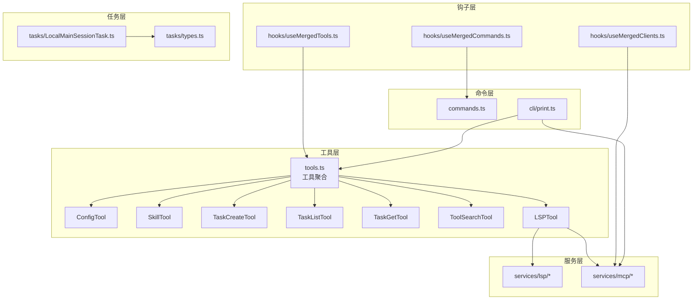
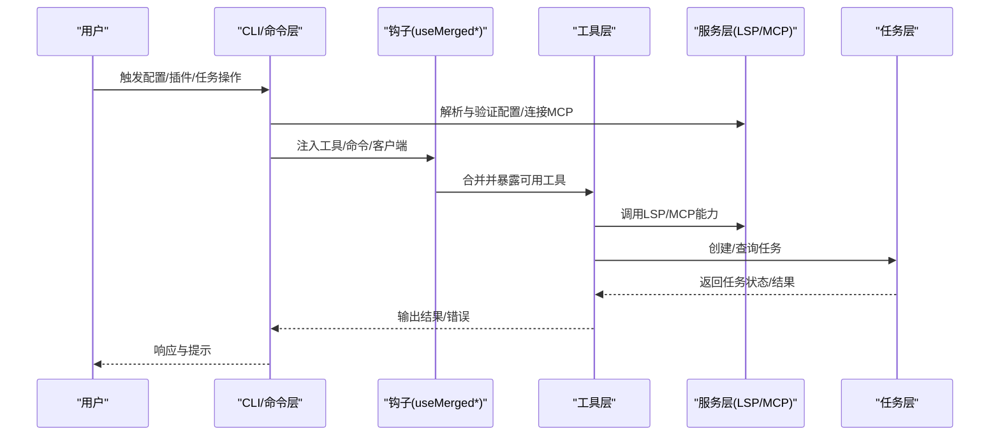
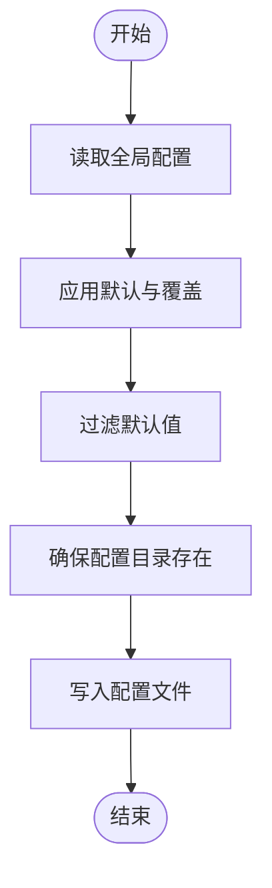
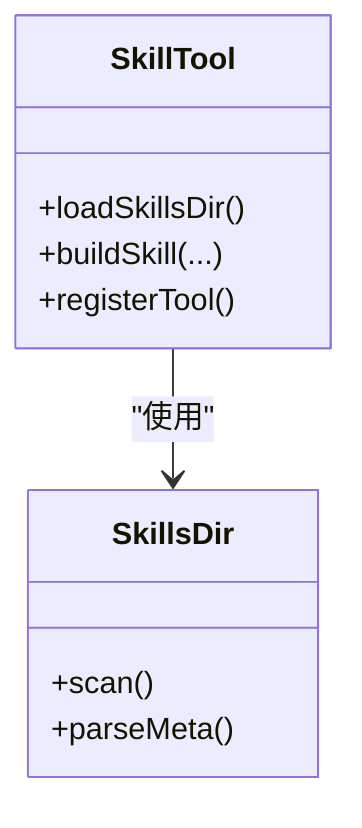
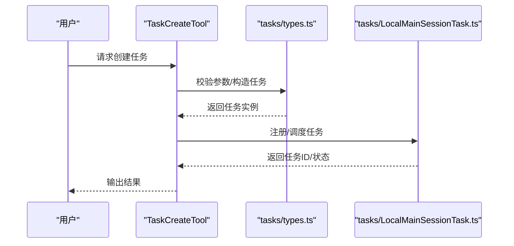
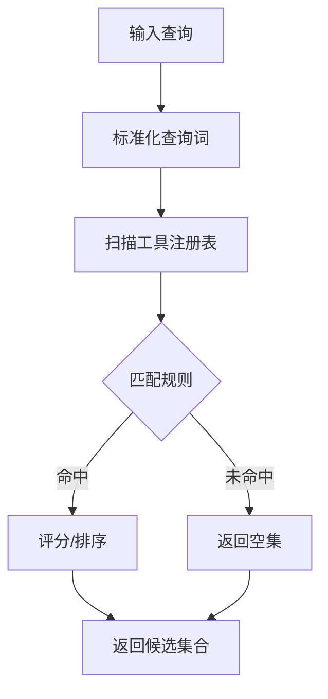
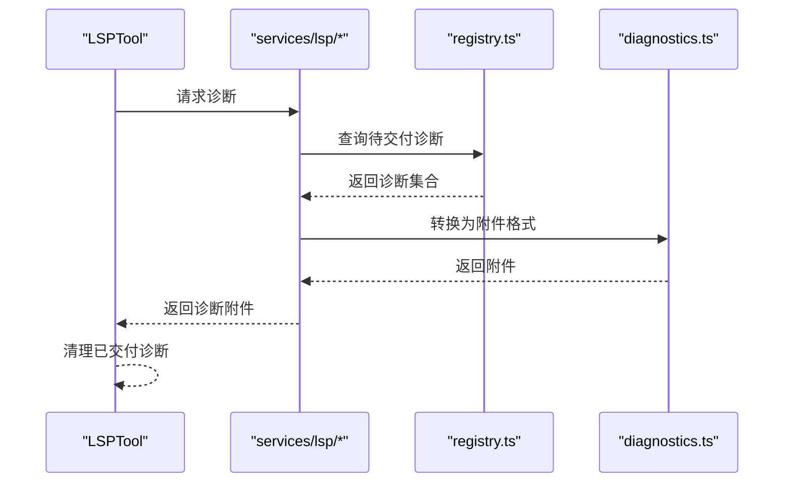
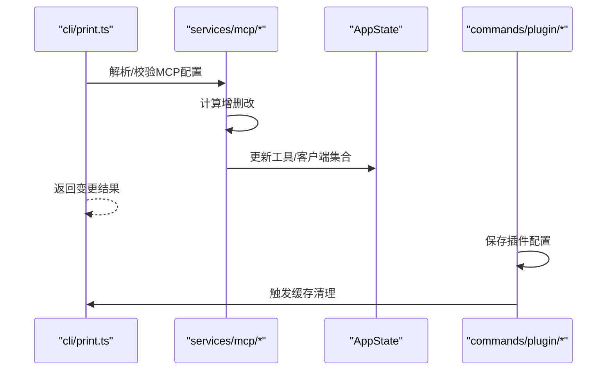
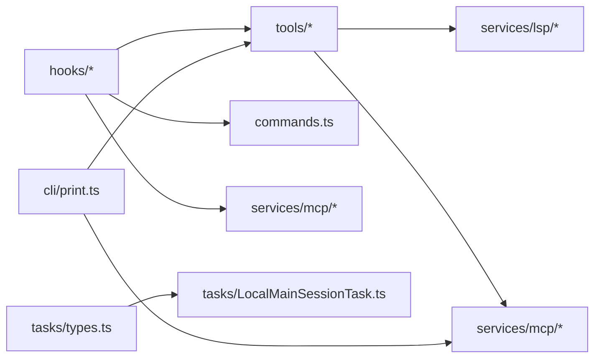

# 实用工具和辅助工具

<cite>
**本文引用的文件**
- [src/tools/ConfigTool/index.ts](file://src/tools/ConfigTool/index.ts)
- [src/tools/SkillTool/index.ts](file://src/tools/SkillTool/index.ts)
- [src/tools/TaskCreateTool/index.ts](file://src/tools/TaskCreateTool/index.ts)
- [src/tools/TaskListTool/index.ts](file://src/tools/TaskListTool/index.ts)
- [src/tools/TaskGetTool/index.ts](file://src/tools/TaskGetTool/index.ts)
- [src/tools/ToolSearchTool/index.ts](file://src/tools/ToolSearchTool/index.ts)
- [src/tools/LSPTool/index.ts](file://src/tools/LSPTool/index.ts)
- [src/services/lsp/index.ts](file://src/services/lsp/index.ts)
- [src/services/lsp/types.ts](file://src/services/lsp/types.ts)
- [src/services/lsp/diagnostics.ts](file://src/services/lsp/diagnostics.ts)
- [src/services/lsp/registry.ts](file://src/services/lsp/registry.ts)
- [src/services/mcp/index.ts](file://src/services/mcp/index.ts)
- [src/services/mcp/types.ts](file://src/services/mcp/types.ts)
- [src/services/mcp/client.ts](file://src/services/mcp/client.ts)
- [src/services/mcp/server.ts](file://src/services/mcp/server.ts)
- [src/hooks/useMergedTools.ts](file://src/hooks/useMergedTools.ts)
- [src/hooks/useMergedCommands.ts](file://src/hooks/useMergedCommands.ts)
- [src/hooks/useMergedClients.ts](file://src/hooks/useMergedClients.ts)
- [src/utils/config.ts](file://src/utils/config.ts)
- [src/utils/attachments.ts](file://src/utils/attachments.ts)
- [src/main.tsx](file://src/main.tsx)
- [src/cli/print.ts](file://src/cli/print.ts)
- [src/commands/plugin/ManagePlugins.tsx](file://src/commands/plugin/ManagePlugins.tsx)
- [src/commands/plugin/PluginOptionsFlow.tsx](file://src/commands/plugin/PluginOptionsFlow.tsx)
- [src/tasks/types.ts](file://src/tasks/types.ts)
- [src/tasks/LocalMainSessionTask.ts](file://src/tasks/LocalMainSessionTask.ts)
- [src/tools.ts](file://src/tools.ts)
- [src/commands.ts](file://src/commands.ts)
</cite>

## 目录
1. 引言
2. 项目结构
3. 核心组件
4. 架构总览
5. 详细组件分析
6. 依赖关系分析
7. 性能考量
8. 故障排查指南
9. 结论
10. 附录

## 引言
本文件面向实用工具与辅助工具的技术文档，聚焦以下能力：
- 配置管理（Config）
- 技能工具（Skill）
- 任务管理（TaskCreate/List/Get）
- 工具搜索（ToolSearch）
- 语言服务器协议（LSP）工具

内容涵盖工具发现机制、配置验证与任务调度算法，并给出工具链集成、依赖管理与版本兼容性的处理建议，以及使用最佳实践与扩展开发指南。

## 项目结构
本项目采用“按功能域分层 + 按职责模块化”的组织方式：
- 工具层：位于 src/tools 下，每个工具以独立目录实现，统一通过工具注册表暴露接口
- 服务层：位于 src/services，封装外部系统能力（如 LSP、MCP 等），提供稳定抽象
- 钩子层：位于 src/hooks，负责合并与注入工具、命令、客户端等运行时资源
- 命令层：位于 src/commands，提供 CLI 与 UI 的交互入口
- 任务层：位于 src/tasks，定义任务类型与生命周期管理
- 工具与命令聚合：src/tools.ts 与 src/commands.ts 统一导出

图表来源
- [src/tools.ts](file://src/tools.ts)
- [src/commands.ts](file://src/commands.ts)
- [src/hooks/useMergedTools.ts](file://src/hooks/useMergedTools.ts)
- [src/hooks/useMergedCommands.ts](file://src/hooks/useMergedCommands.ts)
- [src/hooks/useMergedClients.ts](file://src/hooks/useMergedClients.ts)
- [src/services/lsp/index.ts](file://src/services/lsp/index.ts)
- [src/services/mcp/index.ts](file://src/services/mcp/index.ts)
- [src/cli/print.ts](file://src/cli/print.ts)
- [src/tasks/types.ts](file://src/tasks/types.ts)
- [src/tasks/LocalMainSessionTask.ts](file://src/tasks/LocalMainSessionTask.ts)

章节来源
- [src/tools.ts](file://src/tools.ts)
- [src/commands.ts](file://src/commands.ts)
- [src/hooks/useMergedTools.ts](file://src/hooks/useMergedTools.ts)
- [src/hooks/useMergedCommands.ts](file://src/hooks/useMergedCommands.ts)
- [src/hooks/useMergedClients.ts](file://src/hooks/useMergedClients.ts)
- [src/services/lsp/index.ts](file://src/services/lsp/index.ts)
- [src/services/mcp/index.ts](file://src/services/mcp/index.ts)
- [src/cli/print.ts](file://src/cli/print.ts)
- [src/tasks/types.ts](file://src/tasks/types.ts)
- [src/tasks/LocalMainSessionTask.ts](file://src/tasks/LocalMainSessionTask.ts)

## 核心组件
- 配置管理（ConfigTool）：提供读取、校验与持久化配置的能力，支持默认值过滤与增量保存
- 技能工具（SkillTool）：封装技能加载、匹配与执行流程，支持技能目录扫描与动态构建
- 任务管理（TaskCreate/List/Get）：提供任务创建、列表查询与详情获取，结合任务类型与调度器
- 工具搜索（ToolSearch）：基于名称、描述与标签进行工具检索，支持模糊匹配与排序
- LSP 工具（LSPTool）：桥接 LSP 能力，提供诊断收集、文件打开与异步附件生成

章节来源
- [src/tools/ConfigTool/index.ts](file://src/tools/ConfigTool/index.ts)
- [src/tools/SkillTool/index.ts](file://src/tools/SkillTool/index.ts)
- [src/tools/TaskCreateTool/index.ts](file://src/tools/TaskCreateTool/index.ts)
- [src/tools/TaskListTool/index.ts](file://src/tools/TaskListTool/index.ts)
- [src/tools/TaskGetTool/index.ts](file://src/tools/TaskGetTool/index.ts)
- [src/tools/ToolSearchTool/index.ts](file://src/tools/ToolSearchTool/index.ts)
- [src/tools/LSPTool/index.ts](file://src/tools/LSPTool/index.ts)

## 架构总览
下图展示工具链集成与关键交互：工具通过钩子注入到运行时；CLI 与命令层负责配置变更与动态 MCP 服务器管理；LSP/MCP 服务提供外部能力；任务层承载调度与状态。

图表来源
- [src/cli/print.ts](file://src/cli/print.ts)
- [src/hooks/useMergedTools.ts](file://src/hooks/useMergedTools.ts)
- [src/hooks/useMergedCommands.ts](file://src/hooks/useMergedCommands.ts)
- [src/hooks/useMergedClients.ts](file://src/hooks/useMergedClients.ts)
- [src/services/lsp/index.ts](file://src/services/lsp/index.ts)
- [src/services/mcp/index.ts](file://src/services/mcp/index.ts)
- [src/tools.ts](file://src/tools.ts)
- [src/tasks/types.ts](file://src/tasks/types.ts)

## 详细组件分析

### 配置管理（Config）
- 功能要点
  - 默认值过滤：仅保存与默认值不同的配置项，减少冗余
  - 目录确保与写入：在写入前确保配置目录存在
  - 远程控制启动策略：优先用户显式配置，其次特性门控默认，否则禁用
  - 自定义密钥审批状态：维护“已批准/已拒绝/新”三态
- 关键流程
  - 读取全局配置
  - 应用默认值与覆盖
  - 过滤并持久化
  - 提供查询接口（如远程控制 at startup）

图表来源
- [src/utils/config.ts](file://src/utils/config.ts)

章节来源
- [src/utils/config.ts](file://src/utils/config.ts)

### 技能工具（Skill）
- 功能要点
  - 技能目录扫描与加载
  - 技能元数据与构建器解析
  - 与工具注册表的集成，便于在会话中调用
- 扩展建议
  - 新增技能时遵循目录规范与元数据约定
  - 使用构建器生成工具签名与参数约束

图表来源
- [src/tools/SkillTool/index.ts](file://src/tools/SkillTool/index.ts)
- [src/skills/loadSkillsDir.ts](file://src/skills/loadSkillsDir.ts)
- [src/skills/bundledSkills.ts](file://src/skills/bundledSkills.ts)

章节来源
- [src/tools/SkillTool/index.ts](file://src/tools/SkillTool/index.ts)
- [src/skills/loadSkillsDir.ts](file://src/skills/loadSkillsDir.ts)
- [src/skills/bundledSkills.ts](file://src/skills/bundledSkills.ts)

### 任务管理（TaskCreate/List/Get）
- 功能要点
  - 创建：构造任务对象，设置初始状态与参数
  - 列表：按条件筛选与排序，返回任务摘要
  - 获取：根据标识符返回完整任务信息
- 类型与调度
  - 任务类型定义于任务层，包含状态机与生命周期钩子
  - 主会话任务作为核心调度单元，承载主要工作流

图表来源
- [src/tools/TaskCreateTool/index.ts](file://src/tools/TaskCreateTool/index.ts)
- [src/tools/TaskListTool/index.ts](file://src/tools/TaskListTool/index.ts)
- [src/tools/TaskGetTool/index.ts](file://src/tools/TaskGetTool/index.ts)
- [src/tasks/types.ts](file://src/tasks/types.ts)
- [src/tasks/LocalMainSessionTask.ts](file://src/tasks/LocalMainSessionTask.ts)

章节来源
- [src/tools/TaskCreateTool/index.ts](file://src/tools/TaskCreateTool/index.ts)
- [src/tools/TaskListTool/index.ts](file://src/tools/TaskListTool/index.ts)
- [src/tools/TaskGetTool/index.ts](file://src/tools/TaskGetTool/index.ts)
- [src/tasks/types.ts](file://src/tasks/types.ts)
- [src/tasks/LocalMainSessionTask.ts](file://src/tasks/LocalMainSessionTask.ts)

### 工具搜索（ToolSearch）
- 功能要点
  - 基于名称、描述与标签的检索
  - 支持模糊匹配与排序，提升可用性
- 集成点
  - 与工具注册表联动，提供动态搜索体验

图表来源
- [src/tools/ToolSearchTool/index.ts](file://src/tools/ToolSearchTool/index.ts)
- [src/tools.ts](file://src/tools.ts)

章节来源
- [src/tools/ToolSearchTool/index.ts](file://src/tools/ToolSearchTool/index.ts)
- [src/tools.ts](file://src/tools.ts)

### LSP 工具与服务
- 功能要点
  - 诊断收集：从 LSP 服务器获取诊断并转换为附件
  - 文件打开：确保编辑器中已打开目标文件以启用语言服务
  - 异步附件：遵循异步钩子注册模式，避免内存泄漏
- 服务层
  - LSP 服务提供统一入口，封装连接、订阅与事件派发
  - 诊断服务支持批量与增量更新，提供清理与去重

图表来源
- [src/tools/LSPTool/index.ts](file://src/tools/LSPTool/index.ts)
- [src/services/lsp/index.ts](file://src/services/lsp/index.ts)
- [src/services/lsp/registry.ts](file://src/services/lsp/registry.ts)
- [src/services/lsp/diagnostics.ts](file://src/services/lsp/diagnostics.ts)
- [src/utils/attachments.ts](file://src/utils/attachments.ts)

章节来源
- [src/tools/LSPTool/index.ts](file://src/tools/LSPTool/index.ts)
- [src/services/lsp/index.ts](file://src/services/lsp/index.ts)
- [src/services/lsp/types.ts](file://src/services/lsp/types.ts)
- [src/services/lsp/diagnostics.ts](file://src/services/lsp/diagnostics.ts)
- [src/services/lsp/registry.ts](file://src/services/lsp/registry.ts)
- [src/utils/attachments.ts](file://src/utils/attachments.ts)

### MCP 服务与动态配置
- 动态 MCP 管理
  - 支持从 JSON 字符串或文件路径解析配置
  - 对比当前状态与期望状态，计算增删改
  - 清理旧客户端与工具，注入新工具与客户端
- 插件与配置
  - 插件选项流提供配置表单与保存逻辑
  - 管理界面支持保存并刷新缓存

图表来源
- [src/cli/print.ts](file://src/cli/print.ts)
- [src/services/mcp/index.ts](file://src/services/mcp/index.ts)
- [src/services/mcp/types.ts](file://src/services/mcp/types.ts)
- [src/services/mcp/client.ts](file://src/services/mcp/client.ts)
- [src/services/mcp/server.ts](file://src/services/mcp/server.ts)
- [src/commands/plugin/ManagePlugins.tsx](file://src/commands/plugin/ManagePlugins.tsx)
- [src/commands/plugin/PluginOptionsFlow.tsx](file://src/commands/plugin/PluginOptionsFlow.tsx)

章节来源
- [src/cli/print.ts](file://src/cli/print.ts)
- [src/services/mcp/index.ts](file://src/services/mcp/index.ts)
- [src/services/mcp/types.ts](file://src/services/mcp/types.ts)
- [src/services/mcp/client.ts](file://src/services/mcp/client.ts)
- [src/services/mcp/server.ts](file://src/services/mcp/server.ts)
- [src/commands/plugin/ManagePlugins.tsx](file://src/commands/plugin/ManagePlugins.tsx)
- [src/commands/plugin/PluginOptionsFlow.tsx](file://src/commands/plugin/PluginOptionsFlow.tsx)

## 依赖关系分析
- 工具层依赖服务层提供的 LSP/MCP 能力
- 钩子层负责将工具、命令与客户端合并注入运行时
- CLI 层负责配置解析与动态 MCP 管理
- 任务层提供统一的任务类型与调度抽象

图表来源
- [src/tools.ts](file://src/tools.ts)
- [src/hooks/useMergedTools.ts](file://src/hooks/useMergedTools.ts)
- [src/hooks/useMergedCommands.ts](file://src/hooks/useMergedCommands.ts)
- [src/hooks/useMergedClients.ts](file://src/hooks/useMergedClients.ts)
- [src/services/lsp/index.ts](file://src/services/lsp/index.ts)
- [src/services/mcp/index.ts](file://src/services/mcp/index.ts)
- [src/cli/print.ts](file://src/cli/print.ts)
- [src/tasks/types.ts](file://src/tasks/types.ts)
- [src/tasks/LocalMainSessionTask.ts](file://src/tasks/LocalMainSessionTask.ts)

章节来源
- [src/tools.ts](file://src/tools.ts)
- [src/hooks/useMergedTools.ts](file://src/hooks/useMergedTools.ts)
- [src/hooks/useMergedCommands.ts](file://src/hooks/useMergedCommands.ts)
- [src/hooks/useMergedClients.ts](file://src/hooks/useMergedClients.ts)
- [src/services/lsp/index.ts](file://src/services/lsp/index.ts)
- [src/services/mcp/index.ts](file://src/services/mcp/index.ts)
- [src/cli/print.ts](file://src/cli/print.ts)
- [src/tasks/types.ts](file://src/tasks/types.ts)
- [src/tasks/LocalMainSessionTask.ts](file://src/tasks/LocalMainSessionTask.ts)

## 性能考量
- 配置写入优化：仅保存非默认值，降低 IO 与存储开销
- 诊断附件清理：交付后及时清理，避免累积增长导致内存压力
- 工具搜索：建立索引与评分缓存，减少重复计算
- 任务调度：采用轻量状态机与异步处理，避免阻塞主线程
- MCP 动态管理：批量对比与增量更新，减少不必要的重连与重建

## 故障排查指南
- 配置问题
  - 现象：配置未生效或被覆盖
  - 排查：确认默认值过滤是否正确；检查目录权限与写入异常
- LSP 诊断缺失
  - 现象：无法获取诊断或附件为空
  - 排查：确认文件已在 IDE 中打开；检查 LSP 服务器连接状态；验证诊断注册表是否清理
- MCP 动态变更失败
  - 现象：新增/删除服务器后工具未更新
  - 排查：核对配置解析与比较逻辑；确认旧客户端清理与新工具注入流程
- 插件配置保存失败
  - 现象：保存后无变化或报错
  - 排查：检查表单 schema 与保存函数；确认缓存清理与重新加载流程

章节来源
- [src/utils/config.ts](file://src/utils/config.ts)
- [src/utils/attachments.ts](file://src/utils/attachments.ts)
- [src/cli/print.ts](file://src/cli/print.ts)
- [src/commands/plugin/ManagePlugins.tsx](file://src/commands/plugin/ManagePlugins.tsx)
- [src/commands/plugin/PluginOptionsFlow.tsx](file://src/commands/plugin/PluginOptionsFlow.tsx)

## 结论
本文件梳理了配置管理、技能工具、任务管理、工具搜索与 LSP 工具的实现机制与集成路径。通过钩子注入、服务抽象与动态配置管理，系统实现了高内聚、低耦合的工具链架构。建议在扩展新工具或服务时遵循现有模式，确保一致性与可维护性。

## 附录
- 最佳实践
  - 工具开发：遵循统一的工具签名与参数约束，提供清晰的错误信息
  - 配置管理：使用默认值过滤与显式覆盖策略，避免冗余配置
  - 诊断与附件：及时清理已交付诊断，防止内存泄漏
  - MCP 管理：采用批量对比与增量更新，减少系统抖动
- 扩展开发指南
  - 新增工具：在 tools 目录下创建工具目录，注册到工具聚合文件
  - 新增服务：在 services 下新增子模块，提供稳定的对外接口
  - 集成钩子：在 hooks 中实现合并逻辑，确保运行时注入正确
  - CLI 集成：在命令层添加对应命令，支持动态配置与工具管理