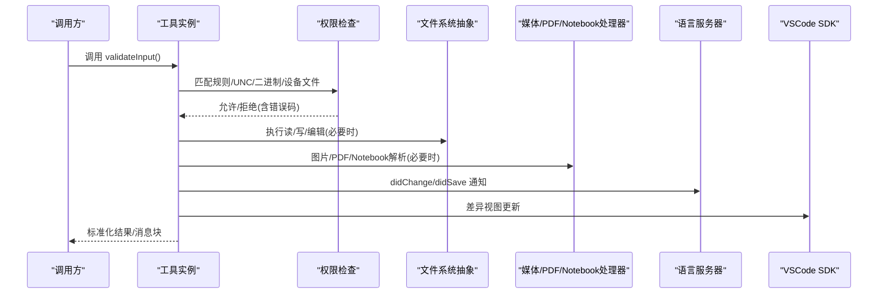
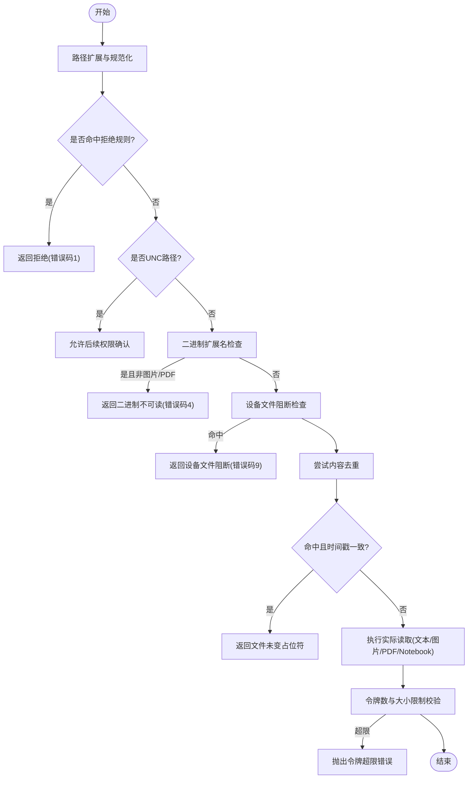
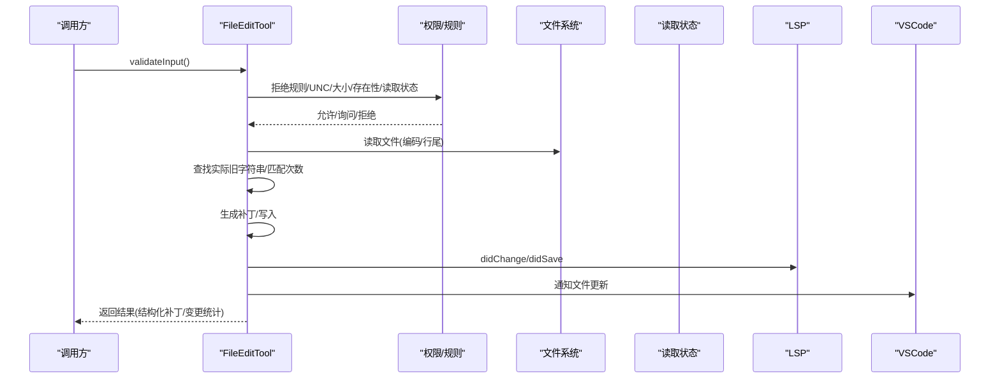
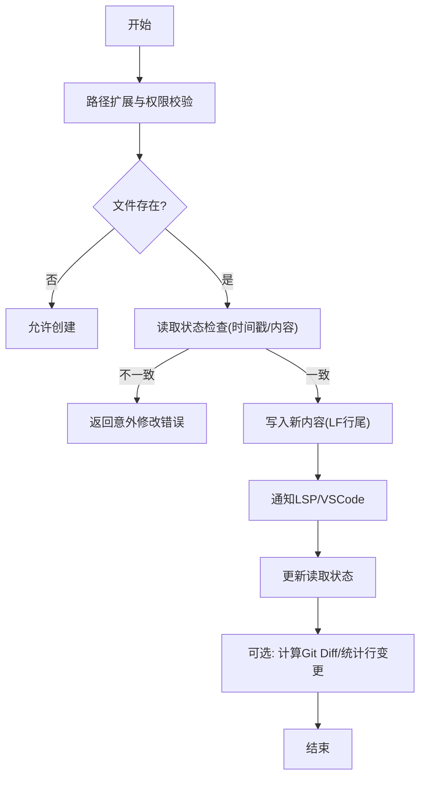
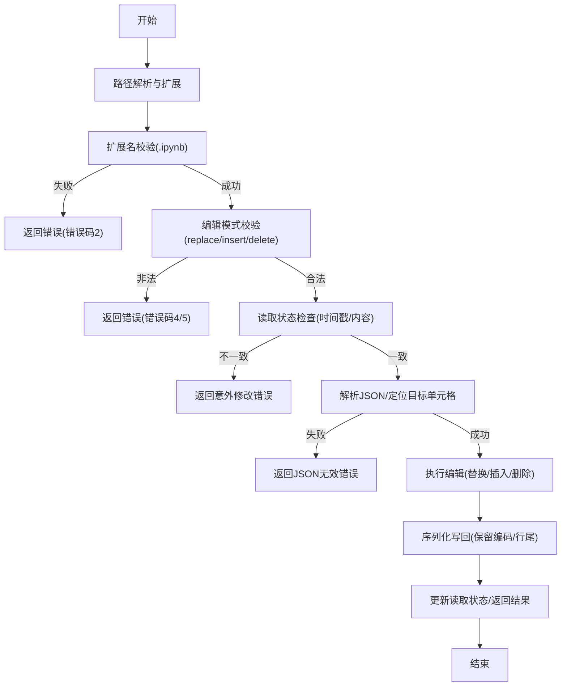
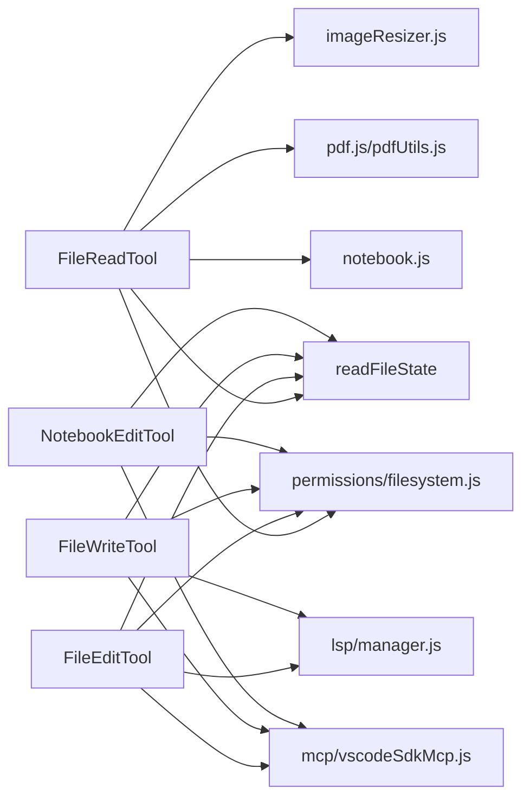

# 文件操作工具

<cite>
**本文引用的文件**
- [src/tools/FileReadTool/FileReadTool.ts](file://src/tools/FileReadTool/FileReadTool.ts)
- [src/tools/FileReadTool/limits.ts](file://src/tools/FileReadTool/limits.ts)
- [src/tools/FileReadTool/prompt.ts](file://src/tools/FileReadTool/prompt.ts)
- [src/tools/FileReadTool/UI.tsx](file://src/tools/FileReadTool/UI.tsx)
- [src/tools/FileReadTool/imageProcessor.ts](file://src/tools/FileReadTool/imageProcessor.ts)
- [src/tools/FileEditTool/FileEditTool.ts](file://src/tools/FileEditTool/FileEditTool.ts)
- [src/tools/FileEditTool/types.ts](file://src/tools/FileEditTool/types.ts)
- [src/tools/FileEditTool/utils.ts](file://src/tools/FileEditTool/utils.ts)
- [src/tools/FileEditTool/UI.tsx](file://src/tools/FileEditTool/UI.tsx)
- [src/tools/FileEditTool/constants.ts](file://src/tools/FileEditTool/constants.ts)
- [src/tools/FileWriteTool/FileWriteTool.ts](file://src/tools/FileWriteTool/FileWriteTool.ts)
- [src/tools/FileWriteTool/UI.tsx](file://src/tools/FileWriteTool/UI.tsx)
- [src/tools/FileWriteTool/prompt.ts](file://src/tools/FileWriteTool/prompt.ts)
- [src/tools/NotebookEditTool/NotebookEditTool.ts](file://src/tools/NotebookEditTool/NotebookEditTool.ts)
- [src/tools/NotebookEditTool/constants.ts](file://src/tools/NotebookEditTool/constants.ts)
- [src/tools/NotebookEditTool/UI.tsx](file://src/tools/NotebookEditTool/UI.tsx)
- [src/utils/file.js](file://src/utils/file.js)
- [src/utils/fileRead.js](file://src/utils/fileRead.js)
- [src/utils/fsOperations.js](file://src/utils/fsOperations.js)
- [src/utils/permissions/filesystem.js](file://src/utils/permissions/filesystem.js)
- [src/utils/permissions/shellRuleMatching.js](file://src/utils/permissions/shellRuleMatching.js)
- [src/utils/pdf.js](file://src/utils/pdf.js)
- [src/utils/pdfUtils.js](file://src/utils/pdfUtils.js)
- [src/utils/imageResizer.js](file://src/utils/imageResizer.js)
- [src/utils/notebook.js](file://src/utils/notebook.js)
- [src/utils/diff.js](file://src/utils/diff.js)
- [src/utils/gitDiff.js](file://src/utils/gitDiff.js)
- [src/utils/fileOperationAnalytics.js](file://src/utils/fileOperationAnalytics.js)
- [src/utils/tokenEstimation.js](file://src/utils/tokenEstimation.js)
- [src/constants/files.js](file://src/constants/files.js)
- [src/constants/apiLimits.ts](file://src/constants/apiLimits.ts)
- [src/services/analytics/index.js](file://src/services/analytics/index.js)
- [src/services/analytics/growthbook.js](file://src/services/analytics/growthbook.js)
- [src/services/lsp/manager.js](file://src/services/lsp/manager.js)
- [src/services/mcp/vscodeSdkMcp.js](file://src/services/mcp/vscodeSdkMcp.js)
- [src/services/teamMemorySync/teamMemSecretGuard.js](file://src/services/teamMemorySync/teamMemSecretGuard.js)
- [src/skills/loadSkillsDir.js](file://src/skills/loadSkillsDir.js)
- [src/utils/memoryFileDetection.js](file://src/utils/memoryFileDetection.js)
- [src/utils/model/model.js](file://src/utils/model/model.js)
- [src/utils/readFileInRange.js](file://src/utils/readFileInRange.js)
- [src/utils/format.js](file://src/utils/format.js)
- [src/utils/errors.js](file://src/utils/errors.js)
- [src/utils/cwd.js](file://src/utils/cwd.js)
- [src/utils/envUtils.js](file://src/utils/envUtils.js)
- [src/utils/lazySchema.js](file://src/utils/lazySchema.js)
- [src/utils/log.js](file://src/utils/log.js)
- [src/utils/debug.js](file://src/utils/debug.js)
- [src/utils/json.js](file://src/utils/json.js)
- [src/utils/path.js](file://src/utils/path.js)
- [src/utils/slowOperations.js](file://src/utils/slowOperations.js)
- [src/utils/semanticNumber.js](file://src/utils/semanticNumber.js)
- [src/utils/fileHistory.js](file://src/utils/fileHistory.js)
- [src/memdir/memoryAge.js](file://src/memdir/memoryAge.js)
</cite>

## 目录
1. [简介](#简介)
2. [项目结构](#项目结构)
3. [核心组件](#核心组件)
4. [架构总览](#架构总览)
5. [详细组件分析](#详细组件分析)
6. [依赖关系分析](#依赖关系分析)
7. [性能考量](#性能考量)
8. [故障排查指南](#故障排查指南)
9. [结论](#结论)
10. [附录](#附录)

## 简介
本技术文档围绕文件操作工具集展开，重点覆盖以下能力：
- 文件读取（FileRead）：支持文本、图片、PDF、Jupyter Notebook 的多格式读取；具备路径校验、大小与令牌数限制、设备文件阻断、内容去重、自动技能发现与激活等功能。
- 文件编辑（FileEdit）：在“先读取后编辑”的约束下进行精确替换，支持单次或全部替换，具备冲突检测、编码与行尾处理、LSP/VSC通知、变更统计与可选 Git Diff。
- 文件写入（FileWrite）：覆盖式写入，要求先读取再写入以避免并发修改；支持变更前后对比与 LSP/VSC 通知。
- 笔记本编辑（NotebookEdit）：针对 .ipynb 的单元格级编辑（替换、插入、删除），具备严格输入校验与 JSON 结构保护。

文档将从架构、数据流、处理逻辑、权限与安全、错误处理与性能优化等方面进行系统化阐述，并提供最佳实践与排障建议。

## 项目结构
文件操作工具位于 src/tools 下，每个工具由一个主入口文件与配套模块组成（类型定义、提示词、UI、常量、工具函数等）。通用能力通过 src/utils 与 src/services 提供，如文件系统抽象、权限规则匹配、PDF/图像处理、LSP/VSC 集成、分析埋点等。

```mermaid
graph TB
subgraph "工具层"
FR["FileReadTool.ts"]
FE["FileEditTool.ts"]
FW["FileWriteTool.ts"]
NB["NotebookEditTool.ts"]
end
subgraph "通用工具"
UFS["fsOperations.js"]
UFILE["file.js"]
UREAD["fileRead.js"]
UPERM["permissions/filesystem.js"]
UPDF["pdf.js / pdfUtils.js"]
UIMG["imageResizer.js"]
UNB["notebook.js"]
UDIF["diff.js / gitDiff.js"]
UANL["fileOperationAnalytics.js"]
UTOK["tokenEstimation.js"]
end
subgraph "服务与配置"
SANA["services/analytics/index.js"]
SGRO["services/analytics/growthbook.js"]
SLSP["services/lsp/manager.js"]
SVSC["services/mcp/vscodeSdkMcp.js"]
SMEM["services/teamMemorySync/teamMemSecretGuard.js"]
SKL["skills/loadSkillsDir.js"]
end
FR --> UFS
FR --> UFILE
FR --> UREAD
FR --> UPERM
FR --> UPDF
FR --> UIMG
FR --> UNB
FR --> UDIF
FR --> UANL
FR --> UTOK
FR --> SANA
FR --> SGRO
FE --> UFS
FE --> UFILE
FE --> UREAD
FE --> UPERM
FE --> UDIF
FE --> SLSP
FE --> SVSC
FE --> SMEM
FE --> SKL
FW --> UFS
FW --> UFILE
FW --> UREAD
FW --> UPERM
FW --> UDIF
FW --> SLSP
FW --> SVSC
FW --> SMEM
FW --> SKL
NB --> UFILE
NB --> UREAD
NB --> UNB
NB --> UPERM
```

图表来源
- [src/tools/FileReadTool/FileReadTool.ts:1-120](file://src/tools/FileReadTool/FileReadTool.ts#L1-L120)
- [src/tools/FileEditTool/FileEditTool.ts:1-120](file://src/tools/FileEditTool/FileEditTool.ts#L1-L120)
- [src/tools/FileWriteTool/FileWriteTool.ts:1-120](file://src/tools/FileWriteTool/FileWriteTool.ts#L1-L120)
- [src/tools/NotebookEditTool/NotebookEditTool.ts:1-120](file://src/tools/NotebookEditTool/NotebookEditTool.ts#L1-L120)
- [src/utils/fsOperations.js](file://src/utils/fsOperations.js)
- [src/utils/file.js](file://src/utils/file.js)
- [src/utils/fileRead.js](file://src/utils/fileRead.js)
- [src/utils/permissions/filesystem.js](file://src/utils/permissions/filesystem.js)
- [src/utils/pdf.js](file://src/utils/pdf.js)
- [src/utils/pdfUtils.js](file://src/utils/pdfUtils.js)
- [src/utils/imageResizer.js](file://src/utils/imageResizer.js)
- [src/utils/notebook.js](file://src/utils/notebook.js)
- [src/utils/diff.js](file://src/utils/diff.js)
- [src/utils/gitDiff.js](file://src/utils/gitDiff.js)
- [src/utils/fileOperationAnalytics.js](file://src/utils/fileOperationAnalytics.js)
- [src/utils/tokenEstimation.js](file://src/utils/tokenEstimation.js)
- [src/services/analytics/index.js](file://src/services/analytics/index.js)
- [src/services/analytics/growthbook.js](file://src/services/analytics/growthbook.js)
- [src/services/lsp/manager.js](file://src/services/lsp/manager.js)
- [src/services/mcp/vscodeSdkMcp.js](file://src/services/mcp/vscodeSdkMcp.js)
- [src/services/teamMemorySync/teamMemSecretGuard.js](file://src/services/teamMemorySync/teamMemSecretGuard.js)
- [src/skills/loadSkillsDir.js](file://src/skills/loadSkillsDir.js)

章节来源
- [src/tools/FileReadTool/FileReadTool.ts:1-120](file://src/tools/FileReadTool/FileReadTool.ts#L1-L120)
- [src/tools/FileEditTool/FileEditTool.ts:1-120](file://src/tools/FileEditTool/FileEditTool.ts#L1-L120)
- [src/tools/FileWriteTool/FileWriteTool.ts:1-120](file://src/tools/FileWriteTool/FileWriteTool.ts#L1-L120)
- [src/tools/NotebookEditTool/NotebookEditTool.ts:1-120](file://src/tools/NotebookEditTool/NotebookEditTool.ts#L1-L120)

## 核心组件
- FileReadTool：统一的文件读取入口，支持文本、图片、PDF、Notebook 多种输出类型；内置路径扩展、权限校验、大小/令牌限制、设备文件阻断、内容去重与会话文件类型识别。
- FileEditTool：基于“先读取后编辑”原则的精确替换工具，支持单次/全部替换、冲突检测（时间戳与内容对比）、编码与行尾处理、LSP/VSC 通知、变更统计与可选 Git Diff。
- FileWriteTool：覆盖式写入工具，要求先读取再写入，确保一致性；支持变更前后对比与 LSP/VSC 通知。
- NotebookEditTool：专门用于 .ipynb 的单元格级编辑，支持替换、插入、删除三种模式，具备严格的输入校验与 JSON 结构保护。

章节来源
- [src/tools/FileReadTool/FileReadTool.ts:337-718](file://src/tools/FileReadTool/FileReadTool.ts#L337-L718)
- [src/tools/FileEditTool/FileEditTool.ts:86-595](file://src/tools/FileEditTool/FileEditTool.ts#L86-L595)
- [src/tools/FileWriteTool/FileWriteTool.ts:94-434](file://src/tools/FileWriteTool/FileWriteTool.ts#L94-L434)
- [src/tools/NotebookEditTool/NotebookEditTool.ts:90-490](file://src/tools/NotebookEditTool/NotebookEditTool.ts#L90-L490)

## 架构总览
文件操作工具遵循统一的“工具定义 → 输入校验 → 权限检查 → 调用执行 → 输出映射”的流程。各工具共享通用的文件系统抽象、权限匹配、媒体处理、分析埋点与 LSP/VSC 集成。

图表来源
- [src/tools/FileReadTool/FileReadTool.ts:398-495](file://src/tools/FileReadTool/FileReadTool.ts#L398-L495)
- [src/tools/FileEditTool/FileEditTool.ts:125-132](file://src/tools/FileEditTool/FileEditTool.ts#L125-L132)
- [src/tools/FileWriteTool/FileWriteTool.ts:135-142](file://src/tools/FileWriteTool/FileWriteTool.ts#L135-L142)
- [src/tools/NotebookEditTool/NotebookEditTool.ts:125-132](file://src/tools/NotebookEditTool/NotebookEditTool.ts#L125-L132)
- [src/utils/permissions/filesystem.js](file://src/utils/permissions/filesystem.js)
- [src/utils/fsOperations.js](file://src/utils/fsOperations.js)
- [src/utils/imageResizer.js](file://src/utils/imageResizer.js)
- [src/utils/pdf.js](file://src/utils/pdf.js)
- [src/utils/notebook.js](file://src/utils/notebook.js)
- [src/services/lsp/manager.js](file://src/services/lsp/manager.js)
- [src/services/mcp/vscodeSdkMcp.js](file://src/services/mcp/vscodeSdkMcp.js)

## 详细组件分析

### FileReadTool（文件读取）
- 功能要点
  - 支持文本、图片、PDF、Notebook、分页提取、文件未变提示等多种输出类型。
  - 输入参数：文件路径、偏移行、行数限制、PDF 页范围。
  - 路径扩展与权限校验：expandPath、权限规则匹配、UNC 路径延迟处理、二进制扩展名过滤、设备文件阻断。
  - 内容限制：大小阈值与令牌数估算/计数双保险；对大文件建议使用 offset/limit 或搜索替代全量读取。
  - 去重优化：基于 readFileState 的上次读取时间戳与内容一致性判断，避免重复发送相同内容。
  - 自动技能：根据文件路径发现并加载技能目录，激活条件技能。
  - 安全提醒：在文本输出中附加“网络安全风险缓解”提示（特定模型豁免列表）。
  - 错误友好：ENOENT 时尝试 macOS 截图文件的空格字符变体，提供相似文件与 CWD 建议。
- 关键流程（读取与去重）

图表来源
- [src/tools/FileReadTool/FileReadTool.ts:418-495](file://src/tools/FileReadTool/FileReadTool.ts#L418-L495)
- [src/tools/FileReadTool/FileReadTool.ts:523-573](file://src/tools/FileReadTool/FileReadTool.ts#L523-L573)
- [src/tools/FileReadTool/FileReadTool.ts:755-772](file://src/tools/FileReadTool/FileReadTool.ts#L755-L772)

章节来源
- [src/tools/FileReadTool/FileReadTool.ts:337-718](file://src/tools/FileReadTool/FileReadTool.ts#L337-L718)
- [src/tools/FileReadTool/limits.ts](file://src/tools/FileReadTool/limits.ts)
- [src/tools/FileReadTool/prompt.ts](file://src/tools/FileReadTool/prompt.ts)
- [src/tools/FileReadTool/UI.tsx](file://src/tools/FileReadTool/UI.tsx)
- [src/tools/FileReadTool/imageProcessor.ts](file://src/tools/FileReadTool/imageProcessor.ts)
- [src/constants/files.js](file://src/constants/files.js)
- [src/constants/apiLimits.ts](file://src/constants/apiLimits.ts)
- [src/utils/tokenEstimation.js](file://src/utils/tokenEstimation.js)
- [src/utils/fileOperationAnalytics.js](file://src/utils/fileOperationAnalytics.js)
- [src/utils/permissions/filesystem.js](file://src/utils/permissions/filesystem.js)
- [src/utils/permissions/shellRuleMatching.js](file://src/utils/permissions/shellRuleMatching.js)
- [src/utils/pdf.js](file://src/utils/pdf.js)
- [src/utils/pdfUtils.js](file://src/utils/pdfUtils.js)
- [src/utils/imageResizer.js](file://src/utils/imageResizer.js)
- [src/utils/notebook.js](file://src/utils/notebook.js)
- [src/utils/file.js](file://src/utils/file.js)
- [src/utils/readFileInRange.js](file://src/utils/readFileInRange.js)
- [src/utils/format.js](file://src/utils/format.js)
- [src/utils/errors.js](file://src/utils/errors.js)
- [src/utils/lazySchema.js](file://src/utils/lazySchema.js)
- [src/utils/log.js](file://src/utils/log.js)
- [src/utils/debug.js](file://src/utils/debug.js)
- [src/utils/model/model.js](file://src/utils/model/model.js)
- [src/utils/memoryFileDetection.js](file://src/utils/memoryFileDetection.js)
- [src/memdir/memoryAge.js](file://src/memdir/memoryAge.js)

### FileEditTool（文件编辑）
- 功能要点
  - “先读取后编辑”：必须已通过 FileReadTool 读取过文件，且自上次读取以来未被外部修改（时间戳或内容对比）。
  - 替换策略：支持单次替换与全部替换；自动匹配引号风格并保留原意。
  - 编码与行尾：读取时探测 UTF-16/UTF-8 并归一化换行；写回时按原编码与行尾策略写入。
  - 安全与合规：禁止编辑 .ipynb；禁止向团队记忆文件写入敏感信息；对设置类文件进行额外校验。
  - LSP/VSC：编辑后通知 didChange/didSave，刷新诊断；通知 VSCode 进行差异视图更新。
  - 变更统计与可选 Git Diff：记录行变更数量，可选计算单文件 Git Diff。
  - 技能发现：根据文件路径动态发现并加载技能目录。
- 关键流程（校验与写入）

图表来源
- [src/tools/FileEditTool/FileEditTool.ts:137-362](file://src/tools/FileEditTool/FileEditTool.ts#L137-L362)
- [src/tools/FileEditTool/FileEditTool.ts:387-574](file://src/tools/FileEditTool/FileEditTool.ts#L387-L574)
- [src/tools/FileEditTool/utils.ts](file://src/tools/FileEditTool/utils.ts)
- [src/tools/FileEditTool/types.ts](file://src/tools/FileEditTool/types.ts)
- [src/utils/fileRead.js](file://src/utils/fileRead.js)
- [src/utils/file.js](file://src/utils/file.js)
- [src/utils/diff.js](file://src/utils/diff.js)
- [src/utils/gitDiff.js](file://src/utils/gitDiff.js)
- [src/services/lsp/manager.js](file://src/services/lsp/manager.js)
- [src/services/mcp/vscodeSdkMcp.js](file://src/services/mcp/vscodeSdkMcp.js)
- [src/services/teamMemorySync/teamMemSecretGuard.js](file://src/services/teamMemorySync/teamMemSecretGuard.js)
- [src/skills/loadSkillsDir.js](file://src/skills/loadSkillsDir.js)

章节来源
- [src/tools/FileEditTool/FileEditTool.ts:86-595](file://src/tools/FileEditTool/FileEditTool.ts#L86-L595)
- [src/tools/FileEditTool/types.ts](file://src/tools/FileEditTool/types.ts)
- [src/tools/FileEditTool/utils.ts](file://src/tools/FileEditTool/utils.ts)
- [src/tools/FileEditTool/UI.tsx](file://src/tools/FileEditTool/UI.tsx)
- [src/tools/FileEditTool/constants.ts](file://src/tools/FileEditTool/constants.ts)
- [src/utils/fileRead.js](file://src/utils/fileRead.js)
- [src/utils/file.js](file://src/utils/file.js)
- [src/utils/diff.js](file://src/utils/diff.js)
- [src/utils/gitDiff.js](file://src/utils/gitDiff.js)
- [src/services/lsp/manager.js](file://src/services/lsp/manager.js)
- [src/services/mcp/vscodeSdkMcp.js](file://src/services/mcp/vscodeSdkMcp.js)
- [src/services/teamMemorySync/teamMemSecretGuard.js](file://src/services/teamMemorySync/teamMemSecretGuard.js)
- [src/skills/loadSkillsDir.js](file://src/skills/loadSkillsDir.js)

### FileWriteTool（文件写入）
- 功能要点
  - 覆盖式写入：要求先读取再写入，确保一致性；写入前进行“意外修改”检测。
  - 行尾策略：写入时采用 LF（避免对脚本等文件产生隐式破坏）。
  - LSP/VSC：编辑后通知 didChange/didSave，刷新诊断；通知 VSCode 进行差异视图更新。
  - 变更统计与可选 Git Diff：记录新增/删除行数，可选计算单文件 Git Diff。
  - 技能发现：根据文件路径动态发现并加载技能目录。
- 关键流程（校验与写入）

图表来源
- [src/tools/FileWriteTool/FileWriteTool.ts:153-222](file://src/tools/FileWriteTool/FileWriteTool.ts#L153-L222)
- [src/tools/FileWriteTool/FileWriteTool.ts:223-417](file://src/tools/FileWriteTool/FileWriteTool.ts#L223-L417)
- [src/utils/fileRead.js](file://src/utils/fileRead.js)
- [src/utils/file.js](file://src/utils/file.js)
- [src/utils/diff.js](file://src/utils/diff.js)
- [src/utils/gitDiff.js](file://src/utils/gitDiff.js)
- [src/services/lsp/manager.js](file://src/services/lsp/manager.js)
- [src/services/mcp/vscodeSdkMcp.js](file://src/services/mcp/vscodeSdkMcp.js)
- [src/skills/loadSkillsDir.js](file://src/skills/loadSkillsDir.js)

章节来源
- [src/tools/FileWriteTool/FileWriteTool.ts:94-434](file://src/tools/FileWriteTool/FileWriteTool.ts#L94-L434)
- [src/tools/FileWriteTool/UI.tsx](file://src/tools/FileWriteTool/UI.tsx)
- [src/tools/FileWriteTool/prompt.ts](file://src/tools/FileWriteTool/prompt.ts)
- [src/utils/fileRead.js](file://src/utils/fileRead.js)
- [src/utils/file.js](file://src/utils/file.js)
- [src/utils/diff.js](file://src/utils/diff.js)
- [src/utils/gitDiff.js](file://src/utils/gitDiff.js)
- [src/services/lsp/manager.js](file://src/services/lsp/manager.js)
- [src/services/mcp/vscodeSdkMcp.js](file://src/services/mcp/vscodeSdkMcp.js)
- [src/skills/loadSkillsDir.js](file://src/skills/loadSkillsDir.js)

### NotebookEditTool（笔记本编辑）
- 功能要点
  - 仅支持 .ipynb 文件；严格校验 JSON 结构与单元格 ID/索引。
  - 支持替换、插入、删除三种模式；插入时默认代码类型，可指定 markdown。
  - 对代码单元格修改时清空执行计数与输出，保持一致性。
  - 写回时保留原编码与行尾；更新 readFileState 以避免后续读取去重误判。
- 关键流程（校验与写回）

图表来源
- [src/tools/NotebookEditTool/NotebookEditTool.ts:176-294](file://src/tools/NotebookEditTool/NotebookEditTool.ts#L176-L294)
- [src/tools/NotebookEditTool/NotebookEditTool.ts:295-489](file://src/tools/NotebookEditTool/NotebookEditTool.ts#L295-L489)
- [src/utils/fileRead.js](file://src/utils/fileRead.js)
- [src/utils/file.js](file://src/utils/file.js)
- [src/utils/json.js](file://src/utils/json.js)
- [src/utils/notebook.js](file://src/utils/notebook.js)

章节来源
- [src/tools/NotebookEditTool/NotebookEditTool.ts:90-490](file://src/tools/NotebookEditTool/NotebookEditTool.ts#L90-L490)
- [src/tools/NotebookEditTool/constants.ts](file://src/tools/NotebookEditTool/constants.ts)
- [src/tools/NotebookEditTool/UI.tsx](file://src/tools/NotebookEditTool/UI.tsx)
- [src/utils/fileRead.js](file://src/utils/fileRead.js)
- [src/utils/file.js](file://src/utils/file.js)
- [src/utils/json.js](file://src/utils/json.js)
- [src/utils/notebook.js](file://src/utils/notebook.js)

## 依赖关系分析
- 工具间耦合
  - FileEditTool 与 FileWriteTool 共享“先读取后写入”的一致性约束与冲突检测策略。
  - NotebookEditTool 与 FileReadTool 共享 Notebook 解析与 JSON 校验能力。
  - FileReadTool 与 FileEditTool/FileWriteTool 共享 readFileState 以实现去重与一致性。
- 外部依赖
  - 文件系统抽象：统一通过 getFsImplementation() 获取实现，便于替换与测试。
  - 权限系统：基于通配符规则匹配，支持 deny/allow 策略。
  - 媒体处理：图片/PDF/NB 解析与尺寸调整由专用工具模块提供。
  - LSP/VSCode：编辑后统一通知，确保 IDE 侧诊断与差异视图同步。
- 循环依赖
  - 工具与通用模块之间为单向依赖，无循环导入迹象。

图表来源
- [src/tools/FileReadTool/FileReadTool.ts:502-507](file://src/tools/FileReadTool/FileReadTool.ts#L502-L507)
- [src/tools/FileEditTool/FileEditTool.ts:389-394](file://src/tools/FileEditTool/FileEditTool.ts#L389-L394)
- [src/tools/FileWriteTool/FileWriteTool.ts:224-227](file://src/tools/FileWriteTool/FileWriteTool.ts#L224-L227)
- [src/tools/NotebookEditTool/NotebookEditTool.ts:302-305](file://src/tools/NotebookEditTool/NotebookEditTool.ts#L302-L305)
- [src/utils/permissions/filesystem.js](file://src/utils/permissions/filesystem.js)
- [src/utils/imageResizer.js](file://src/utils/imageResizer.js)
- [src/utils/pdf.js](file://src/utils/pdf.js)
- [src/utils/pdfUtils.js](file://src/utils/pdfUtils.js)
- [src/utils/notebook.js](file://src/utils/notebook.js)
- [src/services/lsp/manager.js](file://src/services/lsp/manager.js)
- [src/services/mcp/vscodeSdkMcp.js](file://src/services/mcp/vscodeSdkMcp.js)

章节来源
- [src/tools/FileReadTool/FileReadTool.ts:502-507](file://src/tools/FileReadTool/FileReadTool.ts#L502-L507)
- [src/tools/FileEditTool/FileEditTool.ts:389-394](file://src/tools/FileEditTool/FileEditTool.ts#L389-L394)
- [src/tools/FileWriteTool/FileWriteTool.ts:224-227](file://src/tools/FileWriteTool/FileWriteTool.ts#L224-L227)
- [src/tools/NotebookEditTool/NotebookEditTool.ts:302-305](file://src/tools/NotebookEditTool/NotebookEditTool.ts#L302-L305)
- [src/utils/permissions/filesystem.js](file://src/utils/permissions/filesystem.js)
- [src/utils/imageResizer.js](file://src/utils/imageResizer.js)
- [src/utils/pdf.js](file://src/utils/pdf.js)
- [src/utils/pdfUtils.js](file://src/utils/pdfUtils.js)
- [src/utils/notebook.js](file://src/utils/notebook.js)
- [src/services/lsp/manager.js](file://src/services/lsp/manager.js)
- [src/services/mcp/vscodeSdkMcp.js](file://src/services/mcp/vscodeSdkMcp.js)

## 性能考量
- 读取优化
  - 内容去重：通过 readFileState 的时间戳与内容一致性快速返回“文件未变”占位符，减少重复传输与缓存创建开销。
  - 令牌数预估：先用粗略估算，再用真实 API 计数校验，避免超大文件导致的内存与网络压力。
  - 分页与范围：PDF 页范围限制与文本 offset/limit 参数降低一次性读取成本。
- 写入与编辑
  - 原子性：写入前确保父目录存在，写入后立即更新 readFileState，避免并发写入导致的状态不一致。
  - 行尾策略：写入时采用 LF，避免对脚本等文件产生隐式破坏，减少二次修复成本。
  - 变更统计：仅在结果返回前统计行变更，避免中间态开销。
- 媒体处理
  - 图片缩放与尺寸调整在阈值内进行，避免超大图片带来的内存峰值。
  - PDF 分页提取与元数据返回分离，减少不必要的全文传输。
- 可观测性
  - 事件埋点：读取限制覆盖、去重命中、编辑长度分布、Git Diff 计算耗时等，便于性能分析与优化。

章节来源
- [src/tools/FileReadTool/FileReadTool.ts:523-573](file://src/tools/FileReadTool/FileReadTool.ts#L523-L573)
- [src/tools/FileReadTool/FileReadTool.ts:755-772](file://src/tools/FileReadTool/FileReadTool.ts#L755-L772)
- [src/tools/FileEditTool/FileEditTool.ts:427-440](file://src/tools/FileEditTool/FileEditTool.ts#L427-L440)
- [src/tools/FileWriteTool/FileWriteTool.ts:249-264](file://src/tools/FileWriteTool/FileWriteTool.ts#L249-L264)
- [src/utils/imageResizer.js](file://src/utils/imageResizer.js)
- [src/utils/pdf.js](file://src/utils/pdf.js)
- [src/utils/gitDiff.js](file://src/utils/gitDiff.js)
- [src/services/analytics/index.js](file://src/services/analytics/index.js)
- [src/services/analytics/growthbook.js](file://src/services/analytics/growthbook.js)

## 故障排查指南
- 常见错误与定位
  - 路径相关：UNC 路径触发权限确认；ENOENT 时尝试 macOS 截图文件的空格字符变体；提供相似文件与 CWD 建议。
  - 权限相关：命中拒绝规则（错误码1）；二进制文件不可读（错误码4）；设备文件阻断（错误码9）。
  - 冲突相关：文件在读取后被外部修改（错误码6/7）；写入前的“意外修改”检测失败。
  - 输入校验：编辑模式非法（错误码4/5）；缺少 cell_id（错误码7/8）；非 .ipynb 文件（错误码2）。
- 排查步骤
  - 确认路径为绝对路径并已扩展；检查权限规则与 deny 列表。
  - 使用 FileReadTool 先读取目标文件，确保 readFileState 中有最新时间戳与内容。
  - 对大文件使用 offset/limit 或 PDF 页范围；对图片/PDF 使用专用输出类型。
  - 若出现“意外修改”，重新读取后再写入；检查云同步/杀毒软件对时间戳的影响。
  - Notebook 编辑前确保 JSON 结构有效，cell_id 合法或省略（insert 模式）。
- 日志与监控
  - 通过埋点事件与错误码定位问题根因；结合 LSP/VSCode 通知确认编辑是否生效。

章节来源
- [src/tools/FileReadTool/FileReadTool.ts:609-650](file://src/tools/FileReadTool/FileReadTool.ts#L609-L650)
- [src/tools/FileEditTool/FileEditTool.ts:137-362](file://src/tools/FileEditTool/FileEditTool.ts#L137-L362)
- [src/tools/FileWriteTool/FileWriteTool.ts:153-222](file://src/tools/FileWriteTool/FileWriteTool.ts#L153-L222)
- [src/tools/NotebookEditTool/NotebookEditTool.ts:176-294](file://src/tools/NotebookEditTool/NotebookEditTool.ts#L176-L294)
- [src/utils/errors.js](file://src/utils/errors.js)
- [src/utils/file.js](file://src/utils/file.js)
- [src/utils/fileRead.js](file://src/utils/fileRead.js)
- [src/services/lsp/manager.js](file://src/services/lsp/manager.js)
- [src/services/mcp/vscodeSdkMcp.js](file://src/services/mcp/vscodeSdkMcp.js)

## 结论
文件操作工具通过统一的工具框架、严格的权限与安全策略、完善的冲突检测与去重机制，以及与 IDE 生态的深度集成，实现了高可靠、高性能的本地文件操作体验。建议在生产环境中遵循“先读取后编辑/写入”的原则，合理使用 offset/limit 与 PDF 页范围，启用必要的埋点与日志以便持续优化。

## 附录
- 最佳实践
  - 路径管理：始终使用绝对路径并通过 expandPath 规范化；避免相对路径与波浪号展开绕过权限。
  - 大文件处理：优先使用 offset/limit 或分页提取；避免一次性读取超大文件。
  - 编码与行尾：依赖工具自动探测与归一化；覆盖写入时采用 LF，避免对脚本产生隐式破坏。
  - 冲突预防：编辑前先读取；若文件可能被外部修改，重新读取后再写入。
  - 安全合规：禁止编辑 .ipynb；禁止向团队记忆文件写入敏感信息；遵守权限规则。
- 错误处理策略
  - 输入校验阶段尽早失败并给出明确错误码与提示。
  - 对于可恢复场景（如 macOS 截图空格差异、ENOENT），提供备选方案与友好建议。
  - 对于不可恢复错误（如意外修改、JSON 无效），返回结构化错误信息并记录埋点。
- 性能优化建议
  - 启用内容去重与令牌数预估，减少重复传输。
  - 在远程环境可选开启 Git Diff 计算，平衡可观测性与性能。
  - 对图片/PDF 使用专用输出类型，避免全量文本传输。