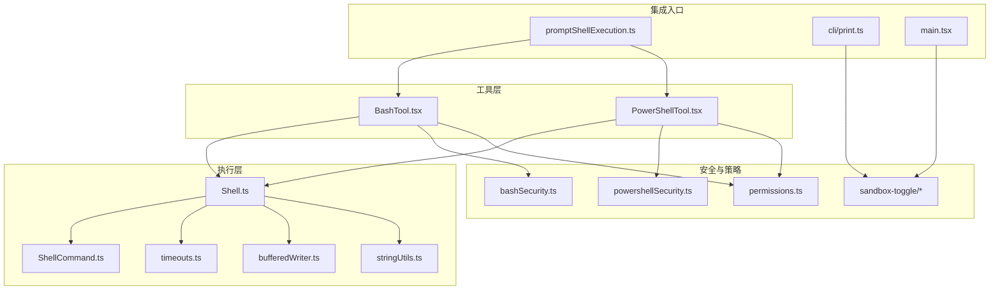
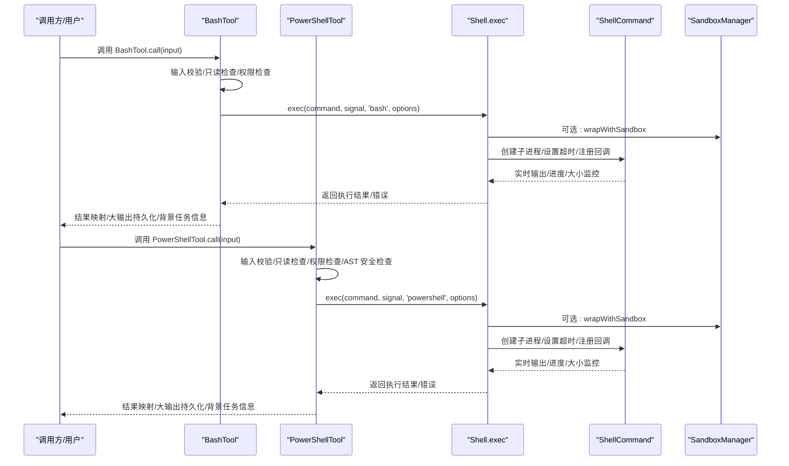
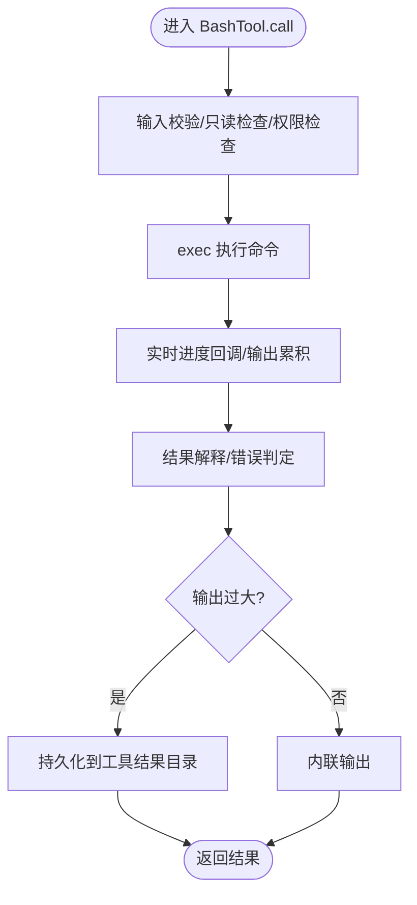
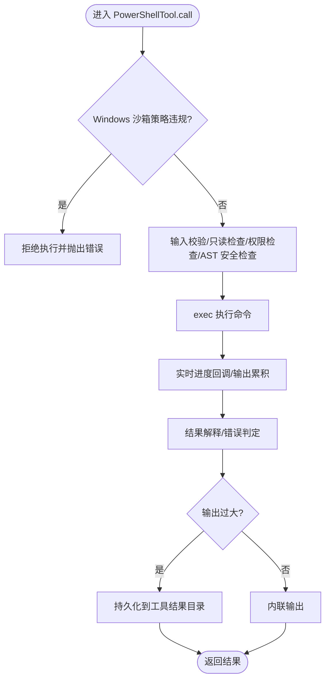
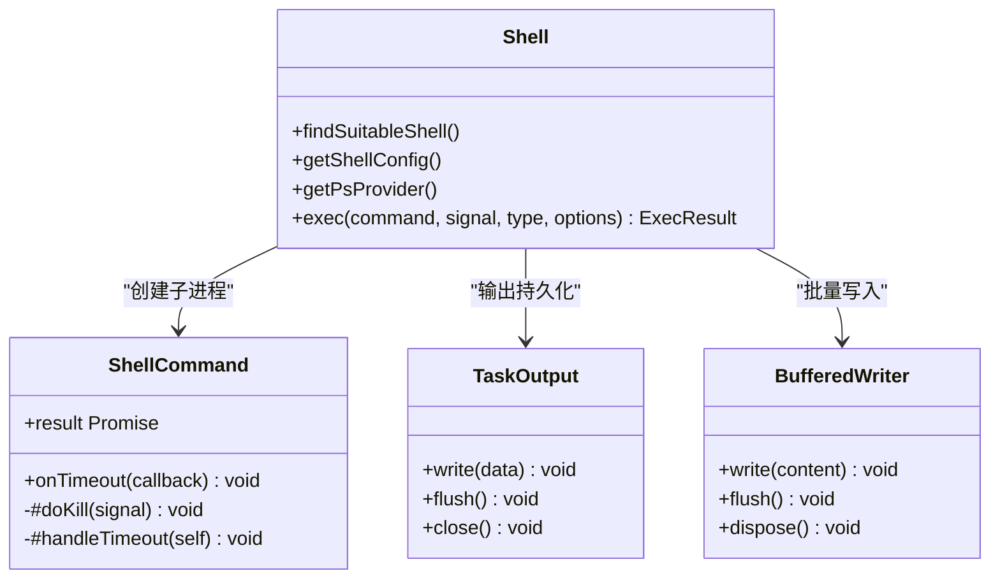
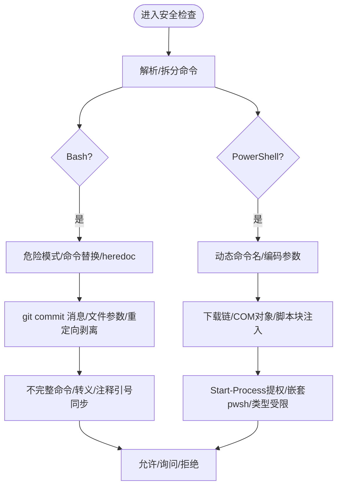
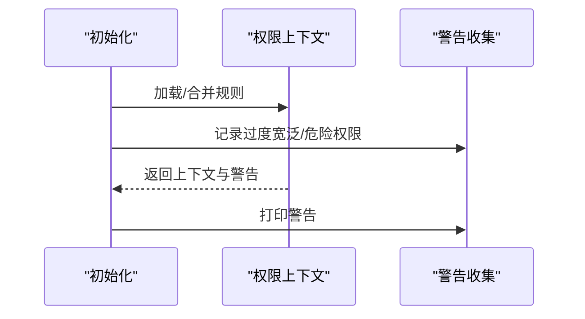
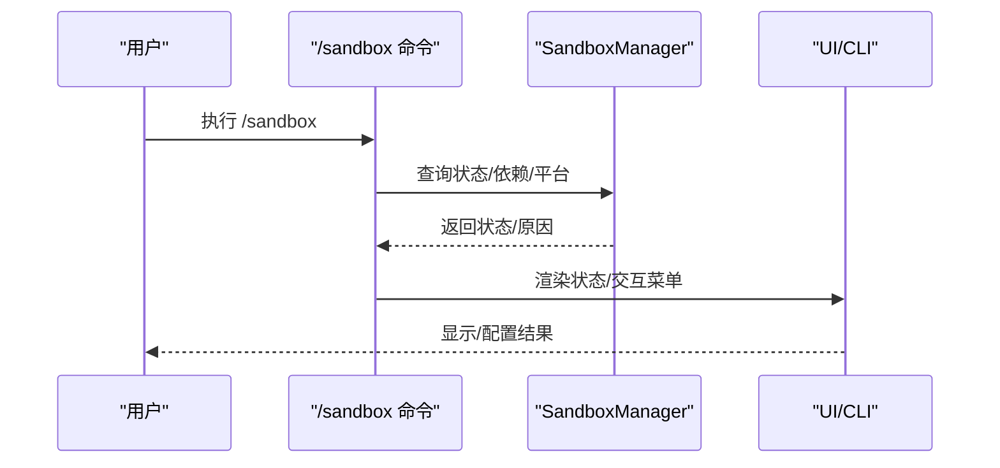
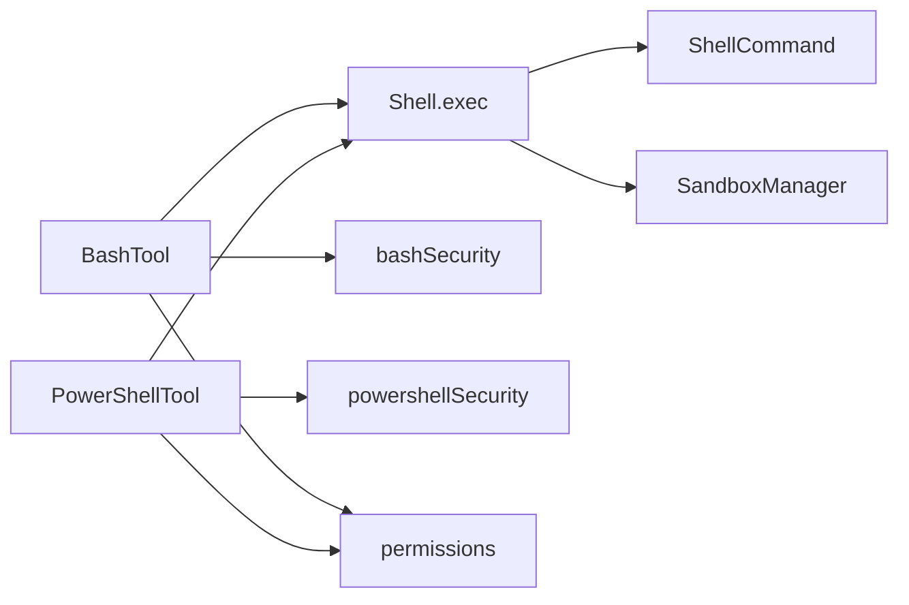

# 系统命令工具

<cite>
**本文引用的文件**
- [src/tools/BashTool/BashTool.tsx](file://src/tools/BashTool/BashTool.tsx)
- [src/tools/PowerShellTool/PowerShellTool.tsx](file://src/tools/PowerShellTool/PowerShellTool.tsx)
- [src/utils/Shell.ts](file://src/utils/Shell.ts)
- [src/utils/ShellCommand.ts](file://src/utils/ShellCommand.ts)
- [src/utils/timeouts.ts](file://src/utils/timeouts.ts)
- [src/utils/bufferedWriter.ts](file://src/utils/bufferedWriter.ts)
- [src/utils/stringUtils.ts](file://src/utils/stringUtils.ts)
- [src/tools/BashTool/bashSecurity.ts](file://src/tools/BashTool/bashSecurity.ts)
- [src/tools/PowerShellTool/powershellSecurity.ts](file://src/tools/PowerShellTool/powershellSecurity.ts)
- [src/utils/promptShellExecution.ts](file://src/utils/promptShellExecution.ts)
- [src/commands/sandbox-toggle/index.ts](file://src/commands/sandbox-toggle/index.ts)
- [src/commands/sandbox-toggle/sandbox-toggle.tsx](file://src/commands/sandbox-toggle/sandbox-toggle.tsx)
- [src/screens/REPL.tsx](file://src/screens/REPL.tsx)
- [src/cli/print.ts](file://src/cli/print.ts)
- [src/hooks/useCanUseTool.tsx](file://src/hooks/useCanUseTool.tsx)
- [src/utils/memoryFileDetection.ts](file://src/utils/memoryFileDetection.ts)
- [src/main.tsx](file://src/main.tsx)
- [src/types/permissions.ts](file://src/types/permissions.ts)
- [src/commands/permissions/permissions.tsx](file://src/commands/permissions/permissions.tsx)
- [src/screens/Doctor.tsx](file://src/screens/Doctor.tsx)
</cite>

## 目录
1. [简介](#简介)
2. [项目结构](#项目结构)
3. [核心组件](#核心组件)
4. [架构总览](#架构总览)
5. [详细组件分析](#详细组件分析)
6. [依赖关系分析](#依赖关系分析)
7. [性能考量](#性能考量)
8. [故障排除指南](#故障排除指南)
9. [结论](#结论)
10. [附录](#附录)

## 简介
本技术文档面向系统命令工具（Bash 与 PowerShell），系统性阐述其安全执行机制、命令解析与输出处理流程，并深入说明命令沙箱隔离、路径验证、危险命令检测与权限限制策略。文档同时覆盖命令超时控制、输出流管理与错误恢复机制，提供安全最佳实践、性能监控与故障排除建议，帮助开发者与使用者在保证安全的前提下高效使用系统命令能力。

## 项目结构
系统命令工具由“工具层”（BashTool、PowerShellTool）与“执行层”（Shell、ShellCommand、超时与输出缓冲）共同组成；安全策略由“安全检查模块”（bashSecurity、powershellSecurity）与“权限与策略”（permissions、sandbox）协同实现；“提示词内嵌命令执行”（promptShellExecution）提供技能或提示中嵌入命令的统一入口。

**图表来源**
- [src/tools/BashTool/BashTool.tsx](file://src/tools/BashTool/BashTool.tsx)
- [src/tools/PowerShellTool/PowerShellTool.tsx](file://src/tools/PowerShellTool/PowerShellTool.tsx)
- [src/utils/Shell.ts](file://src/utils/Shell.ts)
- [src/utils/ShellCommand.ts](file://src/utils/ShellCommand.ts)
- [src/utils/timeouts.ts](file://src/utils/timeouts.ts)
- [src/utils/bufferedWriter.ts](file://src/utils/bufferedWriter.ts)
- [src/utils/stringUtils.ts](file://src/utils/stringUtils.ts)
- [src/tools/BashTool/bashSecurity.ts](file://src/tools/BashTool/bashSecurity.ts)
- [src/tools/PowerShellTool/powershellSecurity.ts](file://src/tools/PowerShellTool/powershellSecurity.ts)
- [src/utils/promptShellExecution.ts](file://src/utils/promptShellExecution.ts)
- [src/commands/sandbox-toggle/index.ts](file://src/commands/sandbox-toggle/index.ts)
- [src/commands/sandbox-toggle/sandbox-toggle.tsx](file://src/commands/sandbox-toggle/sandbox-toggle.tsx)
- [src/cli/print.ts](file://src/cli/print.ts)
- [src/main.tsx](file://src/main.tsx)
- [src/types/permissions.ts](file://src/types/permissions.ts)

**章节来源**
- [src/tools/BashTool/BashTool.tsx](file://src/tools/BashTool/BashTool.tsx)
- [src/tools/PowerShellTool/PowerShellTool.tsx](file://src/tools/PowerShellTool/PowerShellTool.tsx)
- [src/utils/Shell.ts](file://src/utils/Shell.ts)

## 核心组件
- BashTool：负责 Bash 命令的输入校验、权限检查、只读约束、输出截断与持久化、背景任务与进度回调、错误语义解释与结果映射。
- PowerShellTool：负责 PowerShell 命令的输入校验、权限检查、只读约束、AST 安全检查、输出截断与持久化、背景任务与进度回调、错误语义解释与结果映射。
- Shell/ShellCommand：封装子进程创建、环境变量注入、超时与中断、输出流合并与分片、背景任务注册与通知、沙箱包装与平台差异处理。
- 安全检查模块：Bash 安全检查（危险模式、heredoc 替换、git commit 消息、jq 危险参数等）与 PowerShell 安全检查（动态命令名、编码参数、下载链、COM 对象、脚本块注入等）。
- 权限与策略：权限规则、权限更新目标、权限分类、过度宽泛规则过滤、权限对话与重试。
- 沙箱：沙箱启用/禁用、依赖检查、平台支持、策略锁定、不可用原因提示与初始化失败处理。
- 提示词内嵌执行：在技能或提示中解析并执行嵌入命令，按需选择 Bash 或 PowerShell 执行器。

**章节来源**
- [src/tools/BashTool/BashTool.tsx](file://src/tools/BashTool/BashTool.tsx)
- [src/tools/PowerShellTool/PowerShellTool.tsx](file://src/tools/PowerShellTool/PowerShellTool.tsx)
- [src/utils/Shell.ts](file://src/utils/Shell.ts)
- [src/utils/ShellCommand.ts](file://src/utils/ShellCommand.ts)
- [src/tools/BashTool/bashSecurity.ts](file://src/tools/BashTool/bashSecurity.ts)
- [src/tools/PowerShellTool/powershellSecurity.ts](file://src/tools/PowerShellTool/powershellSecurity.ts)
- [src/utils/promptShellExecution.ts](file://src/utils/promptShellExecution.ts)
- [src/types/permissions.ts](file://src/types/permissions.ts)

## 架构总览
系统命令工具采用“工具层 + 执行层 + 安全层 + 策略层”的分层设计。工具层负责输入、权限与语义解释；执行层负责进程生命周期、超时与输出；安全层负责静态/动态检测；策略层负责权限与沙箱配置。

**图表来源**
- [src/tools/BashTool/BashTool.tsx](file://src/tools/BashTool/BashTool.tsx)
- [src/tools/PowerShellTool/PowerShellTool.tsx](file://src/tools/PowerShellTool/PowerShellTool.tsx)
- [src/utils/Shell.ts](file://src/utils/Shell.ts)
- [src/utils/ShellCommand.ts](file://src/utils/ShellCommand.ts)
- [src/utils/promptShellExecution.ts](file://src/utils/promptShellExecution.ts)

## 详细组件分析

### Bash 工具
- 输入与输出模式
  - 输入模式包含命令、可选描述、超时、后台运行标志与危险禁用沙箱标志。
  - 输出模式包含标准输出、标准错误、是否图像输出、是否无输出预期、结构化内容、后台任务标识与持久化路径等。
- 只读与搜索/读取命令识别
  - 通过拆分命令与操作符识别搜索类（find/grep/rg/ag/locate/which/whereis）、读取类（cat/head/tail/less/more/wc/stat/file/strings/jq/awk/cut/sort/uniq/tr）、目录列表类（ls/tree/du）与语义中性类（echo/printf/true/false/:）。
- 背景任务与自动挂起
  - 支持自动后台化策略（如长时间阻塞命令），并提供用户手动后台化与助手自动后台化的区分。
- 输出截断与大输出持久化
  - 使用 EndTruncatingAccumulator 截断末尾以避免内存溢出；超过阈值时将完整输出写入工具结果目录并返回预览。
- 错误语义解释
  - 通过 interpretCommandResult 将非零退出码解释为“无匹配/复制成功/删除成功”等语义，减少误报。
- 权限与安全
  - 在 call 前后进行权限检查与只读约束；对 sed 预览直接应用模拟编辑避免越权写入。
- 超时与中断
  - 默认与最大超时由 timeouts.ts 提供；ShellCommand 内部维护 SIGTERM/SIGKILL 与自动后台化逻辑。

**图表来源**
- [src/tools/BashTool/BashTool.tsx](file://src/tools/BashTool/BashTool.tsx)
- [src/utils/Shell.ts](file://src/utils/Shell.ts)
- [src/utils/ShellCommand.ts](file://src/utils/ShellCommand.ts)
- [src/utils/stringUtils.ts](file://src/utils/stringUtils.ts)

**章节来源**
- [src/tools/BashTool/BashTool.tsx](file://src/tools/BashTool/BashTool.tsx)
- [src/utils/Shell.ts](file://src/utils/Shell.ts)
- [src/utils/ShellCommand.ts](file://src/utils/ShellCommand.ts)
- [src/utils/timeouts.ts](file://src/utils/timeouts.ts)
- [src/utils/stringUtils.ts](file://src/utils/stringUtils.ts)

### PowerShell 工具
- 输入与输出模式
  - 输入模式包含命令、可选描述、超时、后台运行标志与危险禁用沙箱标志。
  - 输出模式包含标准输出、标准错误、是否图像输出、后台任务标识与持久化路径等。
- 只读与 AST 安全检查
  - 同步阶段先做正则与关键字检测，异步阶段基于 AST 进行更细粒度的安全检查（动态命令名、编码参数、下载链、COM 对象、脚本块注入等）。
- 背景任务与自动挂起
  - 与 Bash 类似，支持自动后台化与用户手动后台化。
- 输出截断与大输出持久化
  - 与 Bash 一致的大输出处理策略。
- 平台策略
  - 在 Windows 原生平台拒绝企业策略要求沙箱但沙箱不可用的情况，直接拒绝执行以避免策略绕过。

**图表来源**
- [src/tools/PowerShellTool/PowerShellTool.tsx](file://src/tools/PowerShellTool/PowerShellTool.tsx)
- [src/utils/Shell.ts](file://src/utils/Shell.ts)
- [src/utils/ShellCommand.ts](file://src/utils/ShellCommand.ts)
- [src/utils/stringUtils.ts](file://src/utils/stringUtils.ts)

**章节来源**
- [src/tools/PowerShellTool/PowerShellTool.tsx](file://src/tools/PowerShellTool/PowerShellTool.tsx)
- [src/utils/Shell.ts](file://src/utils/Shell.ts)
- [src/utils/ShellCommand.ts](file://src/utils/ShellCommand.ts)
- [src/utils/timeouts.ts](file://src/utils/timeouts.ts)
- [src/utils/stringUtils.ts](file://src/utils/stringUtils.ts)

### 执行层：Shell 与 ShellCommand
- 子进程创建与环境注入
  - 通过 provider 获取 spawn 参数与环境覆盖；支持 onStdout 管道模式实现实时回调。
- 沙箱包装与平台差异
  - 沙箱模式下对 PowerShell 使用特殊包装策略（外层 /bin/sh 解析 POSIX 输出，内部 pwsh -NoProfile -NonInteractive -EncodedCommand）；对其他平台直接使用 bwrap/sandbox-exec。
- 超时与中断
  - ShellCommand 维护定时器与信号处理，支持 SIGTERM/SIGKILL 与自动后台化；超时回调可触发自动后台化。
- 输出流管理
  - BufferedWriter 批量刷新与溢出处理；TaskOutput 支持文件落盘与内存缓冲切换；StreamWrapper 将实时数据写入内存缓冲。
- 大输出与截断
  - EndTruncatingAccumulator 从末尾截断；超过阈值时链接/复制输出文件至工具结果目录并截断。

**图表来源**
- [src/utils/Shell.ts](file://src/utils/Shell.ts)
- [src/utils/ShellCommand.ts](file://src/utils/ShellCommand.ts)
- [src/utils/bufferedWriter.ts](file://src/utils/bufferedWriter.ts)
- [src/utils/stringUtils.ts](file://src/utils/stringUtils.ts)

**章节来源**
- [src/utils/Shell.ts](file://src/utils/Shell.ts)
- [src/utils/ShellCommand.ts](file://src/utils/ShellCommand.ts)
- [src/utils/bufferedWriter.ts](file://src/utils/bufferedWriter.ts)
- [src/utils/stringUtils.ts](file://src/utils/stringUtils.ts)

### 安全检查模块
- Bash 安全检查
  - 危险模式检测（heredoc 替换、命令替换、参数替换、Zsh 扩展、等号展开等）；git commit 消息中的命令替换；jq 危险函数与文件参数；不完整命令、转义字符、重定向剥离、注释引号不同步、换行与 Unicode 空白等。
  - 特殊模式：safe heredoc in substitution 的严格验证与剩余文本二次校验。
- PowerShell 安全检查
  - 动态命令名（无法静态解析的命令名）；编码参数（-EncodedCommand）；下载链（Invoke-WebRequest/Invoke-RestMethod/New-Object/Start-BitsTransfer 等）；COM 对象（New-Object -ComObject）；脚本块注入（Invoke-Command/Invoke-Expression/Start-Job 等）；Start-Process 提权与嵌套 pwsh；成员调用与类型字面量超出受限白名单等。

**图表来源**
- [src/tools/BashTool/bashSecurity.ts](file://src/tools/BashTool/bashSecurity.ts)
- [src/tools/PowerShellTool/powershellSecurity.ts](file://src/tools/PowerShellTool/powershellSecurity.ts)

**章节来源**
- [src/tools/BashTool/bashSecurity.ts](file://src/tools/BashTool/bashSecurity.ts)
- [src/tools/PowerShellTool/powershellSecurity.ts](file://src/tools/PowerShellTool/powershellSecurity.ts)

### 权限与策略
- 权限规则与更新目标
  - 规则来源与行为（允许/拒绝/询问）、更新目标（用户/项目/本地/会话/CLI 参数）、目录增删等。
- 初始化与警告
  - 初始化时对过度宽泛的 Bash/PowerShell 允许规则进行过滤与日志记录；在自动模式下对危险权限进行裁剪。
- 权限对话与重试
  - 权限对话界面支持重试被拒的命令序列。

**图表来源**
- [src/main.tsx](file://src/main.tsx)
- [src/types/permissions.ts](file://src/types/permissions.ts)
- [src/commands/permissions/permissions.tsx](file://src/commands/permissions/permissions.tsx)

**章节来源**
- [src/main.tsx](file://src/main.tsx)
- [src/types/permissions.ts](file://src/types/permissions.ts)
- [src/commands/permissions/permissions.tsx](file://src/commands/permissions/permissions.tsx)

### 沙箱与平台策略
- 沙箱启用/禁用与依赖检查
  - 通过命令 /sandbox 查看状态、依赖检查与交互式配置；支持排除特定命令模式。
- 平台支持与策略锁定
  - 仅在受支持平台启用；企业策略可锁定设置；Windows 原生平台若策略要求沙箱而不可用则拒绝执行。
- REPL 与 CLI 初始化
  - REPL 屏蔽时提示原因；CLI 初始化时尝试初始化沙箱并处理失败。

**图表来源**
- [src/commands/sandbox-toggle/index.ts](file://src/commands/sandbox-toggle/index.ts)
- [src/commands/sandbox-toggle/sandbox-toggle.tsx](file://src/commands/sandbox-toggle/sandbox-toggle.tsx)
- [src/screens/REPL.tsx](file://src/screens/REPL.tsx)
- [src/cli/print.ts](file://src/cli/print.ts)

**章节来源**
- [src/commands/sandbox-toggle/index.ts](file://src/commands/sandbox-toggle/index.ts)
- [src/commands/sandbox-toggle/sandbox-toggle.tsx](file://src/commands/sandbox-toggle/sandbox-toggle.tsx)
- [src/screens/REPL.tsx](file://src/screens/REPL.tsx)
- [src/cli/print.ts](file://src/cli/print.ts)

### 提示词内嵌命令执行
- 解析与执行
  - 支持代码块与行内两种语法；根据 frontmatter 选择 shell；执行前进行权限检查；将结果回填到提示文本。
- 错误格式化
  - 将 ShellError 格式化为可读错误消息；对中断与失败分别处理。

**章节来源**
- [src/utils/promptShellExecution.ts](file://src/utils/promptShellExecution.ts)

## 依赖关系分析
- 工具层依赖执行层：BashTool/PowerShellTool 通过 Shell.exec 发起命令执行。
- 执行层依赖安全层：ShellCommand 不直接做安全检查，但受工具层前置安全检查保护。
- 策略层贯穿：权限规则与沙箱策略在工具层与执行层之间形成横切关注点。
- 分支与平台差异：PowerShell 在 Windows 原生平台有额外策略限制；跨平台沙箱包装策略不同。

**图表来源**
- [src/tools/BashTool/BashTool.tsx](file://src/tools/BashTool/BashTool.tsx)
- [src/tools/PowerShellTool/PowerShellTool.tsx](file://src/tools/PowerShellTool/PowerShellTool.tsx)
- [src/utils/Shell.ts](file://src/utils/Shell.ts)
- [src/utils/ShellCommand.ts](file://src/utils/ShellCommand.ts)
- [src/tools/BashTool/bashSecurity.ts](file://src/tools/BashTool/bashSecurity.ts)
- [src/tools/PowerShellTool/powershellSecurity.ts](file://src/tools/PowerShellTool/powershellSecurity.ts)
- [src/types/permissions.ts](file://src/types/permissions.ts)

**章节来源**
- [src/tools/BashTool/BashTool.tsx](file://src/tools/BashTool/BashTool.tsx)
- [src/tools/PowerShellTool/PowerShellTool.tsx](file://src/tools/PowerShellTool/PowerShellTool.tsx)
- [src/utils/Shell.ts](file://src/utils/Shell.ts)
- [src/utils/ShellCommand.ts](file://src/utils/ShellCommand.ts)
- [src/types/permissions.ts](file://src/types/permissions.ts)

## 性能考量
- 超时与最大超时
  - 默认与最大超时可通过环境变量配置；超时触发后可自动后台化或发送中断信号。
- 输出缓冲与截断
  - 使用批量写入与定时刷新减少 I/O；EndTruncatingAccumulator 从末尾截断避免内存峰值。
- 大输出持久化
  - 超阈值输出写入磁盘并链接/复制，避免内存占用过高。
- 背景任务
  - 长时间阻塞命令自动后台化，降低主线程阻塞风险。

**章节来源**
- [src/utils/timeouts.ts](file://src/utils/timeouts.ts)
- [src/utils/bufferedWriter.ts](file://src/utils/bufferedWriter.ts)
- [src/utils/stringUtils.ts](file://src/utils/stringUtils.ts)
- [src/tools/BashTool/BashTool.tsx](file://src/tools/BashTool/BashTool.tsx)
- [src/tools/PowerShellTool/PowerShellTool.tsx](file://src/tools/PowerShellTool/PowerShellTool.tsx)

## 故障排除指南
- 沙箱不可用
  - REPL 屏蔽时打印原因；CLI 初始化失败时优雅退出；/sandbox 命令显示依赖检查与策略锁定状态。
- Windows 原生平台 PowerShell 拒绝执行
  - 当企业策略要求沙箱且不可用时直接拒绝执行，避免策略绕过。
- 提示词内嵌命令失败
  - 权限检查失败或执行异常时格式化错误消息；对中断与失败分别处理。
- 背景任务未完成
  - 检查任务输出路径与通知；必要时手动查看输出文件。
- 权限问题
  - 使用权限命令查看与重试被拒规则；注意过度宽泛规则已被过滤。

**章节来源**
- [src/screens/REPL.tsx](file://src/screens/REPL.tsx)
- [src/cli/print.ts](file://src/cli/print.ts)
- [src/commands/sandbox-toggle/sandbox-toggle.tsx](file://src/commands/sandbox-toggle/sandbox-toggle.tsx)
- [src/utils/promptShellExecution.ts](file://src/utils/promptShellExecution.ts)
- [src/main.tsx](file://src/main.tsx)
- [src/commands/permissions/permissions.tsx](file://src/commands/permissions/permissions.tsx)
- [src/screens/Doctor.tsx](file://src/screens/Doctor.tsx)

## 结论
系统命令工具在保证安全的前提下提供了强大的命令执行能力。通过严格的权限与安全检查、完善的超时与输出管理、以及针对不同平台的沙箱策略，系统能够在多种场景下稳定运行。建议在生产环境中启用沙箱、合理设置超时、谨慎授予宽泛权限，并结合提示词内嵌执行与背景任务策略提升用户体验与安全性。

## 附录
- 安全最佳实践
  - 启用沙箱并定期检查依赖；避免过度宽泛的 Bash/PowerShell 允许规则；对敏感命令进行权限分类与询问。
  - 使用只读命令优先策略；对可能产生大输出的命令设置合理超时与后台化。
  - 在 Windows 原生平台遵循企业策略，避免策略绕过。
- 性能监控
  - 关注超时触发率、后台任务比例、输出截断比例与磁盘 I/O；结合环境变量调整默认与最大超时。
- 故障排查清单
  - 沙箱不可用/策略锁定、Windows 原生平台拒绝执行、提示词内嵌命令权限失败、背景任务未完成、权限规则冲突。