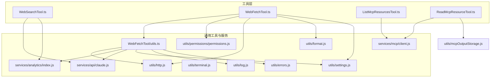
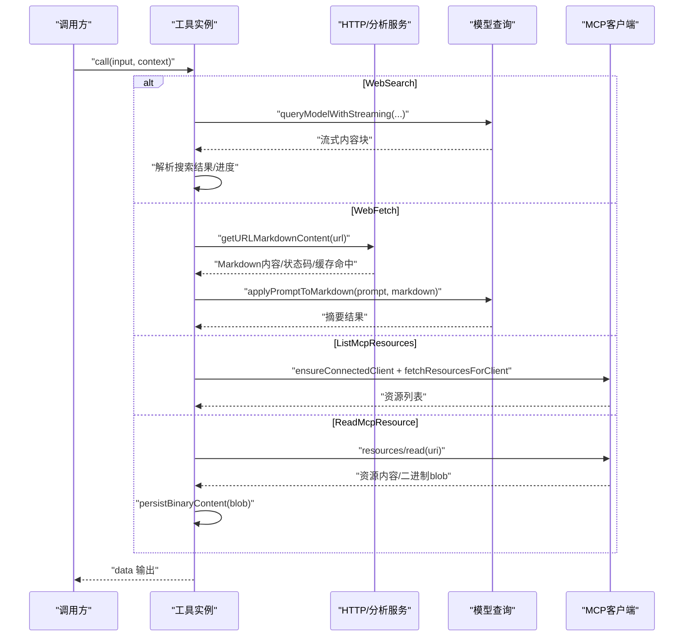
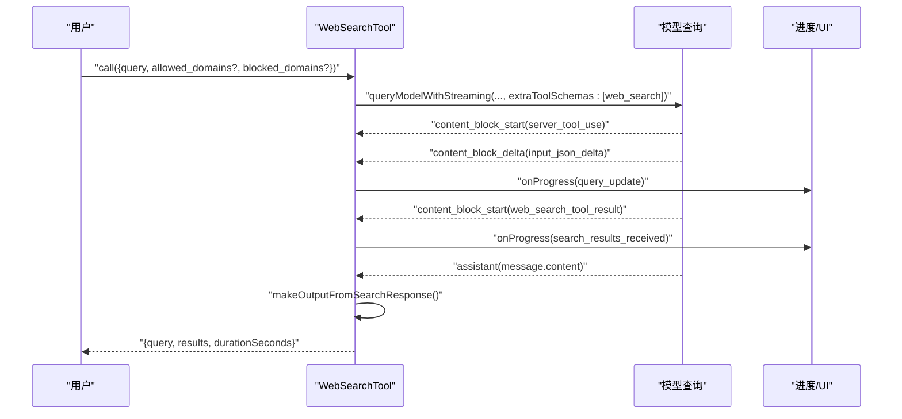
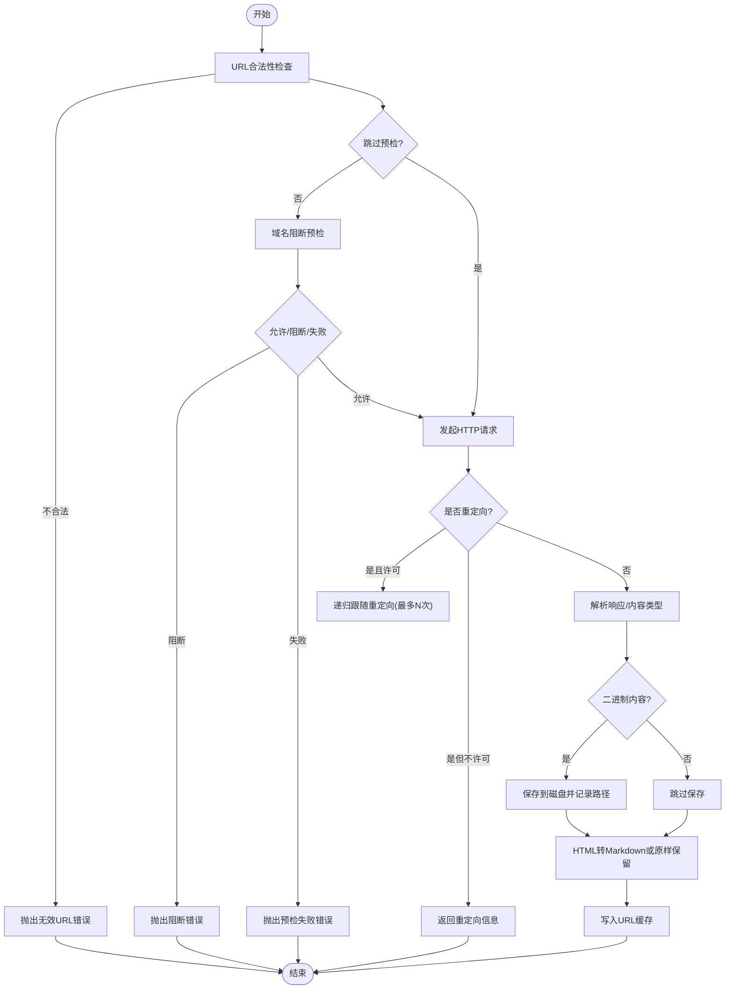
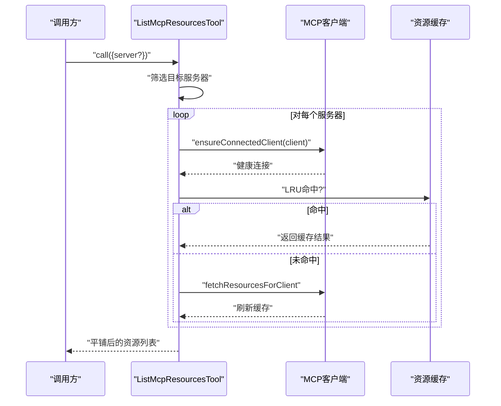
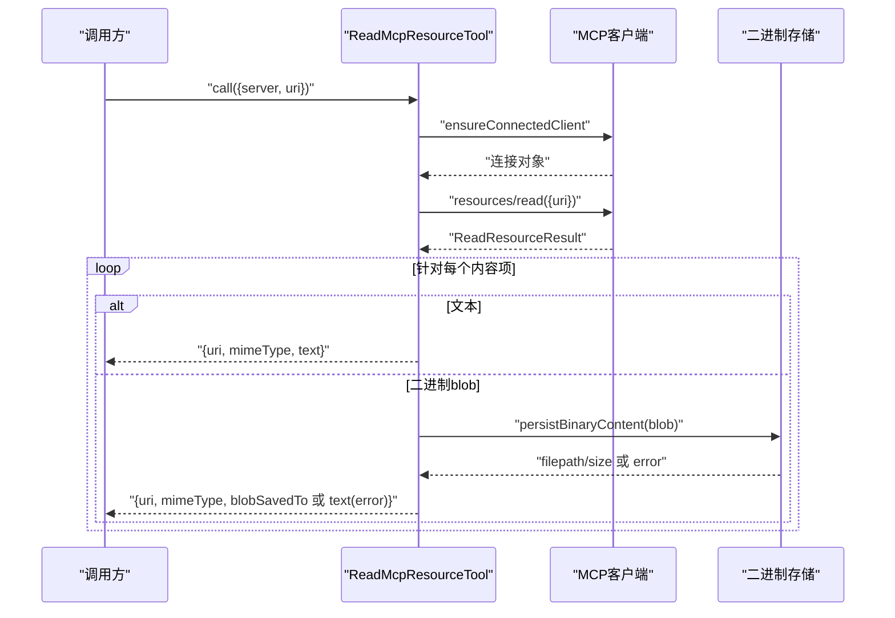
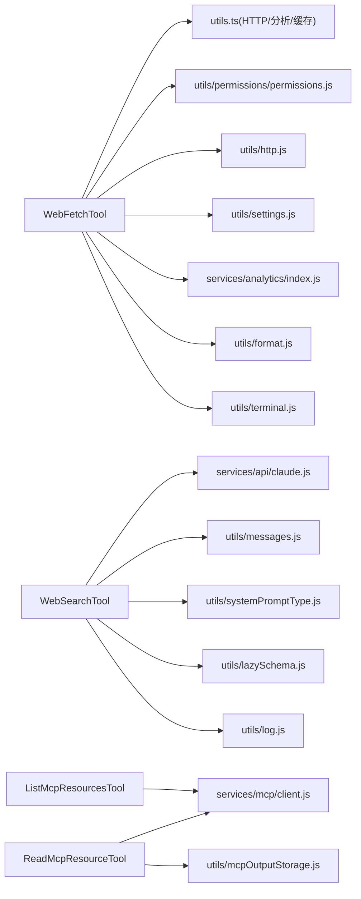

# 网络和Web工具

<cite>
**本文引用的文件**
- [WebSearchTool.ts](file://src/tools/WebSearchTool/WebSearchTool.ts)
- [WebFetchTool.ts](file://src/tools/WebFetchTool/WebFetchTool.ts)
- [utils.ts](file://src/tools/WebFetchTool/utils.ts)
- [ListMcpResourcesTool.ts](file://src/tools/ListMcpResourcesTool/ListMcpResourcesTool.ts)
- [ReadMcpResourceTool.ts](file://src/tools/ReadMcpResourceTool/ReadMcpResourceTool.ts)
- [client.js](file://src/services/mcp/client.js)
- [mcpOutputStorage.js](file://src/utils/mcpOutputStorage.js)
- [http.js](file://src/utils/http.js)
- [analytics/index.js](file://src/services/analytics/index.js)
- [claude.js](file://src/services/api/claude.js)
- [permissions.js](file://src/utils/permissions/permissions.js)
- [format.js](file://src/utils/format.js)
- [lazySchema.js](file://src/utils/lazySchema.js)
- [messages.js](file://src/utils/messages.js)
- [systemPromptType.js](file://src/utils/systemPromptType.js)
- [terminal.js](file://src/utils/terminal.js)
- [errors.js](file://src/utils/errors.js)
- [log.js](file://src/utils/log.js)
- [settings.js](file://src/utils/settings/settings.js)
</cite>

## 目录
1. [简介](#简介)
2. [项目结构](#项目结构)
3. [核心组件](#核心组件)
4. [架构总览](#架构总览)
5. [详细组件分析](#详细组件分析)
6. [依赖关系分析](#依赖关系分析)
7. [性能考量](#性能考量)
8. [故障排查指南](#故障排查指南)
9. [结论](#结论)
10. [附录](#附录)

## 简介
本文件面向网络与Web工具的技术文档，聚焦以下四个工具的实现原理与使用方法：
- 网页搜索（WebSearch）
- 网页抓取（WebFetch）
- MCP 资源列表（ListMcpResources）
- 资源读取（ReadMcpResource）

内容涵盖HTTP请求处理、URL验证、内容过滤与缓存策略；同时讨论网络安全防护、速率限制与反爬虫应对机制，并提供最佳实践与性能优化建议。

## 项目结构
四个工具均位于 src/tools 下，分别对应独立目录，采用统一的工具框架封装（buildTool），并通过公共服务与工具库完成权限校验、HTTP请求、缓存与输出渲染等能力。

**图表来源**
- [WebSearchTool.ts:152-436](file://src/tools/WebSearchTool/WebSearchTool.ts#L152-L436)
- [WebFetchTool.ts:66-308](file://src/tools/WebFetchTool/WebFetchTool.ts#L66-L308)
- [utils.ts:1-531](file://src/tools/WebFetchTool/utils.ts#L1-L531)
- [ListMcpResourcesTool.ts:40-124](file://src/tools/ListMcpResourcesTool/ListMcpResourcesTool.ts#L40-L124)
- [ReadMcpResourceTool.ts:49-159](file://src/tools/ReadMcpResourceTool/ReadMcpResourceTool.ts#L49-L159)
- [client.js](file://src/services/mcp/client.js)
- [mcpOutputStorage.js](file://src/utils/mcpOutputStorage.js)
- [http.js](file://src/utils/http.js)
- [analytics/index.js](file://src/services/analytics/index.js)
- [claude.js](file://src/services/api/claude.js)
- [permissions.js](file://src/utils/permissions/permissions.js)
- [format.js](file://src/utils/format.js)
- [terminal.js](file://src/utils/terminal.js)
- [errors.js](file://src/utils/errors.js)
- [settings.js](file://src/utils/settings/settings.js)

**章节来源**
- [WebSearchTool.ts:1-436](file://src/tools/WebSearchTool/WebSearchTool.ts#L1-L436)
- [WebFetchTool.ts:1-319](file://src/tools/WebFetchTool/WebFetchTool.ts#L1-L319)
- [utils.ts:1-531](file://src/tools/WebFetchTool/utils.ts#L1-L531)
- [ListMcpResourcesTool.ts:1-124](file://src/tools/ListMcpResourcesTool/ListMcpResourcesTool.ts#L1-L124)
- [ReadMcpResourceTool.ts:1-159](file://src/tools/ReadMcpResourceTool/ReadMcpResourceTool.ts#L1-L159)

## 核心组件
- WebSearchTool：通过流式调用模型执行网页搜索，解析多轮搜索结果与文本块，支持进度回调与结果聚合。
- WebFetchTool：对指定URL进行安全抓取，执行域名预检、重定向许可检查、内容转Markdown、二次模型摘要与二进制内容落盘。
- ListMcpResourcesTool：枚举已连接MCP服务器的可用资源，带LRU缓存与健康重连保障。
- ReadMcpResourceTool：按URI从MCP服务器读取资源，自动处理二进制blob并落盘，返回可溯源的输出。

**章节来源**
- [WebSearchTool.ts:152-436](file://src/tools/WebSearchTool/WebSearchTool.ts#L152-L436)
- [WebFetchTool.ts:66-308](file://src/tools/WebFetchTool/WebFetchTool.ts#L66-L308)
- [ListMcpResourcesTool.ts:40-124](file://src/tools/ListMcpResourcesTool/ListMcpResourcesTool.ts#L40-L124)
- [ReadMcpResourceTool.ts:49-159](file://src/tools/ReadMcpResourceTool/ReadMcpResourceTool.ts#L49-L159)

## 架构总览
四个工具共享统一的工具框架与若干通用模块：
- 输入/输出模式：使用Zod延迟模式定义输入输出结构，确保类型安全与运行时校验。
- 权限与提示：工具描述、权限检查、用户提示文案由各自prompt/UI模块提供。
- HTTP与分析：WebFetch依赖HTTP工具与分析事件记录；WebSearch通过模型查询接口完成工具调用。
- MCP集成：ListMcpResources与ReadMcpResource直接复用MCP客户端与资源持久化工具。

**图表来源**
- [WebSearchTool.ts:254-400](file://src/tools/WebSearchTool/WebSearchTool.ts#L254-L400)
- [WebFetchTool.ts:208-299](file://src/tools/WebFetchTool/WebFetchTool.ts#L208-L299)
- [utils.ts:347-482](file://src/tools/WebFetchTool/utils.ts#L347-L482)
- [ListMcpResourcesTool.ts:66-101](file://src/tools/ListMcpResourcesTool/ListMcpResourcesTool.ts#L66-L101)
- [ReadMcpResourceTool.ts:75-143](file://src/tools/ReadMcpResourceTool/ReadMcpResourceTool.ts#L75-L143)
- [client.js](file://src/services/mcp/client.js)
- [mcpOutputStorage.js](file://src/utils/mcpOutputStorage.js)
- [claude.js](file://src/services/api/claude.js)

## 详细组件分析

### WebSearchTool 分析
- 流式工具调用：通过模型查询接口以流式方式接收内容块，解析出搜索结果与文本摘要，支持实时进度上报。
- 结果聚合：将多个搜索结果块合并为统一输出结构，包含查询语句、链接数组与文本注释。
- 权限与启用条件：根据API提供商与模型能力动态决定是否启用，支持特性开关选择更小模型以提升响应速度。
- 输入校验：禁止同时设置允许域与阻止域，保证策略互斥。

**图表来源**
- [WebSearchTool.ts:254-400](file://src/tools/WebSearchTool/WebSearchTool.ts#L254-L400)

**章节来源**
- [WebSearchTool.ts:152-436](file://src/tools/WebSearchTool/WebSearchTool.ts#L152-L436)

### WebFetchTool 分析
- URL验证与预检：长度、协议、凭据、主机名合法性检查；可选跳过阻断清单预检（企业场景）。
- 域名阻断预检：向外部API查询域名可抓取性，短时缓存“允许”结果，失败或阻断时抛出明确错误。
- 安全重定向：仅允许同源变化（含www增删）或路径参数变更，超过最大重试次数则报错。
- 内容处理：HTML转Markdown，超长截断；二进制内容自动落盘并返回路径；支持预批准域名直通。
- 缓存策略：URL级LRU缓存（15分钟TTL，50MB上限），域名预检独立缓存（5分钟）。
- 模型摘要：对非预批准或非Markdown内容，调用二级模型生成摘要。
- 权限与提示：基于主机名构建规则内容，支持预批准主机豁免。

**图表来源**
- [utils.ts:139-482](file://src/tools/WebFetchTool/utils.ts#L139-L482)

**章节来源**
- [WebFetchTool.ts:66-308](file://src/tools/WebFetchTool/WebFetchTool.ts#L66-L308)
- [utils.ts:1-531](file://src/tools/WebFetchTool/utils.ts#L1-L531)

### ListMcpResourcesTool 分析
- 并发拉取：对目标服务器或全部已连接服务器并发执行资源拉取。
- 健康保障：通过客户端健康检查与缓存策略（LRU + 变更失效）确保结果新鲜度。
- 错误隔离：单个服务器异常不影响整体结果，记录日志并继续处理其他服务器。
- 输出截断检测：对大结果进行行数截断检测，避免终端溢出。

**图表来源**
- [ListMcpResourcesTool.ts:66-101](file://src/tools/ListMcpResourcesTool/ListMcpResourcesTool.ts#L66-L101)
- [client.js](file://src/services/mcp/client.js)

**章节来源**
- [ListMcpResourcesTool.ts:40-124](file://src/tools/ListMcpResourcesTool/ListMcpResourcesTool.ts#L40-L124)

### ReadMcpResourceTool 分析
- 客户端校验：必须存在且已连接，且服务器具备资源能力。
- 资源读取：通过标准RPC方法读取资源，支持文本与二进制blob两种形式。
- 二进制处理：将base64 blob解码后落盘，替换为本地路径以便后续分析；若保存失败，返回错误信息。
- 输出格式：统一包装为包含URI、MIME类型、文本或保存路径的结果数组。

**图表来源**
- [ReadMcpResourceTool.ts:75-143](file://src/tools/ReadMcpResourceTool/ReadMcpResourceTool.ts#L75-L143)
- [mcpOutputStorage.js](file://src/utils/mcpOutputStorage.js)

**章节来源**
- [ReadMcpResourceTool.ts:49-159](file://src/tools/ReadMcpResourceTool/ReadMcpResourceTool.ts#L49-L159)

## 依赖关系分析
- 工具框架：所有工具通过统一的 buildTool 封装，具备输入/输出模式、权限检查、渲染与映射等能力。
- HTTP与分析：WebFetch 依赖HTTP工具与分析事件记录；WebSearch 依赖模型查询服务。
- MCP集成：ListMcpResources 与 ReadMcpResource 直接依赖MCP客户端与资源持久化工具。
- 权限系统：WebFetch 使用规则内容（基于主机名）进行权限判定，支持允许/询问/拒绝三种行为。
- 终端与截断：工具侧对输出进行行数截断检测，避免终端溢出。

**图表来源**
- [WebFetchTool.ts:1-319](file://src/tools/WebFetchTool/WebFetchTool.ts#L1-L319)
- [utils.ts:1-531](file://src/tools/WebFetchTool/utils.ts#L1-L531)
- [WebSearchTool.ts:1-436](file://src/tools/WebSearchTool/WebSearchTool.ts#L1-L436)
- [ListMcpResourcesTool.ts:1-124](file://src/tools/ListMcpResourcesTool/ListMcpResourcesTool.ts#L1-L124)
- [ReadMcpResourceTool.ts:1-159](file://src/tools/ReadMcpResourceTool/ReadMcpResourceTool.ts#L1-L159)
- [client.js](file://src/services/mcp/client.js)
- [mcpOutputStorage.js](file://src/utils/mcpOutputStorage.js)
- [http.js](file://src/utils/http.js)
- [analytics/index.js](file://src/services/analytics/index.js)
- [claude.js](file://src/services/api/claude.js)
- [permissions.js](file://src/utils/permissions/permissions.js)
- [format.js](file://src/utils/format.js)
- [terminal.js](file://src/utils/terminal.js)
- [messages.js](file://src/utils/messages.js)
- [systemPromptType.js](file://src/utils/systemPromptType.js)
- [lazySchema.js](file://src/utils/lazySchema.js)
- [log.js](file://src/utils/log.js)

**章节来源**
- [WebFetchTool.ts:1-319](file://src/tools/WebFetchTool/WebFetchTool.ts#L1-L319)
- [utils.ts:1-531](file://src/tools/WebFetchTool/utils.ts#L1-L531)
- [WebSearchTool.ts:1-436](file://src/tools/WebSearchTool/WebSearchTool.ts#L1-L436)
- [ListMcpResourcesTool.ts:1-124](file://src/tools/ListMcpResourcesTool/ListMcpResourcesTool.ts#L1-L124)
- [ReadMcpResourceTool.ts:1-159](file://src/tools/ReadMcpResourceTool/ReadMcpResourceTool.ts#L1-L159)

## 性能考量
- 缓存策略
  - URL级LRU缓存：15分钟TTL、50MB大小上限，命中后直接返回内容与元数据，显著降低重复抓取开销。
  - 域名预检缓存：5分钟TTL，避免同一主机多次预检往返。
- 超时与限制
  - 单次HTTP请求超时60秒，防止慢响应挂起。
  - 最大内容长度10MB，避免内存与令牌预算过度消耗。
  - 最大重定向次数10次，防止开放重定向导致的循环跳转。
- 模型调用优化
  - WebSearch 支持在特定特性开关下切换更小模型，缩短响应时间。
  - WebFetch 对超长内容进行截断与摘要，减少二次模型负载。
- 并发与健康保障
  - ListMcpResources 并发拉取多个服务器资源，失败单点不影响整体。
  - MCP 客户端健康检查与缓存失效策略确保结果新鲜度。

[本节为通用性能建议，无需具体文件引用]

## 故障排查指南
- 域名阻断/预检失败
  - 现象：抛出阻断或预检失败错误，可能由企业网络代理或阻断清单触发。
  - 排查：确认 skipWebFetchPreflight 设置；检查代理配置；核对域名白名单。
  - 相关实现参考：[utils.ts:176-203](file://src/tools/WebFetchTool/utils.ts#L176-L203)
- 重定向被拒绝
  - 现象：返回重定向信息而非跟随，提示原始URL与目标URL及状态码。
  - 排查：确认重定向目标是否满足同源规则（含www增删）。
  - 相关实现参考：[utils.ts:262-329](file://src/tools/WebFetchTool/utils.ts#L262-L329)
- 二进制内容无法保存
  - 现象：返回保存错误信息，但资源仍可读取。
  - 排查：检查磁盘空间与权限；查看持久化工具返回的错误详情。
  - 相关实现参考：[ReadMcpResourceTool.ts:106-139](file://src/tools/ReadMcpResourceTool/ReadMcpResourceTool.ts#L106-L139)
- MCP服务器不可用
  - 现象：连接失败或能力缺失导致异常。
  - 排查：确认服务器名称、连接状态与资源能力；检查缓存失效与重连逻辑。
  - 相关实现参考：[ListMcpResourcesTool.ts:66-101](file://src/tools/ListMcpResourcesTool/ListMcpResourcesTool.ts#L66-L101)、[ReadMcpResourceTool.ts:75-94](file://src/tools/ReadMcpResourceTool/ReadMcpResourceTool.ts#L75-L94)

**章节来源**
- [utils.ts:176-329](file://src/tools/WebFetchTool/utils.ts#L176-L329)
- [ReadMcpResourceTool.ts:106-139](file://src/tools/ReadMcpResourceTool/ReadMcpResourceTool.ts#L106-L139)
- [ListMcpResourcesTool.ts:66-101](file://src/tools/ListMcpResourcesTool/ListMcpResourcesTool.ts#L66-L101)

## 结论
上述四个工具围绕“安全、可控、可观测”的原则设计：WebSearch强调流式交互与结果聚合；WebFetch在严格的安全边界内提供高效的内容抓取与摘要能力；ListMcpResources与ReadMcpResource则通过缓存与健康检查保障MCP资源访问的稳定性与安全性。配合完善的权限体系、缓存与超时限制，能够在复杂网络环境中可靠运行。

[本节为总结性内容，无需具体文件引用]

## 附录
- 最佳实践
  - WebSearch：优先使用允许/阻止域策略限定范围，合理设置最大使用次数；在非交互会话中考虑切换更小模型以提升响应速度。
  - WebFetch：尽量使用公开URL；对需要认证的页面优先寻找具备认证能力的MCP工具；对长链路URL谨慎使用，必要时拆分请求。
  - MCP资源：定期清理缓存，关注资源变更通知；对二进制内容做好落盘与溯源管理。
- 安全与合规
  - 严格遵循URL合法性与重定向许可规则；对敏感凭据与内部域名保持零容忍。
  - 在企业网络环境下审慎使用预检跳过选项，确保符合组织安全策略。
- 性能优化
  - 合理利用缓存与预检缓存；控制内容长度与模型摘要长度；在批量操作中使用并发但避免过度占用系统资源。

[本节为通用建议，无需具体文件引用]