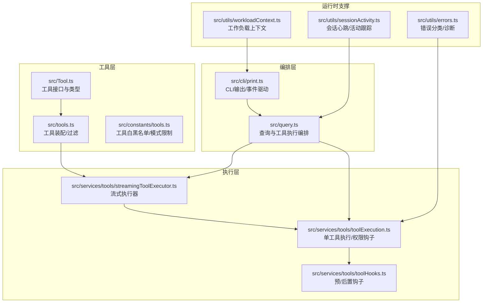
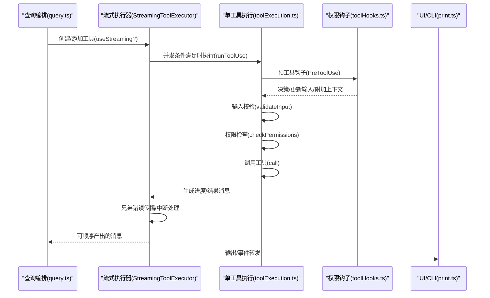
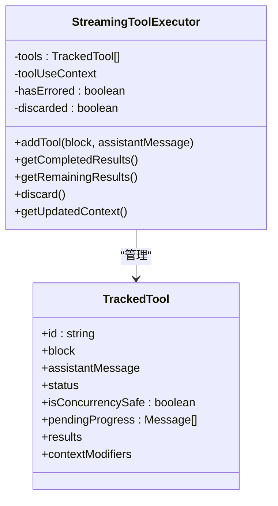
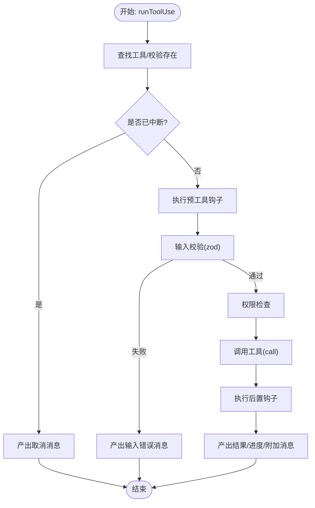
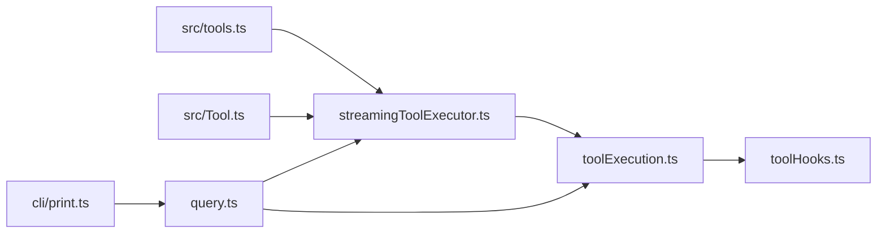

# 工具执行机制

<cite>
**本文引用的文件**
- [src/Tool.ts](file://src/Tool.ts)
- [src/tools.ts](file://src/tools.ts)
- [src/services/tools/streamingToolExecutor.ts](file://src/services/tools/streamingToolExecutor.ts)
- [src/services/tools/toolExecution.ts](file://src/services/tools/toolExecution.ts)
- [src/services/tools/toolHooks.ts](file://src/services/tools/toolHooks.ts)
- [src/query.ts](file://src/query.ts)
- [src/utils/sessionActivity.ts](file://src/utils/sessionActivity.ts)
- [src/utils/workloadContext.ts](file://src/utils/workloadContext.ts)
- [src/cli/print.ts](file://src/cli/print.ts)
- [src/constants/tools.ts](file://src/constants/tools.ts)
- [src/utils/errors.ts](file://src/utils/errors.ts)
- [README.md](file://README.md)
</cite>

## 目录
1. [简介](#简介)
2. [项目结构](#项目结构)
3. [核心组件](#核心组件)
4. [架构总览](#架构总览)
5. [详细组件分析](#详细组件分析)
6. [依赖关系分析](#依赖关系分析)
7. [性能考量](#性能考量)
8. [故障排除指南](#故障排除指南)
9. [结论](#结论)
10. [附录](#附录)

## 简介
本文件系统性阐述 Claude Code 的工具执行机制，覆盖从工具选择、参数校验、权限决策、并发调度到结果产出与 UI 渲染的完整链路；重点解析流式工具执行器（StreamingToolExecutor）的并发控制、进度上报与中断处理；并给出生命周期管理、性能优化与资源管理的最佳实践，以及监控、调试与故障排除方法。

## 项目结构
围绕“工具执行”的关键目录与文件：
- 工具接口与类型定义：src/Tool.ts
- 工具集合装配与过滤：src/tools.ts、src/constants/tools.ts
- 流式执行器：src/services/tools/streamingToolExecutor.ts
- 单工具执行与权限钩子：src/services/tools/toolExecution.ts、src/services/tools/toolHooks.ts
- 查询与工具执行编排：src/query.ts
- 会话活动与工作负载上下文：src/utils/sessionActivity.ts、src/utils/workloadContext.ts
- CLI 输出与事件驱动：src/cli/print.ts
- 错误分类与诊断：src/utils/errors.ts
- 顶层架构说明：README.md

**图表来源**
- [src/Tool.ts:1-793](file://src/Tool.ts#L1-L793)
- [src/tools.ts:1-390](file://src/tools.ts#L1-L390)
- [src/constants/tools.ts:1-113](file://src/constants/tools.ts#L1-L113)
- [src/services/tools/streamingToolExecutor.ts:1-531](file://src/services/tools/streamingToolExecutor.ts#L1-L531)
- [src/services/tools/toolExecution.ts:1-800](file://src/services/tools/toolExecution.ts#L1-L800)
- [src/services/tools/toolHooks.ts:1-651](file://src/services/tools/toolHooks.ts#L1-L651)
- [src/query.ts:712-1410](file://src/query.ts#L712-L1410)
- [src/cli/print.ts:2225-2262](file://src/cli/print.ts#L2225-L2262)
- [src/utils/sessionActivity.ts:1-35](file://src/utils/sessionActivity.ts#L1-L35)
- [src/utils/workloadContext.ts:1-36](file://src/utils/workloadContext.ts#L1-L36)
- [src/utils/errors.ts:125-162](file://src/utils/errors.ts#L125-L162)

**章节来源**
- [src/Tool.ts:1-793](file://src/Tool.ts#L1-L793)
- [src/tools.ts:1-390](file://src/tools.ts#L1-L390)
- [src/constants/tools.ts:1-113](file://src/constants/tools.ts#L1-L113)
- [src/services/tools/streamingToolExecutor.ts:1-531](file://src/services/tools/streamingToolExecutor.ts#L1-L531)
- [src/services/tools/toolExecution.ts:1-800](file://src/services/tools/toolExecution.ts#L1-L800)
- [src/services/tools/toolHooks.ts:1-651](file://src/services/tools/toolHooks.ts#L1-L651)
- [src/query.ts:712-1410](file://src/query.ts#L712-L1410)
- [src/cli/print.ts:2225-2262](file://src/cli/print.ts#L2225-L2262)
- [src/utils/sessionActivity.ts:1-35](file://src/utils/sessionActivity.ts#L1-L35)
- [src/utils/workloadContext.ts:1-36](file://src/utils/workloadContext.ts#L1-L36)
- [src/utils/errors.ts:125-162](file://src/utils/errors.ts#L125-L162)
- [README.md:497-533](file://README.md#L497-L533)

## 核心组件
- 工具接口与生命周期
  - 工具必须实现输入校验、权限检查、执行与结果映射等方法，并可声明并发安全、只读、破坏性、中断行为等能力属性。
  - 工具还负责 UI 展示（输入/进度/结果）、摘要与自动分类器输入等。
- 工具装配与过滤
  - 统一入口 getAllBaseTools/getTools/assembleToolPool，按权限规则与特性门控筛选工具，支持内置工具与 MCP 工具合并。
- 流式工具执行器
  - 负责并发控制（并发安全工具并行、非并发工具串行）、进度立即上报、兄弟进程错误传播、用户中断处理与取消。
- 单工具执行与钩子
  - runToolUse 将权限钩子、输入校验、工具调用、结果处理与后置钩子串联为统一异步流，支持进度消息与上下文修改。
- 查询编排
  - 在 query.ts 中根据配置决定是否使用流式执行器，并在工具执行前后注入进度、附件与上下文变更。

**章节来源**
- [src/Tool.ts:362-695](file://src/Tool.ts#L362-L695)
- [src/tools.ts:193-367](file://src/tools.ts#L193-L367)
- [src/services/tools/streamingToolExecutor.ts:40-124](file://src/services/tools/streamingToolExecutor.ts#L40-L124)
- [src/services/tools/toolExecution.ts:337-490](file://src/services/tools/toolExecution.ts#L337-L490)
- [src/services/tools/toolHooks.ts:435-651](file://src/services/tools/toolHooks.ts#L435-L651)
- [src/query.ts:1366-1410](file://src/query.ts#L1366-L1410)

## 架构总览
下图展示从查询到工具执行、并发控制与进度上报的关键交互：

**图表来源**
- [src/query.ts:1366-1410](file://src/query.ts#L1366-L1410)
- [src/services/tools/streamingToolExecutor.ts:76-124](file://src/services/tools/streamingToolExecutor.ts#L76-L124)
- [src/services/tools/toolExecution.ts:492-570](file://src/services/tools/toolExecution.ts#L492-L570)
- [src/services/tools/toolHooks.ts:435-651](file://src/services/tools/toolHooks.ts#L435-L651)
- [src/cli/print.ts:2225-2262](file://src/cli/print.ts#L2225-L2262)

## 详细组件分析

### 流式工具执行器（StreamingToolExecutor）
- 并发控制
  - 队列中仅允许“无并发风险”工具与“空闲状态”同时执行；非并发工具串行，且其后的并发工具需等待。
- 进度与结果
  - 进度消息立即入队并优先产出；完成结果按接收顺序标记为已产出。
- 中断与取消
  - 用户中断（如 ESC 拒绝）按工具中断行为决定取消或阻塞；兄弟进程错误（如 Bash 失败）通过专用信号传播，触发同批取消。
- 上下文修改
  - 非并发工具可在完成后应用上下文修改器；并发工具暂不支持。
- 异常与回退
  - 支持 discard() 放弃未完成任务（用于流式回退场景），并生成合成错误消息。

**图表来源**
- [src/services/tools/streamingToolExecutor.ts:19-531](file://src/services/tools/streamingToolExecutor.ts#L19-L531)

**章节来源**
- [src/services/tools/streamingToolExecutor.ts:40-531](file://src/services/tools/streamingToolExecutor.ts#L40-L531)

### 单工具执行与权限钩子（runToolUse）
- 执行路径
  - 解析工具名与输入，若不存在则返回错误消息；若被中断则返回取消消息。
  - 通过 streamedCheckPermissionsAndCallTool 包装为单一异步迭代，期间持续产出进度与最终结果。
- 权限与钩子
  - 预工具钩子：可直接拒绝、要求交互、更新输入或附加上下文；与规则系统协同决定最终许可。
  - 后置钩子：对成功/失败结果进行二次处理，可附加上下文、阻止继续或修改 MCP 输出。
- 错误分类
  - 对不同类型的错误进行分类与安全化处理，便于遥测与日志。

**图表来源**
- [src/services/tools/toolExecution.ts:337-570](file://src/services/tools/toolExecution.ts#L337-L570)
- [src/services/tools/toolHooks.ts:39-191](file://src/services/tools/toolHooks.ts#L39-L191)

**章节来源**
- [src/services/tools/toolExecution.ts:337-570](file://src/services/tools/toolExecution.ts#L337-L570)
- [src/services/tools/toolHooks.ts:39-191](file://src/services/tools/toolHooks.ts#L39-L191)

### 查询编排与工具执行
- 流式开关
  - 根据配置 gate 决定是否启用流式工具执行；在工具执行阶段记录事件并产出消息。
- 结果收集
  - 使用工具执行器或同步执行器收集结果，逐条产出消息并维护上下文。

**章节来源**
- [src/query.ts:1366-1410](file://src/query.ts#L1366-L1410)

### 工具装配与过滤
- 工具池装配
  - getAllBaseTools 提供全部可用工具清单；getTools 基于权限规则与特性门控过滤；assembleToolPool 合并内置与 MCP 工具并去重。
- 模式限制
  - 不同模式（如协调者模式、异步代理）对工具可用性有额外限制。

**章节来源**
- [src/tools.ts:193-367](file://src/tools.ts#L193-L367)
- [src/constants/tools.ts:36-113](file://src/constants/tools.ts#L36-L113)

### 会话活动与工作负载上下文
- 会话活动
  - 通过 startSessionActivity/stopSessionActivity 以引用计数方式维持心跳，避免容器空闲。
- 工作负载上下文
  - 使用 AsyncLocalStorage 为每个回合维护工作负载标签（如 cron），确保后台任务在正确上下文中运行。

**章节来源**
- [src/utils/sessionActivity.ts:1-35](file://src/utils/sessionActivity.ts#L1-L35)
- [src/utils/workloadContext.ts:1-36](file://src/utils/workloadContext.ts#L1-L36)

## 依赖关系分析
- 组件耦合
  - StreamingToolExecutor 依赖工具定义与上下文，内部通过 AbortController 与兄弟进程信号协同。
  - toolExecution 与 toolHooks 通过统一的消息/进度协议与查询编排解耦。
- 外部依赖
  - CLI 输出模块负责事件队列与消息转发，确保后台任务进度实时可见。

**图表来源**
- [src/tools.ts:1-390](file://src/tools.ts#L1-L390)
- [src/Tool.ts:1-793](file://src/Tool.ts#L1-L793)
- [src/services/tools/streamingToolExecutor.ts:1-531](file://src/services/tools/streamingToolExecutor.ts#L1-L531)
- [src/services/tools/toolExecution.ts:1-800](file://src/services/tools/toolExecution.ts#L1-L800)
- [src/services/tools/toolHooks.ts:1-651](file://src/services/tools/toolHooks.ts#L1-L651)
- [src/query.ts:712-1410](file://src/query.ts#L712-L1410)
- [src/cli/print.ts:2225-2262](file://src/cli/print.ts#L2225-L2262)

**章节来源**
- [src/tools.ts:1-390](file://src/tools.ts#L1-L390)
- [src/Tool.ts:1-793](file://src/Tool.ts#L1-L793)
- [src/services/tools/streamingToolExecutor.ts:1-531](file://src/services/tools/streamingToolExecutor.ts#L1-L531)
- [src/services/tools/toolExecution.ts:1-800](file://src/services/tools/toolExecution.ts#L1-L800)
- [src/services/tools/toolHooks.ts:1-651](file://src/services/tools/toolHooks.ts#L1-L651)
- [src/query.ts:712-1410](file://src/query.ts#L712-L1410)
- [src/cli/print.ts:2225-2262](file://src/cli/print.ts#L2225-L2262)

## 性能考量
- 并发策略
  - 利用 isConcurrencySafe 将并发安全工具并行执行，显著提升吞吐；非并发工具串行避免资源竞争。
- 进度与延迟
  - 进度消息优先产出，降低感知延迟；兄弟错误传播减少无效计算。
- I/O 与输出
  - Bash 等命令工具采用文件轮询与流包装相结合的方式平衡实时性与开销。
- 资源管理
  - 通过 AbortController 与子控制器链路，确保错误/中断快速传播，避免僵尸进程与泄漏。
- 诊断与遥测
  - 丰富的事件与跨度记录，便于定位瓶颈与异常。

[本节为通用指导，无需特定文件引用]

## 故障排除指南
- 常见问题定位
  - 输入校验失败：查看工具输入校验错误消息与提示，必要时通过 ToolSearch 加载缺失的工具模式。
  - 权限拒绝：检查规则/钩子决策来源与原因，确认是否需要交互或受模式限制。
  - 兄弟工具失败：Bash 失败会触发同批取消，检查前置命令链与依赖。
  - 中断行为：确认工具 interruptBehavior 设置，避免误取消或阻塞。
- 诊断工具
  - 错误分类函数用于提取稳定错误标识，便于日志与遥测分析。
  - 会话活动与工作负载上下文有助于判断后台任务是否被挂起或上下文错乱。
- 回退与恢复
  - 流式回退时可丢弃未完成任务并重新构建执行器，避免孤儿结果污染后续流程。

**章节来源**
- [src/services/tools/toolExecution.ts:150-171](file://src/services/tools/toolExecution.ts#L150-L171)
- [src/services/tools/streamingToolExecutor.ts:210-241](file://src/services/tools/streamingToolExecutor.ts#L210-L241)
- [src/utils/errors.ts:125-162](file://src/utils/errors.ts#L125-L162)
- [src/utils/sessionActivity.ts:1-35](file://src/utils/sessionActivity.ts#L1-L35)
- [src/utils/workloadContext.ts:1-36](file://src/utils/workloadContext.ts#L1-L36)

## 结论
该工具执行机制以“可扩展的工具接口 + 流式并发执行器 + 完整的权限与钩子体系”为核心，既保证了高并发下的稳定性，又提供了细粒度的进度与中断控制。通过严格的生命周期管理、完善的错误分类与可观测性，系统在复杂场景下仍能保持一致的用户体验与可维护性。

[本节为总结，无需特定文件引用]

## 附录

### 工具生命周期与能力声明要点
- 生命周期：validateInput → checkPermissions → call
- 能力声明：isEnabled/isConcurrencySafe/isReadOnly/isDestructive/interruptBehavior
- UI/渲染：renderToolUseMessage/renderToolResultMessage/renderToolUseProgressMessage/renderGroupedToolUse
- AI 面向：prompt/description/mapToolResultToAPI

**章节来源**
- [README.md:500-533](file://README.md#L500-L533)
- [src/Tool.ts:362-695](file://src/Tool.ts#L362-L695)