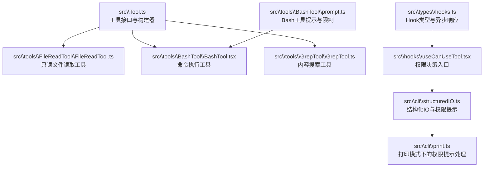
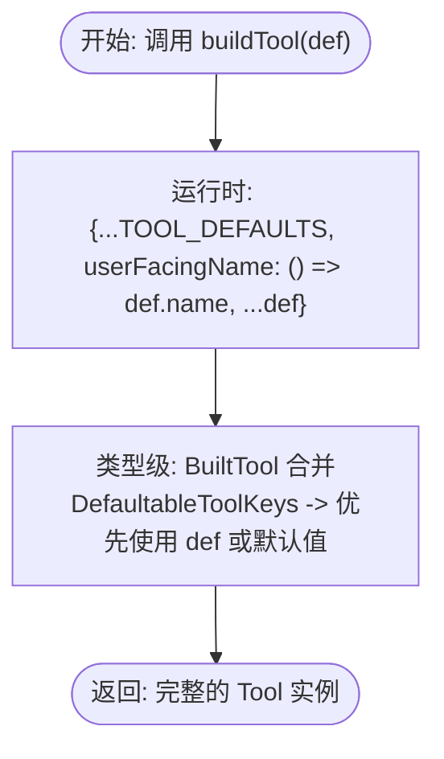
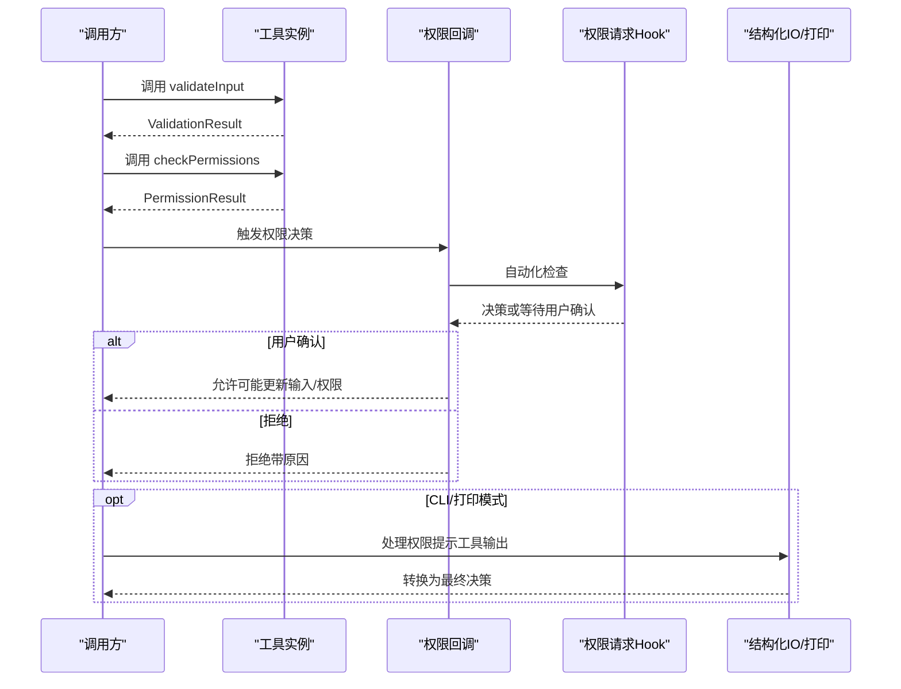
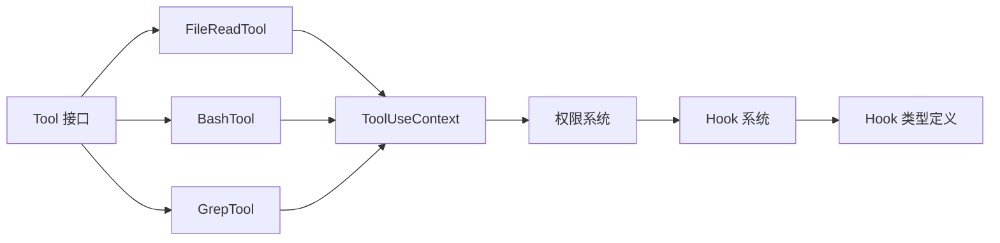

# 工具接口设计

<cite>
**本文引用的文件**
- [src\Tool.ts](file://src\Tool.ts)
- [src\tools\FileReadTool\FileReadTool.ts](file://src\tools\FileReadTool\FileReadTool.ts)
- [src\tools\BashTool\BashTool.tsx](file://src\tools\BashTool\BashTool.tsx)
- [src\tools\GrepTool\GrepTool.ts](file://src\tools\GrepTool\GrepTool.ts)
- [src\tools\utils.ts](file://src\tools\utils.ts)
- [src\hooks\useCanUseTool.tsx](file://src\hooks\useCanUseTool.tsx)
- [src\cli\structuredIO.ts](file://src\cli\structuredIO.ts)
- [src\cli\print.ts](file://src\cli\print.ts)
- [src\tools\BashTool\prompt.ts](file://src\tools\BashTool\prompt.ts)
- [src\types\hooks.ts](file://src\types\hooks.ts)
</cite>

## 目录
1. [简介](#简介)
2. [项目结构](#项目结构)
3. [核心组件](#核心组件)
4. [架构总览](#架构总览)
5. [详细组件分析](#详细组件分析)
6. [依赖关系分析](#依赖关系分析)
7. [性能考量](#性能考量)
8. [故障排查指南](#故障排查指南)
9. [结论](#结论)
10. [附录](#附录)

## 简介
本文件系统性阐述 Claude Code 工具接口设计，围绕 Tool 基类的完整接口、工具元数据与生命周期钩子、输入输出模式、权限检查机制、进度报告接口进行深入解析，并详解工具构建器模式 buildTool 的工作原理与类型推断策略。同时提供最佳实践建议，涵盖异步处理、错误处理与资源管理，并通过具体实现示例展示如何正确实现自定义工具接口。

## 项目结构
- 工具接口定义集中在 src\Tool.ts，统一了工具的抽象方法、元数据字段、生命周期钩子与构建器模式。
- 典型工具实现位于 src\tools 下，如 FileReadTool、BashTool、GrepTool 等，均通过 buildTool 构建并导出。
- 权限与交互流程由 hooks/useCanUseTool.tsx、cli/structuredIO.ts、cli/print.ts 等模块协同完成。
- 进度与消息渲染在工具内部通过 renderToolUseProgressMessage、renderToolResultMessage 等钩子实现。

**图表来源**
- [src\Tool.ts:1-793](file://src\Tool.ts#L1-L793)
- [src\tools\FileReadTool\FileReadTool.ts:1-800](file://src\tools\FileReadTool\FileReadTool.ts#L1-L800)
- [src\tools\BashTool\BashTool.tsx:1-200](file://src\tools\BashTool\BashTool.tsx#L1-L200)
- [src\tools\GrepTool\GrepTool.ts:1-200](file://src\tools\GrepTool\GrepTool.ts#L1-L200)
- [src\hooks\useCanUseTool.tsx:151-183](file://src\hooks\useCanUseTool.tsx#L151-L183)
- [src\cli\structuredIO.ts:811-859](file://src\cli\structuredIO.ts#L811-L859)
- [src\cli\print.ts:4247-4291](file://src\cli\print.ts#L4247-L4291)
- [src\tools\BashTool\prompt.ts:1-200](file://src\tools\BashTool\prompt.ts#L1-L200)
- [src\types\hooks.ts:144-188](file://src\types\hooks.ts#L144-L188)

**章节来源**
- [src\Tool.ts:1-793](file://src\Tool.ts#L1-L793)
- [src\tools\FileReadTool\FileReadTool.ts:1-800](file://src\tools\FileReadTool\FileReadTool.ts#L1-L800)
- [src\tools\BashTool\BashTool.tsx:1-200](file://src\tools\BashTool\BashTool.tsx#L1-L200)
- [src\tools\GrepTool\GrepTool.ts:1-200](file://src\tools\GrepTool\GrepTool.ts#L1-L200)
- [src\hooks\useCanUseTool.tsx:151-183](file://src\hooks\useCanUseTool.tsx#L151-L183)
- [src\cli\structuredIO.ts:811-859](file://src\cli\structuredIO.ts#L811-L859)
- [src\cli\print.ts:4247-4291](file://src\cli\print.ts#L4247-L4291)
- [src\tools\BashTool\prompt.ts:1-200](file://src\tools\BashTool\prompt.ts#L1-L200)
- [src\types\hooks.ts:144-188](file://src\types\hooks.ts#L144-L188)

## 核心组件
- 工具接口 Tool：定义抽象方法、元数据字段、生命周期钩子与可选渲染/进度接口。
- 工具构建器 buildTool：提供安全默认值填充与类型推断，确保工具实现的一致性与最小样板代码。
- 工具上下文 ToolUseContext：贯穿工具调用期的运行时环境，承载权限、状态、通知、进度等能力。
- 权限系统：结合通用权限规则与工具特定校验，支持自动化与交互式决策。
- 进度与结果：通过 ToolProgressData 与 ToolResult 统一进度与结果表达，支持 UI 渲染与索引。

**章节来源**
- [src\Tool.ts:362-695](file://src\Tool.ts#L362-L695)
- [src\Tool.ts:783-792](file://src\Tool.ts#L783-L792)
- [src\Tool.ts:158-300](file://src\Tool.ts#L158-L300)
- [src\Tool.ts:305-336](file://src\Tool.ts#L305-L336)

## 架构总览
工具接口设计采用“强约束抽象 + 安全默认”的模式：
- 抽象层：Tool 接口定义严格的方法签名与元数据字段，保证所有工具具备一致的行为契约。
- 默认层：buildTool 提供 fail-closed 的安全默认值，避免遗漏关键逻辑。
- 执行层：工具在 call 阶段执行业务逻辑，期间可使用 onProgress 回调上报进度；validateInput/checkPermissions 在 call 前完成输入校验与权限决策。
- 渲染层：工具通过 renderToolUseMessage/renderToolResultMessage 等钩子提供 UI 展示与文本抽取，便于搜索与摘要。

```mermaid
classDiagram
class Tool {
+aliases? : string[]
+searchHint? : string
+call(args, context, canUseTool, parentMessage, onProgress?)
+description(input, options)
+readonly inputSchema
+inputJSONSchema?
+outputSchema?
+inputsEquivalent?(a,b)
+isConcurrencySafe(input)
+isEnabled()
+isReadOnly(input)
+isDestructive?(input)
+interruptBehavior?()
+isSearchOrReadCommand?(input)
+isOpenWorld?(input)
+requiresUserInteraction?()
+isMcp?
+isLsp?
+shouldDefer?
+alwaysLoad?
+mcpInfo?
+readonly name
+maxResultSizeChars
+strict?
+backfillObservableInput?(input)
+validateInput?(input, context)
+checkPermissions(input, context)
+getPath?(input)
+preparePermissionMatcher?(input)
+prompt(options)
+userFacingName(input)
+userFacingNameBackgroundColor?(input)
+isTransparentWrapper?()
+getToolUseSummary?(input)
+getActivityDescription?(input)
+toAutoClassifierInput(input)
+mapToolResultToToolResultBlockParam(content, toolUseID)
+renderToolResultMessage?(content, progressMessages, options)
+extractSearchText?(out)
+renderToolUseMessage(input, options)
+isResultTruncated?(output)
+renderToolUseTag?(input)
+renderToolUseProgressMessage?(progressMessages, options)
+renderToolUseQueuedMessage?()
+renderToolUseRejectedMessage?(input, options)
+renderToolUseErrorMessage?(result, options)
+renderGroupedToolUse?(toolUses, options)
}
class ToolUseContext {
+options
+abortController
+readFileState
+getAppState()
+setAppState(f)
+setAppStateForTasks?
+handleElicitation?
+setToolJSX?
+addNotification?
+appendSystemMessage?
+sendOSNotification?
+nestedMemoryAttachmentTriggers?
+loadedNestedMemoryPaths?
+dynamicSkillDirTriggers?
+discoveredSkillNames?
+userModified?
+setInProgressToolUseIDs
+setHasInterruptibleToolInProgress?
+setResponseLength
+pushApiMetricsEntry?
+setStreamMode?
+onCompactProgress?
+setSDKStatus?
+openMessageSelector?
+updateFileHistoryState(updater)
+updateAttributionState(updater)
+setConversationId?
+agentId?
+agentType?
+requireCanUseTool?
+messages
+fileReadingLimits?
+globLimits?
+toolDecisions?
+queryTracking?
+requestPrompt?
+toolUseId?
+criticalSystemReminder_EXPERIMENTAL?
+preserveToolUseResults?
+localDenialTracking?
+contentReplacementState?
+renderedSystemPrompt?
}
class ToolBuilder {
+buildTool(def) BuiltTool
}
ToolBuilder --> Tool : "生成"
Tool --> ToolUseContext : "调用时使用"
```

**图表来源**
- [src\Tool.ts:362-695](file://src\Tool.ts#L362-L695)
- [src\Tool.ts:158-300](file://src\Tool.ts#L158-L300)
- [src\Tool.ts:783-792](file://src\Tool.ts#L783-L792)

**章节来源**
- [src\Tool.ts:362-695](file://src\Tool.ts#L362-L695)
- [src\Tool.ts:158-300](file://src\Tool.ts#L158-L300)
- [src\Tool.ts:783-792](file://src\Tool.ts#L783-L792)

## 详细组件分析

### Tool 接口与元数据
- 抽象方法
  - call：工具主执行入口，接收参数、上下文、权限回调、父消息与进度回调。
  - description/prompt：用于生成工具描述与系统提示。
  - inputSchema/outputSchema：输入输出的 Zod 模式定义，或 MCP 的 JSON Schema。
  - validateInput：对输入进行业务与安全层面的预校验。
  - checkPermissions：在输入通过校验后，决定是否允许执行。
  - isConcurrencySafe/isReadOnly/isDestructive/interruptBehavior：并发、只读、破坏性与中断行为声明。
  - isSearchOrReadCommand/isOpenWorld：用于 UI 折叠与活动描述。
  - renderToolUseMessage/renderToolResultMessage 等：渲染工具使用与结果消息。
- 元数据字段
  - name、aliases、searchHint、shouldDefer/alwaysLoad、mcpInfo、strict、maxResultSizeChars 等。
- 生命周期钩子
  - backfillObservableInput：在观察者可见前对输入进行回填。
  - preparePermissionMatcher：为权限规则匹配准备闭包。
  - toAutoClassifierInput：自动分类器输入摘要。
  - userFacingName/userFacingNameBackgroundColor：用户可见名称与主题色。
  - getToolUseSummary/getActivityDescription：紧凑摘要与活动描述。
  - renderToolUseProgressMessage/renderToolUseQueuedMessage/renderToolUseRejectedMessage/renderToolUseErrorMessage：进度、排队、拒绝与错误 UI。
  - renderGroupedToolUse：并行工具使用分组渲染。

**章节来源**
- [src\Tool.ts:362-695](file://src\Tool.ts#L362-L695)

### 工具构建器模式 buildTool
- 设计目标
  - 将常用默认方法（isEnabled、isConcurrencySafe、isReadOnly、isDestructive、checkPermissions、toAutoClassifierInput、userFacingName）集中定义，避免重复样板。
  - 通过类型级合并 BuiltTool<D>，在编译期保留调用点的精确签名与可选性。
- 默认值策略（fail-closed）
  - isEnabled：始终允许（安全默认）。
  - isConcurrencySafe：假设不安全（false）。
  - isReadOnly：假设会写入（false）。
  - isDestructive：默认非破坏性（false）。
  - checkPermissions：默认放行（allow），交由通用权限系统处理。
  - toAutoClassifierInput：返回空串，跳过自动分类器。
  - userFacingName：回退到工具名。
- 类型推断机制
  - DefaultableToolKeys 列举可被默认填充的方法键。
  - ToolDef 与 BuiltTool 通过 Omit/Partial/Pick 实现“若提供则优先，否则默认填充”的类型级合并。
  - 返回值通过断言 as BuiltTool<D>，确保类型安全与签名一致性。

**图表来源**
- [src\Tool.ts:707-792](file://src\Tool.ts#L707-L792)

**章节来源**
- [src\Tool.ts:707-792](file://src\Tool.ts#L707-L792)

### 输入输出模式与类型系统
- 输入模式
  - 使用 Zod 严格对象定义输入模式，支持语义化数字/布尔包装以提升用户体验。
  - 可选 inputJSONSchema 用于 MCP 工具直接提供 JSON Schema。
- 输出模式
  - ToolResult 包含 data 与可选新消息、上下文修饰器与 MCP 元数据。
  - mapToolResultToToolResultBlockParam 将工具输出映射为 SDK/协议块参数。
- 结果大小控制
  - maxResultSizeChars 控制结果持久化阈值，超过阈值将落盘并返回预览路径。

**章节来源**
- [src\Tool.ts:15-21](file://src\Tool.ts#L15-L21)
- [src\Tool.ts:321-336](file://src\Tool.ts#L321-L336)
- [src\Tool.ts:456-466](file://src\Tool.ts#L456-L466)

### 权限检查机制
- 流程概览
  - validateInput：先进行输入合法性与范围校验。
  - checkPermissions：在通过校验后，结合通用权限规则与工具特定逻辑决定是否放行。
  - useCanUseTool：在交互式场景中，负责触发自动化检查与用户确认对话框。
  - structuredIO/print：在 CLI/打印模式下，将权限提示工具输出转换为权限决策。
- 关键实现要点
  - preparePermissionMatcher：为权限规则匹配做昂贵解析，仅在必要时执行。
  - toAutoClassifierInput：提供自动分类器输入，未覆盖的工具默认跳过。
  - userFacingName/userFacingNameBackgroundColor：影响 UI 展示与主题色选择。

**图表来源**
- [src\Tool.ts:489-503](file://src\Tool.ts#L489-L503)
- [src\hooks\useCanUseTool.tsx:151-183](file://src\hooks\useCanUseTool.tsx#L151-L183)
- [src\cli\structuredIO.ts:811-859](file://src\cli\structuredIO.ts#L811-L859)
- [src\cli\print.ts:4247-4291](file://src\cli\print.ts#L4247-L4291)

**章节来源**
- [src\Tool.ts:489-503](file://src\Tool.ts#L489-L503)
- [src\hooks\useCanUseTool.tsx:151-183](file://src\hooks\useCanUseTool.tsx#L151-L183)
- [src\cli\structuredIO.ts:811-859](file://src\cli\structuredIO.ts#L811-L859)
- [src\cli\print.ts:4247-4291](file://src\cli\print.ts#L4247-L4291)

### 进度报告接口
- 进度类型
  - ToolProgressData 与 HookProgress 统一进度表达，filterToolProgressMessages 可过滤 Hook 进度。
- 上报方式
  - onProgress 回调在工具执行过程中周期性上报，工具可通过 renderToolUseProgressMessage 渲染进度 UI。
- 进度节流与追踪
  - 查询辅助工具对进度消息进行节流与 LRU 记录，避免高频上报导致的性能问题。

**章节来源**
- [src\Tool.ts:305-319](file://src\Tool.ts#L305-L319)
- [src\Tool.ts:338-340](file://src\Tool.ts#L338-L340)
- [src\utils\queryHelpers.ts:165-198](file://src\utils\queryHelpers.ts#L165-L198)

### 典型工具实现示例

#### FileReadTool（只读、高安全默认）
- 特性
  - isReadOnly: true，isConcurrencySafe: true，maxResultSizeChars: Infinity（避免循环读取）。
  - validateInput：路径展开、二进制扩展名检查、设备文件阻断、UNC 路径特殊处理。
  - checkPermissions：基于文件系统规则的读取权限判断。
  - backfillObservableInput：将相对/波浪号路径标准化为绝对路径，防止规则绕过。
  - renderToolUseMessage/renderToolResultMessage：UI 渲染与搜索文本抽取。
- 最佳实践
  - 对大文件采用 offset/limit 分页读取，避免超出令牌上限。
  - 使用 readFileState 去重相同范围的重复读取，减少缓存开销。

**章节来源**
- [src\tools\FileReadTool\FileReadTool.ts:337-718](file://src\tools\FileReadTool\FileReadTool.ts#L337-L718)
- [src\tools\FileReadTool\FileReadTool.ts:418-495](file://src\tools\FileReadTool\FileReadTool.ts#L418-L495)
- [src\tools\FileReadTool\FileReadTool.ts:395-405](file://src\tools\FileReadTool\FileReadTool.ts#L395-L405)

#### BashTool（命令执行、并发安全与中断行为）
- 特性
  - isReadOnly：根据命令语义判定（silent 命令视为无 stdout）。
  - isSearchOrReadCommand：基于命令集合识别搜索/读取/列表操作，支持 UI 折叠。
  - interruptBehavior：默认 block，可按需设置 cancel。
  - renderToolUseProgressMessage：长任务进度展示与节流阈值。
  - prompt：内置超时、沙箱、Git 操作指导等提示。
- 最佳实践
  - 对潜在破坏性命令进行只读约束检查。
  - 使用 run_in_background 参数与通知机制，避免阻塞主线程。

**章节来源**
- [src\tools\BashTool\BashTool.tsx:54-82](file://src\tools\BashTool\BashTool.tsx#L54-L82)
- [src\tools\BashTool\BashTool.tsx:95-172](file://src\tools\BashTool\BashTool.tsx#L95-L172)
- [src\tools\BashTool\prompt.ts:27-33](file://src\tools\BashTool\prompt.ts#L27-L33)

#### GrepTool（搜索工具）
- 特性
  - isReadOnly: true，isSearchOrReadCommand: { isSearch: true }。
  - head_limit/offset：统一截断与偏移，避免结果过大。
  - applyHeadLimit/formatLimitInfo：条件化地应用与格式化 limit/offset。
- 最佳实践
  - 默认 head_limit=250，避免上下文膨胀。
  - 使用 glob 与 type 过滤提高效率。

**章节来源**
- [src\tools\GrepTool\GrepTool.ts:160-200](file://src\tools\GrepTool\GrepTool.ts#L160-L200)
- [src\tools\GrepTool\GrepTool.ts:110-142](file://src\tools\GrepTool\GrepTool.ts#L110-L142)

### 工具消息与标签
- 工具消息标记
  - tagMessagesWithToolUseID：为用户/附件/系统消息附加 sourceToolUseID，避免“正在运行”消息重复。
- 工具使用 ID 提取
  - getToolUseIDFromParentMessage：从父消息中提取对应工具的 tool_use_id。

**章节来源**
- [src\tools\utils.ts:12-41](file://src\tools\utils.ts#L12-L41)

## 依赖关系分析
- 工具接口与实现
  - FileReadTool、BashTool、GrepTool 均通过 buildTool 构建，复用 ToolUseContext 与权限系统。
- 权限与 Hook
  - useCanUseTool 负责权限决策与自动化检查；structuredIO/print 负责 CLI/打印模式下的权限提示处理。
- Hook 类型
  - types/hooks.ts 定义 Hook 的同步/异步响应模式，支撑 useCanUseTool 中的异步 Hook 执行。

**图表来源**
- [src\Tool.ts:362-695](file://src\Tool.ts#L362-L695)
- [src\tools\FileReadTool\FileReadTool.ts:337-718](file://src\tools\FileReadTool\FileReadTool.ts#L337-L718)
- [src\tools\BashTool\BashTool.tsx:1-200](file://src\tools\BashTool\BashTool.tsx#L1-L200)
- [src\tools\GrepTool\GrepTool.ts:1-200](file://src\tools\GrepTool\GrepTool.ts#L1-L200)
- [src\types\hooks.ts:144-188](file://src\types\hooks.ts#L144-L188)

**章节来源**
- [src\Tool.ts:362-695](file://src\Tool.ts#L362-L695)
- [src\tools\FileReadTool\FileReadTool.ts:337-718](file://src\tools\FileReadTool\FileReadTool.ts#L337-L718)
- [src\tools\BashTool\BashTool.tsx:1-200](file://src\tools\BashTool\BashTool.tsx#L1-L200)
- [src\tools\GrepTool\GrepTool.ts:1-200](file://src\tools\GrepTool\GrepTool.ts#L1-L200)
- [src\types\hooks.ts:144-188](file://src\types\hooks.ts#L144-L188)

## 性能考量
- 输入/输出模式
  - 使用 Zod 模式进行严格校验，减少运行时异常与无效调用。
  - 对大结果采用 maxResultSizeChars 与持久化策略，避免内存与上下文膨胀。
- 并发与中断
  - isConcurrencySafe 明确并发安全，避免不必要的串行化。
  - interruptBehavior 支持取消或阻塞策略，平衡用户体验与安全性。
- 进度节流
  - 进度上报进行节流与 LRU 记录，降低高频事件对性能的影响。
- UI 渲染
  - 通过 renderToolUseProgressMessage 与 renderToolResultMessage 的条件化渲染，减少不必要的 DOM 更新。

[本节为通用指导，无需列出具体文件来源]

## 故障排查指南
- 权限相关
  - 若工具被拒绝，请检查 validateInput 与 checkPermissions 的返回值与错误码。
  - 在交互式场景中，确认 useCanUseTool 是否正确触发自动化检查与用户确认。
- CLI/打印模式
  - 若权限提示工具输出未被正确解析，检查 structuredIO/print 的输出解析逻辑。
- 进度与消息
  - 若进度未显示或重复，请检查 onProgress 回调与 UI 渲染逻辑。
  - 若消息重复出现“正在运行”，检查 tagMessagesWithToolUseID 的使用。

**章节来源**
- [src\hooks\useCanUseTool.tsx:151-183](file://src\hooks\useCanUseTool.tsx#L151-L183)
- [src\cli\structuredIO.ts:811-859](file://src\cli\structuredIO.ts#L811-L859)
- [src\cli\print.ts:4247-4291](file://src\cli\print.ts#L4247-L4291)
- [src\tools\utils.ts:12-41](file://src\tools\utils.ts#L12-L41)

## 结论
Tool 基类提供了完备的工具抽象与安全默认，buildTool 则通过类型级合并与运行时合并确保实现的一致性与最小样板。配合严格的输入输出模式、完善的权限检查与进度报告机制，工具接口设计在保证安全性的同时兼顾了可扩展性与易用性。遵循本文的最佳实践，可快速、安全地实现高质量的自定义工具。

[本节为总结性内容，无需列出具体文件来源]

## 附录
- 工具实现最佳实践清单
  - 必须实现：call、inputSchema、isReadOnly、isConcurrencySafe、checkPermissions（若需定制）。
  - 建议实现：validateInput、isSearchOrReadCommand、getActivityDescription、renderToolUseMessage、renderToolResultMessage。
  - 异步处理：使用 onProgress 上报进度，注意节流与 UI 渲染开销。
  - 错误处理：在 validateInput 中尽早失败，提供明确的错误码与消息。
  - 资源管理：合理设置 maxResultSizeChars，避免大结果直接返回；对长任务提供中断行为。
  - 权限设计：尽量复用通用权限规则，必要时在 checkPermissions 中补充工具特定逻辑。

[本节为通用指导，无需列出具体文件来源]