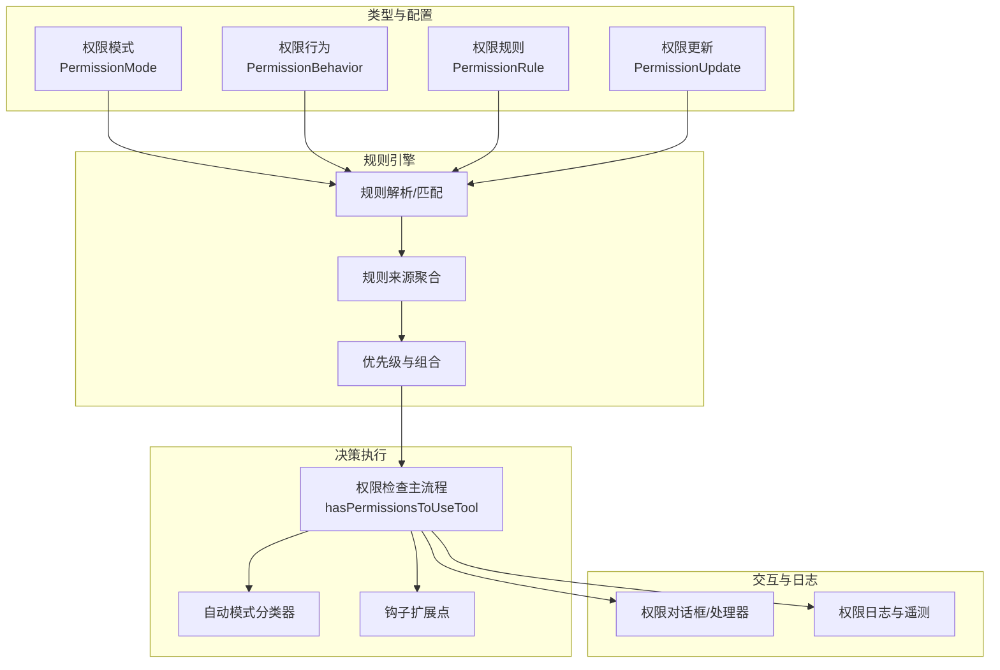
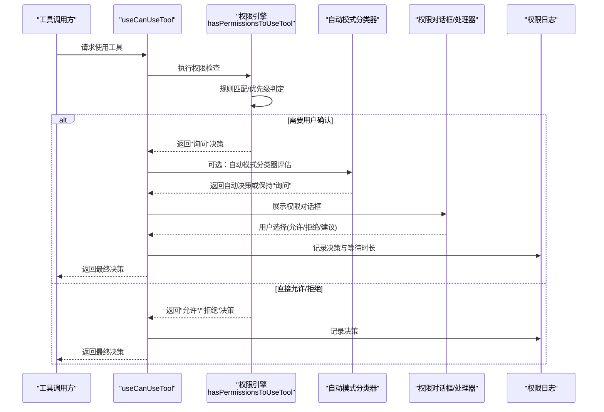
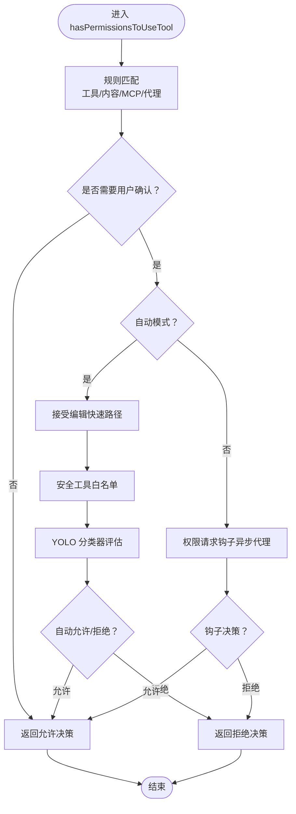
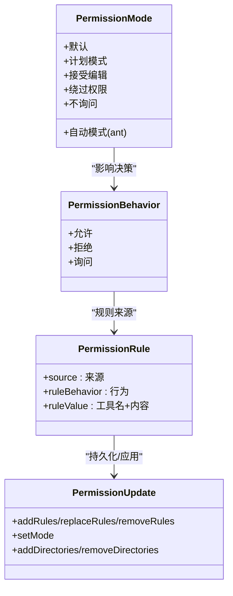
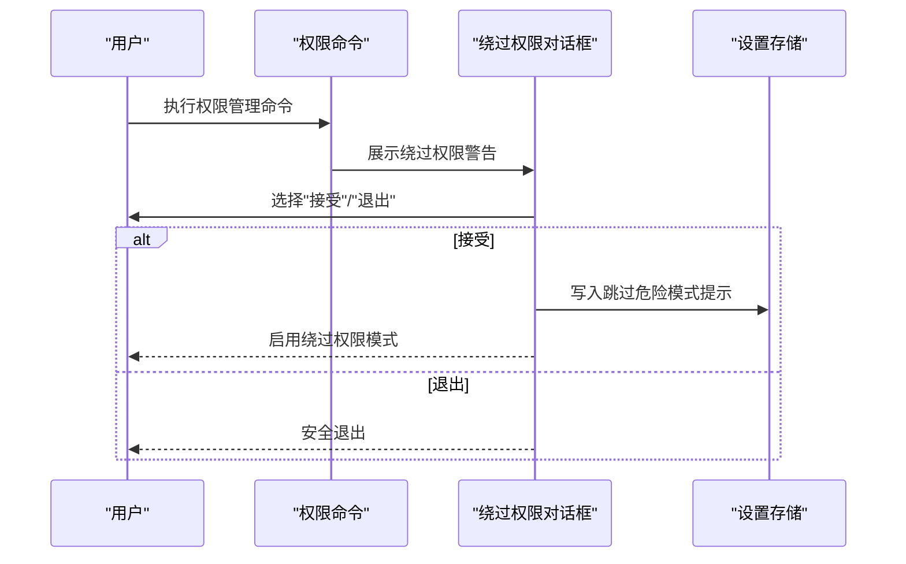
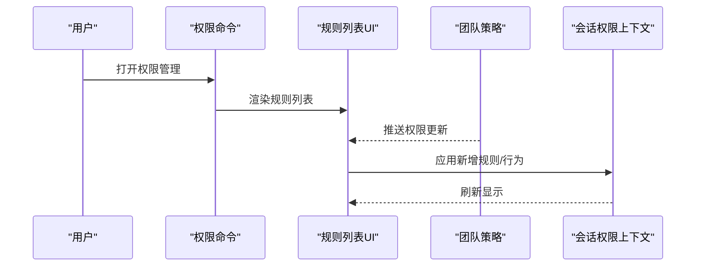
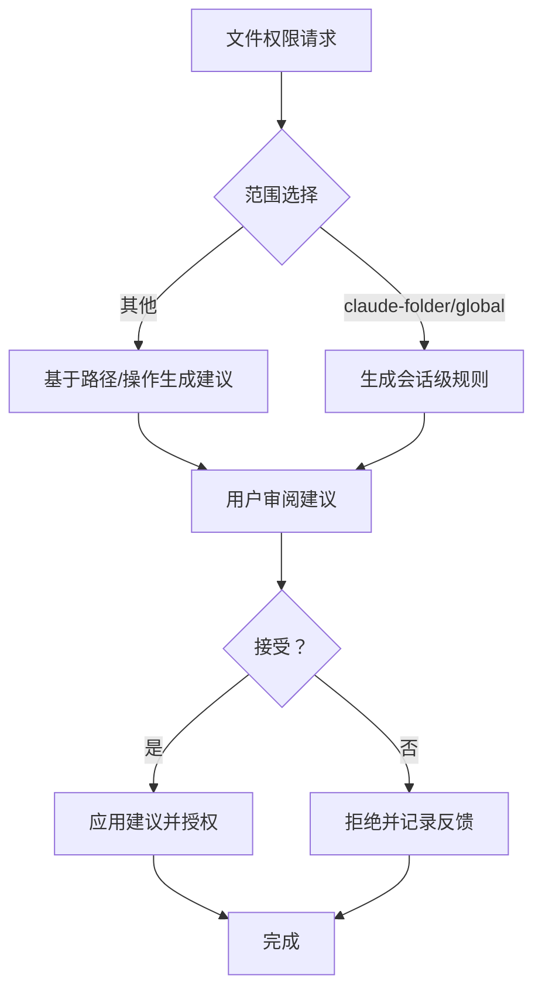
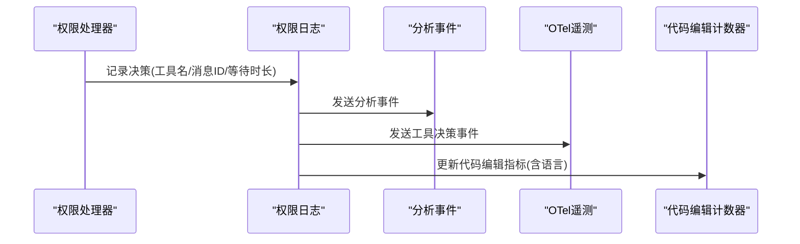
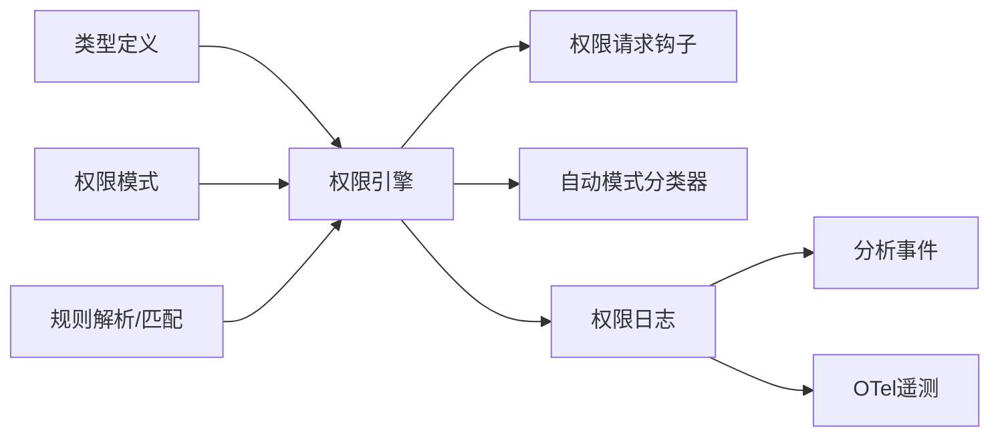

# 工具权限控制系统

<cite>
**本文档引用的文件**
- [src\types\permissions.ts](file://src\types\permissions.ts)
- [src\utils\permissions\permissions.ts](file://src\utils\permissions\permissions.ts)
- [src\hooks\useCanUseTool.tsx](file://src\hooks\useCanUseTool.tsx)
- [src\utils\permissions\PermissionMode.ts](file://src\utils\permissions\PermissionMode.ts)
- [src\utils\permissions\bypassPermissionsKillswitch.ts](file://src\utils\permissions\bypassPermissionsKillswitch.ts)
- [src\hooks\toolPermission\permissionLogging.ts](file://src\hooks\toolPermission\permissionLogging.ts)
- [src\components\permissions\FilePermissionDialog\usePermissionHandler.ts](file://src\components\permissions\FilePermissionDialog\usePermissionHandler.ts)
- [src\components\BypassPermissionsModeDialog.tsx](file://src\components\BypassPermissionsModeDialog.tsx)
- [src\commands\permissions\permissions.tsx](file://src\commands\permissions\permissions.tsx)
- [src\commands\permissions\index.ts](file://src\commands\permissions\index.ts)
- [src\hooks\useInboxPoller.ts](file://src\hooks\useInboxPoller.ts)
</cite>

## 目录
1. [简介](#简介)
2. [项目结构](#项目结构)
3. [核心组件](#核心组件)
4. [架构总览](#架构总览)
5. [详细组件分析](#详细组件分析)
6. [依赖关系分析](#依赖关系分析)
7. [性能考量](#性能考量)
8. [故障排除指南](#故障排除指南)
9. [结论](#结论)
10. [附录](#附录)

## 简介
本技术文档面向 Claude Code 的工具权限控制系统，系统性阐述权限检查机制的架构设计、权限分类（允许、拒绝、询问）、权限规则引擎与自动决策系统。文档覆盖工具权限验证流程（输入参数验证、路径安全检查、危险操作防护），并解释权限绕过机制、管理员模式与安全策略配置。同时提供权限规则配置指南与自定义权限处理器的开发方法，并说明权限相关的错误处理、日志记录与审计跟踪机制。

## 项目结构
权限系统围绕“类型定义—规则引擎—决策执行—交互与日志”四个层面组织，关键模块包括：
- 类型与行为：权限模式、行为、规则、更新、决策结果等类型定义
- 规则引擎：规则解析、匹配、优先级与组合逻辑
- 决策执行：权限检查主流程、自动模式分类器、钩子扩展点
- 交互与日志：用户对话框、权限处理器、审计事件与遥测

**图表来源**
- [src\types\permissions.ts:16-442](file://src\types\permissions.ts#L16-L442)
- [src\utils\permissions\permissions.ts:473-800](file://src\utils\permissions\permissions.ts#L473-L800)
- [src\hooks\useCanUseTool.tsx:28-204](file://src\hooks\useCanUseTool.tsx#L28-L204)
- [src\hooks\toolPermission\permissionLogging.ts:181-239](file://src\hooks\toolPermission\permissionLogging.ts#L181-L239)

**章节来源**
- [src\types\permissions.ts:1-442](file://src\types\permissions.ts#L1-L442)
- [src\utils\permissions\permissions.ts:1-800](file://src\utils\permissions\permissions.ts#L1-L800)

## 核心组件
- 权限模式与行为
  - 模式：默认、计划模式、接受编辑、绕过权限、不询问、自动模式（ant 专属）
  - 行为：允许、拒绝、询问
- 权限规则与更新
  - 规则来源：用户设置、项目设置、本地设置、标志、策略、命令行、会话
  - 更新操作：添加、替换、移除规则；设置模式；增删工作目录
- 决策结果
  - 允许、拒绝、询问；支持建议更新、内容块、元数据、异步分类器提示
- 自动模式与分类器
  - 接受编辑快速路径、安全工具白名单、YOLO 分类器、并发拒绝计数与回退提示

**章节来源**
- [src\types\permissions.ts:16-442](file://src\types\permissions.ts#L16-L442)
- [src\utils\permissions\PermissionMode.ts:42-91](file://src\utils\permissions\PermissionMode.ts#L42-L91)
- [src\utils\permissions\permissions.ts:473-800](file://src\utils\permissions\permissions.ts#L473-L800)

## 架构总览
权限系统采用“规则驱动 + 自动决策 + 钩子扩展”的分层架构：
- 规则层：集中管理规则来源与行为，提供规则匹配与优先级判定
- 决策层：统一入口 hasPermissionsToUseTool，串联规则匹配、自动模式分类器、钩子与上下文转换
- 交互层：根据决策行为触发对话框或直接通过，支持一次性/会话级授权与建议更新
- 日志层：集中记录批准/拒绝事件、等待时长、代码编辑工具语言属性与 OTel 指标

**图表来源**
- [src\hooks\useCanUseTool.tsx:28-204](file://src\hooks\useCanUseTool.tsx#L28-L204)
- [src\utils\permissions\permissions.ts:473-800](file://src\utils\permissions\permissions.ts#L473-L800)
- [src\hooks\toolPermission\permissionLogging.ts:181-239](file://src\hooks\toolPermission\permissionLogging.ts#L181-L239)

## 详细组件分析

### 组件A：权限检查主流程（hasPermissionsToUseTool）
- 职责
  - 统一入口，串联规则匹配、自动模式分类器、钩子与上下文转换
  - 处理“不询问”模式的强制拒绝转换
  - 在自动模式下重置连续拒绝计数
- 关键流程
  - 规则匹配：工具级/内容级规则、MCP 服务器级规则、代理工具类型规则
  - 自动模式：接受编辑快速路径、安全工具白名单、YOLO 分类器
  - 钩子扩展：异步代理场景下的权限请求钩子
  - 上下文转换：dontAsk 模式转换、shouldAvoidPermissionPrompts 场景处理
- 错误处理
  - 中断/用户中止：抛出特定错误类型，上层捕获后取消并记录
  - 分类器异常：降级为提示或拒绝，必要时通知用户

**图表来源**
- [src\utils\permissions\permissions.ts:473-800](file://src\utils\permissions\permissions.ts#L473-L800)

**章节来源**
- [src\utils\permissions\permissions.ts:473-800](file://src\utils\permissions\permissions.ts#L473-L800)

### 组件B：权限模式与自动模式
- 权限模式
  - 默认、计划模式、接受编辑、绕过权限、不询问、自动模式（ant 专属）
  - 外部模式映射与标题/符号/颜色配置
- 自动模式
  - 接受编辑快速路径、安全工具白名单、YOLO 分类器
  - 连续拒绝计数与回退提示，保护用户免受频繁阻断
  - 针对 PowerShell 的特殊限制（ant 构建可启用）

**图表来源**
- [src\utils\permissions\PermissionMode.ts:42-91](file://src\utils\permissions\PermissionMode.ts#L42-L91)
- [src\types\permissions.ts:44-147](file://src\types\permissions.ts#L44-L147)

**章节来源**
- [src\utils\permissions\PermissionMode.ts:1-142](file://src\utils\permissions\PermissionMode.ts#L1-L142)
- [src\types\permissions.ts:44-147](file://src\types\permissions.ts#L44-L147)

### 组件C：权限绕过机制与管理员模式
- 绕过权限模式
  - 提供高风险模式开关，仅在沙箱容器/VM 中使用
  - 首次启用弹窗确认，写入用户设置以跳过后续危险提示
- 管理员模式（绕过权限）
  - 通过命令入口与对话框实现
  - 支持登录后重置检查状态，确保组织策略生效

**图表来源**
- [src\components\BypassPermissionsModeDialog.tsx:12-87](file://src\components\BypassPermissionsModeDialog.tsx#L12-L87)
- [src\commands\permissions\permissions.tsx:1-9](file://src\commands\permissions\permissions.tsx#L1-L9)
- [src\commands\permissions\index.ts:1-11](file://src\commands\permissions\index.ts#L1-L11)

**章节来源**
- [src\components\BypassPermissionsModeDialog.tsx:1-87](file://src\components\BypassPermissionsModeDialog.tsx#L1-L87)
- [src\utils\permissions\bypassPermissionsKillswitch.ts:19-70](file://src\utils\permissions\bypassPermissionsKillswitch.ts#L19-L70)

### 组件D：权限规则配置与团队策略
- 规则配置
  - 通过命令入口打开规则列表，支持批量重试拒绝项
- 团队策略
  - 通过消息总线接收团队权限更新，动态应用到会话上下文
  - 支持规则与行为的增量更新与持久化

**图表来源**
- [src\commands\permissions\permissions.tsx:1-9](file://src\commands\permissions\permissions.tsx#L1-L9)
- [src\hooks\useInboxPoller.ts:514-546](file://src\hooks\useInboxPoller.ts#L514-L546)

**章节来源**
- [src\commands\permissions\permissions.tsx:1-9](file://src\commands\permissions\permissions.tsx#L1-L9)
- [src\hooks\useInboxPoller.ts:514-546](file://src\hooks\useInboxPoller.ts#L514-L546)

### 组件E：权限处理器与文件系统安全
- 文件权限处理器
  - 支持一次性/会话级授权、反馈收集、建议生成
  - 针对 .claude/ 与全局 .claude/ 范围的快捷授权
- 文件系统安全
  - 基于路径与操作类型生成建议规则，避免过度授权
  - 与工具输入模式解耦，支持异步语言识别

**图表来源**
- [src\components\permissions\FilePermissionDialog\usePermissionHandler.ts:63-176](file://src\components\permissions\FilePermissionDialog\usePermissionHandler.ts#L63-L176)

**章节来源**
- [src\components\permissions\FilePermissionDialog\usePermissionHandler.ts:1-186](file://src\components\permissions\FilePermissionDialog\usePermissionHandler.ts#L1-L186)

### 组件F：日志记录与审计跟踪
- 决策日志
  - 统一入口 logPermissionDecision，区分批准/拒绝事件
  - 支持分类器来源、钩子来源、用户来源等多维标签
- 代码编辑工具指标
  - 基于文件路径推断语言，构建 OTel 计数器属性
- 事件与遥测
  - 分析事件、OTel 事件、工具使用决策存储

**图表来源**
- [src\hooks\toolPermission\permissionLogging.ts:181-239](file://src\hooks\toolPermission\permissionLogging.ts#L181-L239)

**章节来源**
- [src\hooks\toolPermission\permissionLogging.ts:1-239](file://src\hooks\toolPermission\permissionLogging.ts#L1-L239)

## 依赖关系分析
- 模块耦合
  - 类型定义与规则引擎解耦，通过纯类型与常量避免循环依赖
  - 决策层依赖规则引擎与自动模式模块，但通过特性开关隔离
- 外部依赖
  - 分类器模块按特性开关加载，避免非 ant 环境的运行时依赖
  - 遥测与分析服务通过统一入口注入，便于替换与测试

**图表来源**
- [src\types\permissions.ts:1-442](file://src\types\permissions.ts#L1-L442)
- [src\utils\permissions\permissions.ts:59-101](file://src\utils\permissions\permissions.ts#L59-L101)
- [src\hooks\toolPermission\permissionLogging.ts:1-239](file://src\hooks\toolPermission\permissionLogging.ts#L1-L239)

**章节来源**
- [src\types\permissions.ts:1-442](file://src\types\permissions.ts#L1-L442)
- [src\utils\permissions\permissions.ts:59-101](file://src\utils\permissions\permissions.ts#L59-L101)

## 性能考量
- 规则匹配优化
  - 工具级规则与内容级规则分离，减少不必要的解析成本
  - MCP 规则解析复用解析器，避免重复计算
- 自动模式加速
  - 接受编辑快速路径与安全工具白名单显著降低分类器调用频率
  - 并发拒绝计数与回退提示避免频繁阻断用户体验
- 异步与超时
  - 分类器评估支持超时与竞态，避免阻塞 UI
  - 钩子扩展点异步执行，不影响主流程

## 故障排除指南
- 常见问题
  - 用户中止/中断：系统捕获特定错误类型，记录取消并返回拒绝
  - 分类器不可用：降级为提示或拒绝，必要时输出错误 dump 路径
  - 自动模式不可用：根据门控策略禁用，通知用户并回退到交互模式
- 排查步骤
  - 查看权限日志中的等待时长与来源标签
  - 检查团队策略是否推送了新的规则/行为
  - 确认绕过权限模式是否被组织策略禁用

**章节来源**
- [src\hooks\useCanUseTool.tsx:171-182](file://src\hooks\useCanUseTool.tsx#L171-L182)
- [src\utils\permissions\bypassPermissionsKillswitch.ts:74-117](file://src\utils\permissions\bypassPermissionsKillswitch.ts#L74-L117)
- [src\hooks\toolPermission\permissionLogging.ts:181-239](file://src\hooks\toolPermission\permissionLogging.ts#L181-L239)

## 结论
该权限控制系统通过清晰的类型体系、规则引擎与自动决策机制，实现了从“规则驱动”到“智能辅助”的多层次安全控制。系统在保证安全性的同时，提供了灵活的策略配置、强大的钩子扩展能力与完善的日志审计，适用于从个人开发者到企业团队的多样化场景。

## 附录

### 权限规则配置指南
- 规则来源
  - 用户设置、项目设置、本地设置、标志、策略、命令行、会话
- 规则语法
  - 工具级规则：如 Bash
  - 内容级规则：如 Bash(prefix:*)
  - MCP 服务器级规则：如 mcp__server1 或 mcp__server1__*
- 更新方式
  - 添加/替换/移除规则
  - 设置模式（默认/计划/接受编辑/绕过权限/不询问/自动）
  - 增删工作目录范围

**章节来源**
- [src\types\permissions.ts:54-147](file://src\types\permissions.ts#L54-L147)
- [src\utils\permissions\permissions.ts:122-302](file://src\utils\permissions\permissions.ts#L122-L302)

### 自定义权限处理器开发方法
- 处理器接口
  - 接收权限选项与参数，返回处理结果
  - 支持一次性/会话级授权、反馈收集、建议生成
- 开发要点
  - 明确操作类型与路径范围，生成最小化建议
  - 与工具输入模式解耦，支持异步语言识别
  - 记录分析事件与 OTel 指标，便于追踪与优化

**章节来源**
- [src\components\permissions\FilePermissionDialog\usePermissionHandler.ts:44-186](file://src\components\permissions\FilePermissionDialog\usePermissionHandler.ts#L44-L186)