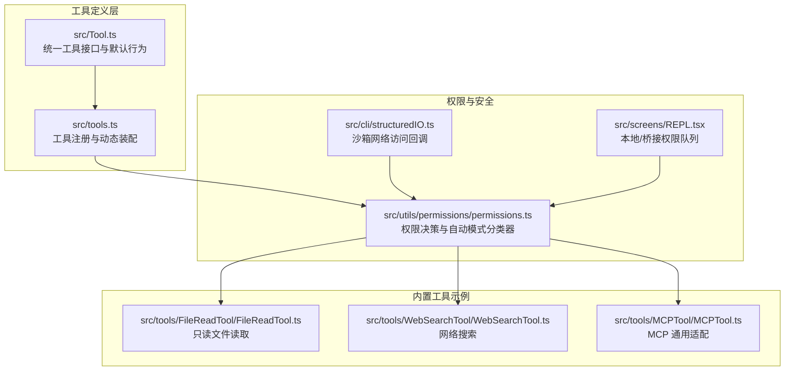
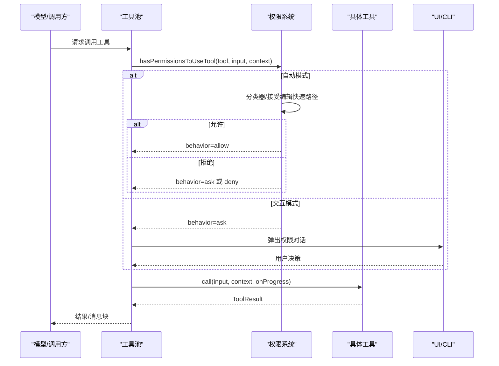
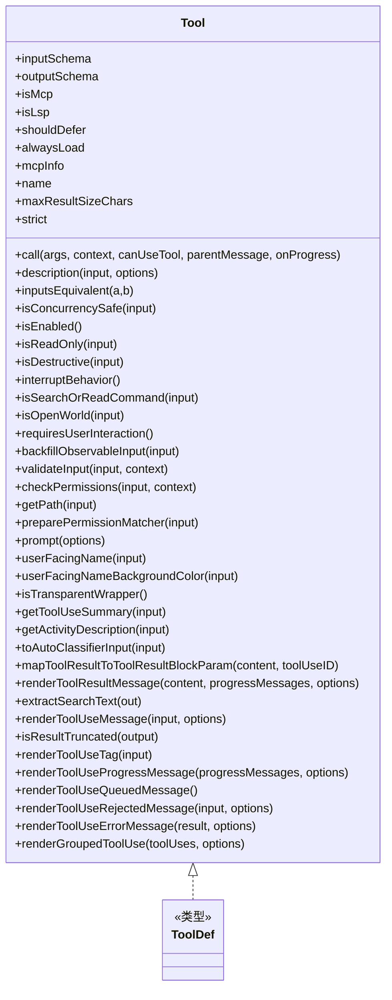
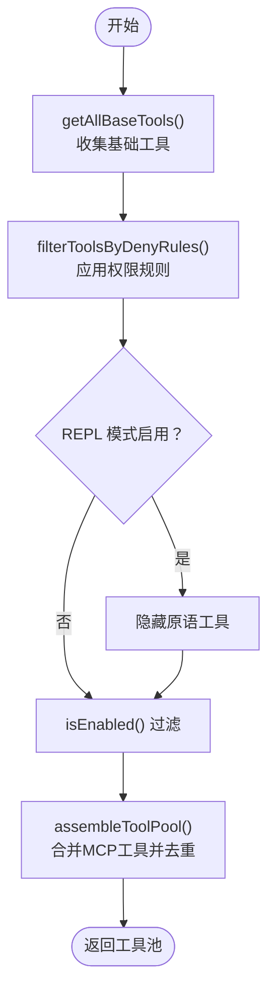
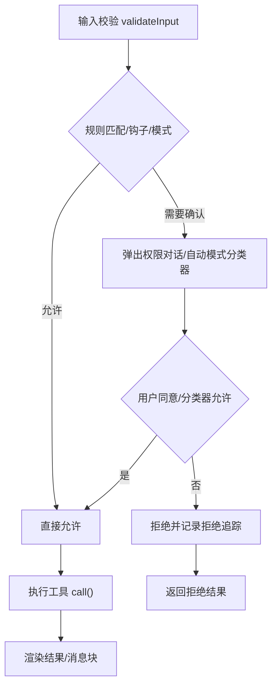
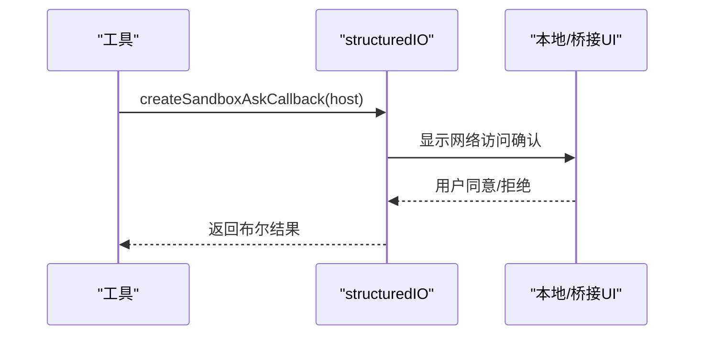
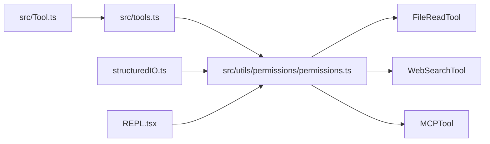

# 工具系统架构

<cite>
**本文档引用的文件**
- [src/Tool.ts](file://src/Tool.ts)
- [src/tools.ts](file://src/tools.ts)
- [src/utils/permissions/permissions.ts](file://src/utils/permissions/permissions.ts)
- [src/cli/structuredIO.ts](file://src/cli/structuredIO.ts)
- [src/screens/REPL.tsx](file://src/screens/REPL.tsx)
- [src/tools/FileReadTool/FileReadTool.ts](file://src/tools/FileReadTool/FileReadTool.ts)
- [src/tools/WebSearchTool/WebSearchTool.ts](file://src/tools/WebSearchTool/WebSearchTool.ts)
- [src/tools/MCPTool/MCPTool.ts](file://src/tools/MCPTool/MCPTool.ts)
</cite>

## 目录
1. [简介](#简介)
2. [项目结构](#项目结构)
3. [核心组件](#核心组件)
4. [架构总览](#架构总览)
5. [详细组件分析](#详细组件分析)
6. [依赖关系分析](#依赖关系分析)
7. [性能考虑](#性能考虑)
8. [故障排除指南](#故障排除指南)
9. [结论](#结论)
10. [附录](#附录)

## 简介
本文件为 Claude Code 工具系统提供全面技术文档，重点阐述工具系统的统一接口设计、工具元数据管理、工具生命周期、内置工具实现机制（文件操作、系统命令、网络搜索、代理集成等）、权限控制系统、安全沙箱机制与工具执行的安全检查流程，并给出工具注册机制、动态加载策略与扩展开发指南。文档通过分层讲解与可视化图表帮助读者快速理解系统架构与实现细节。

## 项目结构
工具系统围绕统一的 Tool 接口构建，所有内置工具通过 buildTool 构建并注册到工具池中。权限系统贯穿工具调用前的输入校验、权限决策与自动模式分类器；MCP 工具通过动态装配接入；CLI/REPL 提供交互式权限请求与沙箱网络访问控制。

**图表来源**
- [src/Tool.ts:1-793](file://src/Tool.ts#L1-L793)
- [src/tools.ts:1-390](file://src/tools.ts#L1-L390)
- [src/utils/permissions/permissions.ts:1-800](file://src/utils/permissions/permissions.ts#L1-L800)
- [src/cli/structuredIO.ts:36-775](file://src/cli/structuredIO.ts#L36-L775)
- [src/screens/REPL.tsx:2257-2369](file://src/screens/REPL.tsx#L2257-L2369)
- [src/tools/FileReadTool/FileReadTool.ts:1-800](file://src/tools/FileReadTool/FileReadTool.ts#L1-L800)
- [src/tools/WebSearchTool/WebSearchTool.ts:1-436](file://src/tools/WebSearchTool/WebSearchTool.ts#L1-L436)
- [src/tools/MCPTool/MCPTool.ts:1-78](file://src/tools/MCPTool/MCPTool.ts#L1-L78)

**章节来源**
- [src/Tool.ts:1-793](file://src/Tool.ts#L1-L793)
- [src/tools.ts:1-390](file://src/tools.ts#L1-L390)

## 核心组件
- 统一工具接口：定义工具的输入输出模式、生命周期钩子、UI 渲染、权限与安全相关方法。
- 工具构建器：buildTool 提供安全默认值，确保工具实现最小化样板代码。
- 工具注册与动态装配：getAllBaseTools/getTools/assembleToolPool 统一收集内置工具，过滤权限规则，合并 MCP 工具。
- 权限系统：hasPermissionsToUseTool 内置权限决策流程，支持自动模式分类器、拒绝追踪与规则匹配。
- 沙箱与网络访问：CLI/REPL 提供沙箱网络权限请求与桥接同步机制。

**章节来源**
- [src/Tool.ts:362-793](file://src/Tool.ts#L362-L793)
- [src/tools.ts:193-390](file://src/tools.ts#L193-L390)
- [src/utils/permissions/permissions.ts:473-800](file://src/utils/permissions/permissions.ts#L473-L800)

## 架构总览
工具系统采用“接口统一 + 动态装配 + 权限前置”的架构。工具在注册阶段被标准化，运行时根据权限上下文与自动模式进行决策，必要时弹出权限对话或使用分类器自动审批。

**图表来源**
- [src/utils/permissions/permissions.ts:473-800](file://src/utils/permissions/permissions.ts#L473-L800)
- [src/Tool.ts:379-416](file://src/Tool.ts#L379-L416)
- [src/tools.ts:345-367](file://src/tools.ts#L345-L367)

## 详细组件分析

### 统一工具接口与生命周期
- 抽象方法与生命周期
  - 调用入口：call(args, context, canUseTool, parentMessage, onProgress)
  - 描述生成：description(input, options) 用于工具提示与搜索
  - 输入/输出模式：inputSchema/outputSchema（可选 JSON Schema）
  - 并发与只读：isConcurrencySafe/isReadOnly/isDestructive/interruptBehavior
  - 权限与安全：validateInput/checkPermissions/preparePermissionMatcher
  - UI 渲染：renderToolUseMessage/renderToolResultMessage/renderToolUseProgressMessage
  - 元信息：name/aliases/searchHint/maxResultSizeChars/strict/isOpenWorld/alwaysLoad/shouldDefer
- 默认行为与构建器
  - buildTool 提供 fail-closed 的安全默认值（如 checkPermissions 返回允许），避免遗漏安全逻辑
  - 工具可通过重写默认方法定制行为

**图表来源**
- [src/Tool.ts:362-695](file://src/Tool.ts#L362-L695)

**章节来源**
- [src/Tool.ts:362-793](file://src/Tool.ts#L362-L793)

### 工具注册机制与动态加载
- 工具集合来源
  - getAllBaseTools：按环境标志与特性开关组装基础工具集
  - getTools：应用权限规则过滤、REPL 模式屏蔽、isEnabled 过滤
  - assembleToolPool：合并内置工具与 MCP 工具，保持排序稳定与去重
  - getMergedTools：返回完整工具列表（含 MCP）
- 动态特性开关
  - 通过 feature()/process.env 控制工具启用/禁用，实现按需裁剪与平台差异

**图表来源**
- [src/tools.ts:193-390](file://src/tools.ts#L193-L390)

**章节来源**
- [src/tools.ts:193-390](file://src/tools.ts#L193-L390)

### 权限控制系统与安全检查流程
- 权限决策主流程
  - hasPermissionsToUseTool：综合规则、钩子、自动模式与拒绝追踪，决定 allow/ask/deny
  - 自动模式：acceptEdits 快速路径、安全工具白名单、YOLO 分类器
  - 钩子：headless/异步代理在无 UI 场景下先行决策
  - 拒绝追踪：连续拒绝计数与持久化，影响后续自动决策
- 规则匹配与显示
  - 支持工具名、MCP 服务器级规则、通配符匹配
  - createPermissionRequestMessage 生成用户可见的决策说明

**图表来源**
- [src/utils/permissions/permissions.ts:473-800](file://src/utils/permissions/permissions.ts#L473-L800)
- [src/Tool.ts:489-503](file://src/Tool.ts#L489-L503)

**章节来源**
- [src/utils/permissions/permissions.ts:1-800](file://src/utils/permissions/permissions.ts#L1-L800)

### 安全沙箱与网络访问控制
- CLI 沙箱网络权限
  - structuredIO 中的 createSandboxAskCallback 将网络访问请求包装为 can_use_tool 请求，等待远端或本地确认
- REPL 本地/桥接权限队列
  - REPL.tsx 维护沙箱权限请求队列，支持本地弹窗与桥接同步，同一主机的批量请求统一处理

**图表来源**
- [src/cli/structuredIO.ts:731-753](file://src/cli/structuredIO.ts#L731-L753)
- [src/screens/REPL.tsx:2257-2369](file://src/screens/REPL.tsx#L2257-L2369)

**章节来源**
- [src/cli/structuredIO.ts:36-775](file://src/cli/structuredIO.ts#L36-L775)
- [src/screens/REPL.tsx:2257-2369](file://src/screens/REPL.tsx#L2257-L2369)

### 内置工具实现机制

#### 文件读取工具（只读）
- 设计要点
  - 只读属性与并发安全：isReadOnly/isConcurrencySafe
  - 输入校验：路径展开、UNC 检查、二进制扩展限制、设备文件阻断
  - 权限匹配：preparePermissionMatcher 支持通配符规则
  - 输出类型：文本/图像/笔记本/PDF/部分提取/未变更占位
  - 性能优化：读取去重（相同范围且未修改文件直接返回占位）
- 安全增强
  - 读取内容附加风险提醒（除特定模型豁免）
  - 会话内存文件时间戳前缀提示新鲜度

**章节来源**
- [src/tools/FileReadTool/FileReadTool.ts:1-800](file://src/tools/FileReadTool/FileReadTool.ts#L1-L800)

#### 网络搜索工具（只读）
- 设计要点
  - 仅在支持的提供商/模型上启用
  - 输入校验：查询必填、域名黑白名单互斥
  - 流式进度：基于流事件更新查询与结果数量
  - 输出格式：混合文本摘要与链接列表
- 权限策略
  - 使用 checkPermissions 返回 passthrough 并提供添加规则建议

**章节来源**
- [src/tools/WebSearchTool/WebSearchTool.ts:1-436](file://src/tools/WebSearchTool/WebSearchTool.ts#L1-L436)

#### MCP 工具适配器
- 设计要点
  - 通用输入/输出模式，实际名称与描述由 MCP 客户端动态覆盖
  - 开放世界标记与截断检测用于终端输出控制
  - 权限策略：统一返回 passthrough，交由 MCP 服务端策略处理

**章节来源**
- [src/tools/MCPTool/MCPTool.ts:1-78](file://src/tools/MCPTool/MCPTool.ts#L1-L78)

## 依赖关系分析

**图表来源**
- [src/Tool.ts:1-793](file://src/Tool.ts#L1-L793)
- [src/tools.ts:1-390](file://src/tools.ts#L1-L390)
- [src/utils/permissions/permissions.ts:1-800](file://src/utils/permissions/permissions.ts#L1-L800)
- [src/cli/structuredIO.ts:36-775](file://src/cli/structuredIO.ts#L36-L775)
- [src/screens/REPL.tsx:2257-2369](file://src/screens/REPL.tsx#L2257-L2369)

**章节来源**
- [src/tools.ts:1-390](file://src/tools.ts#L1-L390)

## 性能考虑
- 工具并发与只读：合理设置 isConcurrencySafe/isReadOnly 可减少上下文切换与锁竞争
- 输入校验前置：在 validateInput 中尽早失败，避免昂贵 I/O
- 输出大小控制：maxResultSizeChars 与 token 估算，防止大结果回传
- 读取去重：FileReadTool 对相同范围且未修改文件返回占位，显著降低缓存创建开销
- 自动模式快速路径：acceptEdits 白名单与分类器减少交互延迟

[本节为通用指导，无需特定文件来源]

## 故障排除指南
- 权限相关
  - 检查 deny/ask 规则是否误命中工具或路径
  - 在自动模式下观察分类器可用性与错误 dump
- 网络访问
  - CLI/REPL 中沙箱网络请求失败时，确认本地/桥接 UI 是否已授权
- 工具调用
  - 若工具被拒绝，查看 createPermissionRequestMessage 的决策原因
  - 对于 Bash/PowerShell 等高危工具，确认自动模式策略与 acceptEdits 快速路径

**章节来源**
- [src/utils/permissions/permissions.ts:137-211](file://src/utils/permissions/permissions.ts#L137-L211)
- [src/cli/structuredIO.ts:731-753](file://src/cli/structuredIO.ts#L731-L753)
- [src/screens/REPL.tsx:2257-2369](file://src/screens/REPL.tsx#L2257-L2369)

## 结论
该工具系统以统一接口为核心，结合严格的权限前置与自动模式分类器，在保证安全性的同时提供灵活的扩展能力。通过 buildTool 的安全默认与动态装配机制，开发者可以快速实现新工具并纳入统一的权限与 UI 生态。沙箱网络访问与 REPL/CLI 的权限队列进一步增强了跨环境的一致性与可控性。

[本节为总结，无需特定文件来源]

## 附录

### 工具开发规范与最佳实践
- 使用 buildTool 构建工具，仅覆盖必要方法
- 明确只读/破坏性/并发安全属性，提升系统稳定性
- 实现 validateInput 与 checkPermissions，确保权限前置
- 提供 userFacingName/getToolUseSummary/getActivityDescription，改善用户体验
- 合理设置 maxResultSizeChars 与输出类型，避免超大结果
- 对高危工具（删除/覆盖/发送）明确 isDestructive 并在 UI 中突出提示

[本节为通用指导，无需特定文件来源]