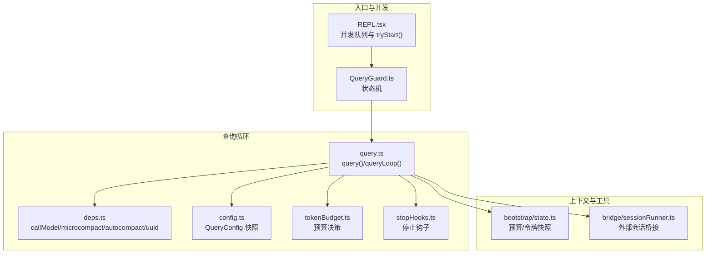
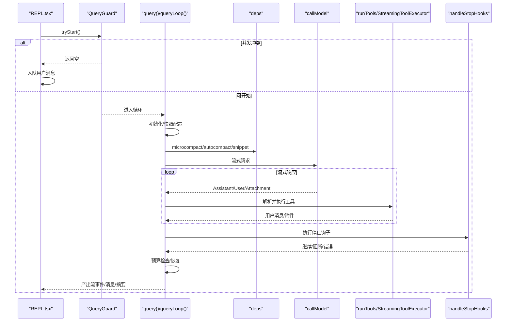
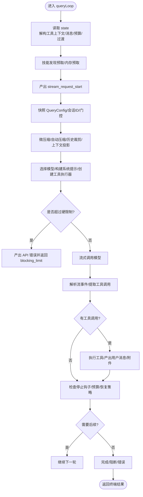
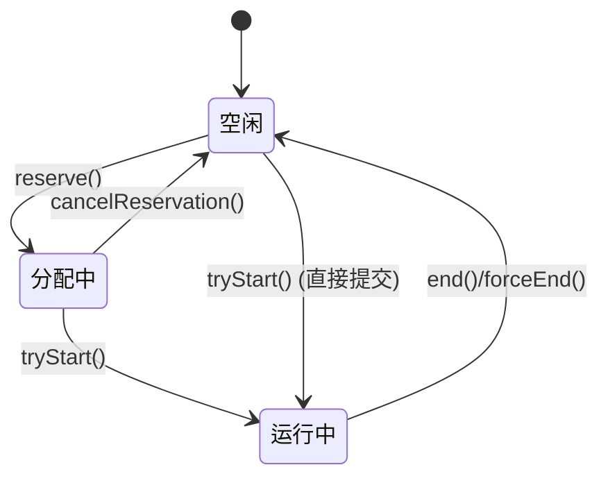
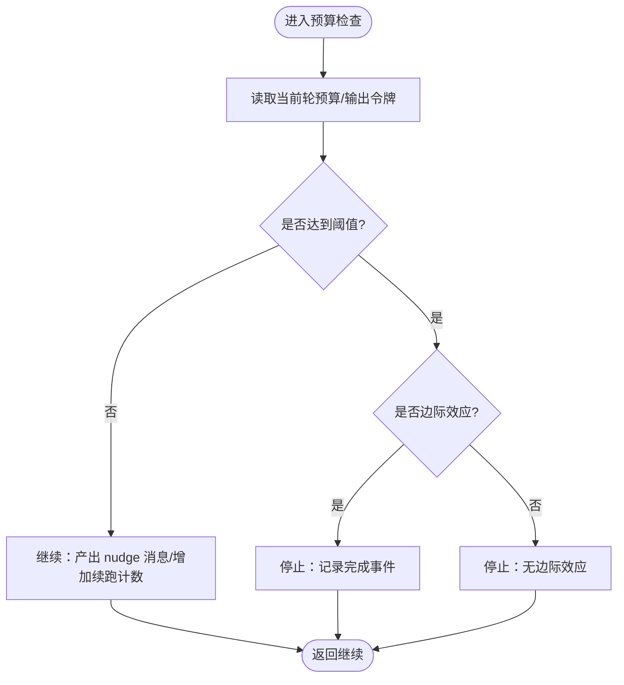
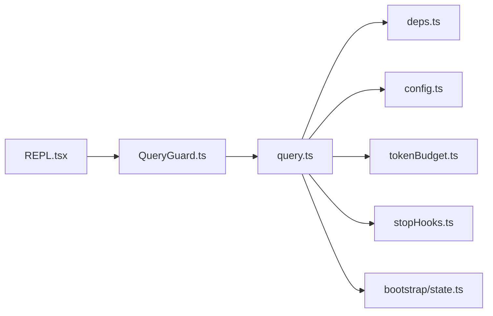

# Agent 循环机制

<cite>
**本文引用的文件**
- [src/query.ts](file://src/query.ts)
- [src/query/deps.ts](file://src/query/deps.ts)
- [src/query/config.ts](file://src/query/config.ts)
- [src/query/tokenBudget.ts](file://src/query/tokenBudget.ts)
- [src/query/stopHooks.ts](file://src/query/stopHooks.ts)
- [src/utils/QueryGuard.ts](file://src/utils/QueryGuard.ts)
- [src/screens/REPL.tsx](file://src/screens/REPL.tsx)
- [src/bootstrap/state.ts](file://src/bootstrap/state.ts)
- [src/bridge/sessionRunner.ts](file://src/bridge/sessionRunner.ts)
</cite>

## 目录
1. [简介](#简介)
2. [项目结构](#项目结构)
3. [核心组件](#核心组件)
4. [架构总览](#架构总览)
5. [详细组件分析](#详细组件分析)
6. [依赖关系分析](#依赖关系分析)
7. [性能考量](#性能考量)
8. [故障排查指南](#故障排查指南)
9. [结论](#结论)
10. [附录](#附录)

## 简介
本文件系统性阐述 Claude Code Agent 的“Agent 循环”机制，聚焦以下关键能力：
- query 函数的异步生成器实现与消息流式传输
- 消息循环的状态管理与迭代控制逻辑
- 状态转换、令牌预算跟踪与上下文窗口管理
- 工具调用处理、错误恢复与并发保护
- 循环初始化、状态快照与性能监控点
- 启动、执行与终止的完整流程示例路径

目标是帮助读者在不深入源码细节的前提下，理解 Agent 循环的工作原理与扩展点。

## 项目结构
Agent 循环位于查询子系统，围绕 query 函数构建，贯穿上下文压缩、工具执行、停止钩子、预算控制与错误恢复等模块。核心文件如下：
- 查询主循环：src/query.ts
- 依赖注入：src/query/deps.ts
- 配置快照：src/query/config.ts
- 令牌预算：src/query/tokenBudget.ts
- 停止钩子：src/query/stopHooks.ts
- 并发保护：src/utils/QueryGuard.ts
- REPL 入口与并发队列：src/screens/REPL.tsx
- 会话与预算状态：src/bootstrap/state.ts
- 桥接会话运行器（外部会话桥接）：src/bridge/sessionRunner.ts

图表来源
- [src/screens/REPL.tsx:2856-2888](file://src/screens/REPL.tsx#L2856-L2888)
- [src/utils/QueryGuard.ts:1-122](file://src/utils/QueryGuard.ts#L1-L122)
- [src/query.ts:219-300](file://src/query.ts#L219-L300)
- [src/query/deps.ts:1-41](file://src/query/deps.ts#L1-L41)
- [src/query/config.ts:1-47](file://src/query/config.ts#L1-L47)
- [src/query/tokenBudget.ts:1-94](file://src/query/tokenBudget.ts#L1-L94)
- [src/query/stopHooks.ts:1-120](file://src/query/stopHooks.ts#L1-L120)
- [src/bootstrap/state.ts:720-750](file://src/bootstrap/state.ts#L720-L750)
- [src/bridge/sessionRunner.ts:1-120](file://src/bridge/sessionRunner.ts#L1-L120)

章节来源
- [src/query.ts:219-300](file://src/query.ts#L219-L300)
- [src/query/deps.ts:1-41](file://src/query/deps.ts#L1-L41)
- [src/query/config.ts:1-47](file://src/query/config.ts#L1-L47)
- [src/query/tokenBudget.ts:1-94](file://src/query/tokenBudget.ts#L1-L94)
- [src/query/stopHooks.ts:1-120](file://src/query/stopHooks.ts#L1-L120)
- [src/utils/QueryGuard.ts:1-122](file://src/utils/QueryGuard.ts#L1-L122)
- [src/screens/REPL.tsx:2856-2888](file://src/screens/REPL.tsx#L2856-L2888)
- [src/bootstrap/state.ts:720-750](file://src/bootstrap/state.ts#L720-L750)
- [src/bridge/sessionRunner.ts:1-120](file://src/bridge/sessionRunner.ts#L1-L120)

## 核心组件
- 异步生成器 query：以 AsyncGenerator 形式产出流事件、消息与摘要，驱动单轮对话与多轮迭代。
- 查询循环 queryLoop：无限 while 循环，按轮次推进状态，执行上下文压缩、模型调用、工具执行与停止钩子。
- 依赖注入 deps：封装 callModel、microcompact、autocompact、uuid 等 I/O 与编排接口。
- 配置快照 QueryConfig：一次性捕获会话与运行时门控参数，避免每轮重复计算。
- 令牌预算 checkTokenBudget：基于输出令牌增量与阈值进行“继续/停止”决策。
- 停止钩子 handleStopHooks：在每轮结束时执行钩子，支持阻断、错误与摘要输出。
- 并发保护 QueryGuard：三态状态机，防止并发查询重入，支持保留/取消保留/强制结束。
- 会话状态与预算：bootstrap/state.ts 提供预算快照、当前轮预算与预算续跑计数。

章节来源
- [src/query.ts:219-300](file://src/query.ts#L219-L300)
- [src/query/deps.ts:1-41](file://src/query/deps.ts#L1-L41)
- [src/query/config.ts:1-47](file://src/query/config.ts#L1-L47)
- [src/query/tokenBudget.ts:1-94](file://src/query/tokenBudget.ts#L1-L94)
- [src/query/stopHooks.ts:1-120](file://src/query/stopHooks.ts#L1-L120)
- [src/utils/QueryGuard.ts:1-122](file://src/utils/QueryGuard.ts#L1-L122)
- [src/bootstrap/state.ts:720-750](file://src/bootstrap/state.ts#L720-L750)

## 架构总览
Agent 循环采用“轮次驱动”的异步生成器模式，每轮包含：
- 上下文准备：微压缩、自动压缩、历史裁剪、上下文投影与任务预算累计
- 模型调用：流式返回消息，按块解析工具调用
- 工具执行：串行或流式执行，产出用户消息与附件
- 停止钩子：评估是否继续、阻断或注入错误
- 预算与恢复：根据令牌预算决定继续或终止；对提示过长、输出超限、媒体过大等进行恢复

图表来源
- [src/screens/REPL.tsx:2856-2888](file://src/screens/REPL.tsx#L2856-L2888)
- [src/utils/QueryGuard.ts:61-67](file://src/utils/QueryGuard.ts#L61-L67)
- [src/query.ts:306-337](file://src/query.ts#L306-L337)
- [src/query/deps.ts:21-31](file://src/query/deps.ts#L21-L31)
- [src/query/stopHooks.ts:65-81](file://src/query/stopHooks.ts#L65-L81)

## 详细组件分析

### 异步生成器 query 与循环 queryLoop
- query 是一个 AsyncGenerator，返回类型包含流事件、请求开始、消息、墓碑、工具使用摘要与终端结果。
- queryLoop 是无限循环，每轮从 state 读取工具上下文、消息、预算与过渡信息，执行上下文压缩、模型调用、工具执行与停止钩子，最终根据条件继续或终止。
- 轮次变量 turnCount 与 transition 记录本次迭代的触发原因，便于测试与可观测性。

图表来源
- [src/query.ts:241-300](file://src/query.ts#L241-L300)
- [src/query.ts:337-420](file://src/query.ts#L337-L420)
- [src/query.ts:551-560](file://src/query.ts#L551-L560)
- [src/query.ts:826-863](file://src/query.ts#L826-L863)
- [src/query.ts:1062-1358](file://src/query.ts#L1062-L1358)

章节来源
- [src/query.ts:219-300](file://src/query.ts#L219-L300)
- [src/query.ts:306-337](file://src/query.ts#L306-L337)
- [src/query.ts:551-560](file://src/query.ts#L551-L560)
- [src/query.ts:826-863](file://src/query.ts#L826-L863)
- [src/query.ts:1062-1358](file://src/query.ts#L1062-L1358)

### 并发保护与队列处理
- QueryGuard 提供三态状态机：idle → dispatching → running，支持 reserve/cancelReservation/tryStart/end/forceEnd。
- REPL.tsx 在处理用户输入时调用 tryStart()，若返回空则判定并发冲突，将用户消息入队而非直接执行，避免竞态。

图表来源
- [src/utils/QueryGuard.ts:29-93](file://src/utils/QueryGuard.ts#L29-L93)
- [src/screens/REPL.tsx:2856-2888](file://src/screens/REPL.tsx#L2856-L2888)

章节来源
- [src/utils/QueryGuard.ts:1-122](file://src/utils/QueryGuard.ts#L1-L122)
- [src/screens/REPL.tsx:2856-2888](file://src/screens/REPL.tsx#L2856-L2888)

### 依赖注入与 I/O 编排
- deps.ts 定义了四个核心依赖：callModel、microcompact、autocompact、uuid，生产环境通过 productionDeps 注入真实实现。
- query.ts 在每轮循环中调用 deps.microcompact 与 deps.autocompact，确保上下文在进入模型前已压缩到合理规模。

章节来源
- [src/query/deps.ts:1-41](file://src/query/deps.ts#L1-L41)
- [src/query.ts:412-468](file://src/query.ts#L412-L468)

### 配置快照与运行时门控
- buildQueryConfig 一次性捕获 sessionId 与 gates（如 streamingToolExecution、emitToolUseSummaries、isAnt、fastModeEnabled），避免每轮重复计算与特征门控带来的副作用。
- gates 中的 feature() 门控在具体分支内保持树摇，不影响 QueryConfig 的纯数据快照。

章节来源
- [src/query/config.ts:1-47](file://src/query/config.ts#L1-L47)

### 令牌预算与上下文窗口管理
- checkTokenBudget 基于当前轮输出令牌增量与全局预算阈值，决定“继续/停止”，并记录边际效应与耗时。
- bootstrap/state.ts 提供 snapshotOutputTokensForTurn、getCurrentTurnTokenBudget、incrementBudgetContinuationCount 等接口，配合 queryLoop 中的预算检查形成闭环。
- 预算恢复路径包括：最大输出令牌恢复（meta 消息引导）、上下文压缩（自动/反应式）、提示过长恢复（上下文折叠/媒体剥离）。

图表来源
- [src/query/tokenBudget.ts:45-94](file://src/query/tokenBudget.ts#L45-L94)
- [src/bootstrap/state.ts:724-743](file://src/bootstrap/state.ts#L724-L743)
- [src/query.ts:1308-1355](file://src/query.ts#L1308-L1355)

章节来源
- [src/query/tokenBudget.ts:1-94](file://src/query/tokenBudget.ts#L1-L94)
- [src/bootstrap/state.ts:720-750](file://src/bootstrap/state.ts#L720-L750)
- [src/query.ts:1185-1256](file://src/query.ts#L1185-L1256)

### 工具调用与消息流式传输
- 流式模型调用通过 for-await-of 迭代返回的消息，逐块解析工具调用并交由 StreamingToolExecutor 或 runTools 执行。
- 工具执行完成后，normalizeMessagesForAPI 将结果标准化为用户消息与附件，随后进入下一轮或直接产出。
- 对于流式回退（如模型降级），query.ts 会清理孤儿消息、丢弃待决结果并重建执行器，保证一致性。

章节来源
- [src/query.ts:653-741](file://src/query.ts#L653-L741)
- [src/query.ts:837-863](file://src/query.ts#L837-L863)
- [src/query.ts:1360-1409](file://src/query.ts#L1360-L1409)

### 停止钩子与错误恢复
- handleStopHooks 在每轮结束后执行，产出进度、错误与摘要消息，支持阻止继续、注入阻断错误与团队成员钩子。
- 对于 API 错误（如提示过长、速率限制、认证失败），循环跳过钩子评估，直接返回相应原因。
- 对于可恢复错误（提示过长、媒体过大、最大输出令牌），循环尝试上下文折叠/反应式压缩/扩大输出上限等恢复策略。

章节来源
- [src/query/stopHooks.ts:65-120](file://src/query/stopHooks.ts#L65-L120)
- [src/query.ts:1062-1183](file://src/query.ts#L1062-L1183)
- [src/query.ts:1185-1256](file://src/query.ts#L1185-L1256)

### 循环初始化、状态快照与性能监控
- 初始化阶段：构建 QueryConfig、启动内存/技能预取、记录 headless 性能起点、设置 queryTracking 链 ID 与深度。
- 状态快照：QueryConfig 与会话状态在 query() 入口一次性快照，避免运行时波动；autoCompactTracking 与 taskBudgetRemaining 在压缩后更新。
- 性能监控：queryCheckpoint 用于关键节点打点；headlessProfilerCheckpoint 用于无头场景延迟追踪；日志事件覆盖预算、压缩、工具执行、钩子等。

章节来源
- [src/query.ts:293-305](file://src/query.ts#L293-L305)
- [src/query.ts:341-344](file://src/query.ts#L341-L344)
- [src/query.ts:449-451](file://src/query.ts#L449-L451)
- [src/query.ts:1308-1355](file://src/query.ts#L1308-L1355)

### 启动、执行与终止流程示例路径
- 启动：REPL.tsx 调用 QueryGuard.tryStart()，成功后进入 queryLoop。
- 执行：queryLoop 完成上下文压缩、模型调用、工具执行与钩子评估，期间产出流事件与消息。
- 终止：根据停止钩子、预算、错误或轮次上限返回终端结果；必要时产出墓碑消息清理中间状态。

章节来源
- [src/screens/REPL.tsx:2856-2888](file://src/screens/REPL.tsx#L2856-L2888)
- [src/query.ts:1704-1729](file://src/query.ts#L1704-L1729)

## 依赖关系分析
- query.ts 依赖 deps.ts 的 I/O 接口，依赖 config.ts 的 QueryConfig 快照，依赖 tokenBudget.ts 的预算决策，依赖 stopHooks.ts 的钩子执行。
- QueryGuard 与 REPL.tsx 协作实现并发控制，避免重复执行。
- bootstrap/state.ts 提供预算与令牌统计的全局状态，被 queryLoop 与预算模块共同使用。

图表来源
- [src/query.ts:103-112](file://src/query.ts#L103-L112)
- [src/query/deps.ts:21-31](file://src/query/deps.ts#L21-L31)
- [src/query/config.ts:29-46](file://src/query/config.ts#L29-L46)
- [src/query/tokenBudget.ts:1-20](file://src/query/tokenBudget.ts#L1-L20)
- [src/query/stopHooks.ts:1-30](file://src/query/stopHooks.ts#L1-L30)
- [src/bootstrap/state.ts:724-743](file://src/bootstrap/state.ts#L724-L743)
- [src/screens/REPL.tsx:2856-2888](file://src/screens/REPL.tsx#L2856-L2888)
- [src/utils/QueryGuard.ts:61-67](file://src/utils/QueryGuard.ts#L61-L67)

章节来源
- [src/query.ts:103-112](file://src/query.ts#L103-L112)
- [src/query/deps.ts:1-41](file://src/query/deps.ts#L1-L41)
- [src/query/config.ts:1-47](file://src/query/config.ts#L1-L47)
- [src/query/tokenBudget.ts:1-94](file://src/query/tokenBudget.ts#L1-L94)
- [src/query/stopHooks.ts:1-120](file://src/query/stopHooks.ts#L1-L120)
- [src/bootstrap/state.ts:720-750](file://src/bootstrap/state.ts#L720-L750)
- [src/screens/REPL.tsx:2856-2888](file://src/screens/REPL.tsx#L2856-L2888)
- [src/utils/QueryGuard.ts:1-122](file://src/utils/QueryGuard.ts#L1-L122)

## 性能考量
- 流式模型调用与工具执行：通过 StreamingToolExecutor 降低端到端延迟，避免等待整段响应。
- 上下文压缩：微压缩与自动压缩减少输入令牌占用，提升吞吐与稳定性。
- 预算控制：基于输出令牌增量的动态预算决策，避免长时间高开销轮次。
- 预取与缓存：内存/技能预取与缓存编辑头像减少 IO 开销。
- 监控打点：queryCheckpoint 与 headlessProfilerCheckpoint 提供细粒度性能观测。

## 故障排查指南
- 并发冲突：REPL.tsx 检测到 tryStart() 返回空时，将用户消息入队；确认队列处理器是否正确消费。
- 提示过长：检查上下文折叠/反应式压缩是否生效；确认 hasAttemptedReactiveCompact 防止螺旋。
- 最大输出令牌：检查 max_output_tokens 恢复次数与 escalate 逻辑；必要时扩大输出上限。
- 工具执行中断：关注工具执行器的剩余结果收集与合成 tool_result；确认中途中断信号处理。
- 钩子阻断：查看 handleStopHooks 的阻止原因与摘要消息；确认钩子是否产生阻断错误。
- 模型回退：流式回退会清理孤儿消息并重建执行器；检查回退日志与模型切换通知。

章节来源
- [src/screens/REPL.tsx:2856-2888](file://src/screens/REPL.tsx#L2856-L2888)
- [src/query.ts:893-953](file://src/query.ts#L893-L953)
- [src/query.ts:1011-1052](file://src/query.ts#L1011-L1052)
- [src/query.ts:1185-1256](file://src/query.ts#L1185-L1256)
- [src/query/stopHooks.ts:175-295](file://src/query/stopHooks.ts#L175-L295)

## 结论
Agent 循环通过异步生成器与轮次驱动的设计，实现了高吞吐、可恢复、可观测的智能体对话体验。其关键优势在于：
- 明确的并发保护与队列处理
- 多层次上下文压缩与预算控制
- 流式工具执行与错误恢复
- 丰富的停止钩子与性能监控

这些特性共同保障了在复杂任务场景下的稳定性与效率。

## 附录
- 外部会话桥接：bridge/sessionRunner.ts 提供外部会话的生命周期管理与活动追踪，适用于桥接外部进程或服务的场景。

章节来源
- [src/bridge/sessionRunner.ts:1-120](file://src/bridge/sessionRunner.ts#L1-L120)