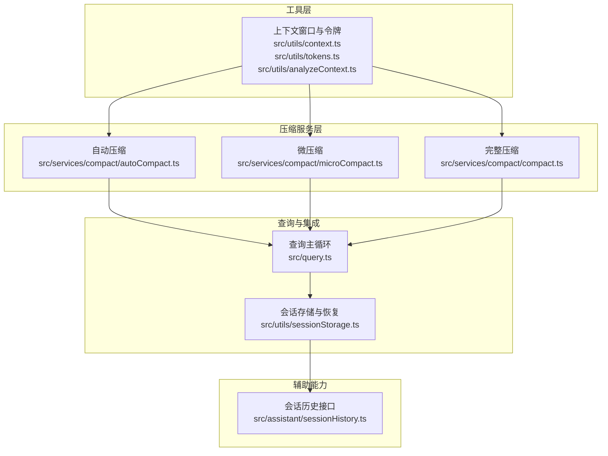
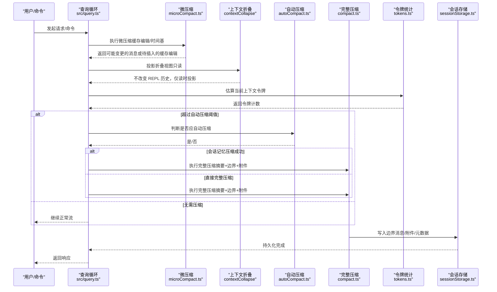
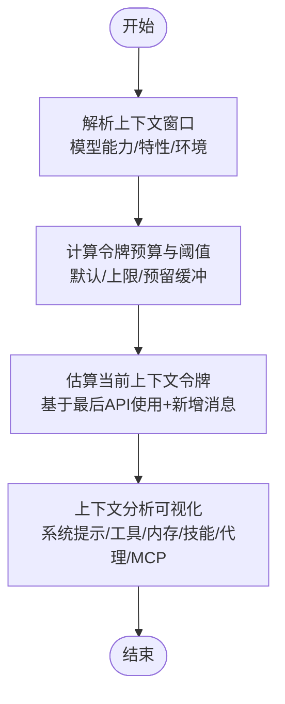
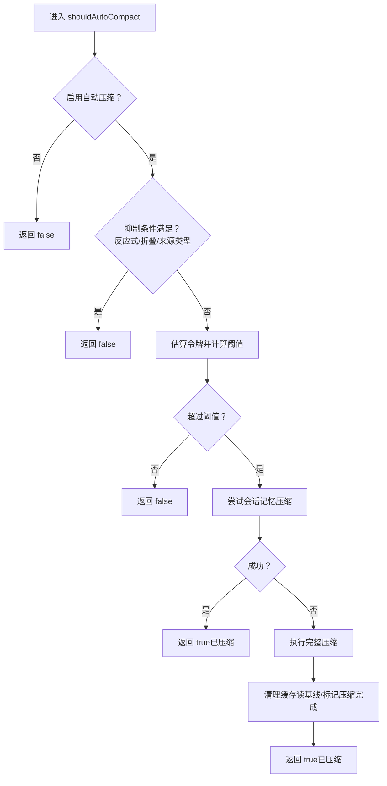
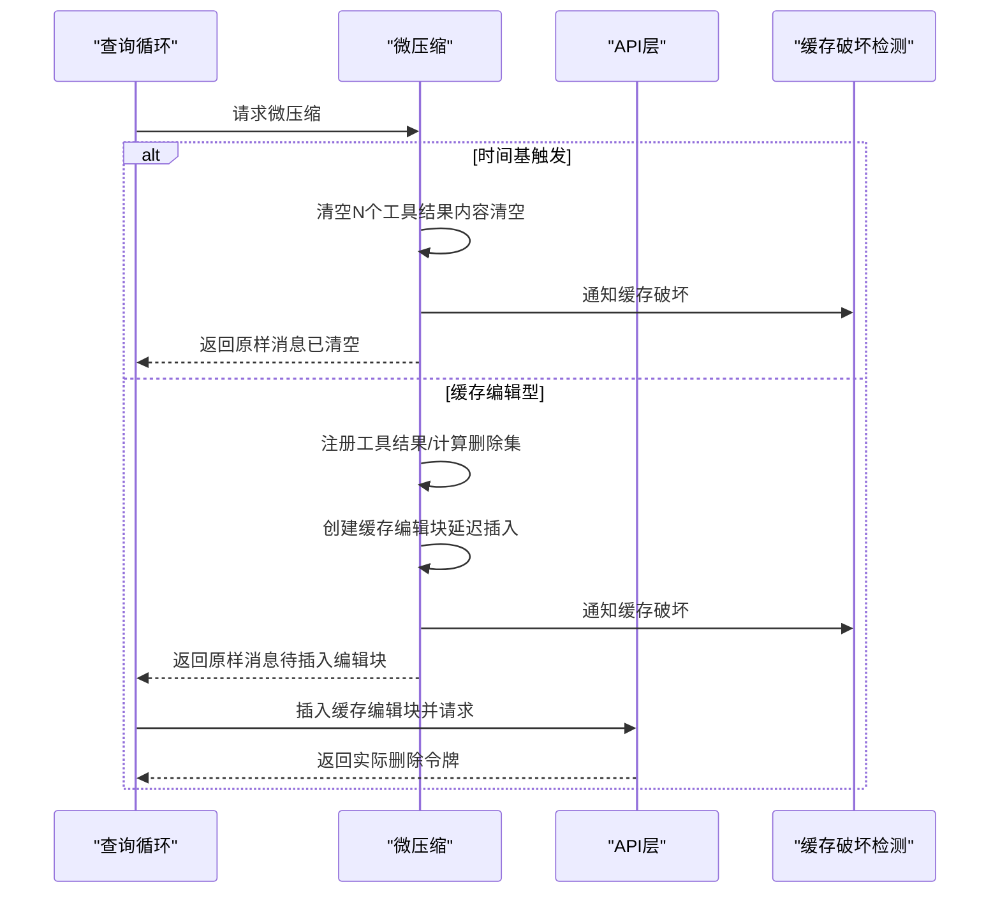
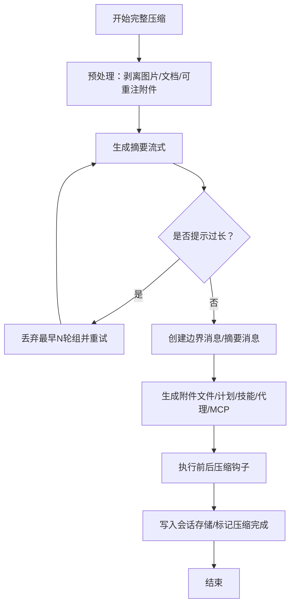
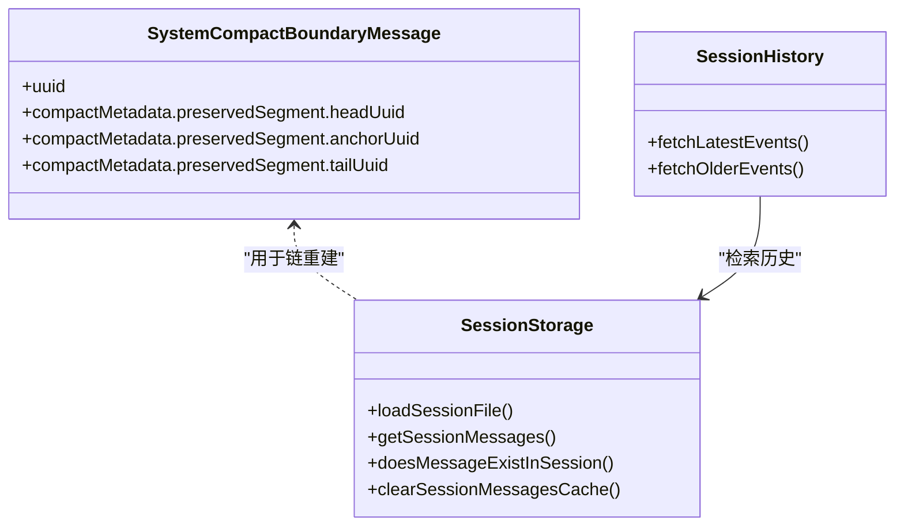
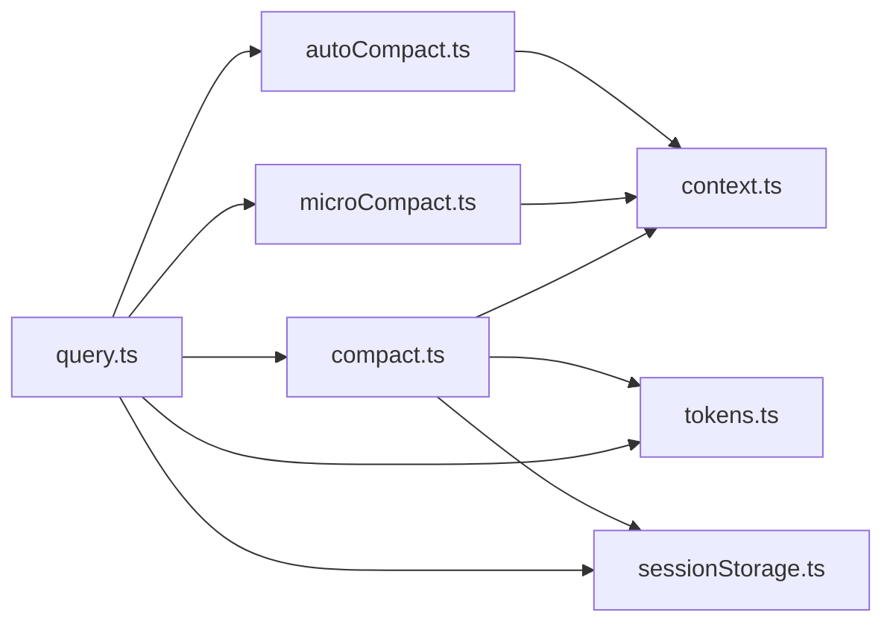

# 上下文管理机制

<cite>
**本文引用的文件**
- [src/utils/context.ts](file://src/utils/context.ts)
- [src/utils/tokens.ts](file://src/utils/tokens.ts)
- [src/utils/analyzeContext.ts](file://src/utils/analyzeContext.ts)
- [src/services/compact/autoCompact.ts](file://src/services/compact/autoCompact.ts)
- [src/services/compact/compact.ts](file://src/services/compact/compact.ts)
- [src/services/compact/microCompact.ts](file://src/services/compact/microCompact.ts)
- [src/query.ts](file://src/query.ts)
- [src/utils/sessionStorage.ts](file://src/utils/sessionStorage.ts)
- [src/assistant/sessionHistory.ts](file://src/assistant/sessionHistory.ts)
</cite>

## 目录
1. [引言](#引言)
2. [项目结构](#项目结构)
3. [核心组件](#核心组件)
4. [架构总览](#架构总览)
5. [详细组件分析](#详细组件分析)
6. [依赖关系分析](#依赖关系分析)
7. [性能考量](#性能考量)
8. [故障排查指南](#故障排查指南)
9. [结论](#结论)
10. [附录](#附录)

## 引言
本文件系统性阐述 Claude Code 的上下文管理机制，重点覆盖自动压缩系统（含智能压缩算法、令牌预算控制与上下文窗口优化）、微压缩与历史压缩的区别与适用场景、上下文恢复与状态保存、性能监控与质量保障，并提供可操作的压缩效果评估、用户反馈与配置调优方法。文档面向不同技术背景读者，既提供高层概览也给出代码级映射与可视化。

## 项目结构
围绕上下文管理的关键模块分布如下：
- 工具层：上下文窗口与令牌估算、上下文分析与可视化
- 压缩服务层：自动压缩、微压缩、完整压缩、会话记忆压缩
- 查询与集成层：查询循环中的压缩触发点、边界消息与恢复
- 存储与恢复层：会话存储、快照、边界标记与消息链重建

图表来源
- [src/utils/context.ts:1-222](file://src/utils/context.ts#L1-L222)
- [src/utils/tokens.ts:1-262](file://src/utils/tokens.ts#L1-L262)
- [src/utils/analyzeContext.ts:1-800](file://src/utils/analyzeContext.ts#L1-L800)
- [src/services/compact/autoCompact.ts:1-352](file://src/services/compact/autoCompact.ts#L1-L352)
- [src/services/compact/microCompact.ts:1-531](file://src/services/compact/microCompact.ts#L1-L531)
- [src/services/compact/compact.ts:1-800](file://src/services/compact/compact.ts#L1-L800)
- [src/query.ts:1-200](file://src/query.ts#L1-L200)
- [src/utils/sessionStorage.ts:1-200](file://src/utils/sessionStorage.ts#L1-L200)
- [src/assistant/sessionHistory.ts:1-88](file://src/assistant/sessionHistory.ts#L1-L88)

章节来源
- [src/utils/context.ts:1-222](file://src/utils/context.ts#L1-L222)
- [src/utils/tokens.ts:1-262](file://src/utils/tokens.ts#L1-L262)
- [src/utils/analyzeContext.ts:1-800](file://src/utils/analyzeContext.ts#L1-L800)
- [src/services/compact/autoCompact.ts:1-352](file://src/services/compact/autoCompact.ts#L1-L352)
- [src/services/compact/microCompact.ts:1-531](file://src/services/compact/microCompact.ts#L1-L531)
- [src/services/compact/compact.ts:1-800](file://src/services/compact/compact.ts#L1-L800)
- [src/query.ts:1-200](file://src/query.ts#L1-L200)
- [src/utils/sessionStorage.ts:1-200](file://src/utils/sessionStorage.ts#L1-L200)
- [src/assistant/sessionHistory.ts:1-88](file://src/assistant/sessionHistory.ts#L1-L88)

## 核心组件
- 上下文窗口与令牌预算
  - 上下文窗口解析：根据模型能力、特性开关与环境变量确定有效上下文窗口大小；支持 1M 上下文检测与实验性开启路径。
  - 令牌估算与使用统计：提供基于 API 使用数据的上下文窗口计数、最终上下文窗口大小计算、输出令牌统计等。
  - 上下文分析：对系统提示、工具定义、内存文件、技能、代理等进行细粒度令牌拆解与可视化。
- 自动压缩（Autocompact）
  - 阈值计算：基于有效上下文窗口与缓冲区计算触发阈值；支持环境变量覆盖与阻断限制。
  - 触发策略：在查询循环中按令牌估算判断是否需要自动压缩；抑制条件覆盖反应式压缩与上下文折叠模式。
  - 执行路径：优先尝试会话记忆压缩，失败则执行完整压缩；带电路保护避免无意义重试。
- 微压缩（Microcompact）
  - 缓存编辑型微压缩：通过缓存编辑 API 在不破坏前缀缓存的前提下删除旧工具结果，减少写入成本。
  - 时间基微压缩：当主线程助手消息距今超过阈值时，内容清空最近 N 个可清理工具结果，以重写前缀并缓解冷缓存。
  - 状态与边界：记录待插入的缓存编辑块、延迟插入边界消息、通知缓存破坏检测。
- 完整压缩（Full Compact）
  - 摘要生成：对早期对话进行摘要，保留近期上下文；支持针对部分范围的局部压缩。
  - 边界标记与恢复：插入系统边界消息，携带预压缩令牌计数、发现工具集合等元数据，用于后续恢复与链重建。
  - 后处理附件：文件增量、计划模式、技能、代理与 MCP 指令等附件在压缩后重新注入，确保上下文连续性。
- 上下文恢复与状态保存
  - 边界消息：系统边界消息承载“保留段”锚点与头尾 UUID，用于链式重建。
  - 会话存储：JSONL 记录、快照、内容替换、上下文折叠提交与快照等持久化结构，支持消息存在性检查与缓存清理。
  - 会话历史接口：提供分页获取事件的能力，便于外部系统检索历史。

章节来源
- [src/utils/context.ts:1-222](file://src/utils/context.ts#L1-L222)
- [src/utils/tokens.ts:1-262](file://src/utils/tokens.ts#L1-L262)
- [src/utils/analyzeContext.ts:1-800](file://src/utils/analyzeContext.ts#L1-L800)
- [src/services/compact/autoCompact.ts:1-352](file://src/services/compact/autoCompact.ts#L1-L352)
- [src/services/compact/microCompact.ts:1-531](file://src/services/compact/microCompact.ts#L1-L531)
- [src/services/compact/compact.ts:1-800](file://src/services/compact/compact.ts#L1-L800)
- [src/utils/sessionStorage.ts:1-200](file://src/utils/sessionStorage.ts#L1-L200)
- [src/assistant/sessionHistory.ts:1-88](file://src/assistant/sessionHistory.ts#L1-L88)

## 架构总览
整体流程从查询循环开始，先进行微压缩与上下文折叠投影，再根据令牌估算决定是否触发自动压缩；压缩完成后通过边界消息与附件重建上下文，并在会话存储中持久化关键元数据。

图表来源
- [src/query.ts:262-290](file://src/query.ts#L262-L290)
- [src/query.ts:415-440](file://src/query.ts#L415-L440)
- [src/services/compact/microCompact.ts:253-293](file://src/services/compact/microCompact.ts#L253-L293)
- [src/services/compact/autoCompact.ts:160-239](file://src/services/compact/autoCompact.ts#L160-L239)
- [src/services/compact/compact.ts:387-763](file://src/services/compact/compact.ts#L387-L763)
- [src/utils/tokens.ts:226-262](file://src/utils/tokens.ts#L226-L262)
- [src/utils/sessionStorage.ts:3818-3889](file://src/utils/sessionStorage.ts#L3818-L3889)

## 详细组件分析

### 上下文窗口与令牌预算
- 上下文窗口解析
  - 支持环境变量覆盖、模型能力探测、特性开关与实验性开启路径（如 [1m] 后缀、特定模型与用户类型）。
  - 默认窗口与上限、最大输出令牌默认值与上限、槽位预留优化与扩容策略。
- 令牌预算与使用统计
  - 从 API 使用数据计算输入/缓存/输出总令牌，支持最终上下文窗口大小与输出令牌统计。
  - 提供基于最后 API 响应的上下文窗口估算，考虑并行工具调用的兄弟记录锚定。
- 上下文分析
  - 对系统提示、工具定义、内存文件、技能、代理、MCP 工具等进行细粒度令牌拆解与可视化网格。
  - 支持延迟加载工具与系统提示段落的分解，便于用户理解占用来源。

图表来源
- [src/utils/context.ts:51-98](file://src/utils/context.ts#L51-L98)
- [src/utils/context.ts:149-221](file://src/utils/context.ts#L149-L221)
- [src/utils/tokens.ts:46-112](file://src/utils/tokens.ts#L46-L112)
- [src/utils/tokens.ts:226-262](file://src/utils/tokens.ts#L226-L262)
- [src/utils/analyzeContext.ts:190-232](file://src/utils/analyzeContext.ts#L190-L232)

章节来源
- [src/utils/context.ts:1-222](file://src/utils/context.ts#L1-L222)
- [src/utils/tokens.ts:1-262](file://src/utils/tokens.ts#L1-L262)
- [src/utils/analyzeContext.ts:1-800](file://src/utils/analyzeContext.ts#L1-L800)

### 自动压缩（Autocompact）
- 阈值与缓冲
  - 有效上下文窗口 = 模型上下文窗口 - 最大摘要输出令牌上限；缓冲区用于安全余量。
  - 支持环境变量覆盖阈值百分比与阻断限制，便于测试与应急。
- 触发与抑制
  - 在查询循环中基于令牌估算判断是否超过阈值；抑制条件包括：禁用自动压缩、反应式压缩模式、上下文折叠模式。
  - 电路保护：连续失败次数达到阈值后停止尝试，避免无效 API 调用。
- 执行路径
  - 优先尝试会话记忆压缩（若成功则直接返回），否则执行完整压缩；压缩后清理缓存读基线并标记压缩完成。

图表来源
- [src/services/compact/autoCompact.ts:160-239](file://src/services/compact/autoCompact.ts#L160-L239)
- [src/services/compact/autoCompact.ts:241-351](file://src/services/compact/autoCompact.ts#L241-L351)

章节来源
- [src/services/compact/autoCompact.ts:1-352](file://src/services/compact/autoCompact.ts#L1-L352)

### 微压缩（Microcompact）
- 缓存编辑型微压缩
  - 仅在主线程、受支持模型且特性开启时生效；通过缓存编辑 API 删除旧工具结果，不修改本地消息内容。
  - 记录待插入的缓存编辑块与基线累计删除令牌，延迟到 API 层插入并在响应后使用实际删除令牌。
  - 通知缓存破坏检测，抑制误报。
- 时间基微压缩
  - 当主线程助手消息距今超过阈值时，内容清空最近 N 个可清理工具结果，直接修改消息内容。
  - 清理后重置微压缩状态，避免与后续缓存编辑冲突；通知缓存破坏检测。
- 状态与边界
  - 提供消费/固定/重置缓存编辑状态的接口；延迟插入边界消息以利用实际缓存删除令牌。

图表来源
- [src/services/compact/microCompact.ts:253-293](file://src/services/compact/microCompact.ts#L253-L293)
- [src/services/compact/microCompact.ts:305-399](file://src/services/compact/microCompact.ts#L305-L399)
- [src/services/compact/microCompact.ts:446-530](file://src/services/compact/microCompact.ts#L446-L530)

章节来源
- [src/services/compact/microCompact.ts:1-531](file://src/services/compact/microCompact.ts#L1-L531)

### 完整压缩（Full Compact）
- 摘要生成与边界
  - 对早期对话进行摘要，保留近期上下文；插入系统边界消息，携带预压缩令牌计数、保留段锚点与发现工具集合。
  - 支持“从某处”和“向上至某处”的局部压缩，分别保留前缀或后缀缓存。
- 附件与后处理
  - 文件增量、计划模式、技能、代理与 MCP 指令等附件在压缩后重新注入，确保上下文连续性。
  - 执行前后压缩钩子，记录事件指标并更新会话元数据。
- 错误处理与回退
  - 当压缩请求本身触发“提示过长”时，通过丢弃最早 API 轮次组进行回退重试，确保不卡死。

图表来源
- [src/services/compact/compact.ts:145-200](file://src/services/compact/compact.ts#L145-L200)
- [src/services/compact/compact.ts:243-291](file://src/services/compact/compact.ts#L243-L291)
- [src/services/compact/compact.ts:387-763](file://src/services/compact/compact.ts#L387-L763)

章节来源
- [src/services/compact/compact.ts:1-800](file://src/services/compact/compact.ts#L1-L800)

### 上下文恢复与状态保存
- 边界消息与保留段
  - 系统边界消息携带“保留段”锚点（head/tail/anchor），用于链式重建；支持后缀保留（反应式/会话记忆）与前缀保留（局部压缩）两种模式。
- 会话存储与快照
  - JSONL 记录、消息集合缓存、内容替换、上下文折叠提交与快照等结构；提供消息存在性检查与缓存清理。
  - 加载会话时一次性读取并构建消息集合缓存，提升后续查询效率。
- 会话历史接口
  - 分页获取事件，支持最新与更早事件拉取，便于外部系统检索历史。

图表来源
- [src/services/compact/compact.ts:349-367](file://src/services/compact/compact.ts#L349-L367)
- [src/utils/sessionStorage.ts:3818-3889](file://src/utils/sessionStorage.ts#L3818-L3889)
- [src/assistant/sessionHistory.ts:73-87](file://src/assistant/sessionHistory.ts#L73-L87)

章节来源
- [src/services/compact/compact.ts:325-367](file://src/services/compact/compact.ts#L325-L367)
- [src/utils/sessionStorage.ts:3818-3889](file://src/utils/sessionStorage.ts#L3818-L3889)
- [src/assistant/sessionHistory.ts:1-88](file://src/assistant/sessionHistory.ts#L1-L88)

## 依赖关系分析
- 模块耦合
  - 查询循环依赖自动压缩与微压缩模块，通过令牌估算与阈值判断决定压缩时机。
  - 完整压缩依赖附件生成、钩子执行与会话存储，形成闭环。
  - 工具层提供上下文窗口解析与令牌统计，贯穿所有压缩路径。
- 外部依赖与集成点
  - API 使用数据用于最终上下文窗口计算与任务预算 remaining 统计。
  - 缓存破坏检测与提示过长错误处理贯穿微压缩与完整压缩。
- 潜在环路与规避
  - 通过延迟导入与功能门控避免循环依赖（如自动压缩对上下文折叠的抑制）。

图表来源
- [src/query.ts:1-200](file://src/query.ts#L1-L200)
- [src/services/compact/autoCompact.ts:1-352](file://src/services/compact/autoCompact.ts#L1-L352)
- [src/services/compact/microCompact.ts:1-531](file://src/services/compact/microCompact.ts#L1-L531)
- [src/services/compact/compact.ts:1-800](file://src/services/compact/compact.ts#L1-L800)
- [src/utils/context.ts:1-222](file://src/utils/context.ts#L1-L222)
- [src/utils/tokens.ts:1-262](file://src/utils/tokens.ts#L1-L262)
- [src/utils/sessionStorage.ts:1-200](file://src/utils/sessionStorage.ts#L1-L200)

章节来源
- [src/query.ts:1-200](file://src/query.ts#L1-L200)
- [src/services/compact/autoCompact.ts:1-352](file://src/services/compact/autoCompact.ts#L1-L352)
- [src/services/compact/microCompact.ts:1-531](file://src/services/compact/microCompact.ts#L1-L531)
- [src/services/compact/compact.ts:1-800](file://src/services/compact/compact.ts#L1-L800)
- [src/utils/context.ts:1-222](file://src/utils/context.ts#L1-L222)
- [src/utils/tokens.ts:1-262](file://src/utils/tokens.ts#L1-L262)
- [src/utils/sessionStorage.ts:1-200](file://src/utils/sessionStorage.ts#L1-L200)

## 性能考量
- 令牌估算与估算开销
  - 采用“最后 API 使用 + 新增消息估算”的组合策略，避免重复计数与低估；并行工具调用场景通过锚定兄弟记录确保不漏估。
- 缓冲区与阈值设计
  - 自动压缩缓冲区与警告/错误阈值缓冲区协同工作，降低频繁触发概率；阻断限制避免在不可恢复情况下继续尝试。
- 缓存编辑微压缩
  - 通过缓存编辑避免前缀失效与重写，显著降低写入成本与服务器端负担。
- 附件与钩子
  - 附件生成与钩子执行异步并行，缩短压缩总耗时；仅在必要时重注技能列表，避免纯缓存创建的收益稀释。

## 故障排查指南
- 提示过长（Prompt Too Long）
  - 自动压缩路径：当压缩请求本身触发提示过长时，通过丢弃最早 API 轮次组回退重试，最多尝试若干次。
  - 微压缩路径：时间基触发时直接修改消息内容，注意后续缓存破坏检测的预期下降。
- 缓存破坏检测误报
  - 微压缩（缓存编辑）与完整压缩后均需通知缓存破坏检测，抑制因压缩导致的误报。
- 会话恢复异常
  - 检查边界消息的保留段锚点是否正确；确认会话存储中消息集合缓存未陈旧；必要时清理缓存后重新加载。

章节来源
- [src/services/compact/compact.ts:243-291](file://src/services/compact/compact.ts#L243-L291)
- [src/services/compact/microCompact.ts:362-367](file://src/services/compact/microCompact.ts#L362-L367)
- [src/utils/sessionStorage.ts:3854-3856](file://src/utils/sessionStorage.ts#L3854-L3856)

## 结论
Claude Code 的上下文管理机制通过“微压缩（缓存编辑/时间基）+ 自动压缩（会话记忆优先）+ 完整压缩（摘要+边界+附件）”的多层策略，在保证上下文连续性的同时显著降低令牌占用。配合严格的阈值与缓冲设计、缓存破坏检测与会话存储持久化，系统在复杂对话与长历史场景下仍能保持稳定与高效。

## 附录
- 压缩效果评估与用户反馈
  - 通过事件日志与指标（预压缩/后压缩令牌计数、是否重触发、查询来源/链 ID、缓存共享开关等）评估压缩效果。
  - 用户可通过“/compact”手动触发压缩，并结合上下文可视化与建议进行反馈。
- 配置调优
  - 自动压缩阈值百分比覆盖、阻断限制覆盖、自动压缩窗口覆盖、最大输出令牌上限与扩容策略等均可通过环境变量与设置进行调整。
  - 1M 上下文检测与实验性开启路径可根据模型与用户类型灵活启用。

章节来源
- [src/services/compact/compact.ts:650-695](file://src/services/compact/compact.ts#L650-L695)
- [src/utils/context.ts:28-98](file://src/utils/context.ts#L28-L98)
- [src/utils/context.ts:149-221](file://src/utils/context.ts#L149-L221)
- [src/utils/analyzeContext.ts:190-232](file://src/utils/analyzeContext.ts#L190-L232)