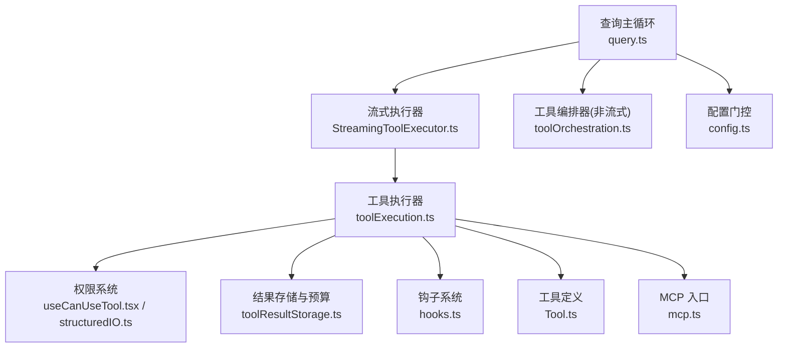
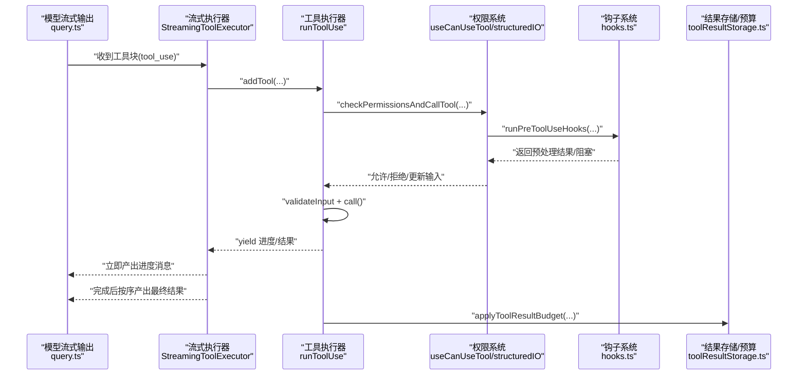
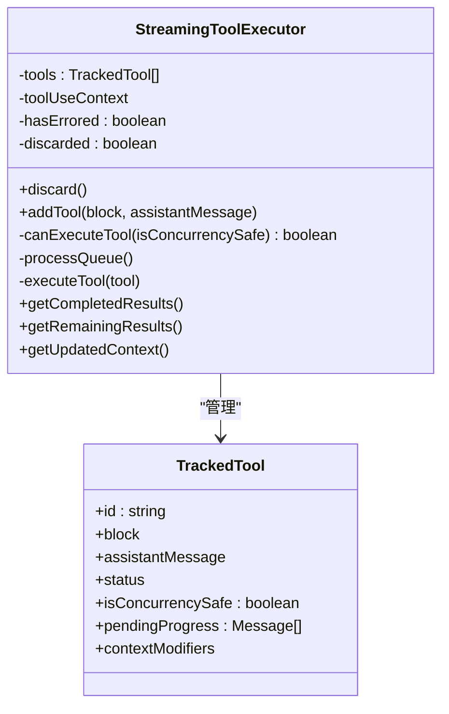
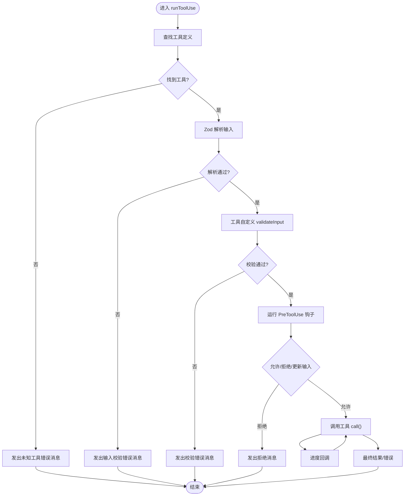
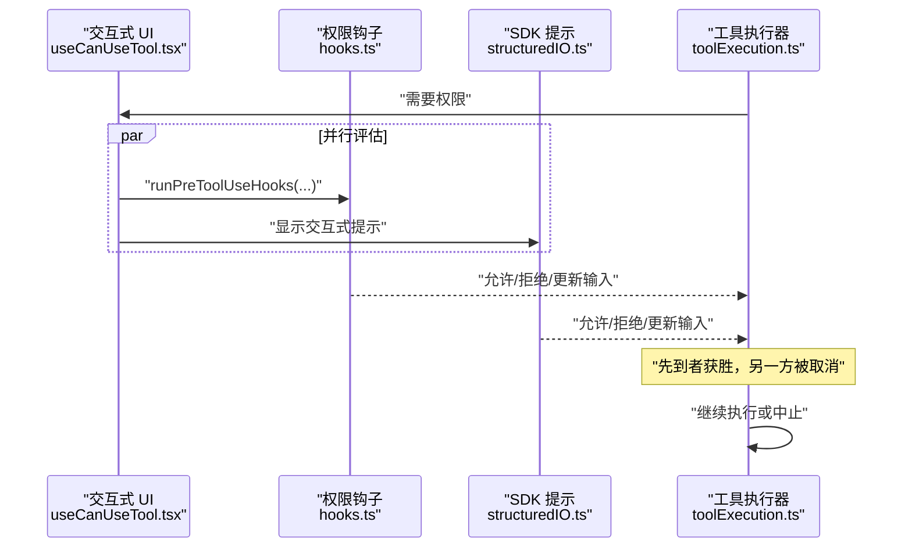
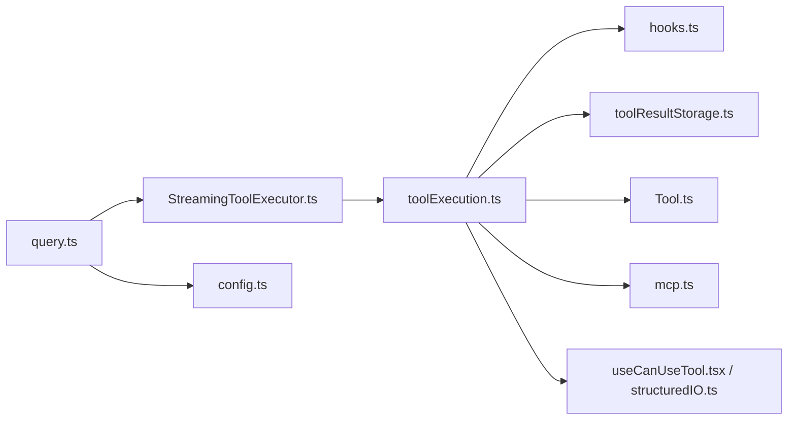

# 工具执行系统

<cite>
**本文引用的文件**
- [StreamingToolExecutor.ts](file://src/services/tools/StreamingToolExecutor.ts)
- [toolExecution.ts](file://src/services/tools/toolExecution.ts)
- [query.ts](file://src/query.ts)
- [toolOrchestration.ts](file://src/services/tools/toolOrchestration.ts)
- [Tool.ts](file://src/Tool.ts)
- [useCanUseTool.tsx](file://src/hooks/useCanUseTool.tsx)
- [structuredIO.ts](file://src/cli/structuredIO.ts)
- [toolLimits.ts](file://src/constants/toolLimits.ts)
- [toolResultStorage.ts](file://src/utils/toolResultStorage.ts)
- [hooks.ts](file://src/utils/hooks.ts)
- [config.ts](file://src/query/config.ts)
- [mcp.ts](file://src/entrypoints/mcp.ts)
</cite>

## 目录
1. [简介](#简介)
2. [项目结构](#项目结构)
3. [核心组件](#核心组件)
4. [架构总览](#架构总览)
5. [详细组件分析](#详细组件分析)
6. [依赖关系分析](#依赖关系分析)
7. [性能考量](#性能考量)
8. [故障排查指南](#故障排查指南)
9. [结论](#结论)
10. [附录](#附录)

## 简介
本文件面向 Claude Code 工具执行系统，聚焦 StreamingToolExecutor 的流式执行模型，系统性阐述以下主题：
- 流式执行模型：工具调用的异步处理、并发控制与结果聚合策略
- 权限检查机制：交互式与非交互式路径、钩子与规则的协同
- 工具编排：工具选择算法、参数验证、执行顺序管理
- 生命周期与错误处理：从接收工具块到结果产出的全链路
- 并发控制、资源管理与性能优化
- 完整流程示例：工具注册、调用与结果处理

## 项目结构
围绕工具执行的关键模块与职责如下：
- 查询主循环：负责模型流式输出解析、工具块提取与执行调度
- 流式执行器：按并发安全策略异步执行工具，维护进度与上下文变更
- 工具执行器：统一的工具调用入口，封装权限检查、输入校验、进度上报与结果生成
- 编排器：在非流式模式下对工具调用进行分组与串并行调度
- 权限系统：交互式弹窗、钩子、规则与 MCP 提示工具的综合决策
- 结果存储与预算：工具结果的内存/磁盘预算与持久化替换

**图表来源**
- [query.ts:560-759](file://src/query.ts#L560-L759)
- [StreamingToolExecutor.ts:40-124](file://src/services/tools/StreamingToolExecutor.ts#L40-L124)
- [toolExecution.ts:337-490](file://src/services/tools/toolExecution.ts#L337-L490)
- [toolOrchestration.ts:19-82](file://src/services/tools/toolOrchestration.ts#L19-L82)
- [useCanUseTool.tsx:20-203](file://src/hooks/useCanUseTool.tsx#L20-L203)
- [structuredIO.ts:550-859](file://src/cli/structuredIO.ts#L550-L859)
- [toolResultStorage.ts:924-925](file://src/utils/toolResultStorage.ts#L924-L925)
- [hooks.ts:3394-3443](file://src/utils/hooks.ts#L3394-L3443)
- [Tool.ts:362-388](file://src/Tool.ts#L362-L388)
- [config.ts:15-36](file://src/query/config.ts#L15-L36)
- [mcp.ts:105-196](file://src/entrypoints/mcp.ts#L105-L196)

**章节来源**
- [query.ts:560-759](file://src/query.ts#L560-L759)
- [config.ts:15-36](file://src/query/config.ts#L15-L36)

## 核心组件
- 流式执行器（StreamingToolExecutor）
  - 负责工具块的入队、并发安全判断、异步执行、进度消息即时产出与结果聚合
  - 维护工具状态（排队/执行/完成/已产出），支持丢弃与中断行为
- 工具执行器（runToolUse）
  - 统一入口：查找工具、输入校验、权限检查、进度上报、结果生成与错误分类
  - 支持 MCP 工具识别与服务器类型推断
- 工具编排器（runTools）
  - 非流式模式下的工具分组与串并行执行，支持上下文修改器的累积与应用
- 权限系统
  - 交互式弹窗、钩子、规则与 MCP 提示工具的综合决策，支持并行评估与优先级
- 结果存储与预算
  - 消息级工具结果预算强制，按需持久化与替换，保障会话稳定性

**章节来源**
- [StreamingToolExecutor.ts:40-124](file://src/services/tools/StreamingToolExecutor.ts#L40-L124)
- [toolExecution.ts:337-490](file://src/services/tools/toolExecution.ts#L337-L490)
- [toolOrchestration.ts:19-82](file://src/services/tools/toolOrchestration.ts#L19-L82)
- [useCanUseTool.tsx:20-203](file://src/hooks/useCanUseTool.tsx#L20-L203)
- [structuredIO.ts:550-859](file://src/cli/structuredIO.ts#L550-L859)
- [toolResultStorage.ts:924-925](file://src/utils/toolResultStorage.ts#L924-L925)

## 架构总览
下图展示了从模型流式输出到工具执行与结果产出的端到端流程。

**图表来源**
- [query.ts:708-759](file://src/query.ts#L708-L759)
- [StreamingToolExecutor.ts:76-124](file://src/services/tools/StreamingToolExecutor.ts#L76-L124)
- [toolExecution.ts:492-570](file://src/services/tools/toolExecution.ts#L492-L570)
- [hooks.ts:3394-3443](file://src/utils/hooks.ts#L3394-L3443)
- [toolResultStorage.ts:924-925](file://src/utils/toolResultStorage.ts#L924-L925)

## 详细组件分析

### 流式执行器（StreamingToolExecutor）分析
- 设计要点
  - 工具状态机：排队、执行、完成、已产出；保证非并发工具的顺序性
  - 并发策略：仅当全部为并发安全工具或无任何工具执行时才并行
  - 中断与取消：支持用户中断、兄弟工具失败（如 Bash）级联取消、流式回退丢弃
  - 进度与结果：进度消息即时产出，最终结果按接收顺序聚合
- 关键数据结构
  - TrackedTool：记录工具块、助手消息、状态、并发属性、待处理进度与上下文修改器
- 错误与取消
  - 同步合成错误消息，避免重复提示
  - Bash 工具失败触发兄弟工具级联中止，确保依赖链正确终止
- 上下文管理
  - 非并发工具的上下文修改器在完成后一次性应用，保持顺序一致性

**图表来源**
- [StreamingToolExecutor.ts:40-124](file://src/services/tools/StreamingToolExecutor.ts#L40-L124)
- [StreamingToolExecutor.ts:412-490](file://src/services/tools/StreamingToolExecutor.ts#L412-L490)

**章节来源**
- [StreamingToolExecutor.ts:40-124](file://src/services/tools/StreamingToolExecutor.ts#L40-L124)
- [StreamingToolExecutor.ts:126-205](file://src/services/tools/StreamingToolExecutor.ts#L126-L205)
- [StreamingToolExecutor.ts:265-405](file://src/services/tools/StreamingToolExecutor.ts#L265-L405)
- [StreamingToolExecutor.ts:412-490](file://src/services/tools/StreamingToolExecutor.ts#L412-L490)

### 工具执行器（runToolUse）分析
- 输入校验与发现
  - 使用 Zod schema 校验输入；对延迟工具补充“未发送模式”提示，引导重新加载工具
- 权限检查与调用
  - 统一封装权限检查与工具调用，支持进度回调与最终结果
  - 对 Bash 工具提前启动“允许性分类器”的推测性检查，提升交互体验
- 错误分类与日志
  - 将错误分类为可遥测字符串，区分 Node 错误码、已知错误类型与未知错误
- MCP 工具识别
  - 基于工具名解析 MCP 服务器连接与传输类型，用于遥测与日志

**图表来源**
- [toolExecution.ts:337-490](file://src/services/tools/toolExecution.ts#L337-L490)
- [toolExecution.ts:492-570](file://src/services/tools/toolExecution.ts#L492-L570)
- [toolExecution.ts:599-752](file://src/services/tools/toolExecution.ts#L599-L752)

**章节来源**
- [toolExecution.ts:337-490](file://src/services/tools/toolExecution.ts#L337-L490)
- [toolExecution.ts:492-570](file://src/services/tools/toolExecution.ts#L492-L570)
- [toolExecution.ts:599-752](file://src/services/tools/toolExecution.ts#L599-L752)

### 权限检查机制
- 交互式路径
  - useCanUseTool：构建权限上下文，按自动化检查与弹窗顺序处理，支持分类器推测与桥接回调
- 非交互式路径
  - structuredIO：并行执行权限请求钩子与 SDK 提示，先到者获胜；支持权限更新持久化与上下文刷新
- 钩子系统
  - PreToolUse/PostToolUse/失败钩子：统一执行、超时控制与聚合结果，支持提示型钩子与命令型钩子

**图表来源**
- [useCanUseTool.tsx:20-203](file://src/hooks/useCanUseTool.tsx#L20-L203)
- [hooks.ts:3394-3443](file://src/utils/hooks.ts#L3394-L3443)
- [structuredIO.ts:550-859](file://src/cli/structuredIO.ts#L550-L859)

**章节来源**
- [useCanUseTool.tsx:20-203](file://src/hooks/useCanUseTool.tsx#L20-L203)
- [hooks.ts:3394-3443](file://src/utils/hooks.ts#L3394-L3443)
- [structuredIO.ts:550-859](file://src/cli/structuredIO.ts#L550-L859)

### 工具编排系统
- 分组策略
  - partitionToolCalls：根据 isConcurrencySafe 与只读特性将工具分组
- 并行与串行
  - 并发组：runToolsConcurrently 并行执行，收集上下文修改器
  - 串行组：runToolsSerially 顺序执行，逐个应用上下文修改器
- 上下文修改
  - 修改器按工具 useID 聚合，在组内完成后一次性应用，确保顺序一致性

**章节来源**
- [toolOrchestration.ts:19-82](file://src/services/tools/toolOrchestration.ts#L19-L82)

### 生命周期、错误处理与重试
- 生命周期
  - 接收工具块 → 入队 → 并发条件满足 → 执行 → 产出进度 → 产出最终结果 → 应用上下文修改器
- 错误处理
  - 同步合成错误消息，避免重复提示；Bash 失败级联取消兄弟工具
  - 输入校验失败、权限拒绝、工具调用异常均有明确错误消息与遥测
- 回退与丢弃
  - 流式回退时丢弃旧执行器与未完成结果，重建执行器以避免孤儿结果
- 重试机制
  - 代码中未见自动重试逻辑；通过钩子与权限系统提供人工干预与修正

**章节来源**
- [StreamingToolExecutor.ts:153-205](file://src/services/tools/StreamingToolExecutor.ts#L153-L205)
- [StreamingToolExecutor.ts:320-396](file://src/services/tools/StreamingToolExecutor.ts#L320-L396)
- [query.ts:712-740](file://src/query.ts#L712-L740)

### 并发控制、资源管理与性能优化
- 并发控制
  - 仅当全部工具并发安全或无工具执行时并行；非并发工具串行，保证资源独占
- 中断与取消
  - 用户中断区分“取消”与“阻塞”，非阻塞工具可在执行中被取消
  - Bash 失败触发兄弟工具级联中止，避免无效工作
- 资源管理
  - 子进程信号传播：兄弟中止控制器向子进程广播中止，避免僵尸进程
  - 进度等待：使用 Promise.race 等待执行完成或进度可用，减少空转
- 性能优化
  - 推测性分类器：Bash 工具提前启动允许性检查
  - 流式回退丢弃：失败后立即丢弃旧结果，避免 UI 卡顿与无效渲染
  - 预算与持久化：消息级工具结果预算，按需磁盘替换，降低内存峰值

**章节来源**
- [StreamingToolExecutor.ts:129-151](file://src/services/tools/StreamingToolExecutor.ts#L129-L151)
- [StreamingToolExecutor.ts:210-241](file://src/services/tools/StreamingToolExecutor.ts#L210-L241)
- [toolExecution.ts:734-752](file://src/services/tools/toolExecution.ts#L734-L752)
- [toolResultStorage.ts:924-925](file://src/utils/toolResultStorage.ts#L924-L925)

### 工具注册、调用与结果处理示例（路径指引）
- 工具注册与入口
  - 工具定义与默认行为：[Tool.ts:362-388](file://src/Tool.ts#L362-L388)，[Tool.ts:745-775](file://src/Tool.ts#L745-L775)
  - MCP 工具入口：[mcp.ts:105-196](file://src/entrypoints/mcp.ts#L105-L196)
- 工具调用与结果
  - 流式执行：[query.ts:708-759](file://src/query.ts#L708-L759) → [StreamingToolExecutor.ts:76-124](file://src/services/tools/StreamingToolExecutor.ts#L76-L124) → [toolExecution.ts:337-490](file://src/services/tools/toolExecution.ts#L337-L490)
  - 非流式编排：[toolOrchestration.ts:19-82](file://src/services/tools/toolOrchestration.ts#L19-L82)
- 权限与钩子
  - 交互式权限：[useCanUseTool.tsx:20-203](file://src/hooks/useCanUseTool.tsx#L20-L203)
  - 钩子执行：[hooks.ts:3394-3443](file://src/utils/hooks.ts#L3394-L3443)，[hooks.ts:3442-3481](file://src/utils/hooks.ts#L3442-L3481)
- 结果预算与持久化
  - 预算应用：[toolResultStorage.ts:924-925](file://src/utils/toolResultStorage.ts#L924-L925)

**章节来源**
- [Tool.ts:362-388](file://src/Tool.ts#L362-L388)
- [Tool.ts:745-775](file://src/Tool.ts#L745-L775)
- [mcp.ts:105-196](file://src/entrypoints/mcp.ts#L105-L196)
- [query.ts:708-759](file://src/query.ts#L708-L759)
- [StreamingToolExecutor.ts:76-124](file://src/services/tools/StreamingToolExecutor.ts#L76-L124)
- [toolExecution.ts:337-490](file://src/services/tools/toolExecution.ts#L337-L490)
- [toolOrchestration.ts:19-82](file://src/services/tools/toolOrchestration.ts#L19-L82)
- [useCanUseTool.tsx:20-203](file://src/hooks/useCanUseTool.tsx#L20-L203)
- [hooks.ts:3394-3443](file://src/utils/hooks.ts#L3394-L3443)
- [hooks.ts:3442-3481](file://src/utils/hooks.ts#L3442-L3481)
- [toolResultStorage.ts:924-925](file://src/utils/toolResultStorage.ts#L924-L925)

## 依赖关系分析
- 组件耦合
  - query.ts 与 StreamingToolExecutor 强耦合：流式回退与结果聚合由其协作完成
  - StreamingToolExecutor 依赖 Tool.ts、toolExecution.ts 与权限系统
  - toolExecution.ts 依赖 hooks.ts、toolResultStorage.ts、Tool.ts
- 外部集成
  - MCP 工具通过 mcp.ts 与工具名称解析集成
  - CLI 通过 structuredIO.ts 提供非交互式权限路径

**图表来源**
- [query.ts:560-759](file://src/query.ts#L560-L759)
- [StreamingToolExecutor.ts:40-124](file://src/services/tools/StreamingToolExecutor.ts#L40-L124)
- [toolExecution.ts:337-490](file://src/services/tools/toolExecution.ts#L337-L490)
- [hooks.ts:3394-3443](file://src/utils/hooks.ts#L3394-L3443)
- [toolResultStorage.ts:924-925](file://src/utils/toolResultStorage.ts#L924-L925)
- [Tool.ts:362-388](file://src/Tool.ts#L362-L388)
- [config.ts:15-36](file://src/query/config.ts#L15-L36)
- [mcp.ts:105-196](file://src/entrypoints/mcp.ts#L105-L196)
- [useCanUseTool.tsx:20-203](file://src/hooks/useCanUseTool.tsx#L20-L203)
- [structuredIO.ts:550-859](file://src/cli/structuredIO.ts#L550-L859)

**章节来源**
- [query.ts:560-759](file://src/query.ts#L560-L759)
- [StreamingToolExecutor.ts:40-124](file://src/services/tools/StreamingToolExecutor.ts#L40-L124)
- [toolExecution.ts:337-490](file://src/services/tools/toolExecution.ts#L337-L490)

## 性能考量
- 流式回退快速丢弃：避免孤儿结果与 UI 卡顿
- 并发安全优先：仅在安全前提下并行，降低资源竞争
- 进度即时产出：提升感知性能，减少等待时间
- 预算与持久化：限制单消息工具结果长度，必要时落盘，平衡内存占用
- 推测性检查：Bash 允许性检查提前执行，缩短整体等待

[本节为通用指导，无需具体文件分析]

## 故障排查指南
- 未知工具
  - 现象：出现“无此工具可用”错误消息
  - 排查：确认工具是否存在于可用工具集中，或是否为别名工具
  - 参考：[toolExecution.ts:368-411](file://src/services/tools/toolExecution.ts#L368-L411)
- 输入校验失败
  - 现象：出现“输入校验错误”消息，可能包含“未发送模式”提示
  - 排查：检查工具输入 schema，必要时先调用工具搜索工具后再执行
  - 参考：[toolExecution.ts:614-680](file://src/services/tools/toolExecution.ts#L614-L680)，[toolExecution.ts:578-597](file://src/services/tools/toolExecution.ts#L578-L597)
- 权限拒绝
  - 现象：工具被拒绝，可能来自规则、钩子或交互式弹窗
  - 排查：查看 PreToolUse 钩子结果与交互式决策来源
  - 参考：[hooks.ts:3394-3443](file://src/utils/hooks.ts#L3394-L3443)，[useCanUseTool.tsx:20-203](file://src/hooks/useCanUseTool.tsx#L20-L203)
- Bash 失败导致级联取消
  - 现象：后续工具被取消
  - 排查：检查 Bash 命令链依赖，确认前置命令是否成功
  - 参考：[StreamingToolExecutor.ts:354-364](file://src/services/tools/StreamingToolExecutor.ts#L354-L364)
- 流式回退
  - 现象：流式回退发生，旧结果被丢弃
  - 排查：关注回退事件日志，确认是否为网络或模型问题
  - 参考：[query.ts:712-740](file://src/query.ts#L712-L740)

**章节来源**
- [toolExecution.ts:368-411](file://src/services/tools/toolExecution.ts#L368-L411)
- [toolExecution.ts:614-680](file://src/services/tools/toolExecution.ts#L614-L680)
- [hooks.ts:3394-3443](file://src/utils/hooks.ts#L3394-L3443)
- [useCanUseTool.tsx:20-203](file://src/hooks/useCanUseTool.tsx#L20-L203)
- [StreamingToolExecutor.ts:354-364](file://src/services/tools/StreamingToolExecutor.ts#L354-L364)
- [query.ts:712-740](file://src/query.ts#L712-L740)

## 结论
StreamingToolExecutor 将工具执行从“一次性批量”转变为“流式异步”，在保证并发安全的前提下实现了进度即时产出与结果有序聚合。配合完善的权限系统、输入校验与错误处理，系统在复杂多工具场景下仍能保持稳定与高性能。通过预算与持久化策略，进一步提升了长会话的可靠性。建议在实际部署中结合门控配置与监控指标，持续优化并发策略与资源分配。

[本节为总结，无需具体文件分析]

## 附录
- 配置门控
  - 流式工具执行开关、摘要输出开关等：[config.ts:15-36](file://src/query/config.ts#L15-L36)
- 工具结果预算
  - 单消息最大字符数与摘要长度限制：[toolLimits.ts:38-56](file://src/constants/toolLimits.ts#L38-L56)

**章节来源**
- [config.ts:15-36](file://src/query/config.ts#L15-L36)
- [toolLimits.ts:38-56](file://src/constants/toolLimits.ts#L38-L56)