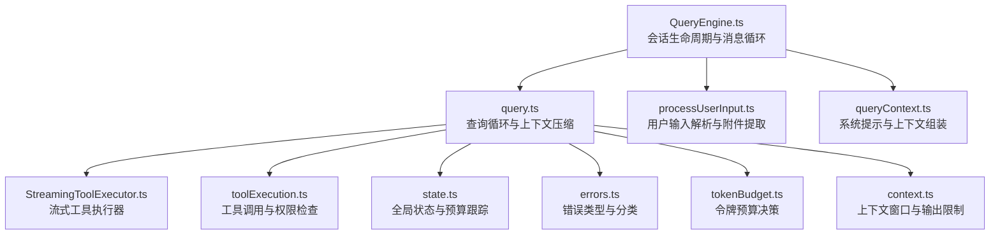
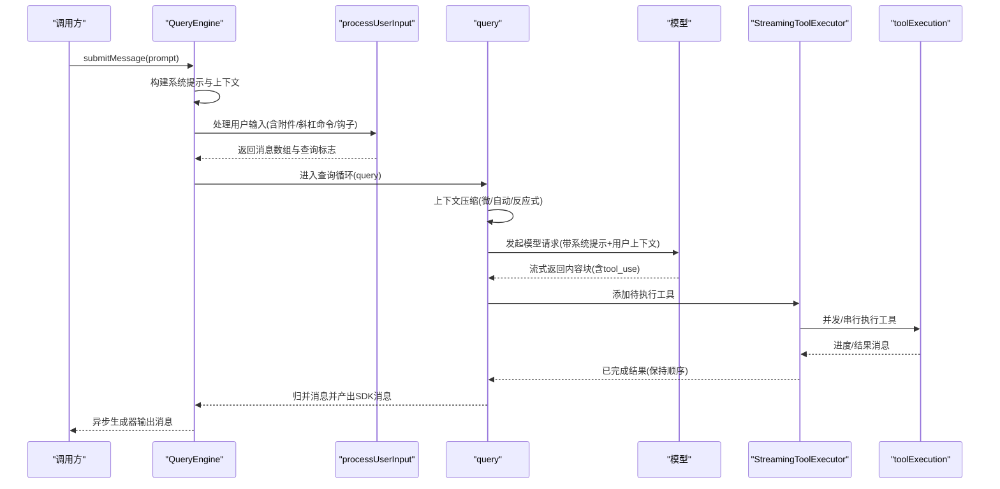
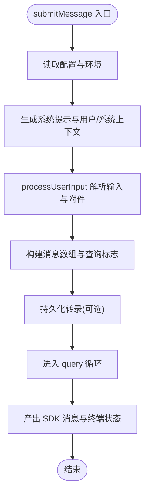
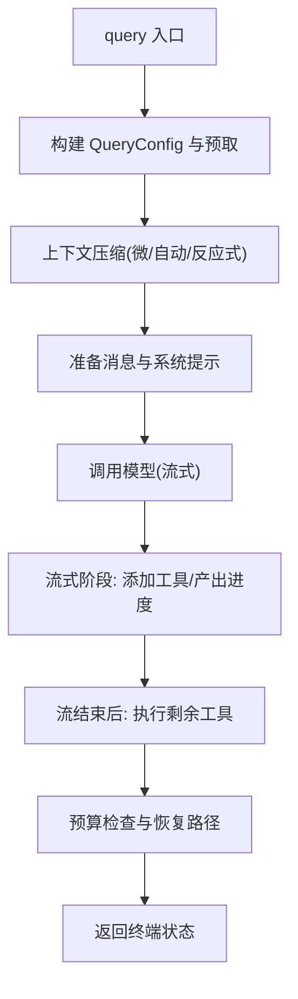
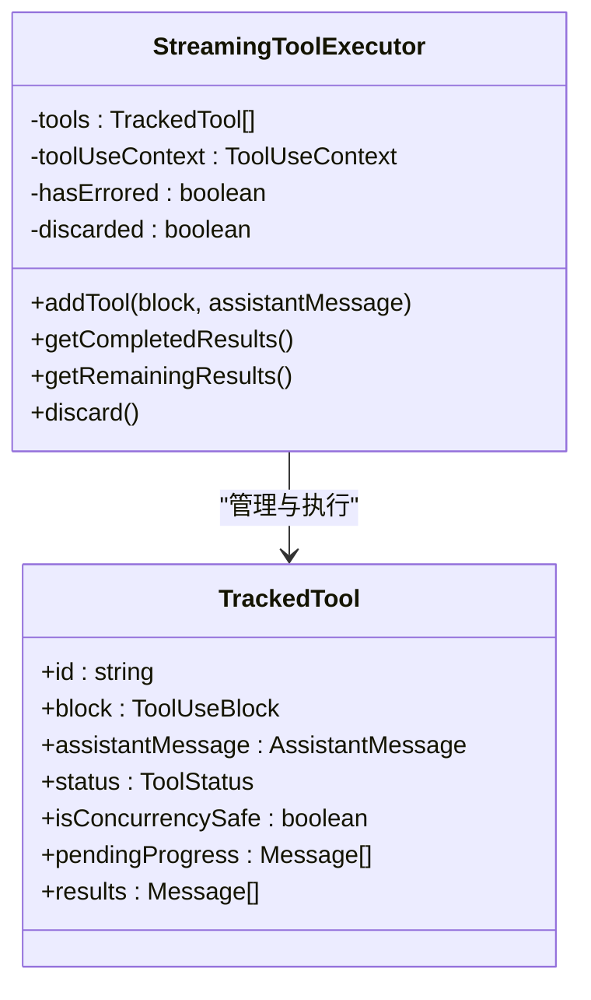
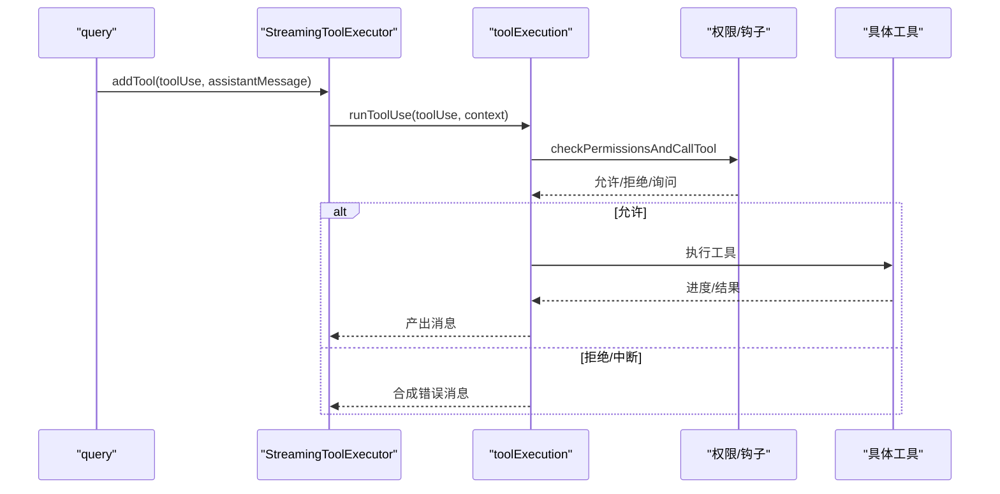
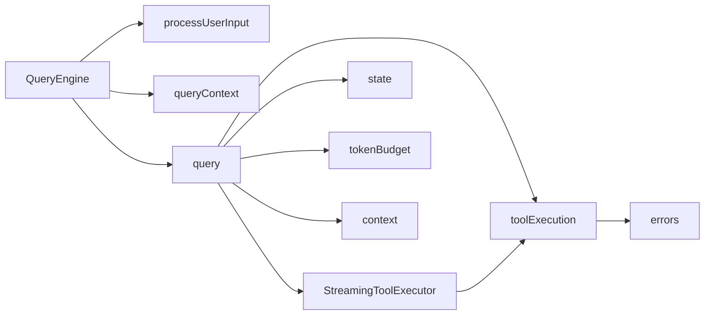

# 查询引擎系统

<cite>
**本文引用的文件**
- [QueryEngine.ts](file://src/QueryEngine.ts)
- [query.ts](file://src/query.ts)
- [StreamingToolExecutor.ts](file://src/services/tools/StreamingToolExecutor.ts)
- [processUserInput.ts](file://src/utils/processUserInput/processUserInput.ts)
- [toolExecution.ts](file://src/services/tools/toolExecution.ts)
- [queryContext.ts](file://src/utils/queryContext.ts)
- [state.ts](file://src/bootstrap/state.ts)
- [errors.ts](file://src/utils/errors.ts)
- [tokenBudget.ts](file://src/query/tokenBudget.ts)
- [tokenBudget.ts](file://src/utils/tokenBudget.ts)
- [context.ts](file://src/utils/context.ts)
</cite>

## 目录
1. [简介](#简介)
2. [项目结构](#项目结构)
3. [核心组件](#核心组件)
4. [架构总览](#架构总览)
5. [详细组件分析](#详细组件分析)
6. [依赖关系分析](#依赖关系分析)
7. [性能考量](#性能考量)
8. [故障排查指南](#故障排查指南)
9. [结论](#结论)
10. [附录](#附录)

## 简介
本技术文档面向 Claude Code 查询引擎系统，聚焦于其核心架构与运行机制，包括：
- Agent 循环的工作原理与消息处理流程
- 工具调用机制与 StreamingToolExecutor 的流式执行模型
- 权限检查流程与工具编排策略
- 用户输入处理、系统提示生成、上下文窗口与令牌预算控制
- 状态管理、错误处理与性能优化策略
- 提供具体代码路径示例，帮助读者定位实现细节

## 项目结构
查询引擎位于 src 目录下，围绕 QueryEngine 类与 query 函数形成主干，配合工具执行、权限检查、上下文构建与状态管理模块协同工作。

图表来源
- [QueryEngine.ts:184-686](file://src/QueryEngine.ts#L184-L686)
- [query.ts:219-1410](file://src/query.ts#L219-L1410)
- [StreamingToolExecutor.ts:40-531](file://src/services/tools/StreamingToolExecutor.ts#L40-L531)
- [processUserInput.ts:85-270](file://src/utils/processUserInput/processUserInput.ts#L85-L270)
- [toolExecution.ts:337-490](file://src/services/tools/toolExecution.ts#L337-L490)
- [queryContext.ts:44-74](file://src/utils/queryContext.ts#L44-L74)
- [state.ts:724-743](file://src/bootstrap/state.ts#L724-L743)
- [errors.ts:1-239](file://src/utils/errors.ts#L1-L239)
- [tokenBudget.ts:45-56](file://src/query/tokenBudget.ts#L45-L56)
- [context.ts:118-159](file://src/utils/context.ts#L118-L159)

章节来源
- [QueryEngine.ts:184-686](file://src/QueryEngine.ts#L184-L686)
- [query.ts:219-1410](file://src/query.ts#L219-L1410)

## 核心组件
- QueryEngine：负责一次对话的完整生命周期，包括系统提示生成、消息入队、转录记录、上下文压缩、工具执行与结果归并。
- query：查询循环，驱动上下文压缩（微压缩、自动压缩）、模型调用、工具执行与恢复路径。
- StreamingToolExecutor：在流式响应期间并发安全地调度工具执行，保证顺序与进度可见性。
- processUserInput：解析用户输入、处理图像粘贴、附件提取、斜杠命令与钩子拦截。
- toolExecution：统一的工具调用入口，执行前/后钩子、权限检查、进度事件与结果归并。
- state：全局状态与预算跟踪，包括会话标识、成本统计、令牌使用与预算计数。
- 错误体系：统一的错误类型与分类，便于日志与遥测。

章节来源
- [QueryEngine.ts:130-173](file://src/QueryEngine.ts#L130-L173)
- [query.ts:181-199](file://src/query.ts#L181-L199)
- [StreamingToolExecutor.ts:40-62](file://src/services/tools/StreamingToolExecutor.ts#L40-L62)
- [processUserInput.ts:62-83](file://src/utils/processUserInput/processUserInput.ts#L62-L83)
- [toolExecution.ts:337-490](file://src/services/tools/toolExecution.ts#L337-L490)
- [state.ts:45-257](file://src/bootstrap/state.ts#L45-L257)
- [errors.ts:1-239](file://src/utils/errors.ts#L1-L239)

## 架构总览
查询引擎采用“会话级 QueryEngine + 查询循环 query”的分层设计：
- QueryEngine 负责会话状态、系统提示与消息循环；在每次提交时构建 ProcessUserInputContext，并调用 query。
- query 负责每轮迭代中的上下文压缩、模型调用、工具发现与执行、恢复路径与预算控制。
- StreamingToolExecutor 在流式阶段对工具调用进行并发控制与进度回传，确保非并发工具串行、并发工具并行且有序产出。

图表来源
- [QueryEngine.ts:209-686](file://src/QueryEngine.ts#L209-L686)
- [query.ts:241-1410](file://src/query.ts#L241-L1410)
- [StreamingToolExecutor.ts:76-124](file://src/services/tools/StreamingToolExecutor.ts#L76-L124)
- [toolExecution.ts:337-490](file://src/services/tools/toolExecution.ts#L337-L490)

## 详细组件分析

### QueryEngine：会话生命周期与消息循环
- 初始化与配置注入：接收工具集、命令集、MCP 客户端、代理定义、文件缓存、模型选择、预算与思考配置等。
- 系统提示生成：通过 fetchSystemPromptParts 组合默认系统提示、用户上下文与系统上下文，并支持自定义与追加提示。
- 用户输入处理：委托 processUserInput 生成消息、识别是否需要查询、允许的工具集合与模型变更。
- 消息入队与转录：将新消息写入 mutableMessages，并持久化到会话存储；支持紧凑边界与快照。
- 查询循环：调用 query，按需产出系统初始化消息、紧凑边界、进度与最终结果；维护权限拒绝列表与用量统计。
- 结果归并：规范化消息类型，合并工具结果，处理中断与恢复，产出 SDK 消息与终端状态。

图表来源
- [QueryEngine.ts:209-686](file://src/QueryEngine.ts#L209-L686)
- [processUserInput.ts:85-270](file://src/utils/processUserInput/processUserInput.ts#L85-L270)
- [queryContext.ts:44-74](file://src/utils/queryContext.ts#L44-L74)

章节来源
- [QueryEngine.ts:184-686](file://src/QueryEngine.ts#L184-L686)
- [processUserInput.ts:85-270](file://src/utils/processUserInput/processUserInput.ts#L85-L270)
- [queryContext.ts:44-74](file://src/utils/queryContext.ts#L44-L74)

### query：查询循环与上下文压缩
- 配置与状态：构建 QueryConfig，启动内存预取与技能发现预取；维护跨迭代状态（消息、工具上下文、自动压缩跟踪、最大输出令牌回收计数等）。
- 上下文压缩：按序执行微压缩、可选的历史裁剪、上下文折叠与自动压缩；在压缩后产出摘要消息并更新消息视图。
- 模型调用：拼接用户上下文与系统提示，选择模型与输出令牌上限，处理流式回退与孤儿消息清理。
- 工具执行：在流式阶段通过 StreamingToolExecutor 即时添加工具并产出进度；在流结束后进行剩余工具执行与结果归并。
- 预算与恢复：检查阻断阈值、最大输出令牌回收、媒体恢复门控与恢复路径；支持任务预算与令牌预算决策。

图表来源
- [query.ts:241-1410](file://src/query.ts#L241-L1410)

章节来源
- [query.ts:219-1410](file://src/query.ts#L219-L1410)

### StreamingToolExecutor：流式工具执行器
- 并发模型：区分并发安全与非并发安全工具；非并发工具串行，其余并行但保持结果顺序。
- 执行队列：addTool 将工具加入队列，processQueue 基于 canExecuteTool 判定执行条件；executeTool 创建子中断控制器，隔离兄弟进程影响。
- 进度与结果：工具执行过程中产生 progress 消息立即产出；完成时标记为 yielded；支持丢弃（流式回退）与中断行为。
- 中断与取消：根据父中断信号或兄弟错误传播进行取消；支持“取消即停止”与“阻塞等待”两种中断行为。

图表来源
- [StreamingToolExecutor.ts:40-531](file://src/services/tools/StreamingToolExecutor.ts#L40-L531)

章节来源
- [StreamingToolExecutor.ts:40-531](file://src/services/tools/StreamingToolExecutor.ts#L40-L531)

### 工具调用与权限检查：toolExecution
- 输入验证：使用 Zod Schema 对工具输入进行类型与值校验；对延迟工具缺失 schema 提示重新加载工具。
- 权限检查：在工具调用前后执行钩子与权限决策，支持自动模式、分类器与交互式弹窗；记录决策来源与耗时。
- 执行与进度：通过 runToolUse 生成异步迭代器，产出 progress 与最终结果；对 Bash 等工具进行特殊处理与错误传播。
- 错误分类：统一错误类型与分类，便于遥测与调试；对文件系统错误提取 errno 与路径信息。

图表来源
- [toolExecution.ts:337-490](file://src/services/tools/toolExecution.ts#L337-L490)
- [toolExecution.ts:492-570](file://src/services/tools/toolExecution.ts#L492-L570)
- [toolExecution.ts:599-800](file://src/services/tools/toolExecution.ts#L599-L800)

章节来源
- [toolExecution.ts:337-490](file://src/services/tools/toolExecution.ts#L337-L490)
- [toolExecution.ts:492-570](file://src/services/tools/toolExecution.ts#L492-L570)
- [toolExecution.ts:599-800](file://src/services/tools/toolExecution.ts#L599-L800)

### 用户输入处理：processUserInput
- 输入标准化：处理字符串与多内容块输入，对图片进行尺寸调整与元数据收集。
- 附件与图像：从输入中提取附件与粘贴图像，生成内容块并写入消息。
- 斜杠命令与钩子：识别斜杠命令、桥接安全命令、超计划关键词路由；执行用户提示提交钩子，支持阻止继续与附加上下文。
- 结果归并：返回消息数组、是否查询标志、允许工具集合与模型变更。

章节来源
- [processUserInput.ts:85-270](file://src/utils/processUserInput/processUserInput.ts#L85-L270)
- [processUserInput.ts:281-590](file://src/utils/processUserInput/processUserInput.ts#L281-L590)

### 系统提示与上下文：queryContext
- 分片获取：fetchSystemPromptParts 并行获取默认系统提示、用户上下文与系统上下文，支持自定义覆盖。
- 回退参数：buildSideQuestionFallbackParams 用于侧问场景重建缓存键参数，匹配主循环生成的系统提示。

章节来源
- [queryContext.ts:44-74](file://src/utils/queryContext.ts#L44-L74)
- [queryContext.ts:88-179](file://src/utils/queryContext.ts#L88-L179)

### 状态管理与预算：state、tokenBudget、context
- 全局状态：维护会话标识、成本统计、令牌用量、钩子与分类器耗时、慢操作等；提供预算快照与增量计数。
- 令牌预算：基于预算阈值与比例计算继续/停止决策，支持“边际收益递减”提示。
- 上下文窗口：计算已用/剩余百分比，提供模型最大输出令牌限制与上界。

章节来源
- [state.ts:45-257](file://src/bootstrap/state.ts#L45-L257)
- [state.ts:724-743](file://src/bootstrap/state.ts#L724-L743)
- [tokenBudget.ts:45-56](file://src/query/tokenBudget.ts#L45-L56)
- [tokenBudget.ts:66-73](file://src/query/tokenBudget.ts#L66-L73)
- [tokenBudget.ts:31-73](file://src/utils/tokenBudget.ts#L31-L73)
- [context.ts:118-159](file://src/utils/context.ts#L118-L159)

## 依赖关系分析
- QueryEngine 依赖 processUserInput 与 queryContext 生成系统提示与消息；依赖 query 进行循环与压缩；依赖 state 进行用量与预算统计。
- query 依赖 StreamingToolExecutor 实现流式工具执行；依赖 toolExecution 统一工具调用；依赖 tokenBudget 与 context 控制预算与上下文。
- StreamingToolExecutor 依赖 toolExecution 与工具定义；依赖 state 的中断控制器与上下文修改。
- 错误体系贯穿工具执行与权限检查，提供统一的错误分类与日志。

图表来源
- [QueryEngine.ts:184-686](file://src/QueryEngine.ts#L184-L686)
- [query.ts:219-1410](file://src/query.ts#L219-L1410)
- [StreamingToolExecutor.ts:40-531](file://src/services/tools/StreamingToolExecutor.ts#L40-L531)
- [toolExecution.ts:337-490](file://src/services/tools/toolExecution.ts#L337-L490)
- [state.ts:45-257](file://src/bootstrap/state.ts#L45-L257)
- [errors.ts:1-239](file://src/utils/errors.ts#L1-L239)
- [tokenBudget.ts:45-56](file://src/query/tokenBudget.ts#L45-L56)
- [context.ts:118-159](file://src/utils/context.ts#L118-L159)

章节来源
- [QueryEngine.ts:184-686](file://src/QueryEngine.ts#L184-L686)
- [query.ts:219-1410](file://src/query.ts#L219-L1410)

## 性能考量
- 流式工具执行：StreamingToolExecutor 在流式阶段即时调度工具，减少等待时间；并发安全工具并行执行，非并发工具串行以避免资源竞争。
- 上下文压缩：微压缩、自动压缩与反应式压缩组合，降低上下文长度，提升吞吐与降低成本。
- 预取与懒加载：技能发现预取、内存预取与插件缓存仅在必要时加载，避免阻塞主流程。
- 预算控制：基于预算阈值的比例判断与边际收益提示，避免过度消耗；任务预算与令牌预算协同控制。
- 图像处理：输入图像的尺寸调整与降采样在并行中完成，减少 API 调用负担。

[本节为通用指导，不直接分析具体文件]

## 故障排查指南
- 工具输入验证失败：查看 Zod 校验错误与延迟工具 schema 缺失提示，优先调用工具搜索工具加载 schema 再重试。
- 权限拒绝：检查权限决策来源（规则/钩子/模式），确认交互式弹窗或自动模式分类器结果；必要时调整权限规则或使用会话旁路模式。
- 流式回退：若出现流式回退，引擎会丢弃部分消息并重建执行器；检查工具执行日志与错误栈，定位导致回退的工具。
- 阻断阈值：当达到阻断阈值时，直接返回“提示过长”错误；可通过上下文压缩或减少输入解决。
- 错误分类：利用统一错误类型与 errno 代码定位文件系统类问题；对网络/认证/超时等进行分类处理。

章节来源
- [toolExecution.ts:614-733](file://src/services/tools/toolExecution.ts#L614-L733)
- [query.ts:653-741](file://src/query.ts#L653-L741)
- [errors.ts:128-195](file://src/utils/errors.ts#L128-L195)

## 结论
查询引擎通过 QueryEngine 与 query 的分层设计，结合 StreamingToolExecutor 的流式并发执行与完善的权限检查、上下文压缩与预算控制，实现了高效、可观测且可扩展的智能体查询能力。其模块化与可插拔特性使得工具链、钩子与 MCP 服务能够灵活集成，同时通过状态与错误体系保障了稳定性与可诊断性。

[本节为总结性内容，不直接分析具体文件]

## 附录
- 代码示例路径（不展示具体代码内容）
  - 查询引擎初始化与消息循环：[QueryEngine.submitMessage:209-236](file://src/QueryEngine.ts#L209-L236)
  - 用户输入解析与附件提取：[processUserInput:85-270](file://src/utils/processUserInput/processUserInput.ts#L85-L270)
  - 查询循环与上下文压缩：[query:219-280](file://src/query.ts#L219-L280)
  - 流式工具执行器添加与完成结果获取：[StreamingToolExecutor.addTool/getCompletedResults:76-124](file://src/services/tools/StreamingToolExecutor.ts#L76-L124)
  - 工具调用与权限检查：[runToolUse:337-490](file://src/services/tools/toolExecution.ts#L337-L490)
  - 系统提示与上下文组装：[fetchSystemPromptParts:44-74](file://src/utils/queryContext.ts#L44-L74)
  - 全局状态与预算跟踪：[state:724-743](file://src/bootstrap/state.ts#L724-L743)
  - 令牌预算决策：[checkTokenBudget:45-56](file://src/query/tokenBudget.ts#L45-L56)