# 消息处理流程

<cite>
**本文引用的文件**
- [inboundMessages.ts](file://src/bridge/inboundMessages.ts)
- [inboundAttachments.ts](file://src/bridge/inboundAttachments.ts)
- [bridgeMessaging.ts](file://src/bridge/bridgeMessaging.ts)
- [replBridge.ts](file://src/bridge/replBridge.ts)
- [replBridgeTransport.ts](file://src/bridge/replBridgeTransport.ts)
- [bridgeApi.ts](file://src/bridge/bridgeApi.ts)
- [flushGate.ts](file://src/bridge/flushGate.ts)
- [remoteIO.ts](file://src/cli/remoteIO.ts)
- [ndjsonSafeStringify.ts](file://src/cli/ndjsonSafeStringify.ts)
- [mappers.ts](file://src/utils/messages/mappers.ts)
- [tokens.ts](file://src/utils/tokens.ts)
- [context.ts](file://src/utils/context.ts)
- [tokenBudget.ts](file://src/utils/tokenBudget.ts)
- [errorLogSink.ts](file://src/utils/errorLogSink.ts)
- [log.ts](file://src/utils/log.ts)
- [errors.ts](file://src/utils/errors.ts)
- [peerAddress.ts](file://src/utils/peerAddress.ts)
- [conversationRecovery.ts](file://src/utils/conversationRecovery.ts)
</cite>

## 目录
1. [简介](#简介)
2. [项目结构](#项目结构)
3. [核心组件](#核心组件)
4. [架构总览](#架构总览)
5. [详细组件分析](#详细组件分析)
6. [依赖关系分析](#依赖关系分析)
7. [性能考量](#性能考量)
8. [故障排查指南](#故障排查指南)
9. [结论](#结论)
10. [附录](#附录)

## 简介
本文件系统性阐述 Claude Code 的消息处理流程，覆盖从桥接层接收用户输入、标准化消息类型、内容规范化、附件解析与注入、到桥接传输写入与回传的全链路。重点包括：
- 消息类型转换与内容规范化（含图像块媒体类型修正）
- 附件下载、落盘与路径引用注入
- 消息完整性校验（去重、回放防护）、令牌计算与上下文窗口优化
- 错误检测、异常恢复与降级策略
- 序列化/反序列化与传输协议细节
- 提供消息预处理、流式传输与后处理的端到端流程说明

## 项目结构
围绕“消息处理”的关键模块分布如下：
- 桥接入口与解析：bridgeMessaging.ts、inboundMessages.ts、inboundAttachments.ts
- 传输适配：replBridgeTransport.ts、replBridge.ts
- API 客户端与错误处理：bridgeApi.ts、errorLogSink.ts、log.ts、errors.ts
- 内部消息映射与序列化：mappers.ts、ndjsonSafeStringify.ts
- 令牌与上下文：tokens.ts、context.ts、tokenBudget.ts
- 其他支撑：flushGate.ts、remoteIO.ts、peerAddress.ts、conversationRecovery.ts

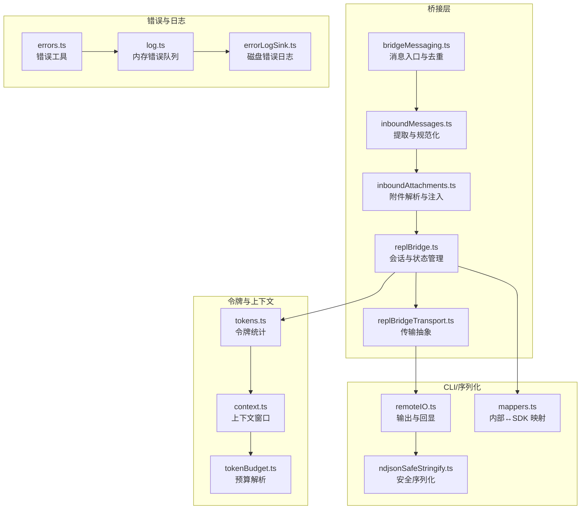

图表来源
- [bridgeMessaging.ts:126-208](file://src/bridge/bridgeMessaging.ts#L126-L208)
- [inboundMessages.ts:21-81](file://src/bridge/inboundMessages.ts#L21-L81)
- [inboundAttachments.ts:123-176](file://src/bridge/inboundAttachments.ts#L123-L176)
- [replBridge.ts:1-200](file://src/bridge/replBridge.ts#L1-L200)
- [replBridgeTransport.ts:1-371](file://src/bridge/replBridgeTransport.ts#L1-L371)
- [remoteIO.ts:231-242](file://src/cli/remoteIO.ts#L231-L242)
- [ndjsonSafeStringify.ts:1-32](file://src/cli/ndjsonSafeStringify.ts#L1-L32)
- [mappers.ts:115-181](file://src/utils/messages/mappers.ts#L115-L181)
- [tokens.ts:32-103](file://src/utils/tokens.ts#L32-L103)
- [context.ts:65-159](file://src/utils/context.ts#L65-L159)
- [tokenBudget.ts:21-74](file://src/utils/tokenBudget.ts#L21-L74)
- [errors.ts:125-162](file://src/utils/errors.ts#L125-L162)
- [log.ts:171-225](file://src/utils/log.ts#L171-L225)
- [errorLogSink.ts:1-41](file://src/utils/errorLogSink.ts#L1-L41)

章节来源
- [bridgeMessaging.ts:126-208](file://src/bridge/bridgeMessaging.ts#L126-L208)
- [inboundMessages.ts:21-81](file://src/bridge/inboundMessages.ts#L21-L81)
- [inboundAttachments.ts:123-176](file://src/bridge/inboundAttachments.ts#L123-L176)
- [replBridge.ts:1-200](file://src/bridge/replBridge.ts#L1-L200)
- [replBridgeTransport.ts:1-371](file://src/bridge/replBridgeTransport.ts#L1-L371)
- [remoteIO.ts:231-242](file://src/cli/remoteIO.ts#L231-L242)
- [ndjsonSafeStringify.ts:1-32](file://src/cli/ndjsonSafeStringify.ts#L1-L32)
- [mappers.ts:115-181](file://src/utils/messages/mappers.ts#L115-L181)
- [tokens.ts:32-103](file://src/utils/tokens.ts#L32-L103)
- [context.ts:65-159](file://src/utils/context.ts#L65-L159)
- [tokenBudget.ts:21-74](file://src/utils/tokenBudget.ts#L21-L74)
- [errors.ts:125-162](file://src/utils/errors.ts#L125-L162)
- [log.ts:171-225](file://src/utils/log.ts#L171-L225)
- [errorLogSink.ts:1-41](file://src/utils/errorLogSink.ts#L1-L41)

## 核心组件
- 消息入口与去重：解析入站消息，过滤重复与回放，分发至业务回调
- 用户消息提取与规范化：统一内容格式，修正图像块媒体类型字段
- 附件解析与注入：下载远端附件、本地落盘、生成路径引用并注入内容
- 传输适配：抽象 v1/v2 传输，支持写入、批量写入、连接状态、交付跟踪
- 内部消息映射：内部消息与 SDK 消息双向转换
- 令牌与上下文：令牌计数、最终窗口估算、上下文百分比计算、预算解析
- 错误与日志：错误栈截断、内存队列、磁盘错误日志

章节来源
- [bridgeMessaging.ts:126-208](file://src/bridge/bridgeMessaging.ts#L126-L208)
- [inboundMessages.ts:21-81](file://src/bridge/inboundMessages.ts#L21-L81)
- [inboundAttachments.ts:123-176](file://src/bridge/inboundAttachments.ts#L123-L176)
- [replBridgeTransport.ts:23-70](file://src/bridge/replBridgeTransport.ts#L23-L70)
- [mappers.ts:115-181](file://src/utils/messages/mappers.ts#L115-L181)
- [tokens.ts:32-103](file://src/utils/tokens.ts#L32-L103)
- [context.ts:65-159](file://src/utils/context.ts#L65-L159)
- [tokenBudget.ts:21-74](file://src/utils/tokenBudget.ts#L21-L74)
- [errors.ts:125-162](file://src/utils/errors.ts#L125-L162)
- [log.ts:171-225](file://src/utils/log.ts#L171-L225)
- [errorLogSink.ts:1-41](file://src/utils/errorLogSink.ts#L1-L41)

## 架构总览
消息从桥接入口进入，经过类型提取与规范化、附件解析与注入，再通过传输层写入远端；同时内部进行令牌统计与上下文窗口评估，并在必要时触发降级或恢复逻辑。

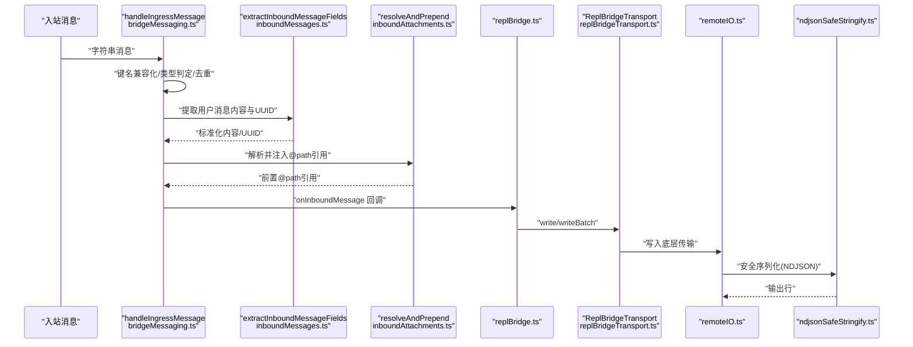

图表来源
- [bridgeMessaging.ts:126-208](file://src/bridge/bridgeMessaging.ts#L126-L208)
- [inboundMessages.ts:21-81](file://src/bridge/inboundMessages.ts#L21-L81)
- [inboundAttachments.ts:167-176](file://src/bridge/inboundAttachments.ts#L167-L176)
- [replBridge.ts:1-200](file://src/bridge/replBridge.ts#L1-L200)
- [replBridgeTransport.ts:23-70](file://src/bridge/replBridgeTransport.ts#L23-L70)
- [remoteIO.ts:231-242](file://src/cli/remoteIO.ts#L231-L242)
- [ndjsonSafeStringify.ts:1-32](file://src/cli/ndjsonSafeStringify.ts#L1-L32)

## 详细组件分析

### 组件A：入站消息标准化与去重
- 功能要点
  - 解析入站字符串，进行控制消息键名兼容化
  - 类型守卫区分 SDKMessage、control_response、control_request
  - 基于最近发送/接收的 UUID 集合进行回声与重放去重
  - 将用户消息转发给业务回调，其他类型忽略
- 关键流程
  - 解析与类型判定
  - UUID 存在性检查与去重
  - 控制请求/响应分支处理
  - 记录调试事件与统计指标

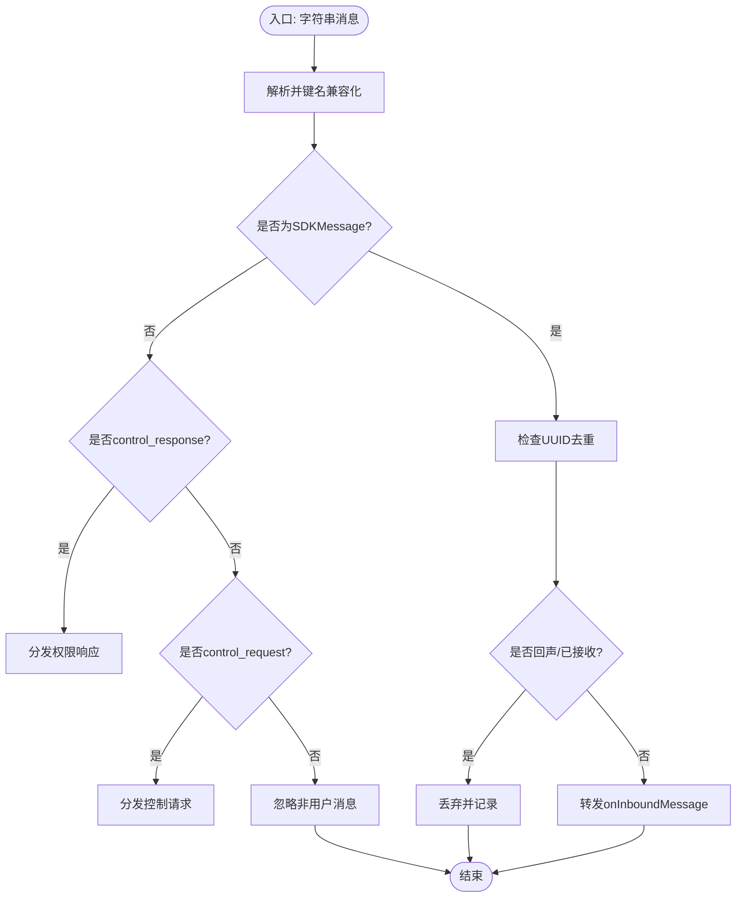

图表来源
- [bridgeMessaging.ts:126-208](file://src/bridge/bridgeMessaging.ts#L126-L208)

章节来源
- [bridgeMessaging.ts:126-208](file://src/bridge/bridgeMessaging.ts#L126-L208)

### 组件B：用户消息内容规范化
- 功能要点
  - 仅处理用户消息，过滤空内容或空数组
  - 规范化图像块：将客户端可能使用的驼峰字段 mediaType 转换为 snake_case media_type
  - 快路径扫描：若无需规范化则直接返回原数组
- 复杂度
  - 规范化扫描 O(n)，映射 O(n)；无分配的快路径 O(1)

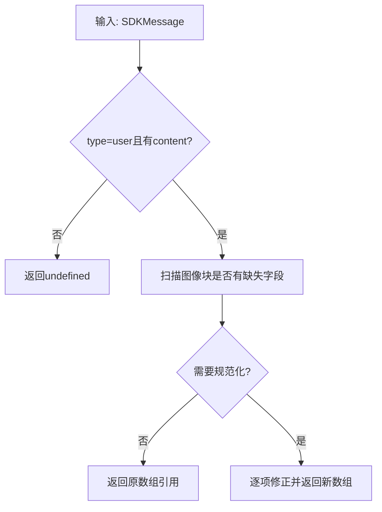

图表来源
- [inboundMessages.ts:21-81](file://src/bridge/inboundMessages.ts#L21-L81)

章节来源
- [inboundMessages.ts:21-81](file://src/bridge/inboundMessages.ts#L21-L81)

### 组件C：入站附件解析与注入
- 功能要点
  - 从消息中提取 file_attachments 数组
  - 通过 OAuth 获取附件内容，落盘到本地上传目录
  - 生成带引号的 @path 引用并注入到内容前缀
  - 最后文本块优先注入，无文本块时追加文本块
- 容错策略
  - 无令牌、网络失败、写盘失败均降级为“无附件”，不影响主消息投递

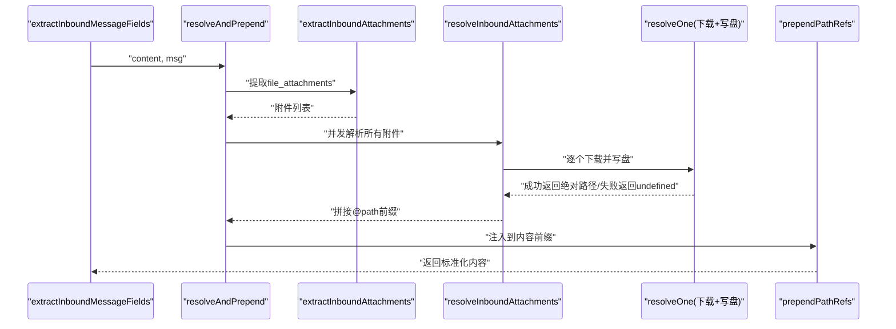

图表来源
- [inboundAttachments.ts:42-176](file://src/bridge/inboundAttachments.ts#L42-L176)
- [inboundMessages.ts:21-81](file://src/bridge/inboundMessages.ts#L21-L81)

章节来源
- [inboundAttachments.ts:42-176](file://src/bridge/inboundAttachments.ts#L42-L176)
- [inboundMessages.ts:21-81](file://src/bridge/inboundMessages.ts#L21-L81)

### 组件D：桥接传输与写入
- 功能要点
  - v1：HybridTransport（读写均通过 Session-Ingress）
  - v2：SSETransport（读）+ CCRClient（写），支持状态上报、元数据上报、交付跟踪
  - 连接状态与心跳、epoch 不匹配处理、写批处理顺序保证
- 写入路径
  - v2：通过 CCRClient 写入事件，支持 flush；v1：直接 POST

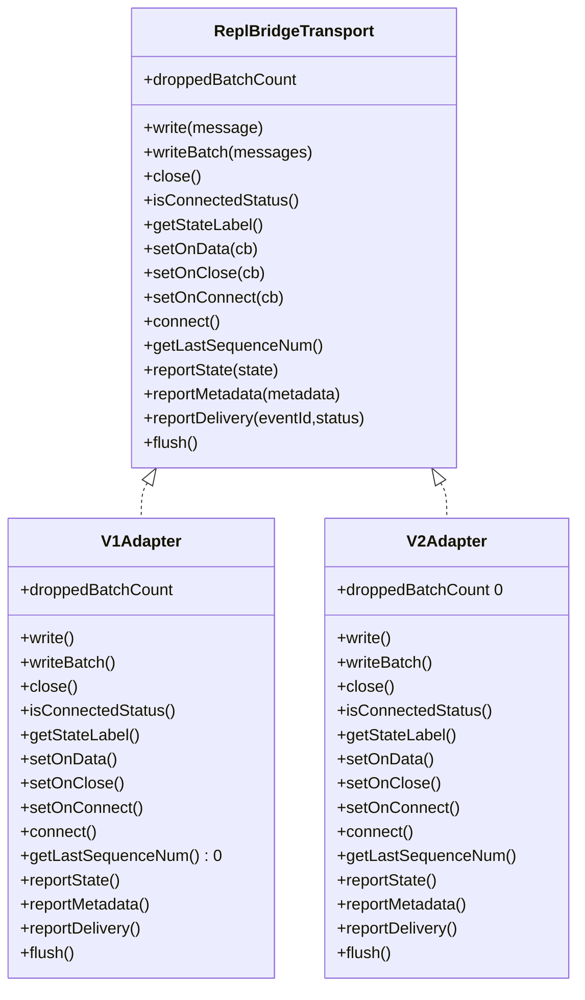

图表来源
- [replBridgeTransport.ts:23-70](file://src/bridge/replBridgeTransport.ts#L23-L70)
- [replBridgeTransport.ts:78-103](file://src/bridge/replBridgeTransport.ts#L78-L103)
- [replBridgeTransport.ts:119-371](file://src/bridge/replBridgeTransport.ts#L119-L371)

章节来源
- [replBridgeTransport.ts:23-70](file://src/bridge/replBridgeTransport.ts#L23-L70)
- [replBridgeTransport.ts:78-103](file://src/bridge/replBridgeTransport.ts#L78-L103)
- [replBridgeTransport.ts:119-371](file://src/bridge/replBridgeTransport.ts#L119-L371)

### 组件E：令牌计算与上下文窗口优化
- 令牌统计
  - 从使用数据计算总令牌：输入 + 缓存输入 + 输出
  - 最终上下文令牌：迭代末尾输入+输出，或回退到顶层输入+输出
- 上下文窗口
  - 根据模型能力、特性开关、实验参数动态决定上下文窗口大小
  - 计算使用百分比与剩余百分比，用于任务预算与节流
- 预算解析
  - 支持简写与详述两种形式的 token 预算识别与位置标注

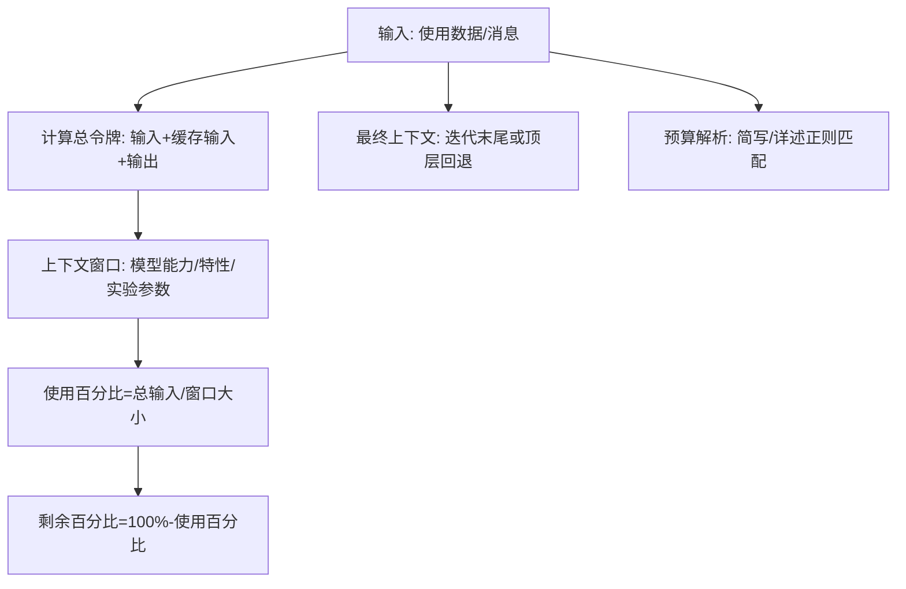

图表来源
- [tokens.ts:32-103](file://src/utils/tokens.ts#L32-L103)
- [context.ts:65-159](file://src/utils/context.ts#L65-L159)
- [tokenBudget.ts:21-74](file://src/utils/tokenBudget.ts#L21-L74)

章节来源
- [tokens.ts:32-103](file://src/utils/tokens.ts#L32-L103)
- [context.ts:65-159](file://src/utils/context.ts#L65-L159)
- [tokenBudget.ts:21-74](file://src/utils/tokenBudget.ts#L21-L74)

### 组件F：错误检测、异常恢复与降级
- 错误工具
  - 提取 errno 与路径信息，短错误栈以减少上下文开销
- 日志与错误持久化
  - 内存错误队列与磁盘错误日志分离，避免阻塞
- 桥接 API 错误处理
  - 401 自动刷新重试，403 可抑制性错误识别，过期错误类型判断
- 故障注入与降级
  - 注入桥接故障（致命/非致命）以测试恢复路径
  - 传输初始化失败与 epoch 不匹配的优雅关闭与重连

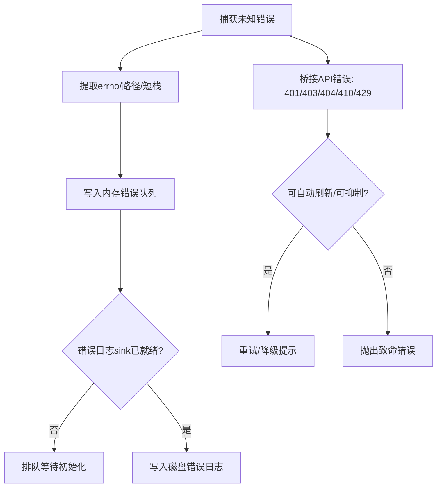

图表来源
- [errors.ts:125-162](file://src/utils/errors.ts#L125-L162)
- [log.ts:171-225](file://src/utils/log.ts#L171-L225)
- [errorLogSink.ts:1-41](file://src/utils/errorLogSink.ts#L1-L41)
- [bridgeApi.ts:454-540](file://src/bridge/bridgeApi.ts#L454-L540)
- [bridgeDebug.ts:70-106](file://src/bridge/bridgeDebug.ts#L70-L106)

章节来源
- [errors.ts:125-162](file://src/utils/errors.ts#L125-L162)
- [log.ts:171-225](file://src/utils/log.ts#L171-L225)
- [errorLogSink.ts:1-41](file://src/utils/errorLogSink.ts#L1-L41)
- [bridgeApi.ts:454-540](file://src/bridge/bridgeApi.ts#L454-L540)
- [bridgeDebug.ts:70-106](file://src/bridge/bridgeDebug.ts#L70-L106)

### 组件G：序列化、反序列化与传输协议
- 序列化
  - NDJSON 行内 JSON 序列化，转义 U+2028/U+2029 以避免被行分割器截断
- 反序列化
  - 入站消息解析与键名兼容化，随后按类型路由
- 传输协议
  - v1：WebSocket 读 + Session-Ingress POST 写
  - v2：SSE 读 + CCRClient POST 写，支持状态/元数据/交付跟踪

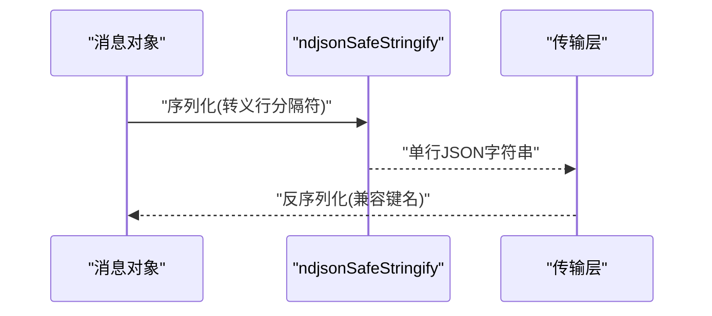

图表来源
- [ndjsonSafeStringify.ts:1-32](file://src/cli/ndjsonSafeStringify.ts#L1-L32)
- [bridgeMessaging.ts:140-141](file://src/bridge/bridgeMessaging.ts#L140-L141)
- [remoteIO.ts:231-242](file://src/cli/remoteIO.ts#L231-L242)

章节来源
- [ndjsonSafeStringify.ts:1-32](file://src/cli/ndjsonSafeStringify.ts#L1-L32)
- [bridgeMessaging.ts:140-141](file://src/bridge/bridgeMessaging.ts#L140-L141)
- [remoteIO.ts:231-242](file://src/cli/remoteIO.ts#L231-L242)

### 组件H：消息预处理、流式传输与后处理
- 预处理
  - 用户消息提取与规范化、附件注入
- 流式传输
  - v2 写入事件与批量写入，支持 flush；NDJSON 安全序列化
- 后处理
  - 交付跟踪（received/processing/processed），epoch 不匹配优雅关闭
  - 内部消息映射（内部↔SDK），用于 UI 展示与下游消费

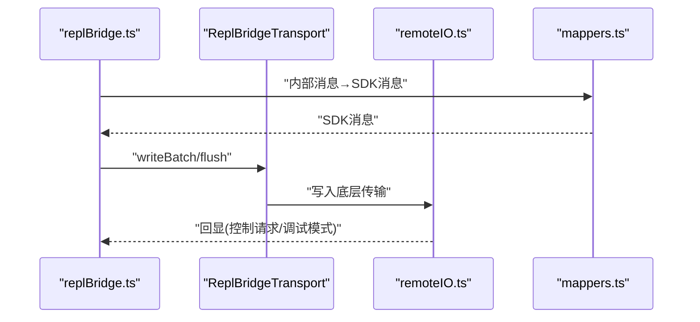

图表来源
- [replBridge.ts:1-200](file://src/bridge/replBridge.ts#L1-L200)
- [replBridgeTransport.ts:270-371](file://src/bridge/replBridgeTransport.ts#L270-L371)
- [remoteIO.ts:231-242](file://src/cli/remoteIO.ts#L231-L242)
- [mappers.ts:115-181](file://src/utils/messages/mappers.ts#L115-L181)

章节来源
- [replBridge.ts:1-200](file://src/bridge/replBridge.ts#L1-L200)
- [replBridgeTransport.ts:270-371](file://src/bridge/replBridgeTransport.ts#L270-L371)
- [remoteIO.ts:231-242](file://src/cli/remoteIO.ts#L231-L242)
- [mappers.ts:115-181](file://src/utils/messages/mappers.ts#L115-L181)

## 依赖关系分析
- 模块耦合
  - bridgeMessaging.ts 作为纯函数入口，依赖类型守卫与解析工具
  - inboundAttachments.ts 依赖桥接配置与文件系统写入
  - replBridgeTransport.ts 抽象 v1/v2 差异，降低上层复杂度
  - tokens.ts/context.ts/tokenBudget.ts 彼此协作，形成令牌与上下文闭环
- 外部依赖
  - axios 用于桥接 API 请求与附件下载
  - fs/promises 用于本地文件写入
  - 传输层依赖 SSE/HTTP 客户端

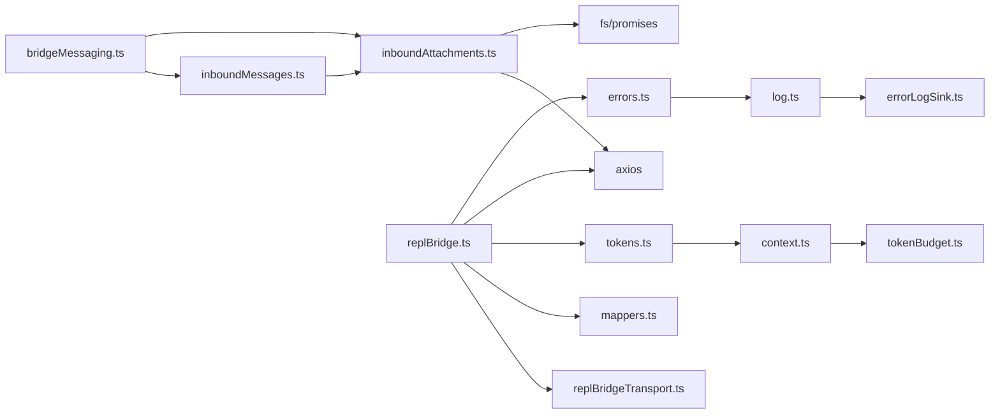

图表来源
- [bridgeMessaging.ts:1-462](file://src/bridge/bridgeMessaging.ts#L1-L462)
- [inboundMessages.ts:1-81](file://src/bridge/inboundMessages.ts#L1-L81)
- [inboundAttachments.ts:1-176](file://src/bridge/inboundAttachments.ts#L1-L176)
- [replBridge.ts:1-200](file://src/bridge/replBridge.ts#L1-L200)
- [replBridgeTransport.ts:1-371](file://src/bridge/replBridgeTransport.ts#L1-L371)
- [mappers.ts:1-200](file://src/utils/messages/mappers.ts#L1-L200)
- [tokens.ts:1-103](file://src/utils/tokens.ts#L1-L103)
- [context.ts:1-159](file://src/utils/context.ts#L1-L159)
- [tokenBudget.ts:1-74](file://src/utils/tokenBudget.ts#L1-L74)
- [errors.ts:125-162](file://src/utils/errors.ts#L125-L162)
- [log.ts:171-225](file://src/utils/log.ts#L171-L225)
- [errorLogSink.ts:1-41](file://src/utils/errorLogSink.ts#L1-L41)

章节来源
- [bridgeMessaging.ts:1-462](file://src/bridge/bridgeMessaging.ts#L1-L462)
- [inboundMessages.ts:1-81](file://src/bridge/inboundMessages.ts#L1-L81)
- [inboundAttachments.ts:1-176](file://src/bridge/inboundAttachments.ts#L1-L176)
- [replBridge.ts:1-200](file://src/bridge/replBridge.ts#L1-L200)
- [replBridgeTransport.ts:1-371](file://src/bridge/replBridgeTransport.ts#L1-L371)
- [mappers.ts:1-200](file://src/utils/messages/mappers.ts#L1-L200)
- [tokens.ts:1-103](file://src/utils/tokens.ts#L1-L103)
- [context.ts:1-159](file://src/utils/context.ts#L1-L159)
- [tokenBudget.ts:1-74](file://src/utils/tokenBudget.ts#L1-L74)
- [errors.ts:125-162](file://src/utils/errors.ts#L125-L162)
- [log.ts:171-225](file://src/utils/log.ts#L171-L225)
- [errorLogSink.ts:1-41](file://src/utils/errorLogSink.ts#L1-L41)

## 性能考量
- 去重与回放防护
  - BoundedUUIDSet 使用环形缓冲与集合，常数空间 O(capacity)，避免内存膨胀
- 附件解析
  - 并发下载 resolveOne，失败降级不阻塞主消息投递
- 令牌与上下文
  - 上下文窗口动态计算，避免超限；最终窗口估算减少服务器侧工具循环的额外开销
- 传输
  - v2 批量写入与 flush，epoch 不匹配快速关闭与重连，减少无效重试

## 故障排查指南
- 常见问题定位
  - 401 未认证：检查 OAuth 刷新回调与令牌有效性
  - 403 权限不足：确认角色与作用域，必要时抑制性错误提示
  - 410 会话过期：提示重新启动远程控制
  - 429 速率限制：降低轮询频率
- 日志与诊断
  - 使用内存错误队列与磁盘错误日志双通道定位
  - 调试模式下桥接控制请求会回显到 stdout
- 恢复策略
  - 传输初始化失败与 epoch 不匹配：关闭资源并由轮询循环接管
  - 附件下载失败：降级为无附件继续投递

章节来源
- [bridgeApi.ts:454-540](file://src/bridge/bridgeApi.ts#L454-L540)
- [log.ts:171-225](file://src/utils/log.ts#L171-L225)
- [errorLogSink.ts:1-41](file://src/utils/errorLogSink.ts#L1-L41)
- [remoteIO.ts:231-242](file://src/cli/remoteIO.ts#L231-L242)
- [replBridgeTransport.ts:209-232](file://src/bridge/replBridgeTransport.ts#L209-L232)

## 结论
该消息处理体系通过严格的入口解析、内容规范化、附件注入与传输抽象，实现了高鲁棒性的消息流转。结合令牌与上下文窗口的动态优化、完善的错误检测与降级策略，以及安全的序列化与回显机制，确保了在复杂网络与多变负载下的稳定性与可观测性。

## 附录
- 代码示例路径（不含具体代码内容）
  - 消息入口与去重：[bridgeMessaging.ts:126-208](file://src/bridge/bridgeMessaging.ts#L126-L208)
  - 用户消息规范化：[inboundMessages.ts:21-81](file://src/bridge/inboundMessages.ts#L21-L81)
  - 附件解析与注入：[inboundAttachments.ts:123-176](file://src/bridge/inboundAttachments.ts#L123-L176)
  - 传输适配与写入：[replBridgeTransport.ts:270-371](file://src/bridge/replBridgeTransport.ts#L270-L371)
  - 内部消息映射：[mappers.ts:115-181](file://src/utils/messages/mappers.ts#L115-L181)
  - 令牌与上下文：[tokens.ts:32-103](file://src/utils/tokens.ts#L32-L103)、[context.ts:65-159](file://src/utils/context.ts#L65-L159)
  - 序列化与传输：[ndjsonSafeStringify.ts:1-32](file://src/cli/ndjsonSafeStringify.ts#L1-L32)、[remoteIO.ts:231-242](file://src/cli/remoteIO.ts#L231-L242)
  - 错误与日志：[errors.ts:125-162](file://src/utils/errors.ts#L125-L162)、[log.ts:171-225](file://src/utils/log.ts#L171-L225)、[errorLogSink.ts:1-41](file://src/utils/errorLogSink.ts#L1-L41)
  - 对话恢复与兼容：[conversationRecovery.ts:76-121](file://src/utils/conversationRecovery.ts#L76-L121)