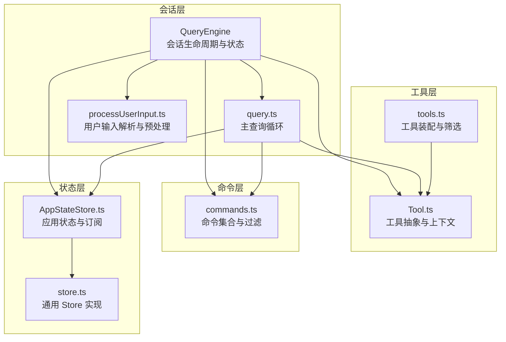
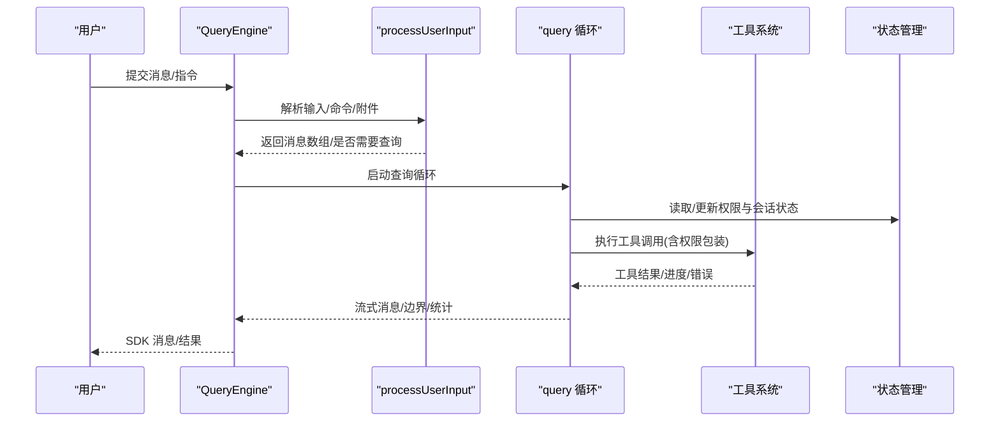
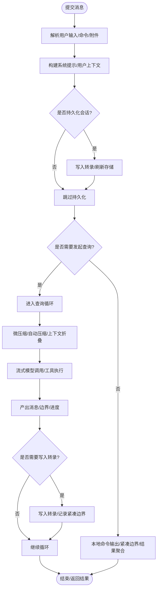
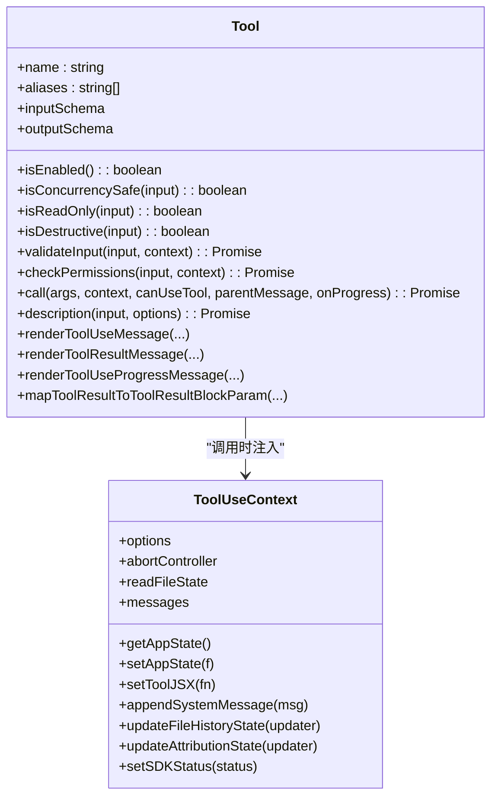
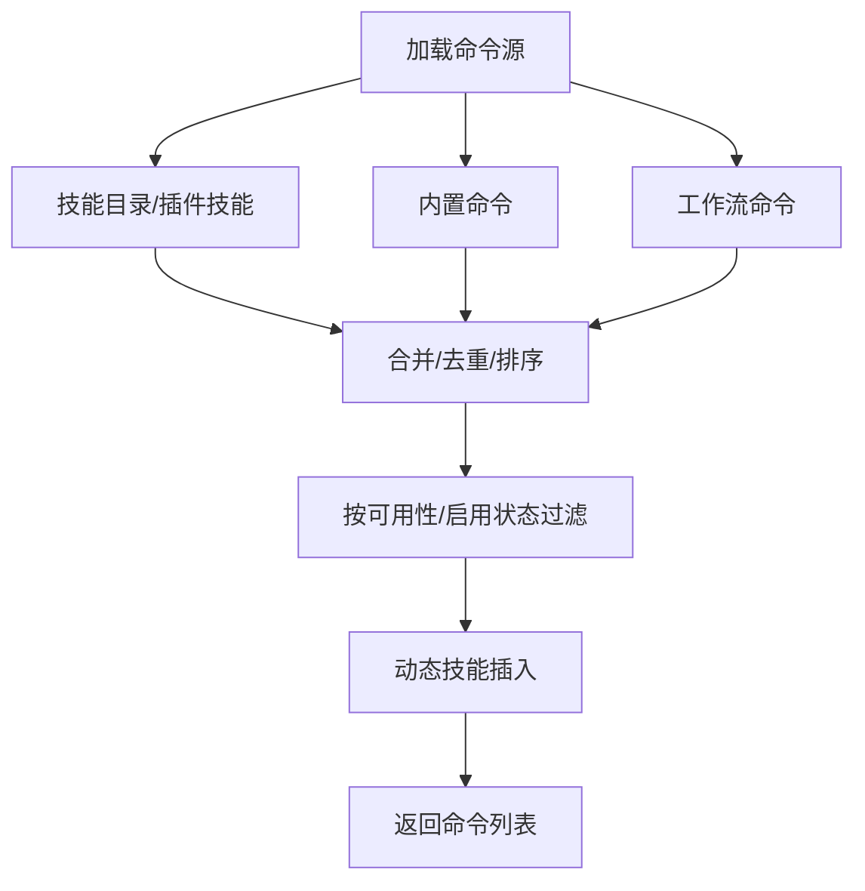
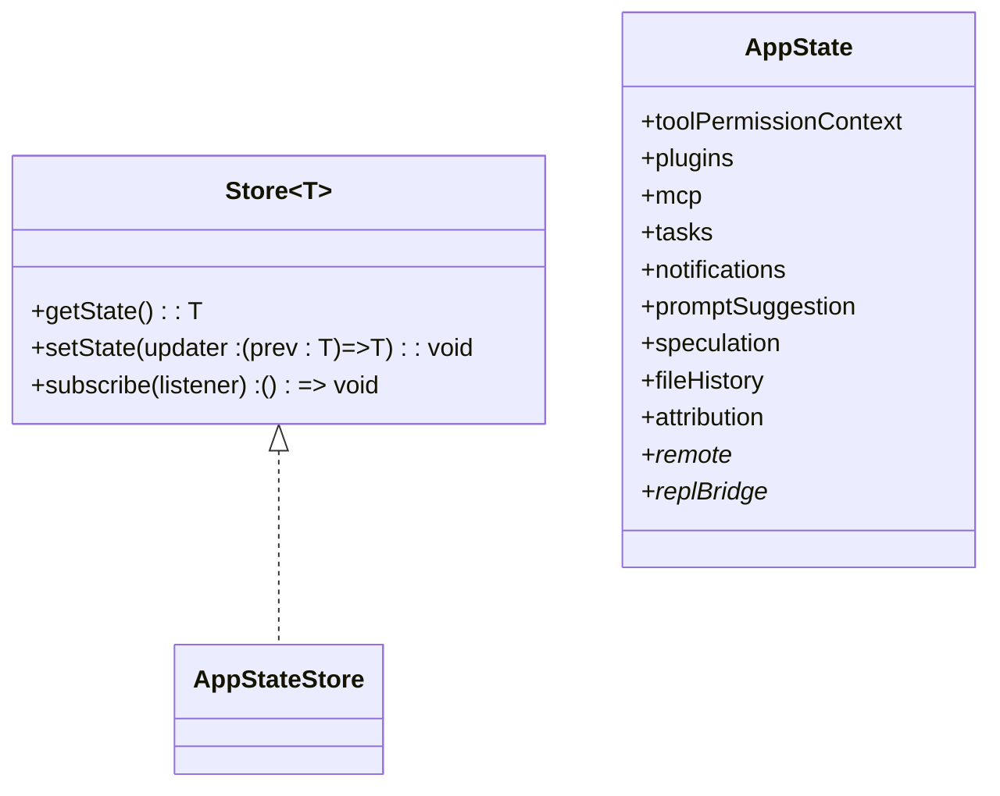
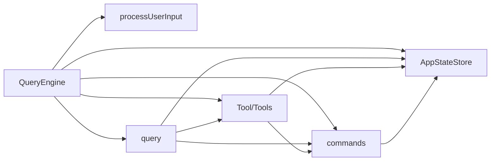

# 核心组件设计

<cite>
**本文引用的文件**
- [QueryEngine.ts](file://src/QueryEngine.ts)
- [Tool.ts](file://src/Tool.ts)
- [commands.ts](file://src/commands.ts)
- [AppStateStore.ts](file://src/state/AppStateStore.ts)
- [store.ts](file://src/state/store.ts)
- [query.ts](file://src/query.ts)
- [processUserInput.ts](file://src/utils/processUserInput/processUserInput.ts)
- [tools.ts](file://src/tools.ts)
</cite>

## 目录
1. [简介](#简介)
2. [项目结构](#项目结构)
3. [核心组件](#核心组件)
4. [架构总览](#架构总览)
5. [详细组件分析](#详细组件分析)
6. [依赖关系分析](#依赖关系分析)
7. [性能考量](#性能考量)
8. [故障排查指南](#故障排查指南)
9. [结论](#结论)

## 简介
本设计文档聚焦 Claude Code 的核心组件：查询引擎（QueryEngine）、工具系统（Tool）、命令系统（commands）与状态管理（AppStateStore）。文档从设计理念、职责边界、接口设计、内部机制、组件间依赖与通信模式、生命周期管理、错误处理策略与性能优化等方面进行深入剖析，并提供可操作的使用模式与排障建议。

## 项目结构
- 查询引擎 QueryEngine 负责一次对话会话的生命周期与状态持久化，封装提交消息、权限包装、系统提示构建、转录记录、历史压缩等流程。
- 工具系统 Tool 定义统一的工具抽象与上下文接口，提供输入校验、权限检查、并发安全、结果渲染、进度回调等能力。
- 命令系统 commands 提供内置与动态技能命令集合，支持按可用性与启用状态过滤、远程安全命令白名单等。
- 状态管理 AppStateStore 以不可变状态与订阅机制为核心，承载权限上下文、插件与 MCP 状态、任务与通知、推测与快照等会话级数据。

图表来源
- [QueryEngine.ts:184-207](file://src/QueryEngine.ts#L184-L207)
- [query.ts:219-239](file://src/query.ts#L219-L239)
- [processUserInput.ts:85-172](file://src/utils/processUserInput/processUserInput.ts#L85-L172)
- [Tool.ts:362-482](file://src/Tool.ts#L362-L482)
- [tools.ts:193-327](file://src/tools.ts#L193-L327)
- [commands.ts:258-346](file://src/commands.ts#L258-L346)
- [AppStateStore.ts:456-570](file://src/state/AppStateStore.ts#L456-L570)
- [store.ts:10-35](file://src/state/store.ts#L10-L35)

章节来源
- [QueryEngine.ts:184-207](file://src/QueryEngine.ts#L184-L207)
- [query.ts:219-239](file://src/query.ts#L219-L239)
- [processUserInput.ts:85-172](file://src/utils/processUserInput/processUserInput.ts#L85-L172)
- [Tool.ts:362-482](file://src/Tool.ts#L362-L482)
- [tools.ts:193-327](file://src/tools.ts#L193-L327)
- [commands.ts:258-346](file://src/commands.ts#L258-L346)
- [AppStateStore.ts:456-570](file://src/state/AppStateStore.ts#L456-L570)
- [store.ts:10-35](file://src/state/store.ts#L10-L35)

## 核心组件
- 查询引擎 QueryEngine
  - 职责：封装单次对话会话的完整生命周期；负责系统提示构建、权限包装、用户输入处理、消息持久化、转录记录、历史压缩与边界消息产出、结果聚合与统计上报。
  - 关键点：异步生成器驱动的消息流；可配置最大轮次、预算上限、思考配置、代理模型回退；支持孤儿权限处理、本地命令输出映射、紧凑边界消息与快照。
- 工具系统 Tool
  - 职责：定义工具调用协议、输入/输出模式、权限与并发约束、进度与渲染、摘要与活动描述、自动分类输入、结果块参数映射等。
  - 关键点：统一的 ToolUseContext 上下文；默认行为与可选扩展方法；工具匹配与查找；内容替换预算与持久化。
- 命令系统 commands
  - 职责：聚合内置命令、技能目录命令、插件技能与工作流命令；按可用性与启用状态过滤；提供远程安全命令白名单与桥接安全命令判定。
  - 关键点：动态技能发现与去重；缓存与懒加载；格式化描述与来源标注。
- 状态管理 AppStateStore
  - 职责：提供全局不可变状态容器与订阅机制；维护权限上下文、插件与 MCP 状态、任务与通知、文件历史与归属追踪、推测状态等。
  - 关键点：深度不可变类型；Store 接口；默认状态初始化；远程/桥接状态字段。

章节来源
- [QueryEngine.ts:184-207](file://src/QueryEngine.ts#L184-L207)
- [Tool.ts:362-482](file://src/Tool.ts#L362-L482)
- [commands.ts:258-346](file://src/commands.ts#L258-L346)
- [AppStateStore.ts:456-570](file://src/state/AppStateStore.ts#L456-L570)
- [store.ts:10-35](file://src/state/store.ts#L10-L35)

## 架构总览
QueryEngine 作为会话入口，协调命令解析、工具装配、状态更新与查询循环。query.ts 主循环负责上下文压缩、自动压缩、微压缩、流式模型调用、工具执行与结果汇总。Tool.ts 提供统一工具协议，tools.ts 组装内置与 MCP 工具池，commands.ts 提供命令集合与过滤逻辑，AppStateStore 通过 Store 抽象提供状态读写与订阅。

图表来源
- [QueryEngine.ts:209-236](file://src/QueryEngine.ts#L209-L236)
- [processUserInput.ts:85-172](file://src/utils/processUserInput/processUserInput.ts#L85-L172)
- [query.ts:219-239](file://src/query.ts#L219-L239)
- [Tool.ts:362-482](file://src/Tool.ts#L362-L482)
- [AppStateStore.ts:456-570](file://src/state/AppStateStore.ts#L456-L570)

## 详细组件分析

### 查询引擎 QueryEngine
- 设计理念
  - 将 ask() 中的核心逻辑抽取为独立类，支持 SDK 与 REPL 的复用；每个会话一个 QueryEngine 实例，跨轮次保持消息、文件缓存与用量等状态。
  - 通过可配置参数控制模型、预算、思考模式、最大轮次、历史压缩与边界处理。
- 关键接口与职责
  - submitMessage(prompt, options): 异步生成器，产出 SDK 消息流；内部完成系统提示构建、权限包装、用户输入处理、转录记录、紧凑边界与快照、权限拒绝统计与最终结果聚合。
  - 配置对象 QueryEngineConfig：cwd、tools、commands、mcpClients、agents、canUseTool、getAppState、setAppState、initialMessages、readFileCache、自定义系统提示、思考配置、预算与超时限制、JSON Schema 结构化输出、SDK 状态回调、中止控制器、孤儿权限处理等。
- 内部机制
  - 权限包装：wrapCanUseTool 记录拒绝原因以便 SDK 报告。
  - 系统提示：合并默认系统提示、用户上下文、可选记忆机制提示与附加系统提示。
  - 用户输入处理：processUserInput 产出消息数组、是否需要查询、允许工具集与模型变更。
  - 转录与快照：在持久化开启时，及时写入转录并按需刷新；文件历史开启时对可选择用户消息制作快照。
  - 查询循环：query() 返回流式消息，支持微压缩、自动压缩、上下文折叠、流式工具执行、内容替换预算、边界消息与恢复路径。
- 生命周期管理
  - 初始化：复制初始消息、创建/接收 AbortController、清空权限拒绝列表、克隆文件读取缓存。
  - 运行期：每轮次更新用量、跟踪停止原因、记录进度消息、维护推测状态、更新文件历史与归属状态。
  - 结束：聚合统计（耗时、API 耗时、轮次、成本、用量、权限拒绝、快模式状态），返回结果。
- 错误处理策略
  - 孤儿权限处理：首次运行时处理遗留权限请求。
  - 结果聚合：对合成输出工具调用计数，限制结构化输出重复触发。
  - 传输与恢复：紧凑边界前刷新转录，避免重启后历史不一致；错误日志水印用于错误归因。
- 性能优化
  - 延迟加载与条件导入：按特性开关裁剪模块，减少外部构建体积。
  - 缓存与快照：文件历史快照按消息过滤；紧凑边界按尾部 UUID 切分写入。
  - 头无损追踪：记录关键时间点（系统消息产出、查询开始、各阶段结束）便于头无损分析。

图表来源
- [QueryEngine.ts:209-236](file://src/QueryEngine.ts#L209-L236)
- [QueryEngine.ts:410-428](file://src/QueryEngine.ts#L410-L428)
- [QueryEngine.ts:675-751](file://src/QueryEngine.ts#L675-L751)
- [query.ts:219-239](file://src/query.ts#L219-L239)

章节来源
- [QueryEngine.ts:184-207](file://src/QueryEngine.ts#L184-L207)
- [QueryEngine.ts:209-236](file://src/QueryEngine.ts#L209-L236)
- [QueryEngine.ts:410-428](file://src/QueryEngine.ts#L410-L428)
- [QueryEngine.ts:675-751](file://src/QueryEngine.ts#L675-L751)
- [QueryEngine.ts:1222-1269](file://src/QueryEngine.ts#L1222-L1269)

### 工具系统 Tool
- 设计理念
  - 统一的工具抽象：call、description、inputSchema、outputSchema、权限检查、并发安全、只读/破坏性标记、中断行为、搜索/读取命令识别、透明包装、摘要与活动描述、渲染钩子等。
  - 可组合的上下文：ToolUseContext 提供命令、工具、MCP 客户端、文件读取缓存、状态更新、通知、文件历史与归属更新、SDK 状态回调等。
- 关键接口与职责
  - Tool 接口：名称、别名、描述、输入/输出模式、并发安全、只读/破坏性、权限检查、输入校验、渲染与结果块映射、摘要与活动描述、透明包装、搜索/读取识别等。
  - ToolUseContext：选项（命令、工具、MCP、主题、预算等）、中止控制器、文件读取缓存、状态读取/更新、通知、系统消息追加、文件历史与归属更新、SDK 状态回调、请求提示回调、内容替换状态、渲染系统提示等。
  - 工具装配：tools.ts 提供 getTools、assembleToolPool、getMergedTools 等，按权限规则过滤、去重、排序，保证提示缓存稳定性。
- 内部机制
  - 输入回填：backfillObservableInput 在观察者可见前补充派生字段，不影响 API 提示缓存。
  - 并发与安全：isConcurrencySafe 控制并发安全；interruptBehavior 控制新消息到达时的行为。
  - 渲染与进度：renderToolUseMessage/renderToolResultMessage/renderToolUseProgressMessage 等提供多形态 UI。
  - 结果预算与持久化：applyToolResultBudget 与 recordContentReplacement 支持内容替换预算与持久化。
- 生命周期管理
  - 注册与装配：在启动或 REPL 模式下装配工具池；根据特性开关裁剪工具。
  - 运行期：工具调用期间通过上下文更新状态、发送通知、记录进度与结果。
- 错误处理策略
  - 输入校验：validateInput 提供工具级输入校验；checkPermissions 提供权限决策。
  - 渲染错误与拒绝：renderToolUseErrorMessage/renderToolUseRejectedMessage 提供自定义错误与拒绝 UI。
- 性能优化
  - 默认行为收敛：TOOL_DEFAULTS 提供安全默认，减少工具实现样板。
  - 排序与去重：按名称排序并去重，确保提示缓存稳定。
  - 流式工具执行：StreamingToolExecutor 支持流式工具执行与回退处理。

图表来源
- [Tool.ts:362-482](file://src/Tool.ts#L362-L482)
- [Tool.ts:158-300](file://src/Tool.ts#L158-L300)
- [tools.ts:193-327](file://src/tools.ts#L193-L327)

章节来源
- [Tool.ts:362-482](file://src/Tool.ts#L362-L482)
- [Tool.ts:158-300](file://src/Tool.ts#L158-L300)
- [tools.ts:193-327](file://src/tools.ts#L193-L327)

### 命令系统 commands
- 设计理念
  - 聚合多源命令：内置命令、技能目录命令、插件技能、工作流命令；按可用性与启用状态过滤；提供远程安全命令白名单与桥接安全命令判定。
  - 动态技能：基于文件操作发现动态技能，去重后插入到合适位置；缓存与懒加载提升性能。
- 关键接口与职责
  - getCommands(cwd)：加载所有命令源并过滤，支持动态技能插入。
  - getSkillToolCommands/getSlashCommandToolSkills：提取可用于模型调用的技能命令集合。
  - filterCommandsForRemoteMode/isBridgeSafeCommand：远程模式与桥接安全命令过滤。
  - clearCommandsCache/clearCommandMemoizationCaches：清理缓存与索引。
- 内部机制
  - 动态技能：基于技能目录与插件技能的发现与去重；插入到插件技能之后、内置命令之前。
  - 可用性要求：按订阅/控制台/第三方服务等要求过滤命令。
  - 描述格式化：formatDescriptionWithSource 为 UI 展示添加来源注解。
- 生命周期管理
  - 加载：memoize 缓存；按 cwd 分离缓存键。
  - 更新：动态技能变化时清理缓存并重新组装命令列表。
- 错误处理策略
  - 技能加载失败：捕获异常并返回空数组，避免影响整体系统。
- 性能优化
  - memoize 缓存：减少磁盘 I/O 与动态导入开销。
  - 特性开关：按 feature() 条件裁剪命令集合。

图表来源
- [commands.ts:449-469](file://src/commands.ts#L449-L469)
- [commands.ts:563-581](file://src/commands.ts#L563-L581)
- [commands.ts:586-608](file://src/commands.ts#L586-L608)

章节来源
- [commands.ts:258-346](file://src/commands.ts#L258-L346)
- [commands.ts:449-469](file://src/commands.ts#L449-L469)
- [commands.ts:563-581](file://src/commands.ts#L563-L581)
- [commands.ts:586-608](file://src/commands.ts#L586-L608)

### 状态管理 AppStateStore
- 设计理念
  - 不可变状态 + 订阅机制：通过 Store 接口提供 getState/setState/subscribe；默认状态初始化；深度不可变类型避免意外修改。
  - 会话级状态：权限上下文、插件与 MCP 状态、任务与通知、文件历史与归属追踪、推测状态、远程/桥接状态等。
- 关键接口与职责
  - Store<T>：getState、setState、subscribe。
  - getDefaultAppState：初始化默认状态，含权限模式、远程状态、桥接状态、提示建议、推测状态、文件历史与归属等。
  - AppState：包含权限上下文、插件与 MCP、任务、通知、提示建议、推测、远程桥接、文件历史、归属追踪等字段。
- 内部机制
  - 订阅与变更：setState 比较前后状态，触发 onChange 与订阅者回调。
  - 默认值：权限上下文、远程状态、提示建议、推测状态、文件历史与归属等均有默认值。
- 生命周期管理
  - 初始化：通过 AppStateProvider 创建 Store；支持 onChange 回调。
  - 使用：useAppState/useSetAppState/useAppStateStore 获取状态与更新函数。
- 错误处理策略
  - 空上下文保护：useAppState/useAppStateMaybeOutsideOfProvider 提供安全访问。
- 性能优化
  - 深度不可变：避免深层对象浅比较失效。
  - 选择器订阅：useAppState 仅订阅所选字段，减少重渲染。

图表来源
- [store.ts:10-35](file://src/state/store.ts#L10-L35)
- [AppStateStore.ts:456-570](file://src/state/AppStateStore.ts#L456-L570)

章节来源
- [store.ts:10-35](file://src/state/store.ts#L10-L35)
- [AppStateStore.ts:456-570](file://src/state/AppStateStore.ts#L456-L570)

## 依赖关系分析
- QueryEngine 依赖
  - processUserInput：用户输入解析与命令处理。
  - query：主查询循环与工具执行。
  - Tool/Tools：工具调用与权限包装。
  - commands：命令集合与过滤。
  - AppStateStore：状态读取/更新、权限上下文、文件历史与归属。
- query 依赖
  - Tool/Tools：工具调用与权限包装。
  - commands：命令集合。
  - AppStateStore：状态读取/更新。
  - 工具预算与内容替换：applyToolResultBudget/recordContentReplacement。
- Tool/Tools 依赖
  - commands：技能命令与工具描述。
  - AppStateStore：权限上下文与状态更新。
  - 工具预算与内容替换：applyToolResultBudget/recordContentReplacement。
- commands 依赖
  - 技能目录与插件：动态加载与缓存。
  - AppStateStore：可用性判断与来源信息。
- AppStateStore 依赖
  - store：通用 Store 实现。
  - Tool/Tools：工具池装配。
  - commands：命令集合。

图表来源
- [QueryEngine.ts:209-236](file://src/QueryEngine.ts#L209-L236)
- [query.ts:219-239](file://src/query.ts#L219-L239)
- [Tool.ts:362-482](file://src/Tool.ts#L362-L482)
- [tools.ts:193-327](file://src/tools.ts#L193-L327)
- [commands.ts:258-346](file://src/commands.ts#L258-L346)
- [AppStateStore.ts:456-570](file://src/state/AppStateStore.ts#L456-L570)

章节来源
- [QueryEngine.ts:209-236](file://src/QueryEngine.ts#L209-L236)
- [query.ts:219-239](file://src/query.ts#L219-L239)
- [Tool.ts:362-482](file://src/Tool.ts#L362-L482)
- [tools.ts:193-327](file://src/tools.ts#L193-L327)
- [commands.ts:258-346](file://src/commands.ts#L258-L346)
- [AppStateStore.ts:456-570](file://src/state/AppStateStore.ts#L456-L570)

## 性能考量
- 模块裁剪与延迟加载
  - QueryEngine 与 query 对特性开关进行条件导入，减少外部构建体积与冷启动开销。
- 缓存与快照
  - QueryEngine 在持久化场景下按紧凑边界写入转录，避免重启后历史不一致；文件历史按可选择用户消息制作快照。
- 提示缓存稳定性
  - tools.ts 对工具池进行排序与去重，确保提示缓存键稳定，避免下游缓存失效。
- 流式工具执行
  - query.ts 支持流式工具执行与回退处理，减少等待时间与内存占用。
- 令牌预算与恢复
  - query.ts 提供令牌预算跟踪与恢复路径（如上下文折叠、自动压缩），在长会话中控制上下文大小。

[本节为通用指导，无需特定文件引用]

## 故障排查指南
- 查询阻塞与超限
  - 现象：达到阻塞阈值时直接返回“提示过长”错误。
  - 排查：确认是否启用自动压缩；检查上下文折叠与紧凑边界是否生效；查看令牌预算与恢复路径。
- 流式回退与消息孤儿
  - 现象：流式回退导致部分消息无效，需墓碑移除。
  - 排查：关注 StreamingToolExecutor 的丢弃与重建；确认工具调用链是否正确清理残留结果。
- 权限拒绝与拒绝计数
  - 现象：权限拒绝被记录并在结果中返回。
  - 排查：检查 canUseTool 包装器中的拒绝记录；确认权限规则与自动检查是否触发。
- 结构化输出重复触发
  - 现象：结构化输出工具重复触发导致限制。
  - 排查：确认 JSON Schema 与合成输出工具调用计数；检查策略是否允许重复触发。
- 转录与恢复不一致
  - 现象：重启后历史不一致或无法恢复。
  - 排查：确认紧凑边界写入时机；检查尾部 UUID 与切分逻辑；验证刷新策略。

章节来源
- [query.ts:654-741](file://src/query.ts#L654-L741)
- [QueryEngine.ts:244-271](file://src/QueryEngine.ts#L244-L271)
- [QueryEngine.ts:671-673](file://src/QueryEngine.ts#L671-L673)
- [QueryEngine.ts:706-715](file://src/QueryEngine.ts#L706-L715)

## 结论
QueryEngine、Tool、commands 与 AppStateStore 共同构成了 Claude Code 的核心执行与状态框架。QueryEngine 以会话为中心串联输入处理、系统提示构建、查询循环与结果聚合；Tool 提供统一的工具协议与上下文；commands 聚合多源命令并支持动态技能；AppStateStore 通过不可变状态与订阅机制保障状态一致性与可观察性。四者在特性开关、缓存与流式执行方面协同优化，既满足复杂场景需求，又兼顾性能与可维护性。