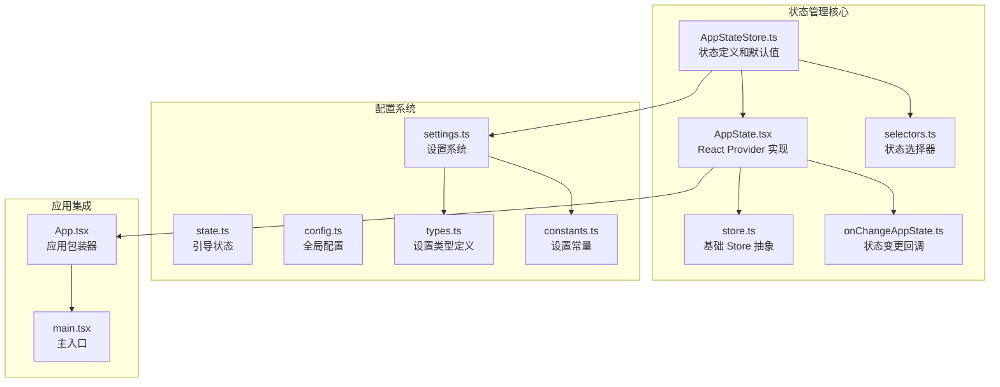
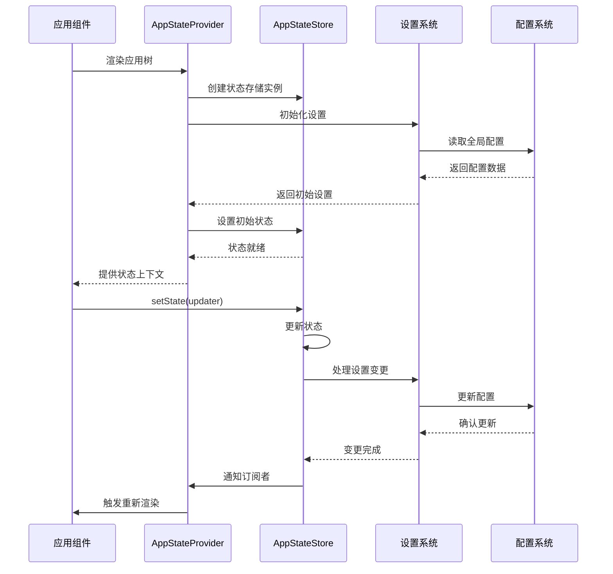
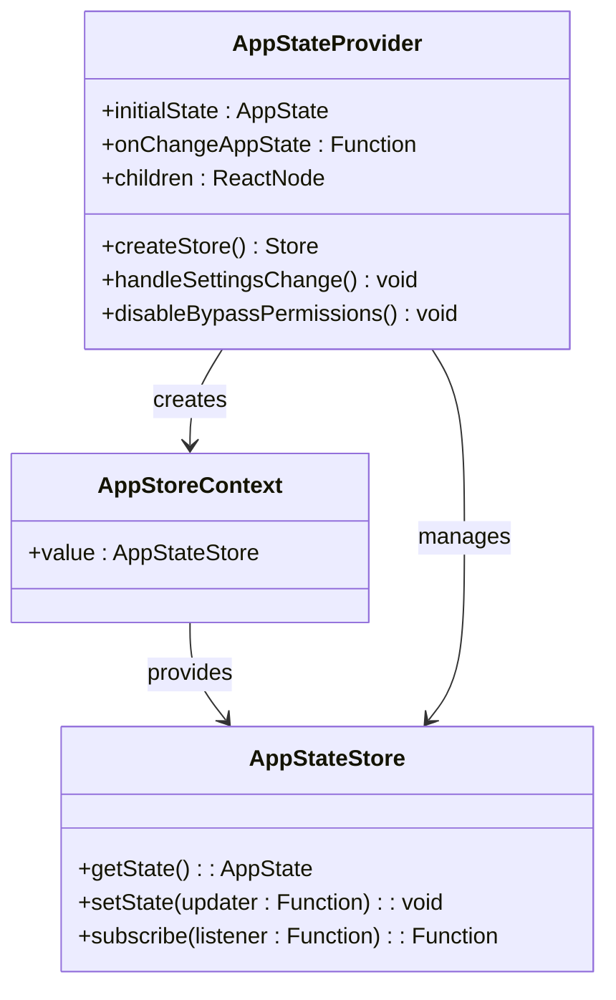
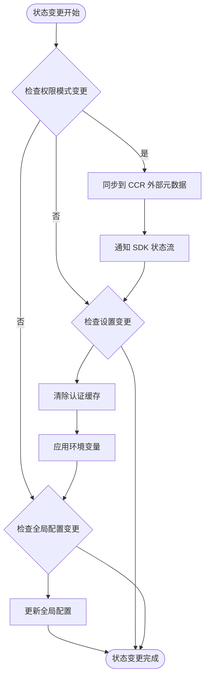

# 状态管理系统

<cite>
**本文档引用的文件**
- [AppStateStore.ts](file://src/state/AppStateStore.ts)
- [AppState.tsx](file://src/state/AppState.tsx)
- [store.ts](file://src/state/store.ts)
- [selectors.ts](file://src/state/selectors.ts)
- [onChangeAppState.ts](file://src/state/onChangeAppState.ts)
- [state.ts](file://src/bootstrap/state.ts)
- [settings.ts](file://src/utils/settings/settings.ts)
- [config.ts](file://src/utils/config.ts)
- [types.ts](file://src/utils/settings/types.ts)
- [constants.ts](file://src/utils/settings/constants.ts)
- [App.tsx](file://src/components/App.tsx)
- [main.tsx](file://src/main.tsx)
</cite>

## 目录
1. [简介](#简介)
2. [项目结构](#项目结构)
3. [核心组件](#核心组件)
4. [架构概览](#架构概览)
5. [详细组件分析](#详细组件分析)
6. [依赖关系分析](#依赖关系分析)
7. [性能考虑](#性能考虑)
8. [故障排除指南](#故障排除指南)
9. [结论](#结论)

## 简介

Claude Code 状态管理系统是一个基于 React Context 和自定义 Store 模式的应用状态管理解决方案。该系统提供了类型安全的状态存储、高效的订阅机制、状态选择器、以及与外部系统的集成能力。

该状态管理系统的核心特点包括：
- 基于 React Context 的状态提供者模式
- 类型安全的 AppState 接口设计
- 高效的状态订阅和更新机制
- 状态选择器和派生计算支持
- 与设置系统和配置系统的深度集成
- 外部元数据同步和状态持久化

## 项目结构

状态管理系统主要分布在以下文件中：

**图表来源**
- [AppStateStore.ts:1-570](file://src/state/AppStateStore.ts#L1-L570)
- [AppState.tsx:1-200](file://src/state/AppState.tsx#L1-L200)
- [store.ts:1-35](file://src/state/store.ts#L1-L35)

**章节来源**
- [AppStateStore.ts:1-570](file://src/state/AppStateStore.ts#L1-L570)
- [AppState.tsx:1-200](file://src/state/AppState.tsx#L1-L200)
- [store.ts:1-35](file://src/state/store.ts#L1-L35)

## 核心组件

### AppStateStore - 状态定义

AppStateStore 是整个状态管理系统的核心，定义了应用的所有状态结构和类型。

**关键特性：**
- 完整的类型定义覆盖所有应用状态
- 默认状态初始化函数
- 复杂嵌套状态结构（任务、插件、MCP 连接等）
- 性能优化的状态设计（使用 DeepImmutable）

**状态分类：**
- 基础状态：设置、模型、状态行文本等
- 任务状态：任务管理和执行状态
- 插件状态：插件加载和管理
- MCP 状态：MCP 服务器连接和工具
- 用户界面状态：通知、提示、权限等

**章节来源**
- [AppStateStore.ts:89-452](file://src/state/AppStateStore.ts#L89-L452)
- [AppStateStore.ts:456-570](file://src/state/AppStateStore.ts#L456-L570)

### AppStateProvider - React Context 提供者

AppStateProvider 实现了 React Context 模式，为整个应用树提供状态访问能力。

**核心功能：**
- 创建和管理 AppStateStore 实例
- 实现状态订阅机制
- 处理状态变更回调
- 支持安全的状态访问钩子

**章节来源**
- [AppState.tsx:27-110](file://src/state/AppState.tsx#L27-L110)
- [AppState.tsx:117-179](file://src/state/AppState.tsx#L117-L179)

### Store 抽象层

Store 抽象层提供了基础的状态管理能力，包括状态读取、更新和订阅。

**核心接口：**
- `getState()`: 获取当前状态
- `setState(updater)`: 更新状态
- `subscribe(listener)`: 订阅状态变化

**章节来源**
- [store.ts:4-8](file://src/state/store.ts#L4-L8)
- [store.ts:10-34](file://src/state/store.ts#L10-L34)

## 架构概览

**图表来源**
- [AppState.tsx:37-110](file://src/state/AppState.tsx#L37-L110)
- [AppStateStore.ts:456-570](file://src/state/AppStateStore.ts#L456-L570)

## 详细组件分析

### 状态提供者实现

AppStateProvider 使用 React Context 模式实现了状态的全局访问。它确保了状态的一致性和可访问性。

**图表来源**
- [AppState.tsx:27-110](file://src/state/AppState.tsx#L27-L110)
- [AppState.tsx:117-179](file://src/state/AppState.tsx#L117-L179)

**章节来源**
- [AppState.tsx:37-110](file://src/state/AppState.tsx#L37-L110)
- [AppState.tsx:117-179](file://src/state/AppState.tsx#L117-L179)

### 状态选择器系统

状态选择器系统提供了高效的状态派生和计算能力，支持复杂的查询逻辑。

**选择器类型：**
- 输入路由选择器：确定用户输入应该路由到哪个代理
- 团队成员查看选择器：获取当前查看的团队成员任务

**章节来源**
- [selectors.ts:18-40](file://src/state/selectors.ts#L18-L40)
- [selectors.ts:59-76](file://src/state/selectors.ts#L59-L76)

### 状态变更回调机制

onChangeAppState 函数处理状态变更时的副作用和外部系统同步。

**主要功能：**
- 权限模式同步到外部系统
- 设置变更处理
- 全局配置持久化
- 模型设置同步

**章节来源**
- [onChangeAppState.ts:43-92](file://src/state/onChangeAppState.ts#L43-L92)
- [onChangeAppState.ts:94-171](file://src/state/onChangeAppState.ts#L94-L171)

### 设置系统集成

状态管理系统与设置系统深度集成，确保状态变更能够正确反映到设置和配置中。

**图表来源**
- [onChangeAppState.ts:43-171](file://src/state/onChangeAppState.ts#L43-L171)

**章节来源**
- [onChangeAppState.ts:24-41](file://src/state/onChangeAppState.ts#L24-L41)
- [onChangeAppState.ts:154-171](file://src/state/onChangeAppState.ts#L154-L171)

## 依赖关系分析

```mermaid
graph LR
subgraph "状态管理层"
AppStateStore[AppStateStore]
AppStateProvider[AppStateProvider]
Store[Store抽象]
Selectors[Selectors]
OnChange[onChangeAppState]
end
subgraph "配置层"
Bootstrap[Bootstrap State]
Settings[Settings System]
Config[Global Config]
Types[Settings Types]
Constants[Settings Constants]
end
subgraph "应用层"
App[App Component]
Main[Main Entry]
end
AppStateStore --> Bootstrap
AppStateStore --> Settings
AppStateStore --> Config
AppStateProvider --> AppStateStore
AppStateProvider --> Settings
AppStateProvider --> OnChange
Selectors --> AppStateStore
OnChange --> Settings
OnChange --> Config
App --> AppStateProvider
Main --> AppStateStore
Main --> Settings
```

**图表来源**
- [AppStateStore.ts:1-39](file://src/state/AppStateStore.ts#L1-L39)
- [AppState.tsx:1-26](file://src/state/AppState.tsx#L1-L26)
- [settings.ts:1-53](file://src/utils/settings/settings.ts#L1-L53)

**章节来源**
- [AppStateStore.ts:1-39](file://src/state/AppStateStore.ts#L1-L39)
- [AppState.tsx:1-26](file://src/state/AppState.tsx#L1-L26)
- [settings.ts:1-53](file://src/utils/settings/settings.ts#L1-L53)

## 性能考虑

### 状态订阅优化

状态管理系统采用了多种优化策略来确保高性能：

1. **选择器优化**：使用 `Object.is` 进行状态比较，避免不必要的重渲染
2. **订阅机制**：基于 `useSyncExternalStore` 的高效订阅实现
3. **状态分片**：通过选择器只订阅需要的状态片段
4. **记忆化**：在 React 组件中使用记忆化避免重复计算

### 内存管理

- 使用 `DeepImmutable` 类型确保状态的不可变性
- 合理的垃圾回收策略
- 避免状态中的循环引用

### 并发处理

- 支持异步状态更新
- 防止竞态条件的状态变更
- 事务性的状态更新操作

## 故障排除指南

### 常见问题诊断

**问题：状态不更新或更新后不触发重渲染**

可能原因：
1. 选择器返回了新对象而非现有引用
2. 状态订阅未正确设置
3. React 组件未正确使用状态钩子

**解决方案：**
- 确保选择器返回现有对象引用
- 检查 `useAppState` 的使用方式
- 验证组件是否在正确的上下文中

**问题：权限模式不同步**

可能原因：
1. 权限模式变更未正确同步到外部系统
2. CCR 外部元数据未更新
3. SDK 状态流未接收通知

**解决方案：**
- 检查 `onChangeAppState` 中的权限模式同步逻辑
- 验证 `notifySessionMetadataChanged` 调用
- 确认 SDK 通知机制正常工作

**章节来源**
- [AppState.tsx:126-141](file://src/state/AppState.tsx#L126-L141)
- [onChangeAppState.ts:65-92](file://src/state/onChangeAppState.ts#L65-L92)

## 结论

Claude Code 的状态管理系统展现了现代前端应用状态管理的最佳实践。通过精心设计的架构，该系统实现了：

1. **类型安全**：完整的 TypeScript 类型定义确保编译时错误检测
2. **性能优化**：高效的订阅机制和状态分片减少不必要的重渲染
3. **可扩展性**：模块化的架构支持功能的渐进式添加
4. **可靠性**：完善的错误处理和故障排除机制
5. **集成能力**：与设置系统和配置系统的深度集成

该系统为复杂的应用状态管理提供了坚实的基础，支持从简单到复杂的各种应用场景。通过遵循本文档中的最佳实践，开发者可以有效地使用和扩展这个状态管理系统。