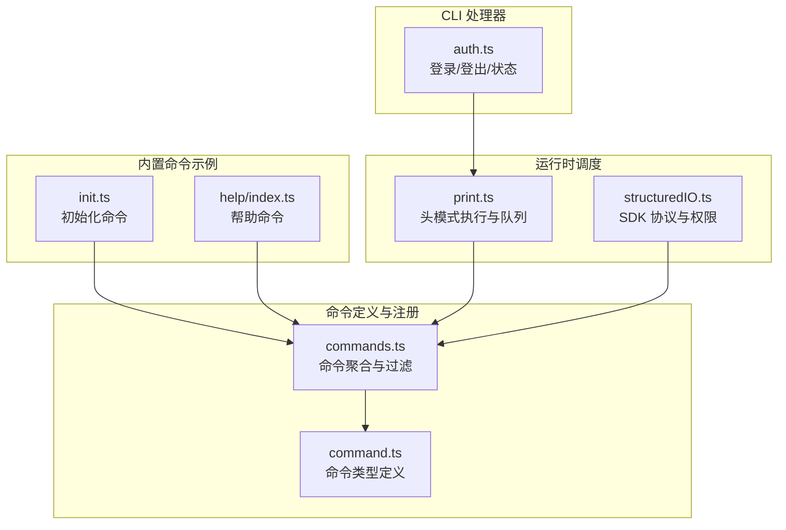
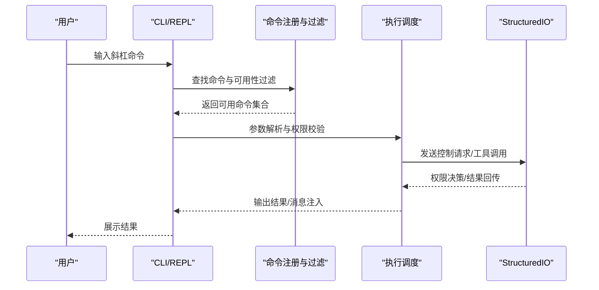
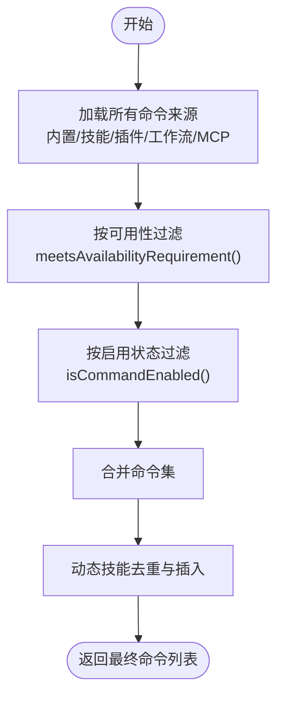
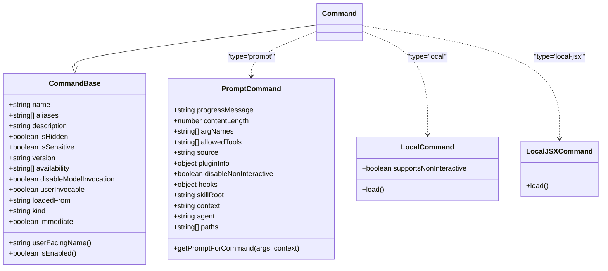
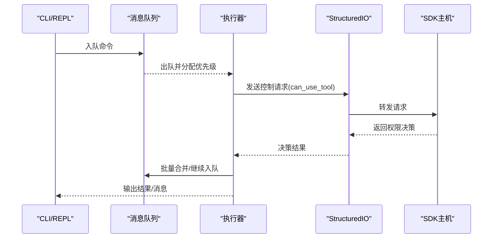
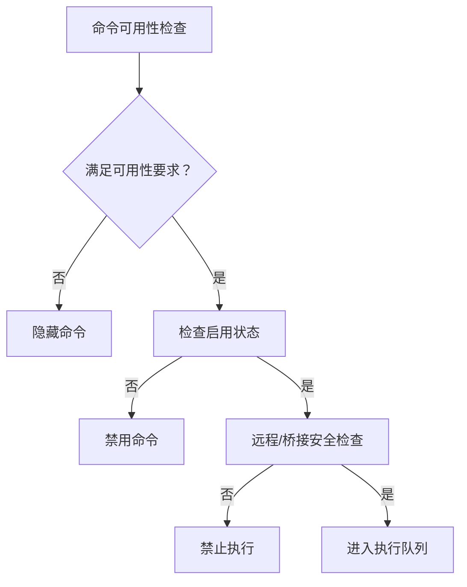
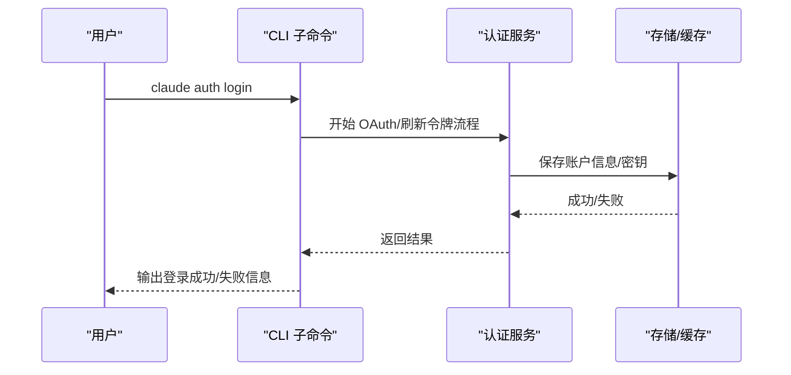
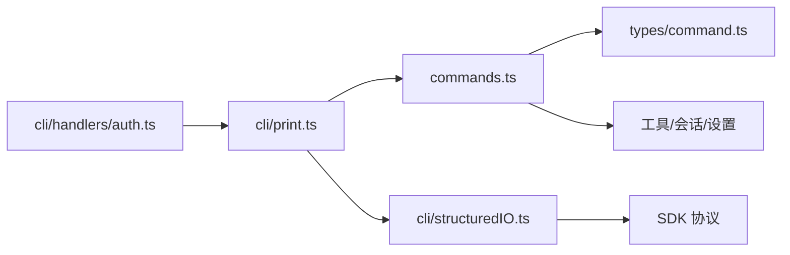

# 命令系统实现

<cite>
**本文档引用的文件**
- [commands.ts](file://src/commands.ts)
- [command.ts](file://src/types/command.ts)
- [init.ts](file://src/commands/init.ts)
- [index.ts](file://src/commands/help/index.ts)
- [print.ts](file://src/cli/print.ts)
- [structuredIO.ts](file://src/cli/structuredIO.ts)
- [auth.ts](file://src/cli/handlers/auth.ts)
</cite>

## 目录
1. [简介](#简介)
2. [项目结构](#项目结构)
3. [核心组件](#核心组件)
4. [架构总览](#架构总览)
5. [详细组件分析](#详细组件分析)
6. [依赖关系分析](#依赖关系分析)
7. [性能考量](#性能考量)
8. [故障排查指南](#故障排查指南)
9. [结论](#结论)
10. [附录](#附录)

## 简介
本文件面向 Claude Code 的“斜杠命令”系统，系统性梳理其架构设计与实现细节，覆盖命令注册机制、路由分发、参数解析、执行流程（队列管理、优先级调度、并发控制）、功能门控（权限检查、环境验证、条件执行）、CLI 命令处理器（参数解析、错误处理、输出格式化），并提供自定义命令开发指南与扩展性维护建议。

## 项目结构
命令系统由“命令定义与注册”“类型系统”“运行时调度与执行”“CLI 处理器”四大部分组成：
- 命令注册与聚合：集中导出与过滤可用命令，支持动态技能、插件、工作流等来源。
- 类型系统：统一描述命令形态（prompt、local、local-jsx）与元数据。
- 运行时调度：在 REPL/CLI 中对命令进行查找、参数解析、权限校验、入队与执行。
- CLI 处理器：负责参数解析、错误处理、输出格式化与桥接通信。

**图表来源**
- [commands.ts:256-346](file://src/commands.ts#L256-L346)
- [command.ts:16-217](file://src/types/command.ts#L16-L217)
- [init.ts:226-257](file://src/commands/init.ts#L226-L257)
- [index.ts:3-11](file://src/commands/help/index.ts#L3-L11)
- [print.ts:455-533](file://src/cli/print.ts#L455-L533)
- [structuredIO.ts:135-170](file://src/cli/structuredIO.ts#L135-L170)
- [auth.ts:112-230](file://src/cli/handlers/auth.ts#L112-L230)

**章节来源**
- [commands.ts:256-346](file://src/commands.ts#L256-L346)
- [command.ts:16-217](file://src/types/command.ts#L16-L217)

## 核心组件
- 命令类型与元数据：通过统一的 Command 接口描述命令形态、可用性、可见性、来源与行为特性。
- 命令聚合与过滤：按可用性（provider/订阅者要求）、启用状态、动态技能与插件来源生成最终可用命令集。
- 运行时执行：在 REPL/CLI 中完成命令查找、参数解析、权限校验、入队与执行；支持批量合并、优先级与并发控制。
- CLI 处理器：提供登录、登出、状态查询等子命令，统一错误处理与输出格式。

**章节来源**
- [command.ts:175-217](file://src/types/command.ts#L175-L217)
- [commands.ts:417-443](file://src/commands.ts#L417-L443)
- [commands.ts:476-517](file://src/commands.ts#L476-L517)
- [print.ts:455-533](file://src/cli/print.ts#L455-L533)
- [auth.ts:112-230](file://src/cli/handlers/auth.ts#L112-L230)

## 架构总览
命令系统采用“声明式定义 + 动态聚合 + 运行时调度”的三层架构：
- 定义层：每个命令以模块形式导出，声明类型、名称、描述、可用性与执行逻辑。
- 聚合层：统一加载内置命令、动态技能、插件技能、工作流命令，并按可用性与启用状态过滤。
- 执行层：在 REPL/CLI 中进行命令查找、参数解析、权限校验、入队与执行，支持批量合并与并发控制。

**图表来源**
- [commands.ts:476-517](file://src/commands.ts#L476-L517)
- [print.ts:455-533](file://src/cli/print.ts#L455-L533)
- [structuredIO.ts:469-531](file://src/cli/structuredIO.ts#L469-L531)

## 详细组件分析

### 命令注册与聚合
- 统一入口：集中导出所有命令模块，按需惰性加载与条件导入，避免启动时的昂贵开销。
- 动态来源：技能目录、插件技能、工作流命令、MCP 技能等动态来源通过异步聚合，最终与内置命令合并。
- 可用性过滤：根据 provider/订阅者要求（如 claude.ai 订阅者或 Console 直连用户）进行静态过滤。
- 启用状态：支持 per-command 的 isEnabled 钩子，结合 feature flags 与环境变量动态启用/禁用。
- 动态技能去重：动态技能与内置命令去重，插入到合适位置，保证顺序与唯一性。

**图表来源**
- [commands.ts:449-469](file://src/commands.ts#L449-L469)
- [commands.ts:476-517](file://src/commands.ts#L476-L517)
- [commands.ts:417-443](file://src/commands.ts#L417-L443)

**章节来源**
- [commands.ts:256-346](file://src/commands.ts#L256-L346)
- [commands.ts:417-443](file://src/commands.ts#L417-L443)
- [commands.ts:449-469](file://src/commands.ts#L449-L469)
- [commands.ts:476-517](file://src/commands.ts#L476-L517)

### 命令类型与元数据
- CommandBase：命令基础元数据，包括名称、别名、描述、版本、来源、是否隐藏、是否敏感等。
- Command：联合类型，支持三种形态：
  - prompt：提示词型命令，可被模型调用，支持上下文 fork、路径匹配、钩子设置等。
  - local：本地命令，延迟加载，支持非交互与交互两种调用方式。
  - local-jsx：本地 JSX 命令，延迟加载，渲染 UI。
- 辅助函数：getCommandName、isCommandEnabled 提供统一的名称解析与启用判断。

**图表来源**
- [command.ts:175-217](file://src/types/command.ts#L175-L217)
- [command.ts:25-57](file://src/types/command.ts#L25-L57)
- [command.ts:74-78](file://src/types/command.ts#L74-L78)
- [command.ts:144-152](file://src/types/command.ts#L144-L152)

**章节来源**
- [command.ts:16-217](file://src/types/command.ts#L16-L217)

### 命令执行流程（队列、优先级、并发）
- 头模式执行：runHeadless 在无 UI 的场景下驱动命令执行，负责初始化、会话恢复、沙箱、权限与输出格式化。
- 批量合并：canBatchWith 判断两个命令是否可合并到同一轮 ask() 调用，基于模式、工作负载标签与 meta 标记。
- 队列管理：通过消息队列管理器进行入队、出队、优先级获取与订阅通知，支持并发与去重。
- 权限与桥接：StructuredIO 封装 SDK 控制协议，处理 can_use_tool 请求、hook 回调、MCP 消息转发与沙箱网络访问请求。
- 输出格式化：支持标准输出与流式 JSON 输出，NDJSON 安全序列化，错误处理与优雅退出。

**图表来源**
- [print.ts:455-533](file://src/cli/print.ts#L455-L533)
- [print.ts:443-453](file://src/cli/print.ts#L443-L453)
- [structuredIO.ts:469-531](file://src/cli/structuredIO.ts#L469-L531)
- [structuredIO.ts:533-659](file://src/cli/structuredIO.ts#L533-L659)

**章节来源**
- [print.ts:455-533](file://src/cli/print.ts#L455-L533)
- [print.ts:443-453](file://src/cli/print.ts#L443-L453)
- [structuredIO.ts:469-531](file://src/cli/structuredIO.ts#L469-L531)
- [structuredIO.ts:533-659](file://src/cli/structuredIO.ts#L533-L659)

### 功能门控机制（权限、环境、条件）
- 可用性门控：meetsAvailabilityRequirement 根据 provider/订阅者要求（claude.ai 或 Console 直连）决定命令是否展示。
- 启用门控：isCommandEnabled 支持 per-command 的 isEnabled 钩子，结合 feature flags 与环境变量动态启用。
- 远程安全门控：REMOTE_SAFE_COMMANDS 与 BRIDGE_SAFE_COMMANDS 明确远程/桥接环境下允许执行的命令集合。
- 权限门控：StructuredIO 的 createCanUseTool 与 executePermissionRequestHooks 并行评估 hook 与 SDK 主机决策，先到先得。

**图表来源**
- [commands.ts:417-443](file://src/commands.ts#L417-L443)
- [commands.ts:476-517](file://src/commands.ts#L476-L517)
- [commands.ts:619-686](file://src/commands.ts#L619-L686)
- [structuredIO.ts:533-659](file://src/cli/structuredIO.ts#L533-L659)

**章节来源**
- [commands.ts:417-443](file://src/commands.ts#L417-L443)
- [commands.ts:619-686](file://src/commands.ts#L619-L686)
- [structuredIO.ts:533-659](file://src/cli/structuredIO.ts#L533-L659)

### CLI 命令处理器（参数解析、错误处理、输出格式化）
- 登录：支持 claude.ai 与 Console 两种登录方式，支持 SSO 与刷新令牌快速登录，失败时输出 SSL 相关提示。
- 状态：支持文本与 JSON 两种输出格式，显示登录状态、认证来源与订阅信息。
- 错误处理：统一使用 errorMessage 与日志工具，失败时输出清晰错误信息并优雅退出。
- 输出格式化：支持 JSON 输出与 NDJSON 流式输出，确保 SDK 客户端解析稳定。

**图表来源**
- [auth.ts:112-230](file://src/cli/handlers/auth.ts#L112-L230)
- [auth.ts:232-319](file://src/cli/handlers/auth.ts#L232-L319)
- [auth.ts:321-330](file://src/cli/handlers/auth.ts#L321-L330)

**章节来源**
- [auth.ts:112-230](file://src/cli/handlers/auth.ts#L112-L230)
- [auth.ts:232-319](file://src/cli/handlers/auth.ts#L232-L319)
- [auth.ts:321-330](file://src/cli/handlers/auth.ts#L321-L330)

### 自定义命令开发指南
- 命令接口实现
  - prompt 命令：实现 getPromptForCommand(args, context)，返回内容块数组或纯文本，设置 progressMessage 与 contentLength。
  - local 命令：提供 supportsNonInteractive 与 load()，延迟加载实现 call(args, context)。
  - local-jsx 命令：提供 load()，延迟加载实现 call(onDone, context, args)。
- 参数验证与用户交互
  - 使用 ToolUseContext 获取会话状态与工具能力，必要时通过 StructuredIO 注入用户输入或弹窗。
  - 对敏感参数设置 isSensitive，避免历史记录泄露。
- 命令元数据
  - 设置 availability、isEnabled、isHidden、version、kind、loadedFrom 等元数据，明确命令来源与可见性。
  - 描述与使用场景：description 与 whenToUse 用于帮助与自动补全展示。
- 动态技能与插件
  - 将命令放入 /skills/ 或 /commands/ 下，系统会自动发现并注册；或通过插件/工作流机制动态注入。
- 输出与消息
  - 使用 LocalCommandResult 的 text/compact/skip 形态，或通过 onDone 控制消息显示与后续输入。

**章节来源**
- [command.ts:25-57](file://src/types/command.ts#L25-L57)
- [command.ts:74-78](file://src/types/command.ts#L74-L78)
- [command.ts:144-152](file://src/types/command.ts#L144-L152)
- [command.ts:175-217](file://src/types/command.ts#L175-L217)

## 依赖关系分析
- 命令注册依赖类型系统与工具池、会话状态、设置源等基础设施。
- 运行时执行依赖消息队列、权限系统、沙箱与 SDK 协议适配。
- CLI 处理器依赖认证服务、设置与日志工具，统一错误处理与输出格式。

**图表来源**
- [commands.ts:256-346](file://src/commands.ts#L256-L346)
- [command.ts:16-217](file://src/types/command.ts#L16-L217)
- [print.ts:455-533](file://src/cli/print.ts#L455-L533)
- [structuredIO.ts:135-170](file://src/cli/structuredIO.ts#L135-L170)
- [auth.ts:112-230](file://src/cli/handlers/auth.ts#L112-L230)

**章节来源**
- [commands.ts:256-346](file://src/commands.ts#L256-L346)
- [print.ts:455-533](file://src/cli/print.ts#L455-L533)
- [structuredIO.ts:135-170](file://src/cli/structuredIO.ts#L135-L170)
- [auth.ts:112-230](file://src/cli/handlers/auth.ts#L112-L230)

## 性能考量
- 惰性加载与缓存：命令聚合与技能加载使用 memoize 缓存，减少重复 I/O 与动态导入成本。
- 批量合并：canBatchWith 降低 API 调用次数，提升吞吐。
- 并发控制：StructuredIO 的权限请求与 hook 评估并行，先到先决，避免 UI 阻塞。
- 内存管理：头模式下定期触发垃圾回收，限制重复消息 UUID 集合大小，防止内存膨胀。

[本节为通用指导，无需特定文件来源]

## 故障排查指南
- 命令不可见
  - 检查 availability 是否与当前认证来源匹配；确认 isEnabled 钩子与 feature flags。
  - 参考：[commands.ts:417-443](file://src/commands.ts#L417-L443)、[commands.ts:476-517](file://src/commands.ts#L476-L517)
- 权限拒绝
  - 检查工具权限策略与 hook 决策；确认 SDK 主机响应与取消逻辑。
  - 参考：[structuredIO.ts:533-659](file://src/cli/structuredIO.ts#L533-L659)
- CLI 登录失败
  - 检查网络与 SSL 配置，查看错误提示与 SSL 相关建议。
  - 参考：[auth.ts:112-230](file://src/cli/handlers/auth.ts#L112-L230)
- 输出异常
  - 确认输出格式（JSON/NDJSON）与 verbose 标志组合正确；检查 stdout guard 与流式解析。
  - 参考：[print.ts:587-596](file://src/cli/print.ts#L587-L596)、[structuredIO.ts:465-467](file://src/cli/structuredIO.ts#L465-L467)

**章节来源**
- [commands.ts:417-443](file://src/commands.ts#L417-L443)
- [commands.ts:476-517](file://src/commands.ts#L476-L517)
- [structuredIO.ts:533-659](file://src/cli/structuredIO.ts#L533-L659)
- [auth.ts:112-230](file://src/cli/handlers/auth.ts#L112-L230)
- [print.ts:587-596](file://src/cli/print.ts#L587-L596)
- [structuredIO.ts:465-467](file://src/cli/structuredIO.ts#L465-L467)

## 结论
该命令系统通过声明式定义、动态聚合与运行时调度实现了高扩展性与强健性。命令类型统一、可用性与启用门控清晰、执行流程支持批量合并与并发控制，CLI 处理器提供一致的参数解析与错误处理体验。开发者可基于现有接口快速扩展自定义命令，并通过动态技能与插件机制实现生态化扩展。

[本节为总结，无需特定文件来源]

## 附录
- 内置命令示例：init、help 等命令展示了 prompt 与 local-jsx 的典型实现方式。
- 远程/桥接安全：REMOTE_SAFE_COMMANDS 与 BRIDGE_SAFE_COMMANDS 明确了跨环境执行边界。
- 输出格式：支持标准输出与流式 JSON，便于 SDK 客户端集成。

**章节来源**
- [init.ts:226-257](file://src/commands/init.ts#L226-L257)
- [index.ts:3-11](file://src/commands/help/index.ts#L3-L11)
- [commands.ts:619-686](file://src/commands.ts#L619-L686)
- [commands.ts:672-676](file://src/commands.ts#L672-L676)
- [print.ts:587-596](file://src/cli/print.ts#L587-L596)