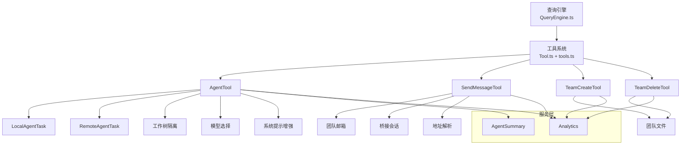
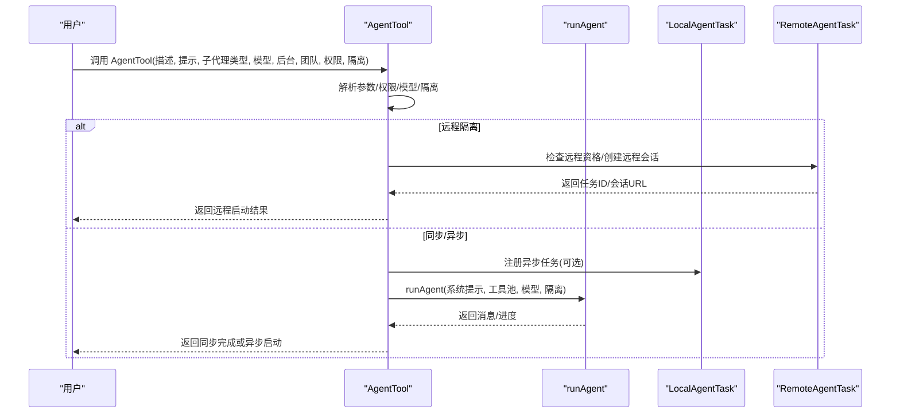
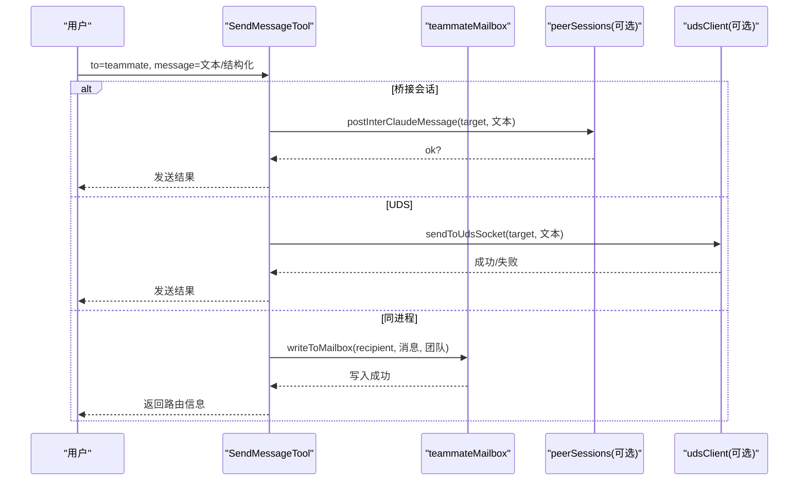
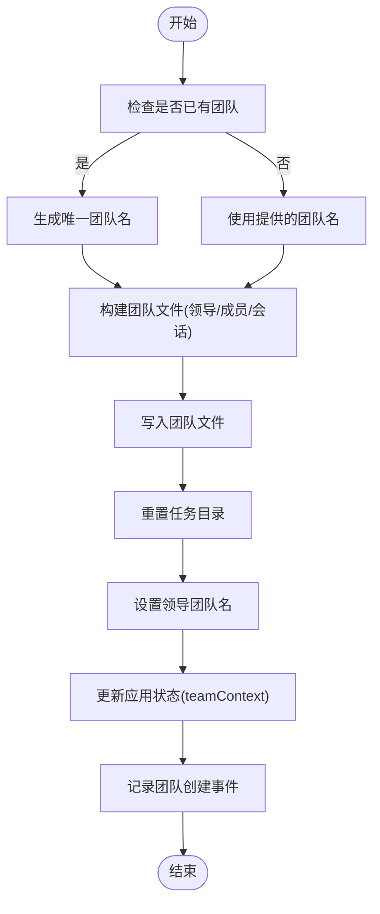
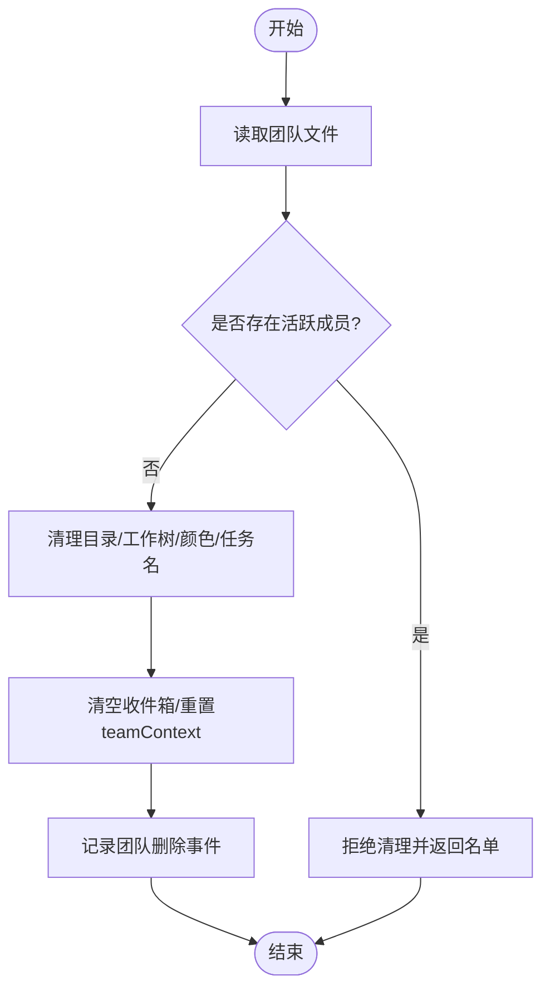
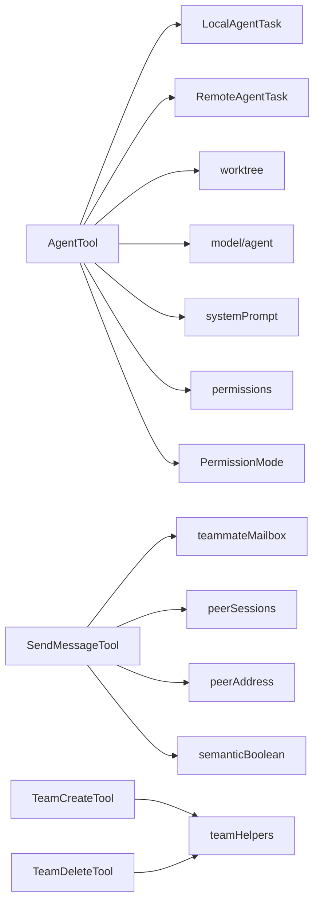

# 代理协调工具

<cite>
**本文引用的文件**
- [README.md](file://README.md)
- [AgentTool.tsx](file://src/tools/AgentTool/AgentTool.tsx)
- [SendMessageTool.ts](file://src/tools/SendMessageTool/SendMessageTool.ts)
- [TeamCreateTool.ts](file://src/tools/TeamCreateTool/TeamCreateTool.ts)
- [TeamDeleteTool.ts](file://src/tools/TeamDeleteTool/TeamDeleteTool.ts)
- [runAgent.ts](file://src/tools/AgentTool/runAgent.ts)
- [forkSubagent.ts](file://src/tools/AgentTool/forkSubagent.ts)
- [agentToolUtils.ts](file://src/tools/AgentTool/agentToolUtils.ts)
- [spawnMultiAgent.ts](file://src/tools/shared/spawnMultiAgent.ts)
- [teammateMailbox.ts](file://src/utils/teammateMailbox.ts)
- [teamHelpers.ts](file://src/utils/swarm/teamHelpers.ts)
- [swarm/constants.ts](file://src/utils/swarm/constants.ts)
- [agentSwarmsEnabled.ts](file://src/utils/agentSwarmsEnabled.ts)
- [teammate.ts](file://src/utils/teammate.ts)
- [tasks/LocalAgentTask.ts](file://src/tasks/LocalAgentTask/LocalAgentTask.ts)
- [tasks/RemoteAgentTask.ts](file://src/tasks/RemoteAgentTask/RemoteAgentTask.ts)
- [bridge/peerSessions.ts](file://src/bridge/peerSessions.ts)
- [utils/udsClient.ts](file://src/utils/udsClient.ts)
- [utils/peerAddress.ts](file://src/utils/peerAddress.ts)
- [utils/semanticBoolean.ts](file://src/utils/semanticBoolean.ts)
- [utils/format.ts](file://src/utils/format.ts)
- [utils/gracefulShutdown.ts](file://src/utils/gracefulShutdown.ts)
- [utils/agentId.ts](file://src/utils/agentId.ts)
- [utils/model/agent.ts](file://src/utils/model/agent.ts)
- [utils/systemPrompt.ts](file://src/utils/systemPrompt.ts)
- [utils/uuid.ts](file://src/utils/uuid.ts)
- [utils/worktree.ts](file://src/utils/worktree.ts)
- [utils/cwd.ts](file://src/utils/cwd.ts)
- [utils/errors.ts](file://src/utils/errors.ts)
- [utils/debug.ts](file://src/utils/debug.ts)
- [utils/lazySchema.ts](file://src/utils/lazySchema.ts)
- [utils/messages.ts](file://src/utils/messages.ts)
- [utils/slowOperations.ts](file://src/utils/slowOperations.ts)
- [utils/permissions/permissions.ts](file://src/utils/permissions/permissions.ts)
- [utils/permissions/PermissionMode.ts](file://src/utils/permissions/PermissionMode.ts)
- [services/analytics/index.ts](file://src/services/analytics/index.ts)
- [services/AgentSummary/agentSummary.ts](file://src/services/AgentSummary/agentSummary.ts)
- [constants/prompts.ts](file://src/constants/prompts.ts)
- [bootstrap/state.ts](file://src/bootstrap/state.ts)
- [coordinator/coordinatorMode.ts](file://src/coordinator/coordinatorMode.ts)
- [tools.ts](file://src/tools.ts)
</cite>

## 目录
1. [简介](#简介)
2. [项目结构](#项目结构)
3. [核心组件](#核心组件)
4. [架构总览](#架构总览)
5. [详细组件分析](#详细组件分析)
6. [依赖关系分析](#依赖关系分析)
7. [性能考量](#性能考量)
8. [故障排除指南](#故障排除指南)
9. [结论](#结论)
10. [附录](#附录)

## 简介
本文件系统性阐述 Claude Code 的代理协调工具体系，重点覆盖以下能力：
- 代理工具（AgentTool）：子代理创建、分叉（fork）与隔离运行、后台异步执行、工作树隔离、远程执行、权限与模型选择、进度与摘要。
- 消息发送工具（SendMessageTool）：团队通信协议（消息路由、广播、计划审批、关机请求/响应）、跨会话桥接与本地套接字通信、UI 渲染与权限校验。
- 团队创建工具（TeamCreateTool）与团队删除工具（TeamDeleteTool）：团队生命周期管理（创建、清理、成员状态检查、任务目录重置）。

文档同时提供多代理协作使用示例、通信协议与状态管理说明、最佳实践与故障排除建议，并解释代理权限管理与安全控制机制。

## 项目结构
本仓库采用“工具层 + 服务层 + 任务层 + 工具共享”的分层组织方式。代理协调相关的核心代码位于 tools/ 下的 AgentTool、SendMessageTool、TeamCreateTool、TeamDeleteTool，以及共享的 spawnMultiAgent、teammateMailbox、teamHelpers 等工具与实用模块。

```mermaid
graph TB
subgraph "工具层"
AT["AgentTool.tsx"]
SMT["SendMessageTool.ts"]
TCT["TeamCreateTool.ts"]
TDT["TeamDeleteTool.ts"]
end
subgraph "共享与工具"
SMA["spawnMultiAgent.ts"]
TMB["teammateMailbox.ts"]
TH["teamHelpers.ts"]
SC["swarm/constants.ts"]
end
subgraph "任务与桥接"
LAT["LocalAgentTask.ts"]
RAT["RemoteAgentTask.ts"]
PS["bridge/peerSessions.ts"]
end
subgraph "通用工具与权限"
UPM["utils/peerAddress.ts"]
USB["utils/semanticBoolean.ts"]
UFM["utils/format.ts"]
UGS["utils/gracefulShutdown.ts"]
UAI["utils/agentId.ts"]
UMD["utils/model/agent.ts"]
USP["utils/systemPrompt.ts"]
UUU["utils/uuid.ts"]
UWT["utils/worktree.ts"]
UWD["utils/cwd.ts"]
UER["utils/errors.ts"]
UDE["utils/debug.ts"]
ULZ["utils/lazySchema.ts"]
UMS["utils/messages.ts"]
USO["utils/slowOperations.ts"]
UPP["utils/permissions/permissions.ts"]
UPMo["utils/permissions/PermissionMode.ts"]
end
AT --> SMA
AT --> TMB
AT --> LAT
AT --> RAT
AT --> UWT
AT --> UMD
AT --> USP
AT --> UUU
AT --> UAI
AT --> UPMo
SMT --> TMB
SMT --> TH
SMT --> PS
SMT --> UPM
SMT --> USB
SMT --> UGS
TCT --> TH
TCT --> SC
TDT --> TH
TDT --> SC
```

图表来源
- [AgentTool.tsx:196-800](file://src/tools/AgentTool/AgentTool.tsx#L196-L800)
- [SendMessageTool.ts:520-918](file://src/tools/SendMessageTool/SendMessageTool.ts#L520-L918)
- [TeamCreateTool.ts:74-241](file://src/tools/TeamCreateTool/TeamCreateTool.ts#L74-L241)
- [TeamDeleteTool.ts:32-140](file://src/tools/TeamDeleteTool/TeamDeleteTool.ts#L32-L140)
- [spawnMultiAgent.ts](file://src/tools/shared/spawnMultiAgent.ts)
- [teammateMailbox.ts](file://src/utils/teammateMailbox.ts)
- [teamHelpers.ts](file://src/utils/swarm/teamHelpers.ts)
- [swarm/constants.ts](file://src/utils/swarm/constants.ts)
- [LocalAgentTask.ts](file://src/tasks/LocalAgentTask/LocalAgentTask.ts)
- [RemoteAgentTask.ts](file://src/tasks/RemoteAgentTask/RemoteAgentTask.ts)
- [bridge/peerSessions.ts](file://src/bridge/peerSessions.ts)
- [utils/peerAddress.ts](file://src/utils/peerAddress.ts)
- [utils/semanticBoolean.ts](file://src/utils/semanticBoolean.ts)
- [utils/gracefulShutdown.ts](file://src/utils/gracefulShutdown.ts)
- [utils/agentId.ts](file://src/utils/agentId.ts)
- [utils/model/agent.ts](file://src/utils/model/agent.ts)
- [utils/systemPrompt.ts](file://src/utils/systemPrompt.ts)
- [utils/uuid.ts](file://src/utils/uuid.ts)
- [utils/worktree.ts](file://src/utils/worktree.ts)
- [utils/cwd.ts](file://src/utils/cwd.ts)
- [utils/errors.ts](file://src/utils/errors.ts)
- [utils/debug.ts](file://src/utils/debug.ts)
- [utils/lazySchema.ts](file://src/utils/lazySchema.ts)
- [utils/messages.ts](file://src/utils/messages.ts)
- [utils/slowOperations.ts](file://src/utils/slowOperations.ts)
- [utils/permissions/permissions.ts](file://src/utils/permissions/permissions.ts)
- [utils/permissions/PermissionMode.ts](file://src/utils/permissions/PermissionMode.ts)

章节来源
- [README.md: 383-446:383-446](file://README.md#L383-L446)
- [README.md: 500-564:500-564](file://README.md#L500-L564)

## 核心组件
- 代理工具（AgentTool）
  - 功能：创建子代理、支持 fork 分叉、工作树隔离、远程执行、后台异步运行、权限模式继承、系统提示增强、进度与摘要。
  - 关键点：输入/输出模式、MCP 服务器可用性检查、颜色与名称注册、工作树清理、远程会话注册。
- 消息发送工具（SendMessageTool）
  - 功能：点对点消息、广播、计划审批、关机请求/响应；支持跨会话桥接与本地 UDS 套接字；权限校验与 UI 渲染。
  - 关键点：地址解析、结构化消息类型、请求 ID、UI 路由预览。
- 团队创建工具（TeamCreateTool）
  - 功能：创建团队、生成唯一团队名、写入团队文件、重置任务列表、注册会话清理、更新应用状态。
  - 关键点：团队唯一性、任务目录初始化、领导角色确定。
- 团队删除工具（TeamDeleteTool）
  - 功能：清理团队目录、注销会话清理、清空颜色分配、清除领导团队名、清理收件箱。
  - 关键点：活动成员检查、优雅关闭、状态清理。

章节来源
- [AgentTool.tsx: 196-800:196-800](file://src/tools/AgentTool/AgentTool.tsx#L196-L800)
- [SendMessageTool.ts: 520-918:520-918](file://src/tools/SendMessageTool/SendMessageTool.ts#L520-L918)
- [TeamCreateTool.ts: 74-241:74-241](file://src/tools/TeamCreateTool/TeamCreateTool.ts#L74-L241)
- [TeamDeleteTool.ts: 32-140:32-140](file://src/tools/TeamDeleteTool/TeamDeleteTool.ts#L32-L140)

## 架构总览
下图展示代理协调工具在整体系统中的位置与交互关系：工具层负责具体能力实现，服务层提供分析与统计，任务层承载子代理生命周期，桥接层支持远程与跨会话通信。

图表来源
- [README.md: 383-446:383-446](file://README.md#L383-L446)
- [AgentTool.tsx: 196-800:196-800](file://src/tools/AgentTool/AgentTool.tsx#L196-L800)
- [SendMessageTool.ts: 520-918:520-918](file://src/tools/SendMessageTool/SendMessageTool.ts#L520-L918)
- [TeamCreateTool.ts: 74-241:74-241](file://src/tools/TeamCreateTool/TeamCreateTool.ts#L74-L241)
- [TeamDeleteTool.ts: 32-140:32-140](file://src/tools/TeamDeleteTool/TeamDeleteTool.ts#L32-L140)

## 详细组件分析

### 代理工具（AgentTool）
- 子代理创建与管理
  - 输入参数：描述、任务提示、子代理类型、模型覆盖、是否后台运行、团队名、权限模式、隔离模式（工作树/远程）、工作目录。
  - 输出结果：同步完成或异步启动（含 agentId、输出文件路径等）。
  - 多代理场景：当提供 team_name 且 name 时，通过 spawnTeammate 创建同进程/分离进程的队友；否则按 agent 类型选择内置或自定义代理。
- fork 分叉与隔离
  - fork 路径：子进程继承父系统提示与工具集合，构建专用提示消息；可结合工作树隔离进行文件系统隔离。
  - 工作树隔离：自动创建临时 git worktree，任务完成后根据变更情况决定保留或删除。
- 权限与模型
  - 权限模式继承：子代理从父代理继承权限上下文，但可被代理定义覆盖。
  - 模型选择：支持显式覆盖或继承父代理模型；内置代理与外部代理区分处理。
- 进度与摘要
  - 异步任务注册与通知；可启用代理进度摘要；支持输出文件读取以检查进度。
- 远程执行
  - 远程隔离：在受控环境中启动远程任务，注册远程任务并返回会话链接；失败时提供前置条件错误汇总。
- UI 与渲染
  - 统一的工具使用/结果/进度消息渲染接口，便于 REPL/SDK 展示。

图表来源
- [AgentTool.tsx: 239-800:239-800](file://src/tools/AgentTool/AgentTool.tsx#L239-L800)
- [runAgent.ts](file://src/tools/AgentTool/runAgent.ts)
- [LocalAgentTask.ts](file://src/tasks/LocalAgentTask/LocalAgentTask.ts)
- [RemoteAgentTask.ts](file://src/tasks/RemoteAgentTask/RemoteAgentTask.ts)

章节来源
- [AgentTool.tsx: 81-157:81-157](file://src/tools/AgentTool/AgentTool.tsx#L81-L157)
- [AgentTool.tsx: 196-800:196-800](file://src/tools/AgentTool/AgentTool.tsx#L196-L800)
- [forkSubagent.ts](file://src/tools/AgentTool/forkSubagent.ts)
- [agentToolUtils.ts](file://src/tools/AgentTool/agentToolUtils.ts)
- [spawnMultiAgent.ts](file://src/tools/shared/spawnMultiAgent.ts)

### 消息发送工具（SendMessageTool）
- 通信协议与路由
  - 收件人：teammate 名称、广播（*）、UDS 套接字（uds:...）、桥接会话（bridge:...）。
  - 结构化消息：关机请求/响应、计划审批响应；支持语义布尔值与请求 ID。
  - 广播：读取团队文件，向除自己以外成员投递消息。
- 跨会话通信
  - 桥接会话：通过 REPL 桥接通道发送到远端 Claude；需保持连接状态。
  - 本地 UDS：通过 Unix Domain Socket 发送字符串消息。
- 权限与安全
  - 对桥接目标的消息发送需要显式用户同意；结构化消息不允许跨会话发送（除特定场景）。
- UI 与反馈
  - 路由预览（发送者/颜色、接收者/颜色、摘要、内容）；支持截断预览。

图表来源
- [SendMessageTool.ts: 520-918:520-918](file://src/tools/SendMessageTool/SendMessageTool.ts#L520-L918)
- [teammateMailbox.ts](file://src/utils/teammateMailbox.ts)
- [bridge/peerSessions.ts](file://src/bridge/peerSessions.ts)
- [utils/udsClient.ts](file://src/utils/udsClient.ts)
- [utils/peerAddress.ts](file://src/utils/peerAddress.ts)
- [utils/semanticBoolean.ts](file://src/utils/semanticBoolean.ts)
- [utils/format.ts](file://src/utils/format.ts)

章节来源
- [SendMessageTool.ts: 67-132:67-132](file://src/tools/SendMessageTool/SendMessageTool.ts#L67-L132)
- [SendMessageTool.ts: 149-518:149-518](file://src/tools/SendMessageTool/SendMessageTool.ts#L149-L518)
- [SendMessageTool.ts: 741-918:741-918](file://src/tools/SendMessageTool/SendMessageTool.ts#L741-L918)

### 团队创建工具（TeamCreateTool）
- 生命周期
  - 校验已有团队：一个领导者只能管理一个团队。
  - 唯一团队名：若存在则生成单词词干作为新名称。
  - 团队文件：记录团队名、描述、创建时间、领导代理 ID、会话 ID、成员列表（初始仅领导）。
  - 任务目录：重置并确保任务列表目录存在，设置领导团队名以便任务编号从 1 开始。
  - 应用状态：更新 teamContext、颜色分配、工作目录等。
- 安全与审计
  - 记录团队创建事件，包含团队名、成员数、领导代理类型、队友模式等。

图表来源
- [TeamCreateTool.ts: 128-241:128-241](file://src/tools/TeamCreateTool/TeamCreateTool.ts#L128-L241)
- [teamHelpers.ts](file://src/utils/swarm/teamHelpers.ts)
- [swarm/constants.ts](file://src/utils/swarm/constants.ts)

章节来源
- [TeamCreateTool.ts: 64-72:64-72](file://src/tools/TeamCreateTool/TeamCreateTool.ts#L64-L72)
- [TeamCreateTool.ts: 128-241:128-241](file://src/tools/TeamCreateTool/TeamCreateTool.ts#L128-L241)

### 团队删除工具（TeamDeleteTool）
- 清理流程
  - 活动成员检查：非领导成员若仍处于活跃状态则拒绝清理，需先请求关机。
  - 目录清理：删除团队相关目录与工作树；注销会话清理。
  - 状态清理：清空颜色分配、清除领导团队名、清空收件箱。
- 安全与审计
  - 记录团队删除事件，包含团队名。

图表来源
- [TeamDeleteTool.ts: 71-140:71-140](file://src/tools/TeamDeleteTool/TeamDeleteTool.ts#L71-L140)
- [teamHelpers.ts](file://src/utils/swarm/teamHelpers.ts)
- [swarm/constants.ts](file://src/utils/swarm/constants.ts)

章节来源
- [TeamDeleteTool.ts: 71-140:71-140](file://src/tools/TeamDeleteTool/TeamDeleteTool.ts#L71-L140)

## 依赖关系分析
- 组件耦合
  - AgentTool 与 LocalAgentTask/RemoteAgentTask 强耦合，负责子代理生命周期与远程执行。
  - SendMessageTool 依赖 teammateMailbox、peerSessions、udsClient 实现跨进程/跨会话通信。
  - TeamCreateTool/TeamDeleteTool 依赖 teamHelpers 与 swarm 常量，管理团队文件与任务目录。
- 外部依赖
  - MCP 服务器可用性检查与工具注册；权限规则与模式；系统提示构建；工作树与 CWD 切换。
- 循环依赖规避
  - 通过延迟导入与运行时 require（如 PROACTIVE/KAIROS）避免编译期循环依赖。

图表来源
- [AgentTool.tsx: 196-800:196-800](file://src/tools/AgentTool/AgentTool.tsx#L196-L800)
- [SendMessageTool.ts: 520-918:520-918](file://src/tools/SendMessageTool/SendMessageTool.ts#L520-L918)
- [TeamCreateTool.ts: 74-241:74-241](file://src/tools/TeamCreateTool/TeamCreateTool.ts#L74-L241)
- [TeamDeleteTool.ts: 32-140:32-140](file://src/tools/TeamDeleteTool/TeamDeleteTool.ts#L32-L140)
- [utils/permissions/permissions.ts](file://src/utils/permissions/permissions.ts)
- [utils/permissions/PermissionMode.ts](file://src/utils/permissions/PermissionMode.ts)
- [utils/semanticBoolean.ts](file://src/utils/semanticBoolean.ts)

章节来源
- [AgentTool.tsx: 196-800:196-800](file://src/tools/AgentTool/AgentTool.tsx#L196-L800)
- [SendMessageTool.ts: 520-918:520-918](file://src/tools/SendMessageTool/SendMessageTool.ts#L520-L918)
- [TeamCreateTool.ts: 74-241:74-241](file://src/tools/TeamCreateTool/TeamCreateTool.ts#L74-L241)
- [TeamDeleteTool.ts: 32-140:32-140](file://src/tools/TeamDeleteTool/TeamDeleteTool.ts#L32-L140)

## 性能考量
- 并发与缓存
  - fork 子代理复用父系统提示与工具序列，减少缓存不命中；工作树隔离避免频繁文件读写。
- I/O 与网络
  - 远程执行与桥接通信引入额外延迟，建议批量发送与合并消息；UDS 通信适合本地低延迟场景。
- 资源占用
  - 异步子代理独立进程/会话，注意资源上限与并发数量；清理策略确保会话结束时释放资源。

## 故障排除指南
- AgentTool 常见问题
  - fork 子代嵌套：在 fork 子代中再次调用 AgentTool 将被拒绝，需直接完成任务。
  - MCP 服务器不足：若所需 MCP 服务器未连接/认证，将报错并提示配置。
  - 工作树变更：无变更时自动删除，有变更时保留以便后续操作。
- SendMessageTool 常见问题
  - 桥接会话不可达：检查 REPL 桥接状态与目标会话 ID；结构化消息不可跨会话发送。
  - 广播限制：结构化消息不能广播；收件人必须为单个 teammate 或 *。
  - 关机请求：响应必须发送给团队领导；拒绝时需提供原因。
- TeamCreateTool/TeamDeleteTool 常见问题
  - 已有团队：同一领导者只能管理一个团队；清理前需先请求关机。
  - 目录残留：确保调用 TeamDeleteTool 完成清理，避免会话结束后遗留。

章节来源
- [AgentTool.tsx: 318-410:318-410](file://src/tools/AgentTool/AgentTool.tsx#L318-L410)
- [AgentTool.tsx: 686-765:686-765](file://src/tools/AgentTool/AgentTool.tsx#L686-L765)
- [SendMessageTool.ts: 604-718:604-718](file://src/tools/SendMessageTool/SendMessageTool.ts#L604-L718)
- [TeamDeleteTool.ts: 76-99:76-99](file://src/tools/TeamDeleteTool/TeamDeleteTool.ts#L76-L99)

## 结论
代理协调工具通过 AgentTool、SendMessageTool、TeamCreateTool、TeamDeleteTool 形成完整的多代理协作闭环：从子代理创建与隔离、到团队生命周期管理、再到跨进程/跨会话通信与权限控制。该体系兼顾易用性与安全性，支持后台异步执行与远程扩展，适用于复杂任务分解与协同开发场景。

## 附录

### 多代理协作使用示例
- 创建团队并添加队友
  - 使用 TeamCreateTool 创建团队，随后通过 AgentTool 以 team_name + name 参数创建队友。
- 队友间通信
  - 使用 SendMessageTool 发送点对点消息或广播；结构化消息用于关机请求/响应与计划审批。
- 后台执行与进度跟踪
  - 设置 run_in_background=true 或由环境/特性门控强制异步；通过输出文件路径读取进度。

章节来源
- [TeamCreateTool.ts: 128-241:128-241](file://src/tools/TeamCreateTool/TeamCreateTool.ts#L128-L241)
- [AgentTool.tsx: 284-316:284-316](file://src/tools/AgentTool/AgentTool.tsx#L284-L316)
- [SendMessageTool.ts: 149-266:149-266](file://src/tools/SendMessageTool/SendMessageTool.ts#L149-L266)

### 通信协议与状态管理
- 地址与路由
  - teammate 名称、广播（*）、UDS（uds:...）、桥接（bridge:...）。
- 结构化消息
  - shutdown_request/shutdown_response、plan_approval_response；带请求 ID 与语义布尔值。
- 状态
  - 应用状态包含 teamContext、inbox、颜色映射；消息写入邮箱后由接收方轮询处理。

章节来源
- [SendMessageTool.ts: 67-132:67-132](file://src/tools/SendMessageTool/SendMessageTool.ts#L67-L132)
- [teammateMailbox.ts](file://src/utils/teammateMailbox.ts)
- [swarm/constants.ts](file://src/utils/swarm/constants.ts)

### 代理权限管理与安全控制
- 权限规则
  - 工具级权限：alwaysAllow/alwaysDeny/alwaysAsk；支持路径沙箱与 MCP 工具可用性检查。
  - 代理类型权限：Agent(AgentName) 语法拒绝特定代理类型；UI 提示允许“一次性/总是允许/拒绝”。
- 安全检查
  - 跨会话桥接消息需要显式用户同意；结构化消息禁止跨会话传输。
- 模型与系统提示
  - 模型选择优先级：参数覆盖 > 代理定义 > 父代理；系统提示增强包含环境细节与工具池。

章节来源
- [utils/permissions/permissions.ts](file://src/utils/permissions/permissions.ts)
- [utils/permissions/PermissionMode.ts](file://src/utils/permissions/PermissionMode.ts)
- [AgentTool.tsx: 205-225:205-225](file://src/tools/AgentTool/AgentTool.tsx#L205-L225)
- [SendMessageTool.ts: 585-602:585-602](file://src/tools/SendMessageTool/SendMessageTool.ts#L585-L602)