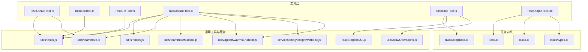
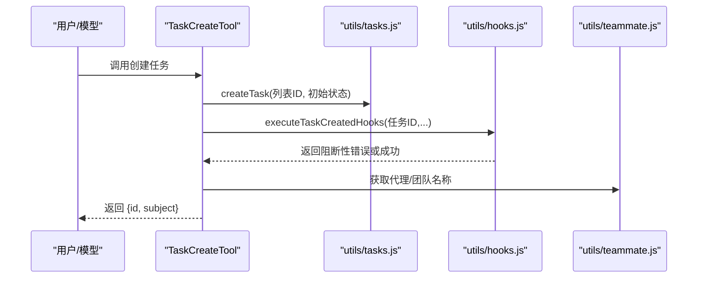
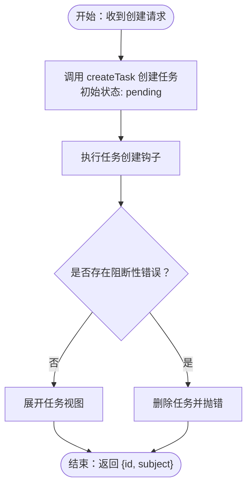
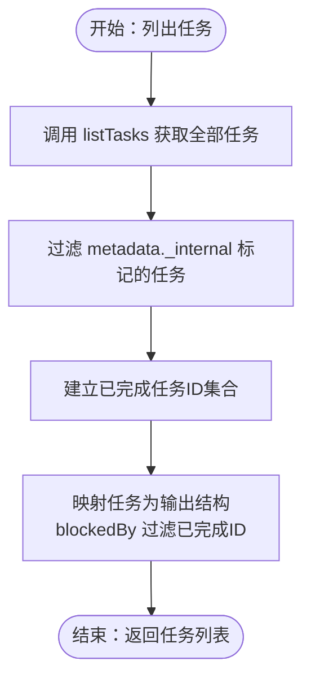
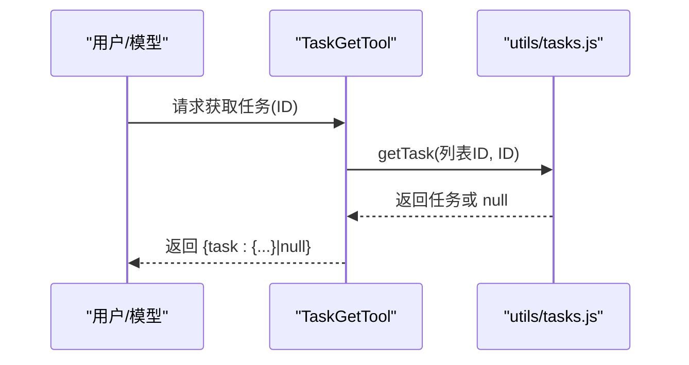
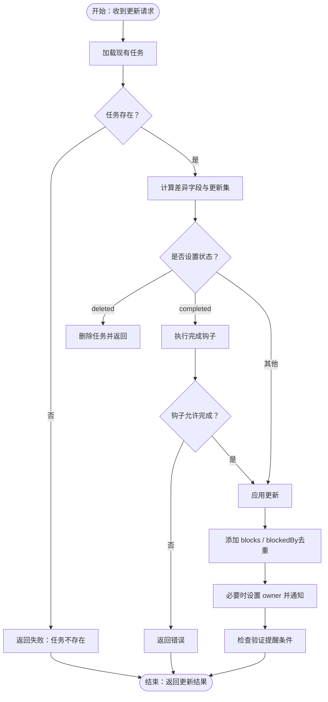
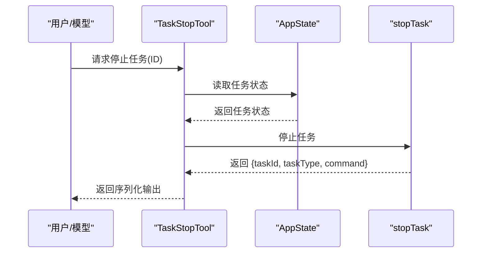
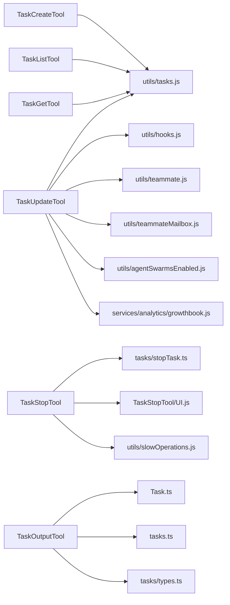

# 任务管理工具

<cite>
**本文引用的文件**
- [TaskCreateTool.ts](file://src/tools/TaskCreateTool/TaskCreateTool.ts)
- [TaskListTool.ts](file://src/tools/TaskListTool/TaskListTool.ts)
- [TaskGetTool.ts](file://src/tools/TaskGetTool/TaskGetTool.ts)
- [TaskUpdateTool.ts](file://src/tools/TaskUpdateTool/TaskUpdateTool.ts)
- [TaskStopTool.ts](file://src/tools/TaskStopTool/TaskStopTool.ts)
- [TaskOutputTool.tsx](file://src/tools/TaskOutputTool/TaskOutputTool.tsx)
- [tasks.ts](file://src/tasks.ts)
- [types.ts](file://src/tasks/types.ts)
- [stopTask.ts](file://src/tasks/stopTask.ts)
- [Task.ts](file://src/Task.ts)
- [tools.ts](file://src/tools.ts)
- [tasks.js](file://src/utils/tasks.js)
- [hooks.js](file://src/utils/hooks.js)
- [teammate.js](file://src/utils/teammate.js)
- [teammateMailbox.js](file://src/utils/teammateMailbox.js)
- [agentSwarmsEnabled.js](file://src/utils/agentSwarmsEnabled.js)
- [growthbook.js](file://src/services/analytics/growthbook.js)
- [UI.js](file://src/tools/TaskStopTool/UI.js)
- [slowOperations.js](file://src/utils/slowOperations.js)
</cite>

## 目录
1. [简介](#简介)
2. [项目结构](#项目结构)
3. [核心组件](#核心组件)
4. [架构总览](#架构总览)
5. [详细组件分析](#详细组件分析)
6. [依赖关系分析](#依赖关系分析)
7. [性能考量](#性能考量)
8. [故障排查指南](#故障排查指南)
9. [结论](#结论)
10. [附录](#附录)

## 简介
本文件系统性介绍 Claude Code 的任务管理工具体系，覆盖以下工具：任务创建工具（TaskCreateTool）、任务列表工具（TaskListTool）、任务获取工具（TaskGetTool）、任务更新工具（TaskUpdateTool）、任务停止工具（TaskStopTool）以及任务输出工具（TaskOutputTool）。文档从架构、数据流、处理逻辑、集成点、错误处理与性能优化等维度进行深入解析，并提供任务生命周期管理、状态跟踪与进度监控机制说明，以及实际使用示例与工作流集成建议。

## 项目结构
任务管理工具位于 src/tools 下，围绕任务的创建、查询、更新、停止与输出展示形成完整闭环；同时通过 src/tasks.ts 汇总各类任务类型，配合 utils/tasks.js 提供持久化与状态管理能力。

**图表来源**
- [TaskCreateTool.ts:1-139](file://src/tools/TaskCreateTool/TaskCreateTool.ts#L1-L139)
- [TaskListTool.ts:1-117](file://src/tools/TaskListTool/TaskListTool.ts#L1-L117)
- [TaskGetTool.ts:1-129](file://src/tools/TaskGetTool/TaskGetTool.ts#L1-L129)
- [TaskUpdateTool.ts:1-407](file://src/tools/TaskUpdateTool/TaskUpdateTool.ts#L1-L407)
- [TaskStopTool.ts:1-132](file://src/tools/TaskStopTool/TaskStopTool.ts#L1-L132)
- [TaskOutputTool.tsx](file://src/tools/TaskOutputTool/TaskOutputTool.tsx)
- [tasks.ts:1-40](file://src/tasks.ts#L1-L40)
- [types.ts:1-47](file://src/tasks/types.ts#L1-L47)
- [stopTask.ts](file://src/tasks/stopTask.ts)
- [Task.ts](file://src/Task.ts)
- [tasks.js](file://src/utils/tasks.js)
- [hooks.js](file://src/utils/hooks.js)
- [teammate.js](file://src/utils/teammate.js)
- [teammateMailbox.js](file://src/utils/teammateMailbox.js)
- [agentSwarmsEnabled.js](file://src/utils/agentSwarmsEnabled.js)
- [growthbook.js](file://src/services/analytics/growthbook.js)
- [UI.js](file://src/tools/TaskStopTool/UI.js)
- [slowOperations.js](file://src/utils/slowOperations.js)

**章节来源**
- [TaskCreateTool.ts:1-139](file://src/tools/TaskCreateTool/TaskCreateTool.ts#L1-L139)
- [TaskListTool.ts:1-117](file://src/tools/TaskListTool/TaskListTool.ts#L1-L117)
- [TaskGetTool.ts:1-129](file://src/tools/TaskGetTool/TaskGetTool.ts#L1-L129)
- [TaskUpdateTool.ts:1-407](file://src/tools/TaskUpdateTool/TaskUpdateTool.ts#L1-L407)
- [TaskStopTool.ts:1-132](file://src/tools/TaskStopTool/TaskStopTool.ts#L1-L132)
- [TaskOutputTool.tsx](file://src/tools/TaskOutputTool/TaskOutputTool.tsx)
- [tasks.ts:1-40](file://src/tasks.ts#L1-L40)
- [types.ts:1-47](file://src/tasks/types.ts#L1-L47)

## 核心组件
- 任务创建工具（TaskCreateTool）
  - 功能：在任务列表中创建新任务，支持主题、描述、活动形态（如“运行测试”）与任意元数据附加。
  - 关键点：调用创建接口后执行“任务已创建”钩子，若存在阻断性错误则回滚删除任务；自动展开任务视图。
- 任务列表工具（TaskListTool）
  - 功能：列出当前任务列表，过滤内部任务，计算“被解除阻塞”的任务集合，仅返回未完成任务的阻塞关系。
  - 关键点：只读工具，渲染简洁的任务摘要字符串。
- 任务获取工具（TaskGetTool）
  - 功能：按任务 ID 获取任务详情，包括状态、阻塞关系与块关系。
  - 关键点：不存在时返回空结果而非抛错；渲染人类可读的多行文本。
- 任务更新工具（TaskUpdateTool）
  - 功能：更新任务字段（主题、描述、活动形态、所有者、元数据），变更状态（含删除），添加块/被块关系，触发完成钩子与团队提醒。
  - 关键点：并发安全；当状态设为完成时执行完成钩子并可能阻断更新；自动设置所有者；支持验证提醒提示。
- 任务停止工具（TaskStopTool）
  - 功能：停止指定的后台运行任务，兼容旧版 KillShell 名称。
  - 关键点：输入校验确保任务存在且处于运行中；调用 stopTask 执行停止；输出包含任务类型与命令描述。
- 任务输出工具（TaskOutputTool）
  - 功能：用于展示任务输出内容，与任务状态、类型及 UI 组件协同。
  - 关键点：与任务内核（Task.ts、tasks.ts、tasks/types.ts）紧密关联，负责输出渲染与交互。

**章节来源**
- [TaskCreateTool.ts:80-129](file://src/tools/TaskCreateTool/TaskCreateTool.ts#L80-L129)
- [TaskListTool.ts:65-90](file://src/tools/TaskListTool/TaskListTool.ts#L65-L90)
- [TaskGetTool.ts:73-98](file://src/tools/TaskGetTool/TaskGetTool.ts#L73-L98)
- [TaskUpdateTool.ts:123-363](file://src/tools/TaskUpdateTool/TaskUpdateTool.ts#L123-L363)
- [TaskStopTool.ts:107-130](file://src/tools/TaskStopTool/TaskStopTool.ts#L107-L130)
- [TaskOutputTool.tsx](file://src/tools/TaskOutputTool/TaskOutputTool.tsx)

## 架构总览
任务管理工具围绕“工具定义 + 任务内核 + 通用工具库”三层协作：

- 工具定义层：各工具通过 buildTool 定义输入/输出模式、启用条件、并发安全与只读属性，并实现 call 方法。
- 任务内核层：Task.ts 定义任务抽象；tasks.ts 汇总任务类型；tasks/types.ts 提供状态类型与背景任务判定；stopTask.ts 提供停止能力。
- 通用工具库：utils/tasks.js 提供任务 CRUD、状态枚举与过滤；utils/hooks.js 提供任务钩子；utils/teammate.js 与 teammateMailbox.js 支持团队协作与消息通知；agentSwarmsEnabled.js 控制团队分身相关行为；growthbook.js 提供实验配置；UI.js 与 slowOperations.js 支持 UI 渲染与序列化。

**图表来源**
- [TaskCreateTool.ts:80-113](file://src/tools/TaskCreateTool/TaskCreateTool.ts#L80-L113)
- [tasks.js](file://src/utils/tasks.js)
- [hooks.js](file://src/utils/hooks.js)
- [teammate.js](file://src/utils/teammate.js)

**章节来源**
- [TaskCreateTool.ts:48-129](file://src/tools/TaskCreateTool/TaskCreateTool.ts#L48-L129)
- [tasks.ts:22-32](file://src/tasks.ts#L22-L32)
- [types.ts:12-46](file://src/tasks/types.ts#L12-L46)

## 详细组件分析

### 任务创建工具（TaskCreateTool）
- 输入模式：主题、描述、活动形态、元数据。
- 输出模式：返回任务 ID 与主题。
- 生命周期要点：
  - 创建后立即执行“任务已创建”钩子；若钩子返回阻断性错误，则删除任务并抛出错误。
  - 自动展开任务视图以便用户查看。
- 并发与安全：标记为并发安全。
- 只读属性：非只读（会写入任务存储）。

**图表来源**
- [TaskCreateTool.ts:80-129](file://src/tools/TaskCreateTool/TaskCreateTool.ts#L80-L129)
- [tasks.js](file://src/utils/tasks.js)
- [hooks.js](file://src/utils/hooks.js)

**章节来源**
- [TaskCreateTool.ts:18-129](file://src/tools/TaskCreateTool/TaskCreateTool.ts#L18-L129)

### 任务列表工具（TaskListTool）
- 输入模式：无参数。
- 输出模式：任务数组（含 id、subject、status、owner、blockedBy）。
- 过滤策略：排除内部任务；对已完成任务建立集合以剔除其作为阻塞来源。
- 只读属性：明确声明只读。

**图表来源**
- [TaskListTool.ts:65-90](file://src/tools/TaskListTool/TaskListTool.ts#L65-L90)
- [tasks.js](file://src/utils/tasks.js)

**章节来源**
- [TaskListTool.ts:13-90](file://src/tools/TaskListTool/TaskListTool.ts#L13-L90)

### 任务获取工具（TaskGetTool）
- 输入模式：taskId。
- 输出模式：任务详情对象（可为空）。
- 行为：不存在时返回 null；渲染包含状态、描述、阻塞关系与块关系的文本。

**图表来源**
- [TaskGetTool.ts:73-98](file://src/tools/TaskGetTool/TaskGetTool.ts#L73-L98)
- [tasks.js](file://src/utils/tasks.js)

**章节来源**
- [TaskGetTool.ts:13-98](file://src/tools/TaskGetTool/TaskGetTool.ts#L13-L98)

### 任务更新工具（TaskUpdateTool）
- 输入模式：taskId 必填；其他字段可选（subject/description/activeForm/status/owner/metadata，以及 addBlocks/addBlockedBy）。
- 输出模式：success、taskId、updatedFields、statusChange（可选）、verificationNudgeNeeded（可选）。
- 关键流程：
  - 字段更新：仅当值不同才写入；支持合并元数据（null 删除键）。
  - 状态变更：若设为 deleted 则直接删除；若设为 completed 则执行完成钩子并可能阻断更新。
  - 阻塞关系：分别添加 blocks 与 blockedBy，避免重复。
  - 团队协作：当状态为 in_progress 且开启团队分身时，自动设置 owner；所有权变更时通过邮箱盒通知目标成员。
  - 验证提醒：在特定实验条件下，当一次性关闭多个任务且缺少验证步骤时，附加提醒。

**图表来源**
- [TaskUpdateTool.ts:123-363](file://src/tools/TaskUpdateTool/TaskUpdateTool.ts#L123-L363)
- [tasks.js](file://src/utils/tasks.js)
- [hooks.js](file://src/utils/hooks.js)
- [teammate.js](file://src/utils/teammate.js)
- [teammateMailbox.js](file://src/utils/teammateMailbox.js)
- [agentSwarmsEnabled.js](file://src/utils/agentSwarmsEnabled.js)
- [growthbook.js](file://src/services/analytics/growthbook.js)

**章节来源**
- [TaskUpdateTool.ts:33-363](file://src/tools/TaskUpdateTool/TaskUpdateTool.ts#L33-L363)

### 任务停止工具（TaskStopTool）
- 输入模式：task_id 或兼容的 shell_id（旧名）。
- 输出模式：message、task_id、task_type、command（可选）。
- 校验逻辑：必须提供 ID；任务必须存在且处于 running 状态。
- 停止流程：调用 stopTask 执行停止，返回停止后的任务信息并序列化输出。

**图表来源**
- [TaskStopTool.ts:60-130](file://src/tools/TaskStopTool/TaskStopTool.ts#L60-L130)
- [stopTask.ts](file://src/tasks/stopTask.ts)
- [UI.js](file://src/tools/TaskStopTool/UI.js)
- [slowOperations.js](file://src/utils/slowOperations.js)

**章节来源**
- [TaskStopTool.ts:10-132](file://src/tools/TaskStopTool/TaskStopTool.ts#L10-L132)

### 任务输出工具（TaskOutputTool）
- 作用：展示任务输出内容，与任务状态、类型及 UI 组件协同。
- 依赖：Task.ts、tasks.ts、tasks/types.ts 提供任务类型与状态定义。

**章节来源**
- [TaskOutputTool.tsx](file://src/tools/TaskOutputTool/TaskOutputTool.tsx)
- [Task.ts](file://src/Task.ts)
- [tasks.ts:22-39](file://src/tasks.ts#L22-L39)
- [types.ts:12-46](file://src/tasks/types.ts#L12-L46)

## 依赖关系分析
- 工具到任务内核
  - TaskCreateTool/TaskGetTool/TaskListTool/TaskUpdateTool 均依赖 utils/tasks.js 提供的 CRUD 与状态枚举。
  - TaskStopTool 依赖 stopTask.ts 实现停止逻辑。
- 工具到通用服务
  - TaskUpdateTool 依赖 hooks.js（完成钩子）、teammate.js（代理/团队信息）、teammateMailbox.js（团队消息）、agentSwarmsEnabled.js（团队分身开关）、growthbook.js（实验配置）。
  - TaskStopTool 依赖 UI.js 与 slowOperations.js（序列化）。
- 任务内核
  - tasks.ts 汇总任务类型；types.ts 定义状态联合类型与背景任务判定；Task.ts 提供任务抽象。

**图表来源**
- [TaskCreateTool.ts:1-16](file://src/tools/TaskCreateTool/TaskCreateTool.ts#L1-L16)
- [TaskListTool.ts:1-11](file://src/tools/TaskListTool/TaskListTool.ts#L1-L11)
- [TaskGetTool.ts:1-11](file://src/tools/TaskGetTool/TaskGetTool.ts#L1-L11)
- [TaskUpdateTool.ts:1-31](file://src/tools/TaskUpdateTool/TaskUpdateTool.ts#L1-L31)
- [TaskStopTool.ts:1-8](file://src/tools/TaskStopTool/TaskStopTool.ts#L1-L8)
- [TaskOutputTool.tsx](file://src/tools/TaskOutputTool/TaskOutputTool.tsx)
- [tasks.ts:1-40](file://src/tasks.ts#L1-L40)
- [types.ts:1-47](file://src/tasks/types.ts#L1-L47)
- [Task.ts](file://src/Task.ts)
- [tasks.js](file://src/utils/tasks.js)
- [hooks.js](file://src/utils/hooks.js)
- [teammate.js](file://src/utils/teammate.js)
- [teammateMailbox.js](file://src/utils/teammateMailbox.js)
- [agentSwarmsEnabled.js](file://src/utils/agentSwarmsEnabled.js)
- [growthbook.js](file://src/services/analytics/growthbook.js)
- [UI.js](file://src/tools/TaskStopTool/UI.js)
- [slowOperations.js](file://src/utils/slowOperations.js)

**章节来源**
- [tools.ts](file://src/tools.ts)
- [tasks.ts:22-39](file://src/tasks.ts#L22-L39)
- [types.ts:12-46](file://src/tasks/types.ts#L12-L46)

## 性能考量
- 并发安全：各工具均声明 isConcurrencySafe(true)，适合在多工具并发场景下安全使用。
- 只读工具：TaskListTool/TaskGetTool 明确只读，减少写路径开销。
- 过滤与去重：TaskListTool 对已完成任务建立集合以快速过滤阻塞关系；TaskUpdateTool 在添加阻塞关系时进行去重。
- 钩子与异步：TaskCreateTool/TaskUpdateTool 使用异步钩子生成器，注意在钩子中避免长时间阻塞操作。
- 序列化：TaskStopTool 使用序列化输出，避免大对象直接传输带来的内存压力。

[本节为通用指导，无需具体文件来源]

## 故障排查指南
- 任务创建失败
  - 现象：创建后立即回滚并报错。
  - 排查：检查任务创建钩子返回的阻断性错误；确认任务列表 ID 有效。
  - 参考
    - [TaskCreateTool.ts:110-113](file://src/tools/TaskCreateTool/TaskCreateTool.ts#L110-L113)
    - [hooks.js](file://src/utils/hooks.js)
- 任务不存在
  - 现象：TaskGetTool 返回 null；TaskUpdateTool 返回“任务不存在”。
  - 排查：确认 taskId 正确；检查任务列表 ID。
  - 参考
    - [TaskGetTool.ts:78-83](file://src/tools/TaskGetTool/TaskGetTool.ts#L78-L83)
    - [TaskUpdateTool.ts:147-155](file://src/tools/TaskUpdateTool/TaskUpdateTool.ts#L147-L155)
- 无法停止任务
  - 现象：输入校验失败或任务非 running 状态。
  - 排查：确认 task_id 存在且任务状态为 running；兼容 shell_id（旧名）。
  - 参考
    - [TaskStopTool.ts:60-91](file://src/tools/TaskStopTool/TaskStopTool.ts#L60-L91)
- 完成状态被阻断
  - 现象：将任务置为 completed 时被钩子阻止。
  - 排查：检查完成钩子返回的阻断性错误；修正前置条件。
  - 参考
    - [TaskUpdateTool.ts:232-265](file://src/tools/TaskUpdateTool/TaskUpdateTool.ts#L232-L265)
    - [hooks.js](file://src/utils/hooks.js)
- 验证提醒未出现
  - 现象：一次性关闭多个任务后未提示验证。
  - 排查：确认实验开关开启且任务列表中无“验证”相关任务。
  - 参考
    - [TaskUpdateTool.ts:334-349](file://src/tools/TaskUpdateTool/TaskUpdateTool.ts#L334-L349)
    - [growthbook.js](file://src/services/analytics/growthbook.js)

**章节来源**
- [TaskCreateTool.ts:110-113](file://src/tools/TaskCreateTool/TaskCreateTool.ts#L110-L113)
- [TaskGetTool.ts:78-83](file://src/tools/TaskGetTool/TaskGetTool.ts#L78-L83)
- [TaskUpdateTool.ts:147-155](file://src/tools/TaskUpdateTool/TaskUpdateTool.ts#L147-L155)
- [TaskStopTool.ts:60-91](file://src/tools/TaskStopTool/TaskStopTool.ts#L60-L91)

## 结论
任务管理工具通过清晰的职责划分与一致的工具协议，实现了从创建、查询、更新到停止与输出展示的全链路能力。工具层遵循并发安全与只读原则，任务内核提供统一的状态与类型定义，通用工具库支撑钩子、团队协作与实验配置。结合本文提供的最佳实践与排障建议，可在复杂工作流中稳定地进行任务调度与并发控制，并保障权限与安全边界。

[本节为总结，无需具体文件来源]

## 附录

### 任务生命周期与状态跟踪
- 生命周期阶段：创建（pending）→ 进行中（in_progress）→ 完成（completed）→ 删除（deleted）。
- 状态跟踪：TaskUpdateTool 支持状态变更记录；TaskListTool 展示当前状态与阻塞关系。
- 进度监控：通过 activeForm 字段在 UI 中显示当前动作形态；TaskStopTool 提供后台任务中断能力。

**章节来源**
- [TaskUpdateTool.ts:212-270](file://src/tools/TaskUpdateTool/TaskUpdateTool.ts#L212-L270)
- [TaskListTool.ts:68-83](file://src/tools/TaskListTool/TaskListTool.ts#L68-L83)

### 实际使用示例与工作流集成
- 示例一：自动化创建并追踪任务
  - 流程：调用 TaskCreateTool 创建任务 → 使用 TaskListTool 获取任务列表 → 使用 TaskGetTool 获取详情 → 使用 TaskUpdateTool 更新状态为 in_progress → 完成后置为 completed。
  - 参考
    - [TaskCreateTool.ts:80-129](file://src/tools/TaskCreateTool/TaskCreateTool.ts#L80-L129)
    - [TaskListTool.ts:65-90](file://src/tools/TaskListTool/TaskListTool.ts#L65-L90)
    - [TaskGetTool.ts:73-98](file://src/tools/TaskGetTool/TaskGetTool.ts#L73-L98)
    - [TaskUpdateTool.ts:123-363](file://src/tools/TaskUpdateTool/TaskUpdateTool.ts#L123-L363)
- 示例二：后台任务中断
  - 流程：识别 running 状态的后台任务 → 调用 TaskStopTool 停止 → 校验输出中的任务类型与命令描述。
  - 参考
    - [TaskStopTool.ts:107-130](file://src/tools/TaskStopTool/TaskStopTool.ts#L107-L130)

**章节来源**
- [TaskCreateTool.ts:80-129](file://src/tools/TaskCreateTool/TaskCreateTool.ts#L80-L129)
- [TaskListTool.ts:65-90](file://src/tools/TaskListTool/TaskListTool.ts#L65-L90)
- [TaskGetTool.ts:73-98](file://src/tools/TaskGetTool/TaskGetTool.ts#L73-L98)
- [TaskUpdateTool.ts:123-363](file://src/tools/TaskUpdateTool/TaskUpdateTool.ts#L123-L363)
- [TaskStopTool.ts:107-130](file://src/tools/TaskStopTool/TaskStopTool.ts#L107-L130)

### 任务调度与并发控制最佳实践
- 并发安全：优先使用声明并发安全的工具；避免在同一任务上并发发起多次更新。
- 只读优先：在不需要写入时使用只读工具（如 TaskListTool/TaskGetTool）降低冲突概率。
- 钩子异步：在钩子中避免长时间阻塞，必要时拆分为异步任务。
- 批量操作：对批量添加阻塞关系时先去重，减少重复写入。

[本节为通用指导，无需具体文件来源]

### 任务权限管理与安全控制
- 启用条件：各工具均实现 isEnabled 检查（如 TodoV2 开关），确保在正确环境下可用。
- 只读工具：TaskListTool/TaskGetTool 明确只读，限制写入风险。
- 输入校验：TaskStopTool 对 task_id 进行严格校验，防止误操作。
- 钩子阻断：完成钩子可阻断状态变更，确保业务规则得到遵守。
- 团队协作：TaskUpdateTool 在所有权变更时通过邮箱盒通知目标成员，便于审计与协作。

**章节来源**
- [TaskCreateTool.ts:68-73](file://src/tools/TaskCreateTool/TaskCreateTool.ts#L68-L73)
- [TaskListTool.ts:59-61](file://src/tools/TaskListTool/TaskListTool.ts#L59-L61)
- [TaskGetTool.ts:64-66](file://src/tools/TaskGetTool/TaskGetTool.ts#L64-L66)
- [TaskStopTool.ts:60-91](file://src/tools/TaskStopTool/TaskStopTool.ts#L60-L91)
- [TaskUpdateTool.ts:232-265](file://src/tools/TaskUpdateTool/TaskUpdateTool.ts#L232-L265)