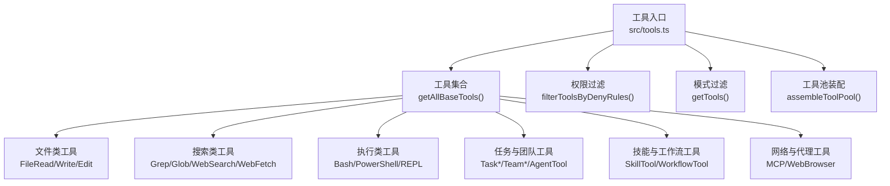
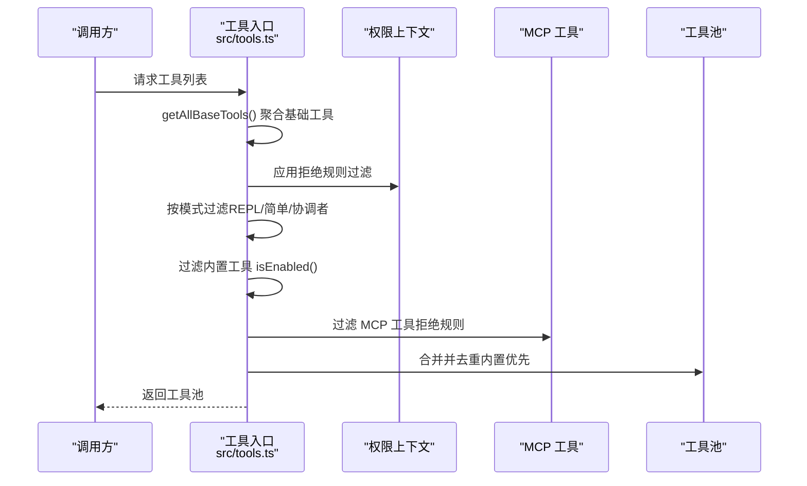
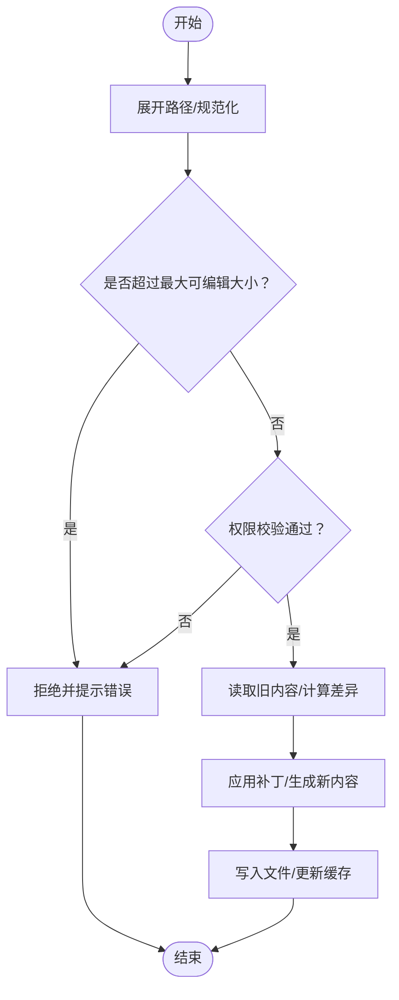
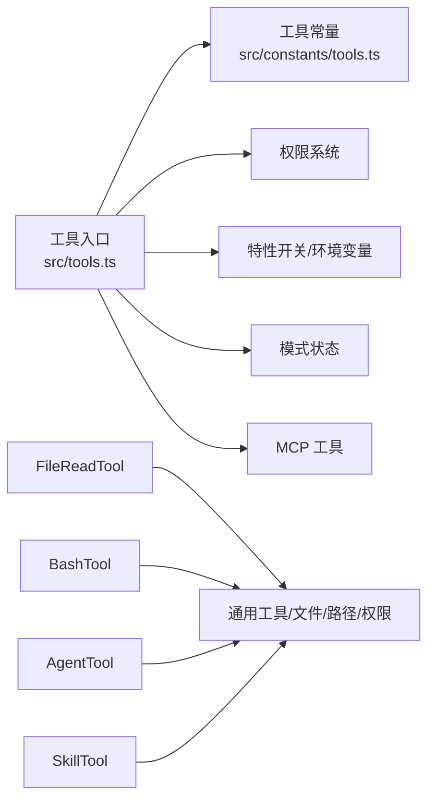

# 内置工具概览

<cite>
**本文引用的文件**
- [src/tools.ts](file://src/tools.ts)
- [src/constants/tools.ts](file://src/constants/tools.ts)
- [src/Tool.ts](file://src/Tool.ts)
- [src/tools/FileReadTool/FileReadTool.ts](file://src/tools/FileReadTool/FileReadTool.ts)
- [src/tools/WebSearchTool/WebSearchTool.ts](file://src/tools/WebSearchTool/WebSearchTool.ts)
- [src/tools/BashTool/BashTool.tsx](file://src/tools/BashTool/BashTool.tsx)
- [src/tools/AgentTool/AgentTool.tsx](file://src/tools/AgentTool/AgentTool.tsx)
- [src/tools/FileEditTool/FileEditTool.ts](file://src/tools/FileEditTool/FileEditTool.ts)
- [src/tools/WebFetchTool/WebFetchTool.ts](file://src/tools/WebFetchTool/WebFetchTool.ts)
- [src/tools/SkillTool/SkillTool.ts](file://src/tools/SkillTool/SkillTool.ts)
- [src/tools/TaskCreateTool/TaskCreateTool.ts](file://src/tools/TaskCreateTool/TaskCreateTool.ts)
</cite>

## 目录
1. [简介](#简介)
2. [项目结构](#项目结构)
3. [核心组件](#核心组件)
4. [架构总览](#架构总览)
5. [详细组件分析](#详细组件分析)
6. [依赖分析](#依赖分析)
7. [性能考虑](#性能考虑)
8. [故障排查指南](#故障排查指南)
9. [结论](#结论)
10. [附录](#附录)

## 简介
本文件为 Claude Code 的内置工具系统提供全面概览，涵盖工具分类体系、命名规范与组织结构、功能范围、使用指南与最佳实践，以及工具间的依赖关系与协作机制。目标读者既包括需要快速上手的使用者，也包括希望深入理解实现细节的开发者。

## 项目结构
内置工具集中于 src/tools 目录，每个工具以独立模块形式存在，并通过统一入口进行聚合与筛选。工具入口负责：
- 汇总所有可用工具（含条件启用特性）
- 应用权限与模式过滤
- 合并 MCP 工具并去重
- 提供工具池装配与查询能力

图表来源
- [src/tools.ts:193-251](file://src/tools.ts#L193-L251)
- [src/tools.ts:271-327](file://src/tools.ts#L271-L327)
- [src/tools.ts:345-367](file://src/tools.ts#L345-L367)

章节来源
- [src/tools.ts:193-251](file://src/tools.ts#L193-L251)
- [src/tools.ts:271-327](file://src/tools.ts#L271-L327)
- [src/tools.ts:345-367](file://src/tools.ts#L345-L367)

## 核心组件
- 工具类型与契约：工具接口定义了调用签名、输入输出模式、权限校验、进度渲染、摘要与活动描述等能力，确保统一的行为与可观测性。
- 工具入口与装配：工具入口负责按环境与权限动态组装工具池，支持简单模式、REPL 包装模式、协调者模式等。
- 权限与模式控制：通过权限上下文与模式标志位，对工具可用性、可见性与行为进行细粒度控制。

章节来源
- [src/Tool.ts:362-695](file://src/Tool.ts#L362-L695)
- [src/tools.ts:271-327](file://src/tools.ts#L271-L327)
- [src/constants/tools.ts:36-112](file://src/constants/tools.ts#L36-L112)

## 架构总览
工具系统采用“统一入口 + 分层装配 + 权限与模式过滤”的架构设计，确保在不同运行模式下（如 REPL、简单模式、协调者模式）都能稳定提供一致的工具集。

图表来源
- [src/tools.ts:193-251](file://src/tools.ts#L193-L251)
- [src/tools.ts:262-269](file://src/tools.ts#L262-L269)
- [src/tools.ts:271-327](file://src/tools.ts#L271-L327)
- [src/tools.ts:345-367](file://src/tools.ts#L345-L367)

## 详细组件分析

### 文件操作工具
- FileReadTool：安全读取文件内容，支持偏移与限制、二进制检测、图片处理、PDF 解析、路径建议与相似文件查找、读取权限校验与统计埋点。
- FileEditTool：原地编辑文件，支持差异生成、变更行数统计、写入权限校验、大文件保护、UNC 路径安全策略、设置文件编辑校验。
- FileWriteTool：写入文件（具体实现位于对应文件中），与编辑工具配合完成文件写入流程。

图表来源
- [src/tools/FileEditTool/FileEditTool.ts:137-200](file://src/tools/FileEditTool/FileEditTool.ts#L137-L200)
- [src/tools/FileReadTool/FileReadTool.ts:96-128](file://src/tools/FileReadTool/FileReadTool.ts#L96-L128)

章节来源
- [src/tools/FileReadTool/FileReadTool.ts:1-200](file://src/tools/FileReadTool/FileReadTool.ts#L1-L200)
- [src/tools/FileEditTool/FileEditTool.ts:1-200](file://src/tools/FileEditTool/FileEditTool.ts#L1-L200)

### 系统工具
- BashTool：执行系统命令，支持管道解析、只读/破坏性判断、搜索/读取/列出命令归类、权限校验、超时与沙箱策略、结果截断与预览、终端图像输出处理。
- PowerShellTool：Windows 平台专用脚本执行工具（按启用条件加载）。

章节来源
- [src/tools/BashTool/BashTool.tsx:1-200](file://src/tools/BashTool/BashTool.tsx#L1-L200)

### 网络工具
- WebSearchTool：基于模型能力的网页搜索工具，支持域名白/黑名单、最大使用次数限制、结果块解析与文本拼接、进度与摘要展示。
- WebFetchTool：从 URL 获取内容并按提示进行提取处理，支持预批准主机、权限规则匹配、输入到规则内容映射、HTTP 响应码与耗时统计。

章节来源
- [src/tools/WebSearchTool/WebSearchTool.ts:1-200](file://src/tools/WebSearchTool/WebSearchTool.ts#L1-L200)
- [src/tools/WebFetchTool/WebFetchTool.ts:1-200](file://src/tools/WebFetchTool/WebFetchTool.ts#L1-L200)

### 代理工具
- AgentTool：多智能体编排与派生，支持异步/后台执行、工作树隔离、远程会话、权限模式、进度跟踪、消息归档与摘要、子代理生命周期管理。
- TeamCreate/Delete/Task*：团队与任务相关工具，用于在进程内或协调者模式下管理任务与消息。

章节来源
- [src/tools/AgentTool/AgentTool.tsx:1-200](file://src/tools/AgentTool/AgentTool.tsx#L1-L200)
- [src/tools/TaskCreateTool/TaskCreateTool.ts:1-139](file://src/tools/TaskCreateTool/TaskCreateTool.ts#L1-L139)

### 开发工具
- SkillTool：技能执行工具，支持本地与 MCP 技能发现、fork 子代理执行、插件市场识别、遥测字段记录、实验性技能搜索模块集成。
- LSPTool：语言服务协议工具（按启用条件加载）。
- GrepTool/GlobTool：文件内容与路径搜索工具，支持嵌入式工具条件启用。

章节来源
- [src/tools/SkillTool/SkillTool.ts:1-200](file://src/tools/SkillTool/SkillTool.ts#L1-L200)

### 其他工具
- REPLTool：REPL 模式包装工具（按用户类型与特性启用）。
- MCPTool/Read/ListMcpResourcesTool：MCP 协议工具，用于与 MCP 服务器交互。
- WorkflowTool：工作流脚本工具（按特性启用）。
- 其他：BriefTool、TodoWriteTool、NotebookEditTool、AskUserQuestionTool、ConfigTool、TungstenTool 等。

章节来源
- [src/tools.ts:14-134](file://src/tools.ts#L14-L134)

## 依赖分析
- 工具入口依赖：工具入口依赖工具常量、权限系统、特性开关、环境变量与模式状态，以决定工具可用性与可见性。
- 工具内部依赖：各工具依赖通用工具函数（路径、文件、权限、消息、令牌估算、沙箱、终端等），并通过 UI 模块提供渲染与交互。
- 工具间协作：工具池装配时先内置后 MCP，内置工具优先；部分工具（如 AgentTool、Task*）在特定模式下仅对协调者或进程内同伴开放。

图表来源
- [src/tools.ts:193-251](file://src/tools.ts#L193-L251)
- [src/constants/tools.ts:36-112](file://src/constants/tools.ts#L36-L112)

章节来源
- [src/tools.ts:193-251](file://src/tools.ts#L193-L251)
- [src/constants/tools.ts:36-112](file://src/constants/tools.ts#L36-L112)

## 性能考虑
- 结果持久化阈值：工具通过 maxResultSizeChars 控制结果大小，超过阈值将保存至磁盘并返回预览，避免内存溢出与缓存污染。
- Prompt 缓存稳定性：工具池按名称排序并去重，内置工具保持前缀连续，避免 MCP 工具打乱顺序导致缓存失效。
- 并发与只读：工具可声明并发安全与只读属性，便于模型与 UI 在展示与交互上做出优化。
- 搜索/读取折叠：Bash 等工具对搜索/读取/列出命令进行归类，UI 可合并显示以提升可读性。

章节来源
- [src/Tool.ts:465-467](file://src/Tool.ts#L465-L467)
- [src/tools.ts:354-366](file://src/tools.ts#L354-L366)
- [src/tools/BashTool/BashTool.tsx:95-172](file://src/tools/BashTool/BashTool.tsx#L95-L172)

## 故障排查指南
- 权限被拒：检查拒绝规则与 ask/rule/allow 规则，确认输入规则内容映射是否正确。
- 输入校验失败：关注 validateInput 返回的错误码与消息，定位参数格式或范围问题。
- 大文件/设备路径：注意文件大小限制与设备路径阻断逻辑，避免 OOM 或阻塞。
- 模式不生效：确认是否处于 REPL/简单/协调者模式，以及相应工具的 isEnabled 与 REPL_ONLY_TOOLS 过滤逻辑。
- MCP 工具不可见：检查 MCP 工具是否被拒绝规则过滤，或是否超过工具搜索阈值而被延迟加载。

章节来源
- [src/tools/WebFetchTool/WebFetchTool.ts:104-180](file://src/tools/WebFetchTool/WebFetchTool.ts#L104-L180)
- [src/tools/FileReadTool/FileReadTool.ts:175-185](file://src/tools/FileReadTool/FileReadTool.ts#L175-L185)
- [src/tools.ts:262-269](file://src/tools.ts#L262-L269)
- [src/tools.ts:312-323](file://src/tools.ts#L312-L323)

## 结论
Claude Code 的内置工具系统通过统一的工具契约、灵活的装配与过滤机制、完善的权限与模式控制，实现了在多种运行模式下的稳定与可扩展。文件操作、系统执行、网络检索、代理编排与开发辅助工具覆盖了日常开发的核心场景，同时提供了清晰的命名规范、组织结构与协作机制，便于维护与扩展。

## 附录

### 工具分类与功能范围
- 文件操作：读取、编辑、写入，支持权限校验、大文件保护、路径建议与相似文件查找。
- 系统执行：Bash/PowerShell 执行，支持只读/破坏性判断、搜索/读取/列出命令归类、超时与沙箱策略。
- 网络检索：网页搜索与 URL 内容抓取，支持域名白/黑名单、预批准主机、权限规则匹配。
- 代理编排：多智能体派生、工作树隔离、远程会话、任务与消息管理。
- 开发辅助：技能执行、LSP、搜索工具、MCP 协议工具、工作流脚本。

章节来源
- [src/tools/FileReadTool/FileReadTool.ts:1-200](file://src/tools/FileReadTool/FileReadTool.ts#L1-L200)
- [src/tools/BashTool/BashTool.tsx:1-200](file://src/tools/BashTool/BashTool.tsx#L1-L200)
- [src/tools/WebSearchTool/WebSearchTool.ts:1-200](file://src/tools/WebSearchTool/WebSearchTool.ts#L1-L200)
- [src/tools/WebFetchTool/WebFetchTool.ts:1-200](file://src/tools/WebFetchTool/WebFetchTool.ts#L1-L200)
- [src/tools/AgentTool/AgentTool.tsx:1-200](file://src/tools/AgentTool/AgentTool.tsx#L1-L200)
- [src/tools/SkillTool/SkillTool.ts:1-200](file://src/tools/SkillTool/SkillTool.ts#L1-L200)

### 命名规范与组织结构
- 工具名称：采用语义化命名，如 FileReadTool、WebSearchTool、AgentTool 等，主名称与别名通过工具对象的 name 与 aliases 字段定义。
- 目录结构：每个工具独立模块，位于 src/tools/<ToolName>/ 下，包含实现文件、UI 渲染、提示词与常量等。
- 文件命名：实现文件通常为 <ToolName>.ts 或 <ToolName>.tsx，UI 与提示词分别位于 UI.js 与 prompt.js。

章节来源
- [src/Tool.ts:362-403](file://src/Tool.ts#L362-L403)
- [src/tools.ts:193-251](file://src/tools.ts#L193-L251)

### 使用指南与最佳实践
- 选择合适模式：根据需求选择简单模式（仅 Bash/Read/Edit）、REPL 包装模式或完整模式；在协调者模式下仅允许输出与代理管理工具。
- 权限最小化：合理配置拒绝/允许/询问规则，避免过度授权；对敏感路径与主机进行严格限制。
- 结果控制：关注 maxResultSizeChars 阈值，必要时分段读取或使用搜索工具替代全量读取。
- 并发安全：优先使用并发安全工具，避免竞态与副作用；对破坏性操作进行只读标记与二次确认。
- MCP 工具：确保 MCP 服务器连接后刷新工具列表，避免延迟加载导致的不可见问题。

章节来源
- [src/tools.ts:271-327](file://src/tools.ts#L271-L327)
- [src/tools.ts:345-367](file://src/tools.ts#L345-L367)
- [src/Tool.ts:465-467](file://src/Tool.ts#L465-L467)