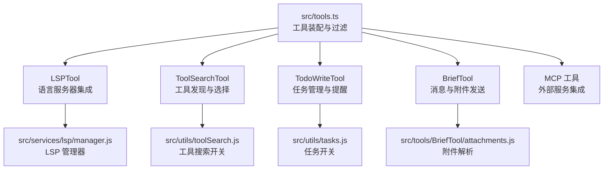
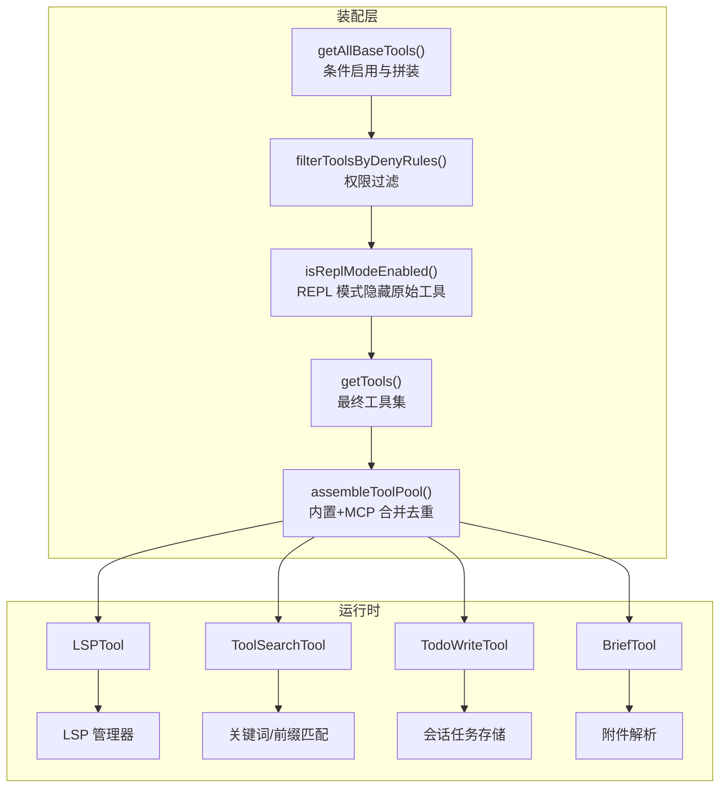
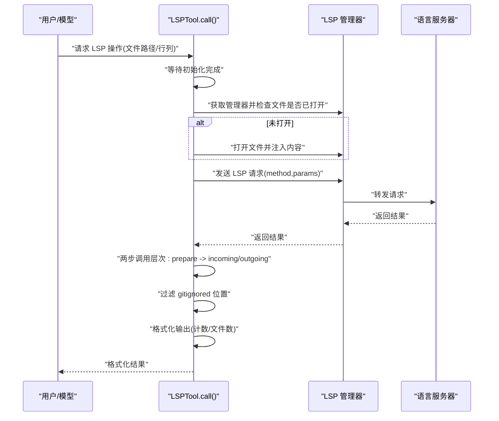
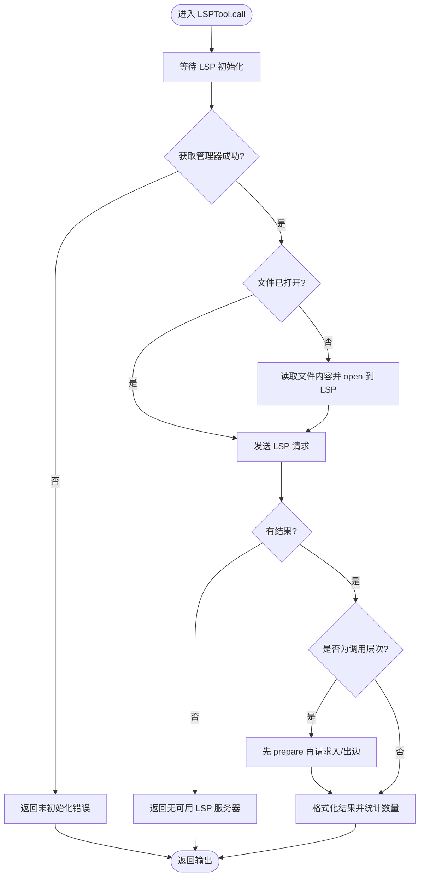
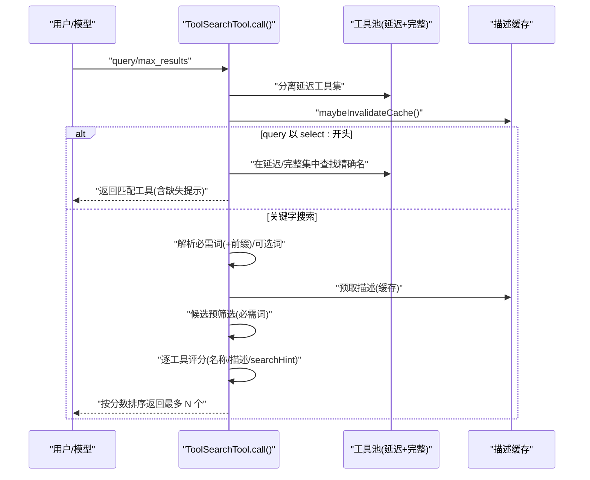
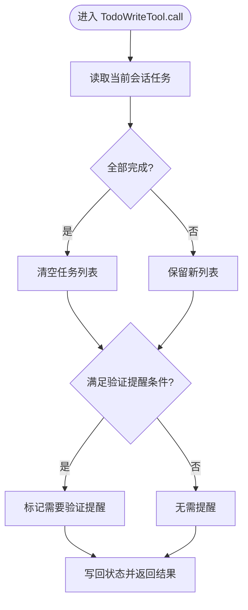
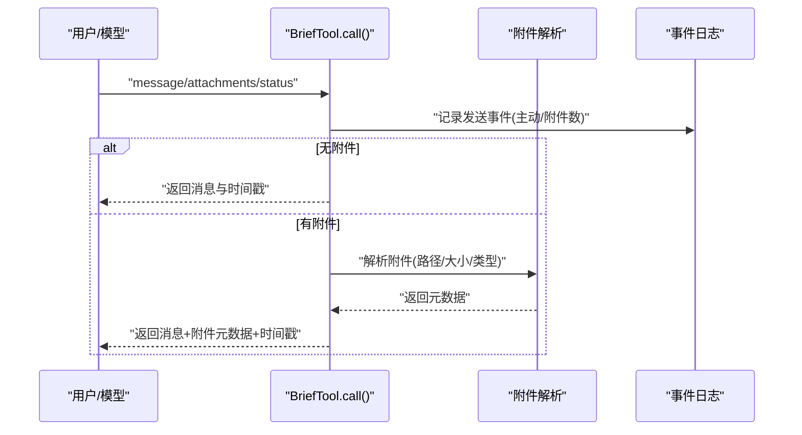
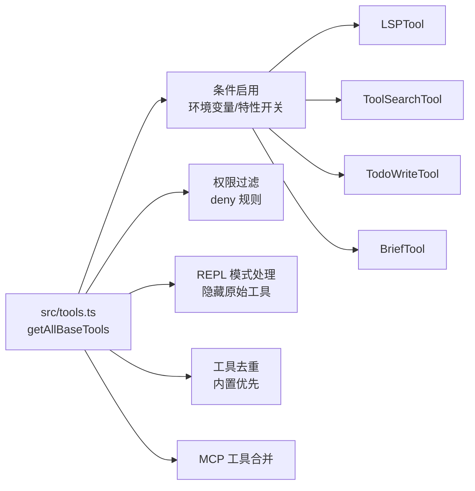

# 开发辅助工具

<cite>
**本文引用的文件**
- [src/tools.ts](file://src/tools.ts)
- [src/tools/LSPTool/LSPTool.ts](file://src/tools/LSPTool/LSPTool.ts)
- [src/tools/ToolSearchTool/ToolSearchTool.ts](file://src/tools/ToolSearchTool/ToolSearchTool.ts)
- [src/tools/TodoWriteTool/TodoWriteTool.ts](file://src/tools/TodoWriteTool/TodoWriteTool.ts)
- [src/tools/BriefTool/BriefTool.ts](file://src/tools/BriefTool/BriefTool.ts)
- [src/services/lsp/manager.js](file://src/services/lsp/manager.js)
- [src/utils/tasks.js](file://src/utils/tasks.js)
- [src/utils/toolSearch.js](file://src/utils/toolSearch.js)
- [src/utils/embeddedTools.js](file://src/utils/embeddedTools.js)
- [src/utils/envUtils.js](file://src/utils/envUtils.js)
- [src/utils/worktreeModeEnabled.js](file://src/utils/worktreeModeEnabled.js)
- [src/utils/agentSwarmsEnabled.js](file://src/utils/agentSwarmsEnabled.js)
- [src/utils/shell/shellToolUtils.js](file://src/utils/shell/shellToolUtils.js)
- [src/utils/permissions/permissions.js](file://src/utils/permissions/permissions.js)
- [src/tools/LSPTool/formatters.js](file://src/tools/LSPTool/formatters.js)
- [src/tools/LSPTool/prompt.js](file://src/tools/LSPTool/prompt.js)
- [src/tools/LSPTool/UI.js](file://src/tools/LSPTool/UI.js)
- [src/tools/LSPTool/schemas.js](file://src/tools/LSPTool/schemas.js)
- [src/tools/ToolSearchTool/prompt.js](file://src/tools/ToolSearchTool/prompt.js)
- [src/tools/TodoWriteTool/constants.js](file://src/tools/TodoWriteTool/constants.js)
- [src/tools/TodoWriteTool/prompt.js](file://src/tools/TodoWriteTool/prompt.js)
- [src/tools/BriefTool/attachments.js](file://src/tools/BriefTool/attachments.js)
- [src/tools/BriefTool/UI.js](file://src/tools/BriefTool/UI.js)
- [src/tools/BriefTool/prompt.js](file://src/tools/BriefTool/prompt.js)
</cite>

## 目录
1. [简介](#简介)
2. [项目结构](#项目结构)
3. [核心组件](#核心组件)
4. [架构总览](#架构总览)
5. [详细组件分析](#详细组件分析)
6. [依赖关系分析](#依赖关系分析)
7. [性能考量](#性能考量)
8. [故障排查指南](#故障排查指南)
9. [结论](#结论)
10. [附录](#附录)

## 简介
本文件面向 Claude Code 的开发辅助工具，系统性阐述以下四类工具的设计与实现要点：
- LSP 工具（LSPTool）：语言服务器协议集成、代码智能（定义跳转、引用查找、悬停信息、符号浏览、调用层次等）。
- 工具搜索工具（ToolSearchTool）：延迟加载工具的发现与选择机制，支持关键字检索与直接选择。
- 待办事项写入工具（TodoWriteTool）：任务管理与提醒，支持会话级任务列表更新与“验证”提示。
- 摘要工具（BriefTool）：向用户发送消息与附件，支持主动/正常两类状态。

文档同时提供使用案例、集成示例、最佳实践与效率提升建议，并通过多种可视化图表帮助理解工具间的交互流程与数据流。

## 项目结构
开发辅助工具位于 src/tools 目录下，统一由 src/tools.ts 汇总导出与装配。该文件负责：
- 统一收集内置工具清单；
- 根据环境变量与特性开关动态启用/禁用工具；
- 过滤权限规则与 REPL 模式限制；
- 合并内置工具与 MCP 工具，保证提示缓存稳定性。

**图表来源**
- [src/tools.ts:193-251](file://src/tools.ts#L193-L251)
- [src/tools.ts:345-367](file://src/tools.ts#L345-L367)

**章节来源**
- [src/tools.ts:193-251](file://src/tools.ts#L193-L251)
- [src/tools.ts:345-367](file://src/tools.ts#L345-L367)

## 核心组件
本节概述四大工具的核心职责、输入输出与关键行为。

- LSPTool
  - 职责：对接语言服务器，执行定义跳转、引用查找、悬停信息、文档/工作区符号、实现跳转、调用层次（入/出边）等操作。
  - 关键点：路径展开、文件存在性与类型校验、权限检查、结果格式化、忽略 .gitignore 的位置过滤、并发安全与只读属性。
- ToolSearchTool
  - 职责：在延迟加载的工具集合中进行关键字搜索或直接选择；支持 + 前缀的“必需词”匹配；对 MCP 工具名称进行解析与评分。
  - 关键点：描述缓存（memoized）、正则边界匹配、候选预筛选、按评分排序返回。
- TodoWriteTool
  - 职责：更新会话级任务列表；当完成 3+ 项且无“验证”相关条目时，附加提醒以引导验证代理。
  - 关键点：会话级键空间、全完成清空策略、可选“验证”提醒。
- BriefTool
  - 职责：向用户发送消息与附件，支持主动/正常两类状态；具备启用门控与附件解析。
  - 关键点：启用门控（构建时特性 + 运行时增长实验 + 用户显式开启）、附件解析与元数据返回。

**章节来源**
- [src/tools/LSPTool/LSPTool.ts:127-422](file://src/tools/LSPTool/LSPTool.ts#L127-L422)
- [src/tools/ToolSearchTool/ToolSearchTool.ts:304-471](file://src/tools/ToolSearchTool/ToolSearchTool.ts#L304-L471)
- [src/tools/TodoWriteTool/TodoWriteTool.ts:31-115](file://src/tools/TodoWriteTool/TodoWriteTool.ts#L31-L115)
- [src/tools/BriefTool/BriefTool.ts:136-204](file://src/tools/BriefTool/BriefTool.ts#L136-L204)

## 架构总览
下图展示工具装配与运行时决策的关键节点：工具池生成、权限过滤、REPL 模式处理、MCP 工具合并与去重、以及 LSP/任务/摘要工具的独立职责。

**图表来源**
- [src/tools.ts:193-251](file://src/tools.ts#L193-L251)
- [src/tools.ts:262-269](file://src/tools.ts#L262-L269)
- [src/tools.ts:312-327](file://src/tools.ts#L312-L327)
- [src/tools.ts:345-367](file://src/tools.ts#L345-L367)

## 详细组件分析

### LSP 工具（LSPTool）
LSPTool 将用户请求映射到标准 LSP 方法，确保文件在 LSP 侧打开后再发起请求，并对结果进行格式化与过滤（如忽略 .gitignore 的位置）。其核心流程如下：

- 输入参数包括操作类型、文件路径（绝对/相对）、行列坐标（1 基）。
- 输出包含操作名、格式化结果文本、文件路径、结果数量与文件数量统计。
- 特殊处理：调用层次（入/出边）需要先 prepare 再请求具体边；对位置型结果应用 .gitignore 过滤；大文件限制（默认 10MB）。

**图表来源**
- [src/tools/LSPTool/LSPTool.ts:224-414](file://src/tools/LSPTool/LSPTool.ts#L224-L414)
- [src/tools/LSPTool/LSPTool.ts:427-513](file://src/tools/LSPTool/LSPTool.ts#L427-L513)
- [src/tools/LSPTool/LSPTool.ts:556-611](file://src/tools/LSPTool/LSPTool.ts#L556-L611)

**章节来源**
- [src/tools/LSPTool/LSPTool.ts:127-422](file://src/tools/LSPTool/LSPTool.ts#L127-L422)
- [src/services/lsp/manager.js](file://src/services/lsp/manager.js)

### 工具搜索工具（ToolSearchTool）
ToolSearchTool 提供两种查询模式：
- 直接选择：select:toolA[,toolB,...]，支持已在加载或延迟加载的工具。
- 关键字搜索：基于工具名拆分、描述与 searchHint 的多维匹配，必要词（+term）强制包含，按评分降序返回。

- 名称解析：MCP 工具（mcp__server__action）与常规工具（CamelCase）分别处理。
- 评分权重：名称精确匹配 > 名称包含 > searchHint 匹配 > 描述匹配。
- 缓存：描述缓存键基于当前延迟工具集合，变化时自动失效。

**图表来源**
- [src/tools/ToolSearchTool/ToolSearchTool.ts:328-434](file://src/tools/ToolSearchTool/ToolSearchTool.ts#L328-L434)
- [src/tools/ToolSearchTool/ToolSearchTool.ts:132-161](file://src/tools/ToolSearchTool/ToolSearchTool.ts#L132-L161)
- [src/tools/ToolSearchTool/ToolSearchTool.ts:186-302](file://src/tools/ToolSearchTool/ToolSearchTool.ts#L186-L302)

**章节来源**
- [src/tools/ToolSearchTool/ToolSearchTool.ts:304-471](file://src/tools/ToolSearchTool/ToolSearchTool.ts#L304-L471)
- [src/utils/toolSearch.js](file://src/utils/toolSearch.js)

### 待办事项写入工具（TodoWriteTool）
TodoWriteTool 更新会话级任务列表，并在特定条件下附加“验证”提醒，以促使后续验证流程。

- 会话键：agentId 或会话 ID，避免跨会话覆盖。
- 清空策略：全完成时清空，否则保留最新列表。
- 验证提醒：在主线程代理、3+ 完成项、无“验证”相关条目时触发。

**图表来源**
- [src/tools/TodoWriteTool/TodoWriteTool.ts:65-103](file://src/tools/TodoWriteTool/TodoWriteTool.ts#L65-L103)
- [src/tools/TodoWriteTool/TodoWriteTool.ts:76-86](file://src/tools/TodoWriteTool/TodoWriteTool.ts#L76-L86)

**章节来源**
- [src/tools/TodoWriteTool/TodoWriteTool.ts:31-115](file://src/tools/TodoWriteTool/TodoWriteTool.ts#L31-L115)
- [src/utils/tasks.js](file://src/utils/tasks.js)

### 摘要工具（BriefTool）
BriefTool 用于向用户发送消息与附件，支持主动/正常两类状态，并记录事件指标。

- 启用门控：构建时特性（KAIROS/KAIROS_BRIEF）+ 运行时增长实验 + 用户显式开启。
- 附件：支持图片/日志/差异/截图等，解析后返回路径、大小、是否图片等元信息。
- 输出：工具结果块参数仅包含“已发送”的简要提示，实际渲染由 UI 层负责。

**图表来源**
- [src/tools/BriefTool/BriefTool.ts:186-203](file://src/tools/BriefTool/BriefTool.ts#L186-L203)
- [src/tools/BriefTool/attachments.js](file://src/tools/BriefTool/attachments.js)

**章节来源**
- [src/tools/BriefTool/BriefTool.ts:136-204](file://src/tools/BriefTool/BriefTool.ts#L136-L204)

## 依赖关系分析
工具装配与过滤链路如下：

- 条件启用：如 ENABLE_LSP_TOOL、WORKTREE_MODE、AGENT_SWARMS、WEB_BROWSER_TOOL 等。
- 权限过滤：根据 deny 规则屏蔽工具，支持 MCP 服务器前缀规则。
- REPL 模式：隐藏原始工具，仅允许 REPL 包裹的工具直接使用。
- 去重策略：内置工具优先，MCP 工具同名时被内置覆盖，保持提示缓存稳定。

**图表来源**
- [src/tools.ts:193-251](file://src/tools.ts#L193-L251)
- [src/tools.ts:262-269](file://src/tools.ts#L262-L269)
- [src/tools.ts:312-327](file://src/tools.ts#L312-L327)
- [src/tools.ts:345-367](file://src/tools.ts#L345-L367)

**章节来源**
- [src/tools.ts:193-251](file://src/tools.ts#L193-L251)
- [src/tools.ts:262-269](file://src/tools.ts#L262-L269)
- [src/tools.ts:312-327](file://src/tools.ts#L312-L327)
- [src/tools.ts:345-367](file://src/tools.ts#L345-L367)

## 性能考量
- LSPTool
  - 文件大小限制：超过阈值（默认 10MB）直接拒绝，避免 LSP 服务器压力。
  - 打开文件策略：仅在未打开时读取并注入内容，减少不必要的 I/O。
  - 结果过滤：对位置型结果批量过滤 .gitignore 文件，降低无关结果噪声。
- ToolSearchTool
  - 描述缓存：基于工具名的 memoized 描述，避免重复计算；当延迟工具集合变化时自动失效。
  - 正则预编译：按查询词一次性编译边界正则，减少重复构造成本。
  - 候选预筛选：先用“必需词”过滤候选，再对候选评分，降低整体计算量。
- TodoWriteTool
  - 会话级存储：通过键空间隔离不同 agent/会话，避免全局锁竞争。
  - 清空策略：全完成即清空，减少后续渲染与通知开销。
- BriefTool
  - 附件解析：异步解析并返回元数据，避免阻塞主线程；可选字段设计便于恢复会话时兼容。

[本节为通用指导，不直接分析具体文件，故无章节来源]

## 故障排查指南
- LSPTool
  - “无可用 LSP 服务器”：确认文件类型是否受支持；检查 LSP 初始化状态与文件打开情况；关注大文件限制。
  - 结果为空：确认 .gitignore 是否过滤了所有位置；检查行列坐标是否为 1 基。
  - 权限问题：检查读取权限与 UNC 路径安全策略。
- ToolSearchTool
  - 无匹配：检查查询词是否包含必需词；确认延迟工具集合是否正确；查看描述缓存是否过期。
  - MCP 工具不可见：确认 MCP 服务器连接状态；等待连接完成后工具才会出现在延迟集合中。
- TodoWriteTool
  - 任务未更新：确认会话键是否正确；检查全完成清空逻辑；核对 agentId 是否为空。
  - 验证提醒未出现：确认满足条件（主线程、3+ 完成项、无“验证”相关条目）。
- BriefTool
  - 附件解析失败：检查路径有效性与可访问性；确认附件类型是否受支持。
  - 工具不可用：确认启用门控（构建时特性 + 运行时开关 + 用户显式开启）。

**章节来源**
- [src/tools/LSPTool/LSPTool.ts:224-414](file://src/tools/LSPTool/LSPTool.ts#L224-L414)
- [src/tools/ToolSearchTool/ToolSearchTool.ts:328-434](file://src/tools/ToolSearchTool/ToolSearchTool.ts#L328-L434)
- [src/tools/TodoWriteTool/TodoWriteTool.ts:65-103](file://src/tools/TodoWriteTool/TodoWriteTool.ts#L65-L103)
- [src/tools/BriefTool/BriefTool.ts:186-203](file://src/tools/BriefTool/BriefTool.ts#L186-L203)

## 结论
四大工具围绕“代码智能、工具发现、任务管理、消息传递”四个维度协同工作：LSPTool 提供底层语言服务器能力，ToolSearchTool 实现延迟工具的高效发现与选择，TodoWriteTool 管理会话任务并提供验证提醒，BriefTool 则作为用户可见的输出通道。通过统一的装配与过滤机制，系统在保证安全性与性能的同时，提供了灵活可扩展的开发辅助能力。

[本节为总结性内容，不直接分析具体文件，故无章节来源]

## 附录

### 使用案例与集成示例
- LSP 工具
  - 在编辑器中定位函数定义、查找引用、查看悬停信息、浏览文档/工作区符号、查看调用层次。
  - 示例路径：[LSPTool 输入/输出与方法映射:140-148](file://src/tools/LSPTool/LSPTool.ts#L140-L148)
- 工具搜索工具
  - 使用 select: 直接选择已知工具；或使用关键字搜索（支持 + 必需词）。
  - 示例路径：[直接选择与关键字搜索:358-434](file://src/tools/ToolSearchTool/ToolSearchTool.ts#L358-L434)
- 待办事项写入工具
  - 更新任务列表；在完成 3+ 项且无验证条目时，接收“验证”提醒提示。
  - 示例路径：[任务更新与验证提醒:65-103](file://src/tools/TodoWriteTool/TodoWriteTool.ts#L65-L103)
- 摘要工具
  - 发送消息与附件；区分主动/正常两类状态。
  - 示例路径：[消息发送与附件解析:186-203](file://src/tools/BriefTool/BriefTool.ts#L186-L203)

### 最佳实践与效率提升建议
- 工具装配
  - 使用 getTools() 获取内置工具集合，assembleToolPool() 合并 MCP 工具并去重，确保提示缓存稳定。
  - 示例路径：[工具装配与合并:345-367](file://src/tools.ts#L345-L367)
- LSP 工具
  - 预先打开文件以减少首次请求延迟；合理设置文件大小阈值；对位置型结果应用 .gitignore 过滤。
  - 示例路径：[文件打开与过滤:261-278](file://src/tools/LSPTool/LSPTool.ts#L261-L278)
- 工具搜索
  - 使用 + 前缀表达“必需词”，提高检索准确性；利用描述缓存减少重复计算。
  - 示例路径：[必需词与缓存:220-233](file://src/tools/ToolSearchTool/ToolSearchTool.ts#L220-L233)
- 任务管理
  - 全部完成后清空任务列表，减少后续负担；在 3+ 完成项且无验证条目时，使用验证提醒。
  - 示例路径：[清空策略与验证提醒:69-86](file://src/tools/TodoWriteTool/TodoWriteTool.ts#L69-L86)
- 消息传递
  - 明确主动/正常两类状态；尽量附带必要附件以提升信息密度。
  - 示例路径：[状态与附件:31-35](file://src/tools/BriefTool/BriefTool.ts#L31-L35)