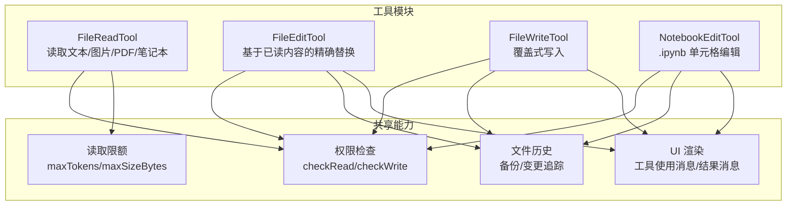
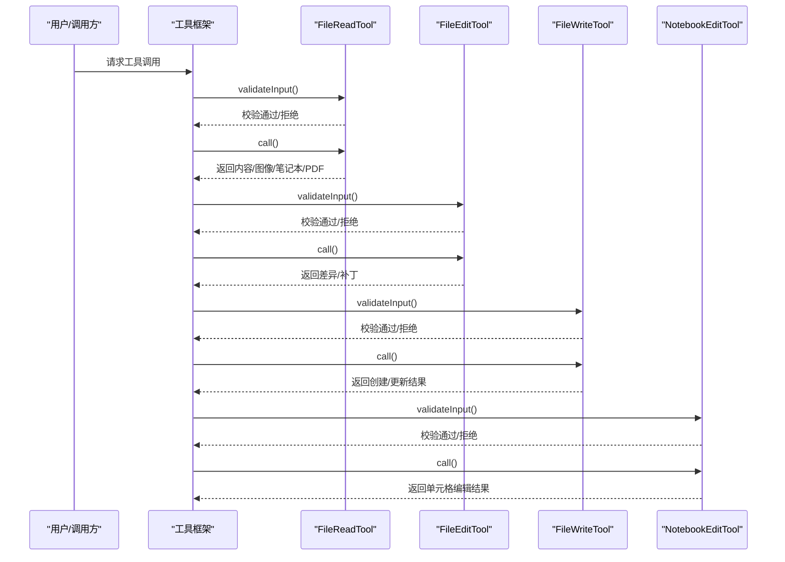
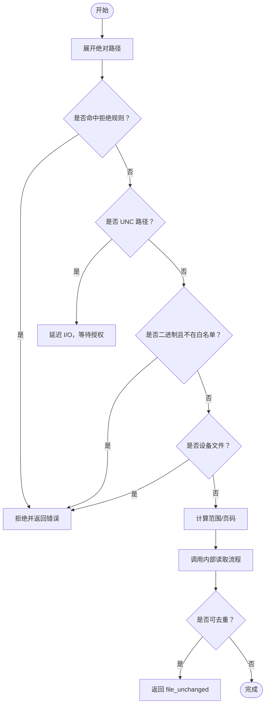
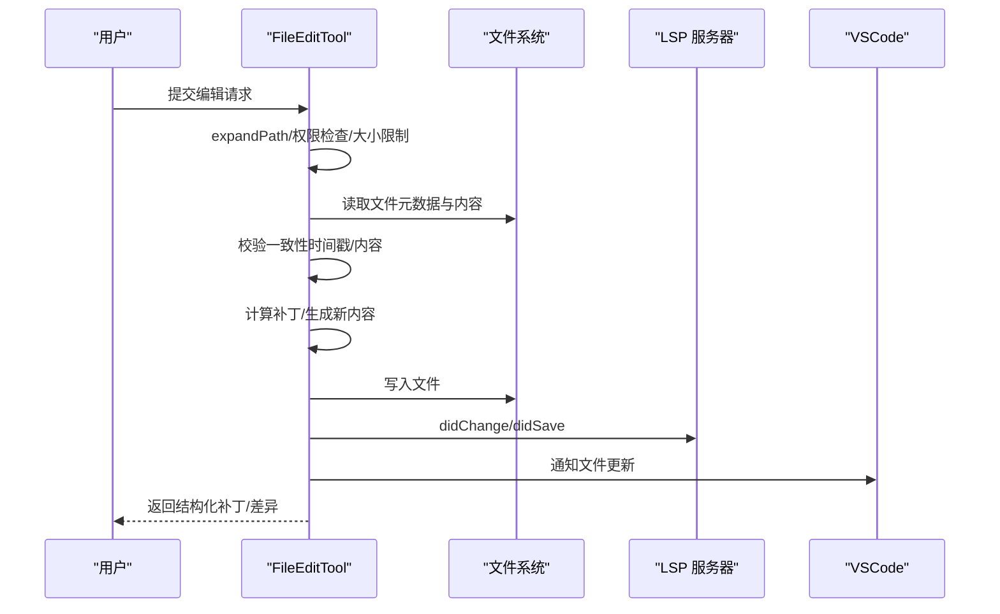
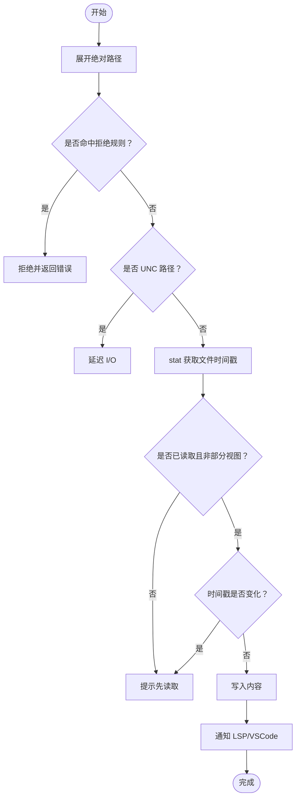
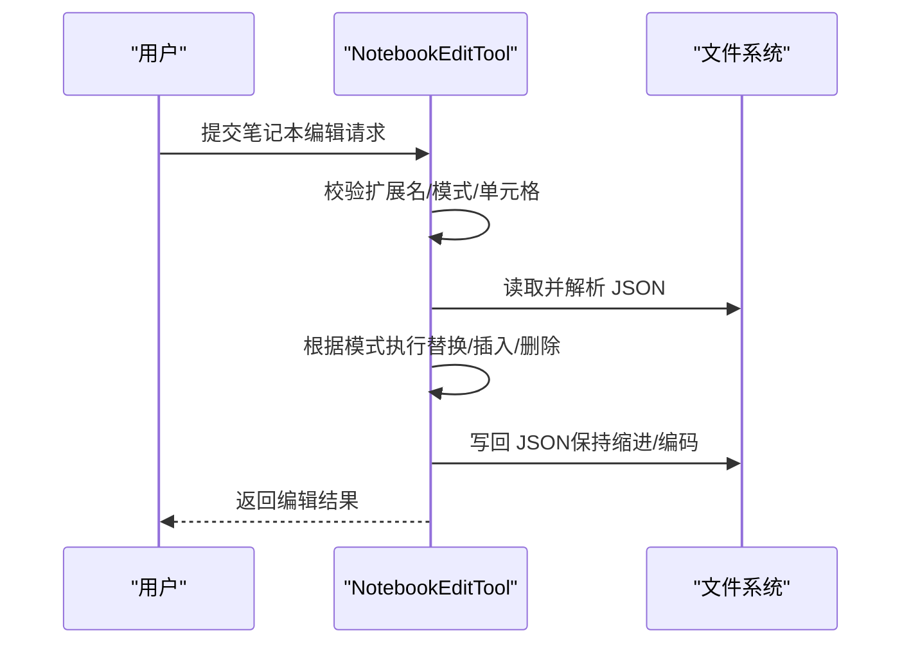
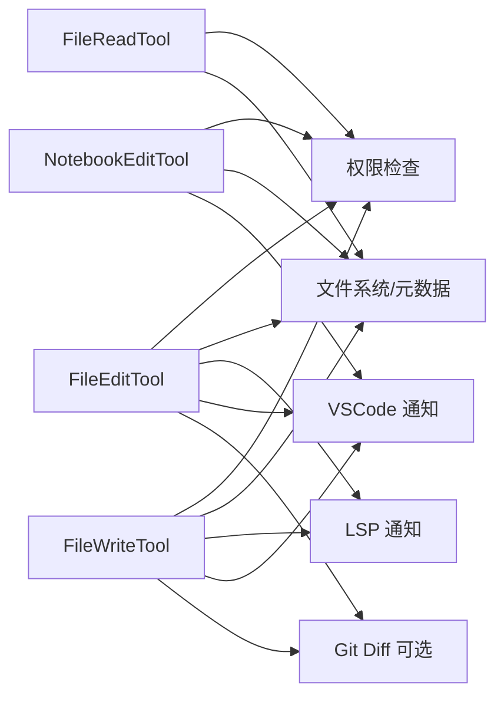

# 文件操作工具

<cite>
**本文引用的文件**
- [FileReadTool.ts](file://src/tools/FileReadTool/FileReadTool.ts)
- [limits.ts](file://src/tools/FileReadTool/limits.ts)
- [FileEditTool.ts](file://src/tools/FileEditTool/FileEditTool.ts)
- [types.ts](file://src/tools/FileEditTool/types.ts)
- [FileWriteTool.ts](file://src/tools/FileWriteTool/FileWriteTool.ts)
- [prompt.ts](file://src/tools/FileWriteTool/prompt.ts)
- [NotebookEditTool.ts](file://src/tools/NotebookEditTool/NotebookEditTool.ts)
- [prompt.ts](file://src/tools/NotebookEditTool/prompt.ts)
</cite>

## 目录
1. [简介](#简介)
2. [项目结构](#项目结构)
3. [核心组件](#核心组件)
4. [架构总览](#架构总览)
5. [详细组件分析](#详细组件分析)
6. [依赖关系分析](#依赖关系分析)
7. [性能考量](#性能考量)
8. [故障排查指南](#故障排查指南)
9. [结论](#结论)
10. [附录](#附录)

## 简介
本文件面向 Claude Code 的文件操作工具集，系统性梳理以下工具的能力边界、参数配置、权限与安全限制，并提供使用流程与最佳实践：  
- 文件读取工具（FileReadTool）：支持文本、图片、PDF、Jupyter Notebook 的读取；具备范围读取与分页读取能力；内置去重与令牌上限校验；对二进制文件有扩展名白名单策略；支持 UNC 路径安全检查与设备文件阻断。  
- 文件编辑工具（FileEditTool）：在已读取基础上进行精确替换，支持“全部替换”或单次替换；严格校验文件未被外部修改；支持技能发现与条件技能激活；写入前后通知 LSP 与 VSCode；可选生成 Git Diff。  
- 文件写入工具（FileWriteTool）：覆盖式写入，要求先读取再写入；对现有文件执行一致性校验；写入后更新读取时间戳；支持 Git Diff；明确禁止创建通用文档与 README 文件。  
- 笔记本编辑工具（NotebookEditTool）：针对 .ipynb 的单元格级编辑，支持替换、插入、删除三种模式；对 JSON 校验与单元格定位进行严格验证；写回时重置代码单元执行状态。

## 项目结构
四个工具均位于 src/tools 下的独立子目录中，采用统一的工具框架封装（buildTool），并通过各自的输入/输出 Schema、权限检查、UI 渲染与调用逻辑实现差异化能力。

图表来源
- [FileReadTool.ts:337-718](file://src/tools/FileReadTool/FileReadTool.ts#L337-L718)
- [FileEditTool.ts:86-595](file://src/tools/FileEditTool/FileEditTool.ts#L86-L595)
- [FileWriteTool.ts:94-434](file://src/tools/FileWriteTool/FileWriteTool.ts#L94-L434)
- [NotebookEditTool.ts:90-490](file://src/tools/NotebookEditTool/NotebookEditTool.ts#L90-L490)

章节来源
- [FileReadTool.ts:337-718](file://src/tools/FileReadTool/FileReadTool.ts#L337-L718)
- [FileEditTool.ts:86-595](file://src/tools/FileEditTool/FileEditTool.ts#L86-L595)
- [FileWriteTool.ts:94-434](file://src/tools/FileWriteTool/FileWriteTool.ts#L94-L434)
- [NotebookEditTool.ts:90-490](file://src/tools/NotebookEditTool/NotebookEditTool.ts#L90-L490)

## 核心组件
- FileReadTool：只读工具，支持多格式读取与范围读取；内置去重与令牌上限校验；对二进制文件有扩展名白名单；对设备文件与 UNC 路径进行安全检查。
- FileEditTool：在已读取基础上进行精确替换；严格校验文件未被外部修改；写入前后通知 LSP 与 VSCode；可选生成 Git Diff；对设置文件与团队内存敏感内容进行额外校验。
- FileWriteTool：覆盖式写入；要求先读取再写入；对现有文件执行一致性校验；写入后更新读取时间戳；明确禁止创建通用文档与 README 文件。
- NotebookEditTool：针对 .ipynb 的单元格级编辑；支持替换、插入、删除；对 JSON 校验与单元格定位进行严格验证；写回时重置代码单元执行状态。

章节来源
- [FileReadTool.ts:337-718](file://src/tools/FileReadTool/FileReadTool.ts#L337-L718)
- [FileEditTool.ts:86-595](file://src/tools/FileEditTool/FileEditTool.ts#L86-L595)
- [FileWriteTool.ts:94-434](file://src/tools/FileWriteTool/FileWriteTool.ts#L94-L434)
- [NotebookEditTool.ts:90-490](file://src/tools/NotebookEditTool/NotebookEditTool.ts#L90-L490)

## 架构总览
四个工具共享统一的工具框架与权限体系，通过 ToolDef 接口注册，遵循相同的生命周期钩子（validateInput → call → mapToolResultToToolResultBlockParam）。读取工具负责内容获取与缓存去重；编辑/写入工具负责一致性校验与原子写入；笔记本工具负责结构化 JSON 的解析与写回。

图表来源
- [FileReadTool.ts:418-651](file://src/tools/FileReadTool/FileReadTool.ts#L418-L651)
- [FileEditTool.ts:137-362](file://src/tools/FileEditTool/FileEditTool.ts#L137-L362)
- [FileWriteTool.ts:153-222](file://src/tools/FileWriteTool/FileWriteTool.ts#L153-L222)
- [NotebookEditTool.ts:176-294](file://src/tools/NotebookEditTool/NotebookEditTool.ts#L176-L294)

## 详细组件分析

### 文件读取工具（FileReadTool）
- 功能特性
  - 多格式支持：文本、图片、PDF、Jupyter Notebook；对 PDF 支持分页读取与页面提取；对图片进行尺寸与编码处理。
  - 范围读取：通过 offset/limit 实现大文件分段读取；对笔记本与文本读取启用去重（file_unchanged）以节省 token。
  - 安全与权限：UNC 路径延迟文件系统操作；设备文件阻断；二进制文件扩展名校验（白名单含 PDF、图片、SVG）。
  - 限额与令牌：maxSizeBytes（总文件大小）与 maxTokens（输出令牌数）双限；支持环境变量与实验开关覆盖。
  - 错误提示：ENOENT 时尝试替代 macOS 截图路径；提供相似文件与当前工作目录建议。
- 参数配置
  - file_path：绝对路径
  - offset：起始行号（用于大文件分段）
  - limit：读取行数
  - pages：PDF 分页范围（如 "1-5","3"）
- 权限与安全
  - 基于通配符匹配的权限匹配器；deny 规则直接拒绝；UNC 路径不触发 I/O，待授权后再执行。
  - 设备文件阻断列表（/dev/zero,/proc/self/fd/0 等）；macOS 截图路径兼容（空格与窄空格）。
- 错误处理
  - 令牌超限抛出 MaxFileReadTokenExceededError；ENOENT 提供友好提示与替代路径尝试。
- 最佳实践
  - 对大文件优先使用 offset/limit；对 PDF 使用 pages 控制页数；避免一次性读取超过 maxTokens 的内容。

图表来源
- [FileReadTool.ts:418-494](file://src/tools/FileReadTool/FileReadTool.ts#L418-L494)
- [limits.ts:53-92](file://src/tools/FileReadTool/limits.ts#L53-L92)

章节来源
- [FileReadTool.ts:337-718](file://src/tools/FileReadTool/FileReadTool.ts#L337-L718)
- [limits.ts:1-93](file://src/tools/FileReadTool/limits.ts#L1-L93)

### 文件编辑工具（FileEditTool）
- 功能特性
  - 基于已读内容的精确替换；支持 replace_all 控制是否全部替换；对多处匹配进行交互确认。
  - 一致性校验：若文件自上次读取后被外部修改（时间戳或内容变化），拒绝写入。
  - 写入行为：原子读改写；通知 LSP 与 VSCode；可选生成 Git Diff；更新 readFileState 时间戳。
  - 安全与合规：禁止向团队内存文件写入敏感信息；对设置文件进行额外校验。
- 参数配置
  - file_path：绝对路径
  - old_string：要替换的文本
  - new_string：替换后的文本
  - replace_all：是否全部替换（默认 false）
- 权限与安全
  - 写权限检查；UNC 路径延迟 I/O；最大文件大小限制（1GiB）防止 OOM。
- 错误处理
  - 旧字符串与新字符串相同则提示无变更；找不到目标字符串需提供更上下文；多处匹配但未开启 replace_all 需交互确认。
- 最佳实践
  - 先使用 FileReadTool 读取并理解上下文；提供足够上下文以唯一定位目标字符串；谨慎使用 replace_all。

图表来源
- [FileEditTool.ts:387-574](file://src/tools/FileEditTool/FileEditTool.ts#L387-L574)
- [types.ts:62-83](file://src/tools/FileEditTool/types.ts#L62-L83)

章节来源
- [FileEditTool.ts:86-595](file://src/tools/FileEditTool/FileEditTool.ts#L86-L595)
- [types.ts:1-86](file://src/tools/FileEditTool/types.ts#L1-L86)

### 文件写入工具（FileWriteTool）
- 功能特性
  - 覆盖式写入：对现有文件执行一致性校验后写入；新文件直接创建。
  - 一致性校验：若文件自上次读取后被外部修改（时间戳或内容变化），拒绝写入。
  - 写入行为：原子写入；通知 LSP 与 VSCode；可选生成 Git Diff；更新 readFileState 时间戳。
  - 禁止行为：明确禁止创建通用文档与 README 文件（除非用户显式要求）。
- 参数配置
  - file_path：绝对路径（必须为绝对路径）
  - content：要写入的完整内容
- 权限与安全
  - 写权限检查；UNC 路径延迟 I/O；一致性校验确保不会覆盖外部修改。
- 错误处理
  - 未读取即写入会失败；存在外部修改会失败；ENOENT 时视为新文件创建。
- 最佳实践
  - 优先使用 FileEditTool 进行增量修改；仅在需要完全重写时使用本工具。

图表来源
- [FileWriteTool.ts:153-222](file://src/tools/FileWriteTool/FileWriteTool.ts#L153-L222)
- [prompt.ts:10-18](file://src/tools/FileWriteTool/prompt.ts#L10-L18)

章节来源
- [FileWriteTool.ts:94-434](file://src/tools/FileWriteTool/FileWriteTool.ts#L94-L434)
- [prompt.ts:1-19](file://src/tools/FileWriteTool/prompt.ts#L1-L19)

### 笔记本编辑工具（NotebookEditTool）
- 功能特性
  - 针对 .ipynb 的单元格级编辑：替换、插入、删除三种模式；支持指定 cell_id 或 cell_type。
  - 严格校验：JSON 合法性、单元格存在性、索引或 ID 解析；写回前备份；写回后重置代码单元执行状态。
  - 写入行为：保持原编码与行尾风格；更新 readFileState。
- 参数配置
  - notebook_path：绝对路径
  - cell_id：目标单元格 ID 或索引（插入模式可省略）
  - new_source：新的单元格源码/Markdown 文本
  - cell_type：当插入新单元格时必填（code/markdown）
  - edit_mode：replace/insert/delete（默认 replace）
- 权限与安全
  - 写权限检查；仅允许 .ipynb 文件；要求先读取再写入。
- 错误处理
  - 非 .ipynb 文件、非法 edit_mode、缺少 cell_id、单元格不存在等均会拒绝。
- 最佳实践
  - 明确指定 cell_id 或使用 insert 模式并提供 cell_type；先读取了解上下文再编辑。

图表来源
- [NotebookEditTool.ts:176-294](file://src/tools/NotebookEditTool/NotebookEditTool.ts#L176-L294)
- [prompt.ts:1-4](file://src/tools/NotebookEditTool/prompt.ts#L1-L4)

章节来源
- [NotebookEditTool.ts:90-490](file://src/tools/NotebookEditTool/NotebookEditTool.ts#L90-L490)
- [prompt.ts:1-4](file://src/tools/NotebookEditTool/prompt.ts#L1-L4)

## 依赖关系分析
- 工具框架：四个工具均通过 buildTool 注册，共享 ToolDef 接口与生命周期钩子。
- 权限系统：FileReadTool 使用 checkReadPermissionForTool，FileEditTool/FileWriteTool 使用 checkWritePermissionForTool，均基于通配符匹配规则。
- 文件系统与元数据：统一使用 getFsImplementation、readFileSyncWithMetadata、writeTextContent 等工具函数。
- LSP/VSCode 集成：编辑/写入工具在写入后通知 LSP didChange/didSave 与 VSCode diff 视图。
- Git Diff：在特定环境下可选生成单文件 Git Diff 并记录事件。

图表来源
- [FileReadTool.ts:398-405](file://src/tools/FileReadTool/FileReadTool.ts#L398-L405)
- [FileEditTool.ts:125-132](file://src/tools/FileEditTool/FileEditTool.ts#L125-L132)
- [FileWriteTool.ts:135-142](file://src/tools/FileWriteTool/FileWriteTool.ts#L135-L142)
- [NotebookEditTool.ts:125-132](file://src/tools/NotebookEditTool/NotebookEditTool.ts#L125-L132)

章节来源
- [FileReadTool.ts:398-405](file://src/tools/FileReadTool/FileReadTool.ts#L398-L405)
- [FileEditTool.ts:125-132](file://src/tools/FileEditTool/FileEditTool.ts#L125-L132)
- [FileWriteTool.ts:135-142](file://src/tools/FileWriteTool/FileWriteTool.ts#L135-L142)
- [NotebookEditTool.ts:125-132](file://src/tools/NotebookEditTool/NotebookEditTool.ts#L125-L132)

## 性能考量
- 读取限额：maxSizeBytes 与 maxTokens 双限，避免一次性传输过大内容；可通过环境变量与实验开关调整。
- 去重优化：FileReadTool 在同一范围内且文件未变化时返回 file_unchanged，减少重复传输与 token 消耗。
- 原子写入：FileEditTool/FileWriteTool 在写入前后进行一致性校验，避免并发写入导致的数据竞争。
- 编码与行尾：统一使用 readFileSyncWithMetadata 获取编码与行尾，写入时保持一致，减少不必要的转换成本。

## 故障排查指南
- 读取失败（ENOENT）
  - 现象：文件不存在
  - 处理：工具会尝试 macOS 截图路径的替代空格形式；并提供相似文件与当前工作目录建议
  - 参考：[FileReadTool.ts:609-650](file://src/tools/FileReadTool/FileReadTool.ts#L609-L650)
- 未读取即写入
  - 现象：编辑/写入工具提示需先读取
  - 处理：先调用 FileReadTool 读取目标文件
  - 参考：[FileEditTool.ts:275-287](file://src/tools/FileEditTool/FileEditTool.ts#L275-L287)、[FileWriteTool.ts:198-206](file://src/tools/FileWriteTool/FileWriteTool.ts#L198-L206)
- 文件被外部修改
  - 现象：时间戳或内容发生变化
  - 处理：重新读取文件后再尝试写入
  - 参考：[FileEditTool.ts:289-311](file://src/tools/FileEditTool/FileEditTool.ts#L289-L311)、[FileWriteTool.ts:198-219](file://src/tools/FileWriteTool/FileWriteTool.ts#L198-L219)
- 令牌超限
  - 现象：输出内容超过 maxTokens
  - 处理：使用 offset/limit 或 pages 分段读取；或降低一次性读取范围
  - 参考：[limits.ts:53-92](file://src/tools/FileReadTool/limits.ts#L53-L92)
- UNC 路径风险
  - 现象：Windows 上 UNC 路径可能触发 SMB 认证泄露
  - 处理：工具延迟 I/O，待授权后再执行
  - 参考：[FileReadTool.ts:461-467](file://src/tools/FileReadTool/FileReadTool.ts#L461-L467)、[FileEditTool.ts:176-181](file://src/tools/FileEditTool/FileEditTool.ts#L176-L181)、[FileWriteTool.ts:179-184](file://src/tools/FileWriteTool/FileWriteTool.ts#L179-L184)

章节来源
- [FileReadTool.ts:609-650](file://src/tools/FileReadTool/FileReadTool.ts#L609-L650)
- [FileEditTool.ts:176-311](file://src/tools/FileEditTool/FileEditTool.ts#L176-L311)
- [FileWriteTool.ts:179-219](file://src/tools/FileWriteTool/FileWriteTool.ts#L179-L219)
- [limits.ts:53-92](file://src/tools/FileReadTool/limits.ts#L53-L92)

## 结论
四个文件操作工具围绕“先读取、后编辑/写入”的原则构建，结合严格的权限与安全检查、一致性校验与可观测性（LSP/VSCode/Git Diff），在保证安全性的同时提供了灵活的文件操作能力。建议优先使用 FileReadTool 了解上下文，再根据场景选择 FileEditTool 或 FileWriteTool；对于 .ipynb 文件，请使用 NotebookEditTool 进行单元格级编辑。

## 附录
- 使用建议
  - 大文件与 PDF：优先使用 offset/limit 或 pages 控制读取范围
  - 增量修改：优先使用 FileEditTool，避免覆盖式写入
  - 笔记本文件：使用 NotebookEditTool，明确 cell_id 与 edit_mode
  - 安全合规：避免向团队内存文件写入敏感信息；遵守文档创建限制