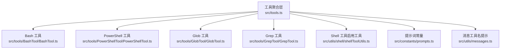
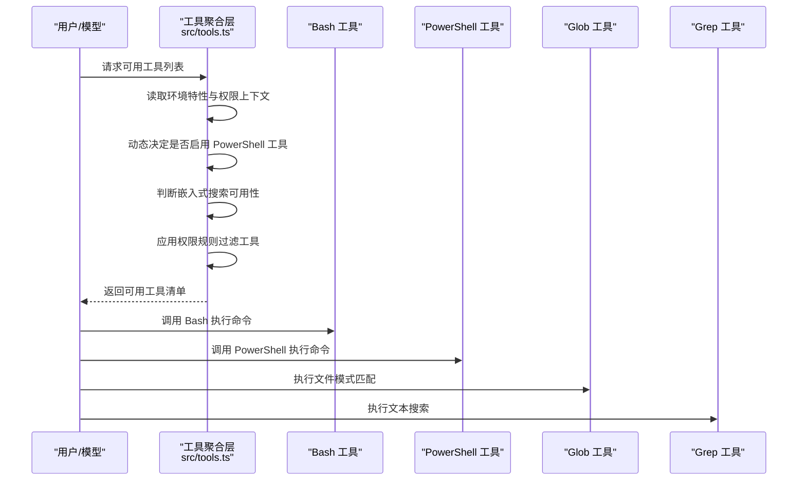
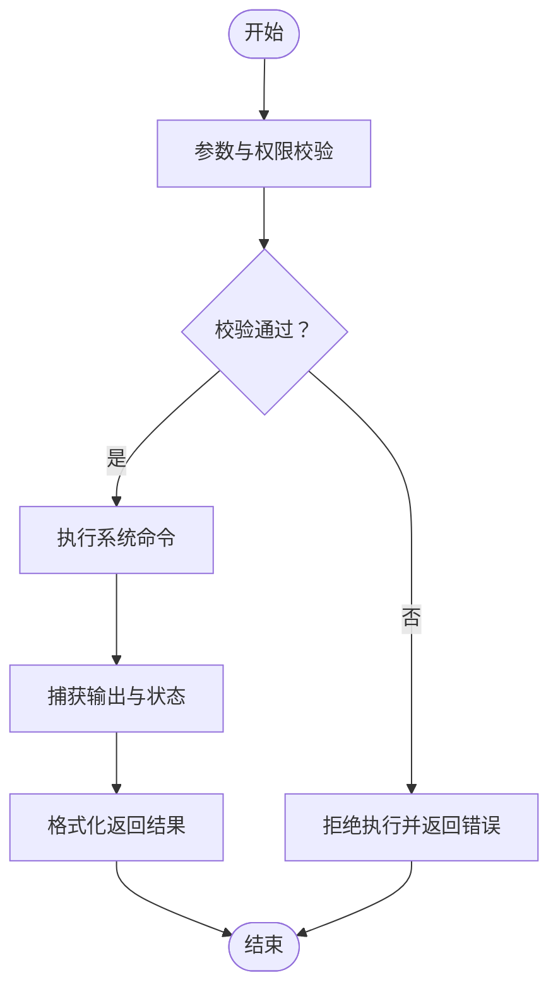
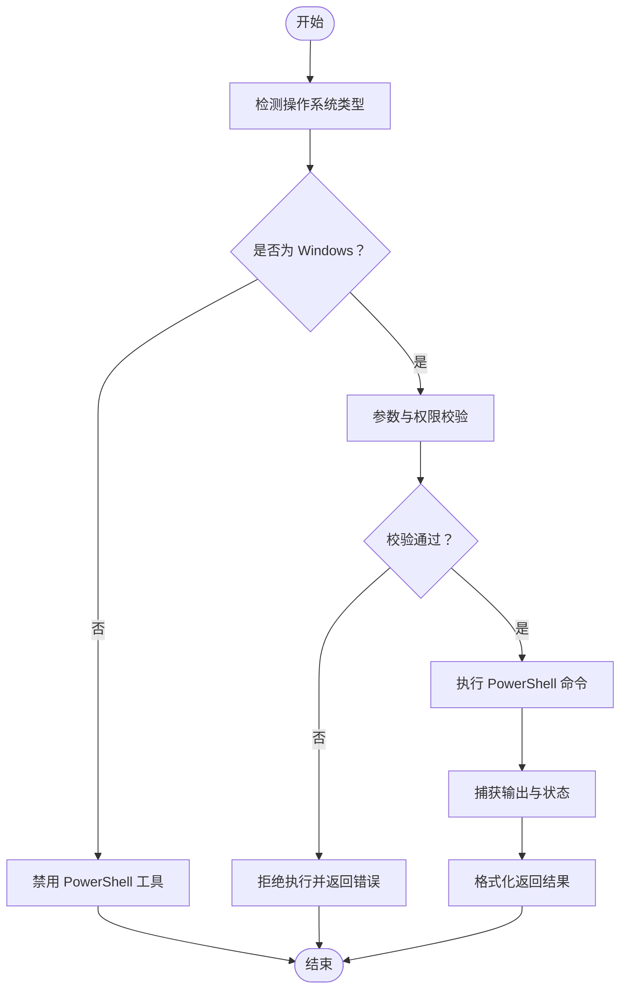
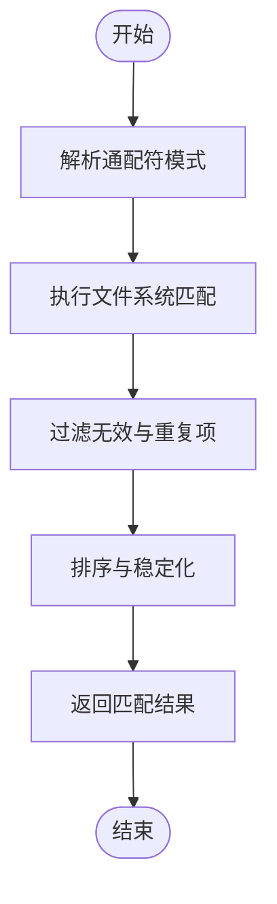
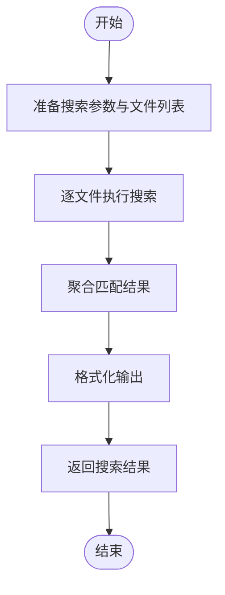
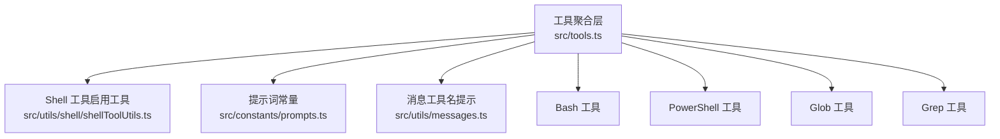

# 系统命令工具

<cite>
**本文引用的文件**
- [src/tools.ts](file://src/tools.ts)
- [src/constants/prompts.ts](file://src/constants/prompts.ts)
- [src/utils/messages.ts](file://src/utils/messages.ts)
- [src/utils/shell/shellToolUtils.ts](file://src/utils/shell/shellToolUtils.ts)
- [src/tools/BashTool/BashTool.ts](file://src/tools/BashTool/BashTool.ts)
- [src/tools/PowerShellTool/PowerShellTool.ts](file://src/tools/PowerShellTool/PowerShellTool.ts)
- [src/tools/GlobTool/GlobTool.ts](file://src/tools/GlobTool/GlobTool.ts)
- [src/tools/GrepTool/GrepTool.ts](file://src/tools/GrepTool/GrepTool.ts)
</cite>

## 目录
1. [简介](#简介)
2. [项目结构](#项目结构)
3. [核心组件](#核心组件)
4. [架构总览](#架构总览)
5. [详细组件分析](#详细组件分析)
6. [依赖关系分析](#依赖关系分析)
7. [性能考量](#性能考量)
8. [故障排查指南](#故障排查指南)
9. [结论](#结论)
10. [附录](#附录)

## 简介
本文件面向 Claude Code 的系统命令工具，重点覆盖以下能力：
- Bash 工具（BashTool）：在受控环境中执行系统命令，支持安全沙箱与权限控制。
- PowerShell 工具（PowerShellTool）：在 Windows 平台执行 PowerShell 命令，具备条件启用与路径校验。
- 文件模式匹配工具（GlobTool）：基于文件通配符进行路径匹配，辅助定位目标文件集合。
- 文本搜索工具（GrepTool）：在文件内容中进行文本检索，支持大小写敏感/不敏感等常见选项。

文档将从系统架构、组件关系、数据流、处理逻辑、集成点、错误处理与性能特征等方面进行深入解析，并提供命令执行示例、参数配置与安全建议。

## 项目结构
系统命令工具由统一入口集中注册与装配，按需启用 Bash、PowerShell、Glob、Grep 等工具。工具注册与装配逻辑位于工具聚合层，具体实现位于各工具目录。

**图表来源**
- [src/tools.ts:193-251](file://src/tools.ts#L193-L251)
- [src/tools.ts:59-59](file://src/tools.ts#L59-L59)
- [src/tools.ts:140-155](file://src/tools.ts#L140-L155)
- [src/constants/prompts.ts:299-309](file://src/constants/prompts.ts#L299-L309)
- [src/utils/messages.ts:3299-3305](file://src/utils/messages.ts#L3299-L3305)

**章节来源**
- [src/tools.ts:193-251](file://src/tools.ts#L193-L251)
- [src/constants/prompts.ts:299-309](file://src/constants/prompts.ts#L299-L309)
- [src/utils/messages.ts:3299-3305](file://src/utils/messages.ts#L3299-L3305)

## 核心组件
- Bash 工具（BashTool）
  - 职责：在受控环境中执行系统命令，支持参数化调用与输出捕获；通过权限与沙箱策略限制潜在风险。
  - 关键点：命令执行前进行权限校验与路径验证；输出结果以结构化方式返回，便于后续处理。
- PowerShell 工具（PowerShellTool）
  - 职责：在 Windows 平台执行 PowerShell 命令，具备条件启用逻辑与平台适配。
  - 关键点：通过启用工具函数判断是否可用；Windows 环境下优先使用 PowerShell 执行器。
- Glob 工具（GlobTool）
  - 职责：根据文件通配符模式匹配文件路径，返回匹配结果列表。
  - 关键点：在嵌入式搜索可用时可被替代，避免重复工具；否则作为独立工具提供。
- Grep 工具（GrepTool）
  - 职责：在文件内容中进行文本搜索，支持大小写敏感/不敏感等常见选项。
  - 关键点：在嵌入式搜索可用时可被替代；否则作为独立工具提供。

**章节来源**
- [src/tools.ts:193-251](file://src/tools.ts#L193-L251)
- [src/tools.ts:59-59](file://src/tools.ts#L59-L59)
- [src/tools.ts:140-155](file://src/tools.ts#L140-L155)

## 架构总览
系统命令工具的装配与启用遵循“统一入口 + 条件装配 + 权限过滤”的设计原则。工具聚合层负责：
- 统一导入与注册内置工具；
- 按环境特性（如嵌入式搜索、工作树模式、REPL 模式等）动态启用或剔除工具；
- 应用权限规则对工具进行屏蔽；
- 在 REPL 模式下隐藏原始工具，仅允许通过虚拟机上下文访问。

**图表来源**
- [src/tools.ts:193-251](file://src/tools.ts#L193-L251)
- [src/tools.ts:271-327](file://src/tools.ts#L271-L327)
- [src/tools.ts:345-367](file://src/tools.ts#L345-L367)

## 详细组件分析

### Bash 工具（BashTool）
- 功能概述
  - 在受控环境中执行系统命令，支持参数化调用与输出捕获。
  - 通过权限与沙箱策略限制潜在风险，确保命令执行符合安全边界。
- 关键实现要点
  - 参数化调用：接收命令字符串与参数数组，构建安全的执行上下文。
  - 输出捕获：捕获标准输出与错误输出，统一格式化返回。
  - 安全与权限：在调用前进行权限校验与路径验证，防止越权与路径注入。
- 使用场景
  - 需要 shell 执行能力的系统级操作（如文件管理、进程查询、系统信息采集等）。
  - 当存在专用工具（如文件读写、任务管理等）时，优先使用专用工具，必要时再回退到 Bash。
- 示例（概念性）
  - 执行系统命令：传入命令字符串与参数数组，返回执行状态与输出。
  - 错误处理：捕获非零退出码与异常，返回结构化错误信息。
- 安全建议
  - 严格限制命令白名单与参数范围；
  - 对输入进行严格的转义与校验；
  - 在沙箱内运行，避免直接访问敏感资源。

**图表来源**
- [src/tools.ts:193-251](file://src/tools.ts#L193-L251)

**章节来源**
- [src/constants/prompts.ts:299-309](file://src/constants/prompts.ts#L299-L309)
- [src/utils/messages.ts:3299-3305](file://src/utils/messages.ts#L3299-L3305)

### PowerShell 工具（PowerShellTool）
- 功能概述
  - 在 Windows 平台执行 PowerShell 命令，具备条件启用与平台适配。
- 关键实现要点
  - 启用判断：通过启用工具函数判断是否可用，避免在不支持的平台上加载。
  - 平台适配：仅在 Windows 环境下有效，其他平台自动禁用。
  - 参数化执行：接收命令字符串与参数数组，构建安全的执行上下文。
- 使用场景
  - Windows 环境下的脚本执行、系统管理、服务查询等。
- 示例（概念性）
  - 执行 PowerShell 命令：传入命令字符串与参数数组，返回执行状态与输出。
  - 错误处理：捕获执行异常与非零退出码，返回结构化错误信息。
- 安全建议
  - 严格限制命令白名单与参数范围；
  - 对输入进行严格的转义与校验；
  - 在沙箱内运行，避免直接访问敏感资源。

**图表来源**
- [src/tools.ts:140-155](file://src/tools.ts#L140-L155)

**章节来源**
- [src/tools.ts:140-155](file://src/tools.ts#L140-L155)

### Glob 工具（GlobTool）
- 功能概述
  - 根据文件通配符模式匹配文件路径，返回匹配结果列表。
- 关键实现要点
  - 模式匹配：支持常见的通配符语法（如星号、问号、范围表达式等）。
  - 结果去重：对匹配结果进行去重与排序，保证稳定性。
  - 嵌入式替代：当嵌入式搜索可用时，该工具可被系统别名替代，避免重复工具。
- 使用场景
  - 快速定位文件集合，如批量处理、清理、统计等。
- 示例（概念性）
  - 匹配文件：传入模式字符串，返回匹配的文件路径列表。
  - 错误处理：捕获无效模式与无匹配结果，返回空列表或结构化错误信息。
- 安全建议
  - 限制模式范围，避免过宽导致大量文件暴露；
  - 对结果进行二次筛选，确保仅处理受信任路径。

**图表来源**
- [src/tools.ts:193-251](file://src/tools.ts#L193-L251)

**章节来源**
- [src/tools.ts:193-251](file://src/tools.ts#L193-L251)

### Grep 工具（GrepTool）
- 功能概述
  - 在文件内容中进行文本搜索，支持大小写敏感/不敏感等常见选项。
- 关键实现要点
  - 搜索算法：支持正则表达式与字面量匹配，提供大小写敏感/不敏感切换。
  - 结果聚合：对每个文件的匹配结果进行聚合，返回结构化输出。
  - 嵌入式替代：当嵌入式搜索可用时，该工具可被系统别名替代，避免重复工具。
- 使用场景
  - 在代码库或日志中快速定位关键字、正则模式或特定片段。
- 示例（概念性）
  - 文本搜索：传入模式与文件列表，返回每个文件的匹配行与上下文。
  - 错误处理：捕获无效模式与无匹配结果，返回空结果或结构化错误信息。
- 安全建议
  - 限制复杂正则表达式，避免性能问题与拒绝服务；
  - 对大文件与二进制文件进行过滤，避免无意义扫描。

**图表来源**
- [src/tools.ts:193-251](file://src/tools.ts#L193-L251)

**章节来源**
- [src/tools.ts:193-251](file://src/tools.ts#L193-L251)

## 依赖关系分析
工具聚合层负责统一装配与过滤工具，关键依赖包括：
- Shell 工具启用工具：用于判断 PowerShell 工具是否可用。
- 提示词常量：用于指导模型优先使用专用工具，必要时再使用 Bash。
- 消息工具名提示：在嵌入式搜索可用时，提示模型使用系统别名（如 find/grep）而非专用工具。

**图表来源**
- [src/tools.ts:140-155](file://src/tools.ts#L140-L155)
- [src/constants/prompts.ts:299-309](file://src/constants/prompts.ts#L299-L309)
- [src/utils/messages.ts:3299-3305](file://src/utils/messages.ts#L3299-L3305)

**章节来源**
- [src/tools.ts:140-155](file://src/tools.ts#L140-L155)
- [src/constants/prompts.ts:299-309](file://src/constants/prompts.ts#L299-L309)
- [src/utils/messages.ts:3299-3305](file://src/utils/messages.ts#L3299-L3305)

## 性能考量
- 嵌入式搜索替代：在嵌入式搜索可用时，系统会将 find/grep 别名为内置工具，从而减少额外工具开销，提升性能与响应速度。
- 工具装配优化：工具聚合层对工具名称进行排序与去重，确保提示缓存稳定性，避免因工具顺序变化导致缓存失效。
- I/O 与扫描范围：Glob 与 Grep 工具应限制扫描范围与文件类型，避免对大型仓库或二进制文件进行无意义扫描。

**章节来源**
- [src/utils/messages.ts:3299-3305](file://src/utils/messages.ts#L3299-L3305)
- [src/tools.ts:345-367](file://src/tools.ts#L345-L367)

## 故障排查指南
- PowerShell 工具不可用
  - 现象：在非 Windows 平台调用 PowerShell 工具失败。
  - 排查：确认启用工具函数返回值；检查操作系统类型与平台适配。
  - 参考
    - [src/tools.ts:140-155](file://src/tools.ts#L140-L155)
- 命令执行失败
  - 现象：Bash 工具返回非零退出码或异常。
  - 排查：检查命令参数与权限；确认路径有效性；查看输出与错误信息。
  - 参考
    - [src/constants/prompts.ts:299-309](file://src/constants/prompts.ts#L299-L309)
- 搜索结果为空
  - 现象：Glob 或 Grep 工具返回空结果。
  - 排查：检查通配符或正则表达式是否正确；确认文件路径与权限；缩小搜索范围。
  - 参考
    - [src/tools.ts:193-251](file://src/tools.ts#L193-L251)

**章节来源**
- [src/tools.ts:140-155](file://src/tools.ts#L140-L155)
- [src/constants/prompts.ts:299-309](file://src/constants/prompts.ts#L299-L309)
- [src/tools.ts:193-251](file://src/tools.ts#L193-L251)

## 结论
系统命令工具通过统一的装配与过滤机制，在保障安全与性能的前提下，为用户提供灵活的系统命令执行能力。Bash 与 PowerShell 工具分别覆盖通用与 Windows 平台场景；Glob 与 Grep 工具提供高效的文件与内容检索能力。在嵌入式搜索可用时，系统会优先采用更高效的方式替代专用工具，进一步优化体验。建议在实际使用中遵循最小权限原则与路径验证策略，确保命令执行的安全与稳定。

## 附录
- 参数配置与使用建议
  - Bash 工具：优先使用专用工具；必要时使用 Bash；严格限制命令与参数范围。
  - PowerShell 工具：仅在 Windows 环境启用；严格限制命令与参数范围。
  - Glob 工具：合理设置通配符模式；限制扫描范围与文件类型。
  - Grep 工具：合理设置大小写敏感与正则表达式；限制扫描范围与文件类型。
- 安全最佳实践
  - 严格权限控制与路径验证；
  - 输入参数转义与校验；
  - 在沙箱内运行命令；
  - 限制复杂正则表达式与大文件扫描；
  - 优先使用嵌入式搜索替代专用工具。