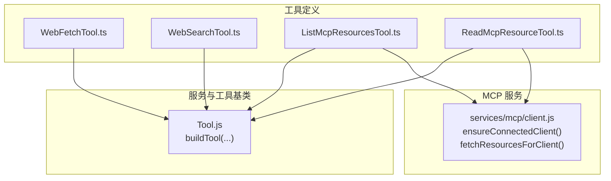
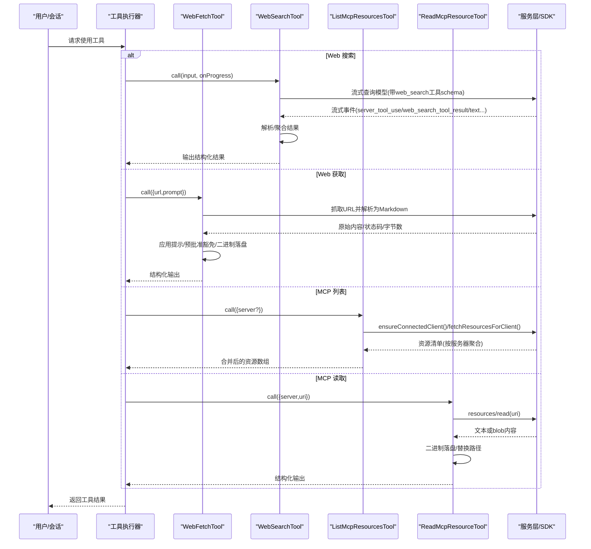
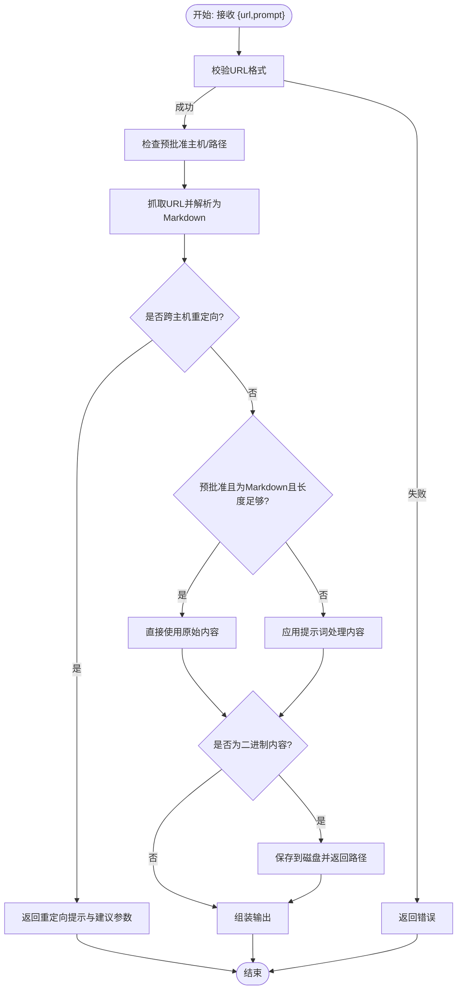
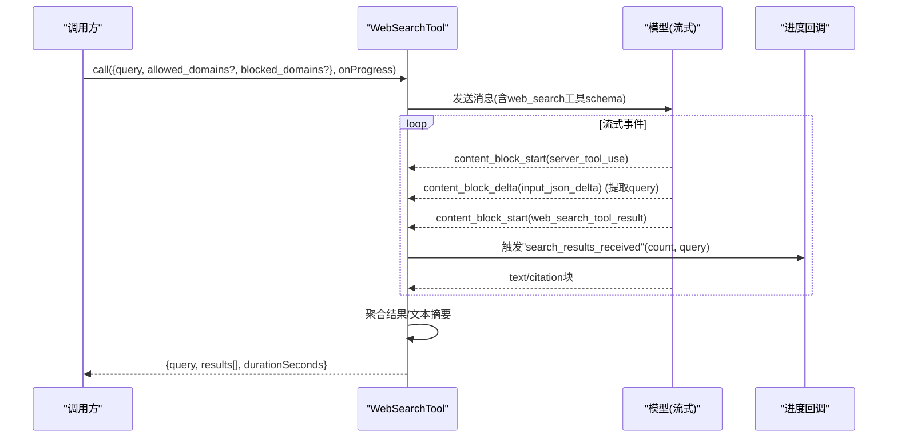
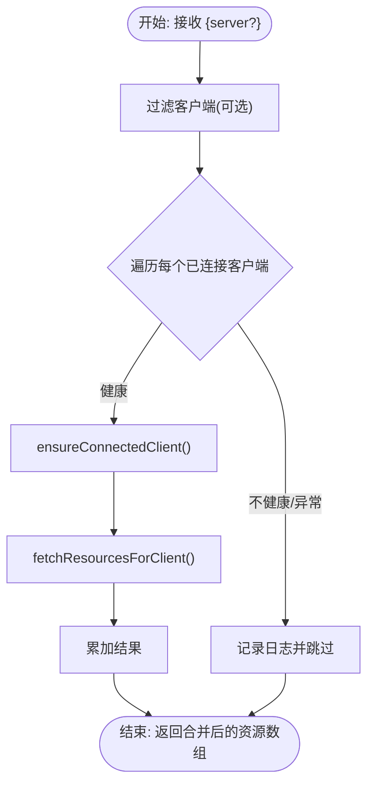
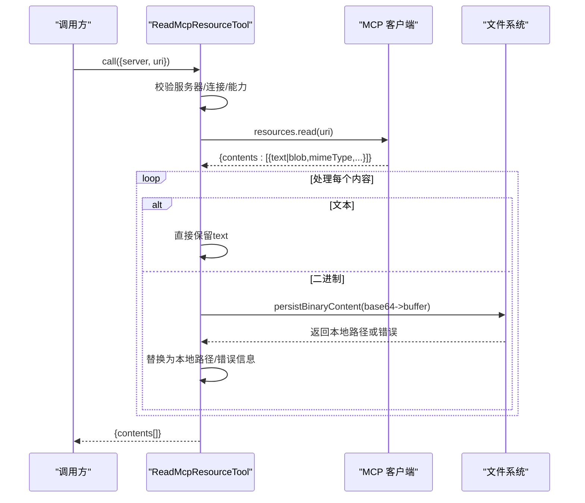
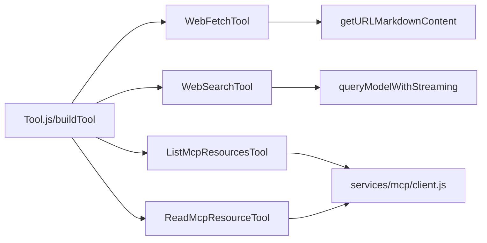

# 网络和Web工具

<cite>
**本文引用的文件**
- [WebFetchTool.ts](file://src/tools/WebFetchTool/WebFetchTool.ts)
- [WebSearchTool.ts](file://src/tools/WebSearchTool/WebSearchTool.ts)
- [ListMcpResourcesTool.ts](file://src/tools/ListMcpResourcesTool/ListMcpResourcesTool.ts)
- [ReadMcpResourceTool.ts](file://src/tools/ReadMcpResourceTool/ReadMcpResourceTool.ts)
</cite>

## 目录
1. [简介](#简介)
2. [项目结构](#项目结构)
3. [核心组件](#核心组件)
4. [架构总览](#架构总览)
5. [详细组件分析](#详细组件分析)
6. [依赖关系分析](#依赖关系分析)
7. [性能考虑](#性能考虑)
8. [故障排查指南](#故障排查指南)
9. [结论](#结论)
10. [附录](#附录)

## 简介
本文件面向 Claude Code 的网络与 Web 工具，系统性梳理以下能力：
- Web 获取工具（WebFetchTool）：网页抓取、内容解析与缓存策略、权限与安全提示、二进制内容落盘与追踪。
- Web 搜索工具（WebSearchTool）：与模型侧 Web 搜索工具的集成方式、流式进度回调、结果聚合与输出格式化。
- MCP 资源列表工具（ListMcpResourcesTool）与 MCP 资源读取工具（ReadMcpResourceTool）：在 Model Context Protocol（MCP）中的资源发现与读取流程、连接健康检查与容错、二进制内容持久化。

文档同时提供网络请求示例思路、错误处理与性能优化建议，并总结网络安全与隐私保护最佳实践。

## 项目结构
网络与 Web 工具位于 src/tools 下，分别实现独立的 ToolDef 定义与调用逻辑；MCP 工具通过服务层封装与 SDK 进行交互。

图表来源
- [WebFetchTool.ts:1-319](file://src/tools/WebFetchTool/WebFetchTool.ts#L1-L319)
- [WebSearchTool.ts:1-436](file://src/tools/WebSearchTool/WebSearchTool.ts#L1-L436)
- [ListMcpResourcesTool.ts:1-124](file://src/tools/ListMcpResourcesTool/ListMcpResourcesTool.ts#L1-L124)
- [ReadMcpResourceTool.ts:1-159](file://src/tools/ReadMcpResourceTool/ReadMcpResourceTool.ts#L1-L159)

章节来源
- [WebFetchTool.ts:1-319](file://src/tools/WebFetchTool/WebFetchTool.ts#L1-L319)
- [WebSearchTool.ts:1-436](file://src/tools/WebSearchTool/WebSearchTool.ts#L1-L436)
- [ListMcpResourcesTool.ts:1-124](file://src/tools/ListMcpResourcesTool/ListMcpResourcesTool.ts#L1-L124)
- [ReadMcpResourceTool.ts:1-159](file://src/tools/ReadMcpResourceTool/ReadMcpResourceTool.ts#L1-L159)

## 核心组件
- WebFetchTool：对指定 URL 抓取内容，支持应用用户提示进行内容抽取或直接返回原始 Markdown；内置预批准域名豁免、重定向检测、二进制内容落盘提示与大小限制。
- WebSearchTool：通过模型侧 web_search 工具 schema 触发搜索，消费流式事件，聚合搜索结果与文本摘要，输出统一结构化结果。
- ListMcpResourcesTool：列举已连接 MCP 服务器的资源清单，具备按服务器过滤、连接健康检查与缓存策略、部分失败容错。
- ReadMcpResourceTool：按 URI 读取单个 MCP 资源，自动处理二进制 blob，解码后落盘并替换为本地路径，便于后续分析。

章节来源
- [WebFetchTool.ts:66-307](file://src/tools/WebFetchTool/WebFetchTool.ts#L66-L307)
- [WebSearchTool.ts:152-435](file://src/tools/WebSearchTool/WebSearchTool.ts#L152-L435)
- [ListMcpResourcesTool.ts:40-123](file://src/tools/ListMcpResourcesTool/ListMcpResourcesTool.ts#L40-L123)
- [ReadMcpResourceTool.ts:49-158](file://src/tools/ReadMcpResourceTool/ReadMcpResourceTool.ts#L49-L158)

## 架构总览
下图展示工具调用链路与关键依赖：

图表来源
- [WebFetchTool.ts:208-299](file://src/tools/WebFetchTool/WebFetchTool.ts#L208-L299)
- [WebSearchTool.ts:254-399](file://src/tools/WebSearchTool/WebSearchTool.ts#L254-L399)
- [ListMcpResourcesTool.ts:66-100](file://src/tools/ListMcpResourcesTool/ListMcpResourcesTool.ts#L66-L100)
- [ReadMcpResourceTool.ts:75-143](file://src/tools/ReadMcpResourceTool/ReadMcpResourceTool.ts#L75-L143)

## 详细组件分析

### Web 获取工具（WebFetchTool）
- 输入与输出
  - 输入：目标 URL 与用于内容处理的提示词。
  - 输出：包含响应状态、字节大小、处理耗时、最终结果文本等字段。
- 权限与安全
  - 预批准主机豁免：对白名单主机可直接放行。
  - 权限规则匹配：基于输入内容生成规则键，支持 deny/ask/allow 三态决策。
  - 认证与私有内容提示：明确提示对需要认证或私有的 URL 会失败，并建议使用专门的 MCP 工具。
- 内容抓取与解析
  - 抓取入口：统一调用 getURLMarkdownContent，返回内容、状态码、字节数、类型、是否持久化等信息。
  - 预批准豁免：当命中预批准 URL 且为 Markdown、长度未超限时，直接返回原文，避免额外处理。
  - 提示处理：否则将内容交由 applyPromptToMarkdown 处理，支持中止信号与非交互模式。
- 重定向处理
  - 若发生跨主机重定向，工具会返回重定向详情与建议参数，引导用户改用新 URL 再次调用。
- 二进制内容处理
  - 对 PDF 等二进制内容，工具会将其保存到磁盘并返回本地路径，便于进一步分析。
- 性能与缓存
  - 工具声明并发安全与只读特性，适合在多任务场景中并行使用。
  - 预批准豁免与直接返回原文可显著降低处理开销。

图表来源
- [WebFetchTool.ts:191-299](file://src/tools/WebFetchTool/WebFetchTool.ts#L191-L299)

章节来源
- [WebFetchTool.ts:24-46](file://src/tools/WebFetchTool/WebFetchTool.ts#L24-L46)
- [WebFetchTool.ts:104-180](file://src/tools/WebFetchTool/WebFetchTool.ts#L104-L180)
- [WebFetchTool.ts:208-299](file://src/tools/WebFetchTool/WebFetchTool.ts#L208-L299)

### Web 搜索工具（WebSearchTool）
- 工具启用条件
  - 支持的提供商与模型：firstParty、Vertex AI（特定模型）、Foundry。
- 输入与输出
  - 输入：查询词、允许域列表、阻止域列表（二者互斥）。
  - 输出：查询词、结果数组（可含链接条目或文本摘要）、耗时秒数。
- 调用流程
  - 构造工具 schema（固定最多使用次数），以流式方式查询模型。
  - 解析流事件：识别 server_tool_use、web_search_tool_result、text 等块，累积文本与结果。
  - 进度回调：在收到搜索结果时触发“结果到达”事件；在解析到新的查询时触发“查询更新”事件。
- 结果聚合
  - 将多个搜索块的结果合并为统一结构，文本摘要与链接条目混合保存，便于后续处理与溯源。

图表来源
- [WebSearchTool.ts:254-399](file://src/tools/WebSearchTool/WebSearchTool.ts#L254-L399)
- [WebSearchTool.ts:86-150](file://src/tools/WebSearchTool/WebSearchTool.ts#L86-L150)

章节来源
- [WebSearchTool.ts:25-67](file://src/tools/WebSearchTool/WebSearchTool.ts#L25-L67)
- [WebSearchTool.ts:152-193](file://src/tools/WebSearchTool/WebSearchTool.ts#L152-L193)
- [WebSearchTool.ts:254-400](file://src/tools/WebSearchTool/WebSearchTool.ts#L254-L400)

### MCP 资源列表工具（ListMcpResourcesTool）
- 功能概述
  - 列举所有已连接 MCP 服务器的资源，支持按服务器名称过滤。
  - 使用 LRU 缓存与健康检查，确保结果新鲜与可用。
- 错误处理
  - 单个服务器连接失败不会影响整体结果；失败会被记录并跳过该服务器。
- 输出与截断
  - 输出为资源数组；若结果过大，会触发终端截断检测。

图表来源
- [ListMcpResourcesTool.ts:66-100](file://src/tools/ListMcpResourcesTool/ListMcpResourcesTool.ts#L66-L100)

章节来源
- [ListMcpResourcesTool.ts:15-38](file://src/tools/ListMcpResourcesTool/ListMcpResourcesTool.ts#L15-L38)
- [ListMcpResourcesTool.ts:40-101](file://src/tools/ListMcpResourcesTool/ListMcpResourcesTool.ts#L40-L101)

### MCP 资源读取工具（ReadMcpResourceTool）
- 功能概述
  - 通过 resources/read 方法读取指定 URI 的资源，支持文本与二进制 blob。
  - 自动将二进制内容解码并保存到磁盘，替换为本地路径以便分析。
- 错误处理
  - 服务器不存在、未连接、不支持 resources 能力时抛出明确错误。
  - 二进制落盘失败时保留错误信息，避免污染上下文。
- 输出与截断
  - 输出包含每个资源的内容摘要与可能的本地路径；结果过大时触发截断检测。

图表来源
- [ReadMcpResourceTool.ts:75-143](file://src/tools/ReadMcpResourceTool/ReadMcpResourceTool.ts#L75-L143)

章节来源
- [ReadMcpResourceTool.ts:22-47](file://src/tools/ReadMcpResourceTool/ReadMcpResourceTool.ts#L22-L47)
- [ReadMcpResourceTool.ts:49-143](file://src/tools/ReadMcpResourceTool/ReadMcpResourceTool.ts#L49-L143)

## 依赖关系分析
- 工具基类：所有工具均通过 buildTool 构建 ToolDef，统一描述、权限、渲染与调用接口。
- MCP 服务：ListMcpResourcesTool 与 ReadMcpResourceTool 依赖 services/mcp/client.js 的连接与资源拉取能力。
- 流式与模型交互：WebSearchTool 通过 queryModelWithStreaming 与模型侧工具 schema 交互，解析流事件并聚合结果。
- 权限与提示：WebFetchTool 在权限检查中根据输入生成规则键，结合预批准主机策略与用户规则决定行为。

图表来源
- [WebFetchTool.ts:1-22](file://src/tools/WebFetchTool/WebFetchTool.ts#L1-L22)
- [WebSearchTool.ts:9-17](file://src/tools/WebSearchTool/WebSearchTool.ts#L9-L17)
- [ListMcpResourcesTool.ts:3-5](file://src/tools/ListMcpResourcesTool/ListMcpResourcesTool.ts#L3-L5)
- [ReadMcpResourceTool.ts:6](file://src/tools/ReadMcpResourceTool/ReadMcpResourceTool.ts#L6)

章节来源
- [WebFetchTool.ts:1-22](file://src/tools/WebFetchTool/WebFetchTool.ts#L1-L22)
- [WebSearchTool.ts:9-17](file://src/tools/WebSearchTool/WebSearchTool.ts#L9-L17)
- [ListMcpResourcesTool.ts:3-5](file://src/tools/ListMcpResourcesTool/ListMcpResourcesTool.ts#L3-L5)
- [ReadMcpResourceTool.ts:6](file://src/tools/ReadMcpResourceTool/ReadMcpResourceTool.ts#L6)

## 性能考虑
- 并发与只读：工具普遍声明并发安全与只读特性，可在多任务环境中并行使用，减少串行等待。
- 预批准豁免：命中预批准主机且内容满足条件时，直接返回原文，避免额外处理与网络往返。
- 流式处理：WebSearchTool 采用流式事件解析，尽早产出进度反馈，降低感知延迟。
- 缓存与健康检查：ListMcpResourcesTool 使用 LRU 缓存与 ensureConnectedClient 健康检查，避免重复握手与陈旧数据。
- 二进制落盘：ReadMcpResourceTool 将大体积二进制内容落盘，避免将大量 base64 字符串注入上下文，提升稳定性与可读性。
- 超长内容截断：工具普遍提供结果截断检测，避免终端溢出与渲染卡顿。

[本节为通用性能建议，无需具体文件分析]

## 故障排查指南
- Web 获取工具
  - URL 无效：输入校验阶段即会返回错误，检查 URL 格式与协议。
  - 跨主机重定向：工具会返回重定向详情与建议参数，请改用新 URL 再试。
  - 认证/私有内容失败：工具明确提示此类 URL 会失败，建议使用支持认证的 MCP 工具。
  - 二进制内容无法保存：查看落盘错误信息，确认存储权限与磁盘空间。
- Web 搜索工具
  - 输入冲突：不允许同时设置 allowed_domains 与 blocked_domains，修正后重试。
  - 模型/提供商不支持：确认当前提供商与模型版本是否满足启用条件。
  - 流式事件解析：若进度回调异常，检查流事件类型与 JSON 片段拼接逻辑。
- MCP 工具
  - 服务器不存在：检查服务器名称是否正确，或列出可用服务器。
  - 未连接/能力缺失：确认服务器已连接且具备 resources 能力。
  - 部分失败：单个服务器失败不会影响其他服务器结果，查看日志定位问题。

章节来源
- [WebFetchTool.ts:191-204](file://src/tools/WebFetchTool/WebFetchTool.ts#L191-L204)
- [WebFetchTool.ts:216-249](file://src/tools/WebFetchTool/WebFetchTool.ts#L216-L249)
- [WebSearchTool.ts:235-253](file://src/tools/WebSearchTool/WebSearchTool.ts#L235-L253)
- [ListMcpResourcesTool.ts:73-77](file://src/tools/ListMcpResourcesTool/ListMcpResourcesTool.ts#L73-L77)
- [ReadMcpResourceTool.ts:80-92](file://src/tools/ReadMcpResourceTool/ReadMcpResourceTool.ts#L80-L92)

## 结论
上述工具围绕“网络抓取—搜索—MCP 资源”三条主线构建，既保证了易用性与安全性，又兼顾了性能与可观测性。通过预批准豁免、流式处理、缓存与健康检查、二进制落盘等机制，能够在复杂网络环境下稳定地为模型提供高质量上下文。

[本节为总结性内容，无需具体文件分析]

## 附录
- 网络请求示例（思路）
  - Web 获取：准备 { url, prompt }，调用 WebFetchTool；若出现跨主机重定向，按工具建议改用新 URL 再次调用。
  - Web 搜索：准备 { query, allowed_domains? 或 blocked_domains? }，调用 WebSearchTool；订阅 onProgress 获取实时进度。
  - MCP 列表：准备 { server? }，调用 ListMcpResourcesTool；若仅需某服务器，传入 server 名称。
  - MCP 读取：准备 { server, uri }，调用 ReadMcpResourceTool；若返回 blobSavedTo，可在本地查看完整内容。
- 错误处理与回退
  - 对于认证/私有 URL，优先寻找支持认证的 MCP 工具或替代方案。
  - 对于 MCP 服务器异常，记录日志并继续处理其他服务器。
  - 对于二进制内容保存失败，保留错误信息并在上下文中说明。
- 性能优化建议
  - 合理使用预批准豁免，避免对已知可信站点重复处理。
  - 控制搜索最大使用次数与查询粒度，减少不必要的多次搜索。
  - 对大体积二进制内容优先落盘，避免上下文膨胀。
- 网络安全与隐私最佳实践
  - 避免访问需要认证或私有的 URL；如确需访问，优先使用具备认证能力的 MCP 工具。
  - 严格限制 allowed_domains/block_domains，防止无关域内容进入上下文。
  - 对 MCP 服务器进行最小权限授权，仅授予必要资源与能力。
  - 定期清理二进制落盘文件，避免敏感信息长期留存。

[本节为概念性建议，无需具体文件分析]