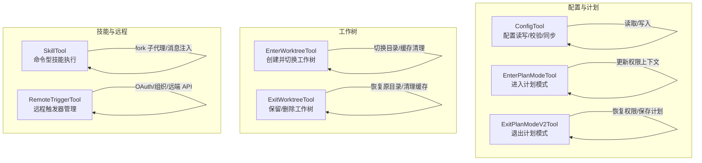
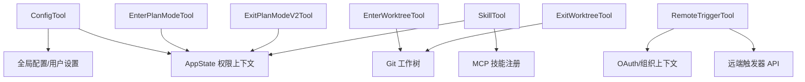
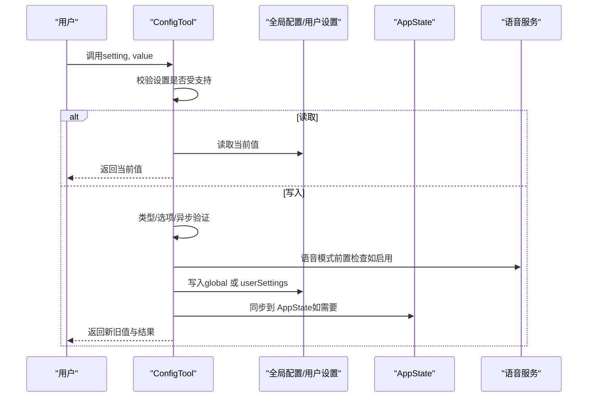
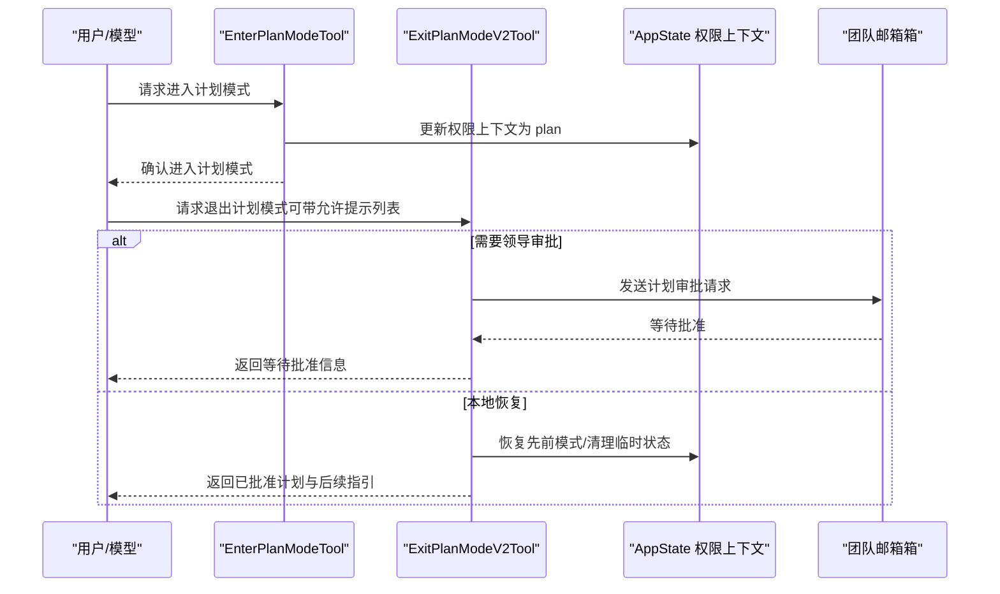
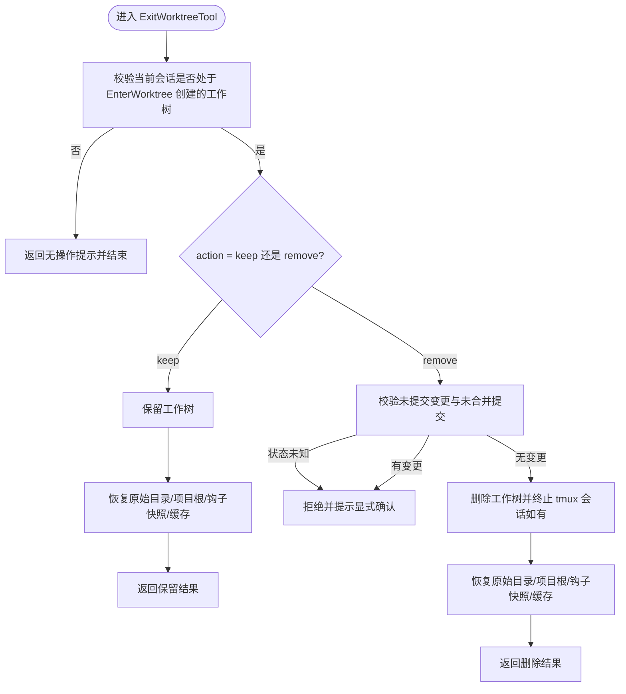
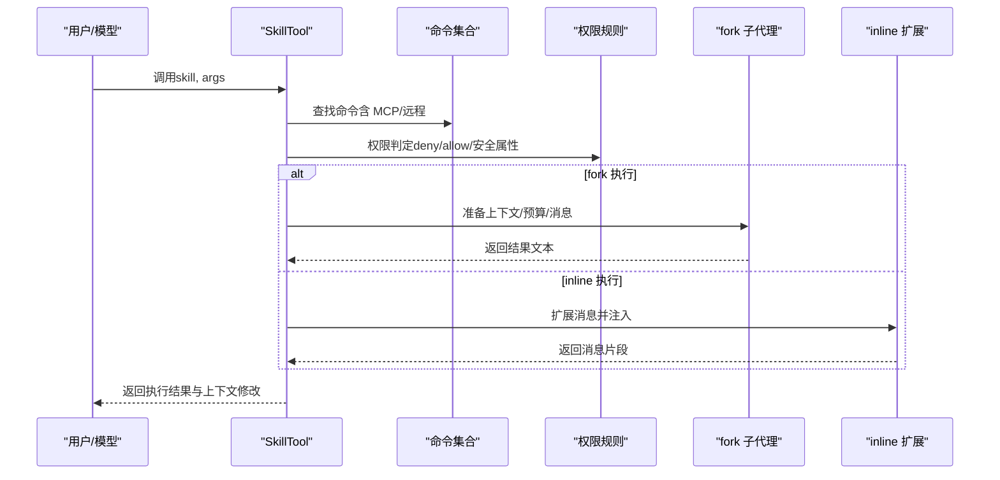
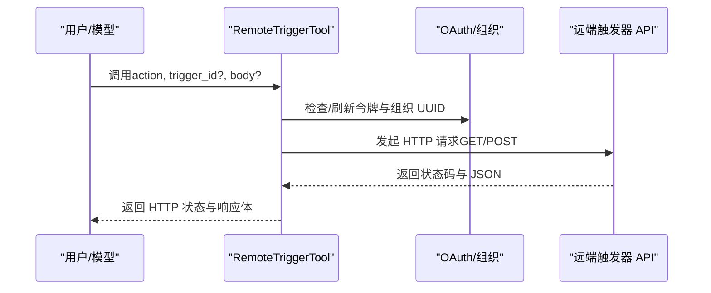
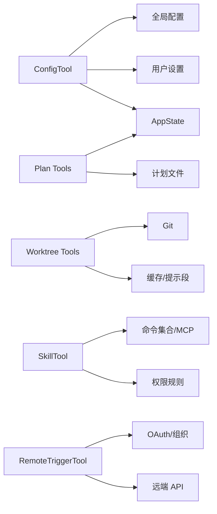

# 配置管理工具

<cite>
**本文引用的文件**
- [ConfigTool.ts](file://src/tools/ConfigTool/ConfigTool.ts)
- [EnterPlanModeTool.ts](file://src/tools/EnterPlanModeTool/EnterPlanModeTool.ts)
- [ExitPlanModeV2Tool.ts](file://src/tools/ExitPlanModeTool/ExitPlanModeV2Tool.ts)
- [EnterWorktreeTool.ts](file://src/tools/EnterWorktreeTool/EnterWorktreeTool.ts)
- [ExitWorktreeTool.ts](file://src/tools/ExitWorktreeTool/ExitWorktreeTool.ts)
- [SkillTool.ts](file://src/tools/SkillTool/SkillTool.ts)
- [RemoteTriggerTool.ts](file://src/tools/RemoteTriggerTool/RemoteTriggerTool.ts)
</cite>

## 目录
1. [简介](#简介)
2. [项目结构](#项目结构)
3. [核心组件](#核心组件)
4. [架构总览](#架构总览)
5. [详细组件分析](#详细组件分析)
6. [依赖关系分析](#依赖关系分析)
7. [性能考量](#性能考量)
8. [故障排查指南](#故障排查指南)
9. [结论](#结论)
10. [附录：使用示例与最佳实践](#附录使用示例与最佳实践)

## 简介
本文件系统性梳理 Claude Code 中的配置管理与工作流工具，重点覆盖以下能力：
- 配置工具（ConfigTool）：统一读取与写入全局与用户设置，支持类型校验、选项约束、异步验证与即时状态同步。
- 计划模式工具（EnterPlanModeTool、ExitPlanModeTool）：在“探索—设计—实现”的流程中，安全地进入与退出计划模式，并处理权限与审批链路。
- 工作树工具（EnterWorktreeTool、ExitWorktreeTool）：在隔离的工作树环境中进行实验式开发，支持保留或清理工作成果。
- 技能工具（SkillTool）：以“命令型技能”方式调用内置/插件/远程技能，支持权限规则、模型覆盖、子代理执行等机制。
- 远程触发工具（RemoteTriggerTool）：通过 OAuth 身份与组织上下文，对远程触发器进行列举、查询、创建、更新与运行。

本文件提供代码级架构图、调用序列图与流程图，帮助读者快速理解各工具的职责边界、数据流与错误处理策略，并给出可操作的使用示例与最佳实践。

## 项目结构
相关工具均位于 src/tools 下，采用按功能模块分层的组织方式：
- ConfigTool：集中于配置读取/写入、格式化、校验与状态同步。
- Plan Mode：Enter/Exit 两个工具围绕权限上下文与计划文件协作。
- Worktree：Enter/Exit 两个工具围绕 Git 工作树生命周期管理。
- SkillTool：围绕命令发现、权限判定、fork 执行与消息注入。
- RemoteTriggerTool：围绕 OAuth 令牌与组织上下文访问远端 API。

**图表来源**
- [ConfigTool.ts:67-434](file://src/tools/ConfigTool/ConfigTool.ts#L67-L434)
- [EnterPlanModeTool.ts:36-126](file://src/tools/EnterPlanModeTool/EnterPlanModeTool.ts#L36-L126)
- [ExitPlanModeV2Tool.ts:147-493](file://src/tools/ExitPlanModeTool/ExitPlanModeV2Tool.ts#L147-L493)
- [EnterWorktreeTool.ts:52-127](file://src/tools/EnterWorktreeTool/EnterWorktreeTool.ts#L52-L127)
- [ExitWorktreeTool.ts:148-329](file://src/tools/ExitWorktreeTool/ExitWorktreeTool.ts#L148-L329)
- [SkillTool.ts:331-800](file://src/tools/SkillTool/SkillTool.ts#L331-L800)
- [RemoteTriggerTool.ts:46-161](file://src/tools/RemoteTriggerTool/RemoteTriggerTool.ts#L46-L161)

**章节来源**
- [ConfigTool.ts:67-434](file://src/tools/ConfigTool/ConfigTool.ts#L67-L434)
- [EnterPlanModeTool.ts:36-126](file://src/tools/EnterPlanModeTool/EnterPlanModeTool.ts#L36-L126)
- [ExitPlanModeV2Tool.ts:147-493](file://src/tools/ExitPlanModeTool/ExitPlanModeV2Tool.ts#L147-L493)
- [EnterWorktreeTool.ts:52-127](file://src/tools/EnterWorktreeTool/EnterWorktreeTool.ts#L52-L127)
- [ExitWorktreeTool.ts:148-329](file://src/tools/ExitWorktreeTool/ExitWorktreeTool.ts#L148-L329)
- [SkillTool.ts:331-800](file://src/tools/SkillTool/SkillTool.ts#L331-L800)
- [RemoteTriggerTool.ts:46-161](file://src/tools/RemoteTriggerTool/RemoteTriggerTool.ts#L46-L161)

## 核心组件
- 配置工具（ConfigTool）
  - 支持读取与设置多种设置项，具备类型推断、选项枚举校验、异步写前验证与语音模式特例检查。
  - 写入时自动同步到全局配置与用户设置源，并在必要时通知 AppState 以即时生效。
- 计划模式工具
  - EnterPlanModeTool：在满足通道限制条件下进入只读探索与设计阶段；更新权限上下文为 plan 模式。
  - ExitPlanModeV2Tool：根据是否需要团队领导审批，分别走本地恢复或邮件箱提交流程；支持允许的提示类别权限请求。
- 工作树工具
  - EnterWorktreeTool：在会话中创建隔离工作树并切换当前工作目录，清理相关缓存与系统提示段。
  - ExitWorktreeTool：在保留或删除两种动作间选择，严格校验未提交变更与未合并提交，确保不误删工作。
- 技能工具（SkillTool）
  - 统一发现与执行“命令型技能”，支持内置/插件/远程技能；fork 执行隔离上下文；记录遥测与使用统计。
- 远程触发工具（RemoteTriggerTool）
  - 基于 OAuth 令牌与组织 UUID 访问远端触发器 API，支持 list/get/create/update/run。

**章节来源**
- [ConfigTool.ts:67-434](file://src/tools/ConfigTool/ConfigTool.ts#L67-L434)
- [EnterPlanModeTool.ts:36-126](file://src/tools/EnterPlanModeTool/EnterPlanModeTool.ts#L36-L126)
- [ExitPlanModeV2Tool.ts:147-493](file://src/tools/ExitPlanModeTool/ExitPlanModeV2Tool.ts#L147-L493)
- [EnterWorktreeTool.ts:52-127](file://src/tools/EnterWorktreeTool/EnterWorktreeTool.ts#L52-L127)
- [ExitWorktreeTool.ts:148-329](file://src/tools/ExitWorktreeTool/ExitWorktreeTool.ts#L148-L329)
- [SkillTool.ts:331-800](file://src/tools/SkillTool/SkillTool.ts#L331-L800)
- [RemoteTriggerTool.ts:46-161](file://src/tools/RemoteTriggerTool/RemoteTriggerTool.ts#L46-L161)

## 架构总览
下图展示工具层与核心服务之间的交互关系，包括配置读写、权限上下文、工作树切换、技能执行与远程 API 调用。

**图表来源**
- [ConfigTool.ts:67-434](file://src/tools/ConfigTool/ConfigTool.ts#L67-L434)
- [EnterPlanModeTool.ts:36-126](file://src/tools/EnterPlanModeTool/EnterPlanModeTool.ts#L36-L126)
- [ExitPlanModeV2Tool.ts:147-493](file://src/tools/ExitPlanModeTool/ExitPlanModeV2Tool.ts#L147-L493)
- [EnterWorktreeTool.ts:52-127](file://src/tools/EnterWorktreeTool/EnterWorktreeTool.ts#L52-L127)
- [ExitWorktreeTool.ts:148-329](file://src/tools/ExitWorktreeTool/ExitWorktreeTool.ts#L148-L329)
- [SkillTool.ts:331-800](file://src/tools/SkillTool/SkillTool.ts#L331-L800)
- [RemoteTriggerTool.ts:46-161](file://src/tools/RemoteTriggerTool/RemoteTriggerTool.ts#L46-L161)

## 详细组件分析

### 配置工具（ConfigTool）
- 输入输出与权限
  - 输入包含 setting 与可选 value；当省略 value 时为只读读取。
  - 对写入场景默认要求用户确认；仅未知设置项直接拒绝。
- 设置支持与路径解析
  - 通过受支持设置表判断 setting 是否存在；根据配置定义的 source/global 或 settings/userSettings 决定存储位置。
  - 支持嵌套路径写入（如 settings.a.b.c），并通过构建嵌套对象写入用户设置源。
- 类型与选项校验
  - 对布尔值进行字符串到布尔的转换与校验；对枚举型选项进行白名单校验。
- 异步写前验证与语音模式特例
  - 针对特定设置（如 voiceEnabled）在写入前进行可用性检查与麦克风授权请求。
- 状态同步与事件上报
  - 写入成功后同步到 AppState（如 voiceEnabled、remoteControlAtStartup），并记录配置变更事件。

**图表来源**
- [ConfigTool.ts:111-411](file://src/tools/ConfigTool/ConfigTool.ts#L111-L411)

**章节来源**
- [ConfigTool.ts:36-66](file://src/tools/ConfigTool/ConfigTool.ts#L36-L66)
- [ConfigTool.ts:98-107](file://src/tools/ConfigTool/ConfigTool.ts#L98-L107)
- [ConfigTool.ts:111-411](file://src/tools/ConfigTool/ConfigTool.ts#L111-L411)
- [ConfigTool.ts:436-467](file://src/tools/ConfigTool/ConfigTool.ts#L436-L467)

### 计划模式进入与退出工具
- 进入计划模式（EnterPlanModeTool）
  - 在满足通道限制条件时启用；更新权限上下文为 plan 模式，准备分类器激活副作用。
- 退出计划模式（ExitPlanModeV2Tool）
  - 分支逻辑：
    - 团队成员且需要计划审批：通过邮箱箱发送计划审批请求，等待领导批准。
    - 其他情况：恢复先前模式（含自动模式回退保护）、标记附件需求、清理临时状态。
  - 支持允许的提示类别权限请求，便于后续执行阶段按类别放行。

**图表来源**
- [EnterPlanModeTool.ts:77-102](file://src/tools/EnterPlanModeTool/EnterPlanModeTool.ts#L77-L102)
- [ExitPlanModeV2Tool.ts:243-418](file://src/tools/ExitPlanModeTool/ExitPlanModeV2Tool.ts#L243-L418)

**章节来源**
- [EnterPlanModeTool.ts:56-67](file://src/tools/EnterPlanModeTool/EnterPlanModeTool.ts#L56-L67)
- [EnterPlanModeTool.ts:77-102](file://src/tools/EnterPlanModeTool/EnterPlanModeTool.ts#L77-L102)
- [ExitPlanModeV2Tool.ts:167-178](file://src/tools/ExitPlanModeTool/ExitPlanModeV2Tool.ts#L167-L178)
- [ExitPlanModeV2Tool.ts:195-220](file://src/tools/ExitPlanModeTool/ExitPlanModeV2Tool.ts#L195-L220)
- [ExitPlanModeV2Tool.ts:221-239](file://src/tools/ExitPlanModeTool/ExitPlanModeV2Tool.ts#L221-L239)
- [ExitPlanModeV2Tool.ts:243-418](file://src/tools/ExitPlanModeTool/ExitPlanModeV2Tool.ts#L243-L418)

### 工作树进入与退出工具
- 进入工作树（EnterWorktreeTool）
  - 校验当前会话未处于工作树中；定位主仓库根并切换；生成 slug 创建工作树；切换进程与 Shell 当前目录；清理缓存与系统提示段。
- 退出工作树（ExitWorktreeTool）
  - 严格校验：仅对本会话创建的工作树有效；当 action=remove 时，若存在未提交变更或未合并提交则强制要求 discard_changes=true。
  - 动作：
    - keep：保留工作树与分支，恢复原始目录与项目根，更新钩子快照。
    - remove：终止 tmux 会话（如有），清理工作树，恢复原始目录与项目根，统计丢弃的文件与提交数。

**图表来源**
- [ExitWorktreeTool.ts:174-224](file://src/tools/ExitWorktreeTool/ExitWorktreeTool.ts#L174-L224)
- [ExitWorktreeTool.ts:227-321](file://src/tools/ExitWorktreeTool/ExitWorktreeTool.ts#L227-L321)

**章节来源**
- [EnterWorktreeTool.ts:77-119](file://src/tools/EnterWorktreeTool/EnterWorktreeTool.ts#L77-L119)
- [ExitWorktreeTool.ts:79-113](file://src/tools/ExitWorktreeTool/ExitWorktreeTool.ts#L79-L113)
- [ExitWorktreeTool.ts:174-224](file://src/tools/ExitWorktreeTool/ExitWorktreeTool.ts#L174-L224)
- [ExitWorktreeTool.ts:227-321](file://src/tools/ExitWorktreeTool/ExitWorktreeTool.ts#L227-L321)

### 技能工具（SkillTool）
- 命令发现与权限
  - 统一从本地与 MCP 获取命令集合；支持远程规范技能（ant 专属实验特性）。
  - 基于权限规则进行 deny/allow 判定，支持精确匹配与前缀通配；对仅使用“安全属性”的技能自动放行。
- 执行策略
  - fork 执行：为每个技能创建子代理，隔离 token 预算与上下文，支持进度回调与消息注入。
  - inline 执行：直接扩展为一组消息并注入父消息链，适合轻量技能。
- 遥测与追踪
  - 记录技能调用、来源、深度、父代理 ID、插件市场信息与发现来源等指标；维护 invokedSkills 状态并在完成后清理。

**图表来源**
- [SkillTool.ts:580-800](file://src/tools/SkillTool/SkillTool.ts#L580-L800)

**章节来源**
- [SkillTool.ts:81-94](file://src/tools/SkillTool/SkillTool.ts#L81-L94)
- [SkillTool.ts:354-430](file://src/tools/SkillTool/SkillTool.ts#L354-L430)
- [SkillTool.ts:432-578](file://src/tools/SkillTool/SkillTool.ts#L432-L578)
- [SkillTool.ts:580-800](file://src/tools/SkillTool/SkillTool.ts#L580-L800)

### 远程触发工具（RemoteTriggerTool）
- 功能范围
  - 支持 list/get/create/update/run 五类操作；get/update/run 必须提供 trigger_id；create/update 必须提供 body。
- 认证与组织
  - 依赖 OAuth 令牌与组织 UUID；需满足功能开关与策略限制。
- 请求构造
  - 统一使用 BASE_API_URL/v1/code/triggers，携带认证头、内容类型、Anthropic 版本与 beta 头部。

**图表来源**
- [RemoteTriggerTool.ts:78-151](file://src/tools/RemoteTriggerTool/RemoteTriggerTool.ts#L78-L151)

**章节来源**
- [RemoteTriggerTool.ts:18-42](file://src/tools/RemoteTriggerTool/RemoteTriggerTool.ts#L18-L42)
- [RemoteTriggerTool.ts:57-62](file://src/tools/RemoteTriggerTool/RemoteTriggerTool.ts#L57-L62)
- [RemoteTriggerTool.ts:78-151](file://src/tools/RemoteTriggerTool/RemoteTriggerTool.ts#L78-L151)

## 依赖关系分析
- 工具与服务耦合
  - ConfigTool 依赖全局配置、用户设置、语音服务与 AppState 同步。
  - Plan Mode 工具依赖权限上下文与计划文件持久化。
  - Worktree 工具依赖 Git 与会话状态，涉及缓存与系统提示段清理。
  - SkillTool 依赖命令注册、权限规则、fork 上下文与遥测。
  - RemoteTriggerTool 依赖 OAuth、组织上下文与远端 API。
- 并发与只读
  - ConfigTool、Plan Mode、Worktree、SkillTool、RemoteTriggerTool 均声明并发安全或只读属性，降低竞态风险。

**图表来源**
- [ConfigTool.ts:67-434](file://src/tools/ConfigTool/ConfigTool.ts#L67-L434)
- [EnterPlanModeTool.ts:36-126](file://src/tools/EnterPlanModeTool/EnterPlanModeTool.ts#L36-L126)
- [ExitPlanModeV2Tool.ts:147-493](file://src/tools/ExitPlanModeTool/ExitPlanModeV2Tool.ts#L147-L493)
- [EnterWorktreeTool.ts:52-127](file://src/tools/EnterWorktreeTool/EnterWorktreeTool.ts#L52-L127)
- [ExitWorktreeTool.ts:148-329](file://src/tools/ExitWorktreeTool/ExitWorktreeTool.ts#L148-L329)
- [SkillTool.ts:331-800](file://src/tools/SkillTool/SkillTool.ts#L331-L800)
- [RemoteTriggerTool.ts:46-161](file://src/tools/RemoteTriggerTool/RemoteTriggerTool.ts#L46-L161)

**章节来源**
- [ConfigTool.ts:87-89](file://src/tools/ConfigTool/ConfigTool.ts#L87-L89)
- [EnterPlanModeTool.ts:68-70](file://src/tools/EnterPlanModeTool/EnterPlanModeTool.ts#L68-L70)
- [ExitWorktreeTool.ts:167-170](file://src/tools/ExitWorktreeTool/ExitWorktreeTool.ts#L167-L170)
- [SkillTool.ts:346-348](file://src/tools/SkillTool/SkillTool.ts#L346-L348)
- [RemoteTriggerTool.ts:63-65](file://src/tools/RemoteTriggerTool/RemoteTriggerTool.ts#L63-L65)

## 性能考量
- 配置工具
  - 使用延迟 Schema 与最小化写盘操作，避免频繁 IO；对语音模式的前置检查采用异步短路，减少无效调用。
- 计划模式
  - 通过权限上下文的预处理与分类器副作用，降低重复初始化成本。
- 工作树
  - 进入/退出时清理缓存与系统提示段，避免陈旧信息影响后续计算；删除动作前进行变更计数，避免昂贵的 git 操作。
- 技能工具
  - fork 执行隔离上下文，避免共享状态带来的额外开销；进度回调与消息注入采用增量方式，减少内存压力。
- 远程触发
  - 限制请求超时与中断信号，避免阻塞主线程；仅在必要时发起网络请求。

[本节为通用指导，无需具体文件分析]

## 故障排查指南
- 配置工具
  - 未知设置：检查 setting 是否在受支持列表中；对于语音相关设置，确认 GrowthBook 开关与认证状态。
  - 无效值：核对布尔值输入（true/false 字符串）与枚举选项；查看异步验证返回的错误信息。
  - 语音模式不可用：检查麦克风权限、录音工具可用性与账户认证状态。
- 计划模式
  - 非计划模式调用：确保当前权限上下文为 plan；若被拒绝，先调用 EnterPlanModeTool。
  - 审批未决：团队成员需要等待领导批准；检查邮箱箱消息与请求 ID。
- 工作树
  - 无法删除：存在未提交变更或未合并提交；使用 discard_changes=true 或改为 keep 动作。
  - 会话状态异常：确认工作树由 EnterWorktreeTool 创建；避免对手动或历史会话创建的工作树执行退出。
- 技能工具
  - 未知技能：确认技能名正确且存在于命令集合；检查是否禁用模型调用或非 prompt 型命令。
  - fork 执行失败：检查子代理上下文与工具可用性；查看进度回调中的中间消息。
- 远程触发
  - 未认证：先执行登录；确认 OAuth 令牌与组织 UUID 解析成功。
  - 功能未开放：检查功能开关与策略限制；确认 beta 头部与版本号正确。

**章节来源**
- [ConfigTool.ts:126-130](file://src/tools/ConfigTool/ConfigTool.ts#L126-L130)
- [ConfigTool.ts:191-200](file://src/tools/ConfigTool/ConfigTool.ts#L191-L200)
- [ConfigTool.ts:242-307](file://src/tools/ConfigTool/ConfigTool.ts#L242-L307)
- [ExitPlanModeV2Tool.ts:204-218](file://src/tools/ExitPlanModeTool/ExitPlanModeV2Tool.ts#L204-L218)
- [ExitWorktreeTool.ts:180-188](file://src/tools/ExitWorktreeTool/ExitWorktreeTool.ts#L180-L188)
- [ExitWorktreeTool.ts:190-221](file://src/tools/ExitWorktreeTool/ExitWorktreeTool.ts#L190-L221)
- [SkillTool.ts:402-409](file://src/tools/SkillTool/SkillTool.ts#L402-L409)
- [RemoteTriggerTool.ts:80-85](file://src/tools/RemoteTriggerTool/RemoteTriggerTool.ts#L80-L85)

## 结论
上述工具共同构成了 Claude Code 的配置管理与工作流基础设施：ConfigTool 提供一致的设置读写体验；Plan Mode 工具保障复杂任务的探索—设计—实现闭环；Worktree 工具在隔离环境中进行实验式开发；SkillTool 将“命令型技能”以统一方式执行与追踪；RemoteTriggerTool 实现了远程触发器的统一管理。通过严格的权限控制、状态同步与错误处理，这些工具在保证安全性的同时提升了开发效率与可维护性。

[本节为总结性内容，无需具体文件分析]

## 附录：使用示例与最佳实践
- 配置管理
  - 读取设置：传入 setting 键，不提供 value 即可获取当前值。
  - 设置布尔值：使用字符串 true/false；确保枚举值在允许范围内。
  - 语音模式：先检查认证与录音工具可用性，再启用 voiceEnabled。
  - 最佳实践：优先使用默认值而非硬编码；对关键设置变更记录日志与回滚点。
- 计划模式
  - 进入：在复杂任务前调用 EnterPlanModeTool，完成探索与设计后再退出。
  - 退出：根据团队要求决定本地恢复或提交审批；编辑后的计划会被明确标注。
  - 最佳实践：在计划文件中记录权衡与假设；避免在计划模式中直接修改文件。
- 工作树
  - 进入：指定或自动生成 slug；进入后立即清理缓存与系统提示段。
  - 退出：删除前确认未提交变更；保留工作树用于后续迭代。
  - 最佳实践：为每次实验分配独立工作树；定期备份重要变更。
- 技能工具
  - 调用：传入技能名与可选参数；fork 执行适合长耗时或高风险任务。
  - 权限：对敏感技能配置 allow/deny 规则；利用安全属性自动放行。
  - 最佳实践：记录技能使用频率与效果；对 fork 执行设置合理超时。
- 远程触发
  - 管理：先列出触发器，再按需查询、创建、更新或运行；注意组织上下文与 beta 头部。
  - 最佳实践：为不同环境配置独立触发器；监控返回状态与响应体。

[本节为概念性内容，无需具体文件分析]