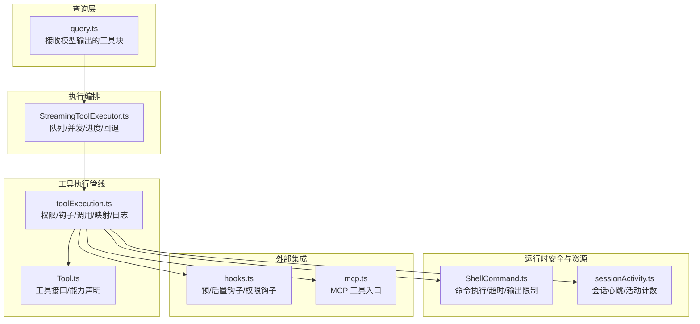
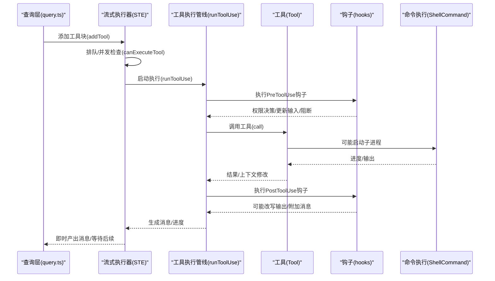
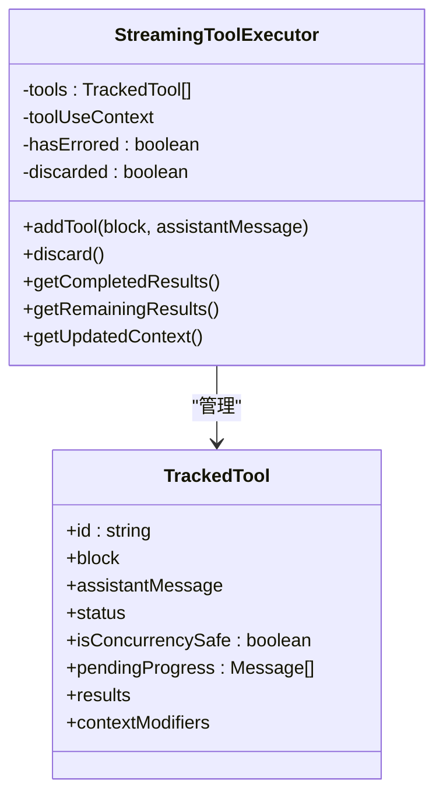
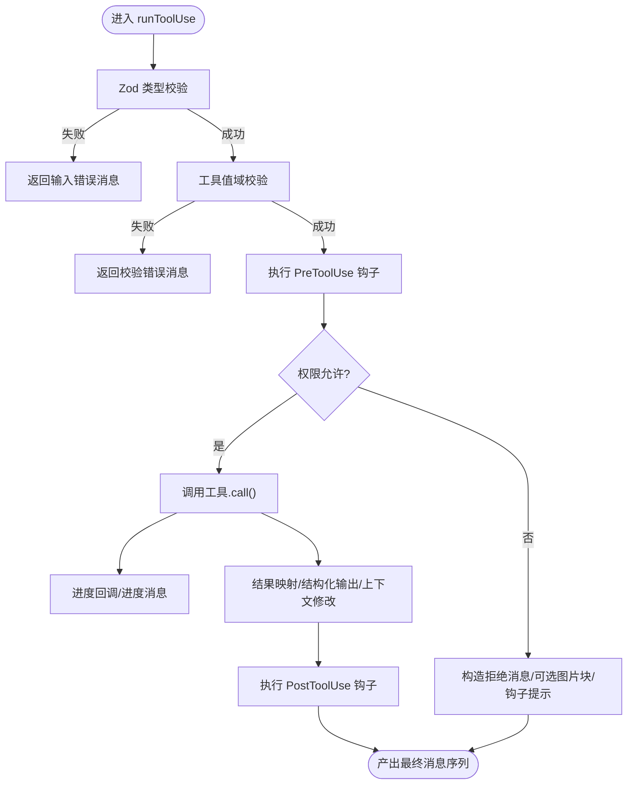
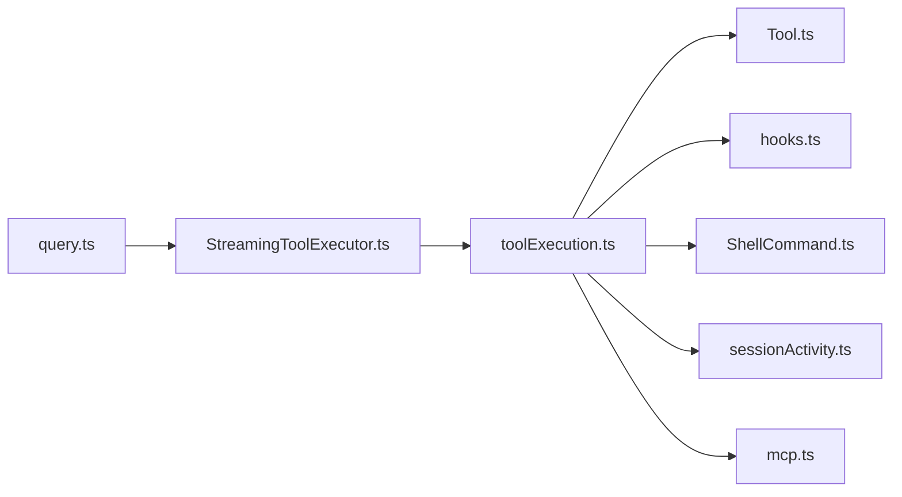

# 工具执行引擎

<cite>
**本文引用的文件**
- [StreamingToolExecutor.ts](file://src/services/tools/StreamingToolExecutor.ts)
- [toolExecution.ts](file://src/services/tools/toolExecution.ts)
- [Tool.ts](file://src/Tool.ts)
- [query.ts](file://src/query.ts)
- [hooks.ts](file://src/utils/hooks.ts)
- [ShellCommand.ts](file://src/utils/ShellCommand.ts)
- [sessionActivity.ts](file://src/utils/sessionActivity.ts)
- [mcp.ts](file://src/entrypoints/mcp.ts)
- [state.ts](file://src/bootstrap/state.ts)
- [contextSuggestions.ts](file://src/utils/contextSuggestions.ts)
</cite>

## 目录
1. [简介](#简介)
2. [项目结构](#项目结构)
3. [核心组件](#核心组件)
4. [架构总览](#架构总览)
5. [详细组件分析](#详细组件分析)
6. [依赖关系分析](#依赖关系分析)
7. [性能考量](#性能考量)
8. [故障排除指南](#故障排除指南)
9. [结论](#结论)

## 简介
本文件面向 Claude Code 的工具执行引擎，聚焦以下目标：
- 全面解析 StreamingToolExecutor 的流式执行机制：异步处理、进度回调、错误传播与回退策略
- 深入说明工具编排系统：工具选择、参数校验、并发控制、上下文修改与资源管理
- 阐述工具执行流程：执行前准备、执行中状态跟踪、执行后结果处理与钩子集成
- 解释安全机制：超时控制、输出大小限制、权限与中断行为、资源清理
- 提供性能优化建议与故障排除指引

## 项目结构
工具执行引擎由“查询层（query.ts）”驱动，通过“工具执行器（StreamingToolExecutor）”调度具体工具；工具调用由“工具执行管线（toolExecution.ts）”完成，包含权限决策、进度回调、钩子、结果映射与日志埋点。

图表来源
- [query.ts:653-740](file://src/query.ts#L653-L740)
- [StreamingToolExecutor.ts:40-531](file://src/services/tools/StreamingToolExecutor.ts#L40-L531)
- [toolExecution.ts:337-1600](file://src/services/tools/toolExecution.ts#L337-L1600)
- [Tool.ts:362-405](file://src/Tool.ts#L362-L405)
- [hooks.ts:3394-3481](file://src/utils/hooks.ts#L3394-L3481)
- [ShellCommand.ts:113-154](file://src/utils/ShellCommand.ts#L113-L154)
- [sessionActivity.ts:1-35](file://src/utils/sessionActivity.ts#L1-L35)
- [mcp.ts:142-196](file://src/entrypoints/mcp.ts#L142-L196)

章节来源
- [query.ts:653-740](file://src/query.ts#L653-L740)
- [StreamingToolExecutor.ts:40-531](file://src/services/tools/StreamingToolExecutor.ts#L40-L531)
- [toolExecution.ts:337-1600](file://src/services/tools/toolExecution.ts#L337-L1600)
- [Tool.ts:362-405](file://src/Tool.ts#L362-L405)
- [hooks.ts:3394-3481](file://src/utils/hooks.ts#L3394-L3481)
- [ShellCommand.ts:113-154](file://src/utils/ShellCommand.ts#L113-L154)
- [sessionActivity.ts:1-35](file://src/utils/sessionActivity.ts#L1-L35)
- [mcp.ts:142-196](file://src/entrypoints/mcp.ts#L142-L196)

## 核心组件
- StreamingToolExecutor：负责工具块的排队、并发控制、进度消息即时投递、兄弟工具级联取消、用户中断与回退丢弃
- 工具执行管线（runToolUse）：统一的工具调用入口，串联权限决策、钩子、工具调用、结果映射与日志埋点
- 工具接口（Tool）：定义工具生命周期、能力声明（并发安全、只读、破坏性）、中断行为等
- 进度与钩子：统一的进度回调与预/后置钩子执行，支持阻断与非阻断错误
- 安全与资源：ShellCommand 超时/输出大小限制、会话心跳保持、MCP 认证错误处理

章节来源
- [StreamingToolExecutor.ts:40-531](file://src/services/tools/StreamingToolExecutor.ts#L40-L531)
- [toolExecution.ts:337-1600](file://src/services/tools/toolExecution.ts#L337-L1600)
- [Tool.ts:362-405](file://src/Tool.ts#L362-L405)
- [hooks.ts:3394-3481](file://src/utils/hooks.ts#L3394-L3481)
- [ShellCommand.ts:113-154](file://src/utils/ShellCommand.ts#L113-L154)
- [sessionActivity.ts:1-35](file://src/utils/sessionActivity.ts#L1-L35)

## 架构总览
下图展示从模型返回工具块到最终产出消息的端到端流程，以及关键的并发与错误传播路径。

图表来源
- [query.ts:653-740](file://src/query.ts#L653-L740)
- [StreamingToolExecutor.ts:76-124](file://src/services/tools/StreamingToolExecutor.ts#L76-L124)
- [toolExecution.ts:337-1600](file://src/services/tools/toolExecution.ts#L337-L1600)
- [hooks.ts:3394-3481](file://src/utils/hooks.ts#L3394-L3481)
- [ShellCommand.ts:113-154](file://src/utils/ShellCommand.ts#L113-L154)

## 详细组件分析

### 流式执行器 StreamingToolExecutor
- 队列与并发控制
  - 已入队工具按顺序检查是否可执行：若无在执行工具，或当前工具与所有在执行工具均为并发安全，则开始执行
  - 并发安全工具可与其它并发安全工具并行；非并发安全工具需独占执行窗口
- 异步执行与进度回调
  - 每个工具执行生成一个 Promise，完成后推进队列
  - 进度消息先于结果立即投递，确保 UI 实时反馈
- 错误传播与回退
  - 兄弟工具错误（如 Bash 失败）会触发“兄弟取消”，其他并行工具收到合成错误消息
  - 用户中断（如 ESC 拒绝）根据工具中断行为决定取消或阻塞
  - 流式回退（onStreamingFallback）发生时，丢弃未完成执行并重建执行器，避免孤儿结果
- 上下文修改
  - 非并发安全工具的上下文修改在串行窗口内即时应用
  - 并发工具暂不支持上下文修改（保留扩展点）

图表来源
- [StreamingToolExecutor.ts:40-531](file://src/services/tools/StreamingToolExecutor.ts#L40-L531)

章节来源
- [StreamingToolExecutor.ts:76-124](file://src/services/tools/StreamingToolExecutor.ts#L76-L124)
- [StreamingToolExecutor.ts:129-151](file://src/services/tools/StreamingToolExecutor.ts#L129-L151)
- [StreamingToolExecutor.ts:265-405](file://src/services/tools/StreamingToolExecutor.ts#L265-L405)
- [StreamingToolExecutor.ts:412-490](file://src/services/tools/StreamingToolExecutor.ts#L412-L490)
- [query.ts:712-740](file://src/query.ts#L712-L740)

### 工具执行管线 runToolUse
- 输入校验与参数修正
  - 使用 Zod schema 对工具输入进行类型校验；对延迟加载工具补充 schema 提示
  - 工具自定义 validateInput 做值域校验；失败即返回错误消息
- 权限与钩子
  - 执行 PreToolUse 钩子，可能阻断、更新输入、或要求用户交互
  - 基于钩子与规则解析最终权限决策；自动模式下可能触发分类器判定
- 工具调用与进度
  - 将工具调用包装为统一的异步迭代器，进度事件通过回调上报
  - 支持 MCP 工具与本地工具；MCP 认证错误会更新客户端状态
- 结果映射与后置钩子
  - 将工具结果映射为 API 友好的消息块；支持结构化输出附件
  - 执行 PostToolUse 钩子，可能改写 MCP 输出或注入反馈消息
- 日志与追踪
  - 记录工具决策来源、耗时、结果大小、文件扩展名等指标
  - 生成 OTel 事件与 span，便于端到端追踪

图表来源
- [toolExecution.ts:337-1600](file://src/services/tools/toolExecution.ts#L337-L1600)
- [hooks.ts:3394-3481](file://src/utils/hooks.ts#L3394-L3481)

章节来源
- [toolExecution.ts:614-733](file://src/services/tools/toolExecution.ts#L614-L733)
- [toolExecution.ts:799-862](file://src/services/tools/toolExecution.ts#L799-L862)
- [toolExecution.ts:916-1104](file://src/services/tools/toolExecution.ts#L916-L1104)
- [toolExecution.ts:1206-1588](file://src/services/tools/toolExecution.ts#L1206-L1588)
- [toolExecution.ts:1331-1395](file://src/services/tools/toolExecution.ts#L1331-L1395)

### 工具接口与能力声明（Tool）
- 生命周期与能力
  - validateInput：值域校验
  - checkPermissions：工具级权限检查（默认放行）
  - call：实际执行
  - 能力标志：isEnabled、isConcurrencySafe、isReadOnly、isDestructive、interruptBehavior
- 默认策略
  - 并发安全默认关闭，破坏性操作默认关闭，权限检查默认放行
  - 仅安全工具才允许并行

章节来源
- [Tool.ts:362-405](file://src/Tool.ts#L362-L405)
- [Tool.ts:745-775](file://src/Tool.ts#L745-L775)

### 钩子系统（预/后置钩子与权限钩子）
- 预工具钩子（PreToolUse）
  - 可阻断执行、更新输入、要求用户交互、记录耗时摘要
- 后工具钩子（PostToolUse）
  - 可改写 MCP 输出、注入反馈消息、记录耗时摘要
- 权限钩子（PermissionDenied）
  - 自动模式下被拒时可触发重试提示

章节来源
- [hooks.ts:3394-3481](file://src/utils/hooks.ts#L3394-L3481)
- [hooks.ts:2716-3401](file://src/utils/hooks.ts#L2716-L3401)

### 安全与资源管理
- ShellCommand
  - 超时控制：到期可自动后台化或终止
  - 输出大小限制：超过阈值会触发清理与告警
  - 中止信号：父/兄弟控制器可级联中止
- 会话活动
  - 工具执行期间启动会话心跳，防止容器空闲退出
- MCP 认证
  - 认证失败时更新客户端状态，引导重新授权

章节来源
- [ShellCommand.ts:113-154](file://src/utils/ShellCommand.ts#L113-L154)
- [sessionActivity.ts:1-35](file://src/utils/sessionActivity.ts#L1-L35)
- [toolExecution.ts:1599-1600](file://src/services/tools/toolExecution.ts#L1599-L1600)

## 依赖关系分析
- 查询层依赖流式执行器产出消息；当流式回退发生时，丢弃旧执行器并重建
- 流式执行器依赖工具定义与工具使用上下文；内部维护工具状态机与进度队列
- 工具执行管线依赖工具接口、钩子系统、会话活动与 ShellCommand
- MCP 工具通过入口桥接，认证错误走统一处理路径

图表来源
- [query.ts:653-740](file://src/query.ts#L653-L740)
- [StreamingToolExecutor.ts:40-531](file://src/services/tools/StreamingToolExecutor.ts#L40-L531)
- [toolExecution.ts:337-1600](file://src/services/tools/toolExecution.ts#L337-L1600)
- [Tool.ts:362-405](file://src/Tool.ts#L362-L405)
- [hooks.ts:3394-3481](file://src/utils/hooks.ts#L3394-L3481)
- [ShellCommand.ts:113-154](file://src/utils/ShellCommand.ts#L113-L154)
- [sessionActivity.ts:1-35](file://src/utils/sessionActivity.ts#L1-L35)
- [mcp.ts:142-196](file://src/entrypoints/mcp.ts#L142-L196)

章节来源
- [query.ts:653-740](file://src/query.ts#L653-L740)
- [StreamingToolExecutor.ts:40-531](file://src/services/tools/StreamingToolExecutor.ts#L40-L531)
- [toolExecution.ts:337-1600](file://src/services/tools/toolExecution.ts#L337-L1600)

## 性能考量
- 并发策略
  - 并发安全工具尽量并行，减少整体时延
  - 非并发安全工具串行，避免资源竞争
- 进度与 UI
  - 进度消息优先投递，降低感知延迟
  - 钩子耗时阈值（>500ms）会生成摘要消息，帮助识别瓶颈
- 结果大小与上下文
  - 大型工具结果会触发上下文建议（如 Bash/Read/Grep），指导用户优化参数
- 统计与追踪
  - 工具总耗时、每轮钩子耗时、结果大小、文件扩展名等指标用于性能分析

章节来源
- [toolExecution.ts:133-137](file://src/services/tools/toolExecution.ts#L133-L137)
- [contextSuggestions.ts:81-124](file://src/utils/contextSuggestions.ts#L81-L124)
- [state.ts:582-590](file://src/bootstrap/state.ts#L582-L590)

## 故障排除指南
- 流式回退
  - 现象：流式响应异常，触发回退
  - 处理：丢弃旧执行器，重建新的流式执行器，避免孤儿结果
- 工具不存在或输入无效
  - 现象：返回“无此工具可用”或“输入校验失败”
  - 处理：检查工具名称与别名；确认 schema 是否随工具搜索下发
- 权限拒绝
  - 现象：PreToolUse/PermissionRequest 钩子阻断或自动模式分类器拒绝
  - 处理：查看钩子输出；必要时调整规则或人工授权
- Bash/子进程问题
  - 现象：命令超时、输出过大、兄弟工具级联取消
  - 处理：缩短命令、分段执行；设置合理超时与输出上限
- MCP 认证失败
  - 现象：MCP 工具报认证错误
  - 处理：更新客户端状态，引导重新授权

章节来源
- [query.ts:712-740](file://src/query.ts#L712-L740)
- [toolExecution.ts:369-411](file://src/services/tools/toolExecution.ts#L369-L411)
- [toolExecution.ts:614-733](file://src/services/tools/toolExecution.ts#L614-L733)
- [toolExecution.ts:1073-1104](file://src/services/tools/toolExecution.ts#L1073-L1104)
- [ShellCommand.ts:113-154](file://src/utils/ShellCommand.ts#L113-L154)
- [toolExecution.ts:1599-1600](file://src/services/tools/toolExecution.ts#L1599-L1600)

## 结论
StreamingToolExecutor 以“并发安全优先、进度优先、错误可控”的设计，实现了稳定高效的工具执行体验。配合统一的工具执行管线、权限与钩子系统、以及 ShellCommand 的安全边界，形成从模型到终端的完整闭环。通过统计指标与上下文建议，持续优化工具调用的性能与可维护性。