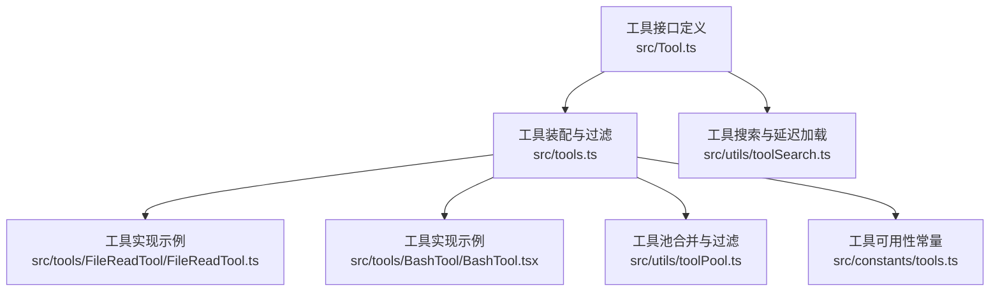
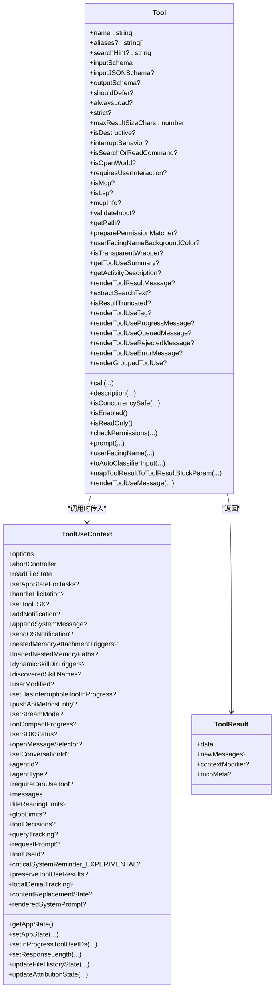
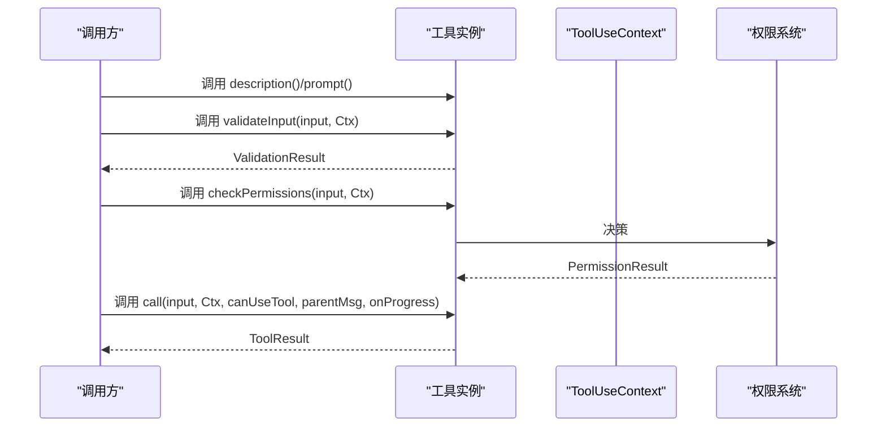
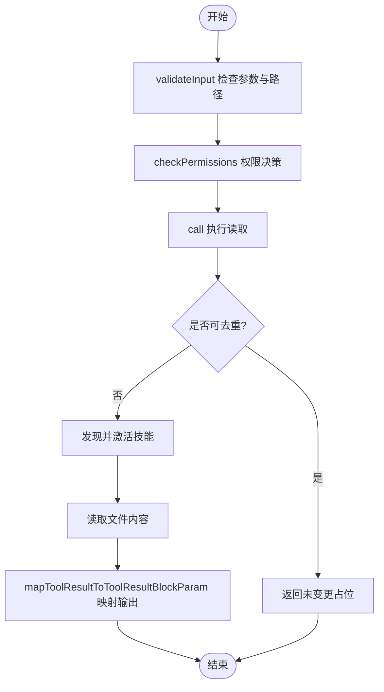
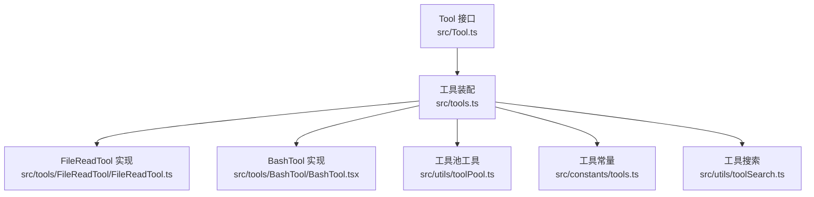

# 工具接口设计

<cite>
**本文引用的文件**
- [Tool.ts](file://src/Tool.ts)
- [tools.ts](file://src/tools.ts)
- [FileReadTool.ts](file://src/tools/FileReadTool/FileReadTool.ts)
- [BashTool.tsx](file://src/tools/BashTool/BashTool.tsx)
- [toolSearch.ts](file://src/utils/toolSearch.ts)
- [tools.ts（常量）](file://src/constants/tools.ts)
- [toolPool.ts](file://src/utils/toolPool.ts)
- [README.md](file://README.md)
</cite>

## 目录
1. [简介](#简介)
2. [项目结构](#项目结构)
3. [核心组件](#核心组件)
4. [架构总览](#架构总览)
5. [详细组件分析](#详细组件分析)
6. [依赖关系分析](#依赖关系分析)
7. [性能考量](#性能考量)
8. [故障排查指南](#故障排查指南)
9. [结论](#结论)
10. [附录](#附录)

## 简介
本文件面向 Claude Code 的工具接口设计，系统化阐述 Tool 基类的设计理念、核心属性与方法、元数据系统、并发控制、生命周期管理，以及最佳实践与设计模式。目标是帮助开发者在不深入源码细节的前提下，快速理解并正确实现符合框架规范的工具。

## 项目结构
- 工具接口定义位于 src/Tool.ts，包含 Tool 类型、工具上下文、结果封装、构建器 buildTool 及默认行为。
- 工具集合装配与过滤逻辑位于 src/tools.ts，负责按权限、环境变量、特性开关组装工具池，并合并内置与 MCP 工具。
- 典型工具实现示例：FileReadTool（只读、大文件处理、权限校验、UI 渲染）、BashTool（命令执行、并发安全、进度渲染）。
- 工具搜索与延迟加载策略由 src/utils/toolSearch.ts 提供，支持基于阈值与模型能力的动态启用。
- 工具可用性与限制常量定义于 src/constants/tools.ts，用于异步代理、协调者模式等场景的工具白名单/黑名单。
- 工具池合并与过滤的纯函数位于 src/utils/toolPool.ts，确保 REPL 与无头路径的一致性。

**图表来源**
- [Tool.ts](file://src/Tool.ts)
- [tools.ts](file://src/tools.ts)
- [toolSearch.ts](file://src/utils/toolSearch.ts)
- [toolPool.ts](file://src/utils/toolPool.ts)
- [tools.ts（常量）](file://src/constants/tools.ts)

**章节来源**
- [Tool.ts](file://src/Tool.ts)
- [tools.ts](file://src/tools.ts)

## 核心组件
- Tool 接口与类型系统
  - 核心属性：name、aliases、description、inputSchema、outputSchema、searchHint、shouldDefer、alwaysLoad、strict、maxResultSizeChars 等。
  - 关键方法：call(args, context, canUseTool, parentMessage, onProgress?)、description(...)、isConcurrencySafe(...)、isEnabled()、isReadOnly(...)、isDestructive?(...)、interruptBehavior?()、isSearchOrReadCommand?(...)、isOpenWorld?(...)、requiresUserInteraction?()、isMcp?、isLsp?、mcpInfo?、validateInput?(...)、checkPermissions(...)、getPath?(...)、preparePermissionMatcher?(...)、prompt(options)、userFacingName(input)、userFacingNameBackgroundColor?、isTransparentWrapper?()、getToolUseSummary?(...)、getActivityDescription?(...)、toAutoClassifierInput(input)、mapToolResultToToolResultBlockParam(...)、renderToolResultMessage?(...)、extractSearchText?(out)、renderToolUseMessage(input, options)、isResultTruncated?(output)、renderToolUseTag?(input)、renderToolUseProgressMessage?(...)、renderToolUseQueuedMessage?()、renderToolUseRejectedMessage?(...)、renderToolUseErrorMessage?(...)、renderGroupedToolUse?(...)
  - 上下文 ToolUseContext：包含命令、调试、思考配置、MCP 客户端与资源、会话状态、通知、消息列表、文件读取限制、查询追踪、请求提示回调等。
  - 结果 ToolResult：data 必填；可选 newMessages、contextModifier、mcpMeta。
  - 构建器 buildTool：统一填充默认行为（如 isEnabled 默认 true、isConcurrencySafe 默认 false、checkPermissions 默认允许等），保证工具实现最小化样板。

- 工具集合与装配
  - Tools 类型：只读工具数组，便于追踪工具集的来源与传递。
  - getAllBaseTools/getTools/assembleToolPool/getMergedTools/filterToolsByDenyRules：按权限、特性开关、REPL 模式、MCP 工具进行筛选与去重，保证提示缓存稳定与一致性。

**章节来源**
- [Tool.ts](file://src/Tool.ts)
- [tools.ts](file://src/tools.ts)

## 架构总览
工具系统采用“接口契约 + 构建器默认值 + 装配器过滤”的分层架构：
- 接口契约：Tool.ts 定义统一的工具能力边界与扩展点。
- 构建器默认值：buildTool 统一注入安全默认，降低工具实现复杂度。
- 装配器过滤：tools.ts 将内置工具与 MCP 工具合并，结合权限规则与运行时环境进行筛选与排序，确保提示缓存命中率与安全性。

**图表来源**
- [Tool.ts](file://src/Tool.ts)

**章节来源**
- [Tool.ts](file://src/Tool.ts)

## 详细组件分析

### Tool 基类与核心属性
- 名称与别名
  - name：工具唯一标识；aliases：向后兼容的别名集合，支持通过别名查找工具。
- 描述与输入输出
  - description(...)：动态生成工具描述，用于 LLM 提示；prompt(options)：生成工具的系统提示文本。
  - inputSchema/inputJSONSchema：输入参数的 Zod 或 JSON Schema 定义；outputSchema：输出结构约束。
- 元数据与可见性
  - searchHint：关键词提示，辅助 ToolSearch 在延迟加载场景中被检索到。
  - shouldDefer：是否延迟加载（defer_loading），需配合 ToolSearch 使用。
  - alwaysLoad：是否强制在初始提示中加载（即使启用了 ToolSearch），适用于模型必须在首轮看到的工具。
  - strict：严格模式开关，对工具指令与参数模式更严格。
  - maxResultSizeChars：工具结果最大字符数，超过则持久化到磁盘并通过预览展示。
- 并发与安全
  - isConcurrencySafe(input)：是否可并行执行；默认 false，避免竞态与副作用。
  - isReadOnly/isDestructive：只读与破坏性操作标记，影响权限与 UI 表现。
  - interruptBehavior：用户打断时的行为（取消或阻塞）。
- 权限与校验
  - validateInput?(...)：输入级校验，失败早返回；checkPermissions(...)：工具特定权限决策。
  - preparePermissionMatcher?(...)：为权限规则匹配器准备闭包，提升匹配效率。
- UI 与渲染
  - renderToolUseMessage/renderToolResultMessage/renderToolUseProgressMessage/renderGroupedToolUse 等：分别负责输入显示、结果渲染、进度展示与并行组渲染。
  - extractSearchText：提取可索引文本；isResultTruncated：结果是否截断；renderToolUseTag：附加标签（如超时、模型、恢复 ID）。
- 映射与分类
  - mapToolResultToToolResultBlockParam：将工具输出映射为 API 消息块。
  - toAutoClassifierInput：自动分类器输入摘要；isSearchOrReadCommand：UI 折叠显示判断；isOpenWorld：是否开放世界命令；requiresUserInteraction：是否需要用户交互；isMcp/isLsp：工具来源类型标识。

**章节来源**
- [Tool.ts](file://src/Tool.ts)

### 工具方法接口详解
- call(args, context, canUseTool, parentMessage, onProgress?)
  - 参数：标准化输入、工具使用上下文、权限回调、父消息、进度回调。
  - 返回：ToolResult，包含 data、可选新消息、上下文修饰与 MCP 元数据。
  - 示例参考：FileReadTool 的 call 实现，包含读取限制、重复读取去重、技能发现与激活、错误友好提示等。
- description(input, options)
  - 动态描述，用于 ToolSearch 或 UI 展示。
- isConcurrencySafe(input)
  - 并发安全判定，默认 false，工具应明确声明自身是否可并行。
- isEnabled()
  - 功能开关检查，用于按特性或环境禁用工具。
- isReadOnly/isDestructive
  - 影响权限策略与 UI 表达。
- interruptBehavior
  - 用户打断时的策略：取消或阻塞。
- isSearchOrReadCommand
  - UI 折叠显示的语义识别（搜索、读取、列出）。
- isOpenWorld/requiresUserInteraction
  - 开放世界与交互需求标记。
- validateInput/checkPermissions
  - 输入校验与权限决策，失败早返回，避免昂贵执行。
- render* 系列
  - 输入/结果/进度/排队/拒绝/错误/分组渲染，覆盖 Transcript 与非 Transcript 场景。

**章节来源**
- [Tool.ts](file://src/Tool.ts)
- [FileReadTool.ts](file://src/tools/FileReadTool/FileReadTool.ts)

### 工具元数据系统
- searchHint
  - 3–10 词短语，不含句号，帮助 ToolSearch 关键词匹配。
- shouldDefer/alwaysLoad
  - shouldDefer：延迟加载，配合 ToolSearchTool 发现。
  - alwaysLoad：强制立即加载，避免 ToolSearch 往返。
- mcpInfo
  - MCP 工具的服务器与工具名称信息，便于 UI 与权限规则区分。
- strict/maxResultSizeChars
  - 严格模式与结果大小限制，保障传输与渲染稳定性。

**章节来源**
- [Tool.ts](file://src/Tool.ts)

### 工具生命周期管理
- 初始化
  - 通过 buildTool 注入默认行为，确保工具具备最小可用能力。
- 验证
  - validateInput：参数合法性与范围检查；preparePermissionMatcher：权限规则匹配器准备。
- 执行
  - checkPermissions：工具特定授权；call：实际执行；onProgress：进度回调。
- 清理
  - 工具自身不直接承担清理职责；UI/渲染层负责根据 isResultTruncated、renderToolUseTag 等控制展示与交互。
- 合并与装配
  - assembleToolPool：内置与 MCP 工具合并，按名称去重，内置工具优先；getMergedTools：完整工具集；filterToolsByDenyRules：按权限规则过滤；applyCoordinatorToolFilter：协调者模式过滤。

**图表来源**
- [Tool.ts](file://src/Tool.ts)

**章节来源**
- [Tool.ts](file://src/Tool.ts)
- [tools.ts](file://src/tools.ts)

### 典型工具实现示例

#### FileReadTool 分析
- 设计要点
  - 只读工具：isReadOnly 返回 true；isConcurrencySafe 返回 true。
  - 输入输出：Zod 输入 schema（file_path、offset、limit、pages），多态输出（文本/图片/笔记本/PDF/部分提取/未变更）。
  - 权限与校验：expandPath、deny 规则匹配、UNC 路径检查、二进制扩展名排除、设备文件阻断。
  - 性能优化：读取去重（同一范围且文件未变时返回“未变更”占位），减少缓存开销。
  - UI 与可索引性：extractSearchText 返回空串，避免索引冗余；renderToolUseMessage/renderToolResultMessage 提供简洁摘要与详细内容。
  - 安全提醒：针对文件读取的网络安全提醒（可豁免特定模型）。
- 生命周期体现
  - validateInput：参数与路径合法性检查。
  - checkPermissions：读取权限决策。
  - call：执行读取、技能发现与激活、错误友好提示。
  - mapToolResultToToolResultBlockParam：将不同输出类型映射为 API 消息块。

**图表来源**
- [FileReadTool.ts](file://src/tools/FileReadTool/FileReadTool.ts)

**章节来源**
- [FileReadTool.ts](file://src/tools/FileReadTool/FileReadTool.ts)

#### BashTool 分析
- 设计要点
  - 并发安全：isConcurrencySafe 默认 false，具体实现需谨慎处理共享状态。
  - 搜索/读取/列出命令识别：用于 UI 折叠显示（grep/find/cat/head/ls/tree 等）。
  - 进度与超时：PROGRESS_THRESHOLD_MS 控制进度展示时机；ASSISTANT_BLOCKING_BUDGET_MS 控制助手模式下的阻塞预算。
  - 权限与只读约束：bashToolHasPermission、matchWildcardPattern、readOnlyValidation 等。
  - 输出处理：图像输出、终端截断检测、任务输出路径与预览生成。
- 生命周期体现
  - validateInput：命令解析与安全检查。
  - checkPermissions：命令与路径权限决策。
  - call：执行命令、记录历史、更新 UI、生成结果块。

**章节来源**
- [BashTool.tsx](file://src/tools/BashTool/BashTool.tsx)

### 工具搜索与延迟加载
- 工具搜索模式
  - 支持标准模式与 ToolSearchTool 模式；可通过环境变量与 GrowthBook 配置。
  - ToolSearchTool 可发现 shouldDefer 工具；alwaysLoad 工具始终在初始提示中出现。
- 字符与令牌计数
  - 通过 getDeferredToolTokenCount 与 calculateDeferredToolDescriptionChars 计算延迟工具的令牌与字符大小，决定是否启用 ToolSearch。
- 模型能力检测
  - modelSupportsToolReference：基于模型名称模式判断是否支持 tool_reference，从而启用工具引用块。

**章节来源**
- [toolSearch.ts](file://src/utils/toolSearch.ts)
- [tools.ts](file://src/tools.ts)

### 工具池合并与过滤
- 合并策略
  - 内置工具与 MCP 工具合并，按名称排序并去重，内置工具优先。
- 过滤策略
  - 按权限规则（deny 规则）过滤；按 REPL 模式隐藏原始工具；按特性开关与环境变量启用/禁用工具。
- 协调者模式
  - applyCoordinatorToolFilter：仅保留协调者允许的工具集合。

**章节来源**
- [tools.ts](file://src/tools.ts)
- [toolPool.ts](file://src/utils/toolPool.ts)
- [tools.ts（常量）](file://src/constants/tools.ts)

## 依赖关系分析

**图表来源**
- [Tool.ts](file://src/Tool.ts)
- [tools.ts](file://src/tools.ts)
- [toolPool.ts](file://src/utils/toolPool.ts)
- [tools.ts（常量）](file://src/constants/tools.ts)
- [toolSearch.ts](file://src/utils/toolSearch.ts)

**章节来源**
- [Tool.ts](file://src/Tool.ts)
- [tools.ts](file://src/tools.ts)

## 性能考量
- 并发安全
  - 默认 isConcurrencySafe(false)，工具若需并行，必须证明其线程安全与幂等性。
- 结果大小与持久化
  - maxResultSizeChars 控制结果大小，超限自动落盘并返回预览，避免内存与传输压力。
- 读取去重
  - FileReadTool 的 readFileState 去重显著减少重复内容传输与缓存开销。
- 权限与校验前置
  - validateInput 与 checkPermissions 在昂贵 I/O 前完成，避免无效执行。
- UI 折叠与索引
  - isSearchOrReadCommand 与 extractSearchText 有助于 UI 折叠与搜索索引，提升用户体验与检索效率。

[本节为通用指导，无需特定文件引用]

## 故障排查指南
- 输入校验失败
  - 检查 validateInput 的错误码与消息，确认参数格式与范围是否满足要求。
- 权限被拒绝
  - 检查工具的 checkPermissions 与 preparePermissionMatcher 是否正确匹配规则；必要时调整 deny/allow 规则。
- 并发冲突
  - 若工具非并发安全，请避免与其他写操作并行；必要时使用队列或串行包装。
- 结果过大
  - 调整 maxResultSizeChars 或分段读取；对于 FileReadTool，利用去重减少重复传输。
- UI 不显示或显示异常
  - 检查 renderToolUseMessage/renderToolResultMessage/renderToolUseProgressMessage 的实现与 options；确认 isResultTruncated 与 extractSearchText 的返回值。

**章节来源**
- [Tool.ts](file://src/Tool.ts)
- [FileReadTool.ts](file://src/tools/FileReadTool/FileReadTool.ts)

## 结论
Tool 基类通过清晰的接口契约、默认安全行为与完善的扩展点，为工具实现提供了高内聚、低耦合的抽象。结合工具装配器与权限系统，可在保证安全性与性能的前提下，灵活扩展工具生态。遵循本文的最佳实践与设计模式，可快速实现高质量的工具实现。

## 附录
- 工具系统架构图（来自仓库文档）
  - 展示了 buildTool、生命周期、能力、渲染与 AI 面向接口的组织方式。

**章节来源**
- [README.md](file://README.md)