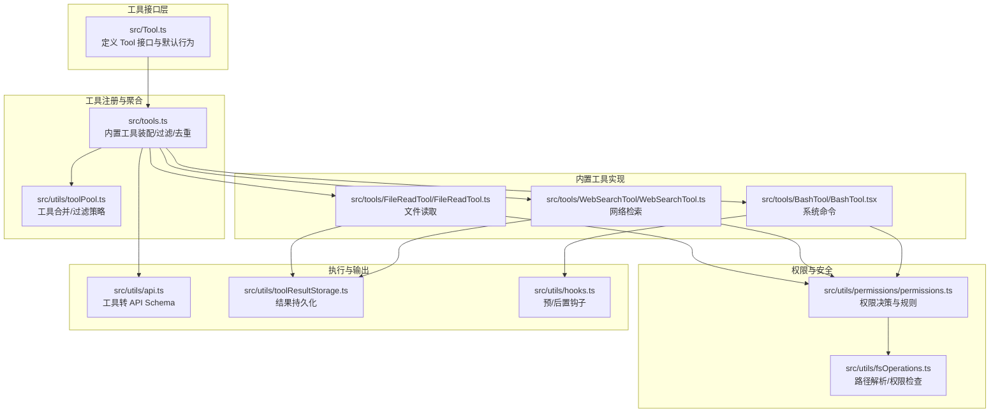
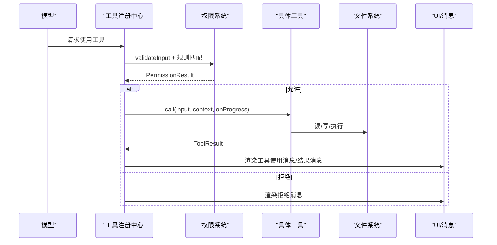
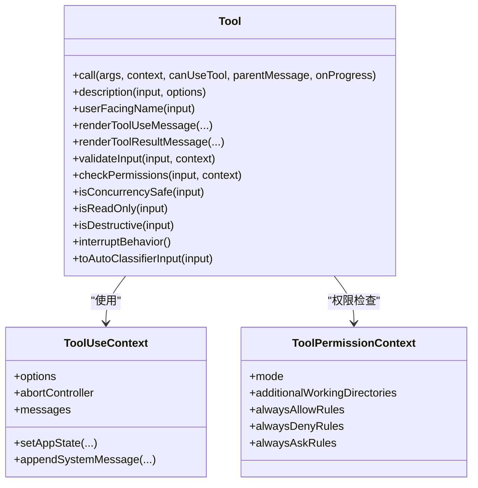
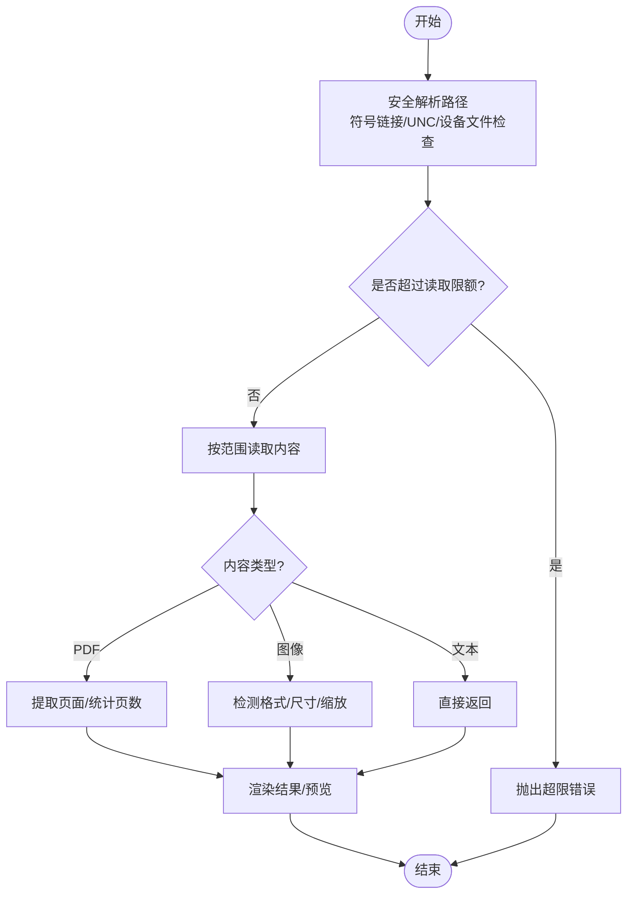
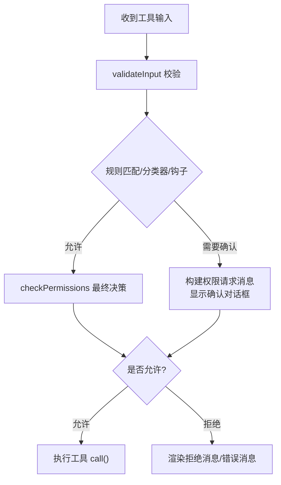
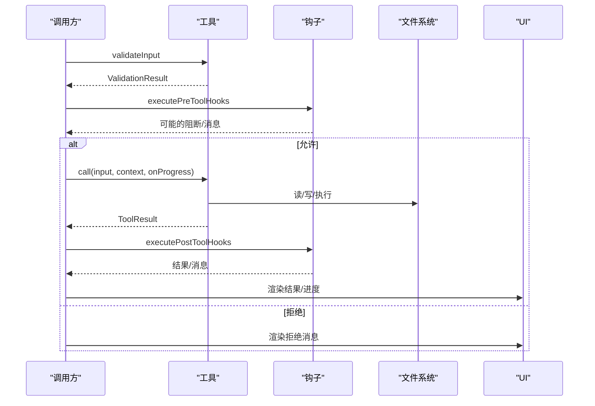
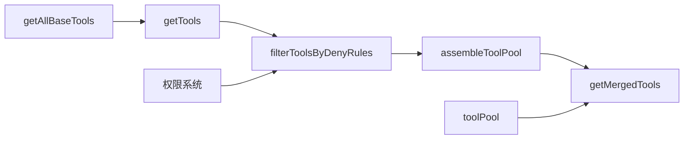

# 工具系统架构

<cite>
**本文引用的文件**
- [src/Tool.ts](file://src/Tool.ts)
- [src/tools.ts](file://src/tools.ts)
- [src/tools/FileReadTool/FileReadTool.ts](file://src/tools/FileReadTool/FileReadTool.ts)
- [src/tools/WebSearchTool/WebSearchTool.ts](file://src/tools/WebSearchTool/WebSearchTool.ts)
- [src/tools/BashTool/BashTool.tsx](file://src/tools/BashTool/BashTool.tsx)
- [src/utils/permissions/permissions.ts](file://src/utils/permissions/permissions.ts)
- [src/utils/fsOperations.ts](file://src/utils/fsOperations.ts)
- [src/utils/api.ts](file://src/utils/api.ts)
- [src/utils/toolResultStorage.ts](file://src/utils/toolResultStorage.ts)
- [src/utils/embeddedTools.ts](file://src/utils/embeddedTools.ts)
- [src/utils/platform.ts](file://src/utils/platform.ts)
- [src/utils/proxy.ts](file://src/utils/proxy.ts)
- [src/utils/caCerts.ts](file://src/utils/caCerts.ts)
- [src/utils/hooks.ts](file://src/utils/hooks.ts)
- [src/utils/toolPool.ts](file://src/utils/toolPool.ts)
</cite>

## 目录
1. [引言](#引言)
2. [项目结构](#项目结构)
3. [核心组件](#核心组件)
4. [架构总览](#架构总览)
5. [详细组件分析](#详细组件分析)
6. [依赖关系分析](#依赖关系分析)
7. [性能考量](#性能考量)
8. [故障排查指南](#故障排查指南)
9. [结论](#结论)
10. [附录](#附录)

## 引言
本文件面向 Claude Code 的工具系统，提供从接口设计到运行时执行、权限控制、UI 渲染与性能优化的全景式技术文档。重点覆盖：
- 工具接口设计：Tool 基类、工具元数据、生命周期钩子与默认行为
- 内置工具实现：文件操作、系统命令、网络检索等
- 权限控制系统：规则匹配、路径验证、用户确认流程
- 执行流程：参数校验、并发控制、错误处理与结果持久化
- 自定义工具开发：接口实现、权限设计、UI 集成
- 性能优化与最佳实践

## 项目结构
工具系统围绕“工具接口 + 工具注册 + 权限控制 + 执行管线”组织，核心文件如下：
- 接口与基类：src/Tool.ts 定义 Tool 类型、上下文、进度与默认行为
- 工具聚合：src/tools.ts 负责内置工具的装配、过滤与去重
- 典型工具实现：FileReadTool、WebSearchTool、BashTool 等
- 权限控制：src/utils/permissions/permissions.ts 实现规则匹配与决策
- 文件系统与路径：src/utils/fsOperations.ts 提供安全路径解析与权限检查
- API 与缓存：src/utils/api.ts 将工具导出为 API 模式；工具结果持久化在 src/utils/toolResultStorage.ts
- 平台与网络：src/utils/platform.ts、src/utils/proxy.ts、src/utils/caCerts.ts 支持跨平台与代理/证书场景
- 钩子与扩展：src/utils/hooks.ts 提供 pre/post 工具钩子执行框架
- 工具池与协调器：src/utils/toolPool.ts 提供工具合并与过滤策略

**图表来源**
- [src/Tool.ts:1-793](file://src/Tool.ts#L1-L793)
- [src/tools.ts:190-390](file://src/tools.ts#L190-L390)
- [src/utils/toolPool.ts:55-62](file://src/utils/toolPool.ts#L55-L62)
- [src/utils/permissions/permissions.ts:1-200](file://src/utils/permissions/permissions.ts#L1-L200)
- [src/utils/fsOperations.ts:138-317](file://src/utils/fsOperations.ts#L138-L317)
- [src/utils/api.ts:119-141](file://src/utils/api.ts#L119-L141)
- [src/utils/toolResultStorage.ts:60-108](file://src/utils/toolResultStorage.ts#L60-L108)
- [src/utils/hooks.ts:3394-3401](file://src/utils/hooks.ts#L3394-L3401)

**章节来源**
- [src/Tool.ts:1-793](file://src/Tool.ts#L1-L793)
- [src/tools.ts:190-390](file://src/tools.ts#L190-L390)
- [src/utils/toolPool.ts:55-62](file://src/utils/toolPool.ts#L55-L62)

## 核心组件
- Tool 接口与默认行为
  - 工具方法：call、description、userFacingName、renderToolUseMessage 等
  - 生命周期钩子：validateInput、checkPermissions、preparePermissionMatcher、toAutoClassifierInput
  - 并发与只读：isConcurrencySafe、isReadOnly、isDestructive、interruptBehavior
  - 结果与 UI：mapToolResultToToolResultBlockParam、renderToolResultMessage、renderToolUseProgressMessage
  - 默认行为：buildTool 使用 TOOL_DEFAULTS 提供 fail-closed 安全默认（如 checkPermissions 返回允许）
- 工具上下文 ToolUseContext
  - 包含命令、调试、思考配置、工具集合、MCPServer 连接、文件读写限制、消息与状态回调等
- 权限上下文 ToolPermissionContext
  - 权限模式、额外工作目录、规则集（允许/拒绝/询问）、是否可绕过权限等
- 工具集合与装配
  - getAllBaseTools 组装内置工具清单
  - getTools/filterToolsByDenyRules/assembleToolPool/getMergedTools 提供过滤、去重与合并

**章节来源**
- [src/Tool.ts:362-793](file://src/Tool.ts#L362-L793)
- [src/tools.ts:190-390](file://src/tools.ts#L190-L390)

## 架构总览
工具系统以“接口 + 注册 + 权限 + 执行”为主线，形成如下闭环：
- 工具注册：通过 getAllBaseTools + getTools + assembleToolPool 组合内置与 MCP 工具
- 权限决策：在调用前对输入进行 validateInput，并结合规则与分类器/钩子决定是否允许
- 执行管线：工具 call 执行，支持进度回调、并发控制与中断行为
- 输出与 UI：渲染工具使用消息、结果消息、错误/拒绝 UI；大结果持久化并提供预览
- 扩展点：钩子（pre/post）与透明包装器（如 REPL）

**图表来源**
- [src/tools.ts:271-327](file://src/tools.ts#L271-L327)
- [src/utils/permissions/permissions.ts:137-200](file://src/utils/permissions/permissions.ts#L137-L200)
- [src/Tool.ts:379-403](file://src/Tool.ts#L379-L403)

## 详细组件分析

### 工具接口与生命周期
- 关键职责
  - 输入/输出模式：inputSchema、outputSchema、inputJSONSchema
  - 行为特性：isConcurrencySafe、isReadOnly、isDestructive、interruptBehavior
  - 权限与分类：checkPermissions、toAutoClassifierInput、preparePermissionMatcher
  - UI 与展示：renderToolUseMessage、renderToolResultMessage、renderToolUseProgressMessage
  - 生命周期：validateInput、call、description、prompt、userFacingName
- 默认行为
  - buildTool 合并 TOOL_DEFAULTS，确保 fail-closed 安全性（如默认允许但可被通用权限系统覆盖）

**图表来源**
- [src/Tool.ts:362-695](file://src/Tool.ts#L362-L695)

**章节来源**
- [src/Tool.ts:362-793](file://src/Tool.ts#L362-L793)

### 内置工具实现

#### 文件读取工具（FileReadTool）
- 功能要点
  - 路径安全：阻断设备文件、解析同名 macOS 截图路径变体、安全解析符号链接链
  - 限额控制：按 token 数与大小限制读取，超限时抛出 MaxFileReadTokenExceededError
  - 多格式支持：PDF 分页提取、图像检测与缩放、笔记本文件解析
  - 权限检查：基于路径集合与规则匹配，结合 deny 规则过滤
- UI 与结果
  - 提供工具使用摘要、活动描述、结果消息渲染与错误消息渲染
  - 大文件自动分段读取与预览生成

**图表来源**
- [src/tools/FileReadTool/FileReadTool.ts:117-185](file://src/tools/FileReadTool/FileReadTool.ts#L117-L185)
- [src/utils/fsOperations.ts:138-317](file://src/utils/fsOperations.ts#L138-L317)

**章节来源**
- [src/tools/FileReadTool/FileReadTool.ts:1-200](file://src/tools/FileReadTool/FileReadTool.ts#L1-L200)
- [src/utils/fsOperations.ts:138-317](file://src/utils/fsOperations.ts#L138-L317)

#### 网络检索工具（WebSearchTool）
- 功能要点
  - 输入约束：查询词最小长度、域名白名单/黑名单
  - 输出结构：结果数组与模型附加文本，记录耗时
  - 启用条件：根据模型提供商与模型能力动态启用
  - 延迟加载：shouldDefer 与工具搜索配合
- 执行与 UI
  - 构造工具 Schema，解析服务端块序列，组装统一输出结构
  - 提供摘要、活动描述与进度消息渲染

**章节来源**
- [src/tools/WebSearchTool/WebSearchTool.ts:152-200](file://src/tools/WebSearchTool/WebSearchTool.ts#L152-L200)

#### 系统命令工具（BashTool）
- 功能要点
  - 命令解析与语义分析：拆分管道、识别搜索/读取/列表命令，判定静默命令
  - 只读约束：checkReadOnlyConstraints 与路径白名单/黑名单
  - 权限与沙箱：shouldUseSandbox 判定是否进入沙箱；权限规则匹配
  - 结果处理：图像输出检测与缩放、任务输出路径管理、长时间运行提示
- UI 与交互
  - 提供排队消息、进度消息、结果消息与错误消息渲染
  - 支持前台/后台任务切换与 VSCode SDK 通知

**章节来源**
- [src/tools/BashTool/BashTool.tsx:83-200](file://src/tools/BashTool/BashTool.tsx#L83-L200)

### 权限控制系统
- 规则与决策
  - 规则来源：用户设置、项目设置、本地设置、会话、CLI 参数等
  - 决策类型：允许/拒绝/询问；支持分类器决策、钩子决策、规则决策、多子命令汇总决策
  - 拒绝追踪：deny 记录与阈值触发，必要时回退到弹窗确认
- 路径验证
  - getPathsForPermissionCheck 收集原始路径与符号链接链，统一归一化与安全检查
  - 阻断 UNC、设备文件与危险路径
- 用户确认流程
  - createPermissionRequestMessage 生成可读的权限请求消息
  - 支持自动模式下的分类器与钩子前置检查，减少弹窗频率

**图表来源**
- [src/utils/permissions/permissions.ts:137-200](file://src/utils/permissions/permissions.ts#L137-L200)
- [src/utils/fsOperations.ts:283-317](file://src/utils/fsOperations.ts#L283-L317)

**章节来源**
- [src/utils/permissions/permissions.ts:1-200](file://src/utils/permissions/permissions.ts#L1-L200)
- [src/utils/fsOperations.ts:283-317](file://src/utils/fsOperations.ts#L283-L317)

### 工具执行流程
- 参数验证与并发控制
  - validateInput 在工具调用前执行；isConcurrencySafe 控制并发安全
  - interruptBehavior 决定新消息到达时取消或阻塞当前工具
- 错误处理与结果持久化
  - 大结果通过 toolResultStorage 持久化为文件并提供预览
  - UI 层区分“错误消息”“拒绝消息”，并支持自定义渲染
- 钩子与扩展
  - executePreToolHooks/executePostToolHooks 支持插件与外部命令钩子
  - 钩子可阻断继续、产生非阻塞错误、注入系统消息等

**图表来源**
- [src/Tool.ts:489-503](file://src/Tool.ts#L489-L503)
- [src/utils/hooks.ts:3394-3401](file://src/utils/hooks.ts#L3394-L3401)
- [src/utils/toolResultStorage.ts:60-108](file://src/utils/toolResultStorage.ts#L60-L108)

**章节来源**
- [src/Tool.ts:401-416](file://src/Tool.ts#L401-L416)
- [src/utils/hooks.ts:2136-2740](file://src/utils/hooks.ts#L2136-L2740)

### 自定义工具开发指南
- 接口实现
  - 使用 buildTool 包裹工具定义，仅提供必要的方法与模式（如 inputSchema、call、renderToolUseMessage）
  - 若未实现某些方法，将使用 TOOL_DEFAULTS 的安全默认
- 权限设计
  - 实现 checkPermissions 或依赖默认允许；若涉及文件/网络/系统命令，务必实现 validateInput 与 preparePermissionMatcher
  - 对于路径相关工具，使用 getPathsForPermissionCheck 收集路径并进行规则匹配
- UI 集成
  - 提供 userFacingName、getToolUseSummary、getActivityDescription、renderToolUseMessage/renderToolResultMessage
  - 如需延迟加载，设置 shouldDefer 并在 prompt 中说明用途
- 并发与中断
  - 明确 isConcurrencySafe；对可能阻塞的工具设置 interruptBehavior
- 结果与持久化
  - 合理设置 maxResultSizeChars；大结果交由工具结果存储模块处理

**章节来源**
- [src/Tool.ts:783-793](file://src/Tool.ts#L783-L793)
- [src/tools.ts:190-251](file://src/tools.ts#L190-L251)

## 依赖关系分析
- 工具注册与装配
  - getAllBaseTools 产出完整内置工具集；getTools 过滤禁用与拒绝规则；assembleToolPool 去重并保持提示缓存稳定
- 权限与工具池
  - filterToolsByDenyRules 与 applyCoordinatorToolFilter 在不同场景下进一步筛选
- 平台与网络
  - platform.ts 识别平台；proxy.ts/caCerts.ts 支持代理与证书；用于网络工具与 Bash 工具的网络访问

**图表来源**
- [src/tools.ts:190-390](file://src/tools.ts#L190-L390)
- [src/utils/toolPool.ts:55-62](file://src/utils/toolPool.ts#L55-L62)

**章节来源**
- [src/tools.ts:262-327](file://src/tools.ts#L262-L327)
- [src/utils/toolPool.ts:35-41](file://src/utils/toolPool.ts#L35-L41)

## 性能考量
- 工具结果持久化
  - 通过 getEffectivePersistThreshold 计算持久化阈值，避免大结果直接回传导致内存与带宽压力
- 并发与中断
  - isConcurrencySafe 与 interruptBehavior 减少资源争用与无效等待
- 缓存与提示稳定性
  - 工具注册顺序与去重策略保证提示缓存命中率；API Schema 生成阶段进行缓存控制
- 平台与网络
  - 平台识别与代理/证书配置减少失败重试与连接开销

**章节来源**
- [src/utils/toolResultStorage.ts:60-108](file://src/utils/toolResultStorage.ts#L60-L108)
- [src/utils/api.ts:119-141](file://src/utils/api.ts#L119-L141)
- [src/utils/platform.ts:11-51](file://src/utils/platform.ts#L11-L51)
- [src/utils/proxy.ts:223-277](file://src/utils/proxy.ts#L223-L277)
- [src/utils/caCerts.ts:28-29](file://src/utils/caCerts.ts#L28-L29)

## 故障排查指南
- 权限相关
  - 检查 deny 规则与 deny 记录；确认 shouldAvoidPermissionPrompts 与 awaitAutomatedChecksBeforeDialog 的影响
  - 使用 createPermissionRequestMessage 定位拒绝原因（规则/钩子/分类器）
- 文件路径问题
  - 使用 getPathsForPermissionCheck 核对路径解析与符号链接链
  - 注意 UNC、设备文件与危险路径被阻断
- 网络与代理
  - 核对代理配置与证书链；确认 WebSocket 代理 URL 与代理 Agent 获取逻辑
- 工具执行
  - 查看 validateInput 与 checkPermissions 的返回；确认 isConcurrencySafe 与 interruptBehavior 设置
  - 检查钩子执行结果（blocking/non_blocking_error）与 preventContinuation

**章节来源**
- [src/utils/permissions/permissions.ts:137-200](file://src/utils/permissions/permissions.ts#L137-L200)
- [src/utils/fsOperations.ts:138-317](file://src/utils/fsOperations.ts#L138-L317)
- [src/utils/proxy.ts:223-277](file://src/utils/proxy.ts#L223-L277)
- [src/utils/hooks.ts:2744-2768](file://src/utils/hooks.ts#L2744-L2768)

## 结论
Claude Code 的工具系统以 Tool 接口为核心，结合严格的权限控制、稳健的执行管线与完善的 UI/结果持久化，实现了可扩展、可审计、可优化的工具生态。通过 buildTool 的默认安全策略与工具池的去重/排序机制，系统在保证安全性的同时兼顾了灵活性与性能。

## 附录
- 平台与环境
  - 平台识别与 WSL 版本探测：src/utils/platform.ts
  - 嵌入式搜索工具检测：src/utils/embeddedTools.ts
- 网络与代理
  - 代理代理与 WebSocket 代理：src/utils/proxy.ts
  - CA 证书加载：src/utils/caCerts.ts
- API 导出
  - 工具转 API Schema：src/utils/api.ts

**章节来源**
- [src/utils/platform.ts:11-51](file://src/utils/platform.ts#L11-L51)
- [src/utils/embeddedTools.ts:15-29](file://src/utils/embeddedTools.ts#L15-L29)
- [src/utils/proxy.ts:223-277](file://src/utils/proxy.ts#L223-L277)
- [src/utils/caCerts.ts:28-29](file://src/utils/caCerts.ts#L28-L29)
- [src/utils/api.ts:119-141](file://src/utils/api.ts#L119-L141)