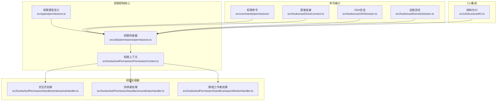
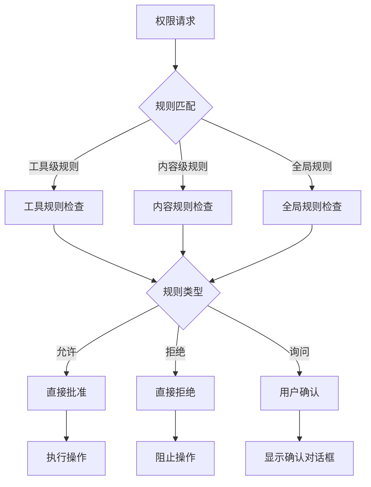
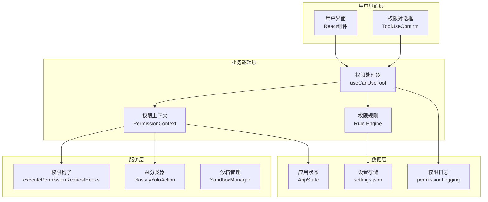
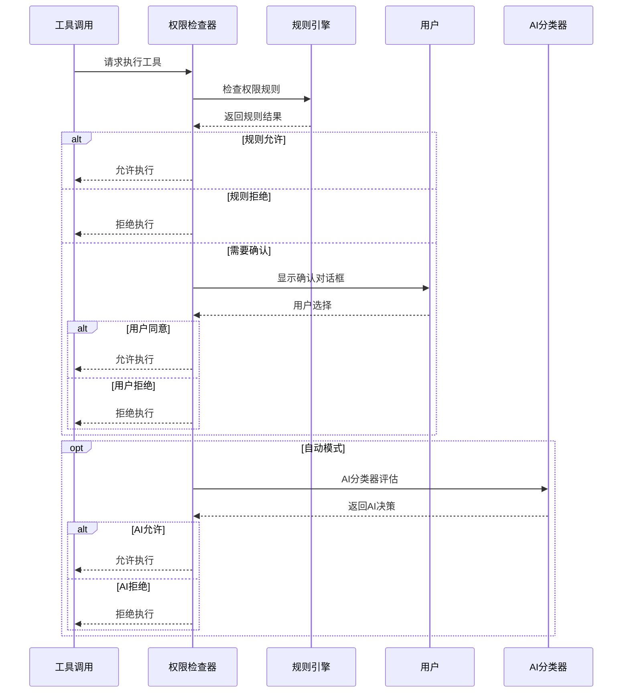
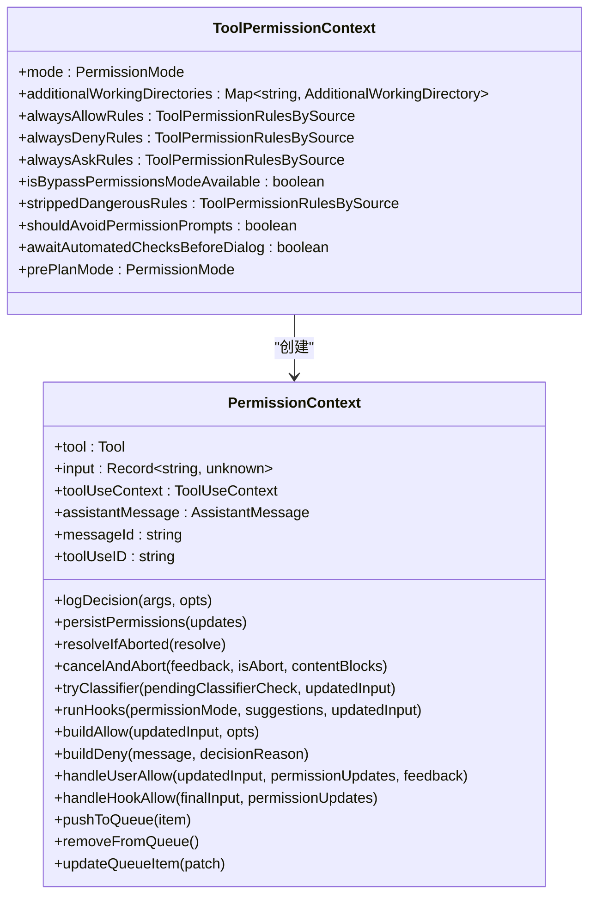
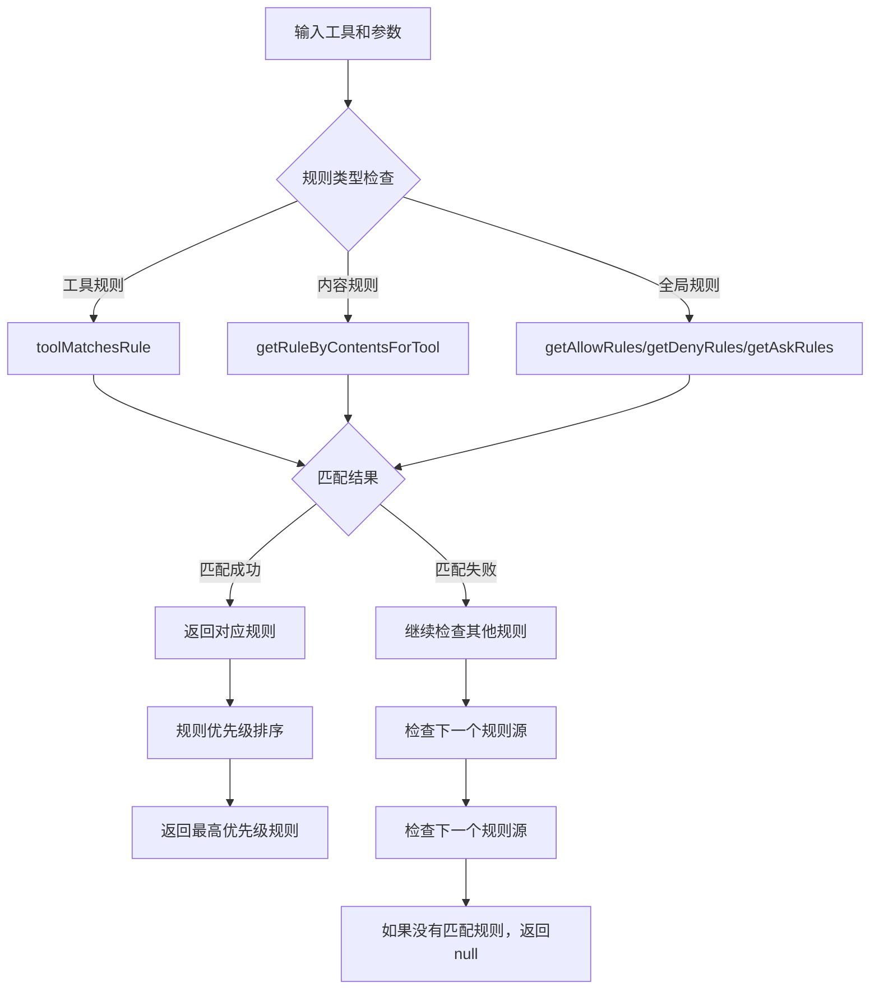
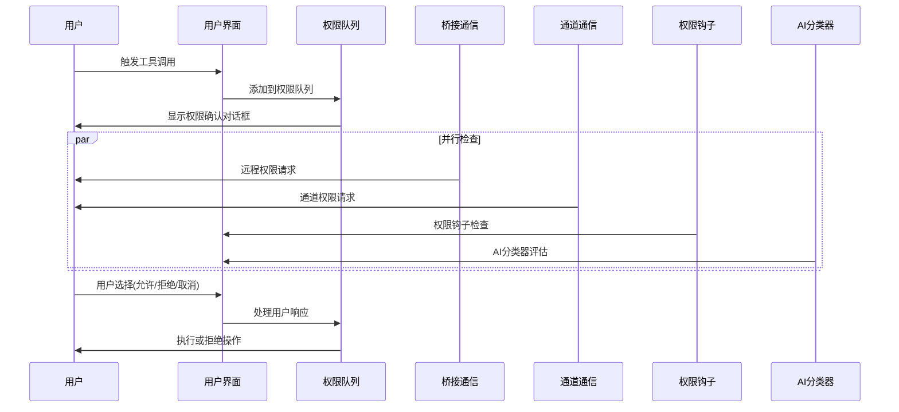
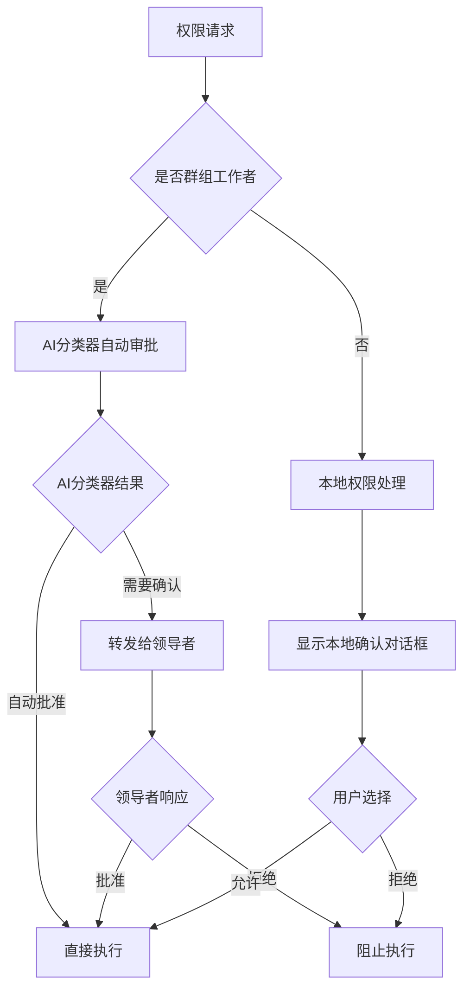

# 权限控制系统

<cite>
**本文档引用的文件**
- [permissions.ts](file://src/tabs/permissions.ts)
- [permissions.tsx](file://src/commands/permissions/permissions.tsx)
- [index.ts](file://src/commands/permissions/index.ts)
- [useCanUseTool.tsx](file://src/hooks/useCanUseTool.tsx)
- [PermissionContext.ts](file://src/hooks/toolPermission/PermissionContext.ts)
- [permissions.ts](file://src/utils/permissions/permissions.ts)
- [interactiveHandler.ts](file://src/hooks/toolPermission/handlers/interactiveHandler.ts)
- [coordinatorHandler.ts](file://src/hooks/toolPermission/handlers/coordinatorHandler.ts)
- [swarmWorkerHandler.ts](file://src/hooks/toolPermission/handlers/swarmWorkerHandler.ts)
- [structuredIO.ts](file://src/cli/structuredIO.ts)
- [useDirectConnect.ts](file://src/hooks/useDirectConnect.ts)
- [useSSHSession.ts](file://src/hooks/useSSHSession.ts)
- [useRemoteSession.ts](file://src/hooks/useRemoteSession.ts)
</cite>

## 目录
1. [简介](#简介)
2. [项目结构](#项目结构)
3. [核心组件](#核心组件)
4. [架构概览](#架构概览)
5. [详细组件分析](#详细组件分析)
6. [依赖关系分析](#依赖关系分析)
7. [性能考虑](#性能考虑)
8. [故障排除指南](#故障排除指南)
9. [结论](#结论)

## 简介

Claude Code 的权限控制系统是一个多层次的安全框架，旨在保护用户免受潜在危险操作的影响。该系统提供了多种权限模式，包括默认模式、自动模式、询问模式和绕过模式，每种模式都有其特定的使用场景和安全级别。

权限控制系统的核心目标是：
- **安全第一**：通过多层验证确保只有经过授权的操作才能执行
- **用户体验**：在保证安全的前提下提供流畅的使用体验
- **灵活性**：支持不同的权限管理模式以适应各种使用场景
- **可扩展性**：允许开发者自定义权限规则和扩展新的权限类型

## 项目结构

权限控制系统主要分布在以下目录中：



**图表来源**
- [permissions.ts:1-800](file://src/utils/permissions/permissions.ts#L1-L800)
- [PermissionContext.ts:1-389](file://src/hooks/toolPermission/PermissionContext.ts#L1-L389)
- [interactiveHandler.ts:1-537](file://src/hooks/toolPermission/handlers/interactiveHandler.ts#L1-L537)

**章节来源**
- [permissions.ts:1-800](file://src/utils/permissions/permissions.ts#L1-L800)
- [useCanUseTool.tsx:1-204](file://src/hooks/useCanUseTool.tsx#L1-L204)

## 核心组件

### 权限模式系统

权限控制系统支持四种主要的权限模式：

#### 默认模式 (default)
- **描述**：标准的安全模式，要求所有敏感操作都需要用户确认
- **适用场景**：日常开发工作，需要平衡安全性和便利性
- **特点**：提供完整的权限检查和用户确认流程

#### 自动模式 (auto)
- **描述**：基于AI分类器的智能权限审批模式
- **适用场景**：信任度较高的环境，希望减少用户干预
- **特点**：通过机器学习自动判断操作安全性

#### 询问模式 (ask)
- **描述**：强制用户确认所有操作的严格模式
- **适用场景**：高风险环境或审计要求严格的场景
- **特点**：不接受任何自动批准，必须人工确认

#### 绕过模式 (bypass)
- **描述**：完全跳过权限检查的高风险模式
- **适用场景**：开发调试或特殊管理员权限
- **特点**：仅在明确授权的情况下可用

### 权限规则系统

权限规则系统采用分层设计，支持多种规则来源：



**图表来源**
- [permissions.ts:122-302](file://src/utils/permissions/permissions.ts#L122-L302)

**章节来源**
- [permissions.ts:122-302](file://src/utils/permissions/permissions.ts#L122-L302)
- [permissions.ts:1-442](file://src/tabs/permissions.ts#L1-L442)

## 架构概览

权限控制系统采用分层架构设计，确保了模块间的清晰分离和高度内聚：



**图表来源**
- [useCanUseTool.tsx:28-191](file://src/hooks/useCanUseTool.tsx#L28-L191)
- [PermissionContext.ts:96-347](file://src/hooks/toolPermission/PermissionContext.ts#L96-L347)

## 详细组件分析

### 权限检查机制

#### 主要检查流程



**图表来源**
- [permissions.ts:473-800](file://src/utils/permissions/permissions.ts#L473-L800)
- [useCanUseTool.tsx:32-170](file://src/hooks/useCanUseTool.tsx#L32-L170)

#### 权限决策过程

权限决策过程包含多个层次的检查和处理：

1. **规则检查**：首先检查预定义的权限规则
2. **AI分类器**：在自动模式下使用AI进行安全评估
3. **用户确认**：在需要时弹出用户确认对话框
4. **钩子处理**：执行自定义权限钩子函数
5. **最终决策**：综合所有因素得出最终权限决定

**章节来源**
- [permissions.ts:473-800](file://src/utils/permissions/permissions.ts#L473-L800)
- [useCanUseTool.tsx:32-170](file://src/hooks/useCanUseTool.tsx#L32-L170)

### 权限上下文管理

#### ToolPermissionContext 的作用

ToolPermissionContext 是权限控制系统的核心数据结构，负责管理权限检查所需的上下文信息：



**图表来源**
- [permissions.ts:427-441](file://src/tabs/permissions.ts#L427-L441)
- [PermissionContext.ts:96-347](file://src/hooks/toolPermission/PermissionContext.ts#L96-L347)

#### 上下文生命周期

权限上下文的生命周期包括以下阶段：

1. **创建阶段**：初始化权限上下文，设置必要的参数
2. **检查阶段**：执行权限检查和规则匹配
3. **处理阶段**：根据检查结果执行相应的处理逻辑
4. **清理阶段**：释放资源，更新应用状态

**章节来源**
- [PermissionContext.ts:96-347](file://src/hooks/toolPermission/PermissionContext.ts#L96-L347)

### 权限规则系统

#### 规则类型和来源

权限规则系统支持多种规则类型和来源：

| 规则类型 | 描述 | 示例 |
|---------|------|------|
| 工具规则 | 针对特定工具的权限规则 | Bash, FileRead, FileWrite |
| 内容规则 | 基于操作内容的权限规则 | Bash(prefix:*), FileEdit(path:*) |
| 全局规则 | 影响所有工具的权限规则 | acceptEdits, bypassPermissions |
| 用户规则 | 用户自定义的权限规则 | 从settings.json加载 |

#### 规则匹配算法



**图表来源**
- [permissions.ts:238-302](file://src/utils/permissions/permissions.ts#L238-L302)

**章节来源**
- [permissions.ts:238-302](file://src/utils/permissions/permissions.ts#L238-L302)

### 用户交互确认流程

#### 交互式权限确认



**图表来源**
- [interactiveHandler.ts:57-531](file://src/hooks/toolPermission/handlers/interactiveHandler.ts#L57-L531)

#### 群组工作者权限处理

对于群组工作者，权限处理流程有所不同：



**图表来源**
- [swarmWorkerHandler.ts:40-156](file://src/hooks/toolPermission/handlers/swarmWorkerHandler.ts#L40-L156)

**章节来源**
- [interactiveHandler.ts:57-531](file://src/hooks/toolPermission/handlers/interactiveHandler.ts#L57-L531)
- [swarmWorkerHandler.ts:40-156](file://src/hooks/toolPermission/handlers/swarmWorkerHandler.ts#L40-L156)

## 依赖关系分析

### 模块间依赖关系

```mermaid
graph TB
subgraph "外部依赖"
A[bun:bundle]
B[@anthropic-ai/sdk]
C[React]
D[TypeScript]
end
subgraph "内部模块"
E[permissions.ts<br/>权限类型定义]
F[permissions.ts<br/>权限检查器]
G[PermissionContext.ts<br/>权限上下文]
H[interactiveHandler.ts<br/>交互式处理]
I[coordinatorHandler.ts<br/>协调者处理]
J[swarmWorkerHandler.ts<br/>群组工作者处理]
K[useCanUseTool.tsx<br/>主权限钩子]
end
A --> F
B --> F
C --> H
D --> E
E --> F
F --> G
G --> H
G --> I
G --> J
H --> K
I --> K
J --> K
```

**图表来源**
- [permissions.ts:1-94](file://src/utils/permissions/permissions.ts#L1-L94)
- [PermissionContext.ts:1-44](file://src/hooks/toolPermission/PermissionContext.ts#L1-L44)

### 关键依赖点

1. **权限类型定义**：提供类型安全的权限系统基础
2. **权限检查器**：核心业务逻辑，处理复杂的权限决策
3. **权限上下文**：管理权限检查的状态和生命周期
4. **处理器模块**：处理不同场景下的权限流程
5. **主权限钩子**：统一的权限检查入口点

**章节来源**
- [permissions.ts:1-94](file://src/utils/permissions/permissions.ts#L1-L94)
- [useCanUseTool.tsx:1-27](file://src/hooks/useCanUseTool.tsx#L1-L27)

## 性能考虑

### 性能优化策略

1. **异步处理**：权限检查和AI分类器评估都是异步执行，避免阻塞主线程
2. **缓存机制**：AI分类器结果和权限决策结果会被缓存，减少重复计算
3. **并行检查**：多个权限检查可以并行执行，提高整体性能
4. **条件加载**：某些功能（如AI分类器）只在需要时加载，减少内存占用

### 性能监控

系统提供了详细的性能监控机制：

- **令牌使用统计**：跟踪AI分类器的API调用成本
- **延迟测量**：记录权限检查的响应时间
- **错误追踪**：监控权限系统的异常情况
- **用户行为分析**：分析用户的权限确认行为模式

## 故障排除指南

### 常见问题及解决方案

#### 权限请求超时

**症状**：权限确认对话框长时间无响应
**可能原因**：
- AI分类器API调用超时
- 网络连接问题
- 权限钩子执行时间过长

**解决方法**：
1. 检查网络连接状态
2. 查看AI分类器API的可用性
3. 优化权限钩子的执行效率

#### 权限规则冲突

**症状**：同一操作同时满足多个权限规则
**可能原因**：
- 规则优先级设置不当
- 规则定义存在矛盾
- 规则来源冲突

**解决方法**：
1. 检查规则的优先级设置
2. 审查规则定义的一致性
3. 清理冲突的规则配置

#### 用户交互问题

**症状**：权限确认对话框无法正常显示或响应
**可能原因**：
- React组件渲染问题
- 事件处理异常
- 状态管理错误

**解决方法**：
1. 检查React组件的渲染逻辑
2. 验证事件处理器的正确性
3. 审查状态更新的时机

**章节来源**
- [interactiveHandler.ts:523-529](file://src/hooks/toolPermission/handlers/interactiveHandler.ts#L523-L529)

## 结论

Claude Code 的权限控制系统是一个设计精良、功能完善的多层次安全框架。它通过灵活的权限模式、强大的规则系统和智能化的AI辅助，在保证安全性的同时提供了优秀的用户体验。

### 主要优势

1. **多层次安全**：结合规则检查、AI分类器和用户确认，提供全面的安全保障
2. **灵活配置**：支持多种权限模式，适应不同的使用场景和安全需求
3. **高性能设计**：采用异步处理和缓存机制，确保系统的响应速度
4. **可扩展性**：模块化的架构设计，便于添加新的权限类型和处理逻辑

### 发展方向

1. **增强AI分类器**：进一步提升AI分类器的准确性和响应速度
2. **改进用户体验**：优化权限确认对话框的设计和交互流程
3. **扩展规则系统**：支持更复杂的权限规则和动态规则生成
4. **加强监控能力**：提供更详细的权限使用统计和分析功能

该权限控制系统为 Claude Code 提供了坚实的安全基础，确保用户能够在享受强大功能的同时保持操作的安全性。