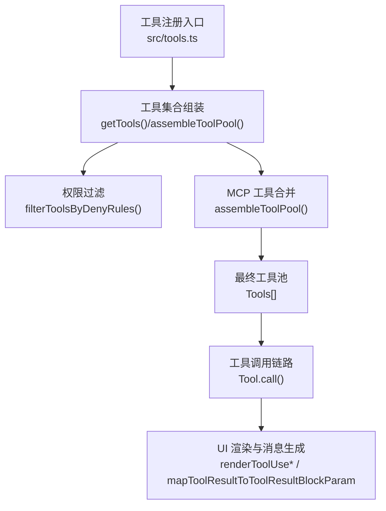
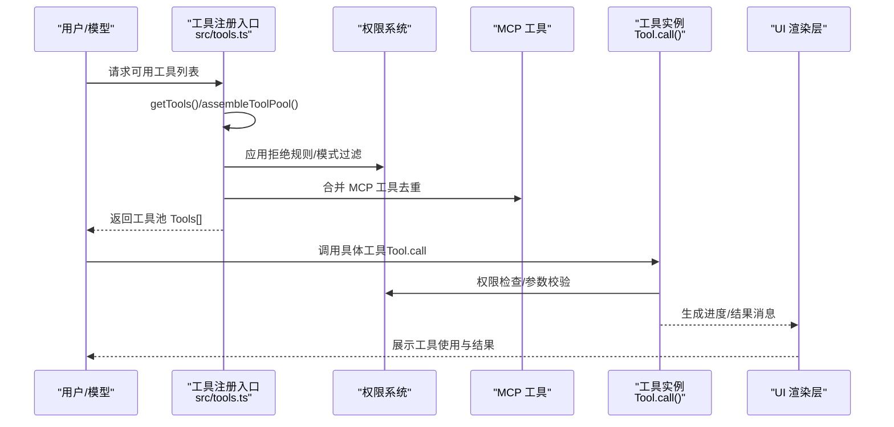
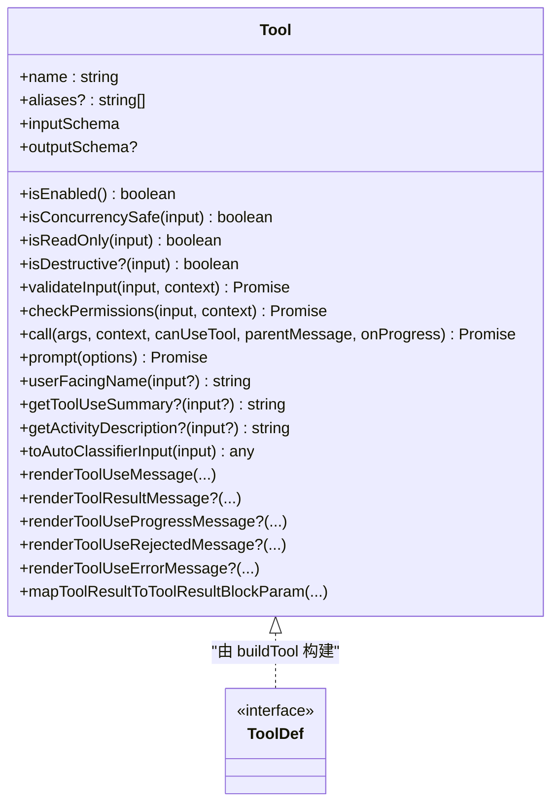
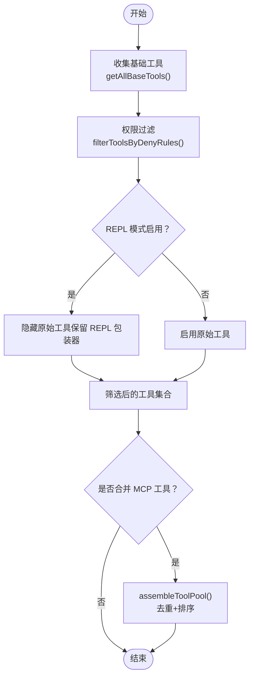
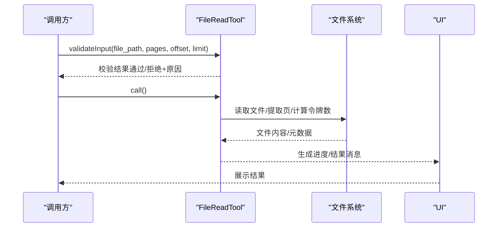
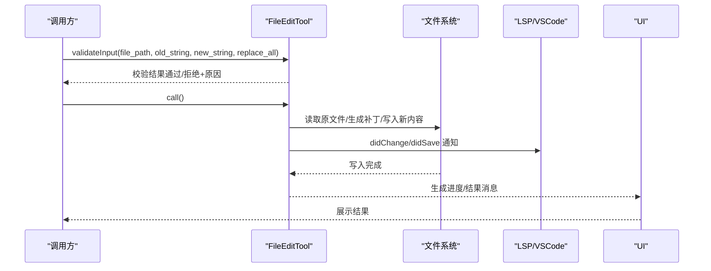
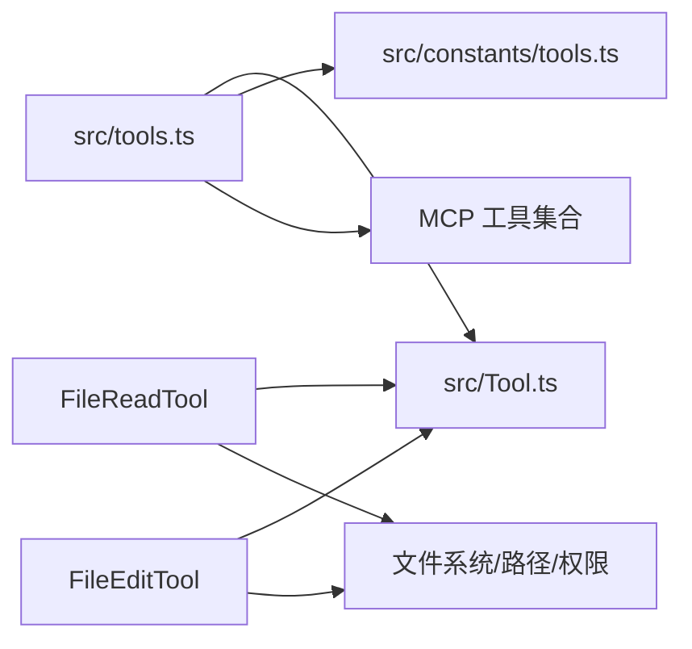

# 自定义工具开发

<cite>
**本文引用的文件**
- [src/tools.ts](file://src/tools.ts)
- [src/Tool.ts](file://src/Tool.ts)
- [src/tools/utils.ts](file://src/tools/utils.ts)
- [src/tools/FileReadTool/FileReadTool.ts](file://src/tools/FileReadTool/FileReadTool.ts)
- [src/tools/FileEditTool/FileEditTool.ts](file://src/tools/FileEditTool/FileEditTool.ts)
- [src/constants/tools.ts](file://src/constants/tools.ts)
- [QUICKSTART.md](file://QUICKSTART.md)
- [package.json](file://package.json)
</cite>

## 目录
1. [简介](#简介)
2. [项目结构](#项目结构)
3. [核心组件](#核心组件)
4. [架构总览](#架构总览)
5. [详细组件分析](#详细组件分析)
6. [依赖关系分析](#依赖关系分析)
7. [性能考量](#性能考量)
8. [故障排除指南](#故障排除指南)
9. [结论](#结论)
10. [附录](#附录)

## 简介
本指南面向希望在 Claude Code 中开发自定义工具的工程师，系统讲解工具开发流程、接口实现、参数校验、权限设计、UI 集成、模板与最佳实践、测试策略、部署与分发、以及常见问题排查。文档基于仓库中的工具框架与内置工具实现进行归纳总结，并提供可操作的开发步骤与可视化图示。

## 项目结构
- 工具注册与装配：通过集中入口聚合所有内置工具，并结合权限规则与 MCP 工具进行去重与排序，形成最终可用工具池。
- 工具接口与默认行为：统一的工具类型定义与构建器，提供安全默认值与可选扩展点。
- 内置工具范例：文件读取、文件编辑等典型工具展示了参数校验、权限检查、UI 渲染、结果映射等完整流程。
- 构建与运行：提供源码构建与快速启动说明，便于本地调试与集成。

图表来源
- [src/tools.ts:193-390](file://src/tools.ts#L193-L390)
- [src/Tool.ts:362-695](file://src/Tool.ts#L362-L695)

章节来源
- [src/tools.ts:193-390](file://src/tools.ts#L193-L390)
- [QUICKSTART.md:1-122](file://QUICKSTART.md#L1-L122)
- [package.json:1-21](file://package.json#L1-L21)

## 核心组件
- 工具类型与构建器
  - 工具类型定义包含名称、输入输出模式、并发安全、只读/破坏性标记、权限检查、描述生成、UI 渲染、进度回调、结果映射等能力。
  - 提供构建器用于快速产出完整工具对象，自动填充常用默认值，降低样板代码。
- 工具注册与装配
  - 统一导出工具列表，按环境特性与权限上下文动态筛选，支持 REPL 模式下的工具可见性调整。
  - 支持将 MCP 工具与内置工具合并，保证提示词缓存稳定性与去重一致性。
- 权限与安全
  - 基于权限上下文与规则集进行工具级拒绝/允许/询问判定；内置工具普遍实现路径匹配器与权限检查。
- UI 与消息
  - 工具负责渲染“使用中”、“结果”、“被拒绝”、“错误”等消息，以及进度条与摘要信息，确保一致的用户体验。

章节来源
- [src/Tool.ts:362-792](file://src/Tool.ts#L362-L792)
- [src/tools.ts:262-390](file://src/tools.ts#L262-L390)

## 架构总览
下图展示从工具注册到调用再到 UI 展示的端到端流程，涵盖权限过滤、MCP 合并、调用执行与结果映射。

图表来源
- [src/tools.ts:271-390](file://src/tools.ts#L271-L390)
- [src/Tool.ts:379-503](file://src/Tool.ts#L379-L503)

## 详细组件分析

### 工具接口与构建器（Tool 与 buildTool）
- 关键职责
  - 定义工具的输入/输出模式、并发安全、只读/破坏性、权限检查、描述生成、UI 渲染、进度回调、结果映射等。
  - 提供构建器，自动填充默认实现（如 isEnabled 默认返回 true、checkPermissions 默认放行等），减少重复实现。
- 设计要点
  - 输入/输出模式采用 Zod 类型或 JSON Schema，便于严格校验与跨协议传输。
  - 工具名与别名支持查找与匹配，便于向后兼容与搜索提示。
  - 结果映射支持将工具输出转换为消息块参数，适配不同消费方（如 SDK）。
- 最佳实践
  - 明确声明 isReadOnly/isDestructive，帮助权限系统与 UI 做出正确提示。
  - 实现 validateInput 并尽早失败，避免昂贵的 I/O 或网络请求。
  - 提供 userFacingName 与 getToolUseSummary，提升可读性与可搜索性。

图表来源
- [src/Tool.ts:362-792](file://src/Tool.ts#L362-L792)

章节来源
- [src/Tool.ts:362-792](file://src/Tool.ts#L362-L792)

### 工具注册与装配（tools.ts）
- 工具集合
  - getAllBaseTools：根据环境标志与特性开关收集所有内置工具，包含条件加载与平台差异处理。
  - getTools：在内置工具基础上应用权限过滤、REPL 可见性调整、启用状态过滤等。
  - assembleToolPool/getMergedTools：将内置工具与 MCP 工具合并，保持排序稳定与去重优先级。
- 权限过滤
  - filterToolsByDenyRules：依据权限上下文中的拒绝规则剔除工具，匹配逻辑与运行时一致。
- 最佳实践
  - 将工具名与别名统一管理，避免重复与歧义。
  - 对可能被拒绝的工具，提前在描述与 UI 中给出清晰提示。

图表来源
- [src/tools.ts:193-390](file://src/tools.ts#L193-L390)

章节来源
- [src/tools.ts:193-390](file://src/tools.ts#L193-L390)

### 文件读取工具（FileReadTool）示例
- 功能概览
  - 支持文本、图片、PDF、Jupyter Notebook 等多种内容类型；对大文件与高 token 数量进行限制与提示。
  - 提供路径展开、设备文件阻断、UNC 路径安全处理、相似文件建议等增强体验。
- 参数校验与安全
  - validateInput：解析页码范围、检查拒绝规则、二进制扩展名、设备文件阻断、UNC 路径等。
  - dedup 机制：对未变更的读取请求返回占位结果，减少重复传输与缓存浪费。
- UI 与结果映射
  - renderToolUseMessage/renderToolResultMessage：渲染简洁摘要与结果消息。
  - mapToolResultToToolResultBlockParam：将不同类型结果映射为消息块参数，支持图片、PDF 元数据、文本格式化等。

图表来源
- [src/tools/FileReadTool/FileReadTool.ts:418-718](file://src/tools/FileReadTool/FileReadTool.ts#L418-L718)

章节来源
- [src/tools/FileReadTool/FileReadTool.ts:1-800](file://src/tools/FileReadTool/FileReadTool.ts#L1-L800)

### 文件编辑工具（FileEditTool）示例
- 功能概览
  - 在读取后进行一致性检查，防止并发修改导致的覆盖冲突；支持替换全部与逐个替换。
  - 与 LSP 与 VSCode SDK 集成，更新诊断与差分视图。
- 参数校验与安全
  - validateInput：检测团队内存密钥风险、UNC 路径、过大文件、空文件创建、旧字符串不存在、笔记本文件专用工具提示等。
  - 一致性检查：对比上次读取时间戳与内容，避免意外覆盖。
- UI 与结果映射
  - renderToolUseMessage/renderToolResultMessage：渲染编辑摘要与结果消息。
  - mapToolResultToToolResultBlockParam：返回编辑成功提示与可选 Git Diff 概要。

图表来源
- [src/tools/FileEditTool/FileEditTool.ts:137-595](file://src/tools/FileEditTool/FileEditTool.ts#L137-L595)

章节来源
- [src/tools/FileEditTool/FileEditTool.ts:1-626](file://src/tools/FileEditTool/FileEditTool.ts#L1-L626)

### 权限与工具可用性常量（constants/tools.ts）
- 工具可用性矩阵
  - 为不同角色/模式（异步代理、协调者模式、进程内队友等）定义允许/禁止的工具集合。
  - 通过特性开关与环境变量控制工具暴露范围，确保安全与一致性。
- 最佳实践
  - 在工具定义中明确 isReadOnly/isDestructive，配合权限系统进行更细粒度控制。
  - 使用 preparePermissionMatcher 与 matchingRuleForInput，实现路径级规则匹配。

章节来源
- [src/constants/tools.ts:1-113](file://src/constants/tools.ts#L1-L113)

### 工具调用上下文与消息关联（tools/utils.ts）
- 消息标记
  - 为用户消息附加 sourceToolUseID，避免工具运行中重复显示“正在运行”消息。
- 上下文提取
  - 从父消息中提取工具调用 ID，便于结果与进度绑定。

章节来源
- [src/tools/utils.ts:1-41](file://src/tools/utils.ts#L1-L41)

## 依赖关系分析
- 工具注册入口依赖：
  - 工具清单与特性开关（feature/USER_TYPE/NODE_ENV 等）决定工具可用性。
  - 权限上下文与规则集决定工具是否被拒绝。
  - MCP 工具集合在运行时注入，需与内置工具合并。
- 内置工具依赖：
  - 文件系统抽象、路径处理、权限规则匹配、UI 渲染、消息构造等通用模块。
- 外部依赖：
  - 构建阶段使用 esbuild 与 Bun 编译特性（feature/MACRO），运行时通过 stubs 与宏替换适配。

图表来源
- [src/tools.ts:193-390](file://src/tools.ts#L193-L390)
- [src/Tool.ts:362-792](file://src/Tool.ts#L362-L792)
- [src/constants/tools.ts:1-113](file://src/constants/tools.ts#L1-L113)

章节来源
- [src/tools.ts:193-390](file://src/tools.ts#L193-L390)
- [src/Tool.ts:362-792](file://src/Tool.ts#L362-L792)
- [src/constants/tools.ts:1-113](file://src/constants/tools.ts#L1-L113)

## 性能考量
- 结果持久化阈值
  - 工具可声明最大结果字符数，超过阈值将结果保存至磁盘并通过预览消息返回，避免大结果直接回传。
- 读取去重
  - 文件读取工具对未变更的范围读取进行去重，显著降低重复传输与缓存开销。
- 令牌估算与限制
  - 对文本与特定文件类型进行粗略令牌估算，必要时通过 API 进行精确统计，避免超限。
- 排序与缓存稳定性
  - 工具池按名称排序并去重，内置工具优先，有助于提示词缓存命中率稳定。

章节来源
- [src/tools.ts:345-390](file://src/tools.ts#L345-L390)
- [src/tools/FileReadTool/FileReadTool.ts:536-574](file://src/tools/FileReadTool/FileReadTool.ts#L536-L574)
- [src/utils/toolResultStorage.ts:60-108](file://src/utils/toolResultStorage.ts#L60-L108)

## 故障排除指南
- 构建相关
  - 使用 esbuild 最佳努力构建时，部分 feature-gated 模块缺失会导致“无法解析”的错误；可通过创建桩文件并重新构建解决。
  - 使用 Bun 全量重建需要内部访问与编译配置，普通开发者建议优先使用预编译 CLI 或最佳努力构建。
- 工具不可用
  - 检查权限上下文与拒绝规则，确认工具是否被 blanket deny。
  - 在 REPL 模式下，原始工具可能被隐藏，应改用 REPL 包装器或切换模式。
- 文件读取失败
  - UNC 路径会触发安全检查，避免 NTLM 凭据泄露；请先通过权限检查再进行 I/O。
  - 对于 macOS 截图文件，若空格字符不匹配，工具会尝试替代空格后再读取。
- 文件编辑冲突
  - 若文件在上次读取后被修改，工具会拒绝写入以避免覆盖；请先重新读取文件。
  - 对笔记本文件，请使用专用编辑工具而非文本替换工具。

章节来源
- [QUICKSTART.md:58-104](file://QUICKSTART.md#L58-L104)
- [src/tools/FileReadTool/FileReadTool.ts:463-494](file://src/tools/FileReadTool/FileReadTool.ts#L463-L494)
- [src/tools/FileEditTool/FileEditTool.ts:289-311](file://src/tools/FileEditTool/FileEditTool.ts#L289-L311)

## 结论
通过统一的工具接口与构建器、严格的参数校验与权限控制、完善的 UI 渲染与消息映射，Claude Code 的工具体系实现了高扩展性与安全性。开发者可参考内置工具的最佳实践，快速实现自定义工具，并在权限、性能与用户体验之间取得平衡。

## 附录

### 开发流程与模板
- 步骤
  - 定义工具输入/输出模式（Zod 或 JSON Schema），明确并发安全与只读/破坏性属性。
  - 实现 validateInput 与 checkPermissions，尽早失败并提供清晰错误信息。
  - 实现 call 方法，按需上报进度，返回标准化结果。
  - 实现 UI 渲染函数（使用中/结果/被拒绝/错误），并实现 mapToolResultToToolResultBlockParam。
  - 在工具注册入口导出工具，确保名称与别名唯一。
- 模板要点
  - 使用 buildTool 快速产出完整工具对象，避免遗漏默认实现。
  - 为工具提供 searchHint、userFacingName、getToolUseSummary 等可发现性字段。
  - 对大结果或敏感操作设置 maxResultSizeChars 与 isDestructive。

章节来源
- [src/Tool.ts:757-792](file://src/Tool.ts#L757-L792)
- [src/tools.ts:193-251](file://src/tools.ts#L193-L251)

### 测试策略
- 单元测试
  - 验证 validateInput 的边界条件（路径、大小、页码范围、拒绝规则）。
  - 验证权限检查在不同权限上下文下的行为。
- 集成测试
  - 模拟工具调用链路，覆盖 UI 渲染、消息映射、进度回调等端到端流程。
- 权限测试
  - 构造拒绝/允许/询问规则，验证工具在不同规则组合下的可见性与可用性。
- 性能测试
  - 对大文件读取/编辑、高令牌内容进行压力测试，验证去重与阈值控制效果。

章节来源
- [src/tools.ts:262-327](file://src/tools.ts#L262-L327)
- [src/tools/FileReadTool/FileReadTool.ts:418-495](file://src/tools/FileReadTool/FileReadTool.ts#L418-L495)
- [src/tools/FileEditTool/FileEditTool.ts:137-362](file://src/tools/FileEditTool/FileEditTool.ts#L137-L362)

### 部署与分发
- 构建
  - 使用提供的脚本进行准备与构建，或直接使用预编译 CLI。
- 安装
  - 通过全局安装或直接运行 CLI 使用工具能力。
- 版本管理
  - 通过包版本与构建产物进行版本区分，遵循语义化版本管理。

章节来源
- [QUICKSTART.md:7-22](file://QUICKSTART.md#L7-L22)
- [package.json:7-12](file://package.json#L7-L12)