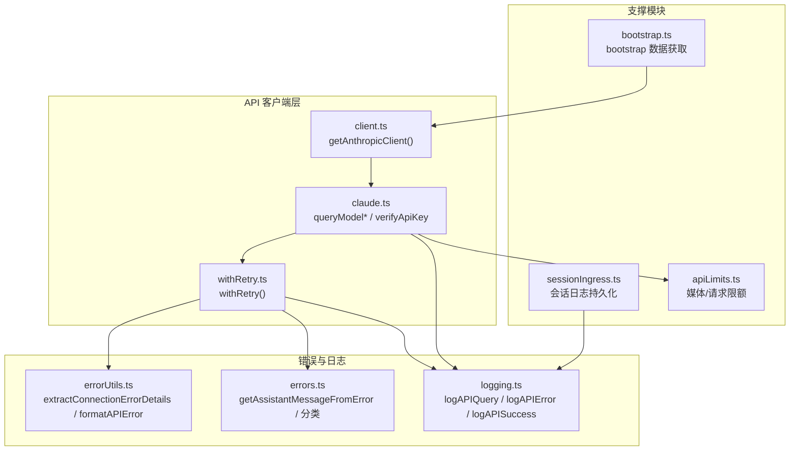
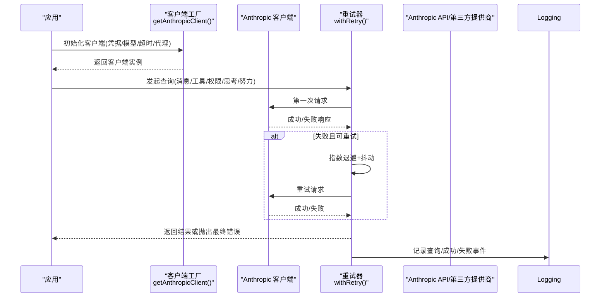
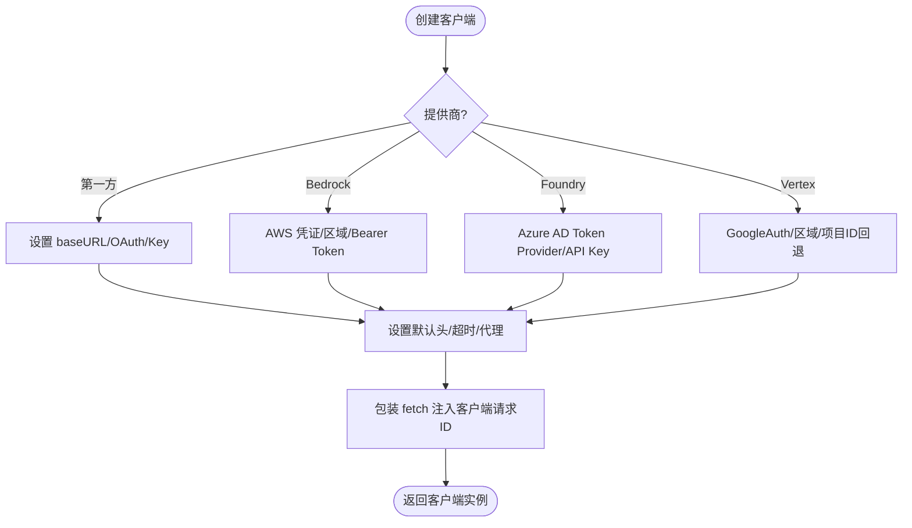
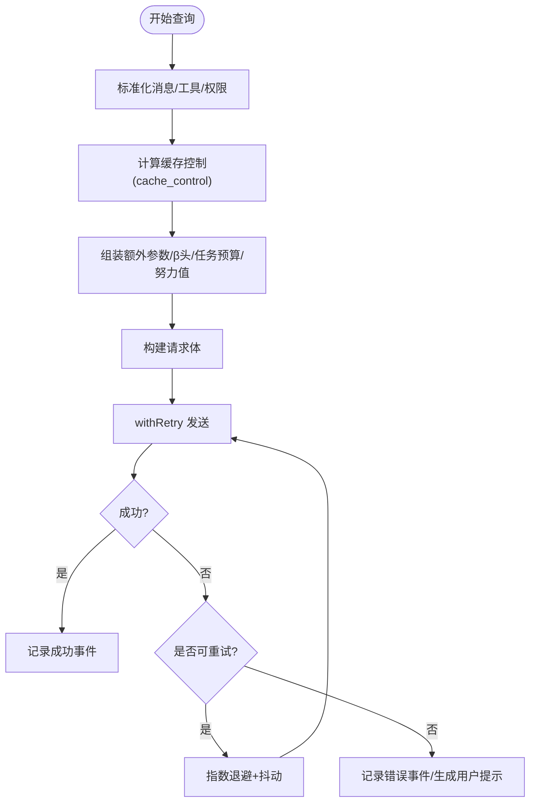
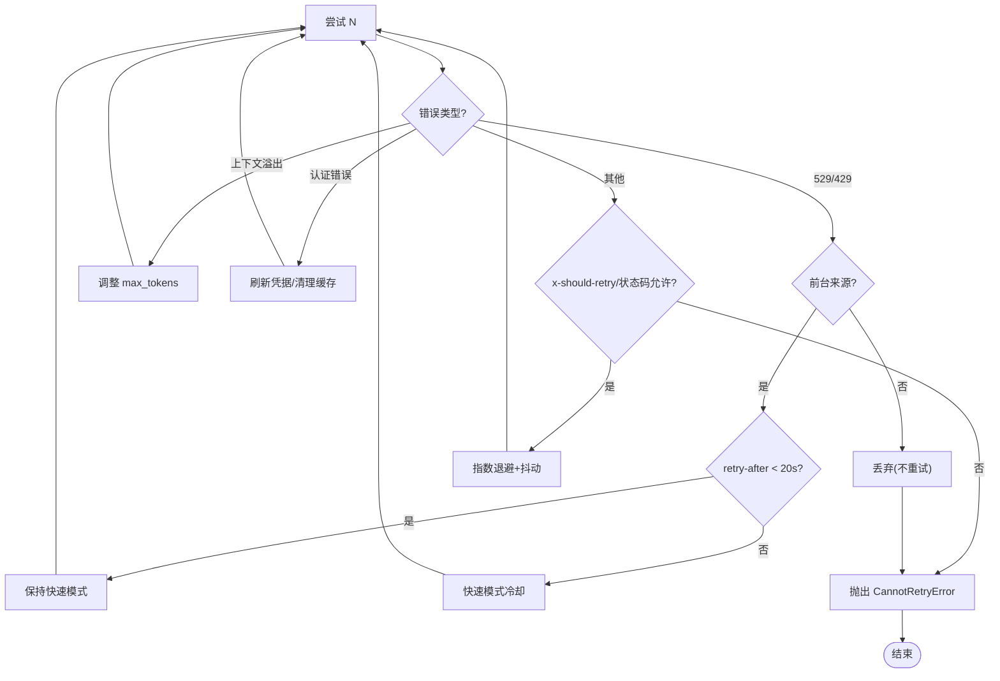
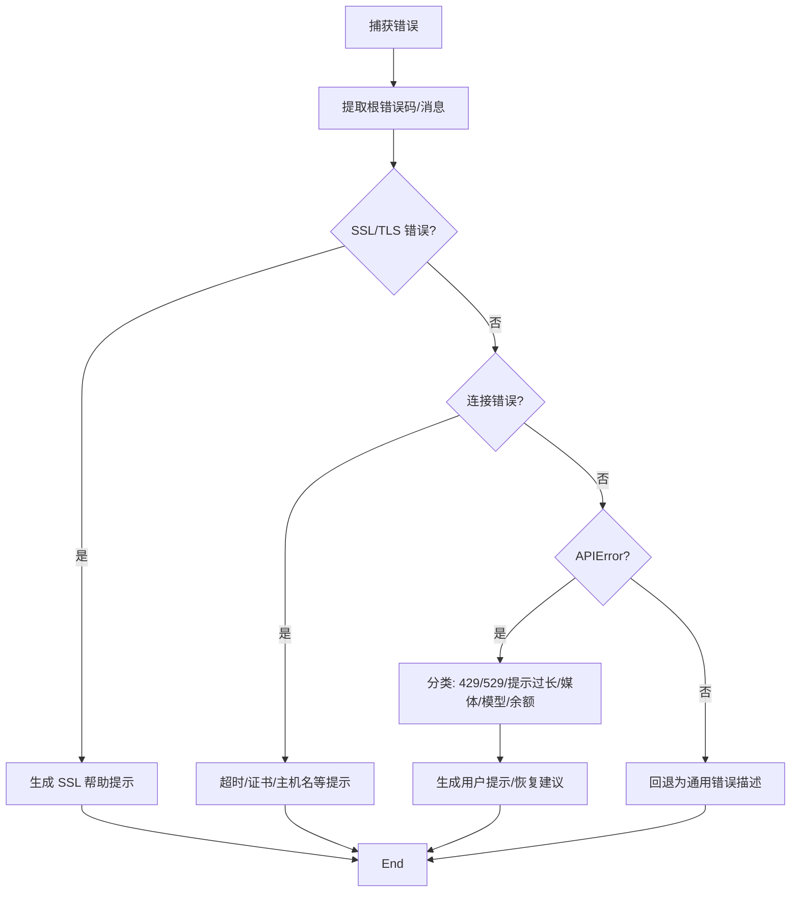
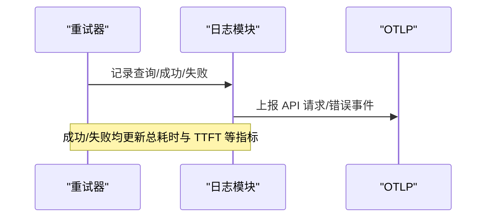
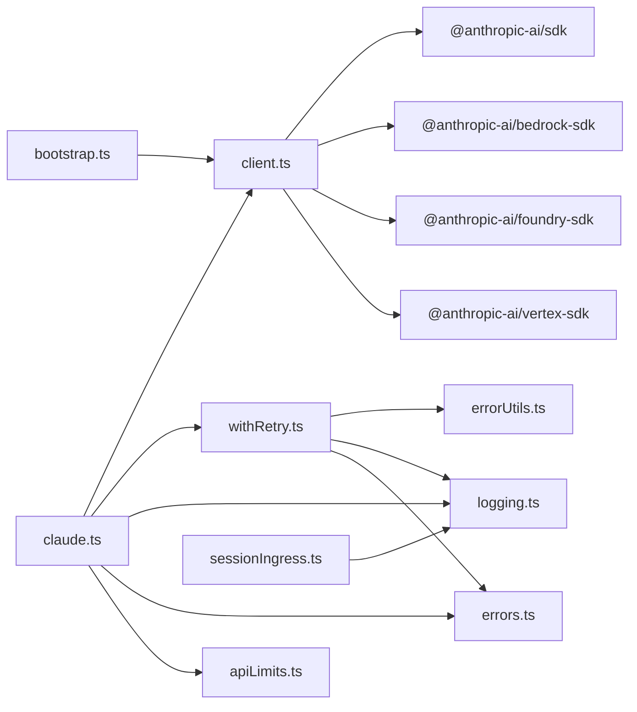

# API 客户端

<cite>
**本文引用的文件**
- [client.ts](file://src/services/api/client.ts)
- [claude.ts](file://src/services/api/claude.ts)
- [withRetry.ts](file://src/services/api/withRetry.ts)
- [errorUtils.ts](file://src/services/api/errorUtils.ts)
- [errors.ts](file://src/services/api/errors.ts)
- [logging.ts](file://src/services/api/logging.ts)
- [bootstrap.ts](file://src/services/api/bootstrap.ts)
- [sessionIngress.ts](file://src/services/api/sessionIngress.ts)
- [apiLimits.ts](file://src/constants/apiLimits.ts)
</cite>

## 目录
1. [简介](#简介)
2. [项目结构](#项目结构)
3. [核心组件](#核心组件)
4. [架构总览](#架构总览)
5. [详细组件分析](#详细组件分析)
6. [依赖关系分析](#依赖关系分析)
7. [性能考量](#性能考量)
8. [故障排查指南](#故障排查指南)
9. [结论](#结论)
10. [附录](#附录)

## 简介
本文件面向 Claude Code 的 API 客户端系统，系统性梳理其架构设计与实现细节，覆盖以下主题：
- 客户端初始化：支持多提供商（第一方、AWS Bedrock、Azure Foundry、GCP Vertex）与多种认证方式（API Key、OAuth、Bearer Token、云厂商凭据刷新）
- 连接管理：默认头、超时、代理、日志器、自定义 fetch 包装
- 请求构建与发送：消息序列化、额外参数注入、缓存控制、提示词缓存 TTL 与作用域
- 重试机制：指数退避、抖动、幂等重试窗口、持久重试模式、529/429 分流策略、快速模式降级
- 错误处理：错误分类、用户友好提示、速率限制与配额解析、SSL/TLS 帮助信息
- 使用示例与最佳实践：批量请求、并发控制、速率限制与配额处理、性能监控
- API 版本管理与兼容：Beta 头、环境变量注入、模型能力差异

## 项目结构
API 客户端位于 src/services/api 目录，围绕“客户端工厂 + 查询编排 + 重试 + 错误处理 + 日志”五条主线组织代码，并通过常量与工具模块支撑媒体限额、模型能力与提供商选择。

图表来源
- [client.ts:88-316](file://src/services/api/client.ts#L88-L316)
- [claude.ts:709-800](file://src/services/api/claude.ts#L709-L800)
- [withRetry.ts:170-517](file://src/services/api/withRetry.ts#L170-L517)
- [errorUtils.ts:42-260](file://src/services/api/errorUtils.ts#L42-L260)
- [errors.ts:425-800](file://src/services/api/errors.ts#L425-L800)
- [logging.ts:171-789](file://src/services/api/logging.ts#L171-L789)
- [bootstrap.ts:42-142](file://src/services/api/bootstrap.ts#L42-L142)
- [sessionIngress.ts:63-212](file://src/services/api/sessionIngress.ts#L63-L212)
- [apiLimits.ts:1-95](file://src/constants/apiLimits.ts#L1-L95)

章节来源
- [client.ts:1-390](file://src/services/api/client.ts#L1-L390)
- [claude.ts:1-800](file://src/services/api/claude.ts#L1-L800)
- [withRetry.ts:1-823](file://src/services/api/withRetry.ts#L1-L823)
- [errorUtils.ts:1-261](file://src/services/api/errorUtils.ts#L1-L261)
- [errors.ts:1-1208](file://src/services/api/errors.ts#L1-L1208)
- [logging.ts:1-789](file://src/services/api/logging.ts#L1-L789)
- [bootstrap.ts:1-142](file://src/services/api/bootstrap.ts#L1-L142)
- [sessionIngress.ts:1-515](file://src/services/api/sessionIngress.ts#L1-L515)
- [apiLimits.ts:1-95](file://src/constants/apiLimits.ts#L1-L95)

## 核心组件
- 客户端工厂与连接管理
  - getAnthropicClient：统一创建 Anthropic 客户端实例，按提供商分支注入凭据与区域；设置默认头、超时、代理、日志器；支持自定义 fetch 包装并注入客户端请求 ID。
- 查询编排与请求构建
  - queryModel*：封装消息序列化、提示词缓存控制、额外参数注入、输出格式与任务预算、思维模式与努力值配置、工具权限上下文等。
  - verifyApiKey：最小化调用验证 API Key 可用性。
- 重试与回退
  - withRetry：指数退避 + 抖动；区分 529/429；持久重试模式；快速模式降级；模型回退；上下文溢出自动调整 max_tokens。
- 错误处理与提示
  - errorUtils：提取底层 SSL/TLS 错误码与消息，生成用户可操作的提示。
  - errors：针对不同错误类型（速率限制、提示过长、媒体过大、无效模型名、信用不足等）生成用户可见消息与恢复建议。
- 日志与可观测性
  - logging：记录查询、成功与失败事件，检测网关类型，OTLP 事件，Beta 跟踪关联，耗时与成本统计。
- 支撑能力
  - bootstrap：从第一方 API 拉取客户端数据并缓存。
  - sessionIngress：会话日志持久化与并发控制。
  - apiLimits：媒体与请求大小上限常量。

章节来源
- [client.ts:88-316](file://src/services/api/client.ts#L88-L316)
- [claude.ts:709-800](file://src/services/api/claude.ts#L709-L800)
- [withRetry.ts:170-517](file://src/services/api/withRetry.ts#L170-L517)
- [errorUtils.ts:42-260](file://src/services/api/errorUtils.ts#L42-L260)
- [errors.ts:425-800](file://src/services/api/errors.ts#L425-L800)
- [logging.ts:171-789](file://src/services/api/logging.ts#L171-L789)
- [bootstrap.ts:42-142](file://src/services/api/bootstrap.ts#L42-L142)
- [sessionIngress.ts:63-212](file://src/services/api/sessionIngress.ts#L63-L212)
- [apiLimits.ts:1-95](file://src/constants/apiLimits.ts#L1-L95)

## 架构总览
下图展示从应用到 API 的关键交互路径，包括客户端初始化、请求包装、重试与错误分类、日志与监控。

图表来源
- [client.ts:88-316](file://src/services/api/client.ts#L88-L316)
- [withRetry.ts:170-517](file://src/services/api/withRetry.ts#L170-L517)
- [logging.ts:171-789](file://src/services/api/logging.ts#L171-L789)

## 详细组件分析

### 客户端工厂与连接管理
- 多提供商支持
  - 第一方：直接 API，支持 OAuth 令牌与 API Key；可切换 baseURL（如使用 OAuth 配置）。
  - AWS Bedrock：支持 Bearer Token 或 SDK 凭证刷新；小快模型可指定区域覆盖。
  - Azure Foundry：支持 API Key 或 Azure AD Bearer Token Provider；可跳过鉴权用于测试。
  - GCP Vertex：支持 GoogleAuth 客户端；在无项目/密钥文件时提供项目 ID 回退以避免元数据服务器超时。
- 默认头与保护
  - 统一设置 x-app、User-Agent、会话 ID、容器/远程会话 ID、附加保护头等；支持 ANTHROPIC_CUSTOM_HEADERS 注入。
- 超时与代理
  - 超时来自环境变量；代理选项透传给 SDK；可替换 fetch 并注入客户端请求 ID 以便跨超时追踪。
- 日志器
  - 调试模式下注入 stderr 日志器，便于定位 SDK 层问题。

图表来源
- [client.ts:88-316](file://src/services/api/client.ts#L88-L316)

章节来源
- [client.ts:32-316](file://src/services/api/client.ts#L32-L316)

### 查询编排与请求构建
- 消息序列化
  - userMessageToMessageParam / assistantMessageToMessageParam：支持提示词缓存控制（cache_control），按查询来源决定 TTL 与作用域。
- 提示词缓存策略
  - getPromptCachingEnabled：全局禁用优先；可按模型禁用；should1hCacheTTL：基于用户资格与 GrowthBook 允许列表决定 1 小时 TTL。
- 额外参数与 Beta 头
  - getExtraBodyParams：解析 CLAUDE_CODE_EXTRA_BODY；合并 beta 头；反蒸馏注入（特定特性与入口）。
- 输出配置与任务预算
  - configureTaskBudgetParams：向输出配置注入任务预算（tokens 类型）。
- 努力值与思维模式
  - configureEffortParams：根据模型能力与用户设置注入 effort 或内部覆盖。
- 工具与权限
  - 依据工具权限上下文与工具搜索启用情况，动态注入工具 schema 与搜索提示。
- 超时与非流式回退
  - 非流式回退超时读取 API_TIMEOUT_MS，远程会话默认更长以避免容器空闲退出。

图表来源
- [claude.ts:588-800](file://src/services/api/claude.ts#L588-L800)
- [logging.ts:171-789](file://src/services/api/logging.ts#L171-L789)

章节来源
- [claude.ts:264-800](file://src/services/api/claude.ts#L264-L800)

### 重试机制与回退策略
- 指数退避与抖动
  - getRetryDelay：基于尝试次数与可选 retry-after 头，上限保护；加入随机抖动避免同步风暴。
- 529/429 分流
  - shouldRetry529：前台来源（如 REPL 主线程、SDK、Agent）才重试 529；后台来源直接放弃，避免放大效应。
  - MAX_529_RETRIES：连续 529 达阈值触发模型回退（可配置 fallbackModel）。
- 快速模式降级
  - 短等待（<20s）：保留快速模式，减少缓存抖动。
  - 长等待/未知：进入快速模式冷却（最小冷却时间），切换标准速度。
  - API 明确拒绝快速模式：永久关闭快速模式。
- 上下文溢出自适应
  - 解析“输入长度+max_tokens 超过上下文限制”错误，自动下调 max_tokens 至安全阈值。
- 持久重试模式
  - UNATTENDED_RETRY：无限期等待，周期性心跳输出，避免宿主环境判定空闲。
- 认证与云厂商错误
  - 401/403/OAuth 刷新；AWS/GCP 凭证错误清理缓存后重试。

图表来源
- [withRetry.ts:170-517](file://src/services/api/withRetry.ts#L170-L517)

章节来源
- [withRetry.ts:52-823](file://src/services/api/withRetry.ts#L52-L823)

### 错误处理与用户提示
- SSL/TLS 诊断
  - extractConnectionErrorDetails：遍历 cause 链提取根错误码；识别 OpenSSL 常见错误码；getSSLErrorHint：为企业代理场景提供修复建议。
- API 错误格式化
  - formatAPIError：针对 SDK 包装的 APIError，提取连接错误详情、超时、SSL 错误、HTML 内容清洗等，生成用户可读提示。
- 错误分类与提示
  - getAssistantMessageFromError：针对 429/529、提示过长、PDF/图片限制、工具并发错误、无效模型名、信用不足等生成明确 UI 文案与恢复建议。
- 速率限制与配额
  - 新版统一配额头解析：代表 claim、overage 状态、重置时间等；旧版则提取内嵌错误消息。

图表来源
- [errorUtils.ts:42-260](file://src/services/api/errorUtils.ts#L42-L260)
- [errors.ts:425-800](file://src/services/api/errors.ts#L425-L800)

章节来源
- [errorUtils.ts:1-261](file://src/services/api/errorUtils.ts#L1-L261)
- [errors.ts:1-1208](file://src/services/api/errors.ts#L1-L1208)

### 日志与性能监控
- 查询日志
  - logAPIQuery：记录模型、消息长度、温度、Beta 头、权限模式、查询来源、思维/努力/快速模式等。
- 成功事件
  - logAPISuccess：记录用量、耗时、TTFT、停止原因、成本、网关类型、缓存策略、内容长度分布等。
- 失败事件
  - logAPIError：记录错误类型、状态码、重试次数、客户端请求 ID、网关、查询链路与来源、快速模式等。
- OTLP 事件
  - logOTelEvent：统一上报 API 请求/错误事件，便于外部监控。
- 会话日志持久化
  - appendSessionLog：JWT 令牌 + Last-Uuid 并发控制 + 指数退避重试；409 冲突采用服务端 UUID 同步或重新拉取。

图表来源
- [logging.ts:171-789](file://src/services/api/logging.ts#L171-L789)

章节来源
- [logging.ts:1-789](file://src/services/api/logging.ts#L1-L789)
- [sessionIngress.ts:63-212](file://src/services/api/sessionIngress.ts#L63-L212)

## 依赖关系分析
- 组件耦合
  - client.ts 作为单一工厂，被 claude.ts 与 bootstrap.ts 等消费；withRetry.ts 作为通用重试器被 claude.ts 使用；logging.ts 与 errorUtils.ts/erros.ts 为横切关注点。
- 外部依赖
  - @anthropic-ai/sdk、@anthropic-ai/bedrock-sdk、@anthropic-ai/foundry-sdk、@anthropic-ai/vertex-sdk、google-auth-library、axios 等。
- 环境变量与特性开关
  - 大量环境变量控制提供商、认证、区域、超时、重试上限、持久重试、提示词缓存 TTL、额外参数与元数据等；特性开关（feature）影响部分行为。

图表来源
- [client.ts:1-30](file://src/services/api/client.ts#L1-L30)
- [claude.ts:1-50](file://src/services/api/claude.ts#L1-L50)
- [withRetry.ts:1-50](file://src/services/api/withRetry.ts#L1-L50)
- [logging.ts:1-40](file://src/services/api/logging.ts#L1-L40)
- [errors.ts:1-50](file://src/services/api/errors.ts#L1-L50)
- [bootstrap.ts:1-20](file://src/services/api/bootstrap.ts#L1-L20)
- [sessionIngress.ts:1-15](file://src/services/api/sessionIngress.ts#L1-L15)

章节来源
- [client.ts:1-30](file://src/services/api/client.ts#L1-L30)
- [claude.ts:1-50](file://src/services/api/claude.ts#L1-L50)
- [withRetry.ts:1-50](file://src/services/api/withRetry.ts#L1-L50)
- [logging.ts:1-40](file://src/services/api/logging.ts#L1-L40)
- [errors.ts:1-50](file://src/services/api/errors.ts#L1-L50)
- [bootstrap.ts:1-20](file://src/services/api/bootstrap.ts#L1-L20)
- [sessionIngress.ts:1-15](file://src/services/api/sessionIngress.ts#L1-L15)

## 性能考量
- 指数退避与抖动：降低集中重试概率，缓解上游压力。
- 快速模式冷却：避免频繁在快速与标准模式间切换导致缓存抖动。
- 上下文溢出自适应：自动下调 max_tokens，减少无效重试。
- 代理与 Keep-Alive：在特定连接错误时禁用 Keep-Alive，避免复用已断开连接。
- 会话日志持久化：乐观并发控制 + 指数退避，兼顾一致性与可用性。
- 监控与指标：OTLP 事件、耗时、TTFT、用量、成本、网关类型、查询链路深度等，便于性能分析与告警。

## 故障排查指南
- SSL/TLS 证书问题
  - 症状：连接失败、证书校验失败、主机名不匹配、自签名证书。
  - 排查：使用 getSSLErrorHint 获取企业代理/防火墙相关修复建议；检查 NODE_EXTRA_CA_CERTS。
- 超时与网络不稳定
  - 症状：ETIMEDOUT、ECONNRESET、EPIPE。
  - 排查：确认代理/防火墙；必要时禁用 Keep-Alive；查看客户端请求 ID 协助服务端定位。
- 速率限制与配额
  - 症状：429/529、统一配额头指示 overage/reason。
  - 排查：遵循新配额头逻辑；若为快速模式拒绝，进入冷却；必要时切换模型或降低并发。
- 提示过长/媒体过大
  - 症状：提示过长、图片/PDF 超限。
  - 排查：使用 isPromptTooLongMessage 与 isMediaSizeError 判断；按提示缩减或转换格式。
- 工具并发错误
  - 症状：tool_use 与 tool_result 不匹配。
  - 排查：按提示回滚或重试；检查历史消息中重复/缺失的工具块。
- 会话日志冲突
  - 症状：409 并发修改。
  - 排查：采用 Last-Uuid 同步或重新拉取；确保每会话串行写入。

章节来源
- [errorUtils.ts:94-130](file://src/services/api/errorUtils.ts#L94-L130)
- [errors.ts:425-800](file://src/services/api/errors.ts#L425-L800)
- [withRetry.ts:106-118](file://src/services/api/withRetry.ts#L106-L118)
- [sessionIngress.ts:63-186](file://src/services/api/sessionIngress.ts#L63-L186)

## 结论
该 API 客户端系统通过“统一工厂 + 通用重试 + 细粒度错误分类 + 全链路日志”的设计，在多提供商、多认证方式与复杂错误场景下提供了稳健的鲁棒性与可观测性。结合快速模式冷却、上下文溢出自适应与持久重试模式，既提升了用户体验，也降低了对上游的压力。

## 附录

### 使用示例与最佳实践
- 初始化客户端
  - 通过 getAnthropicClient 指定 maxRetries、model、fetchOverride、source 等参数；在第一方 API 下自动注入客户端请求 ID 便于超时追踪。
- 构建请求
  - 使用 userMessageToMessageParam/assistantMessageToMessageParam 添加缓存控制；getExtraBodyParams 注入额外参数与 Beta 头；configureTaskBudgetParams 设置任务预算；configureEffortParams 控制努力值。
- 发送请求
  - 使用 queryModel*（流式/非流式）；在信号中断时正确处理 APIUserAbortError；非流式 fallback 模式遵循 API_TIMEOUT_MS。
- 重试策略
  - 前台来源（REPL/SDK/Agent）重试 529；后台来源直接放弃；连续 529 达阈值触发模型回退；快速模式短等待保留，长等待进入冷却。
- 并发与批量
  - 会话日志 appendSessionLog 采用 per-session 串行包装，避免并发冲突；批量请求建议串行或受控并发，避免触发速率限制。
- 速率限制与配额
  - 关注统一配额头；订阅用户可按需重试；企业用户通常可重试；快速模式拒绝时进入冷却。
- 性能监控
  - 依赖 OTLP 事件与日志模块指标；结合 Beta 跟踪与会话跨度，定位慢点与异常。

章节来源
- [client.ts:88-316](file://src/services/api/client.ts#L88-L316)
- [claude.ts:709-800](file://src/services/api/claude.ts#L709-L800)
- [withRetry.ts:170-517](file://src/services/api/withRetry.ts#L170-L517)
- [logging.ts:171-789](file://src/services/api/logging.ts#L171-L789)
- [sessionIngress.ts:63-212](file://src/services/api/sessionIngress.ts#L63-L212)