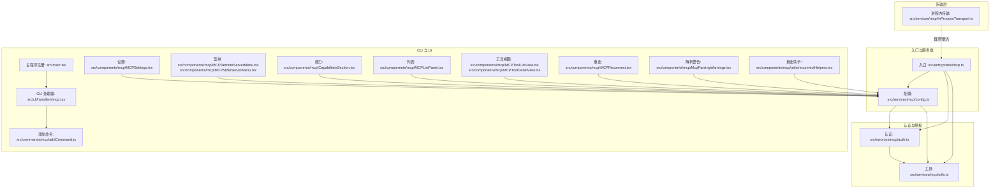
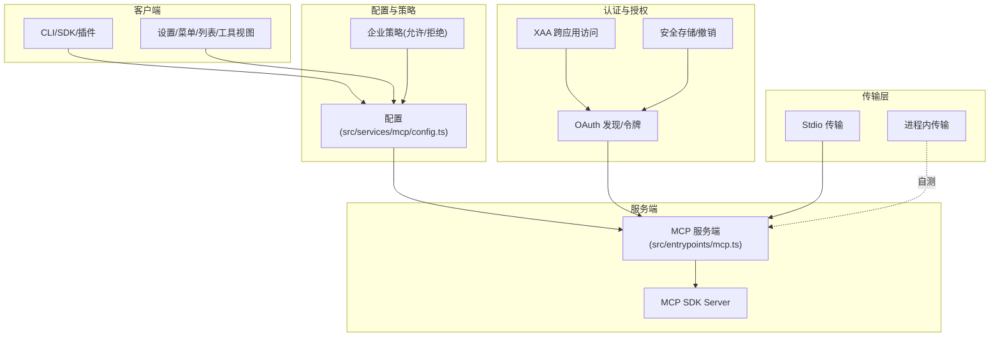
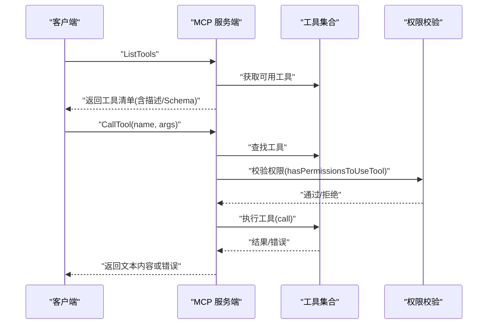
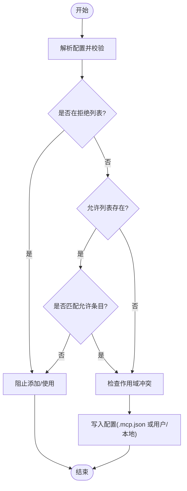
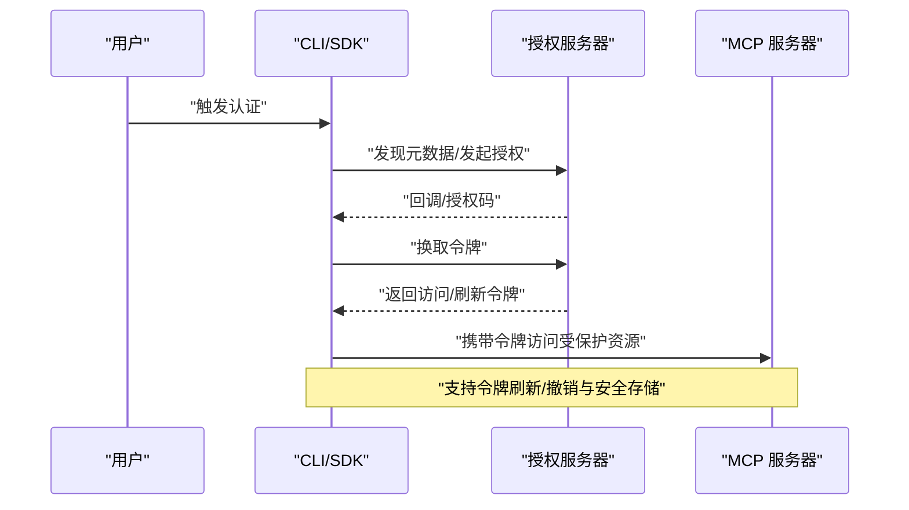
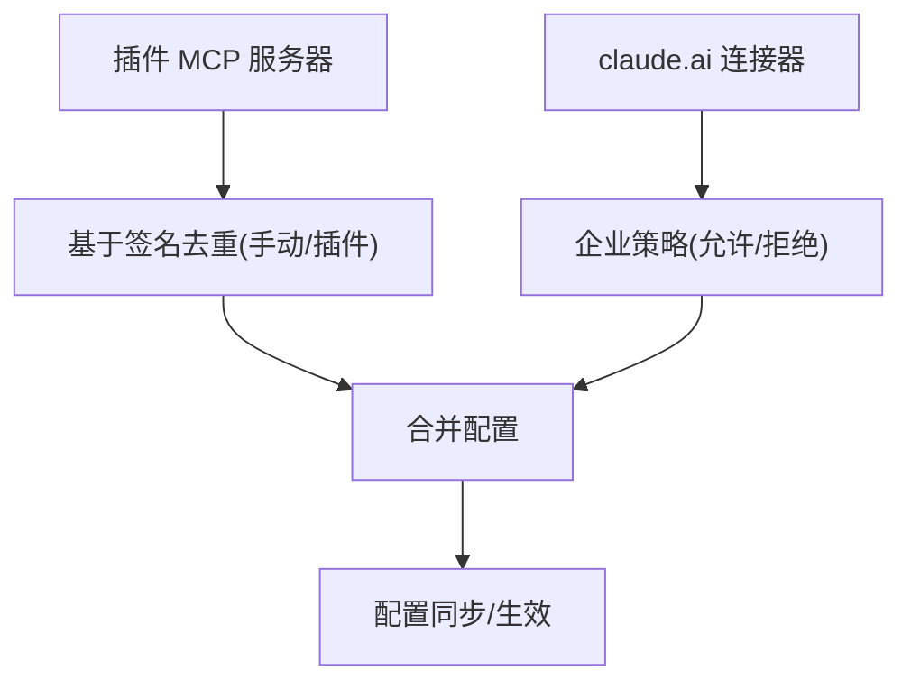
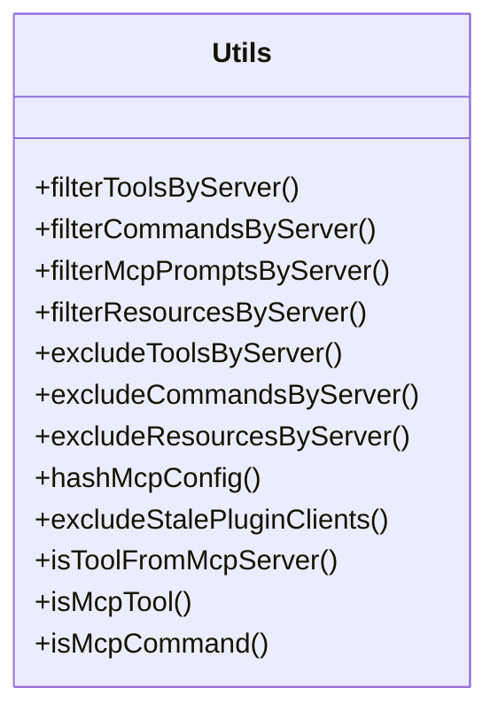
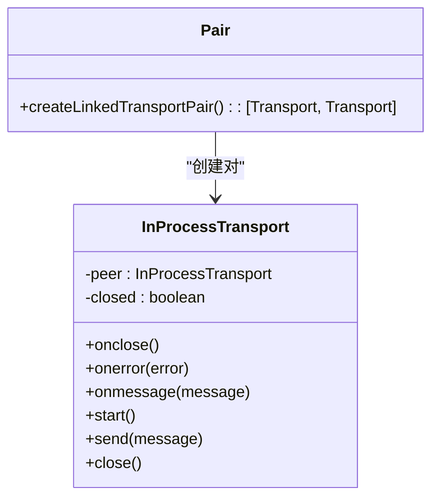
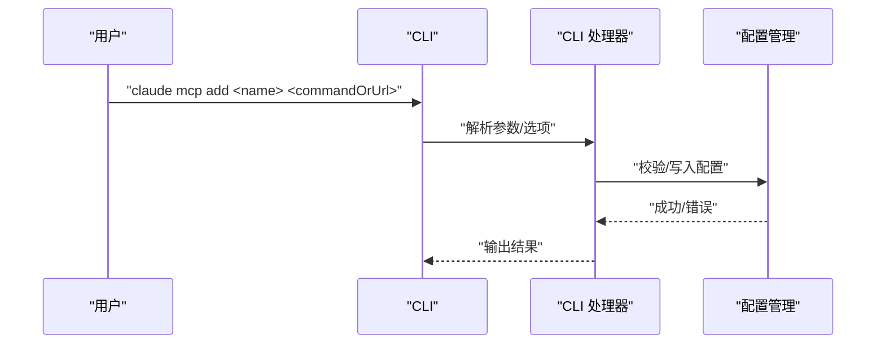
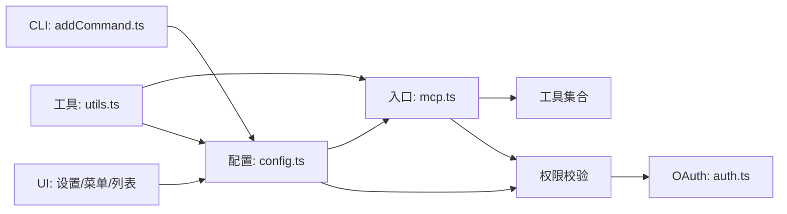

# MCP 服务

<cite>
**本文引用的文件**
- [src/entrypoints/mcp.ts](file://src/entrypoints/mcp.ts)
- [src/services/mcp/config.ts](file://src/services/mcp/config.ts)
- [src/services/mcp/auth.ts](file://src/services/mcp/auth.ts)
- [src/services/mcp/utils.ts](file://src/services/mcp/utils.ts)
- [src/services/mcp/InProcessTransport.ts](file://src/services/mcp/InProcessTransport.ts)
- [src/cli/handlers/mcp.tsx](file://src/cli/handlers/mcp.tsx)
- [src/commands/mcp/addCommand.ts](file://src/commands/mcp/addCommand.ts)
- [src/main.tsx](file://src/main.tsx)
- [src/components/mcp/MCPSettings.tsx](file://src/components/mcp/MCPSettings.tsx)
- [src/components/mcp/MCPRemoteServerMenu.tsx](file://src/components/mcp/MCPRemoteServerMenu.tsx)
- [src/components/mcp/MCPStdioServerMenu.tsx](file://src/components/mcp/MCPStdioServerMenu.tsx)
- [src/components/mcp/MCPReconnect.tsx](file://src/components/mcp/MCPReconnect.tsx)
- [src/components/mcp/CapabilitiesSection.tsx](file://src/components/mcp/CapabilitiesSection.tsx)
- [src/components/mcp/ElicitationDialog.tsx](file://src/components/mcp/ElicitationDialog.tsx)
- [src/components/mcp/MCPListPanel.tsx](file://src/components/mcp/MCPListPanel.tsx)
- [src/components/mcp/MCPToolListView.tsx](file://src/components/mcp/MCPToolListView.tsx)
- [src/components/mcp/MCPToolDetailView.tsx](file://src/components/mcp/MCPToolDetailView.tsx)
- [src/components/mcp/McpParsingWarnings.tsx](file://src/components/mcp/McpParsingWarnings.tsx)
- [src/components/mcp/utils/reconnectHelpers.tsx](file://src/components/mcp/utils/reconnectHelpers.tsx)
</cite>

## 目录
1. [简介](#简介)
2. [项目结构](#项目结构)
3. [核心组件](#核心组件)
4. [架构总览](#架构总览)
5. [详细组件分析](#详细组件分析)
6. [依赖关系分析](#依赖关系分析)
7. [性能考量](#性能考量)
8. [故障排查指南](#故障排查指南)
9. [结论](#结论)
10. [附录](#附录)

## 简介
本文件系统性梳理 Claude Code 中的 MCP（Model Context Protocol）服务实现，覆盖连接管理器、客户端架构、认证与授权、官方注册表集成、配置选项、协议扩展与调试工具等。重点解释：
- MCP 连接管理器：服务器发现、连接建立、会话管理
- MCP 客户端架构：协议实现、消息路由、状态同步
- 认证与授权：凭据管理、权限验证、安全通道建立
- 官方注册表集成：服务器发现、版本匹配、配置同步
- 配置选项：连接参数、超时设置、重连策略
- 协议扩展与自定义实现、调试工具支持

## 项目结构
MCP 相关代码主要分布在以下模块：
- 入口与服务端：入口脚本启动 MCP 服务端，提供工具列表与调用能力
- 配置与策略：服务器配置合并、去重、企业策略（允许/拒绝列表）、环境变量展开
- 认证与授权：OAuth 发现、令牌刷新、撤销、XAA（跨应用访问）流程
- 工具与命令过滤：按服务器维度筛选工具/命令/资源
- 传输层：本地进程内传输对用于自测试或嵌入式场景
- CLI 与 UI：添加/移除/列出服务器，重连辅助，能力展示与提示对话框

**图表来源**
- [src/entrypoints/mcp.ts:35-196](file://src/entrypoints/mcp.ts#L35-L196)
- [src/services/mcp/config.ts:618-761](file://src/services/mcp/config.ts#L618-L761)
- [src/services/mcp/auth.ts:256-311](file://src/services/mcp/auth.ts#L256-L311)
- [src/services/mcp/utils.ts:39-224](file://src/services/mcp/utils.ts#L39-L224)
- [src/services/mcp/InProcessTransport.ts:11-63](file://src/services/mcp/InProcessTransport.ts#L11-L63)
- [src/cli/handlers/mcp.tsx:1-200](file://src/cli/handlers/mcp.tsx#L1-L200)
- [src/commands/mcp/addCommand.ts:33-246](file://src/commands/mcp/addCommand.ts#L33-L246)
- [src/main.tsx:3912-3935](file://src/main.tsx#L3912-L3935)
- [src/components/mcp/MCPSettings.tsx:1-200](file://src/components/mcp/MCPSettings.tsx#L1-L200)
- [src/components/mcp/MCPRemoteServerMenu.tsx:1-200](file://src/components/mcp/MCPRemoteServerMenu.tsx#L1-L200)
- [src/components/mcp/MCPStdioServerMenu.tsx:1-200](file://src/components/mcp/MCPStdioServerMenu.tsx#L1-L200)
- [src/components/mcp/MCPReconnect.tsx:1-200](file://src/components/mcp/MCPReconnect.tsx#L1-L200)
- [src/components/mcp/CapabilitiesSection.tsx:1-200](file://src/components/mcp/CapabilitiesSection.tsx#L1-L200)
- [src/components/mcp/MCPListPanel.tsx:1-200](file://src/components/mcp/MCPListPanel.tsx#L1-L200)
- [src/components/mcp/MCPToolListView.tsx:1-200](file://src/components/mcp/MCPToolListView.tsx#L1-L200)
- [src/components/mcp/MCPToolDetailView.tsx:1-200](file://src/components/mcp/MCPToolDetailView.tsx#L1-L200)
- [src/components/mcp/McpParsingWarnings.tsx:1-200](file://src/components/mcp/McpParsingWarnings.tsx#L1-L200)
- [src/components/mcp/utils/reconnectHelpers.tsx:1-200](file://src/components/mcp/utils/reconnectHelpers.tsx#L1-L200)

**章节来源**
- [src/entrypoints/mcp.ts:35-196](file://src/entrypoints/mcp.ts#L35-L196)
- [src/services/mcp/config.ts:618-761](file://src/services/mcp/config.ts#L618-L761)
- [src/services/mcp/auth.ts:256-311](file://src/services/mcp/auth.ts#L256-L311)
- [src/services/mcp/utils.ts:39-224](file://src/services/mcp/utils.ts#L39-L224)
- [src/services/mcp/InProcessTransport.ts:11-63](file://src/services/mcp/InProcessTransport.ts#L11-L63)
- [src/cli/handlers/mcp.tsx:1-200](file://src/cli/handlers/mcp.tsx#L1-L200)
- [src/commands/mcp/addCommand.ts:33-246](file://src/commands/mcp/addCommand.ts#L33-L246)
- [src/main.tsx:3912-3935](file://src/main.tsx#L3912-L3935)
- [src/components/mcp/MCPSettings.tsx:1-200](file://src/components/mcp/MCPSettings.tsx#L1-L200)
- [src/components/mcp/MCPRemoteServerMenu.tsx:1-200](file://src/components/mcp/MCPRemoteServerMenu.tsx#L1-L200)
- [src/components/mcp/MCPStdioServerMenu.tsx:1-200](file://src/components/mcp/MCPStdioServerMenu.tsx#L1-L200)
- [src/components/mcp/MCPReconnect.tsx:1-200](file://src/components/mcp/MCPReconnect.tsx#L1-L200)
- [src/components/mcp/CapabilitiesSection.tsx:1-200](file://src/components/mcp/CapabilitiesSection.tsx#L1-L200)
- [src/components/mcp/MCPListPanel.tsx:1-200](file://src/components/mcp/MCPListPanel.tsx#L1-L200)
- [src/components/mcp/MCPToolListView.tsx:1-200](file://src/components/mcp/MCPToolListView.tsx#L1-L200)
- [src/components/mcp/MCPToolDetailView.tsx:1-200](file://src/components/mcp/MCPToolDetailView.tsx#L1-L200)
- [src/components/mcp/McpParsingWarnings.tsx:1-200](file://src/components/mcp/McpParsingWarnings.tsx#L1-L200)
- [src/components/mcp/utils/reconnectHelpers.tsx:1-200](file://src/components/mcp/utils/reconnectHelpers.tsx#L1-L200)

## 核心组件
- MCP 服务端入口：初始化 Server、注册 ListTools 与 CallTool 请求处理器、通过 Stdio 传输连接
- 配置管理：写入/读取 .mcp.json、合并用户/项目/全局配置、去重策略、企业策略（允许/拒绝）
- 认证与授权：OAuth 元数据发现、令牌刷新/撤销、XAA 跨应用访问、凭据存储与清理
- 工具与命令过滤：按服务器前缀过滤工具/命令/资源，支持 MCP 提示与技能区分
- 传输层：进程内 Transport 对用于自测或嵌入式场景
- CLI 与 UI：添加/移除/列出服务器、工作区信任状态处理、能力展示、重连与解析警告

**章节来源**
- [src/entrypoints/mcp.ts:35-196](file://src/entrypoints/mcp.ts#L35-L196)
- [src/services/mcp/config.ts:618-761](file://src/services/mcp/config.ts#L618-L761)
- [src/services/mcp/auth.ts:256-311](file://src/services/mcp/auth.ts#L256-L311)
- [src/services/mcp/utils.ts:39-224](file://src/services/mcp/utils.ts#L39-L224)
- [src/services/mcp/InProcessTransport.ts:11-63](file://src/services/mcp/InProcessTransport.ts#L11-L63)
- [src/commands/mcp/addCommand.ts:33-246](file://src/commands/mcp/addCommand.ts#L33-L246)

## 架构总览
MCP 在 Claude Code 中采用“服务端 + 客户端 + 配置/认证/传输”的分层架构：
- 服务端：以 MCP SDK Server 暴露工具能力，通过 Stdio 或其他传输接入
- 客户端：由 CLI/SDK/插件驱动，负责服务器发现、连接建立、会话管理、消息路由
- 配置与策略：统一管理服务器配置、去重与企业策略、环境变量展开
- 认证与授权：OAuth 元数据发现、令牌管理、XAA 流程、凭据安全存储
- 传输层：支持标准传输与进程内传输
- UI/CLI：提供交互入口与可视化能力展示

**图表来源**
- [src/entrypoints/mcp.ts:35-196](file://src/entrypoints/mcp.ts#L35-L196)
- [src/services/mcp/config.ts:618-761](file://src/services/mcp/config.ts#L618-L761)
- [src/services/mcp/auth.ts:256-311](file://src/services/mcp/auth.ts#L256-L311)
- [src/services/mcp/InProcessTransport.ts:11-63](file://src/services/mcp/InProcessTransport.ts#L11-L63)

## 详细组件分析

### MCP 服务端入口与工具路由
- 初始化 Server 并声明 capabilities（此处启用 tools）
- 注册 ListTools：收集工具、生成描述、转换输入/输出 Schema（兼容 MCP SDK）
- 注册 CallTool：构建工具调用上下文、执行权限校验、返回文本内容或错误信息
- 通过 StdioServerTransport 建立连接

**图表来源**
- [src/entrypoints/mcp.ts:59-188](file://src/entrypoints/mcp.ts#L59-L188)

**章节来源**
- [src/entrypoints/mcp.ts:35-196](file://src/entrypoints/mcp.ts#L35-L196)

### 配置管理与去重策略
- 写入 .mcp.json：原子写入、保留权限、失败回滚
- 去重策略：基于命令数组或 URL（解包 CCR 代理 URL）签名匹配，手动优先于插件，先加载者优先
- 企业策略：允许/拒绝列表，名称/命令/URL 维度匹配；denylist 优先
- 环境变量展开：字符串/头部/命令行参数支持环境变量
- 添加/移除服务器：按作用域写入用户/项目/本地配置

**图表来源**
- [src/services/mcp/config.ts:618-761](file://src/services/mcp/config.ts#L618-L761)
- [src/services/mcp/config.ts:417-508](file://src/services/mcp/config.ts#L417-L508)
- [src/services/mcp/config.ts:223-266](file://src/services/mcp/config.ts#L223-L266)

**章节来源**
- [src/services/mcp/config.ts:618-761](file://src/services/mcp/config.ts#L618-L761)
- [src/services/mcp/config.ts:417-508](file://src/services/mcp/config.ts#L417-L508)
- [src/services/mcp/config.ts:223-266](file://src/services/mcp/config.ts#L223-L266)

### 认证与授权机制
- OAuth 元数据发现：支持配置元数据 URL 或 RFC 9728/RFC 8414 探测；路径感知回退
- 令牌管理：超时请求、标准化非标准错误响应、刷新/撤销、安全存储
- XAA（跨应用访问）：一次 IdP 登录复用，RFC 8693+jwt-bearer 交换，严格错误归类与缓存失效
- 凭据清理：按服务器键（名称+配置哈希）隔离，支持保留“提升授权”状态以便后续步骤

**图表来源**
- [src/services/mcp/auth.ts:256-311](file://src/services/mcp/auth.ts#L256-L311)
- [src/services/mcp/auth.ts:664-800](file://src/services/mcp/auth.ts#L664-L800)
- [src/services/mcp/auth.ts:467-618](file://src/services/mcp/auth.ts#L467-L618)

**章节来源**
- [src/services/mcp/auth.ts:256-311](file://src/services/mcp/auth.ts#L256-L311)
- [src/services/mcp/auth.ts:664-800](file://src/services/mcp/auth.ts#L664-L800)
- [src/services/mcp/auth.ts:467-618](file://src/services/mcp/auth.ts#L467-L618)

### 官方注册表集成与配置同步
- 插件 MCP 服务器：命名空间化避免键冲突，基于签名去重，手动优先
- claude.ai 连接器：当与手动配置重复时抑制，仅启用手动配置
- 配置同步：通过企业策略与多源设置合并，支持动态配置与 SDK 类型服务器

**图表来源**
- [src/services/mcp/config.ts:223-310](file://src/services/mcp/config.ts#L223-L310)
- [src/services/mcp/config.ts:536-551](file://src/services/mcp/config.ts#L536-L551)

**章节来源**
- [src/services/mcp/config.ts:223-310](file://src/services/mcp/config.ts#L223-L310)
- [src/services/mcp/config.ts:536-551](file://src/services/mcp/config.ts#L536-L551)

### MCP 客户端架构与消息路由
- 工具/命令/资源过滤：按服务器前缀过滤，区分 MCP 提示与技能
- 资源过滤：按服务器名过滤资源
- 哈希变更检测：用于插件动态客户端的清理与重连
- 工具/命令归属判断：支持 mcp__server__tool 与 server:skill 两种命名

**图表来源**
- [src/services/mcp/utils.ts:39-224](file://src/services/mcp/utils.ts#L39-L224)

**章节来源**
- [src/services/mcp/utils.ts:39-224](file://src/services/mcp/utils.ts#L39-L224)

### 传输层与自测支持
- 进程内传输：成对 Transport 实现消息互发与关闭通知，避免栈深问题
- 用途：自测或在同一进程中运行客户端/服务端

**图表来源**
- [src/services/mcp/InProcessTransport.ts:11-63](file://src/services/mcp/InProcessTransport.ts#L11-L63)

**章节来源**
- [src/services/mcp/InProcessTransport.ts:11-63](file://src/services/mcp/InProcessTransport.ts#L11-L63)

### CLI 与 UI 支持
- CLI 子命令：mcp add/remove/list/get，支持传输类型、头部、OAuth 参数、XAA 设置
- 主程序注册：在主程序中注册 mcp 子命令
- UI 组件：设置面板、服务器菜单、能力展示、工具列表/详情、重连组件、解析警告与重连助手

**图表来源**
- [src/commands/mcp/addCommand.ts:33-246](file://src/commands/mcp/addCommand.ts#L33-L246)
- [src/cli/handlers/mcp.tsx:1-200](file://src/cli/handlers/mcp.tsx#L1-L200)
- [src/main.tsx:3912-3935](file://src/main.tsx#L3912-L3935)

**章节来源**
- [src/commands/mcp/addCommand.ts:33-246](file://src/commands/mcp/addCommand.ts#L33-L246)
- [src/cli/handlers/mcp.tsx:1-200](file://src/cli/handlers/mcp.tsx#L1-L200)
- [src/main.tsx:3912-3935](file://src/main.tsx#L3912-L3935)

## 依赖关系分析
- 低耦合：服务端入口仅依赖工具集合与权限校验；配置与认证模块相对独立
- 关键依赖链：
  - 服务端入口 → 工具集合/权限校验 → MCP SDK Server
  - 配置管理 → 企业策略/去重/环境变量展开
  - 认证模块 → OAuth 元数据发现/令牌管理/XAA
  - UI/CLI → 配置管理/工具过滤/能力展示

**图表来源**
- [src/entrypoints/mcp.ts:35-196](file://src/entrypoints/mcp.ts#L35-L196)
- [src/services/mcp/config.ts:618-761](file://src/services/mcp/config.ts#L618-L761)
- [src/services/mcp/auth.ts:256-311](file://src/services/mcp/auth.ts#L256-L311)
- [src/services/mcp/utils.ts:39-224](file://src/services/mcp/utils.ts#L39-L224)
- [src/commands/mcp/addCommand.ts:33-246](file://src/commands/mcp/addCommand.ts#L33-L246)

**章节来源**
- [src/entrypoints/mcp.ts:35-196](file://src/entrypoints/mcp.ts#L35-L196)
- [src/services/mcp/config.ts:618-761](file://src/services/mcp/config.ts#L618-L761)
- [src/services/mcp/auth.ts:256-311](file://src/services/mcp/auth.ts#L256-L311)
- [src/services/mcp/utils.ts:39-224](file://src/services/mcp/utils.ts#L39-L224)
- [src/commands/mcp/addCommand.ts:33-246](file://src/commands/mcp/addCommand.ts#L33-L246)

## 性能考量
- 缓存与内存：服务端入口对文件状态读取使用大小受限的 LRU 缓存，防止内存无限增长
- 传输效率：进程内传输使用微任务异步投递，避免同步请求/响应导致的栈深问题
- 配置写入：.mcp.json 使用临时文件 + 原子重命名，减少磁盘竞争与损坏风险
- 策略匹配：允许/拒绝列表采用早期退出与正则匹配，URL 模式支持通配符

**章节来源**
- [src/entrypoints/mcp.ts:40-46](file://src/entrypoints/mcp.ts#L40-L46)
- [src/services/mcp/InProcessTransport.ts:30-35](file://src/services/mcp/InProcessTransport.ts#L30-L35)
- [src/services/mcp/config.ts:88-131](file://src/services/mcp/config.ts#L88-L131)
- [src/services/mcp/config.ts:320-334](file://src/services/mcp/config.ts#L320-L334)

## 故障排查指南
- 认证失败：检查 OAuth 元数据发现、令牌刷新与撤销日志；关注非标准错误码归一化
- 服务器不可达：确认 URL/头部/环境变量展开；检查企业策略（允许/拒绝）
- 重连与状态恢复：使用重连组件与助手，结合“提升授权”状态保留策略
- 解析警告：查看 MCP 解析警告组件，定位配置项问题
- 工具/命令缺失：确认工具/命令过滤逻辑与服务器前缀命名规范

**章节来源**
- [src/services/mcp/auth.ts:157-191](file://src/services/mcp/auth.ts#L157-L191)
- [src/services/mcp/config.ts:417-508](file://src/services/mcp/config.ts#L417-L508)
- [src/components/mcp/McpParsingWarnings.tsx:1-200](file://src/components/mcp/McpParsingWarnings.tsx#L1-L200)
- [src/components/mcp/utils/reconnectHelpers.tsx:1-200](file://src/components/mcp/utils/reconnectHelpers.tsx#L1-L200)

## 结论
Claude Code 的 MCP 服务在架构上实现了清晰的分层与职责分离：服务端通过 MCP SDK 暴露工具能力，配置与策略模块统一管理服务器与企业策略，认证模块覆盖 OAuth 与 XAA 场景，UI/CLI 提供完善的交互入口。该实现兼顾安全性（凭据隔离、撤销、安全存储）、可维护性（去重策略、原子写入、微任务传输）与可观测性（日志与解析警告），为 MCP 扩展与集成提供了坚实基础。

## 附录
- 配置选项建议（基于现有实现可推断）：
  - 连接参数：传输类型（stdio/sse/http/ws）、URL、头部、命令与参数、环境变量
  - 超时设置：OAuth 请求超时（30 秒）、请求信号组合与清理
  - 重连策略：UI 重连组件与助手、基于哈希变更的动态客户端清理
- 协议扩展与自定义：
  - 通过工具过滤与命名规范扩展 MCP 提示/技能
  - 通过进程内传输进行自测与嵌入式场景
- 调试工具：
  - 日志安全 URL 规避（去除查询参数）、解析警告组件、OAuth 错误归一化