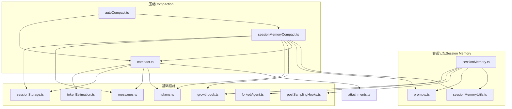
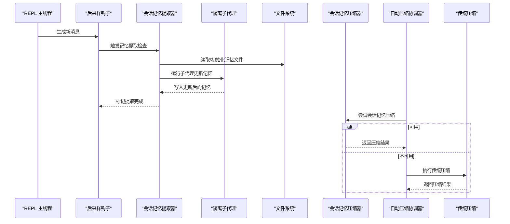
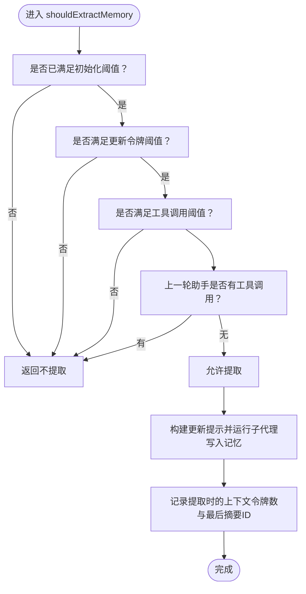
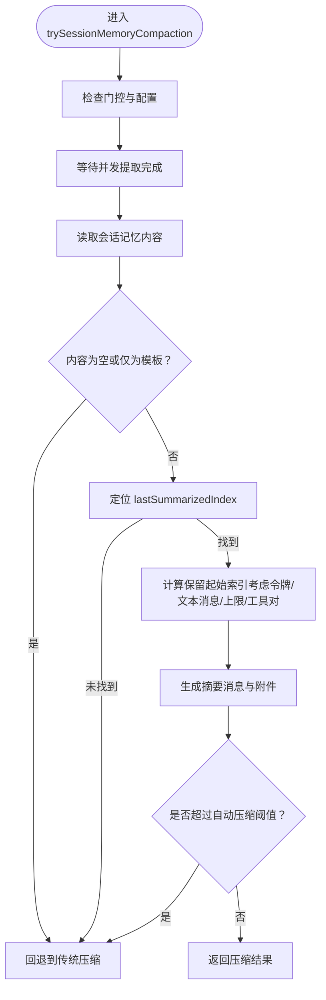
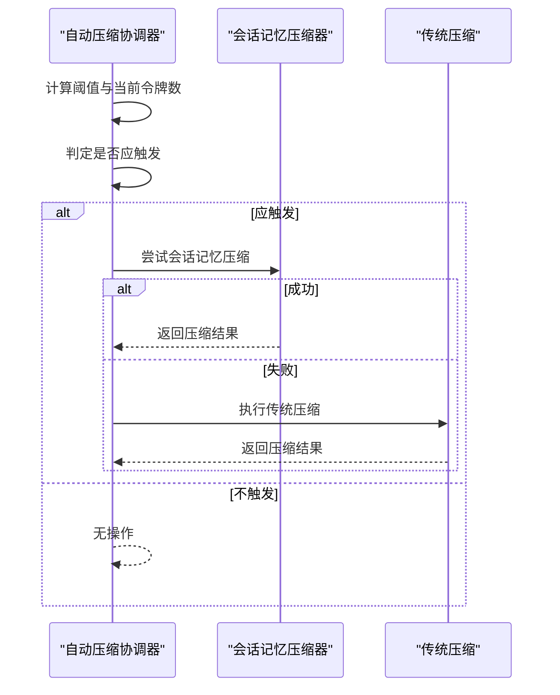
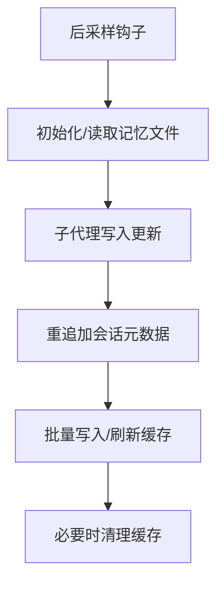
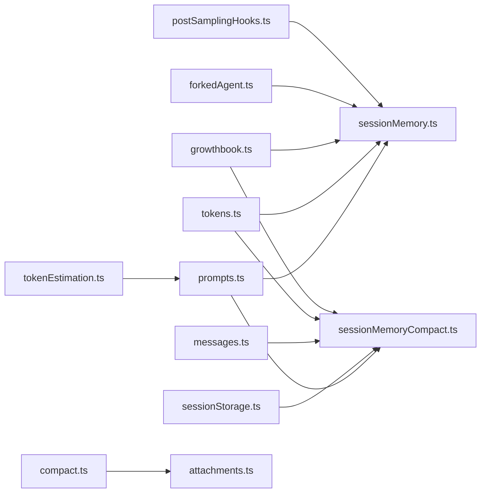

# 上下文管理服务

<cite>
**本文引用的文件**
- [sessionMemory.ts](file://src/services/SessionMemory/sessionMemory.ts)
- [sessionMemoryUtils.ts](file://src/services/SessionMemory/sessionMemoryUtils.ts)
- [prompts.ts](file://src/services/SessionMemory/prompts.ts)
- [sessionMemoryCompact.ts](file://src/services/compact/sessionMemoryCompact.ts)
- [autoCompact.ts](file://src/services/compact/autoCompact.ts)
- [compact.ts](file://src/services/compact/compact.ts)
- [sessionStorage.ts](file://src/utils/sessionStorage.ts)
- [messages.ts](file://src/utils/messages.ts)
- [growthbook.ts](file://src/services/analytics/growthbook.ts)
- [forkedAgent.ts](file://src/utils/forkedAgent.ts)
- [tokens.ts](file://src/utils/tokens.ts)
- [postSamplingHooks.ts](file://src/utils/hooks/postSamplingHooks.ts)
- [fileStateCache.ts](file://src/utils/fileStateCache.ts)
- [attachments.ts](file://src/utils/attachments.ts)
- [sessionStart.ts](file://src/utils/sessionStart.ts)
- [transcript.ts](file://src/utils/sessionStorage.ts)
- [tokenEstimation.ts](file://src/services/tokenEstimation.ts)
</cite>

## 目录
1. [简介](#简介)
2. [项目结构](#项目结构)
3. [核心组件](#核心组件)
4. [架构总览](#架构总览)
5. [详细组件分析](#详细组件分析)
6. [依赖关系分析](#依赖关系分析)
7. [性能考量](#性能考量)
8. [故障排查指南](#故障排查指南)
9. [结论](#结论)
10. [附录](#附录)

## 简介
本技术文档聚焦 Claude Code 的“上下文管理服务”，系统性阐述其智能上下文压缩算法与会话记忆管理机制。内容涵盖：
- 智能上下文压缩：记忆提取、分组策略、时间窗口管理
- 会话内存管理：内存快照、增量更新、持久化
- 自动压缩触发条件：内存阈值、时间间隔、用户行为检测
- 记忆提取策略：关键信息识别、上下文关联、语义理解
- 配置选项：压缩比例、保留策略、性能调优
- 监控与评估：内存使用监控、压缩效果评估、回滚机制

## 项目结构
上下文管理服务由“会话记忆（Session Memory）”与“压缩（Compaction）”两大子系统协同构成，并通过钩子、工具链与存储层进行集成。

图表来源
- [sessionMemory.ts:1-496](file://src/services/SessionMemory/sessionMemory.ts#L1-L496)
- [sessionMemoryUtils.ts:1-208](file://src/services/SessionMemory/sessionMemoryUtils.ts#L1-L208)
- [prompts.ts:1-325](file://src/services/SessionMemory/prompts.ts#L1-L325)
- [sessionMemoryCompact.ts:1-631](file://src/services/compact/sessionMemoryCompact.ts#L1-L631)
- [autoCompact.ts:1-352](file://src/services/compact/autoCompact.ts#L1-L352)
- [compact.ts:1-800](file://src/services/compact/compact.ts#L1-L800)
- [growthbook.ts](file://src/services/analytics/growthbook.ts)
- [forkedAgent.ts](file://src/utils/forkedAgent.ts)
- [tokens.ts](file://src/utils/tokens.ts)
- [messages.ts](file://src/utils/messages.ts)
- [sessionStorage.ts](file://src/utils/sessionStorage.ts)
- [postSamplingHooks.ts](file://src/utils/hooks/postSamplingHooks.ts)
- [tokenEstimation.ts](file://src/services/tokenEstimation.ts)

章节来源
- [sessionMemory.ts:1-496](file://src/services/SessionMemory/sessionMemory.ts#L1-L496)
- [sessionMemoryCompact.ts:1-631](file://src/services/compact/sessionMemoryCompact.ts#L1-L631)

## 核心组件
- 会话记忆提取器：在 REPL 主线程后采样钩子中按阈值触发，使用隔离子代理执行记忆更新，确保不干扰主对话流。
- 会话记忆工具集：负责配置加载、状态跟踪、等待并发提取、读取与截断记忆文件等。
- 会话记忆提示工程：模板化结构、变量替换、长度提醒与截断策略，保障记忆文件稳定可控。
- 会话记忆压缩器：基于记忆文件与消息边界计算保留区间，生成摘要消息与附件，替代传统压缩路径。
- 自动压缩协调器：根据上下文窗口与缓冲区计算阈值，优先尝试会话记忆压缩，失败则回退到传统压缩。
- 压缩通用模块：提供边界标记、消息归一化、附件重建、重试与统计等通用能力。

章节来源
- [sessionMemory.ts:134-181](file://src/services/SessionMemory/sessionMemory.ts#L134-L181)
- [sessionMemoryUtils.ts:18-51](file://src/services/SessionMemory/sessionMemoryUtils.ts#L18-L51)
- [prompts.ts:226-247](file://src/services/SessionMemory/prompts.ts#L226-L247)
- [sessionMemoryCompact.ts:514-631](file://src/services/compact/sessionMemoryCompact.ts#L514-L631)
- [autoCompact.ts:241-351](file://src/services/compact/autoCompact.ts#L241-L351)
- [compact.ts:299-340](file://src/services/compact/compact.ts#L299-L340)

## 架构总览
下图展示从消息采样到压缩决策的关键流程，以及会话记忆在其中的角色。

图表来源
- [sessionMemory.ts:272-350](file://src/services/SessionMemory/sessionMemory.ts#L272-L350)
- [sessionMemoryCompact.ts:514-631](file://src/services/compact/sessionMemoryCompact.ts#L514-L631)
- [autoCompact.ts:287-310](file://src/services/compact/autoCompact.ts#L287-L310)
- [compact.ts:387-763](file://src/services/compact/compact.ts#L387-L763)

## 详细组件分析

### 组件A：会话记忆提取与更新
- 触发条件
  - 初始化阈值：累计上下文窗口令牌数达到最小初始化阈值后才允许提取。
  - 更新阈值：自上次提取以来，上下文增长超过最小令牌增量阈值。
  - 工具调用阈值：自上次提取以来，助手消息中的工具调用次数达到设定阈值。
  - 行为约束：若上一轮助手消息存在工具调用，则本次提取需等待至自然停顿（无工具调用）。
- 提示工程
  - 支持自定义模板与提示词，变量替换与结构校验，避免破坏既有结构。
  - 对超长段落与总长度进行提醒与强制截断，防止占用过多预算。
- 安全与隔离
  - 使用隔离子代理运行，限制工具调用仅限于记忆文件编辑。
  - 严格的状态记录与并发等待，避免竞态与重复提取。

图表来源
- [sessionMemory.ts:134-181](file://src/services/SessionMemory/sessionMemory.ts#L134-L181)
- [prompts.ts:226-247](file://src/services/SessionMemory/prompts.ts#L226-L247)
- [sessionMemoryUtils.ts:173-189](file://src/services/SessionMemory/sessionMemoryUtils.ts#L173-L189)

章节来源
- [sessionMemory.ts:134-181](file://src/services/SessionMemory/sessionMemory.ts#L134-L181)
- [sessionMemoryUtils.ts:173-189](file://src/services/SessionMemory/sessionMemoryUtils.ts#L173-L189)
- [prompts.ts:226-247](file://src/services/SessionMemory/prompts.ts#L226-L247)

### 组件B：会话记忆压缩（替代传统压缩）
- 边界确定
  - 若存在“最后摘要消息ID”，以该ID为锚点向后定位起始索引。
  - 若不存在但记忆文件存在且非模板空内容，则视为恢复会话，初始保留全部消息。
- 保留策略
  - 从边界开始向前扩展，累计令牌数与含文本块的消息数量，直至达到最小保留令牌数与最小文本消息数，或达到最大令牌上限。
  - 调整索引以保证不切割工具调用/结果对与思考块的完整性。
- 摘要生成
  - 截断过长段落，生成用户可见的摘要消息，必要时附加指向完整记忆文件的链接。
  - 重建会话启动附件（如计划、技能、延迟工具等），保持上下文连续性。
- 回退逻辑
  - 当无法确定边界或文件异常时，回退到传统压缩路径。

图表来源
- [sessionMemoryCompact.ts:514-631](file://src/services/compact/sessionMemoryCompact.ts#L514-L631)
- [sessionMemoryUtils.ts:58-69](file://src/services/SessionMemory/sessionMemoryUtils.ts#L58-L69)

章节来源
- [sessionMemoryCompact.ts:514-631](file://src/services/compact/sessionMemoryCompact.ts#L514-L631)
- [sessionMemoryUtils.ts:58-69](file://src/services/SessionMemory/sessionMemoryUtils.ts#L58-L69)

### 组件C：自动压缩协调与回退
- 阈值计算
  - 基于模型上下文窗口与输出预留，结合缓冲区常量得到自动压缩阈值。
  - 支持环境变量覆盖与阻断阈值设置，便于测试与应急。
- 触发判定
  - 在特定查询源与模式下抑制自动压缩，避免与上下文折叠/反应式压缩冲突。
  - 通过连续失败计数作为“保险丝”，防止会话陷入无效重试。
- 执行顺序
  - 优先尝试会话记忆压缩；成功即结束；失败则执行传统压缩。

图表来源
- [autoCompact.ts:160-239](file://src/services/compact/autoCompact.ts#L160-L239)
- [autoCompact.ts:241-351](file://src/services/compact/autoCompact.ts#L241-L351)
- [sessionMemoryCompact.ts:514-631](file://src/services/compact/sessionMemoryCompact.ts#L514-L631)
- [compact.ts:387-763](file://src/services/compact/compact.ts#L387-L763)

章节来源
- [autoCompact.ts:160-239](file://src/services/compact/autoCompact.ts#L160-L239)
- [autoCompact.ts:241-351](file://src/services/compact/autoCompact.ts#L241-L351)

### 组件D：会话内存管理与持久化
- 快照与增量
  - 通过后采样钩子在消息生成后即时更新记忆文件，形成“增量快照”。
  - 会话元数据（标题、标签等）在压缩前后重新追加，确保 --resume 显示正确。
- 存储与并发
  - 使用写队列批处理写入，避免频繁 IO；支持外部写入者刷新缓存并合并最新值。
  - 提供缓存清理接口，用于压缩后失效旧消息 UUID 的场景。
- 文件安全
  - 仅允许针对记忆文件的编辑工具调用，其他写操作被拒绝，降低风险面。

图表来源
- [sessionMemory.ts:272-350](file://src/services/SessionMemory/sessionMemory.ts#L272-L350)
- [sessionMemory.ts:456-482](file://src/services/SessionMemory/sessionMemory.ts#L456-L482)
- [sessionStorage.ts:645-713](file://src/utils/sessionStorage.ts#L645-L713)
- [sessionStorage.ts:1128-1161](file://src/utils/sessionStorage.ts#L1128-L1161)

章节来源
- [sessionMemory.ts:272-350](file://src/services/SessionMemory/sessionMemory.ts#L272-L350)
- [sessionStorage.ts:645-713](file://src/utils/sessionStorage.ts#L645-L713)
- [sessionStorage.ts:1128-1161](file://src/utils/sessionStorage.ts#L1128-L1161)

## 依赖关系分析
- 会话记忆提取器依赖：
  - 钩子系统：在 REPL 主线程后采样阶段触发。
  - 子代理框架：隔离执行，避免污染父级状态。
  - 配置与门控：来自远程配置与特性开关。
  - 令牌估算：用于阈值判断与统计。
- 会话记忆压缩器依赖：
  - 最后摘要消息 ID：确定保留边界。
  - 提示工程与截断：确保摘要不超预算。
  - 附件重建：恢复会话启动上下文。
- 自动压缩协调器：
  - 与会话记忆压缩器并行存在，优先选择更优路径。
  - 与传统压缩共享通用消息处理与统计能力。

图表来源
- [sessionMemory.ts:272-350](file://src/services/SessionMemory/sessionMemory.ts#L272-L350)
- [sessionMemoryCompact.ts:514-631](file://src/services/compact/sessionMemoryCompact.ts#L514-L631)
- [compact.ts:299-340](file://src/services/compact/compact.ts#L299-L340)
- [growthbook.ts](file://src/services/analytics/growthbook.ts)
- [forkedAgent.ts](file://src/utils/forkedAgent.ts)
- [tokens.ts](file://src/utils/tokens.ts)
- [messages.ts](file://src/utils/messages.ts)
- [sessionStorage.ts](file://src/utils/sessionStorage.ts)
- [prompts.ts:226-247](file://src/services/SessionMemory/prompts.ts#L226-L247)
- [tokenEstimation.ts](file://src/services/tokenEstimation.ts)

章节来源
- [sessionMemory.ts:1-496](file://src/services/SessionMemory/sessionMemory.ts#L1-L496)
- [sessionMemoryCompact.ts:1-631](file://src/services/compact/sessionMemoryCompact.ts#L1-L631)
- [compact.ts:1-800](file://src/services/compact/compact.ts#L1-L800)

## 性能考量
- 令牌估算与阈值一致性
  - 会话记忆与自动压缩均采用相同的令牌估算方法，确保行为一致，避免“一边增长一边压缩”的抖动。
- 截断与预算控制
  - 提示工程对单段与全文长度进行限制，压缩前对记忆进行截断，防止占用后续上下文预算。
- 并发与批处理
  - 写队列批处理与外部写入者刷新缓存，减少磁盘争用与重复扫描。
- 缓冲区与回退
  - 自动压缩阈值预留输出空间与多级缓冲区，连续失败时启用“保险丝”避免无效重试。

## 故障排查指南
- 提示工程相关
  - 模板缺失或损坏：自动回退默认模板；检查配置目录是否存在自定义模板。
  - 结构被修改：提示工程严格校验结构，若发现变更将拒绝编辑；请恢复结构或更新模板。
- 压缩失败
  - 会话记忆压缩失败：检查记忆文件是否存在、是否为模板空内容、边界 ID 是否有效。
  - 传统压缩失败：查看错误事件与统计指标，确认是否因提示过长导致重试或回退。
- 并发与竞态
  - 并发提取等待：若提取长时间未完成，检查是否处于陈旧状态或超时。
  - 元数据丢失：确认是否在压缩后未重追加元数据，导致 --resume 显示异常。

章节来源
- [prompts.ts:86-104](file://src/services/SessionMemory/prompts.ts#L86-L104)
- [sessionMemoryCompact.ts:526-543](file://src/services/compact/sessionMemoryCompact.ts#L526-L543)
- [sessionMemoryUtils.ts:89-105](file://src/services/SessionMemory/sessionMemoryUtils.ts#L89-L105)
- [sessionStorage.ts:978-991](file://src/utils/sessionStorage.ts#L978-L991)

## 结论
上下文管理服务通过“会话记忆提取 + 会话记忆压缩”的组合，实现了低侵入、高可控的智能上下文压缩方案。它以一致的令牌估算与严格的边界/完整性约束为基础，配合自动压缩协调器与传统压缩回退，既保障了用户体验，又提升了系统稳定性与可维护性。建议在生产环境中结合监控指标与回滚策略，持续优化阈值与预算分配。

## 附录

### 配置选项与参数
- 会话记忆提取阈值
  - 最小初始化令牌数：达到此阈值后允许首次提取。
  - 最小更新令牌增量：自上次提取以来的增长阈值。
  - 工具调用次数阈值：两次提取之间的工具调用次数。
- 会话记忆压缩阈值
  - 最小保留令牌数：保留段的最低令牌预算。
  - 最少文本消息数：保留段中至少包含的文本块消息数量。
  - 最大保留令牌数：保留段的硬上限。
- 远程配置与门控
  - 通过特性开关与动态配置控制提取与压缩的启用与阈值。
- 环境变量
  - 自动压缩窗口、阻断阈值覆盖、强制启用/禁用等，便于测试与应急。

章节来源
- [sessionMemoryUtils.ts:18-51](file://src/services/SessionMemory/sessionMemoryUtils.ts#L18-L51)
- [sessionMemoryCompact.ts:47-88](file://src/services/compact/sessionMemoryCompact.ts#L47-L88)
- [autoCompact.ts:40-91](file://src/services/compact/autoCompact.ts#L40-L91)