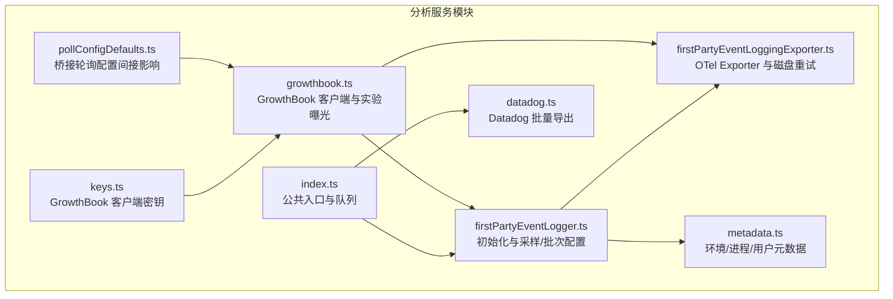
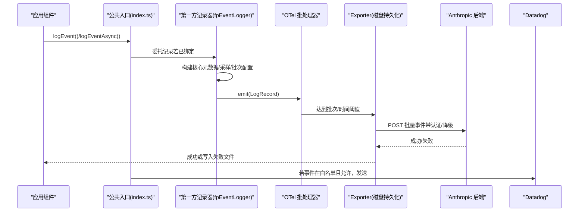
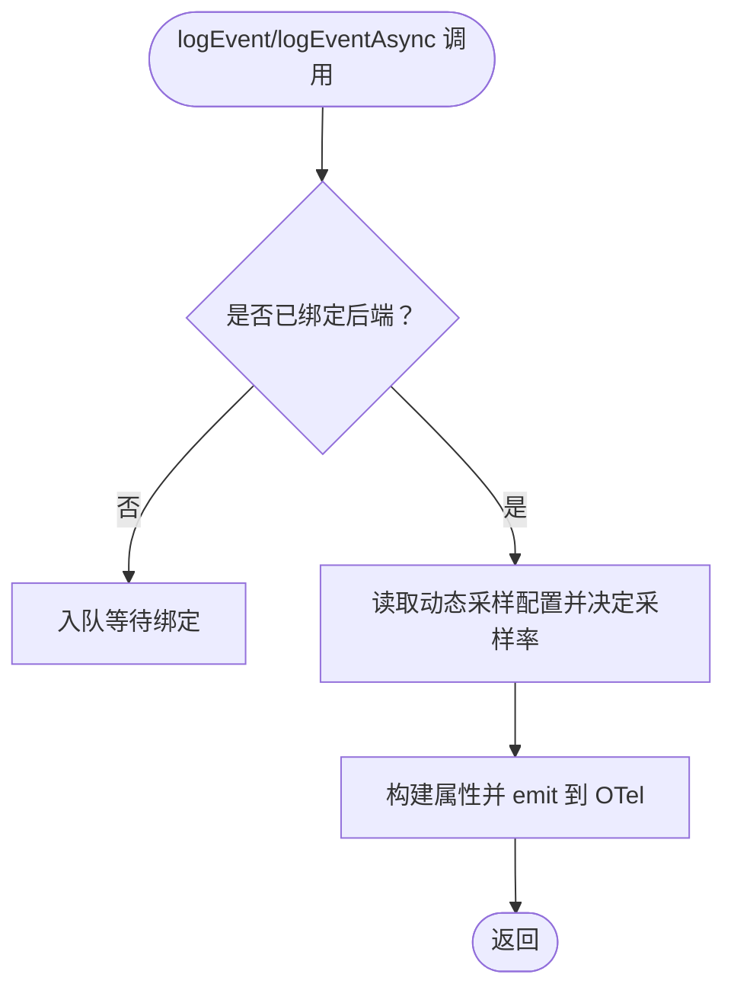
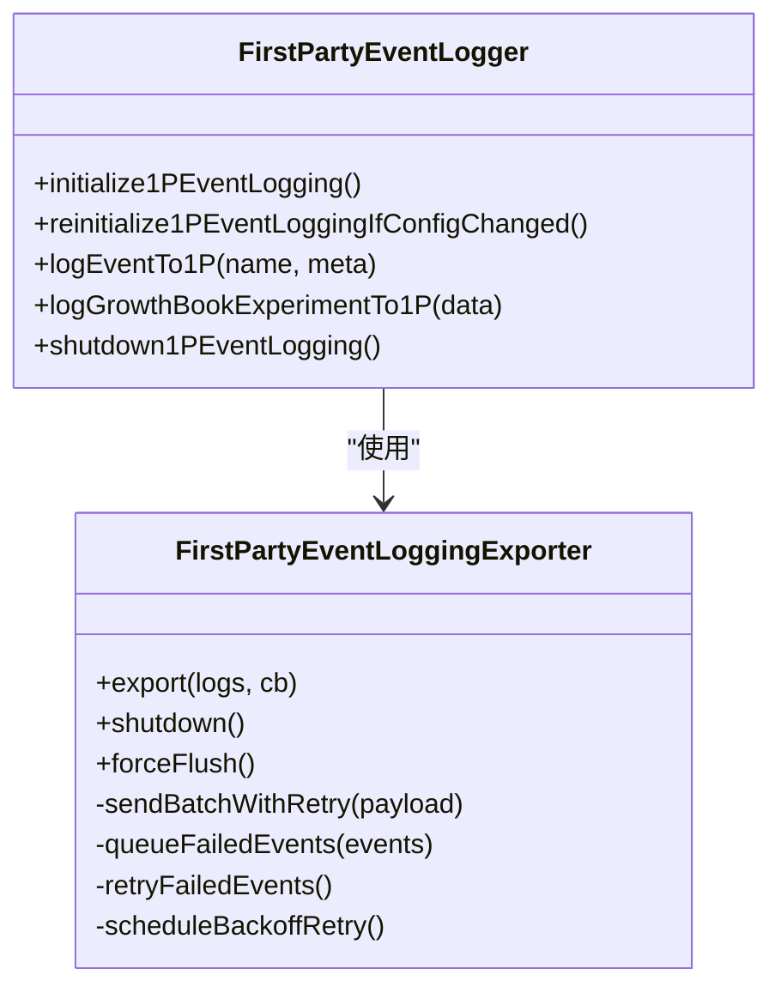
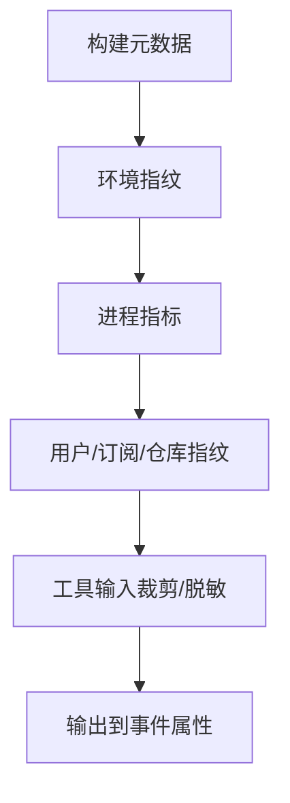
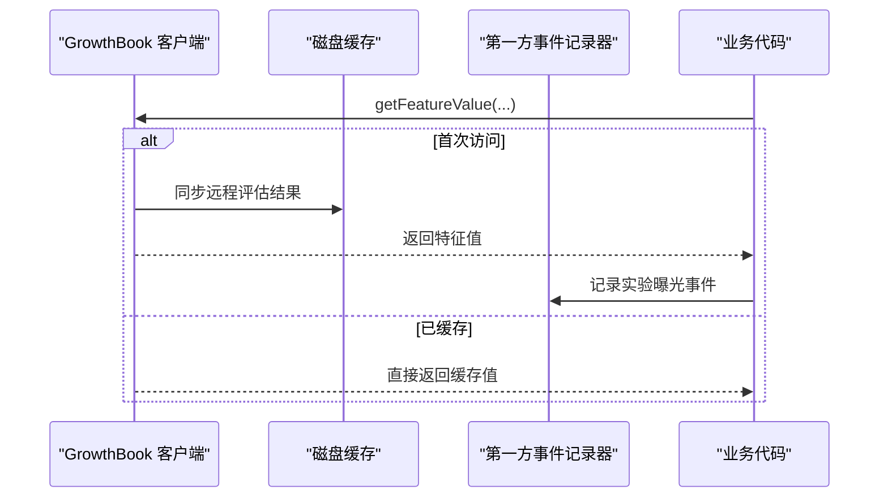
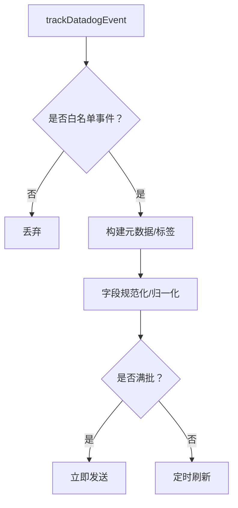
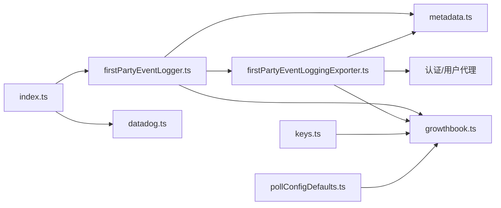

# 分析服务

<cite>
**本文引用的文件**
- [growthbook.ts](file://src/services/analytics/growthbook.ts)
- [metadata.ts](file://src/services/analytics/metadata.ts)
- [firstPartyEventLoggingExporter.ts](file://src/services/analytics/firstPartyEventLoggingExporter.ts)
- [firstPartyEventLogger.ts](file://src/services/analytics/firstPartyEventLogger.ts)
- [datadog.ts](file://src/services/analytics/datadog.ts)
- [index.ts](file://src/services/analytics/index.ts)
- [keys.ts](file://src/constants/keys.ts)
- [pollConfigDefaults.ts](file://src/bridge/pollConfigDefaults.ts)
- [01-telemetry-and-privacy.md](file://docs/en/01-telemetry-and-privacy.md)
- [01-텔레메트리와-프라이버시.md](file://docs/ko/01-텔레메트리와-프라이버시.md)
- [01-テレメトリとプライバシー.md](file://docs/ja/01-テレメトリとプライバシー.md)
- [privacy-settings.tsx](file://src/commands/privacy-settings/privacy-settings.tsx)
- [index.ts（隐私设置命令）](file://src/commands/privacy-settings/index.ts)
</cite>

## 目录
1. [简介](#简介)
2. [项目结构](#项目结构)
3. [核心组件](#核心组件)
4. [架构总览](#架构总览)
5. [详细组件分析](#详细组件分析)
6. [依赖关系分析](#依赖关系分析)
7. [性能考量](#性能考量)
8. [故障排查指南](#故障排查指南)
9. [结论](#结论)
10. [附录](#附录)

## 简介
本文件面向 Claude Code 的分析服务系统，系统性阐述其整体架构与实现细节，包括事件收集、数据传输与持久化策略、遥测数据采集机制（用户行为、性能指标、使用统计）、实验平台集成（GrowthBook A/B 测试）、数据导出（Datadog 集成、事件流处理与实时监控），以及配置选项（数据保留、隐私与合规控制）。同时给出事件格式规范、元数据管理与数据质量保障措施，帮助开发者与运维人员理解并正确使用该分析体系。

## 项目结构
分析服务位于 src/services/analytics 目录下，采用“双通道”设计：
- 第一方事件日志通道：基于 OpenTelemetry SDK，通过批量处理器与自定义 Exporter 将事件发送至 Anthropic 内部后端，并具备磁盘持久化与指数退避重试能力。
- 第三方日志通道：面向 Datadog 的事件流，限定事件白名单并通过批处理与定时刷新进行传输。

图表来源
- [index.ts:1-174](file://src/services/analytics/index.ts#L1-L174)
- [firstPartyEventLogger.ts:1-450](file://src/services/analytics/firstPartyEventLogger.ts#L1-L450)
- [firstPartyEventLoggingExporter.ts:1-807](file://src/services/analytics/firstPartyEventLoggingExporter.ts#L1-L807)
- [metadata.ts:1-974](file://src/services/analytics/metadata.ts#L1-L974)
- [growthbook.ts:1-1156](file://src/services/analytics/growthbook.ts#L1-L1156)
- [datadog.ts:1-308](file://src/services/analytics/datadog.ts#L1-L308)
- [keys.ts:1-11](file://src/constants/keys.ts#L1-L11)
- [pollConfigDefaults.ts:28-59](file://src/bridge/pollConfigDefaults.ts#L28-L59)

章节来源
- [index.ts:1-174](file://src/services/analytics/index.ts#L1-L174)
- [firstPartyEventLogger.ts:1-450](file://src/services/analytics/firstPartyEventLogger.ts#L1-L450)
- [firstPartyEventLoggingExporter.ts:1-807](file://src/services/analytics/firstPartyEventLoggingExporter.ts#L1-L807)
- [metadata.ts:1-974](file://src/services/analytics/metadata.ts#L1-L974)
- [growthbook.ts:1-1156](file://src/services/analytics/growthbook.ts#L1-L1156)
- [datadog.ts:1-308](file://src/services/analytics/datadog.ts#L1-L308)
- [keys.ts:1-11](file://src/constants/keys.ts#L1-L11)
- [pollConfigDefaults.ts:28-59](file://src/bridge/pollConfigDefaults.ts#L28-L59)

## 核心组件
- 公共入口与事件队列：在未绑定后端时暂存事件，待后端可用后异步冲刷，避免阻塞启动路径。
- 第一方事件记录器：负责构建核心元数据、事件采样、批次配置动态下发、OTel Provider 初始化与重建。
- OTel Exporter：批量发送、指数退避重试、失败事件磁盘持久化、按会话与进程唯一标识恢复重试。
- 元数据模块：统一环境指纹、进程指标、用户与订阅信息、仓库指纹、工具输入裁剪与 MCP 名称脱敏。
- GrowthBook 实验平台：用户属性注入、远程评估缓存、实验曝光日志、动态配置刷新与监听。
- Datadog 导出：白名单事件、标签规范化、批处理与定时刷新、用户桶哈希降低基数。
- 配置与密钥：GrowthBook 客户端密钥根据用户类型与开发模式选择；桥接轮询配置影响多会话场景下的实验刷新节奏。

章节来源
- [index.ts:60-174](file://src/services/analytics/index.ts#L60-L174)
- [firstPartyEventLogger.ts:27-450](file://src/services/analytics/firstPartyEventLogger.ts#L27-L450)
- [firstPartyEventLoggingExporter.ts:73-807](file://src/services/analytics/firstPartyEventLoggingExporter.ts#L73-L807)
- [metadata.ts:414-974](file://src/services/analytics/metadata.ts#L414-L974)
- [growthbook.ts:28-1156](file://src/services/analytics/growthbook.ts#L28-L1156)
- [datadog.ts:1-308](file://src/services/analytics/datadog.ts#L1-L308)
- [keys.ts:1-11](file://src/constants/keys.ts#L1-L11)
- [pollConfigDefaults.ts:28-59](file://src/bridge/pollConfigDefaults.ts#L28-L59)

## 架构总览
分析服务采用“先内部、后外部”的双通道架构：
- 内部通道（第一方）：OTel 日志记录器 → 批量处理器 → 自定义 Exporter → Anthropic 后端；失败事件落盘，后台指数退避重试。
- 外部通道（Datadog）：事件经白名单过滤与字段规范化后，按批与定时刷新发送至 Datadog。
- 实验平台（GrowthBook）：在启用条件下，注入用户属性，远程评估特征值，记录实验曝光事件到第一方通道。

图表来源
- [index.ts:125-174](file://src/services/analytics/index.ts#L125-L174)
- [firstPartyEventLogger.ts:146-230](file://src/services/analytics/firstPartyEventLogger.ts#L146-L230)
- [firstPartyEventLoggingExporter.ts:277-377](file://src/services/analytics/firstPartyEventLoggingExporter.ts#L277-L377)
- [datadog.ts:160-279](file://src/services/analytics/datadog.ts#L160-L279)

## 详细组件分析

### 组件一：事件收集与公共入口
- 事件队列：在未绑定后端时暂存事件，绑定后微任务异步冲刷，避免阻塞启动。
- 采样与动态配置：支持按事件名采样率动态配置，采样决策在记录时完成。
- 类型安全与 PII 规范：引入标记类型以强制开发者在记录元数据时避免敏感字符串；提供剥离 PII 字段的工具函数。

图表来源
- [index.ts:125-174](file://src/services/analytics/index.ts#L125-L174)
- [firstPartyEventLogger.ts:57-85](file://src/services/analytics/firstPartyEventLogger.ts#L57-L85)

章节来源
- [index.ts:60-174](file://src/services/analytics/index.ts#L60-L174)
- [firstPartyEventLogger.ts:27-85](file://src/services/analytics/firstPartyEventLogger.ts#L27-L85)

### 组件二：第一方事件记录器与 Exporter
- 初始化与重建：根据动态批次配置创建 OTel Provider，支持运行时配置变更触发重建，确保事件不丢失。
- 批次与延迟：可从动态配置或环境变量读取，支持最大队列大小、最大批次、导出间隔等。
- 认证与降级：在信任未建立或令牌过期时自动降级为无认证发送；遇到 401 自动切换为无认证重试。
- 指数退避与磁盘持久化：失败事件追加写入当前会话唯一文件，后台定时重试，达到最大尝试次数后丢弃并清理。
- 实验曝光：当特征访问时记录实验曝光事件，避免重复曝光。

图表来源
- [firstPartyEventLogger.ts:304-450](file://src/services/analytics/firstPartyEventLogger.ts#L304-L450)
- [firstPartyEventLoggingExporter.ts:73-807](file://src/services/analytics/firstPartyEventLoggingExporter.ts#L73-L807)

章节来源
- [firstPartyEventLogger.ts:130-450](file://src/services/analytics/firstPartyEventLogger.ts#L130-L450)
- [firstPartyEventLoggingExporter.ts:140-807](file://src/services/analytics/firstPartyEventLoggingExporter.ts#L140-L807)

### 组件三：元数据与数据质量
- 环境指纹：平台、架构、Node 版本、终端类型、包管理器/运行时、CI/WSL/Linux/Distro/内核/VCS、版本与构建时间、部署环境等。
- 进程指标：运行时长、RSS、堆内存、外部分配、CPU 使用量与百分比。
- 用户与订阅：模型、会话/用户/设备 ID、账户/组织 UUID、订阅等级、仓库远程指纹（哈希）、代理/团队信息。
- 工具输入裁剪：默认对字符串、数组、嵌套对象进行长度与深度限制，避免泄露敏感内容；可通过环境变量开启完整输入记录（仅限调试）。
- MCP/技能名称脱敏：仅在特定传输/URL 条件下才记录真实名称，其余场景统一脱敏。

图表来源
- [metadata.ts:414-743](file://src/services/analytics/metadata.ts#L414-L743)
- [metadata.ts:236-303](file://src/services/analytics/metadata.ts#L236-L303)
- [metadata.ts:140-206](file://src/services/analytics/metadata.ts#L140-L206)

章节来源
- [metadata.ts:414-974](file://src/services/analytics/metadata.ts#L414-L974)

### 组件四：GrowthBook 实验平台集成
- 用户属性：设备/会话/平台/组织/账户/订阅等级/首 token 时间/邮箱/应用版本/GitHub Actions 元数据等。
- 远程评估与缓存：服务器预评估特征值，客户端缓存并同步至磁盘，避免 SDK 本地再评估导致的不一致。
- 动态配置：支持环境变量覆盖、本地配置覆盖、运行时刷新监听，确保长期运行会话能及时更新。
- 实验曝光：首次访问特征时记录曝光事件到第一方通道，避免重复曝光；支持在特征访问前的“待曝光”集合中统一记录。

图表来源
- [growthbook.ts:327-417](file://src/services/analytics/growthbook.ts#L327-L417)
- [growthbook.ts:296-314](file://src/services/analytics/growthbook.ts#L296-L314)
- [firstPartyEventLogger.ts:255-298](file://src/services/analytics/firstPartyEventLogger.ts#L255-L298)

章节来源
- [growthbook.ts:28-1156](file://src/services/analytics/growthbook.ts#L28-L1156)
- [keys.ts:1-11](file://src/constants/keys.ts#L1-L11)

### 组件五：Datadog 数据导出与实时监控
- 白名单事件：仅允许预批准的有限事件类型进入 Datadog。
- 字段规范化：标签字段映射、状态码标准化、模型名称归一化、版本截断、MCP 名称归一化等。
- 批处理与定时刷新：固定批大小与刷新间隔，满批立即发送，否则定时刷新。
- 用户桶哈希：对用户 ID 哈希分桶，用于估算受影响用户数而不暴露真实 ID。

图表来源
- [datadog.ts:160-279](file://src/services/analytics/datadog.ts#L160-L279)

章节来源
- [datadog.ts:1-308](file://src/services/analytics/datadog.ts#L1-L308)

### 组件六：配置与桥接轮询
- 动态批次配置：通过 GrowthBook 动态下发 OTel 批次参数（如导出间隔、最大批次、最大队列、跳过认证、最大尝试次数、路径、基础地址等），记录器在运行时重建以生效。
- 桥接轮询配置：多会话场景下的轮询间隔与心跳策略，间接影响实验刷新节奏与资源占用。

章节来源
- [firstPartyEventLogger.ts:87-102](file://src/services/analytics/firstPartyEventLogger.ts#L87-L102)
- [pollConfigDefaults.ts:28-59](file://src/bridge/pollConfigDefaults.ts#L28-L59)

## 依赖关系分析
- 公共入口依赖：事件队列、采样配置、动态批次配置、用户数据、核心元数据。
- 第一方记录器依赖：OTel SDK、Exporter、动态配置、元数据、用户数据、实验曝光。
- Exporter 依赖：HTTP 客户端、文件系统、错误上下文、用户代理、认证头、重试逻辑。
- 元数据模块依赖：平台检测、Git 仓库指纹、订阅类型、代理/团队上下文、工具输入裁剪。
- GrowthBook 依赖：客户端密钥、认证头、远程评估、动态配置、实验曝光。
- Datadog 依赖：白名单、标签字段、网络超时、批大小、刷新间隔、用户桶。

图表来源
- [index.ts:1-174](file://src/services/analytics/index.ts#L1-L174)
- [firstPartyEventLogger.ts:1-450](file://src/services/analytics/firstPartyEventLogger.ts#L1-L450)
- [firstPartyEventLoggingExporter.ts:1-807](file://src/services/analytics/firstPartyEventLoggingExporter.ts#L1-L807)
- [metadata.ts:1-974](file://src/services/analytics/metadata.ts#L1-L974)
- [growthbook.ts:1-1156](file://src/services/analytics/growthbook.ts#L1-L1156)
- [datadog.ts:1-308](file://src/services/analytics/datadog.ts#L1-L308)
- [keys.ts:1-11](file://src/constants/keys.ts#L1-L11)
- [pollConfigDefaults.ts:28-59](file://src/bridge/pollConfigDefaults.ts#L28-L59)

## 性能考量
- 批处理与背压：OTel 批处理器按时间与大小阈值触发导出，避免单事件高延迟；队列上限防止内存膨胀。
- 指数退避与磁盘持久化：失败事件落盘，后台重试，减少网络抖动对主流程的影响。
- 动态配置热更新：运行时重建记录器，确保新配置快速生效，同时通过“空指针替换 + 强制刷新 + 后台关闭”避免事件丢失。
- Datadog 批量与定时：固定批大小与刷新间隔，平衡实时性与网络开销。
- 工具输入裁剪：默认限制字符串长度、JSON 长度、数组项数与嵌套深度，显著降低事件体积与潜在敏感信息泄露风险。

## 故障排查指南
- 无法导出到第一方后端
  - 检查认证状态与令牌有效性；若 401，系统会自动降级为无认证重试。
  - 查看失败事件文件位置与数量，确认磁盘权限与空间；后台会按指数退避重试。
  - 关注导出器日志中的请求 ID 与状态码，定位网络问题。
- Datadog 事件未到达
  - 确认事件是否在白名单中；非白名单事件会被丢弃。
  - 检查字段规范化是否导致冲突（如 status 字段被重命名为 http_status）。
  - 调整刷新间隔或手动触发关闭以清空批次。
- GrowthBook 实验未生效
  - 确认用户属性是否完整（组织/账户/订阅等）；检查远程评估缓存是否同步至磁盘。
  - 查看动态配置是否被环境变量或本地配置覆盖；必要时清除覆盖项。
- 隐私与合规
  - 如需禁用第一方事件记录，请参考隐私设置命令与相关文档说明。
  - 工具输入完整记录仅在调试场景启用（OTEL_LOG_TOOL_DETAILS=1）。

章节来源
- [firstPartyEventLoggingExporter.ts:527-615](file://src/services/analytics/firstPartyEventLoggingExporter.ts#L527-L615)
- [datadog.ts:160-279](file://src/services/analytics/datadog.ts#L160-L279)
- [growthbook.ts:327-417](file://src/services/analytics/growthbook.ts#L327-L417)
- [01-telemetry-and-privacy.md:88-125](file://docs/en/01-telemetry-and-privacy.md#L88-L125)
- [privacy-settings.tsx:24-57](file://src/commands/privacy-settings/privacy-settings.tsx#L24-L57)

## 结论
Claude Code 的分析服务通过“双通道”架构实现了高可靠、可扩展的遥测数据采集与传输：内部通道确保事件不丢失与可追溯，外部通道满足实时监控与告警需求；GrowthBook 提供灵活的实验平台与动态配置能力；严格的元数据裁剪与脱敏策略兼顾了数据价值与隐私保护。对于直接 API 用户，第一方事件记录无法关闭，但可通过隐私设置命令与文档了解可用的控制面操作。

## 附录

### 事件格式规范与元数据管理
- 事件属性结构
  - 核心元数据：模型、会话 ID、用户类型、Beta 标识、入口点、客户端类型、交互性、SWE-Bench 标识、代理/团队信息等。
  - 环境元数据：平台、架构、Node 版本、终端、包管理器/运行时、CI/WSL/Linux/Distro/内核/VCS、版本与构建时间、部署环境等。
  - 进程指标：运行时长、RSS、堆内存、外部分配、CPU 使用量与百分比。
  - 用户与订阅：账户/组织 UUID、订阅等级、仓库远程指纹（哈希）、代理/团队信息。
- PII 与脱敏
  - 工具名称与 MCP/技能名称在特定传输/URL 条件下才记录真实名称，其余场景统一脱敏。
  - 工具输入默认裁剪，可通过环境变量开启完整记录（仅限调试）。
  - 提供剥离 PII 字段的工具函数，确保非特权后端不接收敏感字段。

章节来源
- [metadata.ts:414-974](file://src/services/analytics/metadata.ts#L414-L974)
- [firstPartyEventLoggingExporter.ts:727-758](file://src/services/analytics/firstPartyEventLoggingExporter.ts#L727-L758)

### 数据导出与实时监控
- 第一方后端
  - 协议：OpenTelemetry + Protocol Buffers
  - 批大小：最多 200 事件/批，每 10 秒刷新一次
  - 重试：二次退避，最多 8 次，失败事件持久化至磁盘
  - 存储：失败事件保存于用户配置目录下的 telemetry 文件夹
- Datadog
  - 端点：https://http-intake.logs.us5.datadoghq.com/api/v2/logs
  - 令牌：pubbbf48e6d78dae54bceaa4acf463299bf
  - 事件范围：限定为 64 种预批准事件类型
  - 批大小：最多 100 条/批，刷新间隔可配置

章节来源
- [01-telemetry-and-privacy.md:11-27](file://docs/en/01-telemetry-and-privacy.md#L11-L27)
- [01-텔레메트리와-프라이버시.md:106-123](file://docs/ko/01-텔레메트리와-프라이버시.md#L106-L123)
- [01-テレメトリとプライバシー.md:9-27](file://docs/ja/01-テレメトリとプライバシー.md#L9-L27)
- [datadog.ts:12-17](file://src/services/analytics/datadog.ts#L12-L17)

### 配置选项与隐私合规
- 数据保留策略
  - 第一方失败事件持久化至磁盘，后台指数退避重试；达到最大尝试次数后丢弃。
- 隐私设置
  - 提供隐私设置命令，允许用户查看与更新隐私偏好；在特定组织策略下可能影响反馈提交等行为。
- 合规性控制
  - 工具输入裁剪与脱敏、PII 字段剥离、白名单事件、用户桶哈希等措施降低合规风险。

章节来源
- [firstPartyEventLoggingExporter.ts:445-517](file://src/services/analytics/firstPartyEventLoggingExporter.ts#L445-L517)
- [privacy-settings.tsx:24-57](file://src/commands/privacy-settings/privacy-settings.tsx#L24-L57)
- [index.ts:45-58](file://src/services/analytics/index.ts#L45-L58)