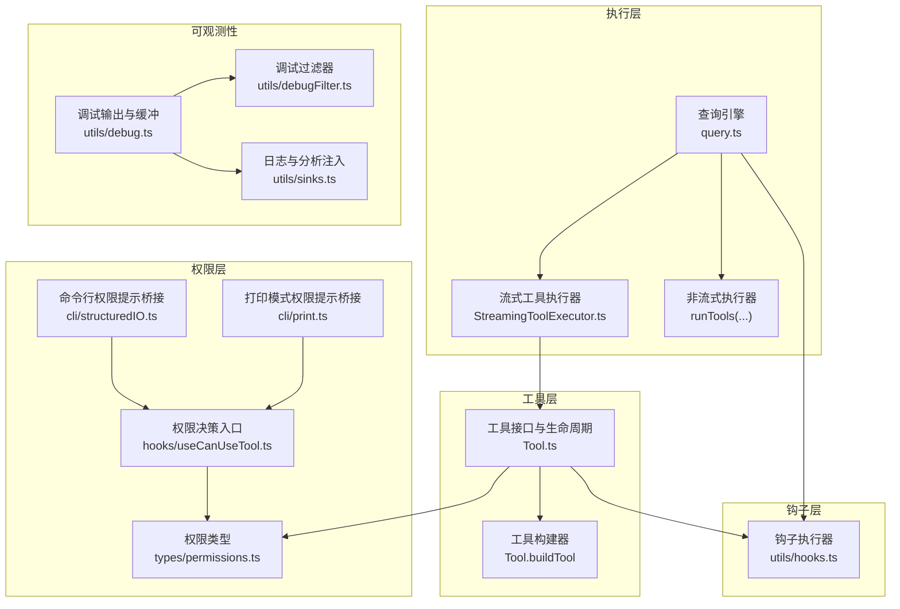
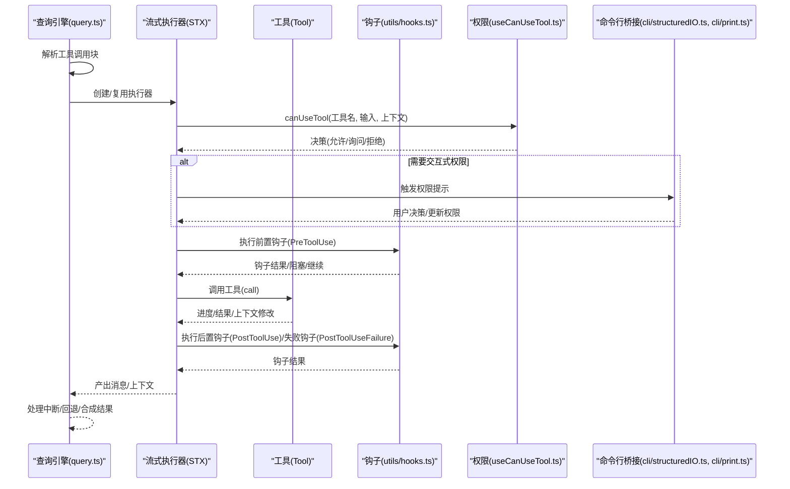
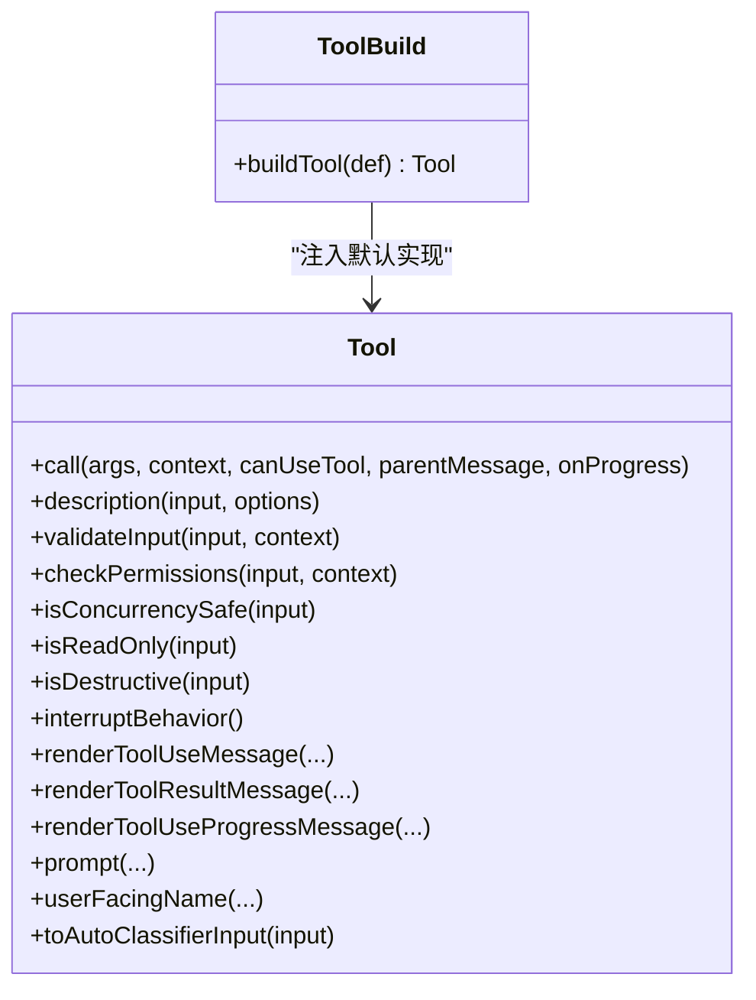
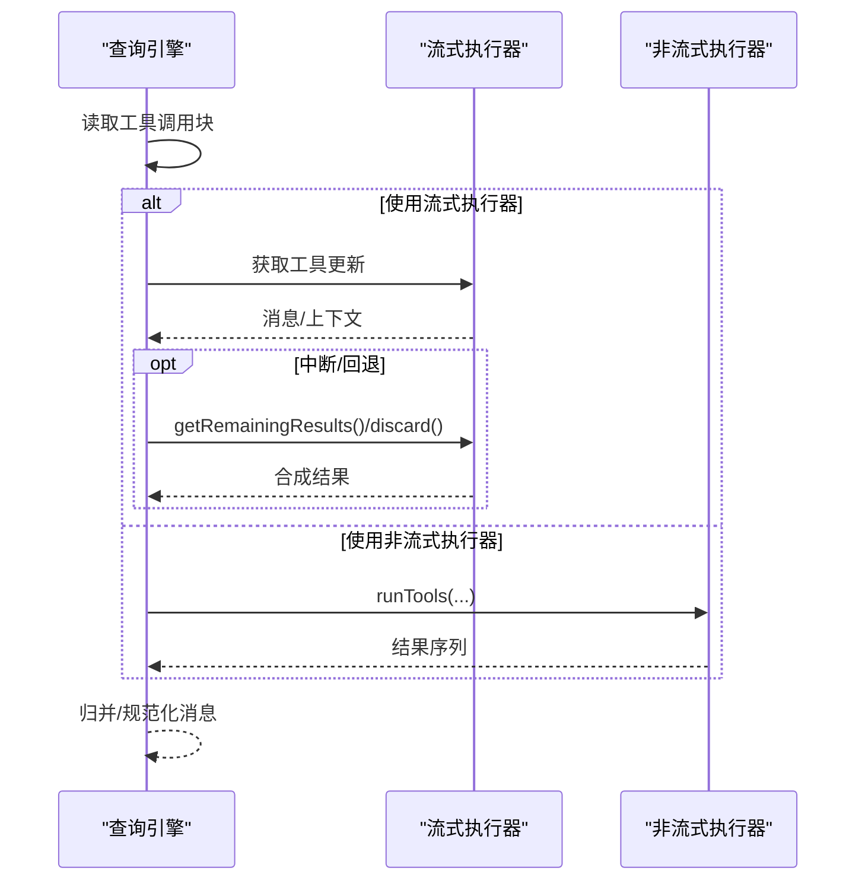
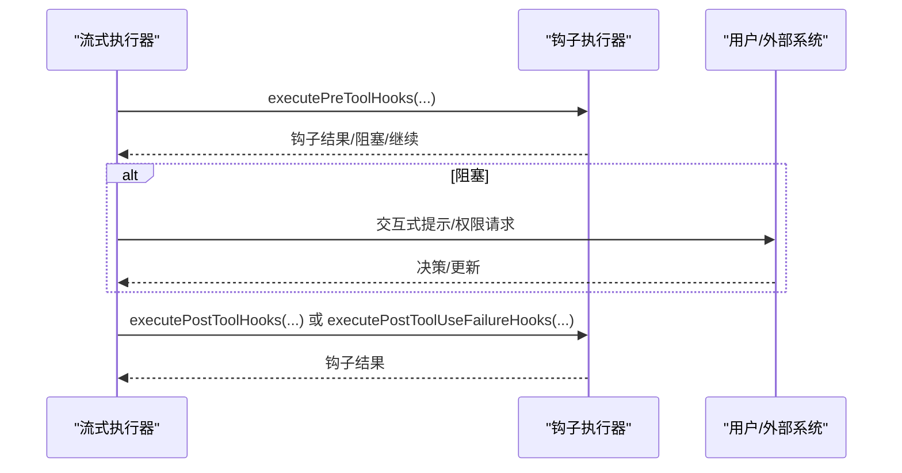
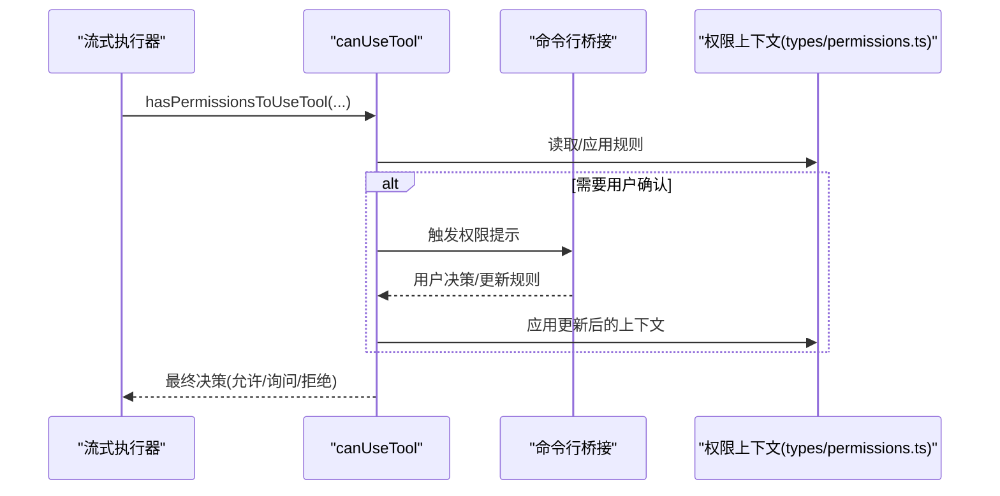
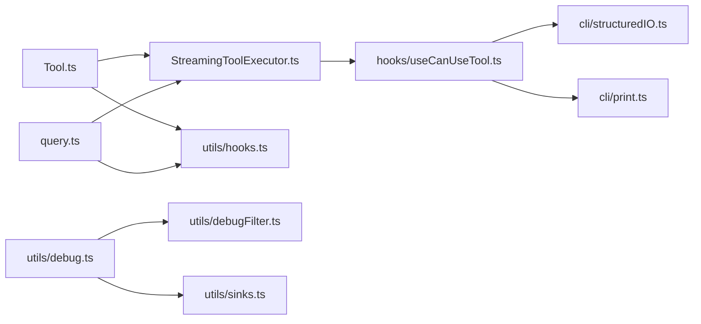

# 工具服务

<cite>
**本文引用的文件**
- [README.md](file://README.md)
- [Tool.ts](file://src/Tool.ts)
- [StreamingToolExecutor.ts](file://src/services/tools/StreamingToolExecutor.ts)
- [query.ts](file://src/query.ts)
- [hooks.ts](file://src/utils/hooks.ts)
- [permissions.ts](file://src/types/permissions.ts)
- [useCanUseTool.ts](file://src/hooks/useCanUseTool.ts)
- [structuredIO.ts](file://src/cli/structuredIO.ts)
- [print.ts](file://src/cli/print.ts)
- [debug.ts](file://src/utils/debug.ts)
- [debugFilter.ts](file://src/utils/debugFilter.ts)
- [sinks.ts](file://src/utils/sinks.ts)
</cite>

## 目录
1. [简介](#简介)
2. [项目结构](#项目结构)
3. [核心组件](#核心组件)
4. [架构总览](#架构总览)
5. [详细组件分析](#详细组件分析)
6. [依赖关系分析](#依赖关系分析)
7. [性能考量](#性能考量)
8. [故障排查指南](#故障排查指南)
9. [结论](#结论)
10. [附录](#附录)

## 简介
本技术文档聚焦 Claude Code 的“工具服务”体系，围绕以下主题展开：工具执行协调机制（调度、资源分配、执行顺序）、流式工具执行器（异步执行、进度跟踪、中断处理）、工具钩子系统（前置、后置、异常钩子）、工具权限检查集成（权限验证、安全策略、访问控制）、扩展指南（自定义工具集成、性能优化、错误处理），以及工具执行监控、日志记录与调试支持。

## 项目结构
工具服务横跨多个模块：
- 工具接口与生命周期：在工具类型定义中统一规范工具能力与渲染接口，并通过构建器注入默认行为。
- 执行编排：查询引擎负责解析工具调用块并选择合适的执行路径（流式或非流式）。
- 流式执行器：并发安全控制、顺序保证、进度与中断传播。
- 钩子系统：在工具使用前后及失败时触发用户态扩展点。
- 权限系统：工具级权限决策与通用权限上下文。
- 日志与调试：统一的调试输出、过滤与持久化。



图表来源
- [Tool.ts:1-793](file://src/Tool.ts#L1-L793)
- [StreamingToolExecutor.ts:1-531](file://src/services/tools/StreamingToolExecutor.ts#L1-L531)
- [query.ts:1-200](file://src/query.ts#L1-L200)
- [hooks.ts:1-200](file://src/utils/hooks.ts#L1-L200)
- [permissions.ts:212-257](file://src/types/permissions.ts#L212-L257)
- [useCanUseTool.ts](file://src/hooks/useCanUseTool.ts)
- [structuredIO.ts:811-859](file://src/cli/structuredIO.ts#L811-L859)
- [print.ts:4287-4322](file://src/cli/print.ts#L4287-L4322)
- [debug.ts:163-207](file://src/utils/debug.ts#L163-L207)
- [debugFilter.ts:1-157](file://src/utils/debugFilter.ts#L1-L157)
- [sinks.ts:1-16](file://src/utils/sinks.ts#L1-L16)

章节来源
- [README.md:500-533](file://README.md#L500-L533)
- [Tool.ts:1-793](file://src/Tool.ts#L1-L793)
- [query.ts:1-200](file://src/query.ts#L1-L200)

## 核心组件
- 工具接口与生命周期：统一的工具类型定义，包含输入/输出模式、能力标记（并发安全、只读、破坏性）、权限检查、渲染与描述等方法；通过构建器注入默认行为，确保最小实现即可工作。
- 流式工具执行器：维护工具队列与状态机，按并发安全规则调度执行，实时产出进度消息，处理中断与错误传播，支持丢弃与回退。
- 查询引擎：根据是否启用流式执行器决定执行路径；在中断或流式回退时生成合成结果，保证消息配对与 UI 一致性。
- 钩子系统：在工具使用前、后、失败时触发，支持同步/异步输出、交互式提示、权限请求等扩展。
- 权限系统：集中化的权限类型与上下文，工具可在调用前进行二次校验；命令行桥接支持交互式权限提示与自动分类器决策。

章节来源
- [Tool.ts:362-793](file://src/Tool.ts#L362-L793)
- [StreamingToolExecutor.ts:40-531](file://src/services/tools/StreamingToolExecutor.ts#L40-L531)
- [query.ts:712-1410](file://src/query.ts#L712-L1410)
- [hooks.ts:3398-3846](file://src/utils/hooks.ts#L3398-L3846)
- [permissions.ts:212-257](file://src/types/permissions.ts#L212-L257)

## 架构总览
下图展示从查询到工具执行、进度与结果产出的关键流程，以及钩子与权限的穿插点。



图表来源
- [query.ts:712-1410](file://src/query.ts#L712-L1410)
- [StreamingToolExecutor.ts:320-405](file://src/services/tools/StreamingToolExecutor.ts#L320-L405)
- [hooks.ts:3418-3436](file://src/utils/hooks.ts#L3418-L3436)
- [useCanUseTool.ts](file://src/hooks/useCanUseTool.ts)
- [structuredIO.ts:811-859](file://src/cli/structuredIO.ts#L811-L859)
- [print.ts:4287-4322](file://src/cli/print.ts#L4287-L4322)

## 详细组件分析

### 工具接口与生命周期
- 统一能力标记：是否启用、并发安全、只读、破坏性、中断行为等，便于执行器与 UI 做策略选择。
- 渲染与描述：提供输入/结果/进度的 UI 渲染与摘要生成，支持分组显示与简洁视图。
- 权限与校验：工具可自定义输入校验与权限检查，作为通用权限系统的补充。
- 默认行为：通过构建器注入安全默认，避免遗漏关键实现。



图表来源
- [Tool.ts:362-793](file://src/Tool.ts#L362-L793)

章节来源
- [Tool.ts:362-793](file://src/Tool.ts#L362-L793)

### 流式工具执行器（并发与顺序）
- 并发控制：仅当当前无执行中的工具，或全部执行中的工具均为并发安全时，才允许新工具入队执行。
- 顺序保证：非并发安全工具必须独占执行窗口，后续工具需等待其完成。
- 进度与结果：进度消息即时产出；结果按工具接收顺序累积与产出。
- 中断与错误传播：支持用户中断、兄弟工具错误导致的级联取消；Bash 错误会广播给同组子进程。
- 回退与丢弃：当流式通道不可用时，可丢弃未完成执行并生成合成错误消息。

```mermaid
flowchart TD
Start(["开始"]) --> Enqueue["入队工具(并发安全判定)"]
Enqueue --> CanExec{"可执行?<br/>无执行中 或 全部并发安全"}
CanExec --> |否| Wait["等待/阻塞(保持顺序)"]
CanExec --> |是| Exec["执行工具(runToolUse)"]
Exec --> Progress["产出进度消息"]
Exec --> Result["产出结果消息"]
Exec --> Error{"是否错误?"}
Error --> |是(Bash)| Cascade["广播级联取消"]
Error --> |否| Next["下一个工具"]
Cascade --> Next
Next --> Done(["完成/继续"])
```

图表来源
- [StreamingToolExecutor.ts:129-151](file://src/services/tools/StreamingToolExecutor.ts#L129-L151)
- [StreamingToolExecutor.ts:320-405](file://src/services/tools/StreamingToolExecutor.ts#L320-L405)

章节来源
- [StreamingToolExecutor.ts:40-531](file://src/services/tools/StreamingToolExecutor.ts#L40-L531)

### 查询引擎与执行路径
- 路径选择：根据是否创建了流式执行器决定使用流式或非流式执行器。
- 中断处理：在中断发生时，消费剩余结果以生成合成工具结果，确保消息配对。
- 流式回退：当流式通道失败时，丢弃旧执行器并重建，避免孤儿结果。



图表来源
- [query.ts:712-1410](file://src/query.ts#L712-L1410)
- [query.ts:123-149](file://src/query.ts#L123-L149)

章节来源
- [query.ts:712-1410](file://src/query.ts#L712-L1410)

### 钩子系统（前置/后置/异常）
- 前置钩子：在工具调用前执行，可用于预检、提示或阻塞。
- 后置钩子：工具成功完成后执行，用于反馈与审计。
- 异常钩子：工具失败或权限被拒时执行，用于恢复与告警。
- 执行模型：支持同步/异步输出、交互式提示、权限请求等；带超时与信号控制。



图表来源
- [hooks.ts:3418-3436](file://src/utils/hooks.ts#L3418-L3436)
- [hooks.ts:3450-3477](file://src/utils/hooks.ts#L3450-L3477)
- [hooks.ts:3492-3527](file://src/utils/hooks.ts#L3492-L3527)

章节来源
- [hooks.ts:3398-3846](file://src/utils/hooks.ts#L3398-L3846)

### 权限检查集成
- 工具级权限：工具可自定义 checkPermissions，结合通用权限上下文做二次校验。
- 交互式权限：在需要时通过命令行桥接触发交互式提示，支持自动分类器决策与权限更新。
- 权限上下文：集中化的权限模式、规则集与工作目录等，贯穿工具使用全过程。



图表来源
- [useCanUseTool.ts](file://src/hooks/useCanUseTool.ts)
- [structuredIO.ts:811-859](file://src/cli/structuredIO.ts#L811-L859)
- [print.ts:4287-4322](file://src/cli/print.ts#L4287-L4322)
- [permissions.ts:212-257](file://src/types/permissions.ts#L212-L257)

章节来源
- [permissions.ts:212-257](file://src/types/permissions.ts#L212-L257)
- [structuredIO.ts:811-859](file://src/cli/structuredIO.ts#L811-L859)
- [print.ts:4287-4322](file://src/cli/print.ts#L4287-L4322)

### 工具扩展指南
- 自定义工具集成：通过工具构建器定义最小能力集合，利用默认行为覆盖与渲染接口适配 UI。
- 性能优化：合理标注并发安全，减少串行等待；在工具内部实现增量进度与分片输出。
- 错误处理：在工具内捕获并转换为标准错误消息；必要时通过钩子进行恢复或告警。
- 安全策略：在工具级实现输入校验与权限检查；对高风险操作（如 Bash）谨慎设计中断与级联取消策略。

章节来源
- [Tool.ts:745-775](file://src/Tool.ts#L745-L775)

### 执行监控、日志与调试
- 统一日志：统一的调试写入器，支持缓冲与立即模式；提供调试过滤器按类别筛选输出。
- 分析与诊断：初始化分析与错误日志通道，支持事件埋点与会话追踪。
- 调试开关：通过环境变量与过滤器控制输出范围，便于问题定位。

章节来源
- [debug.ts:163-207](file://src/utils/debug.ts#L163-L207)
- [debugFilter.ts:1-157](file://src/utils/debugFilter.ts#L1-L157)
- [sinks.ts:1-16](file://src/utils/sinks.ts#L1-L16)

## 依赖关系分析
- 工具层依赖：工具接口与生命周期定义贯穿执行器与钩子系统。
- 执行层依赖：查询引擎依赖执行器与工具定义；流式执行器依赖工具定义与权限入口。
- 钩子与权限：钩子系统与权限系统相互配合，前者在时间点上触发，后者在策略上约束。
- 可观测性：调试与日志系统独立于业务逻辑，提供统一的输出与过滤能力。



图表来源
- [Tool.ts:1-793](file://src/Tool.ts#L1-L793)
- [StreamingToolExecutor.ts:1-531](file://src/services/tools/StreamingToolExecutor.ts#L1-L531)
- [query.ts:1-200](file://src/query.ts#L1-L200)
- [hooks.ts:1-200](file://src/utils/hooks.ts#L1-L200)
- [useCanUseTool.ts](file://src/hooks/useCanUseTool.ts)
- [structuredIO.ts:811-859](file://src/cli/structuredIO.ts#L811-L859)
- [print.ts:4287-4322](file://src/cli/print.ts#L4287-L4322)
- [debug.ts:163-207](file://src/utils/debug.ts#L163-L207)
- [debugFilter.ts:1-157](file://src/utils/debugFilter.ts#L1-L157)
- [sinks.ts:1-16](file://src/utils/sinks.ts#L1-L16)

章节来源
- [Tool.ts:1-793](file://src/Tool.ts#L1-L793)
- [StreamingToolExecutor.ts:1-531](file://src/services/tools/StreamingToolExecutor.ts#L1-L531)
- [query.ts:1-200](file://src/query.ts#L1-L200)
- [hooks.ts:1-200](file://src/utils/hooks.ts#L1-L200)

## 性能考量
- 并发优先：对不依赖共享资源的工具标注并发安全，最大化并行收益。
- 进度驱动：在工具内部实现细粒度进度回调，提升用户体验与可观测性。
- 中断与回退：快速响应中断与流式回退，避免无效计算与资源浪费。
- 日志节流：使用缓冲与过滤机制，降低高频调试输出对性能的影响。

## 故障排查指南
- 中断与回退：若出现“用户中断/流式回退”的合成结果，检查流式通道稳定性与工具的中断行为配置。
- 权限问题：若频繁弹出权限提示，检查权限规则与自动分类器配置；必要时调整工具的权限匹配器。
- 钩子异常：若钩子导致阻塞或延迟，检查钩子超时设置与异步输出处理。
- 日志定位：使用调试过滤器缩小输出范围，结合分析与错误日志通道定位问题根因。

章节来源
- [query.ts:1012-1041](file://src/query.ts#L1012-L1041)
- [hooks.ts:166-182](file://src/utils/hooks.ts#L166-L182)
- [debugFilter.ts:116-157](file://src/utils/debugFilter.ts#L116-L157)

## 结论
该工具服务通过统一的工具接口、严谨的并发与顺序控制、完善的钩子与权限体系，以及可观测性的日志与调试支持，实现了稳定、可扩展且安全的工具执行平台。遵循本文的扩展与优化建议，可进一步提升工具链的性能与可靠性。

## 附录
- 工具系统架构概览（来自项目文档）：见 README 中的工具系统架构图示。

章节来源
- [README.md:500-533](file://README.md#L500-L533)