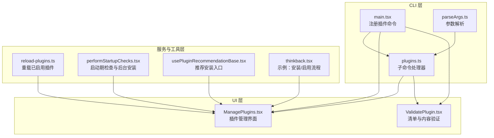
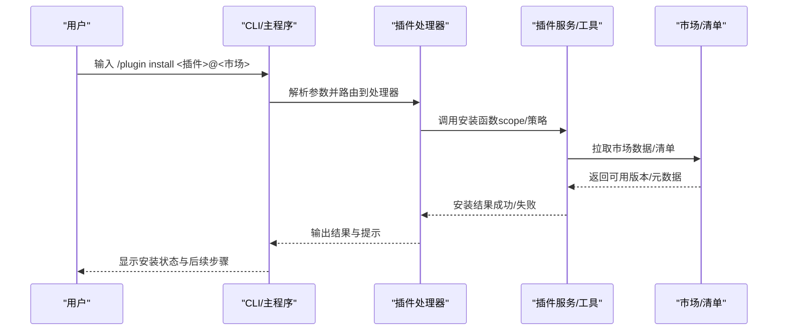
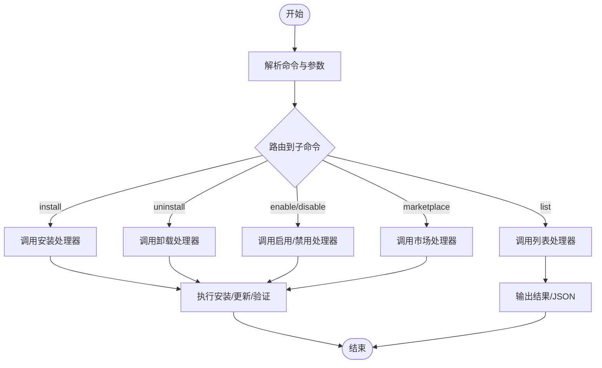
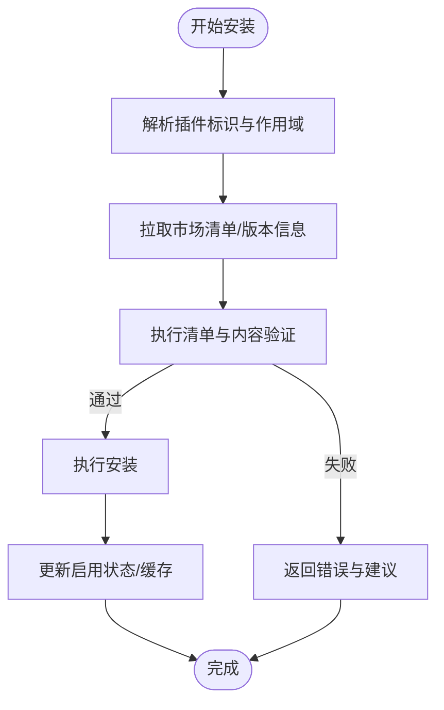
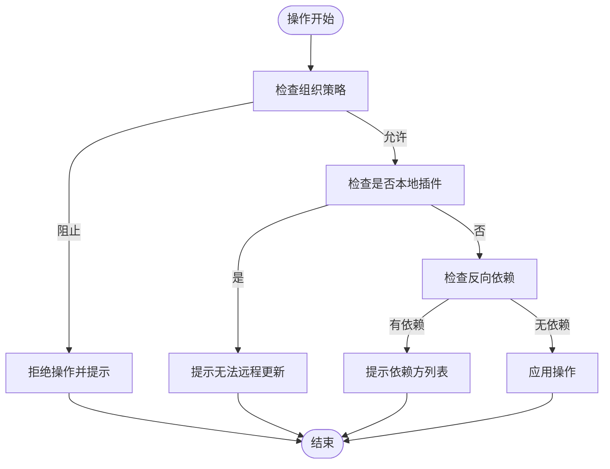
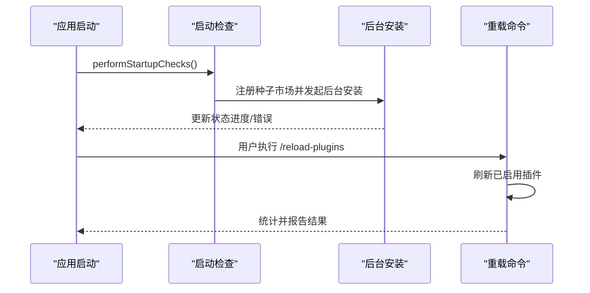
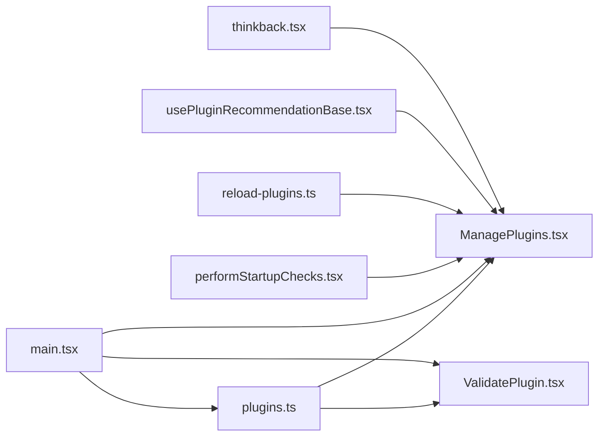

# 插件管理服务

<cite>
**本文引用的文件**
- [plugins.ts](file://src/cli/handlers/plugins.ts)
- [ManagePlugins.tsx](file://src/commands/plugin/ManagePlugins.tsx)
- [parseArgs.ts](file://src/commands/plugin/parseArgs.ts)
- [ValidatePlugin.tsx](file://src/commands/plugin/ValidatePlugin.tsx)
- [performStartupChecks.tsx](file://src/utils/plugins/performStartupChecks.tsx)
- [reload-plugins.ts](file://src/commands/reload-plugins/reload-plugins.ts)
- [usePluginRecommendationBase.tsx](file://src/hooks/usePluginRecommendationBase.tsx)
- [thinkback.tsx](file://src/commands/thinkback/thinkback.tsx)
- [main.tsx](file://src/main.tsx)
</cite>

## 目录
1. [简介](#简介)
2. [项目结构](#项目结构)
3. [核心组件](#核心组件)
4. [架构总览](#架构总览)
5. [详细组件分析](#详细组件分析)
6. [依赖关系分析](#依赖关系分析)
7. [性能考量](#性能考量)
8. [故障排查指南](#故障排查指南)
9. [结论](#结论)
10. [附录](#附录)

## 简介
本文件面向 Claude Code 的插件管理服务，系统化梳理插件安装管理器的实现与使用方式，覆盖以下主题：
- 插件下载、验证、安装与卸载流程
- 插件操作协调：依赖解析、版本管理与冲突处理
- 插件 CLI 命令体系：安装、更新、启用/禁用、状态查询等
- 插件生命周期管理：启动加载、运行监控与优雅关闭
- 最佳实践：安全检查、性能监控与故障隔离
- 插件市场集成、自动更新与兼容性验证

## 项目结构
围绕插件管理的关键模块分布如下：
- CLI 子命令处理器：负责解析用户输入并调用后端服务执行具体操作
- UI 管理界面：提供交互式插件列表、详情、选项配置与批量操作
- 启动期检查与后台安装：在信任目录的前提下进行种子市场与插件的后台安装
- 刷新与重载：集中刷新已启用插件，同步最新变更
- 验证工具：对插件或市场清单与内容进行校验

**图表来源**
- [main.tsx:4227-4254](file://src/main.tsx#L4227-L4254)
- [plugins.ts:668-701](file://src/cli/handlers/plugins.ts#L668-L701)
- [parseArgs.ts:1-103](file://src/commands/plugin/parseArgs.ts#L1-L103)
- [ManagePlugins.tsx:397-405](file://src/commands/plugin/ManagePlugins.tsx#L397-L405)
- [ValidatePlugin.tsx:1-60](file://src/commands/plugin/ValidatePlugin.tsx#L1-L60)
- [performStartupChecks.tsx:24-69](file://src/utils/plugins/performStartupChecks.tsx#L24-L69)
- [reload-plugins.ts:10-57](file://src/commands/reload-plugins/reload-plugins.ts#L10-L57)
- [usePluginRecommendationBase.tsx:81-104](file://src/hooks/usePluginRecommendationBase.tsx#L81-L104)
- [thinkback.tsx:206-241](file://src/commands/thinkback/thinkback.tsx#L206-L241)

**章节来源**
- [main.tsx:4227-4254](file://src/main.tsx#L4227-L4254)
- [plugins.ts:668-701](file://src/cli/handlers/plugins.ts#L668-L701)
- [ManagePlugins.tsx:397-405](file://src/commands/plugin/ManagePlugins.tsx#L397-L405)
- [performStartupChecks.tsx:24-69](file://src/utils/plugins/performStartupChecks.tsx#L24-L69)
- [reload-plugins.ts:10-57](file://src/commands/reload-plugins/reload-plugins.ts#L10-L57)

## 核心组件
- CLI 插件子命令处理器：封装 install、uninstall、enable、disable、list、marketplace 等命令的执行逻辑，并与后端服务对接
- 插件管理 UI：提供插件列表、详情、启用/禁用、更新、卸载、配置等交互能力
- 验证工具：对清单与内容进行结构与语义校验，输出错误与警告
- 启动期检查：在用户信任当前工作目录后，后台拉取种子市场与插件，避免阻塞启动
- 重载机制：集中刷新已启用插件，统计命令/技能/代理/Hook/MCP/LSP 数量并报告错误

**章节来源**
- [plugins.ts:100-154](file://src/cli/handlers/plugins.ts#L100-L154)
- [ManagePlugins.tsx:1006-1172](file://src/commands/plugin/ManagePlugins.tsx#L1006-L1172)
- [ValidatePlugin.tsx:14-60](file://src/commands/plugin/ValidatePlugin.tsx#L14-L60)
- [performStartupChecks.tsx:24-69](file://src/utils/plugins/performStartupChecks.tsx#L24-L69)
- [reload-plugins.ts:10-57](file://src/commands/reload-plugins/reload-plugins.ts#L10-L57)

## 架构总览
插件管理采用“CLI/界面 + 处理器 + 服务/工具”的分层设计：
- 输入层：CLI 参数解析与 UI 交互
- 控制层：子命令处理器与管理界面协调
- 执行层：安装/卸载/启用/禁用/验证/刷新等具体操作
- 数据层：插件清单、市场配置、启用状态、错误记录与缓存

**图表来源**
- [main.tsx:4227-4254](file://src/main.tsx#L4227-L4254)
- [plugins.ts:668-701](file://src/cli/handlers/plugins.ts#L668-L701)
- [ManagePlugins.tsx:1006-1172](file://src/commands/plugin/ManagePlugins.tsx#L1006-L1172)

## 详细组件分析

### CLI 插件命令系统
- 命令注册与路由：在主程序中注册 install、uninstall、enable、disable、list、marketplace 等子命令，并按需动态导入处理器
- 参数解析：支持简写与多种目标格式（名称、URL、路径、带市场源），并区分 marketplace 动作（add/remove/update/list）
- 错误处理：统一打印错误消息并退出码控制；市场操作提供专门的错误处理函数
- 事件上报：对关键操作（安装、卸载、启用、更新、列出、市场增删改）记录分析事件

**图表来源**
- [main.tsx:4227-4254](file://src/main.tsx#L4227-L4254)
- [plugins.ts:668-701](file://src/cli/handlers/plugins.ts#L668-L701)
- [plugins.ts:156-444](file://src/cli/handlers/plugins.ts#L156-L444)
- [plugins.ts:446-665](file://src/cli/handlers/plugins.ts#L446-L665)

**章节来源**
- [main.tsx:4227-4254](file://src/main.tsx#L4227-L4254)
- [plugins.ts:668-701](file://src/cli/handlers/plugins.ts#L668-L701)
- [plugins.ts:156-444](file://src/cli/handlers/plugins.ts#L156-L444)
- [plugins.ts:446-665](file://src/cli/handlers/plugins.ts#L446-L665)

### 插件安装管理器（下载/验证/安装/卸载）
- 下载与安装：根据插件标识与作用域执行安装；支持用户/项目/本地作用域；记录安装元数据（版本、时间、路径）
- 验证：对清单与内容进行结构与语义校验，输出错误与警告；支持从目录或清单路径触发
- 卸载：支持保留数据与清理数据两种模式；处理反向依赖提示与组织策略限制
- 版本管理：在 UI 中标记待更新项；CLI 支持更新命令；对内置插件与受管插件进行范围约束
- 冲突处理：对组织策略强制禁用的插件进行过滤；对本地插件禁止远程更新；对跨作用域操作进行保护

**图表来源**
- [plugins.ts:668-701](file://src/cli/handlers/plugins.ts#L668-L701)
- [ValidatePlugin.tsx:14-60](file://src/commands/plugin/ValidatePlugin.tsx#L14-L60)
- [ManagePlugins.tsx:1006-1172](file://src/commands/plugin/ManagePlugins.tsx#L1006-L1172)

**章节来源**
- [plugins.ts:668-701](file://src/cli/handlers/plugins.ts#L668-L701)
- [ValidatePlugin.tsx:14-60](file://src/commands/plugin/ValidatePlugin.tsx#L14-L60)
- [ManagePlugins.tsx:1006-1172](file://src/commands/plugin/ManagePlugins.tsx#L1006-L1172)

### 插件操作协调（依赖解析、版本管理、冲突处理）
- 依赖与反向依赖：在禁用/卸载时检测被其他插件依赖的情况，给出提示
- 组织策略：过滤由策略强制禁用的插件，防止用户绕过
- 本地插件限制：本地来源插件禁止远程更新，引导用户修改源地址
- 作用域一致性：在启用/禁用时自动推断作用域，避免跨作用域误操作

**图表来源**
- [ManagePlugins.tsx:1006-1172](file://src/commands/plugin/ManagePlugins.tsx#L1006-L1172)
- [ManagePlugins.tsx:376-383](file://src/commands/plugin/ManagePlugins.tsx#L376-L383)

**章节来源**
- [ManagePlugins.tsx:1006-1172](file://src/commands/plugin/ManagePlugins.tsx#L1006-L1172)
- [ManagePlugins.tsx:376-383](file://src/commands/plugin/ManagePlugins.tsx#L376-L383)

### 插件 CLI 命令详解
- 安装：支持指定作用域与协作模式；记录分析事件
- 卸载：支持保留数据与清理数据；记录分析事件
- 启用/禁用：支持全局与特定插件；对协作模式与作用域进行约束
- 列表：支持 JSON 输出与“仅可用”过滤；聚合已加载插件与会话级插件信息
- 市场：支持添加/移除/更新/列出；支持稀疏路径与作用域
- 验证：对清单与内容进行校验，输出错误与警告

**章节来源**
- [plugins.ts:668-701](file://src/cli/handlers/plugins.ts#L668-L701)
- [plugins.ts:703-737](file://src/cli/handlers/plugins.ts#L703-L737)
- [plugins.ts:739-779](file://src/cli/handlers/plugins.ts#L739-L779)
- [plugins.ts:156-444](file://src/cli/handlers/plugins.ts#L156-L444)
- [plugins.ts:446-665](file://src/cli/handlers/plugins.ts#L446-L665)
- [plugins.ts:100-154](file://src/cli/handlers/plugins.ts#L100-L154)

### 插件生命周期管理（启动加载、运行监控、优雅关闭）
- 启动加载：在用户信任当前工作目录后，后台执行种子市场与插件的安装，不阻塞启动；若种子变更则刷新缓存并提示重载
- 运行监控：UI 层展示插件状态、错误与 MCP 服务器连接情况；支持查看失败插件详情与孤儿错误
- 优雅关闭：通过重载命令集中刷新已启用插件，统计命令/技能/代理/Hook/MCP/LSP 数量并报告错误

**图表来源**
- [performStartupChecks.tsx:24-69](file://src/utils/plugins/performStartupChecks.tsx#L24-L69)
- [reload-plugins.ts:10-57](file://src/commands/reload-plugins/reload-plugins.ts#L10-L57)

**章节来源**
- [performStartupChecks.tsx:24-69](file://src/utils/plugins/performStartupChecks.tsx#L24-L69)
- [reload-plugins.ts:10-57](file://src/commands/reload-plugins/reload-plugins.ts#L10-L57)

### 插件市场集成、自动更新与兼容性验证
- 市场集成：支持 GitHub/Git/URL/目录/文件等多种来源；支持稀疏路径；可声明作用域（用户/项目/本地）
- 自动更新：支持单个或全部市场的更新；更新后清理缓存并记录分析事件
- 兼容性验证：在安装前进行清单与内容验证；对本地插件禁止远程更新；对组织策略强制禁用的插件进行过滤

**章节来源**
- [plugins.ts:446-665](file://src/cli/handlers/plugins.ts#L446-L665)
- [ManagePlugins.tsx:1006-1172](file://src/commands/plugin/ManagePlugins.tsx#L1006-L1172)
- [usePluginRecommendationBase.tsx:81-104](file://src/hooks/usePluginRecommendationBase.tsx#L81-L104)

## 依赖关系分析
- CLI 主程序依赖插件处理器模块；处理器再依赖服务与工具模块
- 管理界面依赖服务层（启用/禁用/卸载/更新）、市场与清单工具、MCP 集成与设置存储
- 启动检查与重载命令分别在不同阶段影响插件加载与状态

**图表来源**
- [main.tsx:4227-4254](file://src/main.tsx#L4227-L4254)
- [plugins.ts:668-701](file://src/cli/handlers/plugins.ts#L668-L701)
- [ManagePlugins.tsx:397-405](file://src/commands/plugin/ManagePlugins.tsx#L397-L405)
- [ValidatePlugin.tsx:1-60](file://src/commands/plugin/ValidatePlugin.tsx#L1-L60)
- [performStartupChecks.tsx:24-69](file://src/utils/plugins/performStartupChecks.tsx#L24-L69)
- [reload-plugins.ts:10-57](file://src/commands/reload-plugins/reload-plugins.ts#L10-L57)
- [usePluginRecommendationBase.tsx:81-104](file://src/hooks/usePluginRecommendationBase.tsx#L81-L104)
- [thinkback.tsx:206-241](file://src/commands/thinkback/thinkback.tsx#L206-L241)

**章节来源**
- [main.tsx:4227-4254](file://src/main.tsx#L4227-L4254)
- [plugins.ts:668-701](file://src/cli/handlers/plugins.ts#L668-L701)
- [ManagePlugins.tsx:397-405](file://src/commands/plugin/ManagePlugins.tsx#L397-L405)
- [performStartupChecks.tsx:24-69](file://src/utils/plugins/performStartupChecks.tsx#L24-L69)
- [reload-plugins.ts:10-57](file://src/commands/reload-plugins/reload-plugins.ts#L10-L57)

## 性能考量
- 后台安装：启动期后台执行市场与插件安装，避免阻塞主线程
- 缓存与增量：在种子市场变更时清理相关缓存并提示重载，减少重复计算
- 重载统计：集中刷新时统计命令/技能/代理/Hook/MCP/LSP 数量，便于快速感知变化
- I/O 优化：验证与安装过程尽量复用已加载的数据，减少重复 I/O

## 故障排查指南
- 安装失败：检查清单与内容验证结果；确认作用域与市场来源；查看错误详情并重试
- 启用/禁用异常：确认插件是否受组织策略限制；检查反向依赖；必要时先卸载依赖插件
- 本地插件更新：本地来源插件无法远程更新，需修改源地址或切换到可更新的市场
- 重载无效：若种子市场变更，需执行重载命令以应用最新状态；查看错误统计并使用诊断命令定位问题

**章节来源**
- [ManagePlugins.tsx:1006-1172](file://src/commands/plugin/ManagePlugins.tsx#L1006-L1172)
- [reload-plugins.ts:10-57](file://src/commands/reload-plugins/reload-plugins.ts#L10-L57)

## 结论
本插件管理服务通过清晰的分层设计与完善的生命周期管理，实现了从安装、验证、启用到卸载与重载的全链路能力。结合启动期后台安装、组织策略过滤与本地插件限制，确保了安全性与稳定性。CLI 与 UI 双通道协同，既满足自动化场景也兼顾交互体验。

## 附录
- 示例：通过 UI 或命令安装/启用插件的典型流程可参考示例组件与推荐安装入口

**章节来源**
- [thinkback.tsx:206-241](file://src/commands/thinkback/thinkback.tsx#L206-L241)
- [usePluginRecommendationBase.tsx:81-104](file://src/hooks/usePluginRecommendationBase.tsx#L81-L104)