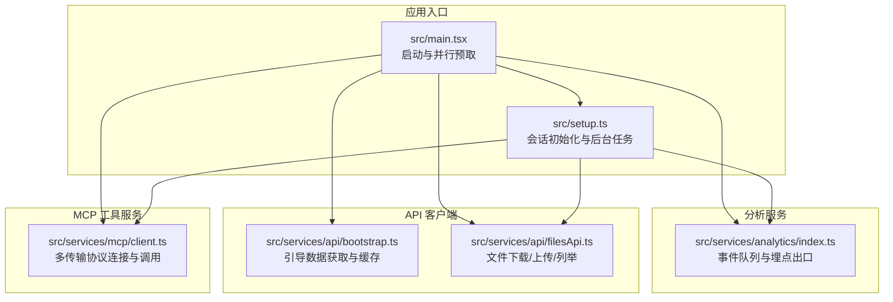
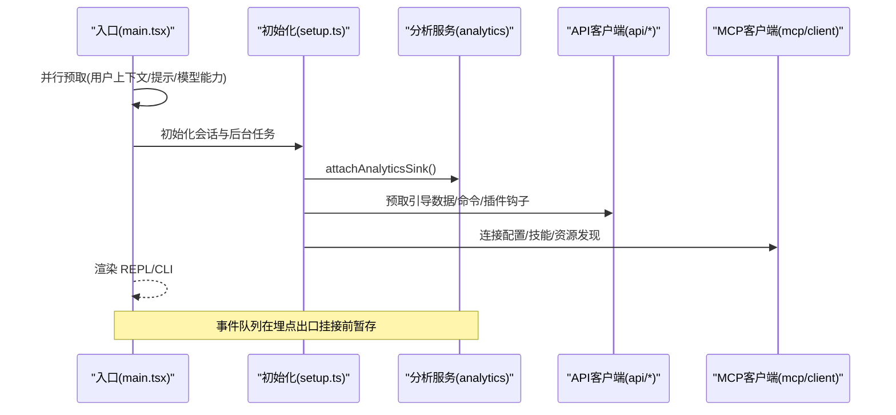
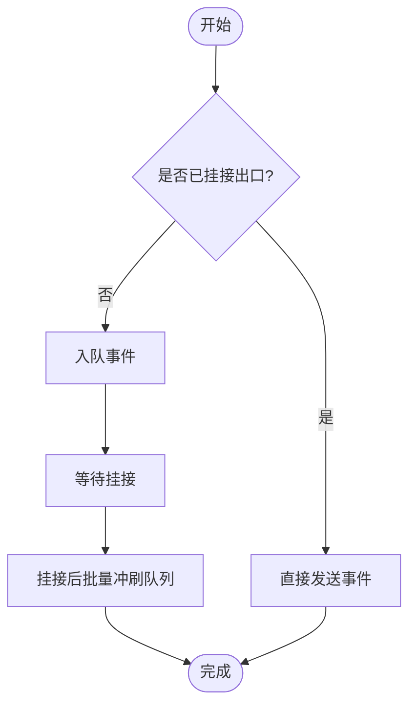
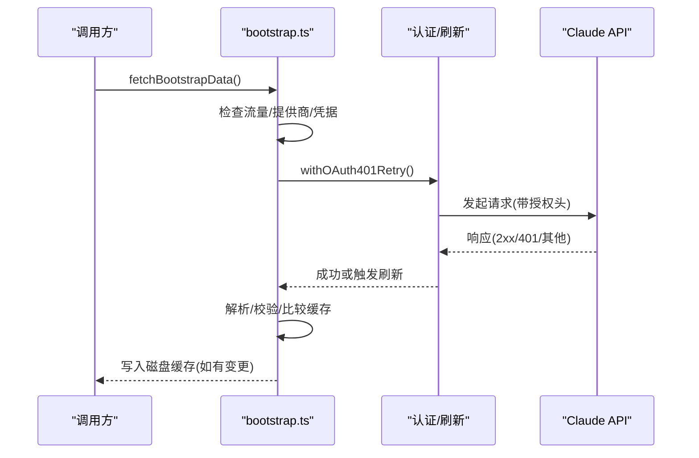
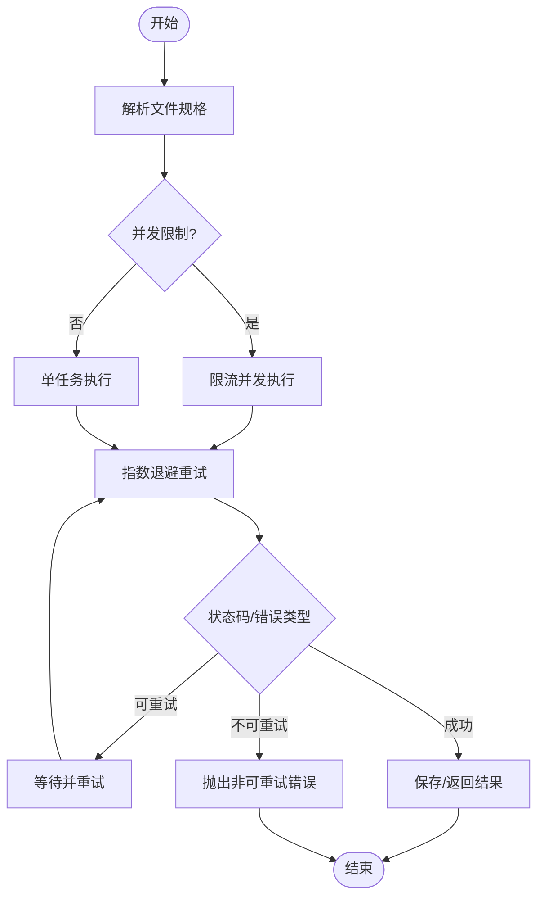
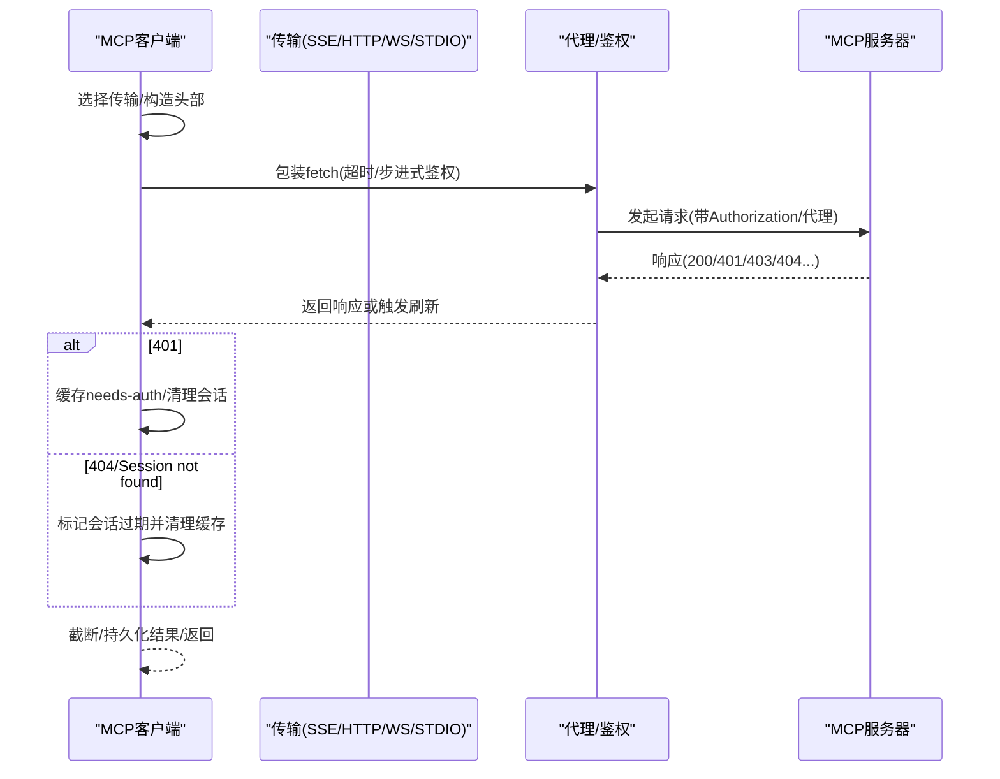
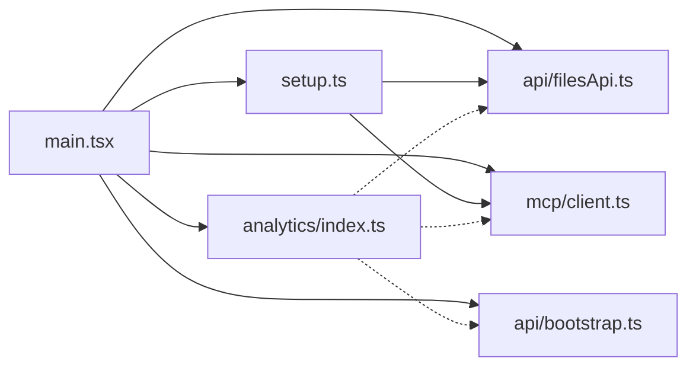

# 服务层架构

<cite>
**本文引用的文件**
- [src/main.tsx](file://src/main.tsx)
- [src/setup.ts](file://src/setup.ts)
- [src/services/analytics/index.ts](file://src/services/analytics/index.ts)
- [src/services/api/bootstrap.ts](file://src/services/api/bootstrap.ts)
- [src/services/api/filesApi.ts](file://src/services/api/filesApi.ts)
- [src/services/mcp/client.ts](file://src/services/mcp/client.ts)
</cite>

## 目录
1. [引言](#引言)
2. [项目结构](#项目结构)
3. [核心组件](#核心组件)
4. [架构总览](#架构总览)
5. [详细组件分析](#详细组件分析)
6. [依赖关系分析](#依赖关系分析)
7. [性能考量](#性能考量)
8. [故障排查指南](#故障排查指南)
9. [结论](#结论)
10. [附录：扩展与最佳实践](#附录扩展与最佳实践)

## 引言
本文件系统性梳理 Claude Code 的服务层架构，聚焦以下目标：
- 服务层整体设计：业务逻辑封装、依赖注入与模块化组织方式
- API 客户端实现：Claude API 集成、重试机制、错误处理与请求优化
- 分析服务架构：遥测数据收集、用户行为分析、性能监控与实验平台集成
- 工具服务实现：工具执行协调、权限检查与结果聚合
- 扩展指南：新增服务、依赖管理与测试策略
- 性能优化与可靠性保障

## 项目结构
服务层位于 src/services 下，围绕“分析服务”“API 客户端”“MCP 工具服务”三大主线展开，并通过入口与初始化流程进行装配与调度。

图表来源
- [src/main.tsx](file://src/main.tsx)
- [src/setup.ts](file://src/setup.ts)
- [src/services/analytics/index.ts](file://src/services/analytics/index.ts)
- [src/services/api/bootstrap.ts](file://src/services/api/bootstrap.ts)
- [src/services/api/filesApi.ts](file://src/services/api/filesApi.ts)
- [src/services/mcp/client.ts](file://src/services/mcp/client.ts)

章节来源
- [src/main.tsx](file://src/main.tsx)
- [src/setup.ts](file://src/setup.ts)

## 核心组件
- 分析服务（Analytics）
  - 提供事件日志公共 API，支持同步/异步记录；事件在“埋点出口”挂接前会被队列暂存，确保启动路径无阻塞。
  - 通过“埋点出口”统一路由到后端（如 Datadog、内部事件日志），并提供采样与字段清洗能力。
- API 客户端（Bootstrap 与 Files）
  - Bootstrap：按条件拉取引导数据，带 OAuth 刷新与重试、响应校验与磁盘缓存。
  - Files：提供文件下载（含指数退避重试、并发限制）、上传（含大小校验、取消信号）、列举（分页）与路径安全校验。
- MCP 工具服务
  - 支持 SSE/HTTP/WS/STDIO 等多种传输；统一超时包装、代理与 TLS 处理；认证失败缓存与重试；会话过期检测与清理；内容截断与输出持久化。

章节来源
- [src/services/analytics/index.ts](file://src/services/analytics/index.ts)
- [src/services/api/bootstrap.ts](file://src/services/api/bootstrap.ts)
- [src/services/api/filesApi.ts](file://src/services/api/filesApi.ts)
- [src/services/mcp/client.ts](file://src/services/mcp/client.ts)

## 架构总览
服务层采用“入口装配 + 模块化服务 + 统一埋点”的架构模式：
- 入口负责并行预取与关键服务初始化，避免阻塞首帧渲染
- 各服务模块职责清晰：分析、API、MCP 工具
- 统一的埋点接口贯穿全链路，便于性能监控与实验平台集成

图表来源
- [src/main.tsx](file://src/main.tsx)
- [src/setup.ts](file://src/setup.ts)
- [src/services/analytics/index.ts](file://src/services/analytics/index.ts)
- [src/services/api/bootstrap.ts](file://src/services/api/bootstrap.ts)
- [src/services/api/filesApi.ts](file://src/services/api/filesApi.ts)
- [src/services/mcp/client.ts](file://src/services/mcp/client.ts)

## 详细组件分析

### 分析服务（Analytics）
- 设计要点
  - 事件队列：在埋点出口挂接前暂存事件，避免阻塞启动路径
  - 埋点出口：可多次挂接但幂等，首次挂接后批量冲刷队列
  - 元数据类型：提供“已验证非敏感”“已标记 PII”两类元数据类型，辅助字段清洗与合规
- 关键流程
  - attachAnalyticsSink：挂接出口并冲刷队列
  - logEvent/logEventAsync：记录事件（同步/异步）
  - stripProtoFields：移除特定前缀字段以保护 PII

图表来源
- [src/services/analytics/index.ts](file://src/services/analytics/index.ts)

章节来源
- [src/services/analytics/index.ts](file://src/services/analytics/index.ts)

### API 客户端（Bootstrap）
- 设计要点
  - 条件拉取：仅在允许非必要流量且使用第一方提供商时发起
  - 认证优先级：优先 OAuth（带用户资料作用域），否则回退 API Key
  - 重试与刷新：对 OAuth 401 自动刷新并重试
  - 校验与缓存：响应严格校验，变更才写入磁盘缓存
- 关键流程
  - fetchBootstrapAPI：构建请求头、发起请求、解析与校验
  - fetchBootstrapData：更新全局配置缓存

图表来源
- [src/services/api/bootstrap.ts](file://src/services/api/bootstrap.ts)

章节来源
- [src/services/api/bootstrap.ts](file://src/services/api/bootstrap.ts)

### API 客户端（Files）
- 设计要点
  - 下载：指数退避重试、并发限制、路径安全校验、会话隔离目录
  - 上传：大小校验、取消信号、非可重试错误分类（401/403/413 等）
  - 列举：分页游标（after_id）迭代
- 关键流程
  - downloadSessionFiles/uploadSessionFiles/listFilesCreatedAfter
  - retryWithBackoff/parallelWithLimit

图表来源
- [src/services/api/filesApi.ts](file://src/services/api/filesApi.ts)

章节来源
- [src/services/api/filesApi.ts](file://src/services/api/filesApi.ts)

### MCP 工具服务
- 设计要点
  - 多传输适配：SSE/HTTP/WS/STDIO，统一超时与代理/TLS处理
  - 认证与会话：OAuth 步进式检测、401 缓存、会话过期检测与清理
  - 结果处理：内容截断、二进制持久化、错误结果携带 _meta
- 关键流程
  - connectToServer：根据配置选择传输并建立连接
  - wrapFetchWithTimeout：每请求独立超时，避免信号复用问题
  - createClaudeAiProxyFetch：代理请求附加 OAuth 令牌并处理 401 刷新

图表来源
- [src/services/mcp/client.ts](file://src/services/mcp/client.ts)

章节来源
- [src/services/mcp/client.ts](file://src/services/mcp/client.ts)

## 依赖关系分析
- 入口与初始化
  - main.tsx 负责并行预取与关键服务初始化，setup.ts 在渲染前完成会话内存、钩子、插件与后台任务注册
- 服务间耦合
  - 分析服务低耦合：仅暴露事件接口，不依赖具体后端
  - API 客户端与 MCP 客户端均依赖统一的认证与网络工具（超时包装、代理、TLS）
- 外部依赖
  - axios、@modelcontextprotocol/sdk、lodash-es、ws 等

图表来源
- [src/main.tsx](file://src/main.tsx)
- [src/setup.ts](file://src/setup.ts)
- [src/services/analytics/index.ts](file://src/services/analytics/index.ts)
- [src/services/api/bootstrap.ts](file://src/services/api/bootstrap.ts)
- [src/services/api/filesApi.ts](file://src/services/api/filesApi.ts)
- [src/services/mcp/client.ts](file://src/services/mcp/client.ts)

章节来源
- [src/main.tsx](file://src/main.tsx)
- [src/setup.ts](file://src/setup.ts)
- [src/services/analytics/index.ts](file://src/services/analytics/index.ts)
- [src/services/api/bootstrap.ts](file://src/services/api/bootstrap.ts)
- [src/services/api/filesApi.ts](file://src/services/api/filesApi.ts)
- [src/services/mcp/client.ts](file://src/services/mcp/client.ts)

## 性能考量
- 启动路径优化
  - main.tsx 将非关键工作延迟至渲染后执行，减少首帧阻塞
  - setup.ts 中对插件钩子与命令的预取采用条件判断，避免在裸模式或同步安装场景下的重复 IO
- I/O 与网络
  - Files API 使用并发限制与指数退避，降低抖动与拥塞
  - MCP 客户端为每个请求生成独立超时信号，避免长尾阻塞
- 缓存与去重
  - Bootstrap 数据仅在变更时写入磁盘缓存
  - MCP 认证失败采用短期缓存，避免大规模 401 冻结

[本节为通用指导，无需列出章节来源]

## 故障排查指南
- 分析服务
  - 若事件未上报：确认埋点出口是否挂接；检查队列是否被冲刷
  - PII 字段泄露风险：使用元数据类型标注，配合 stripProtoFields
- API 客户端
  - 下载失败：检查状态码与错误类型，区分可重试与不可重试；关注路径规范化与会话目录
  - 上传失败：关注 401/403/413 等非可重试错误；确认文件大小与取消信号
- MCP 客户端
  - 认证失败：检查 needs-auth 缓存与 OAuth 刷新；确认代理/TLS 配置
  - 会话过期：捕获“Session not found”错误并清理缓存后重连

章节来源
- [src/services/analytics/index.ts](file://src/services/analytics/index.ts)
- [src/services/api/filesApi.ts](file://src/services/api/filesApi.ts)
- [src/services/mcp/client.ts](file://src/services/mcp/client.ts)

## 结论
服务层通过“入口并行预取 + 模块化服务 + 统一埋点”的设计，在保证启动性能的同时，提供了高可靠、可观测、可扩展的服务能力。分析服务、API 客户端与 MCP 工具服务分别覆盖了遥测、外部集成与工具生态，形成完整的服务闭环。

[本节为总结性内容，无需列出章节来源]

## 附录：扩展与最佳实践
- 新增服务
  - 明确职责边界，尽量复用现有工具（认证、网络、日志、埋点）
  - 在入口处进行条件化并行预取，避免阻塞渲染
- 依赖管理
  - 优先使用统一的超时包装、代理与 TLS 工具
  - 对外部 API 增加重试与错误分类，明确可重试/不可重试
- 测试策略
  - 事件队列：模拟埋点出口挂接前后，验证队列冲刷
  - API 客户端：构造不同状态码与异常场景，验证重试与错误分支
  - MCP 客户端：模拟认证失败、会话过期、代理/TLS 场景，验证缓存与清理逻辑

[本节为通用指导，无需列出章节来源]