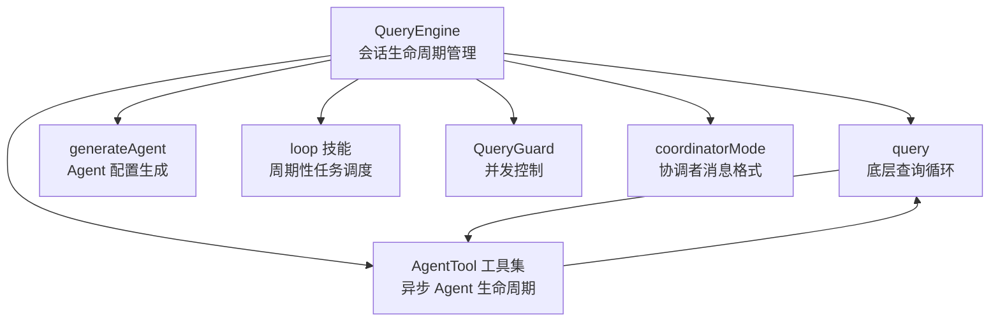
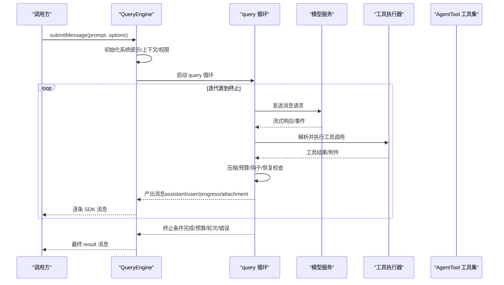
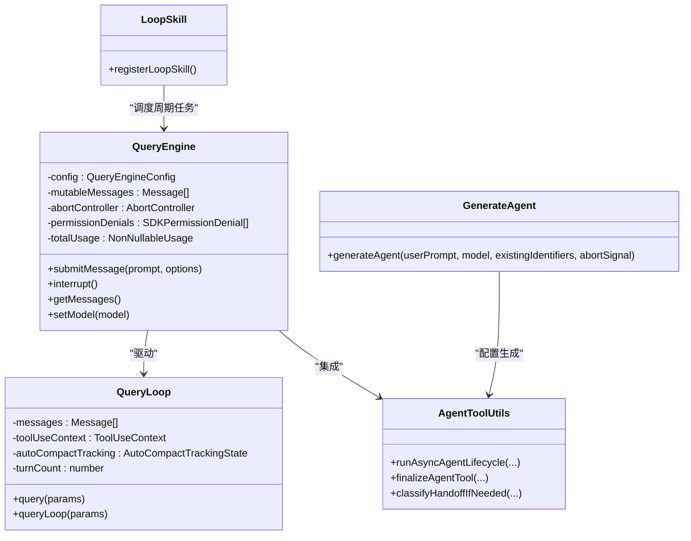
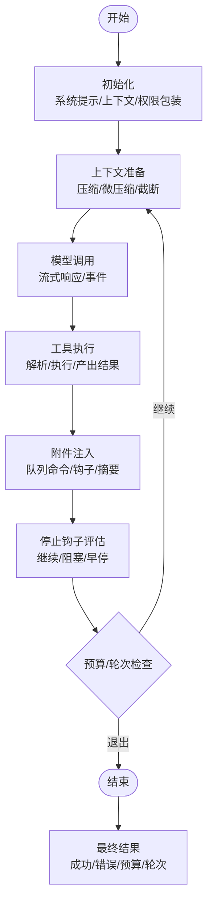

# Agent 循环机制

<cite>
**本文引用的文件**
- [src\QueryEngine.ts](file://src\QueryEngine.ts)
- [src\query.ts](file://src\query.ts)
- [src\tools\AgentTool\agentToolUtils.ts](file://src\tools\AgentTool\agentToolUtils.ts)
- [src\components\agents\generateAgent.ts](file://src\components\agents\generateAgent.ts)
- [src\skills\bundled\loop.ts](file://src\skills\bundled\loop.ts)
- [src\utils\QueryGuard.ts](file://src\utils\QueryGuard.ts)
- [src\coordinator\coordinatorMode.ts](file://src\coordinator\coordinatorMode.ts)
</cite>

## 目录
1. [简介](#简介)
2. [项目结构](#项目结构)
3. [核心组件](#核心组件)
4. [架构总览](#架构总览)
5. [详细组件分析](#详细组件分析)
6. [依赖关系分析](#依赖关系分析)
7. [性能考量](#性能考量)
8. [故障排查指南](#故障排查指南)
9. [结论](#结论)
10. [附录](#附录)

## 简介
本文件系统性阐述 Claude Code 中的 Agent 循环机制，聚焦于查询引擎（QueryEngine）与底层查询循环（query.ts）的协作架构。文档从状态管理、消息流转、工具执行与状态更新等维度，深入解析 Agent 在一次“提交消息”到“结果返回”的完整生命周期；并给出循环退出条件、继续条件、关键状态变量（如 messages、toolUseContext、autoCompactTracking 等）的作用与生命周期，以及循环优化策略与性能监控方法。

## 项目结构
围绕 Agent 循环的关键模块与职责如下：
- QueryEngine：面向 SDK/CLI 的会话级生命周期管理器，负责初始化、上下文准备、模型调用、工具执行、状态更新与结果产出。
- query：底层查询循环，封装自动压缩、工具执行、停止钩子、预算控制、错误恢复等核心逻辑。
- AgentTool 工具集：提供异步/同步 Agent 生命周期驱动、任务进度跟踪、手递手安全校验、结果归档等能力。
- generateAgent：用于生成 Agent 配置（identifier、whenToUse、systemPrompt），支撑 Agent 的自举与扩展。
- loop 技能：提供周期性任务调度的命令式接口，体现 Agent 循环在“重复触发”场景下的应用。
- QueryGuard：并发控制与队列处理器的同步状态机，避免重复执行。
- coordinatorMode：协调者模式下，Agent 间的消息格式与通知规范。

**图表来源**
- [src\QueryEngine.ts:184-207](file://src\QueryEngine.ts#L184-L207)
- [src\query.ts:219-239](file://src\query.ts#L219-L239)
- [src\tools\AgentTool\agentToolUtils.ts:508-686](file://src\tools\AgentTool\agentToolUtils.ts#L508-L686)
- [src\components\agents\generateAgent.ts:122-197](file://src\components\agents\generateAgent.ts#L122-L197)
- [src\skills\bundled\loop.ts:74-92](file://src\skills\bundled\loop.ts#L74-L92)
- [src\utils\QueryGuard.ts:29-83](file://src\utils\QueryGuard.ts#L29-L83)
- [src\coordinator\coordinatorMode.ts:139-172](file://src\coordinator\coordinatorMode.ts#L139-L172)

**章节来源**
- [src\QueryEngine.ts:184-207](file://src\QueryEngine.ts#L184-L207)
- [src\query.ts:219-239](file://src\query.ts#L219-L239)

## 核心组件
- QueryEngine.submitMessage：对外入口，负责构建系统提示、处理用户输入、持久化、初始化工具权限上下文、启动 query 循环并逐条产出消息与最终结果。
- query：内部循环，负责上下文压缩（自动/反应式/微压缩）、模型调用、工具执行、停止钩子、预算控制、错误恢复与继续条件判断。
- AgentTool 工具集：统一管理异步 Agent 的生命周期（spawn → 执行 → 完成/失败/终止 → 通知），支持进度追踪、手递手安全校验与摘要生成。
- generateAgent：基于用户需求生成 Agent 的配置（identifier、whenToUse、systemPrompt），并与内存机制集成。
- loop 技能：将周期性任务调度抽象为命令式提示，体现 Agent 循环在“定时触发”场景的应用。
- QueryGuard：并发控制状态机，防止重复执行与竞态。
- coordinatorMode：定义协调者模式下 Agent 间通信的消息格式与通知规范。

**章节来源**
- [src\QueryEngine.ts:209-1156](file://src\QueryEngine.ts#L209-L1156)
- [src\query.ts:219-1599](file://src\query.ts#L219-L1599)
- [src\tools\AgentTool\agentToolUtils.ts:508-686](file://src\tools\AgentTool\agentToolUtils.ts#L508-L686)
- [src\components\agents\generateAgent.ts:122-197](file://src\components\agents\generateAgent.ts#L122-L197)
- [src\skills\bundled\loop.ts:74-92](file://src\skills\bundled\loop.ts#L74-L92)
- [src\utils\QueryGuard.ts:29-83](file://src\utils\QueryGuard.ts#L29-L83)
- [src\coordinator\coordinatorMode.ts:139-172](file://src\coordinator\coordinatorMode.ts#L139-L172)

## 架构总览
Agent 循环由 QueryEngine 驱动，query 提供核心迭代逻辑。二者通过 ToolUseContext 协同，贯穿消息收集、上下文压缩、模型推理、工具执行、附件注入与停止钩子评估，最终形成可序列化的 SDK 消息流与最终结果。

**图表来源**
- [src\QueryEngine.ts:675-1049](file://src\QueryEngine.ts#L675-L1049)
- [src\query.ts:219-1599](file://src\query.ts#L219-L1599)

## 详细组件分析

### QueryEngine：会话生命周期与消息流
- 初始化与上下文准备
  - 构建系统提示（默认/自定义/附加），合并用户上下文与协调者上下文。
  - 注册结构化输出强制执行钩子（当存在合成输出工具时）。
  - 包装 canUseTool 以记录权限拒绝信息。
- 用户输入处理
  - 调用 processUserInput 处理用户输入与斜杠命令，生成 messages 并决定是否继续查询。
  - 将新消息写入会话转录（可选择 eager flush）。
- 查询循环驱动
  - 通过 query 函数进入主循环，逐条产出消息并持久化。
  - 支持紧凑边界（compact boundary）与历史截断（snip）。
- 结果汇总
  - 计算耗时、用量、成本、权限拒绝统计，产出最终 result 消息。

关键状态与变量
- mutableMessages：会话级可变消息数组，承载当前回合与历史消息。
- totalUsage：累计 API 使用量。
- discoveredSkillNames/loadedNestedMemoryPaths：技能发现与嵌套记忆加载的跨回合状态。
- permissionDenials：权限拒绝列表，用于 SDK 报告。
- abortController：中断控制。

退出与继续条件
- 继续：收到工具使用信号（tool_use）、未达到最大轮次与预算限制、未发生不可恢复错误。
- 退出：达到最大轮次、超出预算、发生不可恢复错误（如 API 错误、无有效文本结果）、结构化输出重试次数超限。

**章节来源**
- [src\QueryEngine.ts:209-1156](file://src\QueryEngine.ts#L209-L1156)

### query：底层查询循环与迭代控制
- 状态管理
  - State 结构体维护 messages、toolUseContext、autoCompactTracking、maxOutputTokensRecoveryCount、hasAttemptedReactiveCompact、maxOutputTokensOverride、pendingToolUseSummary、stopHookActive、turnCount、transition 等。
- 上下文压缩
  - 自动压缩（autocompact）、微压缩（microcompact）、反应式压缩（reactive compact）、历史截断（snip）按需组合执行。
  - 压缩后产出边界消息，更新 tracking 与 taskBudgetRemaining。
- 模型调用与流式处理
  - 预处理消息（附加用户上下文、拼接系统提示），调用模型服务，流式产出事件与消息。
  - 对于高负载/媒体过大/输出令牌上限等可恢复错误进行延迟显示与恢复尝试。
- 工具执行
  - 解析 tool_use 块，串行或流式执行工具，产出 user/attachment 消息。
  - 支持 StreamingToolExecutor 以提升工具执行体验。
- 停止钩子与预算控制
  - 在合适时机评估停止钩子，必要时注入阻塞错误或继续提示。
  - 基于令牌预算进行“继续/早停”决策。
- 错误恢复与回退
  - prompt too long、media error、max output tokens 等错误支持多阶段恢复路径。
  - 模型回退（fallback model）时清理孤儿消息并重新执行。

关键状态与变量
- autoCompactTracking：自动压缩跟踪状态，影响压缩阈值与计数。
- toolUseBlocks：本轮解析到的工具调用块集合，作为继续条件的信号。
- needsFollowUp：是否需要后续工具执行与附件处理。
- assistantMessages/toolResults：模型响应与工具结果的暂存，用于后续处理与恢复。

退出与继续条件
- 继续：解析到 tool_use、未达最大轮次、预算允许、未发生不可恢复错误。
- 退出：无 tool_use、满足停止钩子阻止条件、达到预算上限、达到最大轮次、发生不可恢复错误。

**章节来源**
- [src\query.ts:204-217](file://src\query.ts#L204-L217)
- [src\query.ts:241-1599](file://src\query.ts#L241-L1599)

### AgentTool 工具集：异步 Agent 生命周期
- 生命周期驱动
  - runAsyncAgentLifecycle：统一处理异步 Agent 的生成、执行、完成/失败/终止与通知。
  - finalizeAgentTool：提取最终文本内容、统计 token 数、工具使用次数与用量。
- 进度与通知
  - createProgressTracker/updateAsyncAgentProgress：实时更新任务进度。
  - enqueueAgentNotification：向 UI 发出完成/失败/终止通知。
- 安全与手递手
  - classifyHandoffIfNeeded：在自动模式下对子 Agent 输出进行安全分类与警告。
- 部分结果提取
  - extractPartialResult：在被中断时保留已完成的工作片段。

**章节来源**
- [src\tools\AgentTool\agentToolUtils.ts:508-686](file://src\tools\AgentTool\agentToolUtils.ts#L508-L686)

### generateAgent：Agent 配置生成
- 输入：用户请求、现有标识符列表、模型名称、中止信号。
- 输出：identifier、whenToUse、systemPrompt 的 JSON 对象。
- 特性：可选集成 Agent 内存指令，便于跨对话积累知识。

**章节来源**
- [src\components\agents\generateAgent.ts:122-197](file://src\components\agents\generateAgent.ts#L122-L197)

### loop 技能：周期性任务调度
- 功能：解析输入为“间隔 + 提示”，通过计划任务工具创建周期性任务，并立即执行一次。
- 规则：支持多种时间表达式与默认间隔，自动四舍五入到最近的清洁间隔并提示用户。

**章节来源**
- [src\skills\bundled\loop.ts:74-92](file://src\skills\bundled\loop.ts#L74-L92)

### QueryGuard：并发控制
- 状态机：idle → dispatching → running，防止重复执行与竞态。
- 作用：在 REPL/队列处理器中保护 query 的单实例运行。

**章节来源**
- [src\utils\QueryGuard.ts:29-83](file://src\utils\QueryGuard.ts#L29-L83)

### 协调者模式：消息格式与通知
- 定义：worker 完成结果以特定 XML 格式的 task-notification 用户消息形式返回，协调者据此继续后续工作。
- 用途：在多 Agent 场景中，确保结果可见且可继续。

**章节来源**
- [src\coordinator\coordinatorMode.ts:139-172](file://src\coordinator\coordinatorMode.ts#L139-L172)

## 依赖关系分析

**图表来源**
- [src\QueryEngine.ts:184-207](file://src\QueryEngine.ts#L184-L207)
- [src\query.ts:219-239](file://src\query.ts#L219-L239)
- [src\tools\AgentTool\agentToolUtils.ts:508-686](file://src\tools\AgentTool\agentToolUtils.ts#L508-L686)
- [src\components\agents\generateAgent.ts:122-197](file://src\components\agents\generateAgent.ts#L122-L197)
- [src\skills\bundled\loop.ts:74-92](file://src\skills\bundled\loop.ts#L74-L92)

**章节来源**
- [src\QueryEngine.ts:184-207](file://src\QueryEngine.ts#L184-L207)
- [src\query.ts:219-239](file://src\query.ts#L219-L239)

## 性能考量
- 压缩策略
  - 自动压缩（autocompact）与微压缩（microcompact）降低上下文长度，减少 API 成本与延迟。
  - 反应式压缩（reactive compact）在 413/媒体过大等情况下进行快速摘要。
  - 历史截断（snip）在长会话中按边界回收内存。
- 工具执行优化
  - StreamingToolExecutor 在工具执行期间持续产出中间结果，改善感知延迟。
  - 工具结果大小预算（applyToolResultBudget）限制聚合体积，避免过载。
- 预算与早停
  - 令牌预算（token budget）在循环中动态评估，支持“继续/早停”决策，平衡质量与成本。
- 模型回退
  - 当高需求导致流式回退时，自动切换到备用模型并清理孤儿消息，保证一致性。
- 并发控制
  - QueryGuard 防止重复执行，避免资源争用与竞态。

[本节为通用性能建议，不直接分析具体文件]

## 故障排查指南
- 常见错误类型与定位
  - prompt too long：通过反应式压缩或上下文折叠恢复；若仍失败，停止钩子会阻止继续。
  - media error（图片/PDF/多图）：通过反应式压缩剥离媒体后重试。
  - max output tokens：支持分级恢复（元消息提示/扩大输出令牌上限/多轮恢复）。
  - API 错误：查询循环会产出合成的 API 错误消息，避免误导性的“请求中断”。
- 诊断信息
  - isResultSuccessful 判定失败时，QueryEngine 会附加诊断前缀与内存错误水印，帮助定位问题。
  - 错误日志按轮次隔离（watermark），避免污染全局日志缓冲。
- 中断与回退
  - 用户中断：生成中断消息，必要时补充工具结果以保持配对完整性。
  - 模型回退：清理孤儿消息并重新执行，同时发出系统提示。

**章节来源**
- [src\QueryEngine.ts:1082-1118](file://src\QueryEngine.ts#L1082-L1118)
- [src\query.ts:893-953](file://src\query.ts#L893-L953)
- [src\query.ts:1062-1083](file://src\query.ts#L1062-L1083)

## 结论
Agent 循环机制通过 QueryEngine 与 query 的协同，实现了从“用户输入”到“工具执行”再到“结果产出”的闭环。其关键在于：
- 明确的状态管理与消息流转（messages、toolUseContext、autoCompactTracking 等）；
- 强大的上下文压缩与错误恢复策略；
- 严格的退出/继续条件与并发控制；
- 可扩展的 Agent 生命周期与安全校验。

该机制既适用于一次性任务，也适用于周期性与多 Agent 场景，具备良好的可维护性与可观测性。

[本节为总结性内容，不直接分析具体文件]

## 附录

### Agent 循环阶段与关键状态变量

**图表来源**
- [src\QueryEngine.ts:675-1049](file://src\QueryEngine.ts#L675-L1049)
- [src\query.ts:241-1599](file://src\query.ts#L241-L1599)

### 关键状态变量说明
- messages：当前回合与历史消息的累积容器，贯穿整个循环。
- toolUseContext：工具执行所需的上下文（工具池、选项、代理信息、权限、中止信号等）。
- autoCompactTracking：自动压缩跟踪状态，影响压缩阈值与计数。
- currentMessageUsage/totalUsage：当前消息用量与累计用量，用于成本与预算控制。
- turnCount：回合计数，用于最大轮次限制与中断后的轮次计算。
- lastStopReason：上一个助手消息的停止原因，用于最终结果与诊断。
- discoveredSkillNames/loadedNestedMemoryPaths：技能发现与嵌套记忆加载的跨回合状态。
- permissionDenials：权限拒绝列表，用于 SDK 报告。

**章节来源**
- [src\QueryEngine.ts:657-674](file://src\QueryEngine.ts#L657-L674)
- [src\query.ts:204-217](file://src\query.ts#L204-L217)