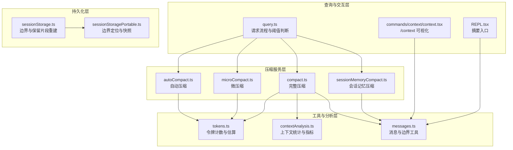
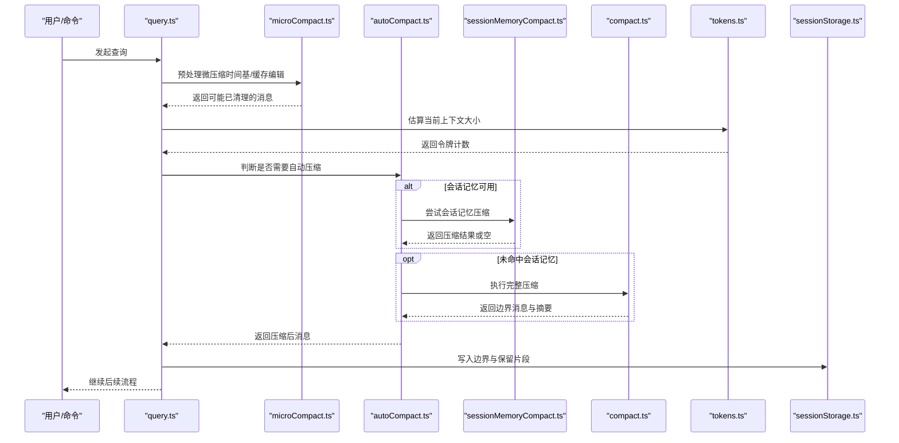
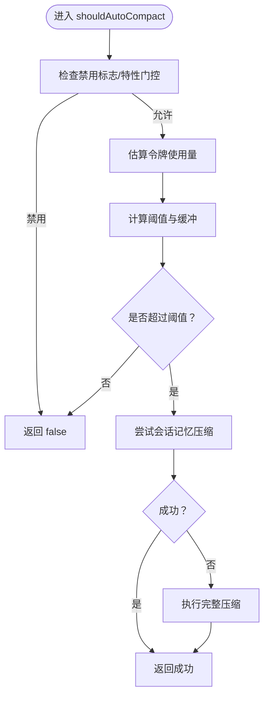
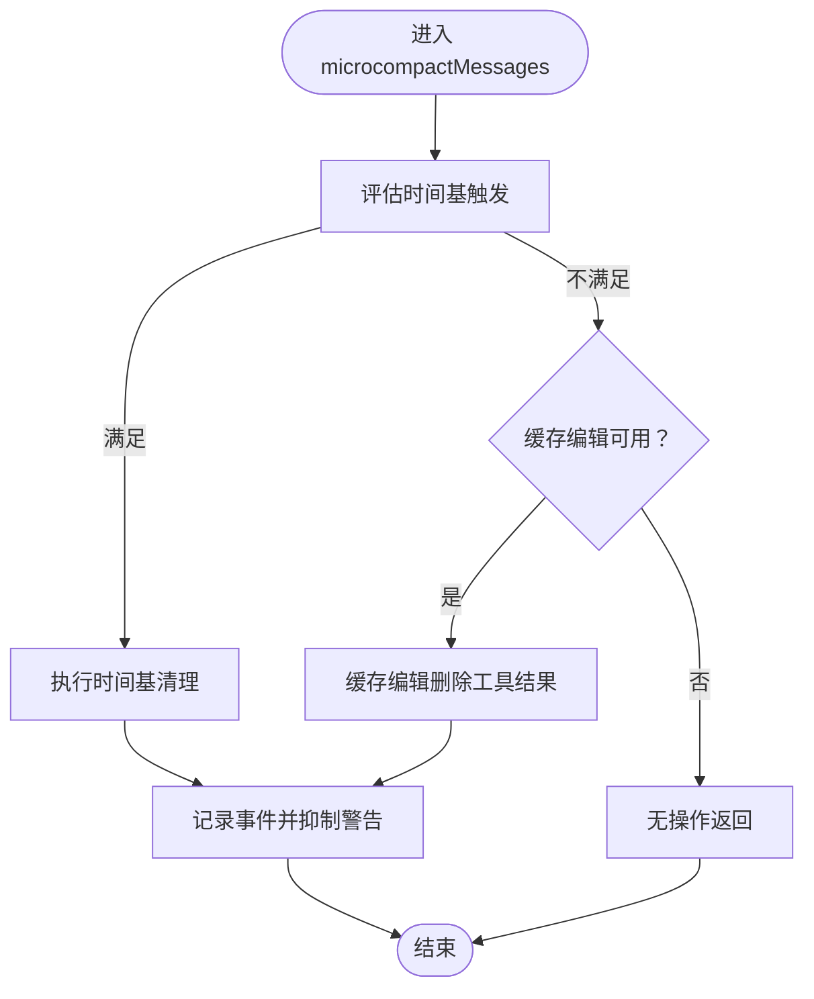
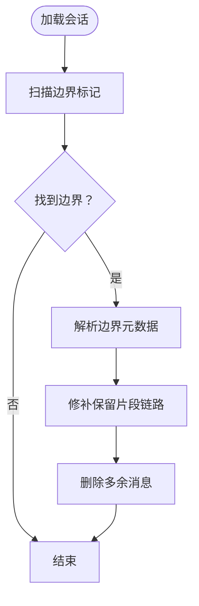
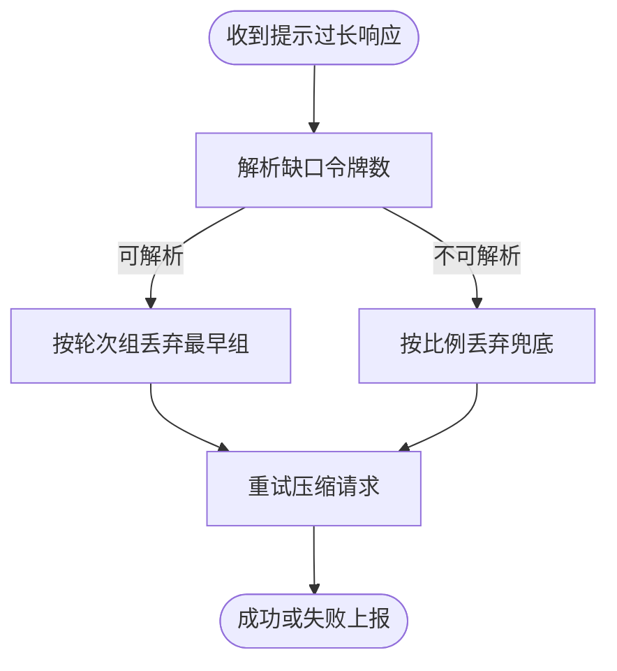
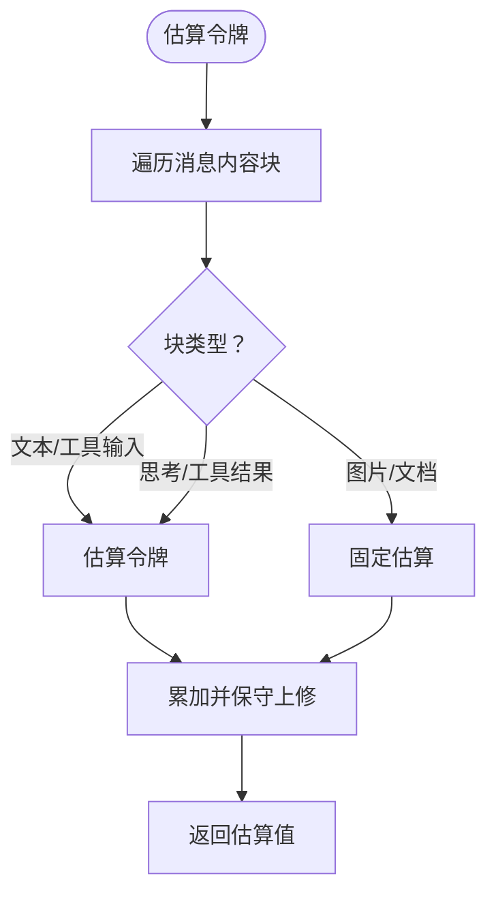
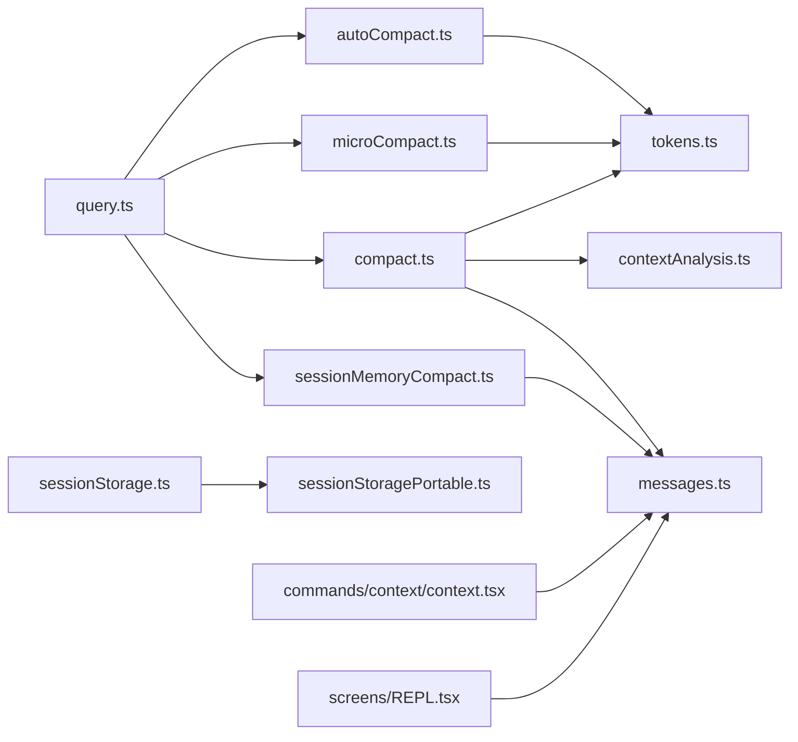

# 上下文管理系统

<cite>
**本文引用的文件**
- [src/services/compact/microCompact.ts](file://src/services/compact/microCompact.ts)
- [src/services/compact/autoCompact.ts](file://src/services/compact/autoCompact.ts)
- [src/services/compact/compact.ts](file://src/services/compact/compact.ts)
- [src/services/compact/sessionMemoryCompact.ts](file://src/services/compact/sessionMemoryCompact.ts)
- [src/utils/tokens.ts](file://src/utils/tokens.ts)
- [src/utils/contextAnalysis.ts](file://src/utils/contextAnalysis.ts)
- [src/utils/messages.ts](file://src/utils/messages.ts)
- [src/utils/sessionStorage.ts](file://src/utils/sessionStorage.ts)
- [src/utils/sessionStoragePortable.ts](file://src/utils/sessionStoragePortable.ts)
- [src/commands/context/context.tsx](file://src/commands/context/context.tsx)
- [src/screens/REPL.tsx](file://src/screens/REPL.tsx)
- [src/query.ts](file://src/query.ts)
</cite>

## 目录
1. [简介](#简介)
2. [项目结构](#项目结构)
3. [核心组件](#核心组件)
4. [架构总览](#架构总览)
5. [详细组件分析](#详细组件分析)
6. [依赖关系分析](#依赖关系分析)
7. [性能考量](#性能考量)
8. [故障排查指南](#故障排查指南)
9. [结论](#结论)
10. [附录](#附录)

## 简介
本技术文档系统性解析 Claude Code 的上下文管理系统，聚焦以下关键能力：
- 自动压缩（Auto-Compact）：基于令牌预算与阈值的主动压缩，防止上下文溢出。
- 微压缩（Micro-Compact）：针对工具结果的轻量级清理与缓存编辑，减少冗余内容。
- 历史截断（History Truncate）：通过“边界消息”与“保留片段”实现可恢复的历史修剪。
- 反应式压缩（Reactive-Compact）：在 API 报错或特定条件下进行的即时压缩。

文档将深入解释各机制的工作原理、触发条件、效果评估、令牌计算、阈值判断与失败重试策略，并提供在不同场景下的策略选择建议与最佳实践。

## 项目结构
上下文管理涉及服务层（压缩与微压缩）、工具层（令牌统计与上下文分析）、持久化层（会话存储与边界标记），以及命令与界面层（/context 可视化、REPL 摘要入口）。

**图表来源**
- [src/query.ts:415-440](file://src/query.ts#L415-L440)
- [src/services/compact/autoCompact.ts:160-239](file://src/services/compact/autoCompact.ts#L160-L239)
- [src/services/compact/microCompact.ts:253-293](file://src/services/compact/microCompact.ts#L253-L293)
- [src/services/compact/compact.ts:387-763](file://src/services/compact/compact.ts#L387-L763)
- [src/services/compact/sessionMemoryCompact.ts:514-631](file://src/services/compact/sessionMemoryCompact.ts#L514-L631)
- [src/utils/tokens.ts:226-262](file://src/utils/tokens.ts#L226-L262)
- [src/utils/contextAnalysis.ts:27-97](file://src/utils/contextAnalysis.ts#L27-L97)
- [src/utils/messages.ts:1-120](file://src/utils/messages.ts#L1-L120)
- [src/utils/sessionStorage.ts:1839-2000](file://src/utils/sessionStorage.ts#L1839-L2000)
- [src/utils/sessionStoragePortable.ts:472-493](file://src/utils/sessionStoragePortable.ts#L472-L493)
- [src/commands/context/context.tsx:12-27](file://src/commands/context/context.tsx#L12-L27)
- [src/screens/REPL.tsx:4918-4933](file://src/screens/REPL.tsx#L4918-L4933)

**章节来源**
- [src/query.ts:415-440](file://src/query.ts#L415-L440)
- [src/services/compact/autoCompact.ts:160-239](file://src/services/compact/autoCompact.ts#L160-L239)
- [src/services/compact/microCompact.ts:253-293](file://src/services/compact/microCompact.ts#L253-L293)
- [src/services/compact/compact.ts:387-763](file://src/services/compact/compact.ts#L387-L763)
- [src/services/compact/sessionMemoryCompact.ts:514-631](file://src/services/compact/sessionMemoryCompact.ts#L514-L631)
- [src/utils/tokens.ts:226-262](file://src/utils/tokens.ts#L226-L262)
- [src/utils/contextAnalysis.ts:27-97](file://src/utils/contextAnalysis.ts#L27-L97)
- [src/utils/messages.ts:1-120](file://src/utils/messages.ts#L1-L120)
- [src/utils/sessionStorage.ts:1839-2000](file://src/utils/sessionStorage.ts#L1839-L2000)
- [src/utils/sessionStoragePortable.ts:472-493](file://src/utils/sessionStoragePortable.ts#L472-L493)
- [src/commands/context/context.tsx:12-27](file://src/commands/context/context.tsx#L12-L27)
- [src/screens/REPL.tsx:4918-4933](file://src/screens/REPL.tsx#L4918-L4933)

## 核心组件
- 自动压缩（Auto-Compact）
  - 基于模型上下文窗口与输出预留，动态计算阈值并决定是否触发压缩。
  - 支持会话记忆优先压缩路径与传统压缩回退，具备电路保护避免无效重试。
- 微压缩（Micro-Compact）
  - 针对可压缩工具结果进行清理或缓存编辑，支持时间基触发与缓存编辑模式。
  - 提供令牌估算与事件记录，抑制重复警告并通知缓存破坏检测。
- 历史截断（History Truncate）
  - 通过“紧凑边界消息”与“保留片段元数据”实现可恢复的历史修剪。
  - 加载时根据边界信息重建保留段链路，确保摘要前后的历史一致性。
- 反应式压缩（Reactive-Compact）
  - 在 API 返回提示过长等错误时，按轮次组进行尾部截断以解封用户。
  - 与自动压缩协同，避免在上下文压力过大时互相竞争。

**章节来源**
- [src/services/compact/autoCompact.ts:32-91](file://src/services/compact/autoCompact.ts#L32-L91)
- [src/services/compact/microCompact.ts:253-293](file://src/services/compact/microCompact.ts#L253-L293)
- [src/services/compact/compact.ts:230-291](file://src/services/compact/compact.ts#L230-L291)
- [src/utils/sessionStorage.ts:1839-2000](file://src/utils/sessionStorage.ts#L1839-L2000)

## 架构总览
上下文管理贯穿“请求前预处理（微压缩/时间基清理）→ 主流程（令牌估算与阈值判断）→ 压缩执行（自动/会话记忆/完整）→ 边界与保留片段写入/加载”的闭环。

**图表来源**
- [src/query.ts:415-440](file://src/query.ts#L415-L440)
- [src/services/compact/microCompact.ts:253-293](file://src/services/compact/microCompact.ts#L253-L293)
- [src/services/compact/autoCompact.ts:241-351](file://src/services/compact/autoCompact.ts#L241-L351)
- [src/services/compact/sessionMemoryCompact.ts:514-631](file://src/services/compact/sessionMemoryCompact.ts#L514-L631)
- [src/services/compact/compact.ts:387-763](file://src/services/compact/compact.ts#L387-L763)
- [src/utils/tokens.ts:226-262](file://src/utils/tokens.ts#L226-L262)
- [src/utils/sessionStorage.ts:1839-2000](file://src/utils/sessionStorage.ts#L1839-L2000)

## 详细组件分析

### 自动压缩（Auto-Compact）
- 工作原理
  - 计算有效上下文窗口：模型上下文窗口减去最大输出预留。
  - 动态阈值：有效窗口减去缓冲区，支持环境变量覆盖与测试覆盖。
  - 触发条件：当前令牌使用超过阈值；受环境开关、用户设置与特性门控限制。
  - 路径选择：优先尝试会话记忆压缩，失败则执行完整压缩；具备电路保护避免连续失败。
- 关键参数与阈值
  - 缓冲区：自动压缩缓冲、警告阈值缓冲、错误阈值缓冲、手动压缩缓冲。
  - 最大连续失败次数：超过阈值后停止重试，避免无效 API 调用。
- 失败重试策略
  - 电路保护：累计失败次数达到上限即跳过后续尝试。
  - 通知缓存破坏检测：压缩后重置基线，避免误报。
- 效果评估
  - 事件指标：预压缩令牌、压缩后令牌、是否再次触发、查询来源、链路深度等。
  - 后处理钩子：压缩后执行钩子，确保会话状态一致。

**图表来源**
- [src/services/compact/autoCompact.ts:160-239](file://src/services/compact/autoCompact.ts#L160-L239)
- [src/services/compact/autoCompact.ts:241-351](file://src/services/compact/autoCompact.ts#L241-L351)

**章节来源**
- [src/services/compact/autoCompact.ts:32-91](file://src/services/compact/autoCompact.ts#L32-L91)
- [src/services/compact/autoCompact.ts:147-158](file://src/services/compact/autoCompact.ts#L147-L158)
- [src/services/compact/autoCompact.ts:160-239](file://src/services/compact/autoCompact.ts#L160-L239)
- [src/services/compact/autoCompact.ts:241-351](file://src/services/compact/autoCompact.ts#L241-L351)

### 微压缩（Micro-Compact）
- 工作原理
  - 时间基触发：当自上次助手消息以来的时间间隔超过阈值，清理除最近若干条以外的可压缩工具结果。
  - 缓存编辑模式：在主循环源且模型支持时，通过缓存编辑 API 删除工具结果而不重写前缀，减少传输与缓存失效。
- 触发条件
  - 查询来源必须为主循环主线程；时间基清理要求存在最近助手消息且间隔超过阈值。
  - 缓存编辑模式要求特性开启、模型支持、查询来源匹配。
- 效果评估
  - 事件记录：清理数量、保留数量、节省令牌、间隔与阈值。
  - 警告抑制：成功后抑制重复警告；缓存破坏检测通知。
- 失败与回退
  - 时间基清理直接修改消息内容；缓存编辑不修改本地消息，仅在 API 层添加缓存编辑块。

**图表来源**
- [src/services/compact/microCompact.ts:253-293](file://src/services/compact/microCompact.ts#L253-L293)
- [src/services/compact/microCompact.ts:422-444](file://src/services/compact/microCompact.ts#L422-L444)
- [src/services/compact/microCompact.ts:446-531](file://src/services/compact/microCompact.ts#L446-L531)

**章节来源**
- [src/services/compact/microCompact.ts:253-293](file://src/services/compact/microCompact.ts#L253-L293)
- [src/services/compact/microCompact.ts:422-444](file://src/services/compact/microCompact.ts#L422-L444)
- [src/services/compact/microCompact.ts:446-531](file://src/services/compact/microCompact.ts#L446-L531)

### 历史截断（History Truncate）与边界消息
- 边界消息
  - 在压缩后插入“紧凑边界消息”，记录预压缩令牌、最后消息 UUID、发现的工具等元数据。
  - 保留片段元数据：记录保留段头/锚点/尾的 UUID，用于加载时重建链路。
- 保留片段重建
  - 加载时扫描边界标记，识别保留片段；通过映射表修补 head→anchor 与 anchor 子节点→tail。
  - 支持多边界形状，仅对最后一个边界进行重连，保证历史完整性。
- 快照与边界定位
  - 使用边界标记字节序列定位边界行，确认真实边界而非内容内嵌。
  - 对于大文件场景，采用分块读取与阈值跳过预过滤，平衡 I/O 与内存增长。

**图表来源**
- [src/utils/sessionStorage.ts:1839-2000](file://src/utils/sessionStorage.ts#L1839-L2000)
- [src/utils/sessionStoragePortable.ts:472-493](file://src/utils/sessionStoragePortable.ts#L472-L493)

**章节来源**
- [src/services/compact/compact.ts:349-367](file://src/services/compact/compact.ts#L349-L367)
- [src/utils/sessionStorage.ts:1839-2000](file://src/utils/sessionStorage.ts#L1839-L2000)
- [src/utils/sessionStoragePortable.ts:472-493](file://src/utils/sessionStoragePortable.ts#L472-L493)

### 反应式压缩（Reactive-Compact）
- 工作原理
  - 当压缩请求本身触发提示过长错误时，按轮次组从最早轮次开始丢弃，直到覆盖缺口。
  - 若无法解析缺口，则按比例丢弃（兜底）。
- 与自动压缩的关系
  - 自动压缩抑制条件：在上下文折叠启用或仅响应式模式下，自动压缩被抑制以避免与折叠/响应式竞争。
  - 响应式作为自动压缩的兜底路径，确保用户不会因提示过长而卡死。

**图表来源**
- [src/services/compact/compact.ts:243-291](file://src/services/compact/compact.ts#L243-L291)

**章节来源**
- [src/services/compact/compact.ts:243-291](file://src/services/compact/compact.ts#L243-L291)

### 令牌计算、阈值判断与预算
- 令牌估算
  - 使用近似估算函数对消息内容进行令牌估算，考虑文本、工具调用输入、图片/文档等不同块类型。
  - 对于并行工具调用产生的拆分记录，回溯到同一响应的首个兄弟记录，避免低估。
- 阈值判断
  - 自动压缩阈值：有效上下文窗口减去缓冲区；支持环境变量覆盖。
  - 警告/错误阈值：在阈值基础上进一步扣除缓冲，用于 UI 与日志提示。
- 预算与预算决策
  - 令牌预算解析与位置标注，支持简短与详细两种表达形式。
  - 预算跟踪器：记录连续次数、增量令牌、全局回合令牌与启动时间，用于决定是否继续或停止。

**图表来源**
- [src/services/compact/microCompact.ts:164-205](file://src/services/compact/microCompact.ts#L164-L205)
- [src/utils/tokens.ts:226-262](file://src/utils/tokens.ts#L226-L262)

**章节来源**
- [src/services/compact/microCompact.ts:164-205](file://src/services/compact/microCompact.ts#L164-L205)
- [src/utils/tokens.ts:226-262](file://src/utils/tokens.ts#L226-L262)
- [src/utils/tokenBudget.ts:21-73](file://src/utils/tokenBudget.ts#L21-L73)
- [src/query/tokenBudget.ts:45-56](file://src/query/tokenBudget.ts#L45-L56)

### 摘要生成与历史恢复机制
- 摘要生成
  - 压缩前执行预压缩钩子，压缩后执行会话开始钩子与后压缩钩子，确保上下文与权限状态一致。
  - 图像与文档块在压缩前被剥离或替换为占位符，避免压缩请求本身触发提示过长。
- 历史恢复
  - 通过边界消息与保留片段元数据，在加载时重建保留段链路，保证摘要前后历史的可恢复性。
  - 对于多边界场景，仅对最后一个边界进行重连，避免中间片段被误删。

**章节来源**
- [src/services/compact/compact.ts:411-424](file://src/services/compact/compact.ts#L411-L424)
- [src/services/compact/compact.ts:596-624](file://src/services/compact/compact.ts#L596-L624)
- [src/services/compact/compact.ts:719-730](file://src/services/compact/compact.ts#L719-L730)
- [src/utils/sessionStorage.ts:1839-2000](file://src/utils/sessionStorage.ts#L1839-L2000)

### 场景化策略选择与最佳实践
- 自动压缩优先
  - 在上下文接近阈值时主动触发，优先尝试会话记忆压缩；失败再走完整压缩。
  - 避免在上下文折叠或仅响应式模式下触发，以免与折叠/响应式竞争。
- 微压缩配合
  - 时间基清理适合长时间无交互后的会话，快速释放工具结果占用。
  - 缓存编辑模式在主循环源且模型支持时优先，减少前缀重写与缓存失效。
- 历史截断与摘要
  - 保留片段确保摘要前后历史可恢复；多边界场景下注意最后一个边界的重连。
  - 压缩请求本身提示过长时，采用轮次组丢弃策略解封。
- 性能与稳定性
  - 电路保护避免无效重试；预算与阈值结合使用，提升稳定性。
  - 事件指标与上下文分析帮助定位重复读取、工具使用占比等热点。

**章节来源**
- [src/services/compact/autoCompact.ts:147-158](file://src/services/compact/autoCompact.ts#L147-L158)
- [src/services/compact/microCompact.ts:276-292](file://src/services/compact/microCompact.ts#L276-L292)
- [src/services/compact/compact.ts:243-291](file://src/services/compact/compact.ts#L243-L291)
- [src/utils/contextAnalysis.ts:195-272](file://src/utils/contextAnalysis.ts#L195-L272)

## 依赖关系分析

**图表来源**
- [src/query.ts:415-440](file://src/query.ts#L415-L440)
- [src/services/compact/autoCompact.ts:1-26](file://src/services/compact/autoCompact.ts#L1-L26)
- [src/services/compact/microCompact.ts:1-31](file://src/services/compact/microCompact.ts#L1-L31)
- [src/services/compact/compact.ts:1-82](file://src/services/compact/compact.ts#L1-L82)
- [src/services/compact/sessionMemoryCompact.ts:1-42](file://src/services/compact/sessionMemoryCompact.ts#L1-L42)
- [src/utils/tokens.ts:1-6](file://src/utils/tokens.ts#L1-L6)
- [src/utils/contextAnalysis.ts:1-13](file://src/utils/contextAnalysis.ts#L1-L13)
- [src/utils/messages.ts:1-87](file://src/utils/messages.ts#L1-L87)
- [src/utils/sessionStorage.ts:1-82](file://src/utils/sessionStorage.ts#L1-L82)
- [src/utils/sessionStoragePortable.ts:472-493](file://src/utils/sessionStoragePortable.ts#L472-L493)
- [src/commands/context/context.tsx:1-11](file://src/commands/context/context.tsx#L1-L11)
- [src/screens/REPL.tsx:4918-4933](file://src/screens/REPL.tsx#L4918-L4933)

**章节来源**
- [src/query.ts:415-440](file://src/query.ts#L415-L440)
- [src/services/compact/autoCompact.ts:1-26](file://src/services/compact/autoCompact.ts#L1-L26)
- [src/services/compact/microCompact.ts:1-31](file://src/services/compact/microCompact.ts#L1-L31)
- [src/services/compact/compact.ts:1-82](file://src/services/compact/compact.ts#L1-L82)
- [src/services/compact/sessionMemoryCompact.ts:1-42](file://src/services/compact/sessionMemoryCompact.ts#L1-L42)
- [src/utils/tokens.ts:1-6](file://src/utils/tokens.ts#L1-L6)
- [src/utils/contextAnalysis.ts:1-13](file://src/utils/contextAnalysis.ts#L1-L13)
- [src/utils/messages.ts:1-87](file://src/utils/messages.ts#L1-L87)
- [src/utils/sessionStorage.ts:1-82](file://src/utils/sessionStorage.ts#L1-L82)
- [src/utils/sessionStoragePortable.ts:472-493](file://src/utils/sessionStoragePortable.ts#L472-L493)
- [src/commands/context/context.tsx:1-11](file://src/commands/context/context.tsx#L1-L11)
- [src/screens/REPL.tsx:4918-4933](file://src/screens/REPL.tsx#L4918-L4933)

## 性能考量
- 令牌估算与近似
  - 通过块级估算与保守上修降低高估风险；并行工具调用场景需回溯至同一响应首条记录，避免低估。
- 压缩路径选择
  - 会话记忆压缩优先，减少 API 调用与缓存开销；失败再走完整压缩。
  - 自动压缩具备电路保护，避免无效重试导致的 API 负载。
- I/O 与内存
  - 大文件场景采用分块读取与阈值跳过，平衡 I/O 与内存增长。
  - 保留片段重建仅对最后一个边界重连，避免中间片段误删。

[本节为通用指导，无需具体文件分析]

## 故障排查指南
- 提示过长（Prompt Too Long）
  - 完整压缩：采用轮次组丢弃策略，若仍失败则上报原因与尝试次数。
  - 反应式压缩：在压缩请求本身触发提示过长时，按缺口或比例丢弃早期轮次。
- 缓存破坏检测
  - 微压缩与自动压缩后通知缓存破坏检测，避免误报；必要时重置基线。
- 事件与日志
  - 事件指标涵盖预压缩令牌、压缩后令牌、是否再次触发、查询来源等，便于定位问题。
  - 日志中包含警告阈值、错误阈值与阻断限制，辅助诊断。

**章节来源**
- [src/services/compact/compact.ts:470-478](file://src/services/compact/compact.ts#L470-L478)
- [src/services/compact/compact.ts:489-491](file://src/services/compact/compact.ts#L489-L491)
- [src/services/compact/microCompact.ts:362-367](file://src/services/compact/microCompact.ts#L362-L367)
- [src/services/compact/autoCompact.ts:299-304](file://src/services/compact/autoCompact.ts#L299-L304)

## 结论
Claude Code 的上下文管理系统通过“自动压缩 + 微压缩 + 历史截断 + 反应式压缩”的组合，实现了在不同场景下的高效、可恢复与稳定的上下文管理。其核心在于：
- 精准的令牌估算与阈值判断；
- 多路径压缩策略与电路保护；
- 边界消息与保留片段的可恢复设计；
- 事件与日志的可观测性与诊断能力。

在实际使用中，建议优先启用自动压缩与会话记忆压缩，配合微压缩的时间基清理与缓存编辑模式，以获得最佳的性能与稳定性。

[本节为总结，无需具体文件分析]

## 附录
- /context 可视化
  - 在渲染前应用与查询相同的上下文变换，确保用户看到的“模型实际看到的内容”与 REPL 历史一致。
- 摘要入口
  - REPL 中可对选中消息发起摘要，先投影被裁剪消息，再构建工具使用上下文与应用状态。

**章节来源**
- [src/commands/context/context.tsx:12-27](file://src/commands/context/context.tsx#L12-L27)
- [src/screens/REPL.tsx:4918-4933](file://src/screens/REPL.tsx#L4918-L4933)