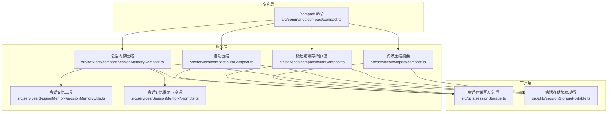
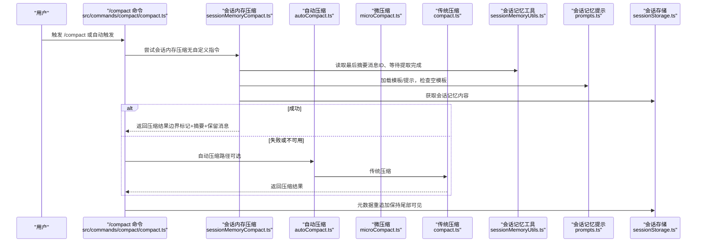
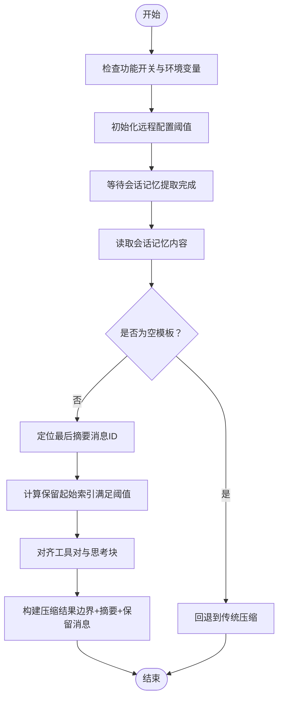
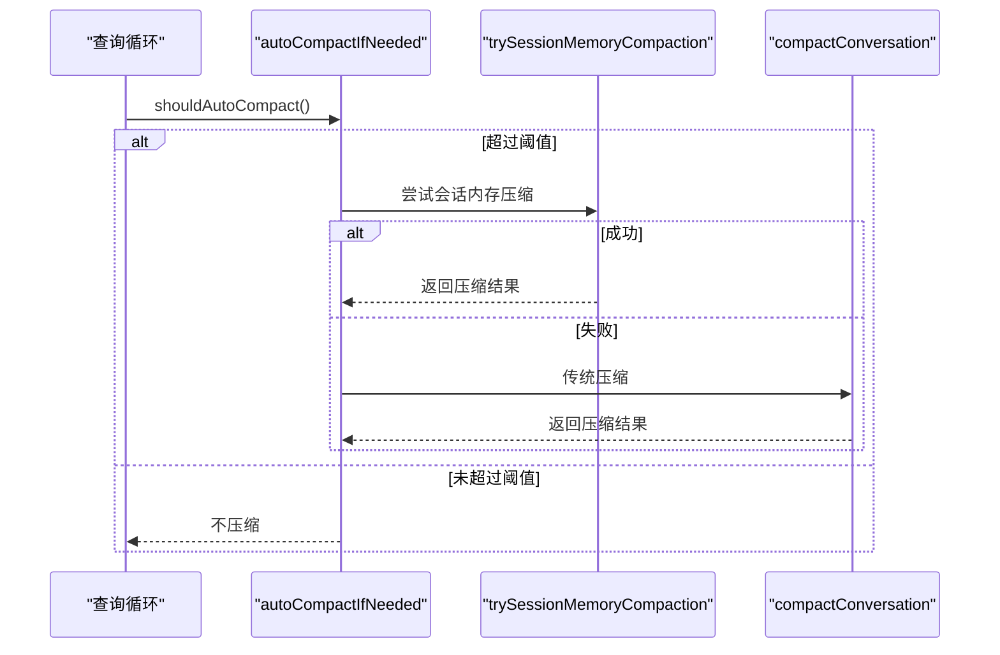
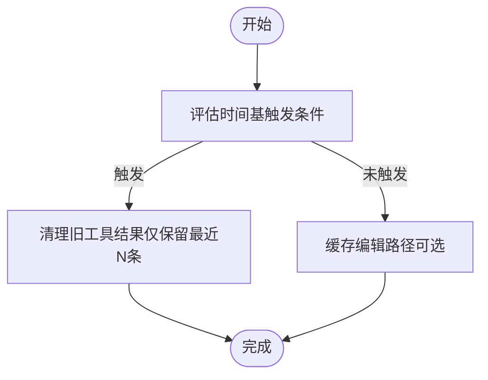
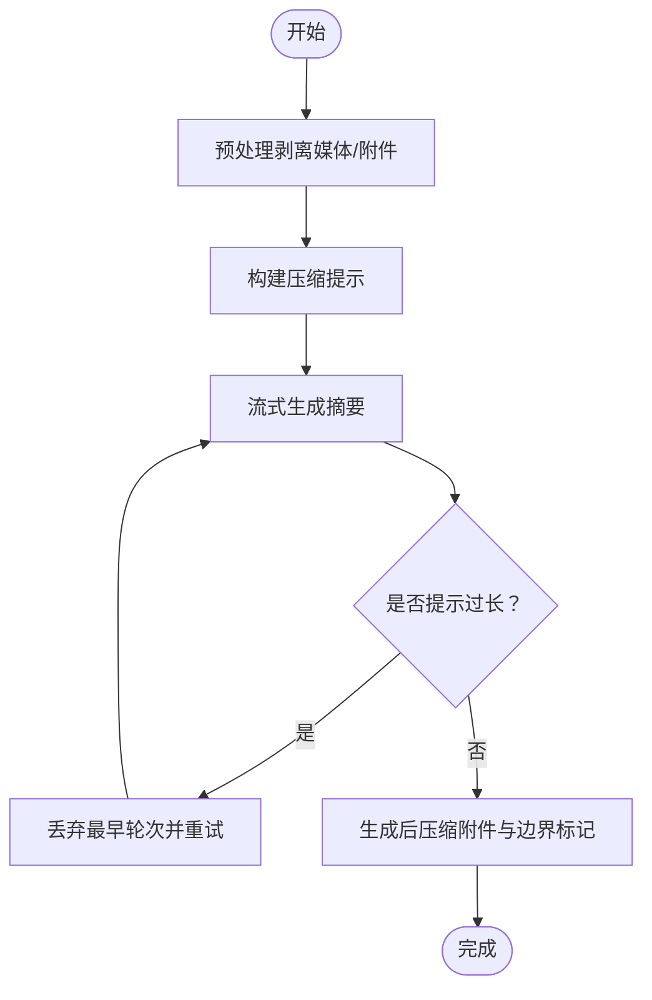
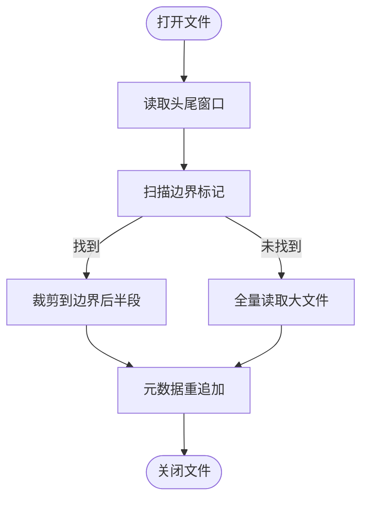
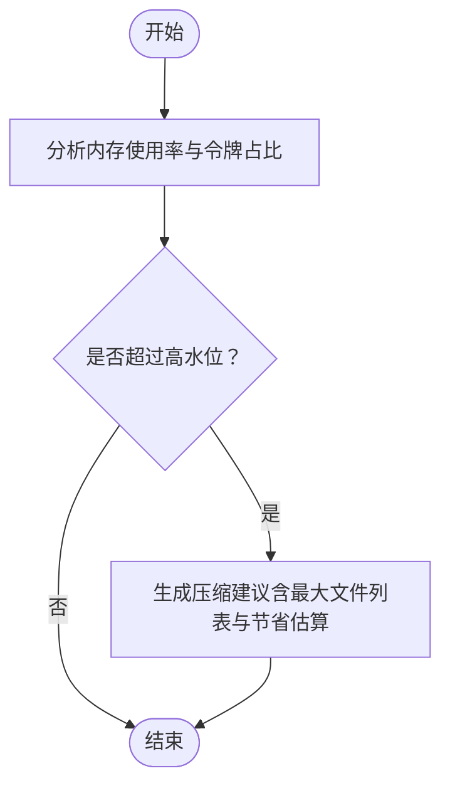
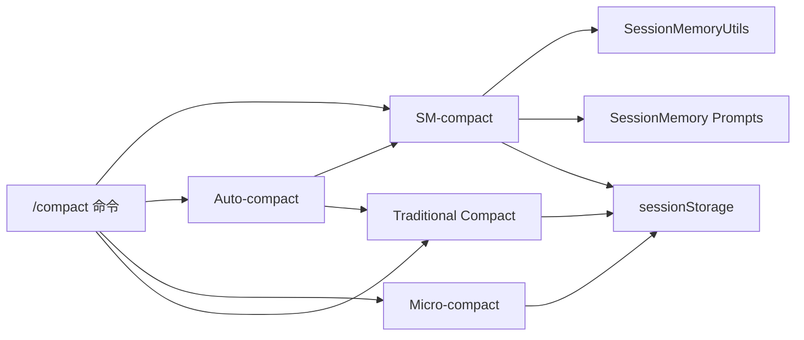

# 会话内存压缩

<cite>
**本文引用的文件**
- [sessionMemoryCompact.ts](file://src/services/compact/sessionMemoryCompact.ts)
- [compact.ts](file://src/services/compact/compact.ts)
- [autoCompact.ts](file://src/services/compact/autoCompact.ts)
- [microCompact.ts](file://src/services/compact/microCompact.ts)
- [sessionMemoryUtils.ts](file://src/services/SessionMemory/sessionMemoryUtils.ts)
- [prompts.ts](file://src/services/SessionMemory/prompts.ts)
- [sessionStorage.ts](file://src/utils/sessionStorage.ts)
- [sessionStoragePortable.ts](file://src/utils/sessionStoragePortable.ts)
- [compact.ts](file://src/commands/compact/compact.ts)
- [memoryTypes.ts](file://src/memdir/memoryTypes.ts)
- [contextSuggestions.ts](file://src/utils/contextSuggestions.ts)
</cite>

## 目录
1. [简介](#简介)
2. [项目结构](#项目结构)
3. [核心组件](#核心组件)
4. [架构总览](#架构总览)
5. [详细组件分析](#详细组件分析)
6. [依赖关系分析](#依赖关系分析)
7. [性能考量](#性能考量)
8. [故障排查指南](#故障排查指南)
9. [结论](#结论)
10. [附录](#附录)

## 简介
本技术文档围绕 Claude Code 的“会话内存压缩”机制展开，系统阐述其设计目标、实现原理与工程细节，重点覆盖以下方面：
- 设计目标：通过“会话内存（Session Memory）”替代传统摘要式压缩，实现更可控、可回溯、可编辑的历史上下文保留；同时结合自动压缩与微压缩策略，平衡实时对话体验与内存占用。
- 实现原理：以“边界标记 + 持久化会话记忆 + 可选摘要”的组合方式，在不丢失关键交互的前提下降低上下文长度；支持在线压缩（自动触发）与离线存储（会话文件与会话记忆文件），并确保数据一致性。
- 数据结构与存储：消息序列化采用 JSONL 格式；会话记忆采用结构化模板文件；读取路径采用“头尾轻量读取 + 边界扫描”的高效策略；缓存策略通过“提示缓存共享”和“时间基微压缩”减少重复传输。
- 触发条件与执行策略：基于上下文窗口与输出预留的阈值计算；结合最小保留条目数与最大保留令牌数；支持环境变量与远程配置动态调整；具备失败熔断与重试保护。
- 集成示例：展示在命令入口与自动压缩流程中如何无缝接入会话内存压缩。

## 项目结构
与会话内存压缩直接相关的模块主要分布在以下目录：
- 服务层（压缩与会话记忆）
  - src/services/compact：压缩算法与策略（含会话内存压缩、自动压缩、微压缩）
  - src/services/SessionMemory：会话记忆模板、更新提示与内容截断
- 工具层（会话存储与读取）
  - src/utils/sessionStorage.ts：会话文件写入、元数据重追加、边界扫描等
  - src/utils/sessionStoragePortable.ts：跨平台会话读取工具（头尾读取、路径解析、边界扫描）
- 命令层（对外接口）
  - src/commands/compact：/compact 命令入口，调度会话内存压缩与传统压缩
- 上下文与建议
  - src/utils/contextSuggestions.ts：基于内存使用率给出压缩建议
  - src/memdir/memoryTypes.ts：记忆类型定义与建议

**图表来源**
- [compact.ts:1-137](file://src/commands/compact/compact.ts#L1-L137)
- [sessionMemoryCompact.ts:1-631](file://src/services/compact/sessionMemoryCompact.ts#L1-L631)
- [autoCompact.ts:1-352](file://src/services/compact/autoCompact.ts#L1-L352)
- [microCompact.ts:1-531](file://src/services/compact/microCompact.ts#L1-L531)
- [compact.ts:1-763](file://src/services/compact/compact.ts#L1-L763)
- [sessionMemoryUtils.ts:1-208](file://src/services/SessionMemory/sessionMemoryUtils.ts#L1-L208)
- [prompts.ts:1-325](file://src/services/SessionMemory/prompts.ts#L1-L325)
- [sessionStorage.ts:1-800](file://src/utils/sessionStorage.ts#L1-L800)
- [sessionStoragePortable.ts:1-794](file://src/utils/sessionStoragePortable.ts#L1-L794)

**章节来源**
- [compact.ts:1-137](file://src/commands/compact/compact.ts#L1-L137)
- [sessionMemoryCompact.ts:1-631](file://src/services/compact/sessionMemoryCompact.ts#L1-L631)
- [autoCompact.ts:1-352](file://src/services/compact/autoCompact.ts#L1-L352)
- [microCompact.ts:1-531](file://src/services/compact/microCompact.ts#L1-L531)
- [sessionMemoryUtils.ts:1-208](file://src/services/SessionMemory/sessionMemoryUtils.ts#L1-L208)
- [prompts.ts:1-325](file://src/services/SessionMemory/prompts.ts#L1-L325)
- [sessionStorage.ts:1-800](file://src/utils/sessionStorage.ts#L1-L800)
- [sessionStoragePortable.ts:1-794](file://src/utils/sessionStoragePortable.ts#L1-L794)

## 核心组件
- 会话内存压缩（SM-compact）
  - 通过读取会话记忆文件（结构化模板）生成摘要，插入到边界标记之后，保留最近若干消息，避免传统摘要导致的上下文断裂。
  - 支持远程配置阈值（最小保留令牌数、最小保留文本消息数、最大保留令牌数），并具备“空模板检测”与“截断保护”。
- 自动压缩（Auto-compact）
  - 在每次请求前评估当前上下文是否接近阈值，若超过则优先尝试会话内存压缩，否则走传统摘要压缩。
  - 具备失败熔断（连续失败次数上限）、重试与事件上报。
- 微压缩（Micro-compact）
  - 时间基清理：当距离上次助手回复的时间过长时，清理旧工具结果，仅保留最近若干条，减少冗余内容。
  - 缓存编辑：在提示缓存仍热时，通过“cache_edits”原地删除旧工具结果，避免重建前缀。
- 传统压缩（Compact）
  - 基于模型调用生成摘要，替换旧消息并注入边界标记与附件；支持部分压缩（围绕选定消息进行）。
- 会话存储与读取
  - JSONL 文件按行存储消息；通过“头尾轻量读取 + 边界扫描”实现快速加载与恢复；支持元数据重追加以保持尾部可见。
- 记忆类型与建议
  - 定义记忆类型（用户、反馈、项目、参考）与使用建议；当内存使用率过高时给出压缩建议。

**章节来源**
- [sessionMemoryCompact.ts:403-631](file://src/services/compact/sessionMemoryCompact.ts#L403-L631)
- [autoCompact.ts:160-352](file://src/services/compact/autoCompact.ts#L160-L352)
- [microCompact.ts:253-531](file://src/services/compact/microCompact.ts#L253-L531)
- [compact.ts:387-763](file://src/services/compact/compact.ts#L387-L763)
- [sessionStorage.ts:532-800](file://src/utils/sessionStorage.ts#L532-L800)
- [sessionStoragePortable.ts:208-794](file://src/utils/sessionStoragePortable.ts#L208-L794)
- [memoryTypes.ts:14-272](file://src/memdir/memoryTypes.ts#L14-L272)
- [contextSuggestions.ts:193-235](file://src/utils/contextSuggestions.ts#L193-L235)

## 架构总览
会话内存压缩在整体架构中的位置如下：

**图表来源**
- [compact.ts:40-137](file://src/commands/compact/compact.ts#L40-L137)
- [sessionMemoryCompact.ts:514-631](file://src/services/compact/sessionMemoryCompact.ts#L514-L631)
- [autoCompact.ts:241-352](file://src/services/compact/autoCompact.ts#L241-L352)
- [compact.ts:387-763](file://src/services/compact/compact.ts#L387-L763)
- [sessionMemoryUtils.ts:89-126](file://src/services/SessionMemory/sessionMemoryUtils.ts#L89-L126)
- [prompts.ts:220-247](file://src/services/SessionMemory/prompts.ts#L220-L247)
- [sessionStorage.ts:721-800](file://src/utils/sessionStorage.ts#L721-L800)

## 详细组件分析

### 组件A：会话内存压缩（SM-compact）
- 设计要点
  - 使用“最后摘要消息ID”定位已摘要边界，从该点之后的消息作为保留集合，满足最小保留令牌数与最小文本块消息数约束。
  - 通过“工具对齐”与“思考块合并”规则，确保不会切分 tool_use/tool_result 对或丢失思考块。
  - 会话记忆为空模板时回退至传统压缩；对超长会话记忆进行截断，避免占用过多摘要预算。
- 关键流程

**图表来源**
- [sessionMemoryCompact.ts:403-631](file://src/services/compact/sessionMemoryCompact.ts#L403-L631)
- [sessionMemoryUtils.ts:89-126](file://src/services/SessionMemory/sessionMemoryUtils.ts#L89-L126)
- [prompts.ts:220-247](file://src/services/SessionMemory/prompts.ts#L220-L247)

**章节来源**
- [sessionMemoryCompact.ts:403-631](file://src/services/compact/sessionMemoryCompact.ts#L403-L631)
- [sessionMemoryUtils.ts:1-208](file://src/services/SessionMemory/sessionMemoryUtils.ts#L1-L208)
- [prompts.ts:220-325](file://src/services/SessionMemory/prompts.ts#L220-L325)

### 组件B：自动压缩（Auto-compact）
- 设计要点
  - 基于模型上下文窗口与输出预留计算有效阈值；在每次请求前评估是否需要压缩。
  - 优先尝试会话内存压缩，失败后再走传统压缩；具备连续失败熔断与事件上报。
- 关键流程

**图表来源**
- [autoCompact.ts:160-352](file://src/services/compact/autoCompact.ts#L160-L352)
- [compact.ts:387-763](file://src/services/compact/compact.ts#L387-L763)
- [sessionMemoryCompact.ts:514-631](file://src/services/compact/sessionMemoryCompact.ts#L514-L631)

**章节来源**
- [autoCompact.ts:1-352](file://src/services/compact/autoCompact.ts#L1-L352)
- [compact.ts:387-763](file://src/services/compact/compact.ts#L387-L763)

### 组件C：微压缩（Micro-compact）
- 设计要点
  - 时间基清理：当距离上次助手回复的时间超过阈值时，清理旧工具结果，仅保留最近若干条。
  - 缓存编辑：在提示缓存仍热时，通过“cache_edits”原地删除旧工具结果，避免重建前缀。
- 关键流程

**图表来源**
- [microCompact.ts:422-531](file://src/services/compact/microCompact.ts#L422-L531)
- [microCompact.ts:305-399](file://src/services/compact/microCompact.ts#L305-L399)

**章节来源**
- [microCompact.ts:1-531](file://src/services/compact/microCompact.ts#L1-L531)

### 组件D：传统压缩（Compact）
- 设计要点
  - 生成摘要并替换旧消息；支持“前向/向上”两种部分压缩方向；剥离图片与可再注入附件，减少冗余。
  - 提供“提示过长重试”兜底策略，按 API 回应的缺口逐步丢弃最早轮次以解围。
- 关键流程

**图表来源**
- [compact.ts:387-763](file://src/services/compact/compact.ts#L387-L763)

**章节来源**
- [compact.ts:243-763](file://src/services/compact/compact.ts#L243-L763)

### 组件E：会话存储与读取
- 设计要点
  - JSONL 文件按行存储消息；通过“头尾轻量读取 + 边界扫描”实现快速加载与恢复；支持元数据重追加以保持尾部可见。
  - 提供“边界标记”字节搜索与“属性快照”跳过逻辑，确保恢复时能正确裁剪与拼接。
- 关键流程

**图表来源**
- [sessionStorage.ts:721-800](file://src/utils/sessionStorage.ts#L721-L800)
- [sessionStoragePortable.ts:525-794](file://src/utils/sessionStoragePortable.ts#L525-L794)

**章节来源**
- [sessionStorage.ts:532-800](file://src/utils/sessionStorage.ts#L532-L800)
- [sessionStoragePortable.ts:208-794](file://src/utils/sessionStoragePortable.ts#L208-L794)

### 组件F：记忆类型与建议
- 设计要点
  - 定义记忆类型（用户、反馈、项目、参考）与使用建议；当内存使用率过高时给出压缩建议。
- 关键流程

**图表来源**
- [contextSuggestions.ts:193-235](file://src/utils/contextSuggestions.ts#L193-L235)
- [memoryTypes.ts:14-272](file://src/memdir/memoryTypes.ts#L14-L272)

**章节来源**
- [contextSuggestions.ts:193-235](file://src/utils/contextSuggestions.ts#L193-L235)
- [memoryTypes.ts:14-272](file://src/memdir/memoryTypes.ts#L14-L272)

## 依赖关系分析
- 组件耦合
  - 会话内存压缩依赖会话记忆工具（读取最后摘要ID、等待提取完成、读取会话记忆内容）与会话存储（边界扫描与元数据重追加）。
  - 自动压缩在决策链路中优先调用会话内存压缩，失败后降级到传统压缩。
  - 微压缩与传统压缩均依赖会话存储的边界扫描能力与元数据重追加。
- 外部依赖
  - 远程配置（GrowthBook）用于动态调整阈值；提示缓存检测用于抑制误报。
  - 文件系统访问与并发安全（头尾读取缓冲区复用）。

**图表来源**
- [sessionMemoryCompact.ts:1-631](file://src/services/compact/sessionMemoryCompact.ts#L1-L631)
- [sessionMemoryUtils.ts:1-208](file://src/services/SessionMemory/sessionMemoryUtils.ts#L1-L208)
- [prompts.ts:1-325](file://src/services/SessionMemory/prompts.ts#L1-L325)
- [sessionStorage.ts:1-800](file://src/utils/sessionStorage.ts#L1-L800)
- [autoCompact.ts:1-352](file://src/services/compact/autoCompact.ts#L1-L352)
- [compact.ts:1-763](file://src/services/compact/compact.ts#L1-L763)
- [microCompact.ts:1-531](file://src/services/compact/microCompact.ts#L1-L531)
- [compact.ts:1-137](file://src/commands/compact/compact.ts#L1-L137)

**章节来源**
- [sessionMemoryCompact.ts:1-631](file://src/services/compact/sessionMemoryCompact.ts#L1-L631)
- [sessionMemoryUtils.ts:1-208](file://src/services/SessionMemory/sessionMemoryUtils.ts#L1-L208)
- [prompts.ts:1-325](file://src/services/SessionMemory/prompts.ts#L1-L325)
- [sessionStorage.ts:1-800](file://src/utils/sessionStorage.ts#L1-L800)
- [autoCompact.ts:1-352](file://src/services/compact/autoCompact.ts#L1-L352)
- [compact.ts:1-763](file://src/services/compact/compact.ts#L1-L763)
- [microCompact.ts:1-531](file://src/services/compact/microCompact.ts#L1-L531)
- [compact.ts:1-137](file://src/commands/compact/compact.ts#L1-L137)

## 性能考量
- I/O 与内存
  - 头尾轻量读取（64KB 窗口）避免全量加载；边界扫描按需进行，适合大文件场景。
  - 微压缩在缓存热时通过“cache_edits”原地删除，避免重建前缀带来的额外传输。
- 计算复杂度
  - 会话内存压缩的保留索引计算为线性扫描；工具对齐与思考块合并引入常数因子，整体仍为 O(n)。
  - 自动压缩的阈值计算与熔断逻辑开销极低，主要成本在模型调用。
- 缓存与一致性
  - 提示缓存共享与“提示缓存破坏检测”配合，避免误报与不必要的重试。
  - 元数据重追加确保 --resume 显示最新标题/标签，避免尾部窗口溢出。

## 故障排查指南
- 常见问题
  - 会话内存为空模板：回退到传统压缩；检查会话记忆提取是否成功。
  - 自动压缩失败：查看连续失败次数是否达到熔断阈值；确认阈值计算是否合理。
  - 提示过长：传统压缩提供“丢弃最早轮次”兜底；必要时手动缩短上下文。
  - 缓存编辑无效：确认主进程来源与模型支持情况；检查时间基触发条件。
- 排查步骤
  - 检查功能开关与环境变量（启用/禁用）。
  - 查看事件日志（tengu_sm_compact、tengu_compact）与调试日志。
  - 验证会话记忆文件是否存在且非空模板；检查最后摘要消息ID是否匹配。
  - 确认边界标记存在且 preservedSegment 正确设置。

**章节来源**
- [sessionMemoryCompact.ts:514-631](file://src/services/compact/sessionMemoryCompact.ts#L514-L631)
- [autoCompact.ts:257-352](file://src/services/compact/autoCompact.ts#L257-L352)
- [compact.ts:243-291](file://src/services/compact/compact.ts#L243-L291)
- [microCompact.ts:422-531](file://src/services/compact/microCompact.ts#L422-L531)

## 结论
会话内存压缩通过“结构化会话记忆 + 边界标记 + 可选摘要”的组合，实现了比传统摘要更可控、更易维护的上下文压缩方案。它与自动压缩、微压缩形成互补：前者强调可编辑与可回溯，后者强调实时与低开销。配合高效的会话存储读取与缓存策略，整体在性能与一致性之间取得良好平衡。建议在生产环境中结合远程配置与事件监控，持续优化阈值与触发策略。

## 附录
- 实现示例（集成会话内存压缩）
  - 在命令入口中优先尝试会话内存压缩，成功后进行后处理与元数据重追加。
  - 在自动压缩流程中，先评估阈值，再尝试会话内存压缩，失败后走传统压缩。
  - 在微压缩路径中，根据时间基或缓存编辑策略清理冗余内容。
- 数据迁移与版本兼容
  - 会话记忆模板与提示可通过配置文件扩展；空模板检测确保回退兼容。
  - 边界扫描与元数据重追加保障不同版本间的一致性与可恢复性。
- 最佳实践
  - 合理设置最小保留令牌数与最大保留令牌数，兼顾历史完整性与性能。
  - 使用时间基微压缩减少冷缓存场景下的冗余传输。
  - 开启提示缓存共享与破坏检测，避免误报与无效重试。