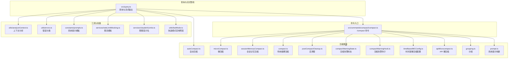
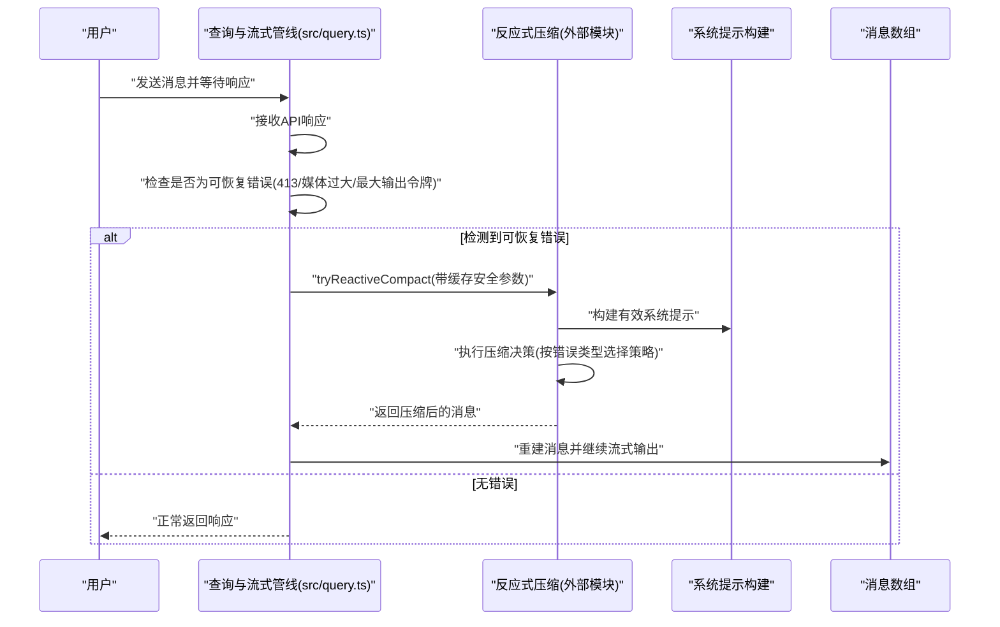
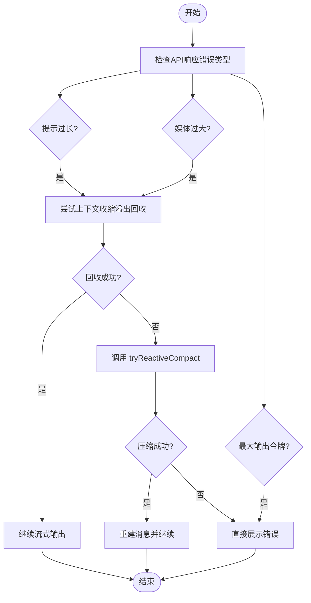
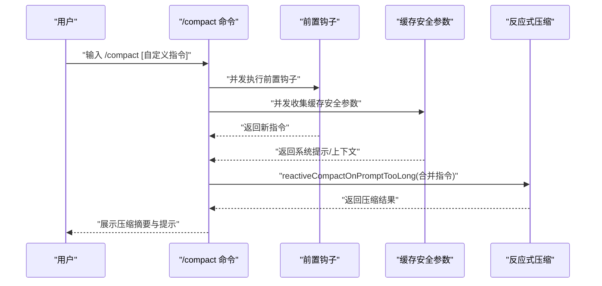
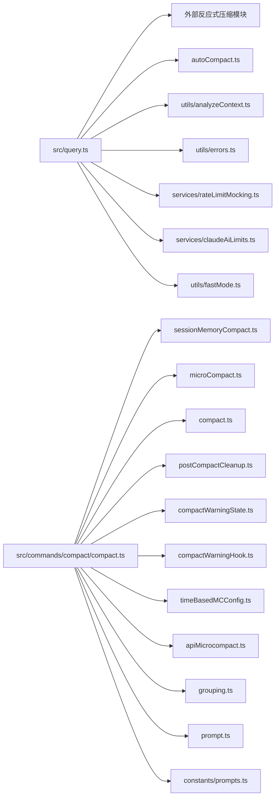

# 反应式压缩机制

<cite>
**本文引用的文件**   
- [src/query.ts](file://src/query.ts)
- [src/commands/compact/compact.ts](file://src/commands/compact/compact.ts)
- [src/utils/analyzeContext.ts](file://src/utils/analyzeContext.ts)
- [src/utils/errors.ts](file://src/utils/errors.ts)
- [src/services/compact/autoCompact.ts](file://src/services/compact/autoCompact.ts)
- [src/services/compact/microCompact.ts](file://src/services/compact/microCompact.ts)
- [src/services/compact/sessionMemoryCompact.ts](file://src/services/compact/sessionMemoryCompact.ts)
- [src/services/compact/compact.ts](file://src/services/compact/compact.ts)
- [src/services/compact/postCompactCleanup.ts](file://src/services/compact/postCompactCleanup.ts)
- [src/services/compact/compactWarningState.ts](file://src/services/compact/compactWarningState.ts)
- [src/services/compact/compactWarningHook.ts](file://src/services/compact/compactWarningHook.ts)
- [src/services/compact/timeBasedMCConfig.ts](file://src/services/compact/timeBasedMCConfig.ts)
- [src/services/compact/apiMicrocompact.ts](file://src/services/compact/apiMicrocompact.ts)
- [src/services/compact/grouping.ts](file://src/services/compact/grouping.ts)
- [src/services/compact/prompt.ts](file://src/services/compact/prompt.ts)
- [src/constants/prompts.ts](file://src/constants/prompts.ts)
- [src/services/rateLimitMocking.ts](file://src/services/rateLimitMocking.ts)
- [src/services/claudeAiLimits.ts](file://src/services/claudeAiLimits.ts)
- [src/utils/fastMode.ts](file://src/utils/fastMode.ts)
</cite>

## 目录
1. [引言](#引言)
2. [项目结构](#项目结构)
3. [核心组件](#核心组件)
4. [架构总览](#架构总览)
5. [详细组件分析](#详细组件分析)
6. [依赖关系分析](#依赖关系分析)
7. [性能考量](#性能考量)
8. [故障排查指南](#故障排查指南)
9. [结论](#结论)

## 引言
本文件系统性阐述 Claude Code 的“反应式压缩（Reactive Compression）”机制：其核心理念、工作原理、与“自动压缩（Proactive/Automatic）”的区别，以及在 API 错误、prompt_too_long、上下文溢出等场景下的触发与恢复流程。文档同时给出关键调用序列与时序图，帮助读者从高层到代码级理解该机制如何在真实对话流中被激活、如何做出压缩决策、如何恢复并继续交互。

## 项目结构
与反应式压缩直接相关的核心代码分布在以下模块：
- 查询与流式输出管线：负责在每次请求后检查是否出现“提示过长/媒体过大/最大输出令牌”等可恢复错误，并在必要时触发反应式压缩。
- 压缩命令入口：提供 /compact 手动触发路径，支持会话记忆压缩、微压缩、传统摘要压缩，以及在特定特性开启时走“反应式路径”。
- 压缩服务层：包含自动压缩、微压缩、会话记忆压缩、后清理、告警状态等子模块。
- 工具与辅助：上下文分析、错误分类、限流模拟与显示、时间基微压缩配置等。

图表来源
- [src/query.ts:384-1168](file://src/query.ts#L384-L1168)
- [src/commands/compact/compact.ts:1-288](file://src/commands/compact/compact.ts#L1-L288)
- [src/utils/analyzeContext.ts:1106-1134](file://src/utils/analyzeContext.ts#L1106-L1134)
- [src/utils/errors.ts:191-238](file://src/utils/errors.ts#L191-L238)
- [src/services/compact/autoCompact.ts](file://src/services/compact/autoCompact.ts)
- [src/services/compact/microCompact.ts](file://src/services/compact/microCompact.ts)
- [src/services/compact/sessionMemoryCompact.ts](file://src/services/compact/sessionMemoryCompact.ts)
- [src/services/compact/compact.ts](file://src/services/compact/compact.ts)
- [src/services/compact/postCompactCleanup.ts](file://src/services/compact/postCompactCleanup.ts)
- [src/services/compact/compactWarningState.ts](file://src/services/compact/compactWarningState.ts)
- [src/services/compact/compactWarningHook.ts](file://src/services/compact/compactWarningHook.ts)
- [src/services/compact/timeBasedMCConfig.ts](file://src/services/compact/timeBasedMCConfig.ts)
- [src/services/compact/apiMicrocompact.ts](file://src/services/compact/apiMicrocompact.ts)
- [src/services/compact/grouping.ts](file://src/services/compact/grouping.ts)
- [src/services/compact/prompt.ts](file://src/services/compact/prompt.ts)
- [src/constants/prompts.ts:862-881](file://src/constants/prompts.ts#L862-L881)
- [src/services/rateLimitMocking.ts:43-144](file://src/services/rateLimitMocking.ts#L43-L144)
- [src/services/claudeAiLimits.ts:73-109](file://src/services/claudeAiLimits.ts#L73-L109)
- [src/utils/fastMode.ts:262-294](file://src/utils/fastMode.ts#L262-L294)

章节来源
- [src/query.ts:384-1168](file://src/query.ts#L384-L1168)
- [src/commands/compact/compact.ts:1-288](file://src/commands/compact/compact.ts#L1-L288)
- [src/utils/analyzeContext.ts:1106-1134](file://src/utils/analyzeContext.ts#L1106-L1134)
- [src/utils/errors.ts:191-238](file://src/utils/errors.ts#L191-L238)

## 核心组件
- 查询与流式管线（src/query.ts）
  - 在每次 API 响应后，检查是否出现“提示过长/媒体过大/最大输出令牌”等可恢复错误。
  - 若检测到可恢复错误且启用反应式压缩，则调用 reactiveCompact.tryReactiveCompact 进行压缩尝试；成功则重建消息并继续。
  - 同时与上下文收缩（context-collapse）协同：若先有“溢出回收”，仍可回退到反应式压缩。
- 压缩命令入口（src/commands/compact/compact.ts）
  - 提供 /compact 命令的手动触发路径；在特定特性开启时，强制走“反应式路径”，以被动响应而非主动预测的方式进行压缩。
  - 支持并发执行前置钩子与缓存安全参数收集，提升启动效率。
- 压缩服务层
  - 自动压缩（autoCompact.ts）、微压缩（microCompact.ts）、会话记忆压缩（sessionMemoryCompact.ts）、传统摘要压缩（compact.ts）、后清理（postCompactCleanup.ts）、告警状态与钩子（compactWarningState.ts、compactWarningHook.ts）等。
- 工具与辅助
  - 上下文分析（analyzeContext.ts）：在“仅反应式模式”或“上下文收缩启用”时，跳过预留缓冲，使反应式压缩更透明。
  - 错误分类（errors.ts）：统一识别 413/429/401/超时/网络等错误类别，为恢复策略提供依据。
  - 系统提示构建（constants/prompts.ts、services/compact/prompt.ts）：确保压缩前后系统提示一致，避免缓存污染。
  - 限流与限额（services/rateLimitMocking.ts、services/claudeAiLimits.ts、utils/fastMode.ts）：在模拟/真实限流场景下，决定是否抛出 429 或 413，从而触发反应式压缩。

章节来源
- [src/query.ts:384-1168](file://src/query.ts#L384-L1168)
- [src/commands/compact/compact.ts:1-288](file://src/commands/compact/compact.ts#L1-L288)
- [src/utils/analyzeContext.ts:1106-1134](file://src/utils/analyzeContext.ts#L1106-L1134)
- [src/utils/errors.ts:191-238](file://src/utils/errors.ts#L191-L238)
- [src/constants/prompts.ts:862-881](file://src/constants/prompts.ts#L862-L881)

## 架构总览
反应式压缩的核心思想是“被动响应 + 错误驱动 + 自适应调整”。它不预先判断何时需要压缩，而是在 API 返回明确的“可恢复错误”（如提示过长、媒体过大）时，才触发压缩流程。与自动压缩不同，反应式压缩强调“响应而非预判”，在错误发生后再进行空间回收与上下文精简。

图表来源
- [src/query.ts:1071-1168](file://src/query.ts#L1071-L1168)
- [src/commands/compact/compact.ts:139-228](file://src/commands/compact/compact.ts#L139-L228)

## 详细组件分析

### 组件一：查询与流式管线中的反应式压缩触发
- 触发条件
  - 检测到 API 返回“提示过长”、“媒体大小错误”或“最大输出令牌限制”等可恢复错误。
  - 当启用上下文收缩（context-collapse）时，优先尝试“溢出回收”；若仍失败，则回退到反应式压缩。
- 执行流程
  - 并行执行“溢出回收”与“反应式压缩”尝试，谁先成功谁生效。
  - 成功后重建消息数组并继续流式输出；失败则根据错误类型决定是否向用户展示。
- 关键点
  - 在“仅反应式模式”或“上下文收缩启用”时，跳过预留缓冲，使反应式压缩更透明。
  - 对于媒体大小错误，反应式压缩提供“剥离重试”能力，避免上下文收缩的无效尝试。

图表来源
- [src/query.ts:789-1168](file://src/query.ts#L789-L1168)
- [src/utils/analyzeContext.ts:1106-1134](file://src/utils/analyzeContext.ts#L1106-L1134)

章节来源
- [src/query.ts:789-1168](file://src/query.ts#L789-L1168)
- [src/utils/analyzeContext.ts:1106-1134](file://src/utils/analyzeContext.ts#L1106-L1134)

### 组件二：/compact 命令的手动触发与反应式路径
- 主要职责
  - 当存在自定义指令时，优先尝试会话记忆压缩；否则尝试微压缩与传统摘要压缩。
  - 在“仅反应式模式”下，强制走反应式路径，以被动方式执行压缩。
- 并发优化
  - 并发执行前置钩子与缓存安全参数收集，缩短启动延迟。
- 结果合并
  - 将前置钩子与后置钩子的用户可见信息合并，形成最终反馈文本。

图表来源
- [src/commands/compact/compact.ts:139-228](file://src/commands/compact/compact.ts#L139-L228)

章节来源
- [src/commands/compact/compact.ts:1-288](file://src/commands/compact/compact.ts#L1-L288)

### 组件三：自动压缩 vs 反应式压缩
- 主动 vs 被动
  - 自动压缩：基于上下文使用率阈值与时间窗口，提前进行空间回收（预判）。
  - 反应式压缩：在 API 返回明确错误后才进行压缩（响应），避免不必要的压缩。
- 预判 vs 响应
  - 自动压缩可能在用户尚未遇到错误前就进行压缩，适合长期会话。
  - 反应式压缩只在“提示过长/媒体过大/最大输出令牌”等错误发生时才介入，更精准。
- 处理时机
  - 自动压缩通常在请求前或请求早期进行；反应式压缩在请求后、错误发生时进行。
- 协同关系
  - 在某些特性组合下，自动压缩会被抑制（例如启用“上下文收缩”或“仅反应式模式”时），由反应式压缩接管。

章节来源
- [src/utils/analyzeContext.ts:1106-1134](file://src/utils/analyzeContext.ts#L1106-L1134)
- [src/query.ts:599-621](file://src/query.ts#L599-L621)

### 组件四：错误检测与恢复策略
- 错误类型识别
  - 使用统一的错误分类工具识别 413、429、401/403、超时、网络等错误类别。
- 恢复路径
  - 对于 413（提示过长）：优先尝试上下文收缩溢出回收；失败则进入反应式压缩。
  - 对于媒体过大：反应式压缩提供剥离重试，避免上下文收缩无效尝试。
  - 对于最大输出令牌限制：直接展示错误，不进行压缩。
- 限流与快速模式
  - 限流模拟与真实限流场景下，快速模式可能被永久禁用，需根据禁用原因提示用户。

章节来源
- [src/utils/errors.ts:191-238](file://src/utils/errors.ts#L191-L238)
- [src/query.ts:1071-1168](file://src/query.ts#L1071-L1168)
- [src/services/rateLimitMocking.ts:43-144](file://src/services/rateLimitMocking.ts#L43-L144)
- [src/services/claudeAiLimits.ts:73-109](file://src/services/claudeAiLimits.ts#L73-L109)
- [src/utils/fastMode.ts:262-294](file://src/utils/fastMode.ts#L262-L294)

### 组件五：压缩决策与结果恢复
- 决策输入
  - 缓存安全参数（系统提示、用户上下文、系统上下文、工具使用上下文）。
  - 错误类型（提示过长、媒体过大、最大输出令牌）。
- 决策过程
  - 根据错误类型选择不同的压缩策略（例如剥离媒体、减少历史、重写系统提示等）。
  - 并发执行前置钩子与参数收集，缩短等待时间。
- 结果恢复
  - 成功后重建消息数组并继续流式输出；失败则根据错误原因决定是否向用户展示。
  - 清理缓存与告警状态，避免后续误报。

章节来源
- [src/commands/compact/compact.ts:139-228](file://src/commands/compact/compact.ts#L139-L228)
- [src/services/compact/postCompactCleanup.ts](file://src/services/compact/postCompactCleanup.ts)
- [src/services/compact/compactWarningState.ts](file://src/services/compact/compactWarningState.ts)
- [src/services/compact/compactWarningHook.ts](file://src/services/compact/compactWarningHook.ts)

## 依赖关系分析
- 查询与流式管线依赖反应式压缩模块进行错误后的空间回收。
- 压缩命令入口依赖多个压缩子模块（会话记忆、微压缩、传统摘要）与后清理模块。
- 上下文分析模块影响自动压缩的预留缓冲策略，间接影响反应式压缩的透明度。
- 错误分类与限流模块为反应式压缩提供触发信号与恢复依据。

图表来源
- [src/query.ts:384-1168](file://src/query.ts#L384-L1168)
- [src/commands/compact/compact.ts:1-288](file://src/commands/compact/compact.ts#L1-L288)
- [src/utils/analyzeContext.ts:1106-1134](file://src/utils/analyzeContext.ts#L1106-L1134)
- [src/utils/errors.ts:191-238](file://src/utils/errors.ts#L191-L238)
- [src/services/compact/autoCompact.ts](file://src/services/compact/autoCompact.ts)
- [src/services/compact/microCompact.ts](file://src/services/compact/microCompact.ts)
- [src/services/compact/sessionMemoryCompact.ts](file://src/services/compact/sessionMemoryCompact.ts)
- [src/services/compact/compact.ts](file://src/services/compact/compact.ts)
- [src/services/compact/postCompactCleanup.ts](file://src/services/compact/postCompactCleanup.ts)
- [src/services/compact/compactWarningState.ts](file://src/services/compact/compactWarningState.ts)
- [src/services/compact/compactWarningHook.ts](file://src/services/compact/compactWarningHook.ts)
- [src/services/compact/timeBasedMCConfig.ts](file://src/services/compact/timeBasedMCConfig.ts)
- [src/services/compact/apiMicrocompact.ts](file://src/services/compact/apiMicrocompact.ts)
- [src/services/compact/grouping.ts](file://src/services/compact/grouping.ts)
- [src/services/compact/prompt.ts](file://src/services/compact/prompt.ts)
- [src/constants/prompts.ts:862-881](file://src/constants/prompts.ts#L862-L881)
- [src/services/rateLimitMocking.ts:43-144](file://src/services/rateLimitMocking.ts#L43-L144)
- [src/services/claudeAiLimits.ts:73-109](file://src/services/claudeAiLimits.ts#L73-L109)
- [src/utils/fastMode.ts:262-294](file://src/utils/fastMode.ts#L262-L294)

## 性能考量
- 并发优化：在 /compact 命令中，前置钩子与缓存安全参数收集并发执行，显著降低启动延迟。
- 透明性：在“仅反应式模式”或“上下文收缩启用”时跳过预留缓冲，使反应式压缩更透明，减少不必要的空间占用。
- 早停策略：对于“最大输出令牌限制”等不可恢复错误，直接展示错误，避免无效压缩尝试。
- 限流感知：在限流场景下，快速模式可能被禁用，需通过 UI 提示用户升级或等待额度恢复。

## 故障排查指南
- 常见问题
  - 压缩后仍出现“提示过长”：检查是否启用了“上下文收缩”或“仅反应式模式”，确认是否正确执行了“溢出回收”。
  - 媒体过大导致失败：确认是否启用了媒体剥离重试，避免对无法剥离的媒体重复尝试。
  - 429 限流：检查限流模拟与真实限流状态，确认快速模式是否被禁用及原因。
- 排查步骤
  - 查看错误分类结果，区分 413/429/401/超时/网络等类别。
  - 确认是否已尝试“溢出回收”，若失败再尝试反应式压缩。
  - 检查系统提示构建是否一致，避免缓存污染导致的无效压缩。
  - 如遇快速模式被禁用，查看禁用原因并引导用户进行相应操作。

章节来源
- [src/utils/errors.ts:191-238](file://src/utils/errors.ts#L191-L238)
- [src/services/rateLimitMocking.ts:43-144](file://src/services/rateLimitMocking.ts#L43-L144)
- [src/services/claudeAiLimits.ts:73-109](file://src/services/claudeAiLimits.ts#L73-L109)
- [src/utils/fastMode.ts:262-294](file://src/utils/fastMode.ts#L262-L294)

## 结论
反应式压缩通过“被动响应 + 错误驱动 + 自适应调整”的机制，在 API 返回明确可恢复错误时进行空间回收与上下文精简，避免了自动压缩的过度干预与误判。其与自动压缩相辅相成：前者在错误发生后精准介入，后者在会话早期预防性地维持上下文健康。结合上下文分析、错误分类、限流感知与并发优化，反应式压缩在保证用户体验的同时，提升了系统的鲁棒性与资源利用率。