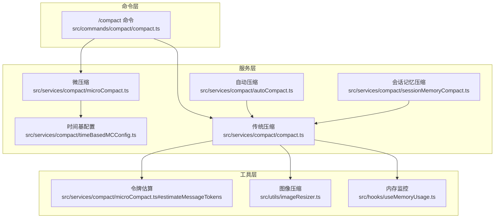
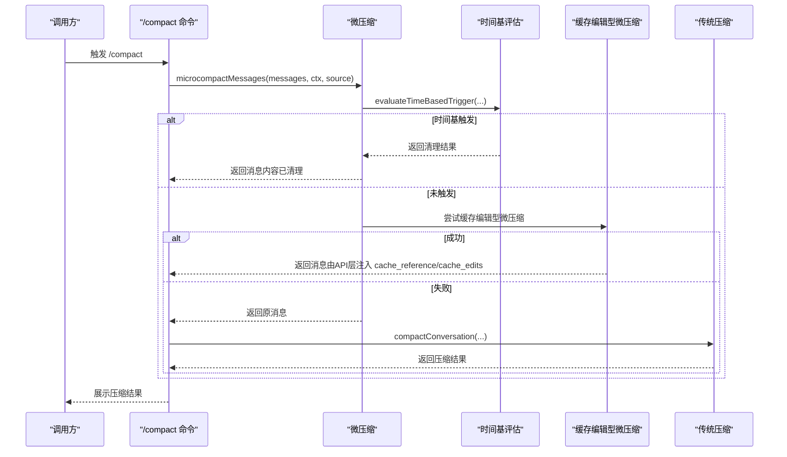
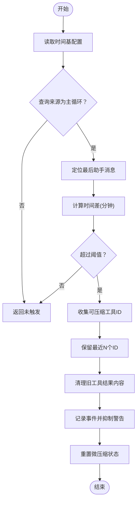
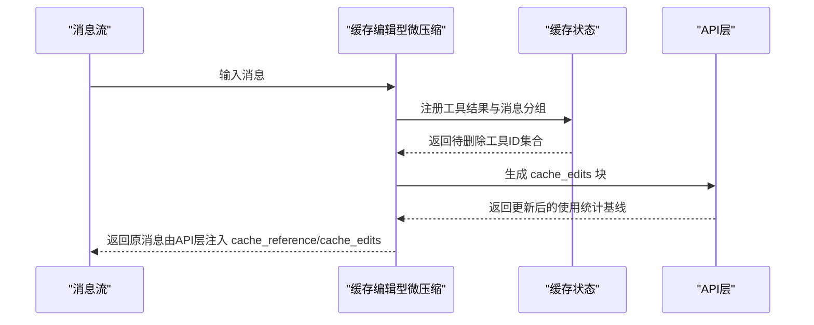
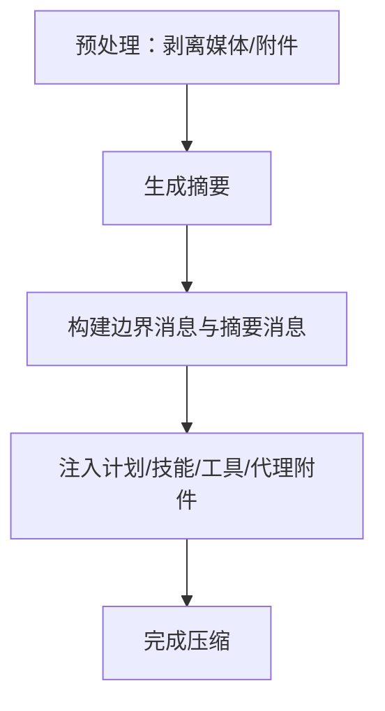
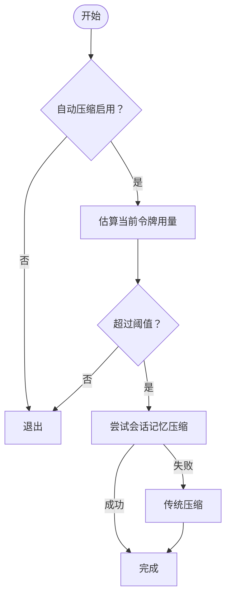
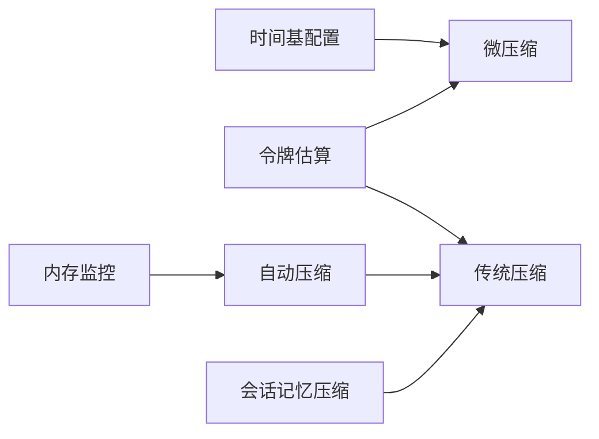

# 微压缩机制

<cite>
**本文引用的文件**
- [microCompact.ts](file://src/services/compact/microCompact.ts)
- [timeBasedMCConfig.ts](file://src/services/compact/timeBasedMCConfig.ts)
- [compact.ts](file://src/services/compact/compact.ts)
- [autoCompact.ts](file://src/services/compact/autoCompact.ts)
- [sessionMemoryCompact.ts](file://src/services/compact/sessionMemoryCompact.ts)
- [compact.ts（命令）](file://src/commands/compact/compact.ts)
- [useMemoryUsage.ts](file://src/hooks/useMemoryUsage.ts)
- [imageResizer.ts](file://src/utils/imageResizer.ts)
</cite>

## 目录
1. [引言](#引言)
2. [项目结构](#项目结构)
3. [核心组件](#核心组件)
4. [架构总览](#架构总览)
5. [详细组件分析](#详细组件分析)
6. [依赖关系分析](#依赖关系分析)
7. [性能考量](#性能考量)
8. [故障排查指南](#故障排查指南)
9. [结论](#结论)
10. [附录：使用示例与配置](#附录使用示例与配置)

## 引言
本文件系统性阐述 Claude Code 中“微压缩”机制的设计理念、实现细节与使用方法。微压缩旨在应对快速上下文管理、临时压缩需求与实时场景中的高吞吐与低延迟挑战，通过两类路径协同工作：
- 时间基微压缩：基于“自上次助手消息以来的时间间隔”进行内容级清理，以适配服务器端提示词缓存过期场景，避免不必要的全前缀重写。
- 缓存编辑型微压缩（缓存微压缩）：在支持的主循环线程与模型上，利用服务端缓存编辑能力，按计数阈值删除工具结果，不破坏已缓存前缀。

此外，本文还对比了微压缩与传统压缩（会话摘要式压缩）在处理速度、压缩程度与适用场景上的差异，并给出触发条件、执行策略、性能影响与最佳实践。

## 项目结构
微压缩相关代码主要位于以下模块：
- 服务层：微压缩与时间基配置、传统压缩、自动压缩、会话记忆压缩
- 命令层：/compact 命令入口，串联微压缩与传统压缩
- 工具层：令牌估算、图像压缩等辅助能力

图表来源
- [compact.ts（命令）:96-108](file://src/commands/compact/compact.ts#L96-L108)
- [microCompact.ts:253-293](file://src/services/compact/microCompact.ts#L253-L293)
- [timeBasedMCConfig.ts:36-43](file://src/services/compact/timeBasedMCConfig.ts#L36-L43)
- [autoCompact.ts:241-351](file://src/services/compact/autoCompact.ts#L241-L351)
- [compact.ts:387-763](file://src/services/compact/compact.ts#L387-L763)
- [sessionMemoryCompact.ts:514-630](file://src/services/compact/sessionMemoryCompact.ts#L514-L630)

章节来源
- [compact.ts（命令）:40-137](file://src/commands/compact/compact.ts#L40-L137)
- [microCompact.ts:253-293](file://src/services/compact/microCompact.ts#L253-L293)
- [timeBasedMCConfig.ts:36-43](file://src/services/compact/timeBasedMCConfig.ts#L36-L43)
- [autoCompact.ts:241-351](file://src/services/compact/autoCompact.ts#L241-L351)
- [compact.ts:387-763](file://src/services/compact/compact.ts#L387-L763)
- [sessionMemoryCompact.ts:514-630](file://src/services/compact/sessionMemoryCompact.ts#L514-L630)

## 核心组件
- 微压缩主流程：根据查询来源、时间阈值与缓存编辑能力选择执行路径；若时间基触发则直接修改消息内容进行内容清理；否则尝试缓存编辑型微压缩。
- 时间基配置：通过 GrowthBook 动态配置“是否启用、时间阈值（分钟）、保留最近条目数”。
- 传统压缩：在微压缩之后或作为回退路径，对会话进行摘要式压缩，生成边界消息、摘要与附件。
- 自动压缩：在上下文接近阈值时自动触发，优先尝试会话记忆压缩，失败后走传统压缩。
- 令牌估算与图像压缩：为微压缩与传统压缩提供估算与降维手段，降低上下文占用。

章节来源
- [microCompact.ts:253-531](file://src/services/compact/microCompact.ts#L253-L531)
- [timeBasedMCConfig.ts:18-43](file://src/services/compact/timeBasedMCConfig.ts#L18-L43)
- [compact.ts:387-763](file://src/services/compact/compact.ts#L387-L763)
- [autoCompact.ts:241-351](file://src/services/compact/autoCompact.ts#L241-L351)
- [sessionMemoryCompact.ts:514-630](file://src/services/compact/sessionMemoryCompact.ts#L514-L630)

## 架构总览
微压缩在请求前执行，优先评估时间基触发，再尝试缓存编辑型微压缩；若均未触发，则进入传统压缩或自动压缩路径。

图表来源
- [compact.ts（命令）:96-108](file://src/commands/compact/compact.ts#L96-L108)
- [microCompact.ts:253-293](file://src/services/compact/microCompact.ts#L253-L293)
- [microCompact.ts:422-444](file://src/services/compact/microCompact.ts#L422-L444)
- [microCompact.ts:305-399](file://src/services/compact/microCompact.ts#L305-L399)
- [compact.ts:387-763](file://src/services/compact/compact.ts#L387-L763)

## 详细组件分析

### 时间基微压缩（基于时间阈值的预请求清理）
- 设计目标：当距离上次主循环助手消息的时间超过阈值时，服务器端提示词缓存几乎确定已过期，此时直接清理旧工具结果，减少即将发送的前缀长度，避免全量重写。
- 关键参数：
  - enabled：是否启用
  - gapThresholdMinutes：触发阈值（分钟）
  - keepRecent：保留最近的可压缩工具结果数量
- 执行策略：
  - 仅在主循环来源（主线程）触发
  - 计算自上次助手消息至今的分钟数，若超过阈值则清理旧工具结果，保留最近若干条
  - 清理采用“内容清空”策略，替换为统一占位文本，不改变消息结构
- 触发条件：
  - 配置开启且查询来源为主循环
  - 最近一次助手消息存在且时间差超过阈值
  - 存在可压缩工具结果

图表来源
- [microCompact.ts:422-444](file://src/services/compact/microCompact.ts#L422-L444)
- [microCompact.ts:446-531](file://src/services/compact/microCompact.ts#L446-L531)
- [timeBasedMCConfig.ts:36-43](file://src/services/compact/timeBasedMCConfig.ts#L36-L43)

章节来源
- [microCompact.ts:422-531](file://src/services/compact/microCompact.ts#L422-L531)
- [timeBasedMCConfig.ts:18-43](file://src/services/compact/timeBasedMCConfig.ts#L18-L43)

### 缓存编辑型微压缩（计数阈值与缓存编辑）
- 设计目标：在支持的主循环线程与模型上，利用服务端缓存编辑能力，按计数阈值删除工具结果，不破坏已缓存前缀，避免额外网络往返。
- 关键参数：
  - triggerThreshold：触发阈值（来自 GrowthBook 配置）
  - keepRecent：保留最近条目数
- 执行策略：
  - 仅在主循环来源触发
  - 注册用户消息中的工具结果，按阈值计算待删除集合
  - 在 API 层生成 cache_edits 块，不修改本地消息内容
  - 记录分析事件，抑制后续压缩警告
- 适用范围：
  - 仅限支持的模型与构建（feature 标记）

图表来源
- [microCompact.ts:305-399](file://src/services/compact/microCompact.ts#L305-L399)

章节来源
- [microCompact.ts:276-293](file://src/services/compact/microCompact.ts#L276-L293)
- [microCompact.ts:305-399](file://src/services/compact/microCompact.ts#L305-L399)

### 传统压缩（摘要式压缩）
- 设计目标：在微压缩之后或作为回退路径，对会话进行摘要式压缩，生成边界消息、摘要与附件，恢复工具/指令上下文。
- 关键流程：
  - 预处理：剥离图片/文档块、去除会话记忆中会重复注入的附件
  - 摘要生成：通过 forked agent 调用模型生成摘要
  - 后处理：重建边界消息、注入计划/技能/工具/代理等附件
  - 事件记录：记录令牌使用、缓存命中/创建等指标
- 与微压缩的关系：
  - 微压缩优先于传统压缩执行
  - 若微压缩未触发，传统压缩作为兜底

图表来源
- [compact.ts:145-223](file://src/services/compact/compact.ts#L145-L223)
- [compact.ts:387-763](file://src/services/compact/compact.ts#L387-L763)

章节来源
- [compact.ts:145-223](file://src/services/compact/compact.ts#L145-L223)
- [compact.ts:387-763](file://src/services/compact/compact.ts#L387-L763)

### 自动压缩（上下文压力下的自动触发）
- 设计目标：在上下文接近阈值时自动触发压缩，优先尝试会话记忆压缩，失败后走传统压缩。
- 关键逻辑：
  - 计算有效上下文窗口与阈值，结合缓冲区安全余量
  - 判断是否启用自动压缩（环境变量、用户配置、特性开关）
  - 递归保护：避免在会话记忆/压缩子任务中再次触发
  - 失败熔断：连续失败达到阈值后停止重试

图表来源
- [autoCompact.ts:160-239](file://src/services/compact/autoCompact.ts#L160-L239)
- [autoCompact.ts:241-351](file://src/services/compact/autoCompact.ts#L241-L351)

章节来源
- [autoCompact.ts:72-158](file://src/services/compact/autoCompact.ts#L72-L158)
- [autoCompact.ts:160-239](file://src/services/compact/autoCompact.ts#L160-L239)
- [autoCompact.ts:241-351](file://src/services/compact/autoCompact.ts#L241-L351)

### 与传统压缩的区别
- 处理速度：微压缩在请求前进行，避免后续全量重写；传统压缩需要一次摘要生成与后续重建，耗时更高。
- 压缩程度：微压缩按条目计数与时间阈值清理工具结果，程度可控；传统压缩对历史上下文进行语义压缩，程度更深但更慢。
- 适用场景：微压缩适合“临时上下文膨胀、缓存过期风险高”的实时场景；传统压缩适合“长期会话、历史信息仍需保留”的场景。

章节来源
- [microCompact.ts:253-293](file://src/services/compact/microCompact.ts#L253-L293)
- [compact.ts:387-763](file://src/services/compact/compact.ts#L387-L763)

### 触发条件与执行策略
- 时间基触发条件：
  - 配置开启且查询来源为主循环
  - 最后一次助手消息存在且时间差超过阈值
  - 存在可压缩工具结果
- 缓存编辑型触发条件：
  - 支持的主循环来源与模型
  - 注册工具结果数量超过阈值
- 执行策略：
  - 时间基：直接修改消息内容，清理旧工具结果
  - 缓存编辑型：生成 cache_edits，由 API 层执行缓存编辑

章节来源
- [microCompact.ts:261-293](file://src/services/compact/microCompact.ts#L261-L293)
- [microCompact.ts:422-444](file://src/services/compact/microCompact.ts#L422-L444)
- [microCompact.ts:305-399](file://src/services/compact/microCompact.ts#L305-L399)

## 依赖关系分析
- 组件耦合：
  - 微压缩依赖时间基配置与令牌估算
  - 传统压缩依赖摘要提示词模板、附件生成与令牌统计
  - 自动压缩依赖上下文窗口与阈值计算
- 外部依赖：
  - GrowthBook：动态配置时间基与缓存编辑型微压缩参数
  - 分析事件：记录微压缩与压缩行为指标
  - 内存监控：辅助判断内存压力与触发策略

图表来源
- [timeBasedMCConfig.ts:36-43](file://src/services/compact/timeBasedMCConfig.ts#L36-L43)
- [microCompact.ts:138-205](file://src/services/compact/microCompact.ts#L138-L205)
- [compact.ts:387-763](file://src/services/compact/compact.ts#L387-L763)
- [autoCompact.ts:32-49](file://src/services/compact/autoCompact.ts#L32-L49)
- [sessionMemoryCompact.ts:514-630](file://src/services/compact/sessionMemoryCompact.ts#L514-L630)
- [useMemoryUsage.ts:11-39](file://src/hooks/useMemoryUsage.ts#L11-L39)

章节来源
- [timeBasedMCConfig.ts:36-43](file://src/services/compact/timeBasedMCConfig.ts#L36-L43)
- [microCompact.ts:138-205](file://src/services/compact/microCompact.ts#L138-L205)
- [compact.ts:387-763](file://src/services/compact/compact.ts#L387-L763)
- [autoCompact.ts:32-49](file://src/services/compact/autoCompact.ts#L32-L49)
- [sessionMemoryCompact.ts:514-630](file://src/services/compact/sessionMemoryCompact.ts#L514-L630)
- [useMemoryUsage.ts:11-39](file://src/hooks/useMemoryUsage.ts#L11-L39)

## 性能考量
- 时间基微压缩：
  - 优点：请求前清理，避免后续全量重写，显著降低首请求成本
  - 注意：清理会重置微压缩状态，防止缓存编辑型微压缩误用
- 缓存编辑型微压缩：
  - 优点：不破坏缓存前缀，减少网络往返
  - 注意：仅在支持的主循环来源与模型上生效
- 传统压缩：
  - 优点：深度压缩，适合长期会话
  - 注意：生成摘要与重建过程耗时较长，应避免频繁触发
- 图像压缩与令牌估算：
  - 图像压缩：在消息预处理阶段剥离媒体块或进行降维，减少令牌占用
  - 令牌估算：保守放大系数确保安全边界

章节来源
- [microCompact.ts:498-511](file://src/services/compact/microCompact.ts#L498-L511)
- [compact.ts:145-200](file://src/services/compact/compact.ts#L145-L200)
- [imageResizer.ts:498-750](file://src/utils/imageResizer.ts#L498-L750)
- [microCompact.ts:164-205](file://src/services/compact/microCompact.ts#L164-L205)

## 故障排查指南
- 现象：微压缩未触发
  - 检查时间基配置是否开启、阈值是否合理、查询来源是否为主循环
  - 检查是否存在可压缩工具结果
- 现象：缓存编辑型微压缩未生效
  - 检查主循环来源与模型是否受支持
  - 检查注册工具数量是否超过阈值
- 现象：自动压缩频繁失败
  - 查看连续失败次数是否达到熔断阈值
  - 检查上下文窗口与阈值设置，适当增大缓冲区
- 现象：内存压力导致性能下降
  - 使用内存监控钩子观察堆使用情况，必要时降低自动压缩频率或调整阈值

章节来源
- [microCompact.ts:422-444](file://src/services/compact/microCompact.ts#L422-L444)
- [microCompact.ts:305-399](file://src/services/compact/microCompact.ts#L305-L399)
- [autoCompact.ts:257-265](file://src/services/compact/autoCompact.ts#L257-L265)
- [autoCompact.ts:334-350](file://src/services/compact/autoCompact.ts#L334-L350)
- [useMemoryUsage.ts:11-39](file://src/hooks/useMemoryUsage.ts#L11-L39)

## 结论
微压缩通过“时间基清理 + 缓存编辑型微压缩”的双轨策略，在保证上下文有效性的同时，显著降低了实时场景下的请求成本与延迟。与传统压缩相比，微压缩更轻量、更即时；与传统压缩相比，微压缩更灵活、更可控。结合自动压缩与会话记忆压缩，可在不同场景下实现最优的上下文管理效果。

## 附录：使用示例与配置
- 启用/禁用自动压缩
  - 环境变量：DISABLE_COMPACT、DISABLE_AUTO_COMPACT
  - 用户配置：全局设置项（如 autoCompactEnabled）
- 调整自动压缩阈值
  - 上下文窗口：getContextWindowForModel + 输出预留
  - 缓冲区：AUTOCOMPACT_BUFFER_TOKENS
  - 环境覆盖：CLAUDE_CODE_AUTO_COMPACT_WINDOW、CLAUDE_AUTOCOMPACT_PCT_OVERRIDE、CLAUDE_CODE_BLOCKING_LIMIT_OVERRIDE
- 时间基微压缩配置
  - GrowthBook 键：tengu_slate_heron
  - 字段：enabled、gapThresholdMinutes、keepRecent
- 缓存编辑型微压缩
  - 仅在主循环来源与支持模型上生效
  - 配置来源于 GrowthBook，按计数阈值与保留策略执行
- 传统压缩
  - 通过 /compact 命令触发，或在自动压缩失败时回退
  - 可传入自定义指令，影响摘要生成

章节来源
- [autoCompact.ts:32-49](file://src/services/compact/autoCompact.ts#L32-L49)
- [autoCompact.ts:72-91](file://src/services/compact/autoCompact.ts#L72-L91)
- [timeBasedMCConfig.ts:36-43](file://src/services/compact/timeBasedMCConfig.ts#L36-L43)
- [compact.ts（命令）:96-108](file://src/commands/compact/compact.ts#L96-L108)
- [microCompact.ts:276-293](file://src/services/compact/microCompact.ts#L276-L293)