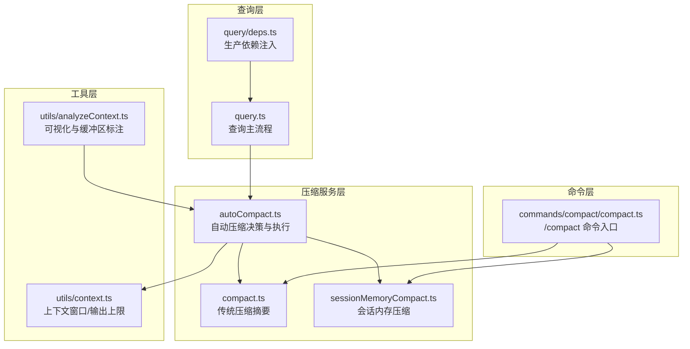
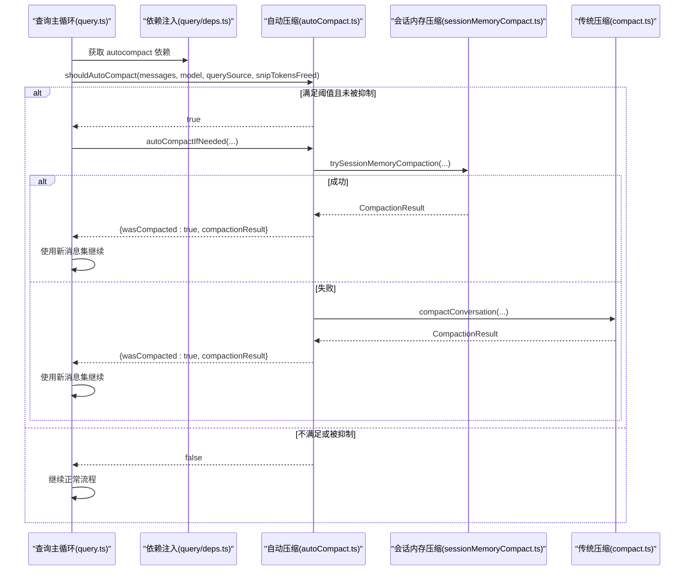
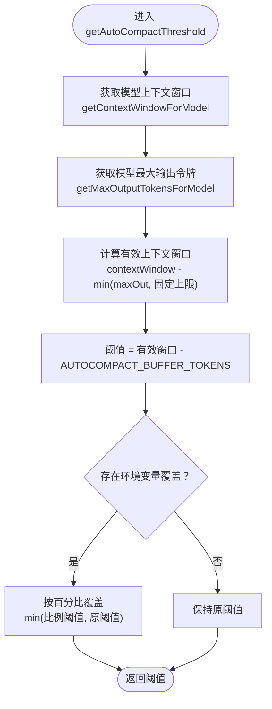
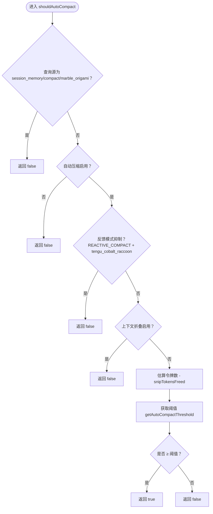
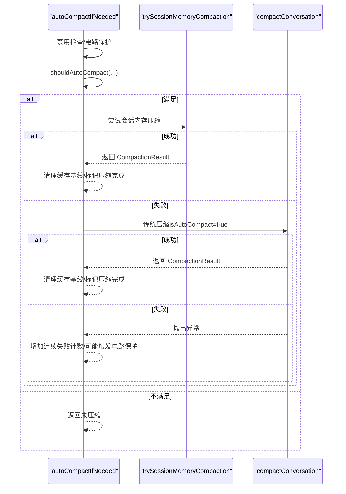
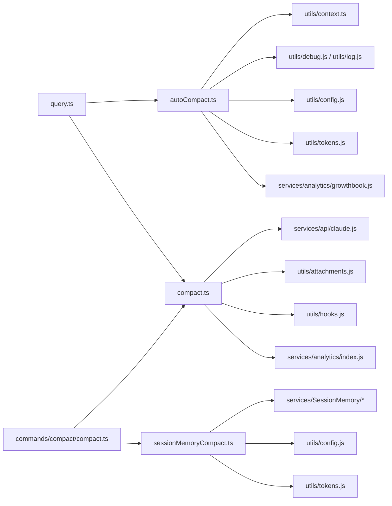

# 自动压缩机制

<cite>
**本文引用的文件**
- [src/services/compact/autoCompact.ts](file://src/services/compact/autoCompact.ts)
- [src/services/compact/compact.ts](file://src/services/compact/compact.ts)
- [src/services/compact/sessionMemoryCompact.ts](file://src/services/compact/sessionMemoryCompact.ts)
- [src/query/deps.ts](file://src/query/deps.ts)
- [src/query.ts](file://src/query.ts)
- [src/utils/context.ts](file://src/utils/context.ts)
- [src/utils/analyzeContext.ts](file://src/utils/analyzeContext.ts)
- [src/commands/compact/compact.ts](file://src/commands/compact/compact.ts)
</cite>

## 目录
1. [简介](#简介)
2. [项目结构](#项目结构)
3. [核心组件](#核心组件)
4. [架构总览](#架构总览)
5. [详细组件分析](#详细组件分析)
6. [依赖关系分析](#依赖关系分析)
7. [性能考量](#性能考量)
8. [故障排除指南](#故障排除指南)
9. [结论](#结论)
10. [附录](#附录)

## 简介
本文件系统性阐述 Claude Code 的自动压缩机制，聚焦以下关键点：
- 自动压缩的触发条件与阈值计算
- getAutoCompactThreshold 的工作原理（有效上下文窗口、缓冲区令牌分配、环境变量覆盖）
- shouldAutoCompact 的决策逻辑（查询源检查、功能特性开关、递归防护）
- autoCompactIfNeeded 的完整执行流程（会话内存压缩优先尝试、失败重试与电路保护）
- 不同场景下的行为示例与最佳实践
- 性能优化建议与故障排除

## 项目结构
自动压缩相关代码主要分布在以下模块：
- 服务层：自动压缩决策与执行（autoCompact.ts）、传统压缩（compact.ts）、会话内存压缩（sessionMemoryCompact.ts）
- 查询入口：查询依赖注入（query/deps.ts）、查询主流程（query.ts）
- 工具层：上下文窗口与输出上限（utils/context.ts）、上下文可视化与缓冲区标注（utils/analyzeContext.ts）
- 命令层：/compact 命令入口（commands/compact/compact.ts）

**图表来源**
- [src/query/deps.ts:1-41](file://src/query/deps.ts#L1-L41)
- [src/query.ts:439-550](file://src/query.ts#L439-L550)
- [src/services/compact/autoCompact.ts:1-352](file://src/services/compact/autoCompact.ts#L1-L352)
- [src/services/compact/compact.ts:1-800](file://src/services/compact/compact.ts#L1-L800)
- [src/services/compact/sessionMemoryCompact.ts:1-600](file://src/services/compact/sessionMemoryCompact.ts#L1-L600)
- [src/utils/context.ts:1-200](file://src/utils/context.ts#L1-L200)
- [src/utils/analyzeContext.ts:1100-1299](file://src/utils/analyzeContext.ts#L1100-L1299)
- [src/commands/compact/compact.ts:25-97](file://src/commands/compact/compact.ts#L25-L97)

**章节来源**
- [src/query/deps.ts:1-41](file://src/query/deps.ts#L1-L41)
- [src/query.ts:439-550](file://src/query.ts#L439-L550)
- [src/services/compact/autoCompact.ts:1-352](file://src/services/compact/autoCompact.ts#L1-L352)
- [src/services/compact/compact.ts:1-800](file://src/services/compact/compact.ts#L1-L800)
- [src/services/compact/sessionMemoryCompact.ts:1-600](file://src/services/compact/sessionMemoryCompact.ts#L1-L600)
- [src/utils/context.ts:1-200](file://src/utils/context.ts#L1-L200)
- [src/utils/analyzeContext.ts:1100-1299](file://src/utils/analyzeContext.ts#L1100-L1299)
- [src/commands/compact/compact.ts:25-97](file://src/commands/compact/compact.ts#L25-L97)

## 核心组件
- 自动压缩阈值与启用控制：负责计算有效上下文窗口、生成阈值、判定是否启用自动压缩，并在失败时进行电路保护。
- 决策函数 shouldAutoCompact：综合查询源、特性开关、上下文状态等，决定是否触发自动压缩。
- 执行函数 autoCompactIfNeeded：优先尝试会话内存压缩，失败则回退到传统压缩；处理异常并维护连续失败计数。
- 传统压缩 compactConversation：对消息进行摘要生成、附件重建、钩子处理与事件上报。
- 会话内存压缩 trySessionMemoryCompaction：从会话记忆中提取内容作为摘要，保留最小必要消息集合。

**章节来源**
- [src/services/compact/autoCompact.ts:72-239](file://src/services/compact/autoCompact.ts#L72-L239)
- [src/services/compact/autoCompact.ts:241-351](file://src/services/compact/autoCompact.ts#L241-L351)
- [src/services/compact/compact.ts:387-763](file://src/services/compact/compact.ts#L387-L763)
- [src/services/compact/sessionMemoryCompact.ts:514-600](file://src/services/compact/sessionMemoryCompact.ts#L514-L600)

## 架构总览
自动压缩在查询主循环中被调用，通过依赖注入获取 autoCompactIfNeeded 并在每次请求前评估是否需要压缩。若满足阈值且未被抑制，则优先尝试会话内存压缩，否则执行传统压缩。压缩成功后，查询主循环继续使用新的消息集进行后续处理。

**图表来源**
- [src/query.ts:454-467](file://src/query.ts#L454-L467)
- [src/query/deps.ts:21-40](file://src/query/deps.ts#L21-L40)
- [src/services/compact/autoCompact.ts:160-239](file://src/services/compact/autoCompact.ts#L160-L239)
- [src/services/compact/autoCompact.ts:241-351](file://src/services/compact/autoCompact.ts#L241-L351)
- [src/services/compact/sessionMemoryCompact.ts:514-600](file://src/services/compact/sessionMemoryCompact.ts#L514-L600)
- [src/services/compact/compact.ts:387-763](file://src/services/compact/compact.ts#L387-L763)

## 详细组件分析

### getAutoCompactThreshold：阈值计算与环境变量覆盖
- 有效上下文窗口计算
  - 从模型能力解析上下文窗口，支持 1M 上下文检测与环境变量覆盖。
  - 输出预留：为摘要生成预留最大输出令牌上限（不超过固定上限），最终得到有效上下文窗口。
- 阈值计算
  - 在有效上下文窗口基础上减去固定缓冲区（AUTOCOMPACT_BUFFER_TOKENS），得到自动压缩阈值。
- 环境变量覆盖
  - 支持百分比覆盖（按有效窗口比例动态调整阈值）与直接窗口上限覆盖（用于测试与调试）。
- 缓冲区标注
  - 在上下文可视化中，当自动压缩启用且阈值可用时，会以“保留空间”形式显示该缓冲区，避免用户误以为仍可继续填充。

**图表来源**
- [src/services/compact/autoCompact.ts:32-91](file://src/services/compact/autoCompact.ts#L32-L91)
- [src/utils/context.ts:51-98](file://src/utils/context.ts#L51-L98)

**章节来源**
- [src/services/compact/autoCompact.ts:32-91](file://src/services/compact/autoCompact.ts#L32-L91)
- [src/utils/context.ts:51-98](file://src/utils/context.ts#L51-L98)
- [src/utils/analyzeContext.ts:1131-1147](file://src/utils/analyzeContext.ts#L1131-L1147)

### shouldAutoCompact：决策逻辑与递归防护
- 查询源检查
  - 若查询源为 session_memory 或 compact，则直接返回 false，避免死锁与交叉影响。
  - 若为 marble_origami（上下文折叠代理），在启用上下文折叠时也返回 false，防止与折叠流程竞争。
- 功能特性开关
  - 支持通过环境变量禁用自动压缩（DISABLE_COMPACT、DISABLE_AUTO_COMPACT）。
  - 用户配置项（全局设置）控制是否启用自动压缩。
- 反馈模式抑制
  - 在反馈模式（REACTIVE_COMPACT）下，若处于特定反馈模式（tengu_cobalt_raccoon），抑制主动自动压缩，交由反馈路径处理。
- 上下文折叠抑制
  - 当上下文折叠开启时，抑制主动自动压缩，避免与折叠的提交/阻断流程冲突。
- 阈值判断
  - 计算当前消息估算令牌数与阈值，结合 snipTokensFreed（剪枝节省量）进行修正，决定是否触发。

**图表来源**
- [src/services/compact/autoCompact.ts:160-239](file://src/services/compact/autoCompact.ts#L160-L239)

**章节来源**
- [src/services/compact/autoCompact.ts:160-239](file://src/services/compact/autoCompact.ts#L160-L239)

### autoCompactIfNeeded：完整执行流程与电路保护
- 禁用检查
  - 若全局禁用压缩（DISABLE_COMPACT），直接返回未压缩。
- 电路保护
  - 若连续失败次数达到阈值（MAX_CONSECUTIVE_AUTOCOMPACT_FAILURES），跳过后续尝试，避免无意义的 API 调用。
- 决策与准备
  - 调用 shouldAutoCompact 判断是否需要压缩；收集重压缩信息（上次压缩状态、阈值、查询源）。
- 会话内存压缩优先尝试
  - 优先尝试 trySessionMemoryCompaction，成功即结束；失败则回退到传统压缩。
- 传统压缩
  - 调用 compactConversation，传入 isAutoCompact 标记与重压缩信息；成功后清理缓存基线并标记压缩完成。
- 异常处理与失败计数
  - 非用户中断错误计入连续失败计数；超过阈值时记录告警日志并停止后续尝试。

**图表来源**
- [src/services/compact/autoCompact.ts:241-351](file://src/services/compact/autoCompact.ts#L241-L351)
- [src/services/compact/sessionMemoryCompact.ts:514-600](file://src/services/compact/sessionMemoryCompact.ts#L514-L600)
- [src/services/compact/compact.ts:387-763](file://src/services/compact/compact.ts#L387-L763)

**章节来源**
- [src/services/compact/autoCompact.ts:241-351](file://src/services/compact/autoCompact.ts#L241-L351)

### 传统压缩 compactConversation：摘要生成与后处理
- 钩子与进度
  - 执行预压缩钩子与后压缩钩子，支持自定义指令合并与用户提示消息。
- 摘要生成
  - 循环尝试生成摘要，若因请求自身超长而失败，采用“丢弃最早 API 轮次组”的兜底策略重试。
- 附件与钩子结果
  - 并行生成文件/异步代理/计划/技能等附件，以及会话开始钩子结果。
- 边界标记与事件上报
  - 创建压缩边界标记，计算真实后压缩令牌数（考虑系统提示、工具与用户上下文），上报 tengu_compact 事件。
- 后处理
  - 通知提示缓存断开检测、标记压缩完成、重写会话元数据、写入会话片段（可选）。

**章节来源**
- [src/services/compact/compact.ts:387-763](file://src/services/compact/compact.ts#L387-L763)

### 会话内存压缩 trySessionMemoryCompaction：基于历史记忆的摘要
- 特性开关
  - 通过环境变量与特性门控控制是否启用会话内存压缩。
- 配置初始化
  - 从远程配置加载最小保留令牌数、最少文本块消息数与最大保留令牌数等参数。
- 索引计算
  - 基于上次摘要位置与配置，计算保留消息的起始索引，确保不破坏 tool_use/tool_result 对齐与思考块合并。
- 结果构建
  - 使用会话记忆内容生成摘要消息，保留必要的附件与钩子结果，构建 CompactionResult。

**章节来源**
- [src/services/compact/sessionMemoryCompact.ts:403-432](file://src/services/compact/sessionMemoryCompact.ts#L403-L432)
- [src/services/compact/sessionMemoryCompact.ts:514-600](file://src/services/compact/sessionMemoryCompact.ts#L514-L600)
- [src/services/compact/sessionMemoryCompact.ts:324-397](file://src/services/compact/sessionMemoryCompact.ts#L324-L397)

### 查询主循环中的集成
- 依赖注入
  - 生产依赖中注入 autoCompactIfNeeded，供查询主流程调用。
- 自动压缩调用
  - 在构建查询输入前后调用 autocompact，根据返回结果更新消息集与跟踪状态。
- 失败传播
  - 若自动压缩失败，将连续失败计数传播至下一轮，触发电路保护。

**章节来源**
- [src/query/deps.ts:21-40](file://src/query/deps.ts#L21-L40)
- [src/query.ts:454-467](file://src/query.ts#L454-L467)
- [src/query.ts:536-543](file://src/query.ts#L536-L543)

## 依赖关系分析
- 模块耦合
  - autoCompact.ts 依赖上下文窗口与输出上限工具、特性开关、错误识别与日志工具。
  - compact.ts 依赖 API 调用、附件生成、钩子、事件上报与会话存储。
  - sessionMemoryCompact.ts 依赖会话记忆读取、配置加载与工具搜索。
- 外部依赖
  - 查询主流程通过依赖注入解耦具体实现，便于测试与替换。
- 循环依赖规避
  - 在需要延迟导入的场景（如上下文折叠）使用 require 包裹，避免初始化时的循环依赖。

**图表来源**
- [src/services/compact/autoCompact.ts:1-30](file://src/services/compact/autoCompact.ts#L1-L30)
- [src/services/compact/compact.ts:1-120](file://src/services/compact/compact.ts#L1-L120)
- [src/services/compact/sessionMemoryCompact.ts:1-60](file://src/services/compact/sessionMemoryCompact.ts#L1-L60)
- [src/query.ts:439-550](file://src/query.ts#L439-L550)
- [src/commands/compact/compact.ts:25-97](file://src/commands/compact/compact.ts#L25-L97)

**章节来源**
- [src/services/compact/autoCompact.ts:1-30](file://src/services/compact/autoCompact.ts#L1-L30)
- [src/services/compact/compact.ts:1-120](file://src/services/compact/compact.ts#L1-L120)
- [src/services/compact/sessionMemoryCompact.ts:1-60](file://src/services/compact/sessionMemoryCompact.ts#L1-L60)
- [src/query.ts:439-550](file://src/query.ts#L439-L550)
- [src/commands/compact/compact.ts:25-97](file://src/commands/compact/compact.ts#L25-L97)

## 性能考量
- 预留输出令牌上限
  - 为摘要生成预留最大输出令牌上限，避免压缩后剩余上下文不足导致的二次压缩风暴。
- 固定缓冲区与百分比覆盖
  - AUTOCOMPACT_BUFFER_TOKENS 提供稳定的安全边际；百分比覆盖与窗口上限覆盖便于测试与快速调参。
- 会话内存压缩优先
  - 会话内存压缩通常更高效且对上下文影响更小，优先尝试可减少 API 调用与成本。
- 电路保护
  - 连续失败计数与阈值限制避免在不可恢复的超限情况下持续重试，降低 API 调用与资源浪费。
- 兜底策略
  - 传统压缩的“丢弃最早 API 轮次组”策略在极端情况下保证用户可继续使用，避免卡死。

[本节为通用性能讨论，无需特定文件引用]

## 故障排除指南
- 症状：自动压缩频繁失败
  - 排查要点：检查连续失败计数是否达到阈值；查看是否有不可恢复的“提示过长”错误；确认是否启用了反馈模式或上下文折叠抑制。
  - 处理建议：等待下一轮自然重试；检查模型输出上限与上下文窗口配置；必要时临时禁用自动压缩。
- 症状：自动压缩不触发
  - 排查要点：确认 DISABLE_COMPACT/DISABLE_AUTO_COMPACT 环境变量；检查用户配置项；核对查询源是否被抑制。
  - 处理建议：调整阈值覆盖或窗口覆盖；在反馈模式下改用反馈路径；在上下文折叠模式下等待折叠流程处理。
- 症状：压缩后上下文仍超限
  - 排查要点：确认 truePostCompactTokenCount 是否接近阈值；检查系统提示、工具与用户上下文叠加后的估算。
  - 处理建议：适当提高阈值覆盖；减少系统提示长度；启用会话内存压缩以减少历史消息。
- 症状：图像/文档导致压缩请求超长
  - 排查要点：检查压缩前是否已剥离图像/文档块；确认传统压缩的兜底策略是否生效。
  - 处理建议：确保消息预处理阶段移除图像/文档；必要时手动缩短对话历史。

**章节来源**
- [src/services/compact/autoCompact.ts:257-265](file://src/services/compact/autoCompact.ts#L257-L265)
- [src/services/compact/compact.ts:460-491](file://src/services/compact/compact.ts#L460-L491)
- [src/services/compact/compact.ts:145-200](file://src/services/compact/compact.ts#L145-L200)

## 结论
自动压缩机制通过“阈值计算 + 决策抑制 + 优先级尝试 + 电路保护”的组合，在保证用户体验的同时，有效控制上下文膨胀风险。getAutoCompactThreshold 提供稳定的阈值基础，shouldAutoCompact 严格约束触发条件，autoCompactIfNeeded 则在失败与重试之间取得平衡。配合会话内存压缩与传统压缩的双轨策略，系统能够在不同场景下稳健运行。

[本节为总结性内容，无需特定文件引用]

## 附录

### 场景示例（基于实现行为）
- 场景 A：普通对话，令牌使用接近阈值
  - 行为：shouldAutoCompact 返回 true，autoCompactIfNeeded 优先尝试会话内存压缩；成功后继续查询。
- 场景 B：反馈模式开启
  - 行为：即使接近阈值，主动自动压缩被抑制；由反馈路径处理超限。
- 场景 C：上下文折叠开启
  - 行为：主动自动压缩被抑制；折叠流程负责管理上下文，避免冲突。
- 场景 D：传统压缩首次失败
  - 行为：增加连续失败计数；若未达阈值，下一轮继续尝试；若已达阈值，触发电路保护并跳过后续尝试。
- 场景 E：压缩请求自身超长
  - 行为：采用“丢弃最早 API 轮次组”的兜底策略，重试直至可接受范围。

**章节来源**
- [src/services/compact/autoCompact.ts:160-239](file://src/services/compact/autoCompact.ts#L160-L239)
- [src/services/compact/autoCompact.ts:241-351](file://src/services/compact/autoCompact.ts#L241-L351)
- [src/services/compact/compact.ts:460-491](file://src/services/compact/compact.ts#L460-L491)