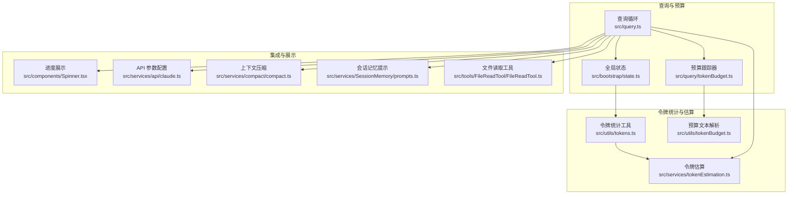
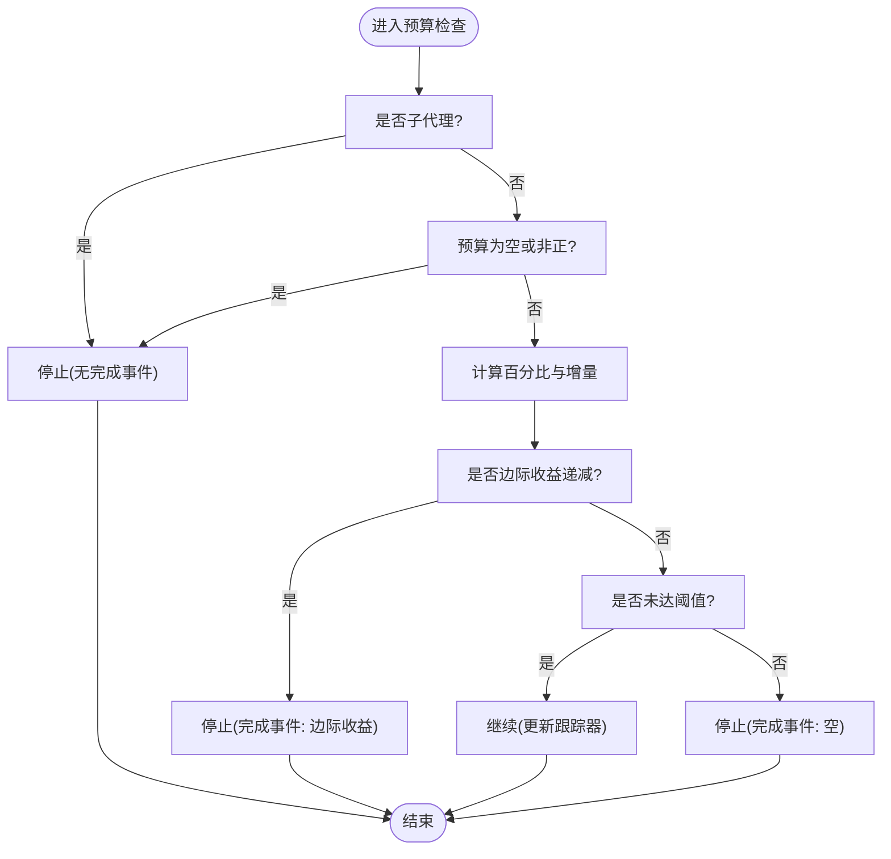
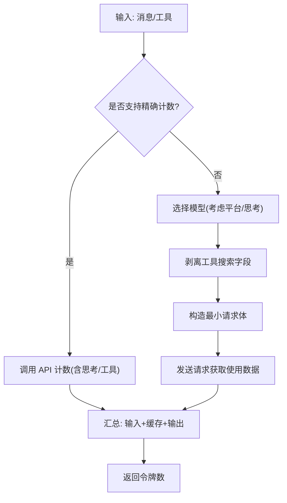
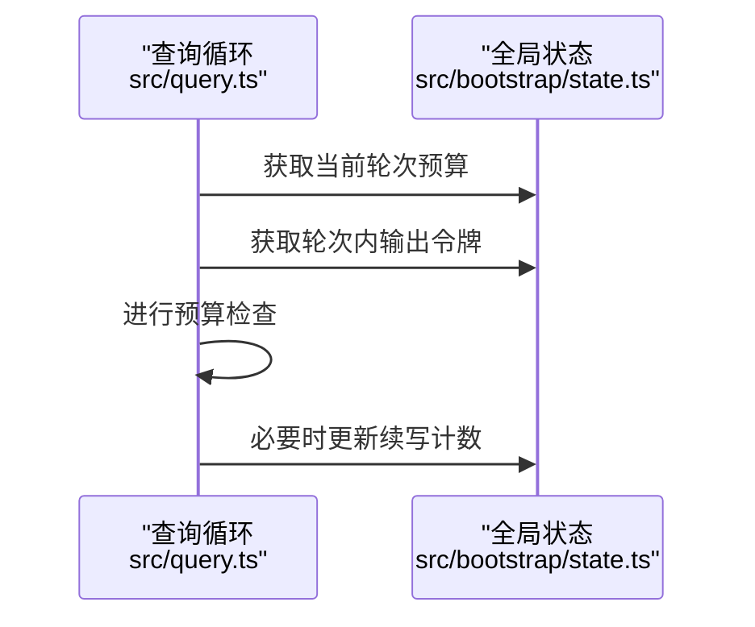
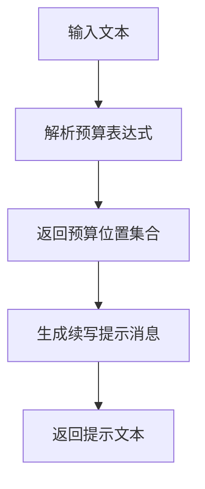
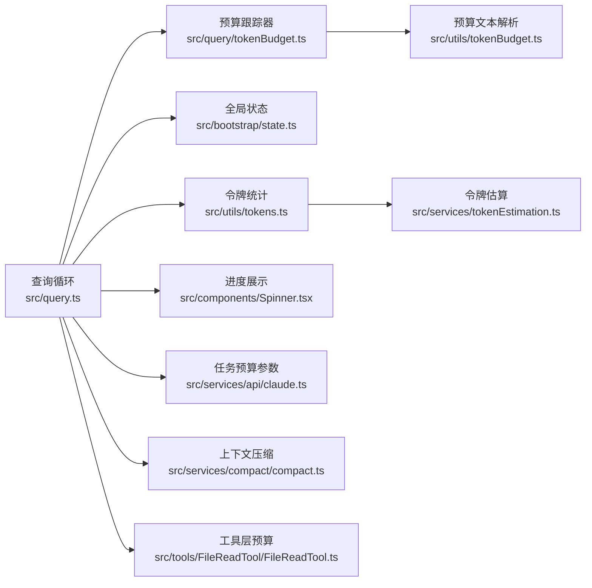

# 令牌预算控制系统

<cite>
**本文档引用的文件**
- [src/query.ts](file://src/query.ts)
- [src/query/tokenBudget.ts](file://src/query/tokenBudget.ts)
- [src/utils/tokenBudget.ts](file://src/utils/tokenBudget.ts)
- [src/services/tokenEstimation.ts](file://src/services/tokenEstimation.ts)
- [src/utils/tokens.ts](file://src/utils/tokens.ts)
- [src/bootstrap/state.ts](file://src/bootstrap/state.ts)
- [src/components/Spinner.tsx](file://src/components/Spinner.tsx)
- [src/services/api/claude.ts](file://src/services/api/claude.ts)
- [src/services/compact/compact.ts](file://src/services/compact/compact.ts)
- [src/services/SessionMemory/prompts.ts](file://src/services/SessionMemory/prompts.ts)
- [src/tools/FileReadTool/FileReadTool.ts](file://src/tools/FileReadTool/FileReadTool.ts)
</cite>

## 目录
1. [简介](#简介)
2. [项目结构](#项目结构)
3. [核心组件](#核心组件)
4. [架构总览](#架构总览)
5. [详细组件分析](#详细组件分析)
6. [依赖关系分析](#依赖关系分析)
7. [性能考量](#性能考量)
8. [故障排查指南](#故障排查指南)
9. [结论](#结论)
10. [附录](#附录)

## 简介
本文件面向 Claude Code 的“令牌预算控制系统”，系统性阐述令牌预算的计算方法、跟踪机制与分配策略；详解预算跟踪器的实现（输入、输出、工具结果三类令牌的分类统计思路）、预算超限检测与回退策略、以及预算与模型选择、上下文压缩、工具使用的协同机制。文档同时提供具体代码路径示例，展示预算控制如何影响查询决策与资源分配，并给出优化建议与异常处理策略。

## 项目结构
围绕令牌预算控制的关键模块分布如下：
- 查询循环与预算检查：src/query.ts 中的主查询循环在关键节点调用预算检查逻辑
- 预算跟踪器与决策：src/query/tokenBudget.ts 提供预算跟踪器与决策函数
- 预算文本解析与提示：src/utils/tokenBudget.ts 提供预算文本解析与续写提示生成
- 令牌计数与估算：src/services/tokenEstimation.ts 提供 API 计数与粗估函数
- 上下文窗口与输出令牌统计：src/utils/tokens.ts 提供基于使用数据与消息内容的令牌统计
- 全局状态与预算快照：src/bootstrap/state.ts 维护当前轮次预算与输出令牌快照
- UI 展示：src/components/Spinner.tsx 基于预算进行进度展示
- API 侧任务预算参数：src/services/api/claude.ts 支持向后端传递任务预算
- 上下文压缩与文件选择：src/services/compact/compact.ts 在压缩中考虑预算限制
- 会话记忆预算约束：src/services/SessionMemory/prompts.ts 对会话记忆文件大小进行预算约束
- 工具层预算约束：src/tools/FileReadTool/FileReadTool.ts 在读取文件时考虑图像等的预算与压缩



**图表来源**
- [src/query.ts:1308-1358](file://src/query.ts#L1308-L1358)
- [src/query/tokenBudget.ts:45-93](file://src/query/tokenBudget.ts#L45-L93)
- [src/utils/tokenBudget.ts:21-73](file://src/utils/tokenBudget.ts#L21-L73)
- [src/services/tokenEstimation.ts:124-201](file://src/services/tokenEstimation.ts#L124-L201)
- [src/utils/tokens.ts:226-262](file://src/utils/tokens.ts#L226-L262)
- [src/bootstrap/state.ts:725-743](file://src/bootstrap/state.ts#L725-L743)
- [src/components/Spinner.tsx:262-280](file://src/components/Spinner.tsx#L262-L280)
- [src/services/api/claude.ts:479-501](file://src/services/api/claude.ts#L479-L501)
- [src/services/compact/compact.ts:1183-1183](file://src/services/compact/compact.ts#L1183-L1183)
- [src/services/SessionMemory/prompts.ts:184-184](file://src/services/SessionMemory/prompts.ts#L184-L184)
- [src/tools/FileReadTool/FileReadTool.ts:866-866](file://src/tools/FileReadTool/FileReadTool.ts#L866-L866)

**章节来源**
- [src/query.ts:1308-1358](file://src/query.ts#L1308-L1358)
- [src/query/tokenBudget.ts:1-93](file://src/query/tokenBudget.ts#L1-L93)
- [src/utils/tokenBudget.ts:1-74](file://src/utils/tokenBudget.ts#L1-L74)
- [src/services/tokenEstimation.ts:1-496](file://src/services/tokenEstimation.ts#L1-L496)
- [src/utils/tokens.ts:1-262](file://src/utils/tokens.ts#L1-L262)
- [src/bootstrap/state.ts:725-743](file://src/bootstrap/state.ts#L725-L743)
- [src/components/Spinner.tsx:262-280](file://src/components/Spinner.tsx#L262-L280)
- [src/services/api/claude.ts:468-501](file://src/services/api/claude.ts#L468-L501)
- [src/services/compact/compact.ts:1183-1183](file://src/services/compact/compact.ts#L1183-L1183)
- [src/services/SessionMemory/prompts.ts:184-184](file://src/services/SessionMemory/prompts.ts#L184-L184)
- [src/tools/FileReadTool/FileReadTool.ts:866-866](file://src/tools/FileReadTool/FileReadTool.ts#L866-L866)

## 核心组件
- 预算跟踪器与决策
  - 跟踪器包含连续次数、上次增量、上次全局轮次令牌数与开始时间，用于判断是否继续或停止
  - 决策函数根据阈值与边际收益判定是否继续或停止，并记录完成事件
- 令牌统计与估算
  - 基于 API 的精确计数与多种场景下的粗估函数，覆盖文本、图片、工具结果、思考块等
  - 提供从使用数据推导上下文窗口大小、仅输出令牌等统计能力
- 全局状态与预算快照
  - 快照记录轮次起始输出令牌与当前预算，提供轮次内输出令牌统计与预算续写计数
- 预算文本解析与提示
  - 解析自然语言中的预算表达式，生成续写提示消息
- UI 进度展示
  - 基于预算与速率估算显示目标、剩余与 ETA
- API 侧任务预算
  - 向后端传递任务预算参数，确保模型侧预算感知
- 上下文压缩与工具层预算
  - 压缩与文件读取等流程中严格遵循预算约束

**章节来源**
- [src/query/tokenBudget.ts:6-93](file://src/query/tokenBudget.ts#L6-L93)
- [src/services/tokenEstimation.ts:124-325](file://src/services/tokenEstimation.ts#L124-L325)
- [src/utils/tokens.ts:226-262](file://src/utils/tokens.ts#L226-L262)
- [src/bootstrap/state.ts:725-743](file://src/bootstrap/state.ts#L725-L743)
- [src/utils/tokenBudget.ts:21-73](file://src/utils/tokenBudget.ts#L21-L73)
- [src/components/Spinner.tsx:262-280](file://src/components/Spinner.tsx#L262-L280)
- [src/services/api/claude.ts:479-501](file://src/services/api/claude.ts#L479-L501)
- [src/services/compact/compact.ts:1183-1183](file://src/services/compact/compact.ts#L1183-L1183)
- [src/tools/FileReadTool/FileReadTool.ts:866-866](file://src/tools/FileReadTool/FileReadTool.ts#L866-L866)

## 架构总览
以下序列图展示了查询循环在每次迭代中如何进行预算检查与决策，以及后续的工具执行与上下文更新：

```mermaid
sequenceDiagram
participant Loop as "查询循环<br/>src/query.ts"
participant Tracker as "预算跟踪器<br/>src/query/tokenBudget.ts"
participant State as "全局状态<br/>src/bootstrap/state.ts"
participant Est as "令牌估算<br/>src/services/tokenEstimation.ts"
participant UI as "进度展示<br/>src/components/Spinner.tsx"
Loop->>State : 读取当前轮次预算与输出令牌
Loop->>Tracker : 检查预算(预算, 全局轮次令牌)
alt 继续
Tracker-->>Loop : 返回继续决策(百分比/提示)
Loop->>UI : 更新进度(目标/剩余/ETA)
Loop->>Loop : 插入续写提示消息并继续
else 停止
Tracker-->>Loop : 返回停止决策(完成事件)
Loop->>Loop : 执行工具执行与上下文更新
end
Loop->>Est : 必要时进行令牌估算
```

**图表来源**
- [src/query.ts:1308-1358](file://src/query.ts#L1308-L1358)
- [src/query/tokenBudget.ts:45-93](file://src/query/tokenBudget.ts#L45-L93)
- [src/bootstrap/state.ts:725-743](file://src/bootstrap/state.ts#L725-L743)
- [src/services/tokenEstimation.ts:124-201](file://src/services/tokenEstimation.ts#L124-L201)
- [src/components/Spinner.tsx:262-280](file://src/components/Spinner.tsx#L262-L280)

## 详细组件分析

### 预算跟踪器与决策
- 关键点
  - 完成阈值：达到预算的 90% 即可视为接近完成
  - 边际收益阈值：连续多次检查中，若两次增量均低于阈值，则判定边际收益递减
  - 决策返回类型：继续（附带续写提示）或停止（附带完成事件）
- 数据结构
  - 跟踪器字段：连续次数、上次增量、上次全局轮次令牌数、开始时间
  - 决策类型：继续决策与停止决策（含完成事件）



**图表来源**
- [src/query/tokenBudget.ts:45-93](file://src/query/tokenBudget.ts#L45-L93)

**章节来源**
- [src/query/tokenBudget.ts:1-93](file://src/query/tokenBudget.ts#L1-L93)

### 令牌统计与估算
- 精确计数
  - 使用 API 进行令牌计数，支持思考块启用与工具过滤
  - 支持 Vertex 与 Bedrock 的特殊路径
- 粗估函数
  - 基于字符长度与文件类型调整字节/令牌比率
  - 覆盖文本、图片、文档、工具结果、思考块、红acted 思考等
- 上下文窗口统计
  - 基于最后 API 响应使用数据与新增消息的粗估，避免重复计数
  - 处理并行工具调用导致的消息拆分情况



**图表来源**
- [src/services/tokenEstimation.ts:124-201](file://src/services/tokenEstimation.ts#L124-L201)
- [src/services/tokenEstimation.ts:251-325](file://src/services/tokenEstimation.ts#L251-L325)

**章节来源**
- [src/services/tokenEstimation.ts:124-325](file://src/services/tokenEstimation.ts#L124-L325)
- [src/utils/tokens.ts:226-262](file://src/utils/tokens.ts#L226-L262)

### 全局状态与预算快照
- 快照机制
  - 记录轮次起始输出令牌与当前预算，重置续写计数
  - 提供轮次内输出令牌统计与预算续写计数
- 与查询循环协作
  - 查询循环在每次迭代前读取预算与输出令牌，驱动预算检查



**图表来源**
- [src/bootstrap/state.ts:725-743](file://src/bootstrap/state.ts#L725-L743)
- [src/query.ts:1308-1358](file://src/query.ts#L1308-L1358)

**章节来源**
- [src/bootstrap/state.ts:725-743](file://src/bootstrap/state.ts#L725-L743)

### 预算文本解析与提示
- 功能
  - 解析自然语言中的预算表达式（简写与详述），定位预算位置
  - 生成续写提示消息，鼓励继续而非总结
- 应用
  - 在预算检查决定继续时，插入续写提示消息到对话中



**图表来源**
- [src/utils/tokenBudget.ts:21-73](file://src/utils/tokenBudget.ts#L21-L73)

**章节来源**
- [src/utils/tokenBudget.ts:1-74](file://src/utils/tokenBudget.ts#L1-L74)

### UI 进度展示
- 显示逻辑
  - 当存在有效预算时，显示目标、已用、百分比与预估剩余时间
  - 超出预算时以对勾标识“已达标”
- 数据来源
  - 来自全局状态的预算与轮次内输出令牌统计

**章节来源**
- [src/components/Spinner.tsx:262-280](file://src/components/Spinner.tsx#L262-L280)
- [src/bootstrap/state.ts:725-743](file://src/bootstrap/state.ts#L725-L743)

### API 侧任务预算
- 参数
  - 任务预算以令牌为单位，支持 total 与 remaining 字段
  - 自动注入相关 beta 头部
- 影响
  - 使模型侧具备预算感知，有助于在服务端层面进行资源分配与回退

**章节来源**
- [src/services/api/claude.ts:468-501](file://src/services/api/claude.ts#L468-L501)

### 上下文压缩与工具使用协调
- 压缩流程
  - 文件选择基于最近性，同时受文件数量与令牌预算双重限制
  - 压缩后预算剩余需满足后续流程需求
- 会话记忆
  - 当会话记忆超过最大令牌预算时，要求主动压缩以符合预算

**章节来源**
- [src/services/compact/compact.ts:1183-1183](file://src/services/compact/compact.ts#L1183-L1183)
- [src/services/compact/compact.ts:1401-1412](file://src/services/compact/compact.ts#L1401-L1412)
- [src/services/SessionMemory/prompts.ts:184-184](file://src/services/SessionMemory/prompts.ts#L184-L184)

### 工具层预算约束
- 图像与文件读取
  - 图像有独立尺寸限制与预算/压缩约束
  - 文件读取时检查是否在预算范围内

**章节来源**
- [src/tools/FileReadTool/FileReadTool.ts:866-866](file://src/tools/FileReadTool/FileReadTool.ts#L866-L866)
- [src/tools/FileReadTool/FileReadTool.ts:1093-1135](file://src/tools/FileReadTool/FileReadTool.ts#L1093-L1135)

## 依赖关系分析
- 查询循环依赖预算跟踪器与全局状态，通过状态提供的预算与输出令牌进行决策
- 预算跟踪器依赖预算文本解析生成续写提示
- 令牌统计与估算为查询循环提供上下文窗口与输出令牌的可靠依据
- UI 层依赖全局状态进行进度展示
- API 层支持任务预算参数，增强服务端预算感知
- 压缩与工具层在各自流程中遵循预算约束



**图表来源**
- [src/query.ts:1308-1358](file://src/query.ts#L1308-L1358)
- [src/query/tokenBudget.ts:1-93](file://src/query/tokenBudget.ts#L1-L93)
- [src/utils/tokenBudget.ts:1-74](file://src/utils/tokenBudget.ts#L1-L74)
- [src/utils/tokens.ts:1-262](file://src/utils/tokens.ts#L1-L262)
- [src/services/tokenEstimation.ts:1-496](file://src/services/tokenEstimation.ts#L1-L496)
- [src/bootstrap/state.ts:725-743](file://src/bootstrap/state.ts#L725-L743)
- [src/components/Spinner.tsx:262-280](file://src/components/Spinner.tsx#L262-L280)
- [src/services/api/claude.ts:479-501](file://src/services/api/claude.ts#L479-L501)
- [src/services/compact/compact.ts:1183-1183](file://src/services/compact/compact.ts#L1183-L1183)
- [src/tools/FileReadTool/FileReadTool.ts:866-866](file://src/tools/FileReadTool/FileReadTool.ts#L866-L866)

**章节来源**
- [src/query.ts:1308-1358](file://src/query.ts#L1308-L1358)
- [src/query/tokenBudget.ts:1-93](file://src/query/tokenBudget.ts#L1-L93)
- [src/utils/tokenBudget.ts:1-74](file://src/utils/tokenBudget.ts#L1-L74)
- [src/utils/tokens.ts:1-262](file://src/utils/tokens.ts#L1-L262)
- [src/services/tokenEstimation.ts:1-496](file://src/services/tokenEstimation.ts#L1-L496)
- [src/bootstrap/state.ts:725-743](file://src/bootstrap/state.ts#L725-L743)
- [src/components/Spinner.tsx:262-280](file://src/components/Spinner.tsx#L262-L280)
- [src/services/api/claude.ts:479-501](file://src/services/api/claude.ts#L479-L501)
- [src/services/compact/compact.ts:1183-1183](file://src/services/compact/compact.ts#L1183-L1183)
- [src/tools/FileReadTool/FileReadTool.ts:866-866](file://src/tools/FileReadTool/FileReadTool.ts#L866-L866)

## 性能考量
- 估算优先：在 API 不可用或需要快速反馈时，优先使用粗估函数，减少等待时间
- 并行工具调用的计数一致性：通过锚定同一响应的首个拆分消息，确保后续估算包含所有交错的工具结果
- 边际收益检测：避免在低产出情况下继续消耗预算，提升整体效率
- UI 速率估算：结合时间与令牌增量估算剩余时间，改善用户体验

[本节为通用指导，无需特定文件来源]

## 故障排查指南
- 预算检查未生效
  - 确认功能开关开启且预算非空/非负
  - 检查是否为子代理（子代理不参与预算检查）
- 预算过早停止
  - 检查边际收益阈值是否触发；适当提高阈值或放宽条件
- 预算未正确统计
  - 确认使用数据是否来自真实响应（排除合成消息）
  - 检查并行工具调用导致的消息拆分是否被正确锚定
- UI 未显示预算
  - 确认全局状态中预算已快照且大于 0
- 任务预算未传给 API
  - 检查任务预算对象与 beta 头部是否正确注入

**章节来源**
- [src/query/tokenBudget.ts:51-52](file://src/query/tokenBudget.ts#L51-L52)
- [src/utils/tokens.ts:226-262](file://src/utils/tokens.ts#L226-L262)
- [src/bootstrap/state.ts:725-743](file://src/bootstrap/state.ts#L725-L743)
- [src/services/api/claude.ts:479-501](file://src/services/api/claude.ts#L479-L501)

## 结论
该系统通过“预算跟踪器 + 令牌统计与估算 + 全局状态 + UI 展示”的协同，实现了对查询过程的精细化预算控制。预算检查在查询循环的关键节点执行，结合边际收益检测与续写提示，既保证了资源安全，又提升了用户交互体验。配合 API 侧任务预算、上下文压缩与工具层预算约束，系统在多场景下实现了预算与性能的平衡。

[本节为总结，无需特定文件来源]

## 附录
- 代码路径示例（仅路径，不含具体代码内容）
  - 预算检查与决策：[src/query.ts:1308-1358](file://src/query.ts#L1308-L1358)
  - 预算跟踪器与决策函数：[src/query/tokenBudget.ts:45-93](file://src/query/tokenBudget.ts#L45-L93)
  - 预算文本解析与提示：[src/utils/tokenBudget.ts:21-73](file://src/utils/tokenBudget.ts#L21-L73)
  - 令牌估算（API 计数与粗估）：[src/services/tokenEstimation.ts:124-325](file://src/services/tokenEstimation.ts#L124-L325)
  - 上下文窗口统计与输出令牌统计：[src/utils/tokens.ts:226-262](file://src/utils/tokens.ts#L226-L262)
  - 全局状态预算快照与统计：[src/bootstrap/state.ts:725-743](file://src/bootstrap/state.ts#L725-L743)
  - UI 进度展示：[src/components/Spinner.tsx:262-280](file://src/components/Spinner.tsx#L262-L280)
  - API 侧任务预算参数：[src/services/api/claude.ts:479-501](file://src/services/api/claude.ts#L479-L501)
  - 上下文压缩预算约束：[src/services/compact/compact.ts:1183-1183](file://src/services/compact/compact.ts#L1183-L1183)
  - 会话记忆预算约束提示：[src/services/SessionMemory/prompts.ts:184-184](file://src/services/SessionMemory/prompts.ts#L184-L184)
  - 工具层预算约束（图像/文件读取）：[src/tools/FileReadTool/FileReadTool.ts:866-866](file://src/tools/FileReadTool/FileReadTool.ts#L866-L866)

[本节为附录，无需特定文件来源]