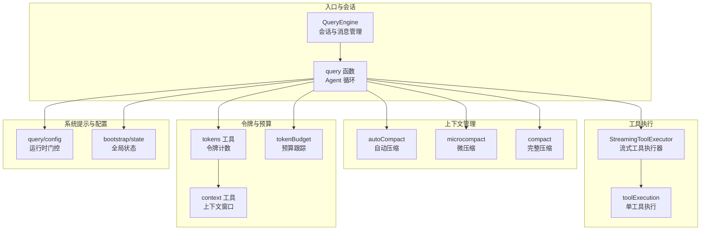
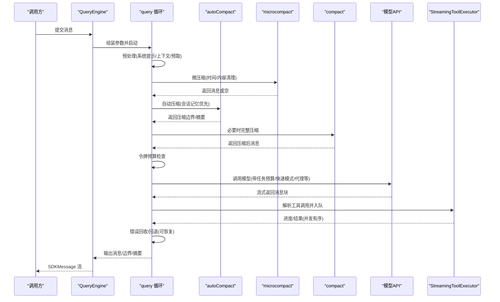
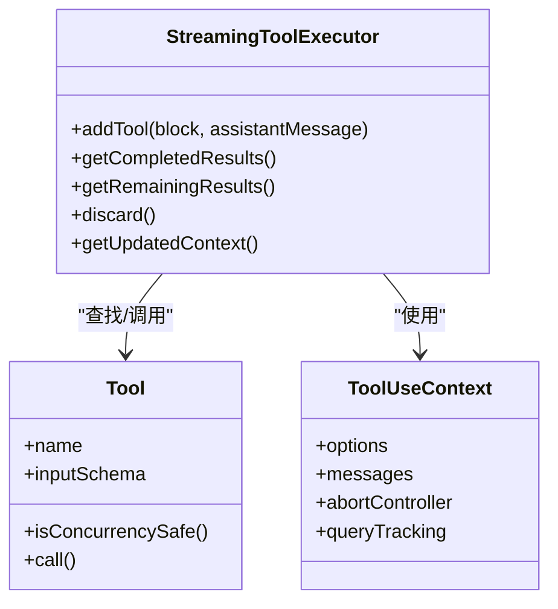
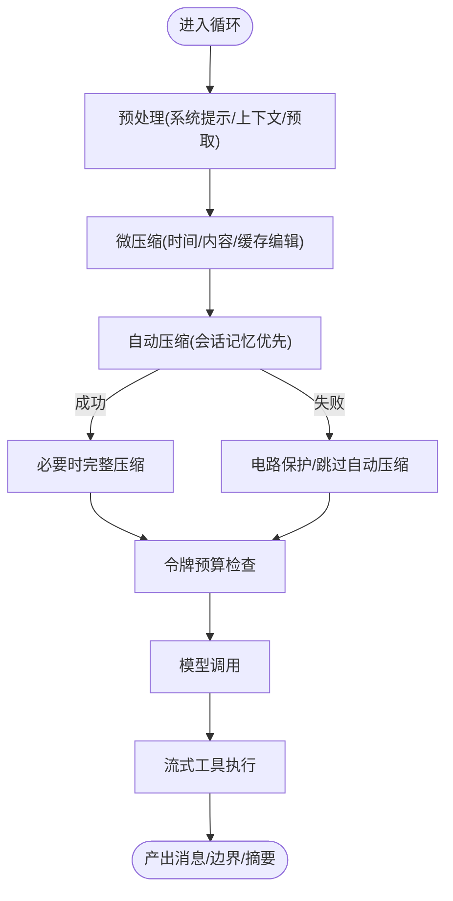
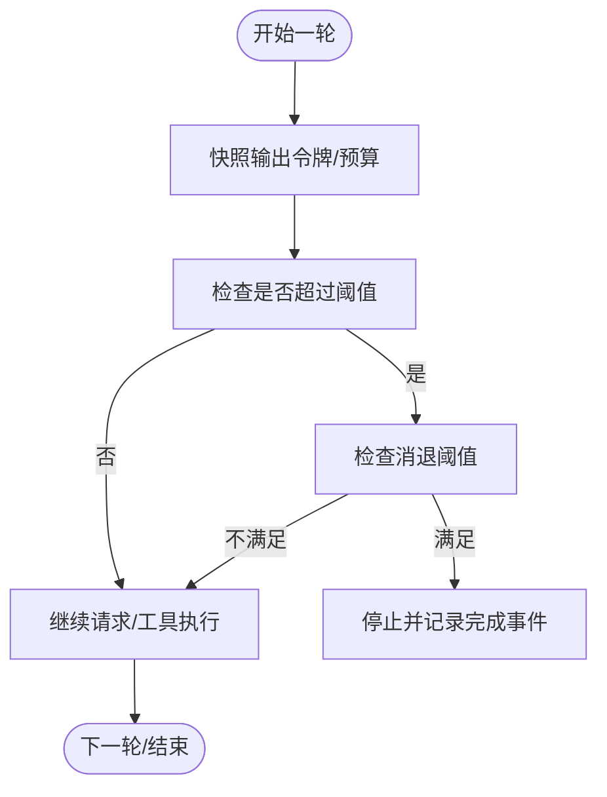
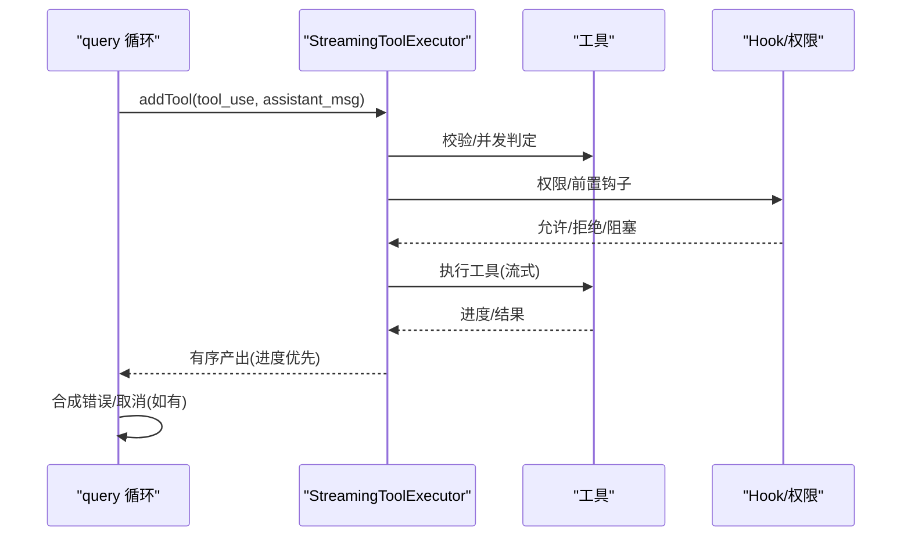
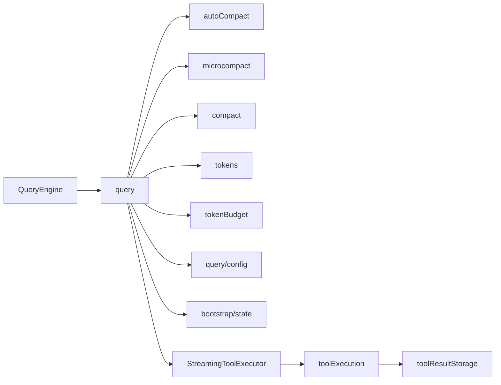

# 查询引擎系统

<cite>
**本文引用的文件**
- [src/query.ts](file://src/query.ts)
- [src/QueryEngine.ts](file://src/QueryEngine.ts)
- [src/query/config.ts](file://src/query/config.ts)
- [src/query/tokenBudget.ts](file://src/query/tokenBudget.ts)
- [src/bootstrap/state.ts](file://src/bootstrap/state.ts)
- [src/services/tools/StreamingToolExecutor.ts](file://src/services/tools/StreamingToolExecutor.ts)
- [src/utils/tokens.ts](file://src/utils/tokens.ts)
- [src/services/compact/compact.ts](file://src/services/compact/compact.ts)
- [src/services/compact/autoCompact.ts](file://src/services/compact/autoCompact.ts)
- [src/services/compact/microcompact.ts](file://src/services/compact/microcompact.ts)
- [src/utils/toolResultStorage.ts](file://src/utils/toolResultStorage.ts)
- [src/services/tools/toolExecution.ts](file://src/services/tools/toolExecution.ts)
- [src/utils/context.ts](file://src/utils/context.ts)
</cite>

## 目录
1. [引言](#引言)
2. [项目结构](#项目结构)
3. [核心组件](#核心组件)
4. [架构总览](#架构总览)
5. [详细组件分析](#详细组件分析)
6. [依赖关系分析](#依赖关系分析)
7. [性能考虑](#性能考虑)
8. [故障排除指南](#故障排除指南)
9. [结论](#结论)
10. [附录](#附录)

## 引言
本技术文档面向 Claude Code 的查询引擎系统，聚焦 Agent 循环的端到端实现，涵盖查询参数处理、消息流式传输、工具调用执行与状态管理；深入解析上下文管理机制（自动压缩、历史截断、智能记忆保留）；阐述令牌预算控制（预算跟踪、超限处理、回退机制）；详解流式工具执行器（并发工具调用、错误处理、结果聚合）；并通过具体代码路径示例展示查询引擎如何处理用户输入、调用 AI 模型与执行工具；最后提供性能优化建议与故障排除指南。

## 项目结构
查询引擎由两层组成：
- QueryEngine：面向 SDK/CLI 的会话生命周期与消息状态管理，负责系统提示构建、用户输入处理、转录持久化与消息流输出。
- query 函数：核心 Agent 循环，负责上下文压缩、令牌预算检查、模型调用、流式工具执行、错误恢复与回退。

**图表来源**
- [src/QueryEngine.ts](file://src/QueryEngine.ts)
- [src/query.ts](file://src/query.ts)
- [src/services/compact/autoCompact.ts](file://src/services/compact/autoCompact.ts)
- [src/services/compact/microcompact.ts](file://src/services/compact/microcompact.ts)
- [src/services/compact/compact.ts](file://src/services/compact/compact.ts)
- [src/services/tools/StreamingToolExecutor.ts](file://src/services/tools/StreamingToolExecutor.ts)
- [src/services/tools/toolExecution.ts](file://src/services/tools/toolExecution.ts)
- [src/utils/tokens.ts](file://src/utils/tokens.ts)
- [src/utils/context.ts](file://src/utils/context.ts)
- [src/query/tokenBudget.ts](file://src/query/tokenBudget.ts)
- [src/query/config.ts](file://src/query/config.ts)
- [src/bootstrap/state.ts](file://src/bootstrap/state.ts)

**章节来源**
- [src/QueryEngine.ts](file://src/QueryEngine.ts)
- [src/query.ts](file://src/query.ts)

## 核心组件
- QueryEngine：封装会话状态、系统提示构建、用户输入处理、转录持久化、消息流输出与权限拒绝记录。
- query 函数：Agent 循环，负责上下文压缩、令牌预算检查、模型调用、流式工具执行、错误恢复与回退。
- 上下文管理：autoCompact、microcompact、compact 三段式压缩，结合历史截断与缓存编辑，平衡上下文大小与信息保留。
- 流式工具执行器：并发安全调度、进度优先产出、错误传播与取消、结果聚合。
- 令牌预算：全局输出令牌快照、预算决策与回退、持续次数统计与消退阈值。

**章节来源**
- [src/QueryEngine.ts](file://src/QueryEngine.ts)
- [src/query.ts](file://src/query.ts)
- [src/services/compact/autoCompact.ts](file://src/services/compact/autoCompact.ts)
- [src/services/compact/microcompact.ts](file://src/services/compact/microcompact.ts)
- [src/services/compact/compact.ts](file://src/services/compact/compact.ts)
- [src/services/tools/StreamingToolExecutor.ts](file://src/services/tools/StreamingToolExecutor.ts)
- [src/query/tokenBudget.ts](file://src/query/tokenBudget.ts)

## 架构总览
查询引擎以 QueryEngine 为入口，进入 query Agent 循环。循环内按顺序执行：
- 预处理：系统提示拼接、用户上下文注入、技能发现预取、内存预取。
- 上下文压缩：先微压缩（时间/内容清理），再自动压缩（会话记忆优先），必要时完整压缩。
- 令牌预算：计算当前轮次输出令牌、评估是否继续或停止。
- 模型调用：prependUserContext + 系统提示 + 思维配置 + 工具列表 + 选项（含任务预算、快速模式、代理定义等）。
- 流式工具执行：根据门控启用 StreamingToolExecutor，按并发策略执行工具，优先产出进度消息。
- 错误与回退：对 max_output_tokens、prompt-too-long 等可恢复错误进行回收与重试，必要时触发 reactive compact 或 context collapse。
- 结果归档：记录转录、更新权限拒绝、统计用量与成本。

**图表来源**
- [src/QueryEngine.ts](file://src/QueryEngine.ts)
- [src/query.ts](file://src/query.ts)
- [src/services/compact/autoCompact.ts](file://src/services/compact/autoCompact.ts)
- [src/services/compact/microcompact.ts](file://src/services/compact/microcompact.ts)
- [src/services/compact/compact.ts](file://src/services/compact/compact.ts)
- [src/services/tools/StreamingToolExecutor.ts](file://src/services/tools/StreamingToolExecutor.ts)

## 详细组件分析

### Agent 循环与查询参数处理
- 参数装配：系统提示、用户上下文、系统上下文、工具使用上下文、查询来源、最大轮次、任务预算等。
- 配置快照：构建 QueryConfig，包含运行时门控（如流式工具执行、工具使用摘要、ANT 模式、快速模式）。
- 预取：技能发现预取、内存预取，提升首包响应速度。
- 令牌警告：在未触发自动压缩时，基于 tokenCountWithEstimation 计算是否达到阻断上限，必要时直接返回“过长”错误消息。
- 模型调用：prependUserContext 注入用户上下文，系统提示拼接，思维配置、工具列表、代理定义、任务预算、快速模式等选项透传。

**章节来源**
- [src/query.ts](file://src/query.ts)
- [src/query/config.ts](file://src/query/config.ts)
- [src/utils/tokens.ts](file://src/utils/tokens.ts)
- [src/utils/context.ts](file://src/utils/context.ts)

### 消息流式传输与工具调用
- 流式工具执行器：根据工具并发安全属性（isConcurrencySafe）决定串行或并行；非并发工具需独占执行；支持进度消息优先产出；支持兄弟进程级联取消（如 Bash 失败影响其他子进程）。
- 单工具执行：runToolUse 将权限校验、输入校验、Hook 前后钩子、工具调用、结果映射与持久化串联为统一异步迭代器。
- 工具结果预算：对每条用户消息的工具结果集合进行预算评估，按大小选择最大结果进行磁盘持久化并替换为预览，保证前缀稳定与缓存命中。

**图表来源**
- [src/services/tools/StreamingToolExecutor.ts](file://src/services/tools/StreamingToolExecutor.ts)
- [src/services/tools/toolExecution.ts](file://src/services/tools/toolExecution.ts)

**章节来源**
- [src/services/tools/StreamingToolExecutor.ts](file://src/services/tools/StreamingToolExecutor.ts)
- [src/services/tools/toolExecution.ts](file://src/services/tools/toolExecution.ts)
- [src/utils/toolResultStorage.ts](file://src/utils/toolResultStorage.ts)

### 上下文管理机制
- 自动压缩（autoCompact）：基于有效上下文窗口与保留输出令牌，动态计算阈值，当超过阈值时尝试会话记忆压缩，失败则作为电路保护停止后续自动压缩尝试。
- 微压缩（microcompact）：时间触发（长时间无响应）与内容清理（仅保留最近若干工具结果），或缓存编辑（针对支持的模型与主线程场景，直接删除缓存中旧工具结果而不改变本地消息内容）。
- 完整压缩（compact）：生成摘要消息、附件与钩子结果，插入压缩边界标记，写回会话元数据，触发后处理清理与缓存断点检测。

**图表来源**
- [src/services/compact/autoCompact.ts](file://src/services/compact/autoCompact.ts)
- [src/services/compact/microcompact.ts](file://src/services/compact/microcompact.ts)
- [src/services/compact/compact.ts](file://src/services/compact/compact.ts)
- [src/utils/tokens.ts](file://src/utils/tokens.ts)

**章节来源**
- [src/services/compact/autoCompact.ts](file://src/services/compact/autoCompact.ts)
- [src/services/compact/microcompact.ts](file://src/services/compact/microcompact.ts)
- [src/services/compact/compact.ts](file://src/services/compact/compact.ts)

### 令牌预算控制
- 全局输出令牌快照：每次新消息开始时重置输出令牌计数，结合当前轮次预算与全局预算进行判断。
- 预算决策：基于阈值比例与消退阈值（连续增量低于阈值）决定继续或停止；记录完成事件用于统计。
- 回退机制：当达到阻断上限时，直接返回“过长”错误；在模型调用过程中遇到可恢复错误（如 max_output_tokens）时延迟至恢复路径后再抛出，避免 SDK 早期终止。

**图表来源**
- [src/query/tokenBudget.ts](file://src/query/tokenBudget.ts)
- [src/bootstrap/state.ts](file://src/bootstrap/state.ts)
- [src/query.ts](file://src/query.ts)

**章节来源**
- [src/query/tokenBudget.ts](file://src/query/tokenBudget.ts)
- [src/bootstrap/state.ts](file://src/bootstrap/state.ts)
- [src/query.ts](file://src/query.ts)

### 流式工具执行器工作原理
- 并发策略：并发安全工具可并行；非并发工具需串行等待；进度消息优先产出，确保 UI 及时反馈。
- 错误处理：兄弟进程级联取消（如 Bash 失败）；用户中断（根据中断行为决定取消或阻塞）；合成错误消息替代真实结果。
- 结果聚合：按工具到达顺序收集结果，支持上下文修饰器（仅对非并发工具应用）；完成后标记工具使用完成。

**图表来源**
- [src/services/tools/StreamingToolExecutor.ts](file://src/services/tools/StreamingToolExecutor.ts)
- [src/services/tools/toolExecution.ts](file://src/services/tools/toolExecution.ts)

**章节来源**
- [src/services/tools/StreamingToolExecutor.ts](file://src/services/tools/StreamingToolExecutor.ts)
- [src/services/tools/toolExecution.ts](file://src/services/tools/toolExecution.ts)

### 查询引擎如何处理用户输入、调用模型与执行工具（代码路径示例）
- 用户输入处理与系统提示构建：见 QueryEngine.submitMessage 中的 fetchSystemPromptParts、系统提示拼接与用户上下文合并。
- 模型调用入口：见 query 中的 deps.callModel，prependUserContext 注入用户上下文，系统提示拼接，工具列表与选项透传。
- 工具调用执行：见 StreamingToolExecutor.addTool 与 runToolUse，权限校验、输入校验、Hook、工具调用与结果映射。
- 转录与状态更新：见 QueryEngine 对 recordTranscript 的调用与消息追加逻辑。

**章节来源**
- [src/QueryEngine.ts](file://src/QueryEngine.ts)
- [src/query.ts](file://src/query.ts)
- [src/services/tools/StreamingToolExecutor.ts](file://src/services/tools/StreamingToolExecutor.ts)
- [src/services/tools/toolExecution.ts](file://src/services/tools/toolExecution.ts)

## 依赖关系分析
- QueryEngine 依赖 query.ts 的 Agent 循环，依赖系统提示构建与用户输入处理工具。
- query.ts 依赖上下文管理模块（autoCompact、microcompact、compact）、令牌工具、预算模块、配置门控与全局状态。
- 流式工具执行器依赖工具定义、canUseTool、ToolUseContext 与单工具执行器。
- 工具执行器依赖权限钩子、MCP 工具适配、结果持久化与错误分类。

**图表来源**
- [src/QueryEngine.ts](file://src/QueryEngine.ts)
- [src/query.ts](file://src/query.ts)
- [src/services/compact/autoCompact.ts](file://src/services/compact/autoCompact.ts)
- [src/services/compact/microcompact.ts](file://src/services/compact/microcompact.ts)
- [src/services/compact/compact.ts](file://src/services/compact/compact.ts)
- [src/utils/tokens.ts](file://src/utils/tokens.ts)
- [src/query/tokenBudget.ts](file://src/query/tokenBudget.ts)
- [src/query/config.ts](file://src/query/config.ts)
- [src/bootstrap/state.ts](file://src/bootstrap/state.ts)
- [src/services/tools/StreamingToolExecutor.ts](file://src/services/tools/StreamingToolExecutor.ts)
- [src/services/tools/toolExecution.ts](file://src/services/tools/toolExecution.ts)
- [src/utils/toolResultStorage.ts](file://src/utils/toolResultStorage.ts)

**章节来源**
- [src/QueryEngine.ts](file://src/QueryEngine.ts)
- [src/query.ts](file://src/query.ts)

## 性能考虑
- 预取与并行：技能发现与内存预取在每轮迭代中异步进行，减少首包等待；流式工具执行器按并发策略并行执行，优先产出进度消息。
- 上下文压缩：微压缩（时间/内容清理）与缓存编辑（支持的模型与主线程）在不破坏前缀的前提下显著降低上下文大小。
- 令牌预算：通过快照输出令牌与消退阈值避免无效请求，减少 API 调用次数与成本。
- 转录与持久化：在关键节点异步写入转录，避免阻塞主循环；工具结果大文本持久化到磁盘，避免内存膨胀。

[本节为通用指导，无需特定文件引用]

## 故障排除指南
- prompt-too-long：在未触发自动压缩时，若达到阻断上限，直接返回“过长”错误；可在系统提示中精简或启用自动压缩。
- max_output_tokens：该类错误在恢复路径确认后才抛出，避免 SDK 过早终止；检查模型最大输出令牌设置与任务预算。
- 工具调用失败：查看权限拒绝记录与错误消息；确认工具输入 schema 与可用性；对于 Bash 等工具，注意兄弟进程级联取消导致的失败传播。
- 缓存断点：压缩后触发缓存断点检测，关注相关事件日志；必要时调整缓存策略或禁用相关特性以定位问题。

**章节来源**
- [src/query.ts](file://src/query.ts)
- [src/services/tools/StreamingToolExecutor.ts](file://src/services/tools/StreamingToolExecutor.ts)
- [src/services/tools/toolExecution.ts](file://src/services/tools/toolExecution.ts)
- [src/services/compact/compact.ts](file://src/services/compact/compact.ts)

## 结论
查询引擎通过 QueryEngine 与 query Agent 循环实现了从用户输入到模型响应与工具执行的全链路闭环。其核心在于：
- 精准的上下文管理（微压缩、自动压缩、完整压缩）与历史截断；
- 严格的令牌预算控制与回退机制；
- 高效的流式工具执行器（并发调度、进度优先、错误传播）；
- 稳健的消息归档与状态追踪。

这些设计共同保障了在长对话与复杂工具调用场景下的稳定性、性能与可观测性。

[本节为总结，无需特定文件引用]

## 附录
- 关键流程参考路径：
  - [QueryEngine.submitMessage](file://src/QueryEngine.ts)
  - [query 主循环](file://src/query.ts)
  - [autoCompact 判定与执行](file://src/services/compact/autoCompact.ts)
  - [microcompact 时间/内容清理与缓存编辑](file://src/services/compact/microcompact.ts)
  - [compact 完整压缩](file://src/services/compact/compact.ts)
  - [流式工具执行器](file://src/services/tools/StreamingToolExecutor.ts)
  - [单工具执行与权限钩子](file://src/services/tools/toolExecution.ts)
  - [令牌计数与预算](file://src/utils/tokens.ts)
  - [预算跟踪与回退](file://src/query/tokenBudget.ts)
  - [上下文窗口与模型能力](file://src/utils/context.ts)
  - [工具结果预算与持久化](file://src/utils/toolResultStorage.ts)
  - [全局状态与用量统计](file://src/bootstrap/state.ts)

[本节为补充索引，无需特定文件引用]