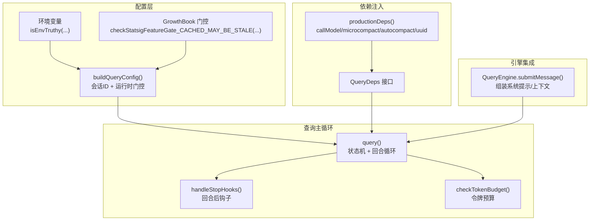
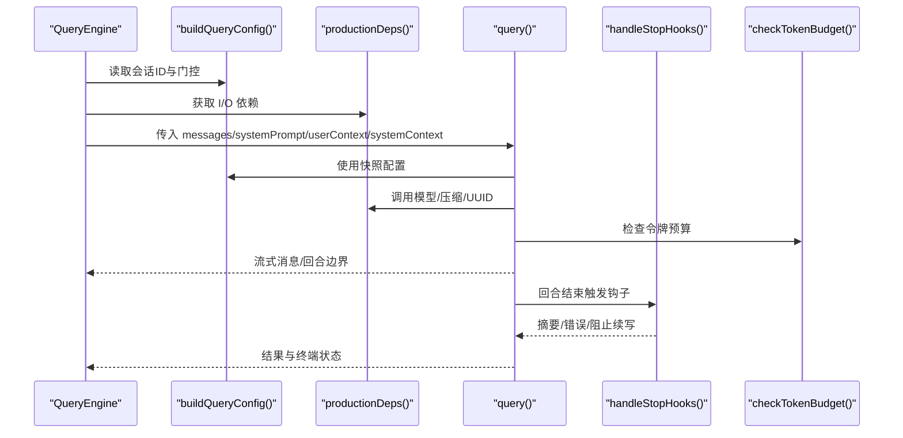
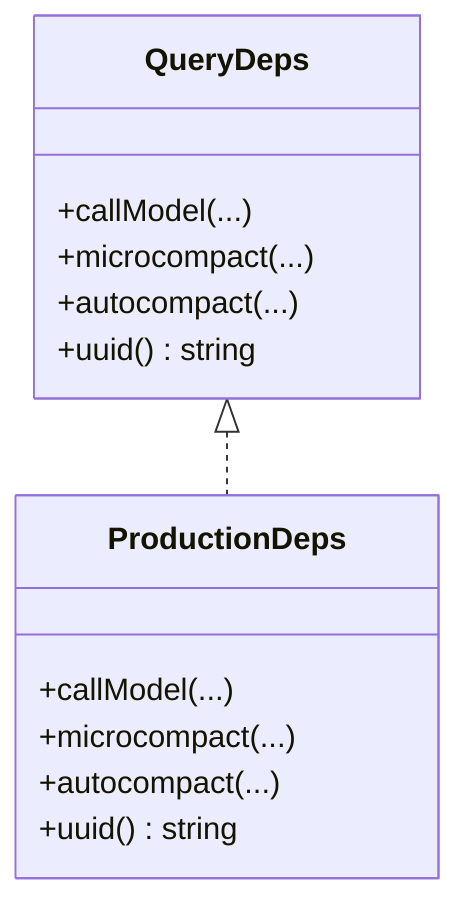
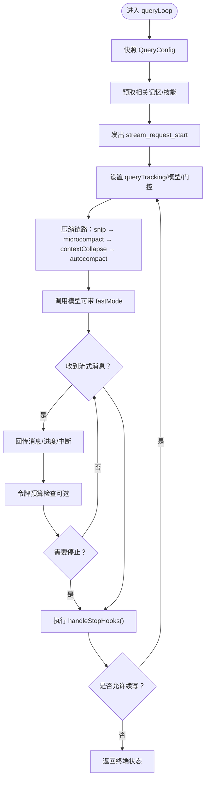
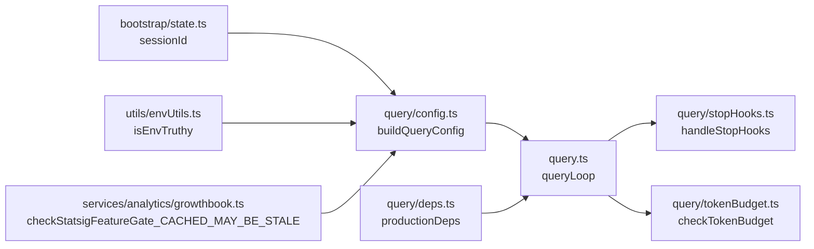

# 查询配置系统

<cite>
**本文引用的文件**
- [src/query/config.ts](file://src/query/config.ts)
- [src/query/deps.ts](file://src/query/deps.ts)
- [src/query/tokenBudget.ts](file://src/query/tokenBudget.ts)
- [src/query/stopHooks.ts](file://src/query/stopHooks.ts)
- [src/query.ts](file://src/query.ts)
- [src/QueryEngine.ts](file://src/QueryEngine.ts)
- [src/services/analytics/growthbook.ts](file://src/services/analytics/growthbook.ts)
- [src/utils/envUtils.ts](file://src/utils/envUtils.ts)
- [src/bootstrap/state.ts](file://src/bootstrap/state.ts)
- [src/utils/config.ts](file://src/utils/config.ts)
- [src/services/mockRateLimits.ts](file://src/services/mockRateLimits.ts)
- [src/utils/QueryGuard.ts](file://src/utils/QueryGuard.ts)
</cite>

## 目录
1. [简介](#简介)
2. [项目结构](#项目结构)
3. [核心组件](#核心组件)
4. [架构总览](#架构总览)
5. [详细组件分析](#详细组件分析)
6. [依赖关系分析](#依赖关系分析)
7. [性能考量](#性能考量)
8. [故障排查指南](#故障排查指南)
9. [结论](#结论)
10. [附录：扩展与最佳实践](#附录扩展与最佳实践)

## 简介
本技术文档聚焦 Claude Code 的“查询配置系统”，系统性阐述查询配置的构建流程、参数来源与优先级、依赖注入（DI）机制与测试切换、查询转换器（状态机）的作用与结果处理、以及配置如何支撑不同查询场景与实验功能。同时提供可操作的扩展指引与优化建议。

## 项目结构
查询配置系统围绕以下模块协同工作：
- 配置构建：从会话态、环境变量、统计门控（GrowthBook）中生成不可变的查询配置。
- 依赖注入：通过可替换的 QueryDeps 注入 I/O 依赖，便于测试与运行时切换。
- 查询主循环：在 query.ts 中驱动状态机，按回合执行消息压缩、工具调用、停止钩子等。
- 停止钩子：在每回合结束时执行背景任务与清理，支持阻断续写与错误汇总。
- 资源预算：基于令牌预算的继续/停止决策，避免过度消耗。
- 引擎集成：QueryEngine 将配置与依赖整合到端到端查询生命周期。

图表来源
- [src/query/config.ts:15-46](file://src/query/config.ts#L15-L46)
- [src/query/deps.ts:21-40](file://src/query/deps.ts#L21-L40)
- [src/query.ts:219-295](file://src/query.ts#L219-L295)
- [src/query/stopHooks.ts:65-473](file://src/query/stopHooks.ts#L65-L473)
- [src/query/tokenBudget.ts:45-93](file://src/query/tokenBudget.ts#L45-L93)
- [src/QueryEngine.ts:675-686](file://src/QueryEngine.ts#L675-L686)

章节来源
- [src/query/config.ts:1-47](file://src/query/config.ts#L1-L47)
- [src/query/deps.ts:1-41](file://src/query/deps.ts#L1-L41)
- [src/query.ts:181-295](file://src/query.ts#L181-L295)
- [src/query/stopHooks.ts:1-474](file://src/query/stopHooks.ts#L1-L474)
- [src/query/tokenBudget.ts:1-94](file://src/query/tokenBudget.ts#L1-L94)
- [src/QueryEngine.ts:130-173](file://src/QueryEngine.ts#L130-L173)

## 核心组件
- 查询配置（QueryConfig）
  - 包含会话标识与运行时门控（如流式工具执行、工具使用摘要、ANT 用户类型、快速模式开关）。
  - 通过 buildQueryConfig() 在查询入口一次性快照，保证后续步骤纯函数化与可测试性。
- 依赖注入（QueryDeps）
  - 定义四个核心依赖：调用模型、微压缩、自动压缩、UUID 生成。
  - productionDeps() 提供生产实现；测试可通过 deps 参数注入替身。
- 查询主循环（query）
  - 维护不可变参数与可变状态，按回合推进；在每个回合前进行压缩、预算检查、API 调用与工具执行。
- 停止钩子（handleStopHooks）
  - 回合结束后异步执行背景任务（记忆提取、自动梦境、模板分类等），并产出摘要与错误信息。
- 令牌预算（checkTokenBudget）
  - 基于阈值与递减趋势判断是否继续或停止，记录持续轮次与完成事件。

章节来源
- [src/query/config.ts:15-46](file://src/query/config.ts#L15-L46)
- [src/query/deps.ts:21-40](file://src/query/deps.ts#L21-L40)
- [src/query.ts:181-217](file://src/query.ts#L181-L217)
- [src/query/stopHooks.ts:65-473](file://src/query/stopHooks.ts#L65-L473)
- [src/query/tokenBudget.ts:45-93](file://src/query/tokenBudget.ts#L45-L93)

## 架构总览
下图展示了查询配置系统在整体架构中的位置与交互：

图表来源
- [src/QueryEngine.ts:675-686](file://src/QueryEngine.ts#L675-L686)
- [src/query/config.ts:29-46](file://src/query/config.ts#L29-L46)
- [src/query/deps.ts:33-40](file://src/query/deps.ts#L33-L40)
- [src/query.ts:219-295](file://src/query.ts#L219-L295)
- [src/query/stopHooks.ts:65-473](file://src/query/stopHooks.ts#L65-L473)
- [src/query/tokenBudget.ts:45-93](file://src/query/tokenBudget.ts#L45-L93)

## 详细组件分析

### 查询配置构建（buildQueryConfig）
- 会话来源：从会话状态快照 sessionId，确保配置在整个查询期间稳定。
- 门控来源：
  - GrowthBook 门控：通过 checkStatsigFeatureGate_CACHED_MAY_BE_STALE 获取“流式工具执行”等实验开关。
  - 环境变量：如 CLAUDE_CODE_EMIT_TOOL_USE_SUMMARIES 控制工具使用摘要输出；CLAUDE_CODE_DISABLE_FAST_MODE 控制快速模式开关。
  - 用户类型：USER_TYPE === 'ant' 用于特定能力启用。
- 设计要点：
  - 不包含 feature() 树摇边界，避免死码消除受影响。
  - 仅包含“运行时门控”，不包含“特性门控”，以保持模块图可控。

章节来源
- [src/query/config.ts:15-46](file://src/query/config.ts#L15-L46)
- [src/services/analytics/growthbook.ts:1-200](file://src/services/analytics/growthbook.ts#L1-L200)
- [src/utils/envUtils.ts:1-200](file://src/utils/envUtils.ts#L1-L200)
- [src/bootstrap/state.ts:1-200](file://src/bootstrap/state.ts#L1-L200)

### 依赖注入（productionDeps 与 QueryDeps）
- QueryDeps 接口定义四类依赖：模型调用、微压缩、自动压缩、UUID。
- productionDeps() 提供真实实现，避免在测试中引入重型模块图。
- 测试模式：通过 QueryParams.deps 注入替身，减少模块级 spy 的样板代码。

图表来源
- [src/query/deps.ts:21-40](file://src/query/deps.ts#L21-L40)

章节来源
- [src/query/deps.ts:1-41](file://src/query/deps.ts#L1-L41)

### 查询主循环（query 状态机）
- 不可变参数：messages、systemPrompt、userContext、systemContext、canUseTool、toolUseContext、fallbackModel、querySource、taskBudget 等。
- 可变状态：messages、toolUseContext、autoCompactTracking、maxOutputTokensRecoveryCount、hasAttemptedReactiveCompact、maxOutputTokensOverride、pendingToolUseSummary、stopHookActive、turnCount、transition。
- 关键流程：
  - 快照配置：buildQueryConfig() 一次快照。
  - 压缩链路：snip → microcompact → contextCollapse → autocompact。
  - 工具执行：根据门控选择流式或非流式工具执行器。
  - API 调用：prependUserContext + fullSystemPrompt + thinkingConfig + tools + 选项。
  - 预算检查：feature('TOKEN_BUDGET') 下的 checkTokenBudget 决策。
  - 回合结束：handleStopHooks() 执行背景任务与摘要。

图表来源
- [src/query.ts:241-741](file://src/query.ts#L241-L741)
- [src/query/stopHooks.ts:65-473](file://src/query/stopHooks.ts#L65-L473)
- [src/query/tokenBudget.ts:45-93](file://src/query/tokenBudget.ts#L45-L93)

章节来源
- [src/query.ts:181-741](file://src/query.ts#L181-L741)

### 停止钩子（handleStopHooks）
- 触发时机：每回合结束，且 querySource 限定为主线会话或 SDK。
- 主要职责：
  - 保存缓存安全参数（供 REPL/btw 读取）。
  - 条件执行：模板分类、提示建议、记忆提取、自动梦境、计算机使用清理等。
  - 并发执行多个钩子，收集进度、错误与输出，最终生成摘要消息与通知。
  - 支持阻断续写：当钩子要求阻止时，插入停止附件并终止当前回合。
- 错误处理：捕获钩子异常，记录事件并回退为系统提示，不影响后续流程。

章节来源
- [src/query/stopHooks.ts:65-473](file://src/query/stopHooks.ts#L65-L473)

### 令牌预算（checkTokenBudget）
- 决策依据：
  - 当存在 agentId 或预算为空/<=0 时直接停止。
  - 计算当前轮次令牌占比与增量，结合阈值与“边际收益递减”规则决定继续或停止。
  - 停止时记录持续轮次、占比、令牌数、预算、是否边际递减及耗时。
- 适用场景：长对话与高成本工具调用时的资源保护。

章节来源
- [src/query/tokenBudget.ts:45-93](file://src/query/tokenBudget.ts#L45-L93)

### 引擎集成（QueryEngine）
- 负责组装系统提示、用户上下文、命令与工具集合，并将配置与依赖注入到 query。
- 支持多场景：SDK、REPL、无头模式、任务预算、思维配置、最大轮次等。
- 与 QueryGuard 协作，保障并发查询的安全性与一致性。

章节来源
- [src/QueryEngine.ts:130-173](file://src/QueryEngine.ts#L130-L173)
- [src/utils/QueryGuard.ts:1-121](file://src/utils/QueryGuard.ts#L1-L121)

## 依赖关系分析
- 配置层依赖：
  - 会话状态：getSessionId()。
  - 环境变量：isEnvTruthy()。
  - GrowthBook：checkStatsigFeatureGate_CACHED_MAY_BE_STALE()。
- 依赖注入层：
  - 生产依赖：queryModelWithStreaming、microcompactMessages、autoCompactIfNeeded、randomUUID。
  - 测试依赖：通过 QueryParams.deps 注入替身。
- 查询主循环：
  - 依赖 QueryConfig（快照）、QueryDeps（I/O）、令牌预算与停止钩子。
- 引擎层：
  - QueryEngine 负责将系统提示、上下文、工具与配置拼装后交由 query 处理。

图表来源
- [src/bootstrap/state.ts:1-200](file://src/bootstrap/state.ts#L1-L200)
- [src/utils/envUtils.ts:1-200](file://src/utils/envUtils.ts#L1-L200)
- [src/services/analytics/growthbook.ts:1-200](file://src/services/analytics/growthbook.ts#L1-L200)
- [src/query/config.ts:29-46](file://src/query/config.ts#L29-L46)
- [src/query/deps.ts:33-40](file://src/query/deps.ts#L33-L40)
- [src/query.ts:241-741](file://src/query.ts#L241-L741)
- [src/query/stopHooks.ts:65-473](file://src/query/stopHooks.ts#L65-L473)
- [src/query/tokenBudget.ts:45-93](file://src/query/tokenBudget.ts#L45-L93)

章节来源
- [src/query/config.ts:1-47](file://src/query/config.ts#L1-L47)
- [src/query/deps.ts:1-41](file://src/query/deps.ts#L1-L41)
- [src/query.ts:241-741](file://src/query.ts#L241-L741)
- [src/query/stopHooks.ts:1-474](file://src/query/stopHooks.ts#L1-L474)
- [src/query/tokenBudget.ts:1-94](file://src/query/tokenBudget.ts#L1-L94)
- [src/QueryEngine.ts:130-173](file://src/QueryEngine.ts#L130-L173)

## 性能考量
- 依赖注入与模块图隔离：通过 QueryDeps 将重型模块（如 axios、设置、认证、模型、OAuth、配置）隔离在测试之外，避免测试分片初始化顺序变化导致的不稳定。
- 快照配置：QueryConfig 在查询入口一次性快照，降低后续步骤的不确定性，提升可测试性与可维护性。
- 压缩链路：按 snip → microcompact → contextCollapse → autocompact 的顺序执行，尽量在早期释放上下文压力，减少 API 调用成本。
- 令牌预算：在 TOKEN_BUDGET 开启时，通过阈值与边际收益递减策略避免长轮次导致的资源浪费。
- 流式工具执行：通过门控开启流式工具执行，减少等待时间，提升用户体验。

## 故障排查指南
- 门控未生效
  - 检查 GrowthBook 门控与环境变量覆盖：确认 feature 名称与环境变量是否正确。
  - 参考路径：[src/query/config.ts:33-35](file://src/query/config.ts#L33-L35)、[src/services/analytics/growthbook.ts:1-200](file://src/services/analytics/growthbook.ts#L1-L200)、[src/utils/envUtils.ts:1-200](file://src/utils/envUtils.ts#L1-L200)
- 依赖注入问题
  - 确认测试中是否正确传入 deps 替身；避免在测试中加载重型模块。
  - 参考路径：[src/query/deps.ts:33-40](file://src/query/deps.ts#L33-L40)
- 停止钩子失败
  - 查看钩子异常日志与摘要消息；确认 querySource 是否满足触发条件。
  - 参考路径：[src/query/stopHooks.ts:456-472](file://src/query/stopHooks.ts#L456-L472)
- 令牌预算导致过早停止
  - 检查预算阈值与边际收益递减参数；必要时关闭 TOKEN_BUDGET 或调整阈值。
  - 参考路径：[src/query/tokenBudget.ts:45-93](file://src/query/tokenBudget.ts#L45-L93)
- 快速模式相关问题
  - 检查 CLAUDE_CODE_DISABLE_FAST_MODE 与 mock 场景；确认 fastModeEnabled 门控。
  - 参考路径：[src/query/config.ts:40-43](file://src/query/config.ts#L40-L43)、[src/services/mockRateLimits.ts:847-882](file://src/services/mockRateLimits.ts#L847-L882)

章节来源
- [src/query/config.ts:29-46](file://src/query/config.ts#L29-L46)
- [src/query/deps.ts:33-40](file://src/query/deps.ts#L33-L40)
- [src/query/stopHooks.ts:456-472](file://src/query/stopHooks.ts#L456-L472)
- [src/query/tokenBudget.ts:45-93](file://src/query/tokenBudget.ts#L45-L93)
- [src/services/mockRateLimits.ts:847-882](file://src/services/mockRateLimits.ts#L847-L882)

## 结论
查询配置系统通过“快照配置 + 依赖注入 + 状态机”的设计，在保证可测试性的同时，灵活地支持多种实验功能与查询场景。其关键在于：
- 将运行时门控与会话状态快照化，确保查询过程的确定性；
- 通过 QueryDeps 将 I/O 与重型模块解耦，便于测试与运行时切换；
- 在查询主循环中串联压缩、预算与钩子，形成闭环的资源与行为控制；
- 通过 QueryEngine 将系统提示、上下文与工具整合，统一接入查询生命周期。

## 附录：扩展与最佳实践

### 如何扩展配置选项
- 新增运行时门控
  - 在 buildQueryConfig() 的 gates 字段中新增布尔字段，并通过 GrowthBook 门控或环境变量赋值。
  - 示例参考路径：[src/query/config.ts:19-26](file://src/query/config.ts#L19-L26)、[src/query/config.ts:32-44](file://src/query/config.ts#L32-L44)
- 新增环境变量开关
  - 使用 isEnvTruthy() 读取新环境变量，作为门控或行为开关。
  - 示例参考路径：[src/utils/envUtils.ts:1-200](file://src/utils/envUtils.ts#L1-L200)
- 新增特性门控（谨慎使用）
  - 对于树摇边界，使用 feature('...') 与 require 动态导入，避免影响模块图。
  - 示例参考路径：[src/query/stopHooks.ts:42-47](file://src/query/stopHooks.ts#L42-L47)

### 如何添加新的查询依赖
- 定义接口与生产实现
  - 在 QueryDeps 中声明新依赖，并在 productionDeps() 中提供实现。
  - 示例参考路径：[src/query/deps.ts:21-31](file://src/query/deps.ts#L21-L31)、[src/query/deps.ts:33-40](file://src/query/deps.ts#L33-L40)
- 测试注入
  - 在测试中通过 QueryParams.deps 传入替身，避免模块级 spy。
  - 示例参考路径：[src/query.ts](file://src/query.ts#L263)

### 如何扩展查询场景与实验功能
- 实验开关
  - 使用 GrowthBook 门控与 feature('...') 组合，确保实验可灰度与回滚。
  - 示例参考路径：[src/services/analytics/growthbook.ts:1-200](file://src/services/analytics/growthbook.ts#L1-L200)、[src/query.ts:115-121](file://src/query.ts#L115-L121)
- 背景任务与钩子
  - 在 handleStopHooks() 中按需扩展，注意并发与错误处理。
  - 示例参考路径：[src/query/stopHooks.ts:136-157](file://src/query/stopHooks.ts#L136-L157)

### 最佳实践
- 配置快照化：在查询入口一次性快照，避免中途变更。
- 依赖隔离：将重型模块放入 productionDeps，测试中注入替身。
- 门控分离：运行时门控与特性门控分离，前者用于运行期开关，后者用于树摇。
- 预算与压缩：优先使用压缩链路与令牌预算，避免长轮次与高成本工具调用。
- 钩子健壮性：对钩子异常进行捕获与降级，保证主流程稳定。