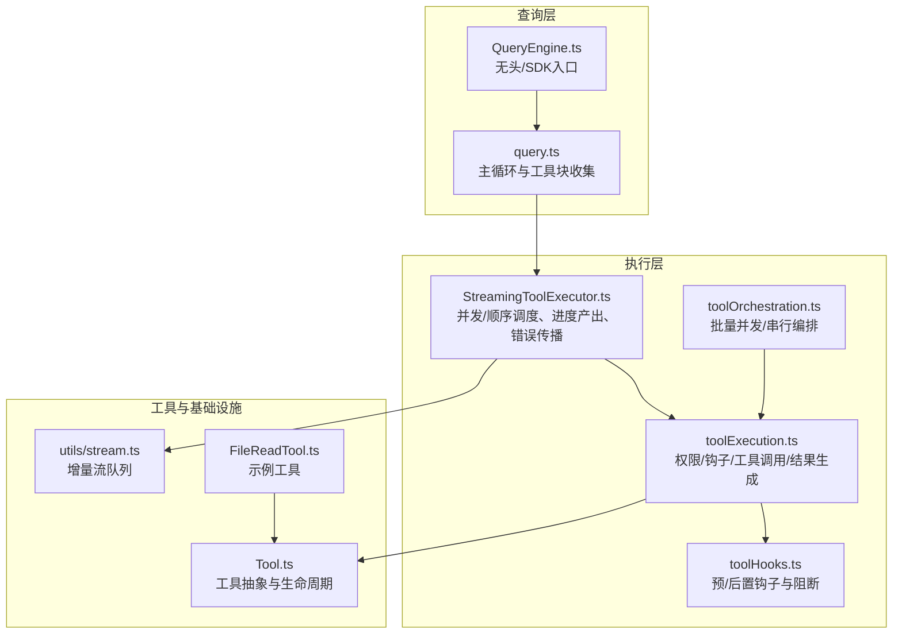
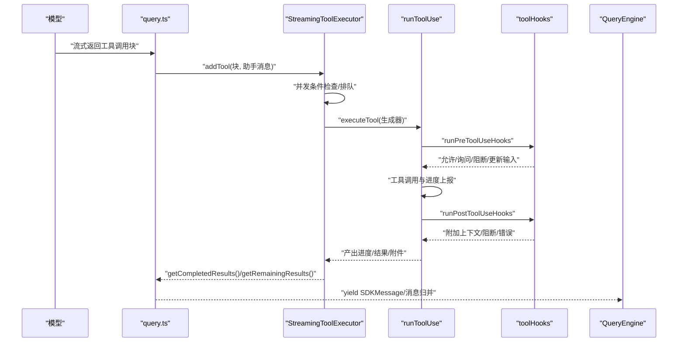
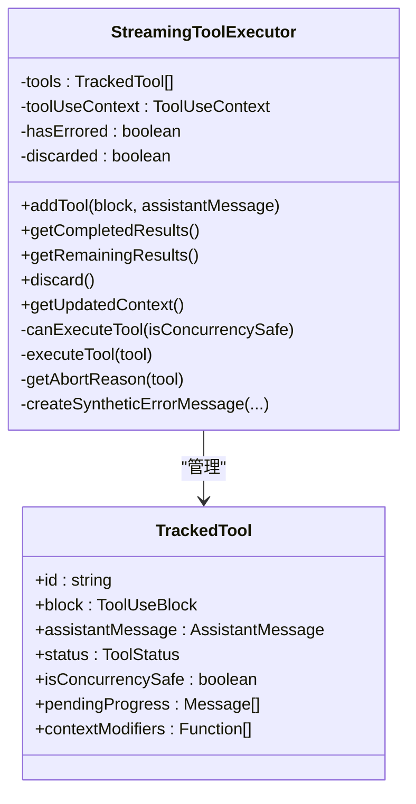
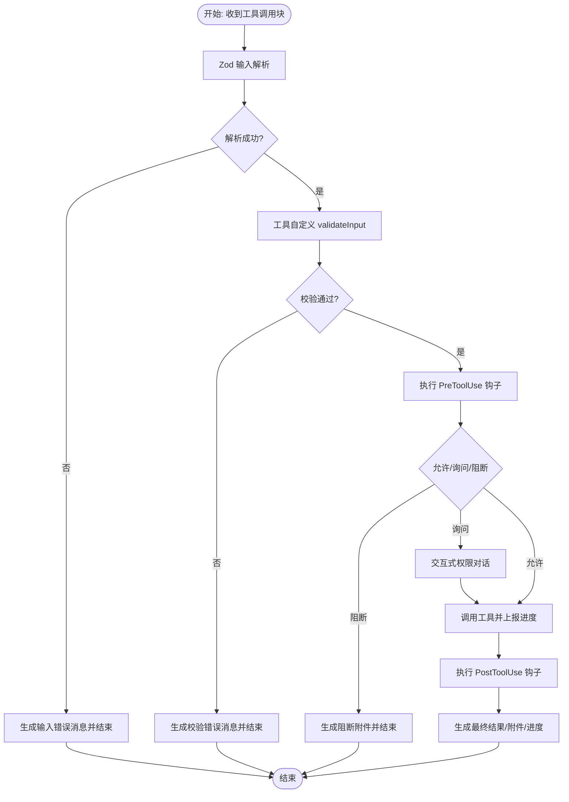
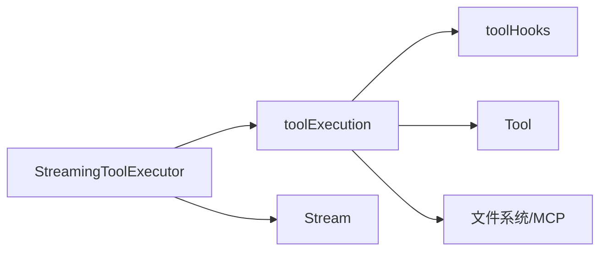

# 流式工具执行器

<cite>
**本文档引用的文件**
- [StreamingToolExecutor.ts](file://src/services/tools/StreamingToolExecutor.ts)
- [toolExecution.ts](file://src/services/tools/toolExecution.ts)
- [toolHooks.ts](file://src/services/tools/toolHooks.ts)
- [toolOrchestration.ts](file://src/services/tools/toolOrchestration.ts)
- [Tool.ts](file://src/Tool.ts)
- [query.ts](file://src/query.ts)
- [QueryEngine.ts](file://src/QueryEngine.ts)
- [stream.ts](file://src/utils/stream.ts)
- [fileReadTool.ts](file://src/tools/FileReadTool/fileReadTool.ts)
</cite>

## 目录
1. [简介](#简介)
2. [项目结构](#项目结构)
3. [核心组件](#核心组件)
4. [架构总览](#架构总览)
5. [详细组件分析](#详细组件分析)
6. [依赖关系分析](#依赖关系分析)
7. [性能考量](#性能考量)
8. [故障排查指南](#故障排查指南)
9. [结论](#结论)
10. [附录：自定义工具流式执行示例](#附录自定义工具流式执行示例)

## 简介
本文件系统性阐述 Claude Code 的“流式工具执行器”（StreamingToolExecutor）设计与实现，覆盖并发工具调用、异步执行、结果聚合、生命周期管理、错误处理与重试、故障恢复、以及与查询引擎的集成方式。文档同时提供性能优化建议与调试方法，并给出实现自定义工具流式执行的实践指引。

## 项目结构
围绕流式工具执行的关键模块如下：
- 查询主循环与入口：query.ts 负责接收模型输出、解析工具调用块、协调流式执行器或传统串行执行器。
- 流式执行器：StreamingToolExecutor 提供并发安全的工具执行、进度消息即时产出、中断与错误传播、上下文修改合并等能力。
- 工具执行管线：toolExecution.ts 实现权限校验、输入校验、钩子执行、工具调用、进度事件、结果生成与持久化等。
- 钩子系统：toolHooks.ts 将预/后置钩子与工具执行解耦，支持阻断、上下文附加、错误处理与统计。
- 工具编排：toolOrchestration.ts 在非流式路径下提供批量并发/串行编排与上下文修改合并。
- 工具抽象：Tool.ts 定义工具接口、输入/输出模式、并发安全判定、中断行为、渲染与描述等。
- 查询引擎：QueryEngine.ts 作为无头/SDK入口，封装消息提交、状态同步与缓存复用。
- 流式基础设施：utils/stream.ts 提供增量可消费的流式队列，支撑工具进度与结果的实时产出。
- 示例工具：tools/FileReadTool/fileReadTool.ts 展示了典型工具的输入校验、权限检查、进度上报与结果渲染。

图表来源
- [query.ts:560-568](file://src/query.ts#L560-L568)
- [StreamingToolExecutor.ts:40-62](file://src/services/tools/StreamingToolExecutor.ts#L40-L62)
- [toolExecution.ts:337-490](file://src/services/tools/toolExecution.ts#L337-L490)
- [toolHooks.ts:39-651](file://src/services/tools/toolHooks.ts#L39-L651)
- [toolOrchestration.ts:19-82](file://src/services/tools/toolOrchestration.ts#L19-L82)
- [Tool.ts:362-695](file://src/Tool.ts#L362-L695)
- [QueryEngine.ts:1248-1295](file://src/QueryEngine.ts#L1248-L1295)
- [stream.ts:1-51](file://src/utils/stream.ts#L1-L51)
- [fileReadTool.ts:1-200](file://src/tools/FileReadTool/fileReadTool.ts#L1-L200)

章节来源
- [query.ts:560-568](file://src/query.ts#L560-L568)
- [StreamingToolExecutor.ts:40-62](file://src/services/tools/StreamingToolExecutor.ts#L40-L62)
- [toolExecution.ts:337-490](file://src/services/tools/toolExecution.ts#L337-L490)
- [toolHooks.ts:39-651](file://src/services/tools/toolHooks.ts#L39-L651)
- [toolOrchestration.ts:19-82](file://src/services/tools/toolOrchestration.ts#L19-L82)
- [Tool.ts:362-695](file://src/Tool.ts#L362-L695)
- [QueryEngine.ts:1248-1295](file://src/QueryEngine.ts#L1248-L1295)
- [stream.ts:1-51](file://src/utils/stream.ts#L1-L51)
- [fileReadTool.ts:1-200](file://src/tools/FileReadTool/fileReadTool.ts#L1-L200)

## 核心组件
- 流式工具执行器（StreamingToolExecutor）
  - 并发控制：根据工具是否并发安全决定并行或串行；维护执行中/完成/已产出等状态机。
  - 进度优先：进度消息立即入队并优先产出，保证 UI 反馈及时。
  - 中断与错误传播：支持用户中断、兄弟工具失败级联取消、流式回退丢弃。
  - 上下文修改：仅在串行非并发场景应用工具返回的上下文修改器，避免并发竞态。
- 工具执行管线（runToolUse）
  - 权限与输入校验：Zod 输入校验、工具自定义 validateInput、规则与交互式权限决策。
  - 钩子链路：PreToolUse/PostToolUse/失败钩子，支持阻断、附加上下文、错误统计。
  - 结果生成：进度消息、最终结果、附件消息、停止原因、Hook 错误与阻断提示。
- 钩子系统（toolHooks）
  - 统一的钩子执行框架，支持阻断、阻止继续、附加上下文、更新 MCP 输出、错误与取消事件。
- 工具编排（toolOrchestration）
  - 非流式路径下的批量并发/串行执行，按批合并上下文修改器。
- 工具抽象（Tool）
  - 定义工具接口、并发安全判定、只读/破坏性、中断行为、描述与渲染、权限检查等。

章节来源
- [StreamingToolExecutor.ts:40-531](file://src/services/tools/StreamingToolExecutor.ts#L40-L531)
- [toolExecution.ts:337-490](file://src/services/tools/toolExecution.ts#L337-L490)
- [toolHooks.ts:39-651](file://src/services/tools/toolHooks.ts#L39-L651)
- [toolOrchestration.ts:19-189](file://src/services/tools/toolOrchestration.ts#L19-L189)
- [Tool.ts:362-695](file://src/Tool.ts#L362-L695)

## 架构总览
流式工具执行器与查询引擎的协作流程如下：

图表来源
- [query.ts:560-568](file://src/query.ts#L560-L568)
- [StreamingToolExecutor.ts:76-124](file://src/services/tools/StreamingToolExecutor.ts#L76-L124)
- [toolExecution.ts:492-570](file://src/services/tools/toolExecution.ts#L492-L570)
- [toolHooks.ts:435-651](file://src/services/tools/toolHooks.ts#L435-L651)
- [QueryEngine.ts:1248-1295](file://src/QueryEngine.ts#L1248-L1295)

章节来源
- [query.ts:560-568](file://src/query.ts#L560-L568)
- [StreamingToolExecutor.ts:76-124](file://src/services/tools/StreamingToolExecutor.ts#L76-L124)
- [toolExecution.ts:492-570](file://src/services/tools/toolExecution.ts#L492-L570)
- [toolHooks.ts:435-651](file://src/services/tools/toolHooks.ts#L435-L651)
- [QueryEngine.ts:1248-1295](file://src/QueryEngine.ts#L1248-L1295)

## 详细组件分析

### 流式工具执行器（StreamingToolExecutor）
- 设计要点
  - 状态机：每个跟踪工具包含 id、块、助手消息、状态（排队/执行/完成/已产出）、并发安全标记、待处理进度队列、上下文修改器列表。
  - 并发策略：仅当当前无执行工具，或新工具与所有执行工具均为并发安全时才启动；非并发工具会阻塞后续工具直至其完成。
  - 进度优先：进度消息直接入队并在 getCompletedResults 中优先产出，确保 UI 即时反馈。
  - 中断与错误传播：支持用户中断（可配置中断行为）、兄弟工具失败级联取消（如 Bash），以及流式回退丢弃。
  - 上下文修改：仅在串行非并发工具完成后应用其上下文修改器，避免并发竞态。
- 关键流程
  - addTool：解析输入、判定并发安全、入队并触发 processQueue。
  - processQueue：遍历队列，基于 canExecuteTool 决定是否执行。
  - executeTool：创建子 AbortController，运行 runToolUse，收集消息与上下文修改器，处理错误与级联取消。
  - getCompletedResults/getRemainingResults：维护顺序产出，等待执行完成或进度可用。

图表来源
- [StreamingToolExecutor.ts:40-531](file://src/services/tools/StreamingToolExecutor.ts#L40-L531)

章节来源
- [StreamingToolExecutor.ts:40-531](file://src/services/tools/StreamingToolExecutor.ts#L40-L531)

### 工具执行管线（runToolUse）
- 生命周期
  - 输入校验：Zod 解析与格式化错误；若为延迟加载工具且未发现对应工具，追加提示以引导使用 ToolSearch。
  - 权限与输入验证：工具 validateInput 自定义校验；规则与交互式权限决策；Bash 前置分类器并行启动。
  - 钩子链路：PreToolUse 钩子决定允许/询问/阻断、更新输入、附加上下文；工具调用；PostToolUse 钩子处理阻断、附加上下文、错误与统计。
  - 结果生成：进度消息通过 Stream 推送；最终结果包装为用户消息；错误统一格式化并携带工具名与 ID。
- 错误处理
  - 分类错误：区分 TelemetrySafeError、Node.js errno、稳定名称错误类型，便于诊断。
  - 输入错误：Zod 校验失败与工具自定义校验失败均生成带详细信息的错误消息。
  - 流式回退：当模型流式回退时，丢弃旧执行器并重建，防止孤儿结果混入。

图表来源
- [toolExecution.ts:614-733](file://src/services/tools/toolExecution.ts#L614-L733)
- [toolExecution.ts:754-800](file://src/services/tools/toolExecution.ts#L754-L800)
- [toolExecution.ts:800-900](file://src/services/tools/toolExecution.ts#L800-L900)
- [toolExecution.ts:900-1000](file://src/services/tools/toolExecution.ts#L900-L1000)

章节来源
- [toolExecution.ts:337-490](file://src/services/tools/toolExecution.ts#L337-L490)
- [toolExecution.ts:614-733](file://src/services/tools/toolExecution.ts#L614-L733)
- [toolExecution.ts:754-800](file://src/services/tools/toolExecution.ts#L754-L800)
- [toolExecution.ts:800-900](file://src/services/tools/toolExecution.ts#L800-L900)
- [toolExecution.ts:900-1000](file://src/services/tools/toolExecution.ts#L900-L1000)

### 钩子系统（toolHooks）
- 预钩子（PreToolUse）
  - 允许/询问/阻断决策；可更新输入；可附加上下文；可阻止继续并设置停止原因。
- 后置钩子（PostToolUse/失败钩子）
  - 处理阻断、附加上下文、更新 MCP 输出、错误与取消事件；记录耗时与统计。
- 统一错误与取消处理
  - 对钩子执行期间的取消事件进行专门处理，避免重复显示阻断原因。

章节来源
- [toolHooks.ts:39-191](file://src/services/tools/toolHooks.ts#L39-L191)
- [toolHooks.ts:193-319](file://src/services/tools/toolHooks.ts#L193-L319)
- [toolHooks.ts:435-651](file://src/services/tools/toolHooks.ts#L435-L651)

### 工具编排（toolOrchestration）
- 非流式路径下的批量执行
  - 按并发安全分批：单个非并发工具独立成批；连续并发工具合并为一批。
  - 批内并发：使用 all 并发执行，受环境变量限制最大并发数。
  - 上下文修改合并：串行批次结束后统一应用该批次各工具的上下文修改器。

章节来源
- [toolOrchestration.ts:19-189](file://src/services/tools/toolOrchestration.ts#L19-L189)

### 工具抽象（Tool）
- 关键接口
  - 并发安全判定：isConcurrencySafe(input)。
  - 只读/破坏性：isReadOnly/isDestructive。
  - 中断行为：interruptBehavior()。
  - 渲染与描述：renderToolUseMessage/renderToolResultMessage/getActivityDescription 等。
  - 权限与校验：checkPermissions/validateInput。
- 默认行为
  - 未显式实现的方法采用安全默认（如默认不允许并发、默认允许权限等）。

章节来源
- [Tool.ts:362-695](file://src/Tool.ts#L362-L695)

## 依赖关系分析
- 组件耦合
  - StreamingToolExecutor 依赖 Tool 抽象、工具执行管线与工具上下文；通过 AbortController 串联父子中断。
  - toolExecution 依赖工具抽象、权限系统、钩子系统、进度流与结果存储。
  - toolHooks 与工具抽象解耦，通过钩子执行框架统一处理。
- 外部依赖
  - AbortController：用于中断传播与级联取消。
  - Stream：用于进度与结果的增量推送。
  - 文件系统与 MCP：示例工具（如 FileReadTool）演示了文件读取与权限检查。

图表来源
- [StreamingToolExecutor.ts:40-62](file://src/services/tools/StreamingToolExecutor.ts#L40-L62)
- [toolExecution.ts:337-490](file://src/services/tools/toolExecution.ts#L337-L490)
- [toolHooks.ts:39-651](file://src/services/tools/toolHooks.ts#L39-L651)
- [Tool.ts:362-695](file://src/Tool.ts#L362-L695)
- [stream.ts:1-51](file://src/utils/stream.ts#L1-L51)
- [fileReadTool.ts:1-200](file://src/tools/FileReadTool/fileReadTool.ts#L1-L200)

章节来源
- [StreamingToolExecutor.ts:40-62](file://src/services/tools/StreamingToolExecutor.ts#L40-L62)
- [toolExecution.ts:337-490](file://src/services/tools/toolExecution.ts#L337-L490)
- [toolHooks.ts:39-651](file://src/services/tools/toolHooks.ts#L39-L651)
- [Tool.ts:362-695](file://src/Tool.ts#L362-L695)
- [stream.ts:1-51](file://src/utils/stream.ts#L1-L51)
- [fileReadTool.ts:1-200](file://src/tools/FileReadTool/fileReadTool.ts#L1-L200)

## 性能考量
- 并发控制
  - 利用 isConcurrencySafe 减少不必要的串行，提升吞吐；对非并发工具采用串行以避免资源竞争。
  - 最大并发可通过环境变量限制，避免过度并发导致资源争用。
- 进度优先与低延迟
  - 进度消息优先产出，减少 UI 等待时间；使用 Stream 实现增量推送，降低内存占用。
- 缓存与复用
  - QueryEngine 在提交消息前后克隆/复用文件读取缓存，避免重复 IO。
- 结果持久化阈值
  - 工具结果大小阈值可由工具声明与特性标志共同决定，超过阈值自动落盘，避免内存膨胀。

章节来源
- [toolOrchestration.ts:8-12](file://src/services/tools/toolOrchestration.ts#L8-L12)
- [toolOrchestration.ts:152-177](file://src/services/tools/toolOrchestration.ts#L152-L177)
- [QueryEngine.ts:1248-1295](file://src/QueryEngine.ts#L1248-L1295)
- [toolExecution.ts:614-733](file://src/services/tools/toolExecution.ts#L614-L733)
- [toolResultStorage.ts:60-108](file://src/utils/toolResultStorage.ts#L60-L108)

## 故障排查指南
- 常见问题定位
  - 工具不存在：检查工具名称与别名映射，确认工具是否在可用工具集中。
  - 输入校验失败：查看 Zod 校验错误与工具自定义校验错误，必要时启用 ToolSearch。
  - 权限拒绝：检查规则与交互式权限对话；关注钩子决策来源与原因。
  - 流式回退：当模型流式回退时，丢弃旧执行器并重建，避免孤儿结果；观察 UI 是否出现墓碑消息清理。
- 中断与级联取消
  - 用户中断：根据工具中断行为决定取消或阻塞；非并发工具会阻塞后续工具。
  - 兄弟工具失败：Bash 工具失败会通过 siblingAbortController 级联取消其他兄弟工具。
- 调试建议
  - 开启详细日志与分析事件，关注工具执行耗时、钩子耗时与错误分类。
  - 使用 AbortController 信号追踪中断来源与传播路径。
  - 对于 MCP 工具，核对服务器连接类型与基础地址，确保日志安全。

章节来源
- [toolExecution.ts:368-411](file://src/services/tools/toolExecution.ts#L368-L411)
- [toolExecution.ts:614-733](file://src/services/tools/toolExecution.ts#L614-L733)
- [toolExecution.ts:754-800](file://src/services/tools/toolExecution.ts#L754-L800)
- [StreamingToolExecutor.ts:210-241](file://src/services/tools/StreamingToolExecutor.ts#L210-L241)
- [StreamingToolExecutor.ts:354-364](file://src/services/tools/StreamingToolExecutor.ts#L354-L364)
- [query.ts:712-740](file://src/query.ts#L712-L740)

## 结论
流式工具执行器通过严格的并发控制、进度优先产出、中断与错误传播、以及钩子系统的解耦，实现了高可靠、高性能、可观测的工具执行体验。配合查询引擎的消息归并与状态同步，整体系统在复杂工具链路下仍保持良好的一致性与用户体验。

## 附录：自定义工具流式执行示例
以下步骤指导如何实现一个具备流式进度与结果的自定义工具（以只读工具为例）：
- 定义工具
  - 实现 call 方法，使用 onProgress 回调上报进度；在合适时机返回最终结果。
  - 实现 isConcurrencySafe/inputSchema/validateInput/checkPermissions 等方法。
- 注册工具
  - 将工具加入工具集，确保名称唯一且可被模型识别。
- 验证与测试
  - 使用 QueryEngine 或 REPL 触发工具调用，观察进度消息与最终结果是否正确产出。
  - 如需 MCP 工具，参考 MCP 工具命名规范与服务器连接配置。

章节来源
- [Tool.ts:362-695](file://src/Tool.ts#L362-L695)
- [toolExecution.ts:337-490](file://src/services/tools/toolExecution.ts#L337-L490)
- [QueryEngine.ts:1248-1295](file://src/QueryEngine.ts#L1248-L1295)
- [fileReadTool.ts:1-200](file://src/tools/FileReadTool/fileReadTool.ts#L1-L200)