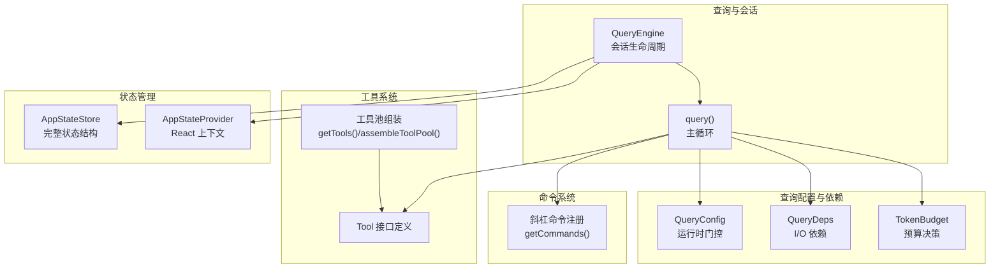
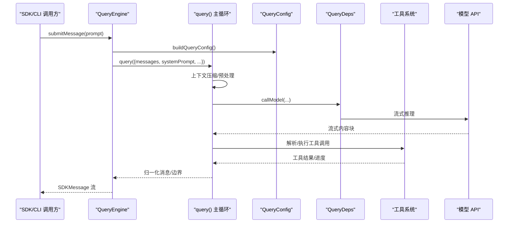
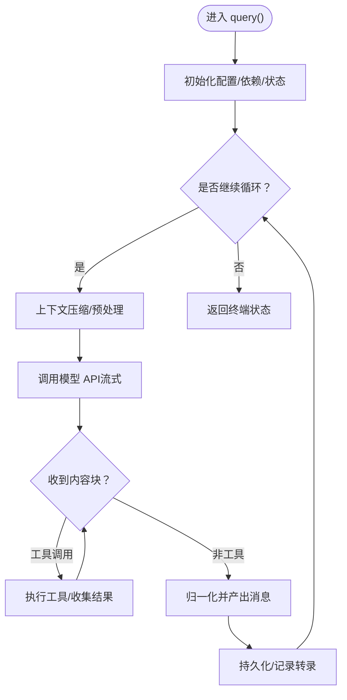
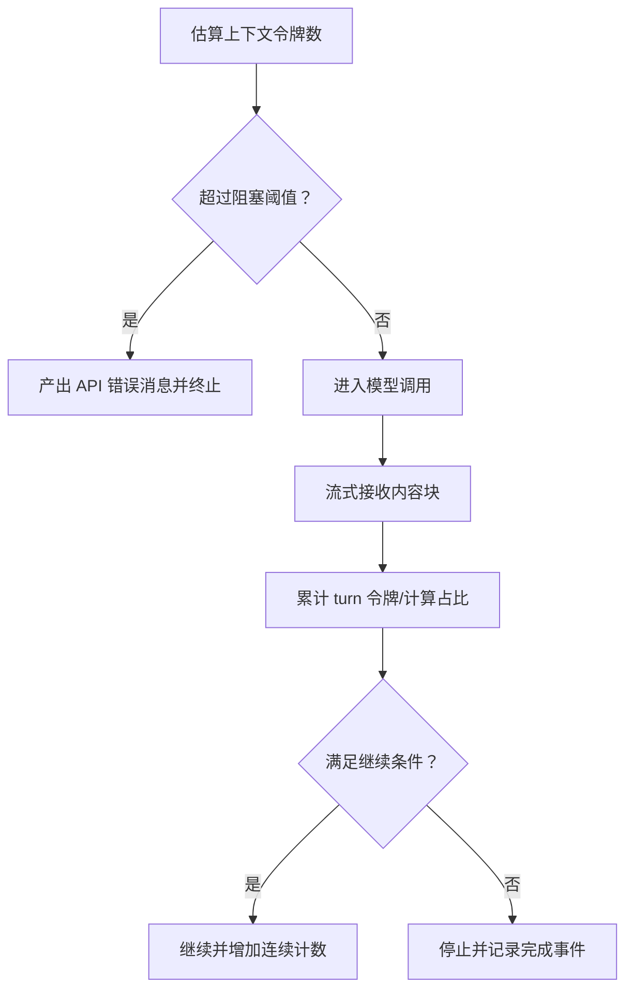
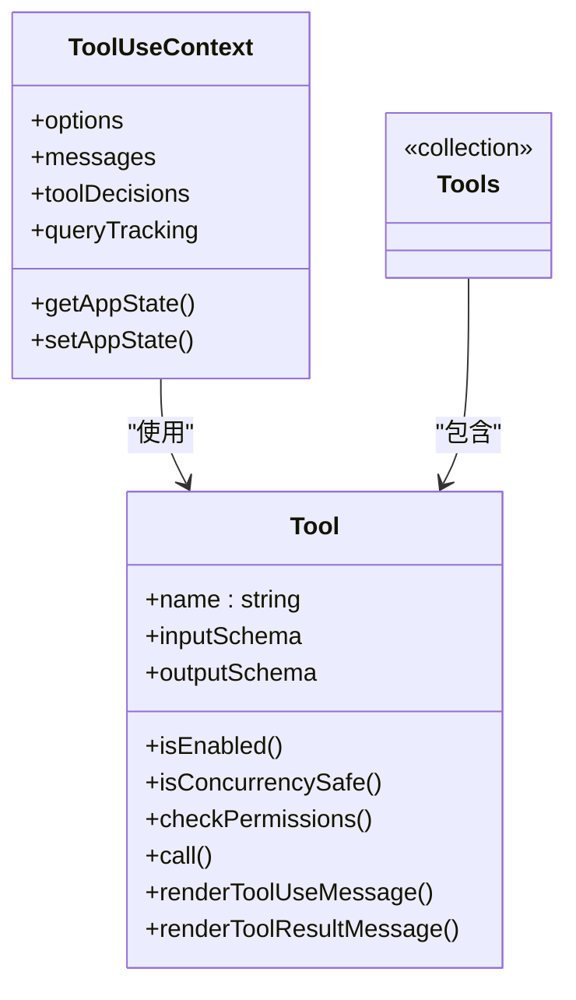
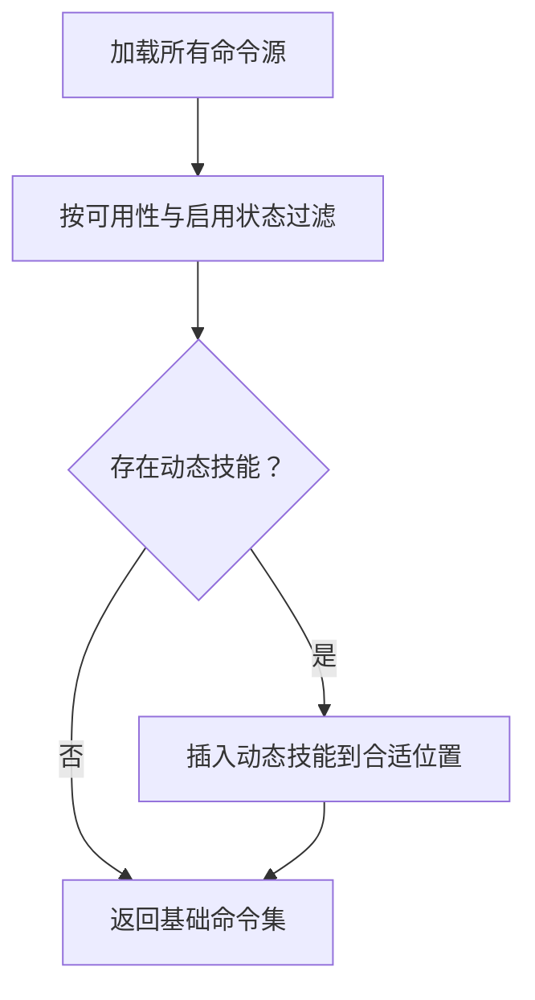
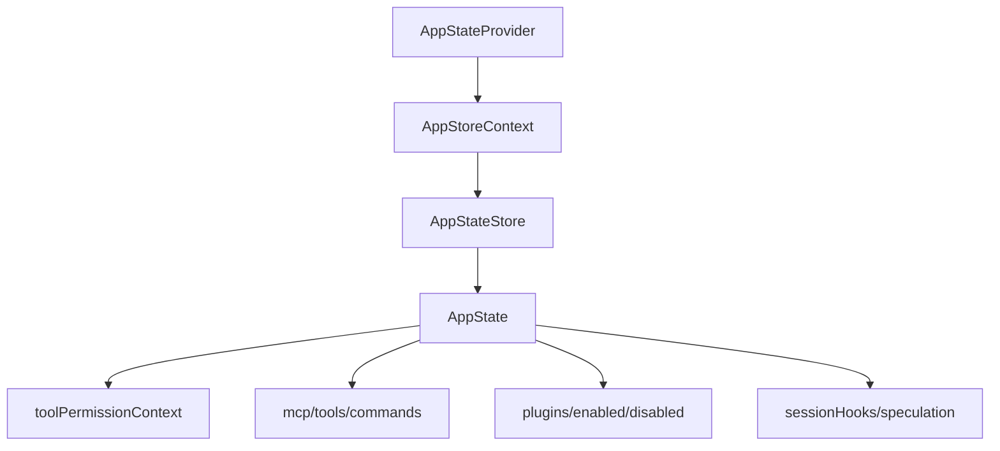
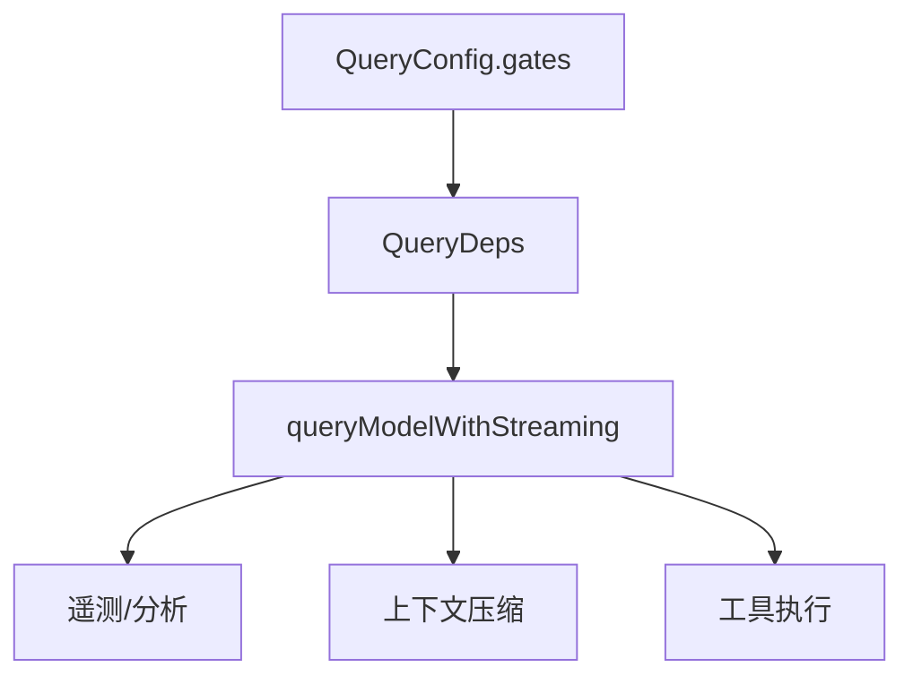
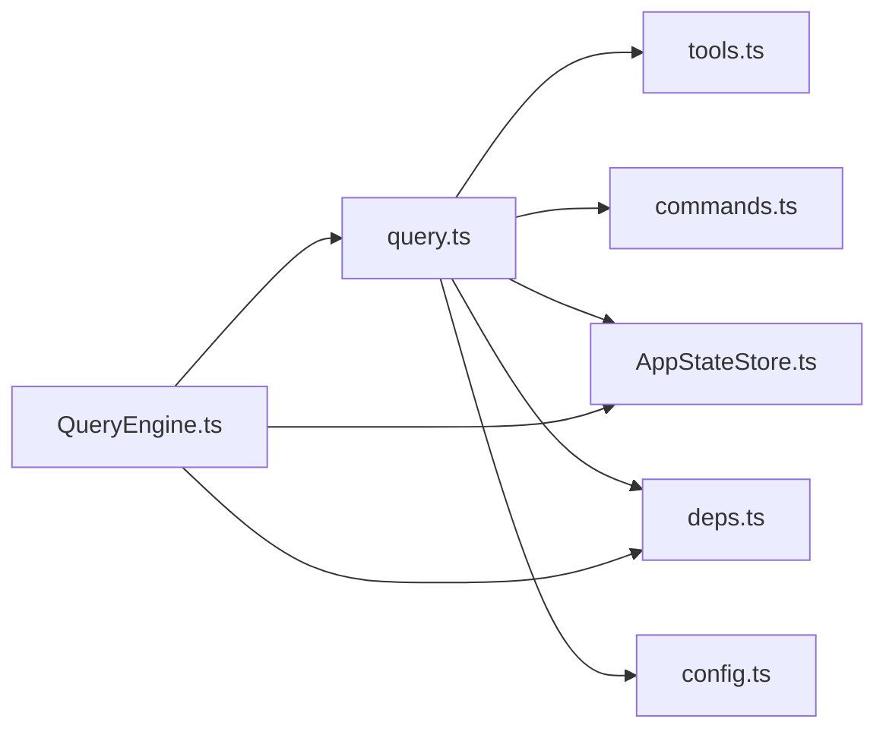

# 核心模块详解

<cite>
**本文档引用的文件**
- [src/query.ts](file://src/query.ts)
- [src/QueryEngine.ts](file://src/QueryEngine.ts)
- [src/tools.ts](file://src/tools.ts)
- [src/commands.ts](file://src/commands.ts)
- [src/Tool.ts](file://src/Tool.ts)
- [src/state/AppState.tsx](file://src/state/AppState.tsx)
- [src/state/AppStateStore.ts](file://src/state/AppStateStore.ts)
- [src/query/config.ts](file://src/query/config.ts)
- [src/query/deps.ts](file://src/query/deps.ts)
- [src/query/tokenBudget.ts](file://src/query/tokenBudget.ts)
</cite>

## 目录
1. [简介](#简介)
2. [项目结构](#项目结构)
3. [核心组件](#核心组件)
4. [架构总览](#架构总览)
5. [详细组件分析](#详细组件分析)
6. [依赖关系分析](#依赖关系分析)
7. [性能考量](#性能考量)
8. [故障排查指南](#故障排查指南)
9. [结论](#结论)
10. [附录](#附录)

## 简介
本文件面向 Claude Code 的核心模块，系统性阐述以下关键子系统：查询引擎（Agent 循环）、上下文与令牌预算管理、工具系统（接口、内置工具、权限控制）、命令系统（斜杠命令注册与功能门控）、状态管理（应用状态存储与 React 提供者）、服务层（API 客户端、分析服务、业务封装）。文档通过代码级图示与路径引用，帮助读者理解模块间的交互关系，并提供性能优化与最佳实践建议。

## 项目结构
- 查询引擎与主循环位于 src/query.ts，对外暴露 query(...) 异步生成器，驱动单轮对话与多轮迭代。
- QueryEngine 类封装会话生命周期与 SDK/CLI 调用路径，协调系统提示、用户输入处理、工具执行与消息持久化。
- 工具系统在 src/Tool.ts 定义统一接口，src/tools.ts 组装内置工具池并按权限规则过滤。
- 命令系统在 src/commands.ts 中集中注册与筛选斜杠命令，支持动态技能与插件命令。
- 状态管理在 src/state 下，AppState.tsx 提供 React 上下文与订阅钩子，AppStateStore.ts 定义完整状态结构。
- 查询配置、依赖注入与令牌预算分别在 src/query/config.ts、deps.ts、tokenBudget.ts 中实现。

**图表来源**
- [src/QueryEngine.ts:184-799](file://src/QueryEngine.ts#L184-L799)
- [src/query.ts:219-1296](file://src/query.ts#L219-L1296)
- [src/Tool.ts:158-300](file://src/Tool.ts#L158-L300)
- [src/tools.ts:193-390](file://src/tools.ts#L193-L390)
- [src/commands.ts:258-517](file://src/commands.ts#L258-L517)
- [src/state/AppState.tsx:37-110](file://src/state/AppState.tsx#L37-L110)
- [src/state/AppStateStore.ts:89-452](file://src/state/AppStateStore.ts#L89-L452)
- [src/query/config.ts:29-46](file://src/query/config.ts#L29-L46)
- [src/query/deps.ts:33-40](file://src/query/deps.ts#L33-L40)
- [src/query/tokenBudget.ts:45-93](file://src/query/tokenBudget.ts#L45-L93)

**章节来源**
- [src/query.ts:219-1296](file://src/query.ts#L219-L1296)
- [src/QueryEngine.ts:184-799](file://src/QueryEngine.ts#L184-L799)
- [src/Tool.ts:158-300](file://src/Tool.ts#L158-L300)
- [src/tools.ts:193-390](file://src/tools.ts#L193-L390)
- [src/commands.ts:258-517](file://src/commands.ts#L258-L517)
- [src/state/AppState.tsx:37-110](file://src/state/AppState.tsx#L37-L110)
- [src/state/AppStateStore.ts:89-452](file://src/state/AppStateStore.ts#L89-L452)
- [src/query/config.ts:29-46](file://src/query/config.ts#L29-L46)
- [src/query/deps.ts:33-40](file://src/query/deps.ts#L33-L40)
- [src/query/tokenBudget.ts:45-93](file://src/query/tokenBudget.ts#L45-L93)

## 核心组件
- 查询引擎与主循环：query(...) 实现异步生成器主循环，贯穿上下文压缩、工具调用、流式响应与恢复路径。
- QueryEngine：封装 SDK/CLI 入口，负责系统提示构建、命令解析、消息持久化与结果归一化。
- 工具系统：统一 Tool 接口，内置工具池装配与权限过滤，支持 MCP 工具合并。
- 命令系统：集中注册斜杠命令，动态加载技能与插件命令，提供可用性与门控筛选。
- 状态管理：AppStateStore 定义完整状态，AppStateProvider 提供 React 订阅与更新能力。
- 配置与依赖：QueryConfig 汇聚运行时门控，QueryDeps 注入 I/O 依赖，TokenBudget 决策预算继续或停止。

**章节来源**
- [src/query.ts:219-1296](file://src/query.ts#L219-L1296)
- [src/QueryEngine.ts:184-799](file://src/QueryEngine.ts#L184-L799)
- [src/Tool.ts:158-300](file://src/Tool.ts#L158-L300)
- [src/tools.ts:193-390](file://src/tools.ts#L193-L390)
- [src/commands.ts:258-517](file://src/commands.ts#L258-L517)
- [src/state/AppState.tsx:37-110](file://src/state/AppState.tsx#L37-L110)
- [src/state/AppStateStore.ts:89-452](file://src/state/AppStateStore.ts#L89-L452)
- [src/query/config.ts:29-46](file://src/query/config.ts#L29-L46)
- [src/query/deps.ts:33-40](file://src/query/deps.ts#L33-L40)
- [src/query/tokenBudget.ts:45-93](file://src/query/tokenBudget.ts#L45-L93)

## 架构总览
查询引擎以 QueryEngine 为入口，内部委派给 query(...) 主循环。主循环按轮次执行：上下文压缩（微压缩、自动压缩、历史截断）、系统提示拼接、模型调用、工具执行与结果汇总、消息持久化与 UI 归一化。工具与命令由上下文提供者注入，状态通过 AppStateStore 统一管理。

**图表来源**
- [src/QueryEngine.ts:209-799](file://src/QueryEngine.ts#L209-L799)
- [src/query.ts:219-1296](file://src/query.ts#L219-L1296)
- [src/query/config.ts:29-46](file://src/query/config.ts#L29-L46)
- [src/query/deps.ts:33-40](file://src/query/deps.ts#L33-L40)

**章节来源**
- [src/QueryEngine.ts:209-799](file://src/QueryEngine.ts#L209-L799)
- [src/query.ts:219-1296](file://src/query.ts#L219-L1296)
- [src/query/config.ts:29-46](file://src/query/config.ts#L29-L46)
- [src/query/deps.ts:33-40](file://src/query/deps.ts#L33-L40)

## 详细组件分析

### 查询引擎与 Agent 循环
- query(...) 是异步生成器，承载每轮对话的完整生命周期：上下文压缩、系统提示拼接、模型调用、工具执行、消息持久化与 UI 归一化。
- 主循环内维护跨轮状态（messages、toolUseContext、autoCompactTracking、maxOutputTokensRecoveryCount 等），并通过 continue sites 更新状态。
- 支持多种恢复路径：最大输出令牌错误回收、媒体恢复（reactive compact）、自动压缩失败计数等。
- 令牌预算跟踪与决策：通过 createBudgetTracker 与 checkTokenBudget 判断是否继续或停止，避免无意义的长轮次。

**图表来源**
- [src/query.ts:219-1296](file://src/query.ts#L219-L1296)
- [src/query/tokenBudget.ts:45-93](file://src/query/tokenBudget.ts#L45-L93)

**章节来源**
- [src/query.ts:219-1296](file://src/query.ts#L219-L1296)
- [src/query/tokenBudget.ts:45-93](file://src/query/tokenBudget.ts#L45-L93)

### 上下文管理与令牌预算控制
- 上下文压缩：微压缩（microcompact）与自动压缩（autoCompact）分阶段进行；支持历史截断（snip）与上下文折叠（context collapse）。
- 令牌预算：BudgetTracker 记录连续次数、增量与全局令牌数；checkTokenBudget 在阈值与边际收益条件下决定继续或停止。
- 阻塞限制：在未启用自动压缩时，基于估算令牌数与阻塞阈值提前拒绝过长请求，保证用户仍可手动压缩。

**图表来源**
- [src/query.ts:628-648](file://src/query.ts#L628-L648)
- [src/query/tokenBudget.ts:45-93](file://src/query/tokenBudget.ts#L45-L93)

**章节来源**
- [src/query.ts:628-648](file://src/query.ts#L628-L648)
- [src/query/tokenBudget.ts:45-93](file://src/query/tokenBudget.ts#L45-L93)

### 工具系统架构
- Tool 接口：统一定义工具名称、输入/输出模式、权限检查、并发安全、只读/破坏性标记、进度渲染、结果渲染、摘要与活动描述等。
- 工具池装配：getTools() 过滤内置工具，assembleToolPool() 合并 MCP 工具并去重；filterToolsByDenyRules() 应用权限规则。
- 权限控制：ToolPermissionContext 包含模式、工作目录、允许/禁止/询问规则、旁路权限模式等；canUseTool 包装器追踪拒绝并上报 SDK。

**图表来源**
- [src/Tool.ts:158-300](file://src/Tool.ts#L158-L300)
- [src/Tool.ts:362-482](file://src/Tool.ts#L362-L482)
- [src/tools.ts:262-269](file://src/tools.ts#L262-L269)

**章节来源**
- [src/Tool.ts:158-300](file://src/Tool.ts#L158-L300)
- [src/Tool.ts:362-482](file://src/Tool.ts#L362-L482)
- [src/tools.ts:262-269](file://src/tools.ts#L262-L269)

### 命令系统实现
- 斜杠命令注册：COMMANDS() 集中注册内置命令；getCommands() 动态加载技能、插件与工作流命令，按可用性与启用状态筛选。
- 功能门控：meetsAvailabilityRequirement() 按订阅/提供商要求过滤；REMOTE_SAFE_COMMANDS/BRIDGE_SAFE_COMMANDS 控制远程/桥接安全命令集合。
- 插件与技能：getSkillToolCommands()/getSlashCommandToolSkills() 提供模型可调用的技能列表；clearCommandsCache() 清理缓存。

**图表来源**
- [src/commands.ts:449-517](file://src/commands.ts#L449-L517)
- [src/commands.ts:586-608](file://src/commands.ts#L586-L608)

**章节来源**
- [src/commands.ts:258-517](file://src/commands.ts#L258-L517)
- [src/commands.ts:586-608](file://src/commands.ts#L586-L608)

### 状态管理系统
- AppStateStore：定义完整应用状态，覆盖设置、任务、MCP/插件、通知、权限上下文、推测状态、快照与钩子等。
- AppStateProvider：提供 React 上下文，useAppState/useSetAppState/useAppStateStore 提供订阅与更新；支持嵌套校验与设置变更同步。
- 状态变更监听：onChangeAppState 回调在 Provider 初始化时注入，确保外部设置变更同步到状态。

**图表来源**
- [src/state/AppState.tsx:37-110](file://src/state/AppState.tsx#L37-L110)
- [src/state/AppStateStore.ts:89-452](file://src/state/AppStateStore.ts#L89-L452)

**章节来源**
- [src/state/AppState.tsx:37-110](file://src/state/AppState.tsx#L37-L110)
- [src/state/AppStateStore.ts:89-452](file://src/state/AppStateStore.ts#L89-L452)

### 服务层架构
- API 客户端：productionDeps() 注入 queryModelWithStreaming；QueryConfig.gates 控制特性开关（如流式工具执行）。
- 分析与日志：logEvent、headlessProfilerCheckpoint、analytics/growthbook 门控用于遥测与实验分流。
- 业务封装：compact/autoCompact、microCompact、toolUseSummary、tokenEstimation 等模块封装具体业务逻辑。

**图表来源**
- [src/query/config.ts:29-46](file://src/query/config.ts#L29-L46)
- [src/query/deps.ts:33-40](file://src/query/deps.ts#L33-L40)

**章节来源**
- [src/query/config.ts:29-46](file://src/query/config.ts#L29-L46)
- [src/query/deps.ts:33-40](file://src/query/deps.ts#L33-L40)

## 依赖关系分析
- 模块耦合：query.ts 依赖 tools.ts（工具查找）、commands.ts（命令解析）、AppStateStore（权限上下文）、QueryDeps（模型与压缩）、QueryConfig（门控）。
- 依赖注入：QueryDeps 将 I/O 抽象化，便于测试替换；QueryEngine 作为门面协调各子系统。
- 权限与规则：ToolPermissionContext 与 deny 规则在工具装配阶段生效，避免模型看到被禁用工具。

**图表来源**
- [src/query.ts:103-111](file://src/query.ts#L103-L111)
- [src/QueryEngine.ts:35-39](file://src/QueryEngine.ts#L35-L39)
- [src/query/deps.ts:21-31](file://src/query/deps.ts#L21-L31)
- [src/query/config.ts:15-27](file://src/query/config.ts#L15-L27)

**章节来源**
- [src/query.ts:103-111](file://src/query.ts#L103-L111)
- [src/QueryEngine.ts:35-39](file://src/QueryEngine.ts#L35-L39)
- [src/query/deps.ts:21-31](file://src/query/deps.ts#L21-L31)
- [src/query/config.ts:15-27](file://src/query/config.ts#L15-L27)

## 性能考量
- 流式工具执行：QueryConfig.gates.streamingToolExecution 控制是否启用流式工具执行，减少等待时间。
- 上下文压缩：微压缩与自动压缩显著降低输入令牌，提升吞吐；历史截断（snip）进一步限定窗口。
- 令牌预算：checkTokenBudget 在边际收益递减时及时停止，避免无效长轮次。
- 传输优化：QueryEngine 在 transcript 写入上采用“先发后至”策略，避免阻塞关键路径；必要时可选择急刷以保证可恢复性。
- 依赖注入：QueryDeps 使测试可替换 I/O，减少真实网络调用带来的性能波动。

[本节为通用指导，无需特定文件引用]

## 故障排查指南
- 最大输出令牌错误：query.ts 对 max_output_tokens 错误进行延迟抛出，等待恢复路径（上下文折叠/自动压缩/截断重试）后再决定是否继续。
- 阻塞限制：当未启用自动压缩且达到阻塞阈值时，直接产出 API 错误消息并终止，提示用户手动压缩。
- 权限拒绝：QueryEngine 包装 canUseTool 并追踪拒绝项，SDK 层可通过 permission_denials 字段定位问题。
- 令牌预算停止：若边际收益递减或已无预算，预算决策会触发停止并记录完成事件，便于诊断与统计。

**章节来源**
- [src/query.ts:175-179](file://src/query.ts#L175-L179)
- [src/query.ts:628-648](file://src/query.ts#L628-L648)
- [src/QueryEngine.ts:244-271](file://src/QueryEngine.ts#L244-L271)
- [src/query/tokenBudget.ts:78-93](file://src/query/tokenBudget.ts#L78-L93)

## 结论
Claude Code 的核心模块围绕“查询引擎 + 工具系统 + 命令系统 + 状态管理 + 服务层”构建，形成高内聚、低耦合的体系。query(...) 主循环通过上下文压缩、令牌预算与恢复路径保障稳定性；工具与命令系统通过统一接口与权限规则实现可扩展与可控；状态管理提供一致的 React 订阅与更新机制；服务层通过依赖注入与门控实现灵活的特性开关与性能优化。整体设计兼顾易用性、可观测性与可维护性。

[本节为总结，不涉及具体文件分析]

## 附录
- 使用模式建议
  - SDK/CLI：通过 QueryEngine.submitMessage() 发起查询，关注 permission_denials 与 usage 统计。
  - 工具开发：遵循 Tool 接口规范，实现 checkPermissions 与 render 方法，确保并发安全与只读/破坏性语义清晰。
  - 命令扩展：在 getCommands() 返回的命令集中添加新命令，必要时提供 availability 与启用检查。
  - 状态监听：通过 AppStateProvider 与 useAppState/useSetAppState 订阅与更新状态，避免不必要的重渲染。

[本节为通用指导，无需特定文件引用]