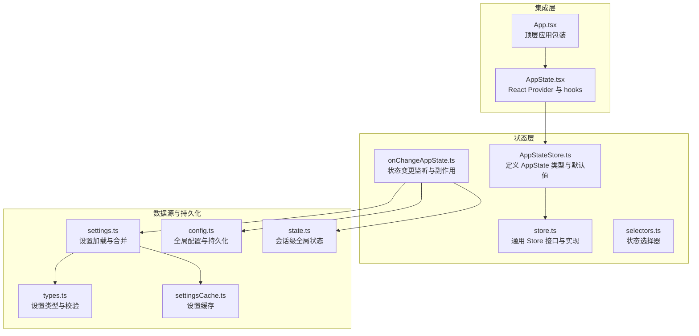
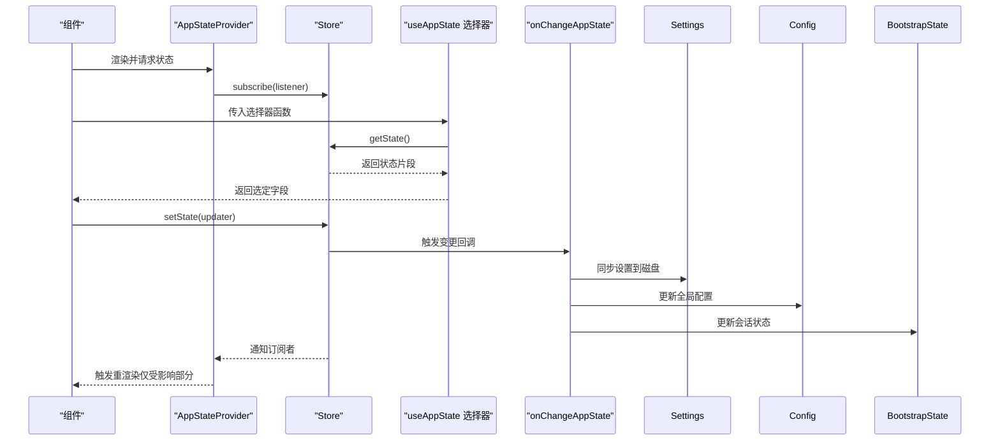
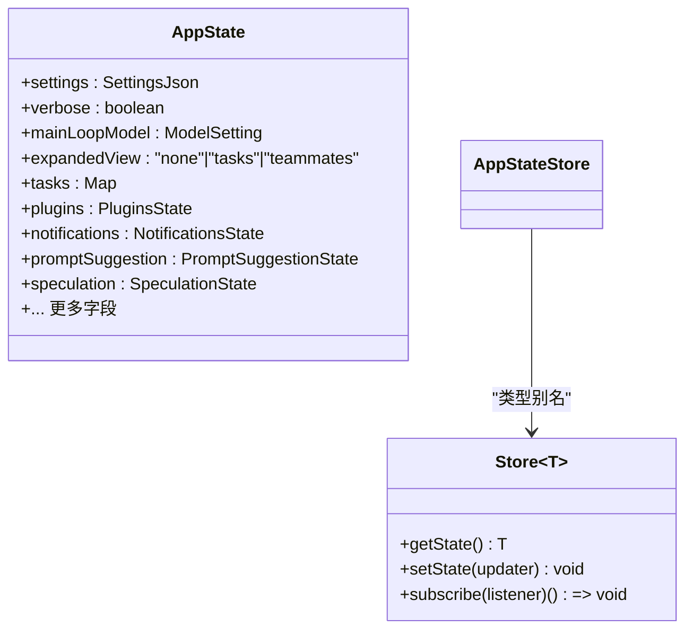
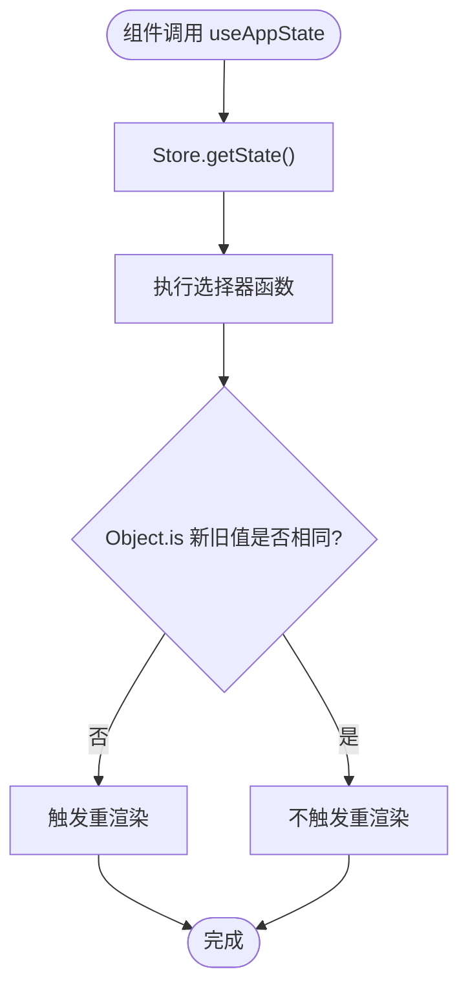
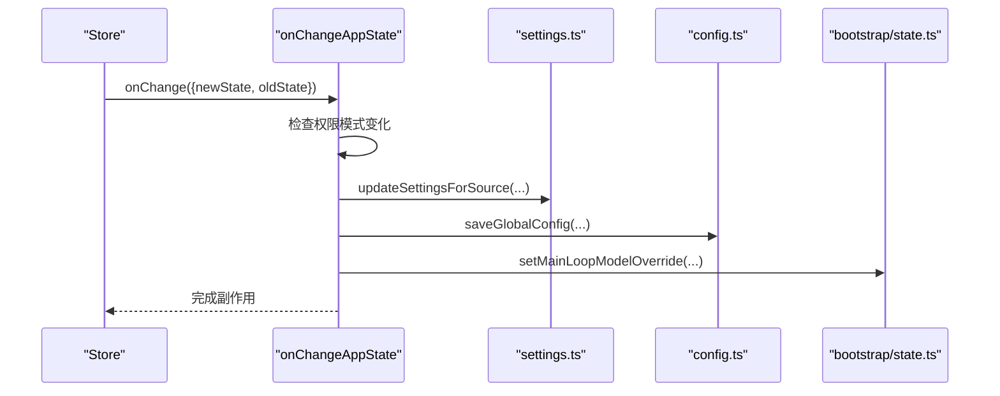
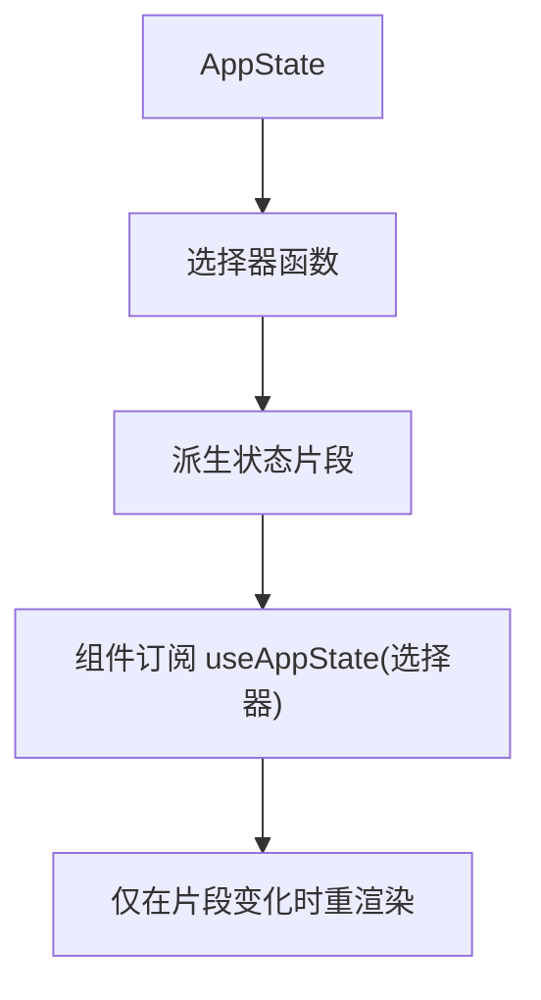
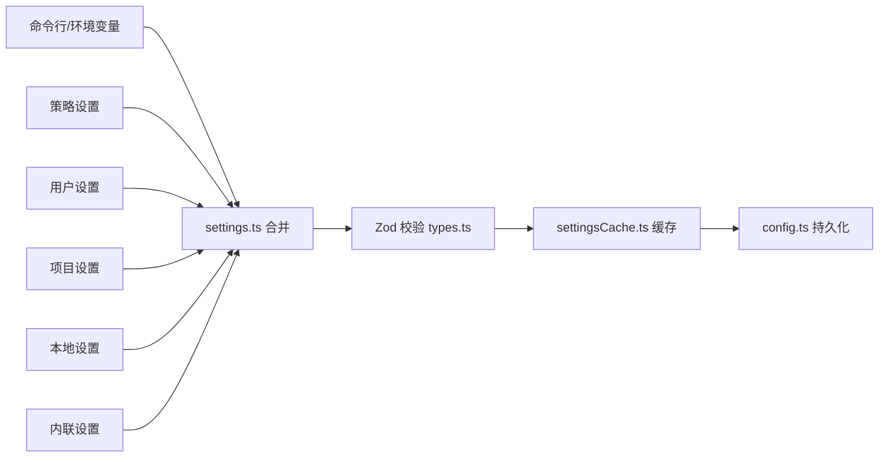
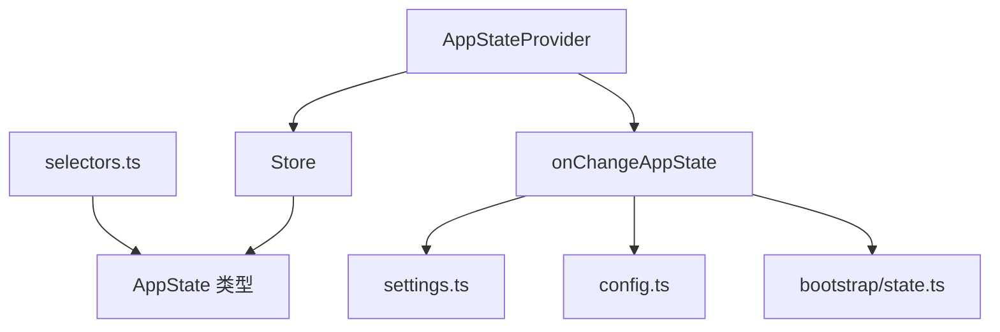

# 状态管理系统

<cite>
**本文档引用的文件**
- [AppStateStore.ts](file://src/state/AppStateStore.ts)
- [AppState.tsx](file://src/state/AppState.tsx)
- [store.ts](file://src/state/store.ts)
- [selectors.ts](file://src/state/selectors.ts)
- [onChangeAppState.ts](file://src/state/onChangeAppState.ts)
- [state.ts](file://src/bootstrap/state.ts)
- [settings.ts](file://src/utils/settings/settings.ts)
- [config.ts](file://src/utils/config.ts)
- [settingsCache.ts](file://src/utils/settings/settingsCache.ts)
- [types.ts](file://src/utils/settings/types.ts)
- [App.tsx](file://src/components/App.tsx)
- [README.md](file://README.md)
</cite>

## 目录
1. [简介](#简介)
2. [项目结构](#项目结构)
3. [核心组件](#核心组件)
4. [架构总览](#架构总览)
5. [详细组件分析](#详细组件分析)
6. [依赖关系分析](#依赖关系分析)
7. [性能考量](#性能考量)
8. [故障排查指南](#故障排查指南)
9. [结论](#结论)
10. [附录](#附录)

## 简介
本文件系统性阐述 Claude Code 的状态管理系统，重点覆盖以下方面：
- 应用状态存储架构：AppStateStore 的设计、状态持久化与同步机制
- React 上下文提供者实现：状态提供、订阅管理与性能优化
- 状态变更监听机制：副作用处理、异步更新与错误边界
- 状态选择器模式：状态提取、计算属性与缓存策略
- 最佳实践：状态设计原则、性能考虑与调试技巧
- 扩展性与维护指南：模块化、可测试性与演进路径

## 项目结构
状态管理相关代码主要位于 `src/state` 目录，并与设置系统、全局配置、会话状态等模块协同工作。

**图表来源**
- [AppStateStore.ts:1-570](file://src/state/AppStateStore.ts#L1-L570)
- [store.ts:1-35](file://src/state/store.ts#L1-L35)
- [selectors.ts:1-77](file://src/state/selectors.ts#L1-L77)
- [onChangeAppState.ts:1-172](file://src/state/onChangeAppState.ts#L1-L172)
- [AppState.tsx:1-200](file://src/state/AppState.tsx#L1-L200)
- [App.tsx:1-55](file://src/components/App.tsx#L1-L55)
- [settings.ts:1-800](file://src/utils/settings/settings.ts#L1-L800)
- [types.ts:1-800](file://src/utils/settings/types.ts#L1-L800)
- [settingsCache.ts:1-81](file://src/utils/settings/settingsCache.ts#L1-L81)
- [config.ts:1-800](file://src/utils/config.ts#L1-L800)
- [state.ts:1-800](file://src/bootstrap/state.ts#L1-L800)

**章节来源**
- [AppStateStore.ts:1-570](file://src/state/AppStateStore.ts#L1-L570)
- [AppState.tsx:1-200](file://src/state/AppState.tsx#L1-L200)
- [store.ts:1-35](file://src/state/store.ts#L1-L35)
- [selectors.ts:1-77](file://src/state/selectors.ts#L1-L77)
- [onChangeAppState.ts:1-172](file://src/state/onChangeAppState.ts#L1-L172)
- [App.tsx:1-55](file://src/components/App.tsx#L1-L55)
- [settings.ts:1-800](file://src/utils/settings/settings.ts#L1-L800)
- [types.ts:1-800](file://src/utils/settings/types.ts#L1-L800)
- [settingsCache.ts:1-81](file://src/utils/settings/settingsCache.ts#L1-L81)
- [config.ts:1-800](file://src/utils/config.ts#L1-L800)
- [state.ts:1-800](file://src/bootstrap/state.ts#L1-L800)

## 核心组件
- AppStateStore：定义应用状态的完整类型结构与默认值，涵盖设置、权限、任务、插件、通知、提示词建议、推测状态等。
- Store：通用状态容器接口，提供 getState、setState、subscribe 方法，支持变更回调与订阅分发。
- AppStateProvider 与 hooks：基于 React 的上下文提供者，封装 useAppState、useSetAppState、useAppStateStore 等钩子，使用 useSyncExternalStore 实现高效订阅。
- onChangeAppState：集中处理状态变更副作用（如设置同步到磁盘、外部元数据广播、权限模式同步等）。
- 设置与配置：settings.ts 负责多源设置合并与持久化；config.ts 提供全局配置读写；settingsCache.ts 提供缓存以提升性能。

**章节来源**
- [AppStateStore.ts:89-570](file://src/state/AppStateStore.ts#L89-L570)
- [store.ts:4-8](file://src/state/store.ts#L4-L8)
- [AppState.tsx:27-124](file://src/state/AppState.tsx#L27-L124)
- [onChangeAppState.ts:43-171](file://src/state/onChangeAppState.ts#L43-L171)
- [settings.ts:645-800](file://src/utils/settings/settings.ts#L645-L800)
- [config.ts:797-800](file://src/utils/config.ts#L797-L800)
- [settingsCache.ts:55-60](file://src/utils/settings/settingsCache.ts#L55-L60)

## 架构总览
状态管理采用“轻量 Store + React 集成 + 副作用集中处理”的架构，确保：
- 单一真相源：AppState 作为单一状态树
- 订阅式渲染：useSyncExternalStore 仅在选择器返回值变化时触发重渲染
- 变更监听：onChangeAppState 统一处理跨进程/外部系统同步
- 持久化与缓存：设置与配置分别通过 settings.ts/config.ts 与缓存层管理

**图表来源**
- [AppState.tsx:142-163](file://src/state/AppState.tsx#L142-L163)
- [store.ts:20-27](file://src/state/store.ts#L20-L27)
- [onChangeAppState.ts:43-171](file://src/state/onChangeAppState.ts#L43-L171)
- [settings.ts:416-524](file://src/utils/settings/settings.ts#L416-L524)
- [config.ts:797-800](file://src/utils/config.ts#L797-L800)
- [state.ts:431-450](file://src/bootstrap/state.ts#L431-L450)

## 详细组件分析

### AppStateStore 设计
- 类型安全：使用 DeepImmutable 包装复杂嵌套对象，避免意外修改；对包含函数类型的字段（如任务状态）排除在深度不可变之外。
- 默认值：getDefaultAppState 提供初始状态，结合运行时环境（如计划模式要求）动态决定权限模式。
- 外部元数据映射：externalMetadataToAppState 将外部会话元数据转换为内部状态，保证跨进程一致性。

**图表来源**
- [AppStateStore.ts:89-570](file://src/state/AppStateStore.ts#L89-L570)
- [store.ts:4-8](file://src/state/store.ts#L4-L8)

**章节来源**
- [AppStateStore.ts:89-570](file://src/state/AppStateStore.ts#L89-L570)

### React 上下文提供者与订阅机制
- AppStateProvider：创建并注入 Store，确保 Provider 不可嵌套；在挂载时根据远程设置禁用旁路权限模式；将设置变更事件桥接到 AppState。
- useAppState：基于 useSyncExternalStore 的选择器订阅，仅当选择器返回值变化时触发重渲染；禁止直接返回原状态对象。
- useSetAppState/useAppStateStore：提供稳定的 setState 引用与 Store 直接访问，便于非 React 场景使用。
- 安全版本 useAppStateMaybeOutsideOfProvider：在无 Provider 环境下返回 undefined，避免运行时错误。

**图表来源**
- [AppState.tsx:142-163](file://src/state/AppState.tsx#L142-L163)
- [store.ts:20-27](file://src/state/store.ts#L20-L27)

**章节来源**
- [AppState.tsx:37-124](file://src/state/AppState.tsx#L37-L124)
- [AppState.tsx:142-199](file://src/state/AppState.tsx#L142-L199)

### 状态变更监听与副作用处理
onChangeAppState 是状态变更的统一出口，负责：
- 权限模式同步：将内部模式转换为外部模式，向 CCR/SDK 广播；处理首次计划模式标记（ultraplan）。
- 设置同步：当 mainLoopModel 发生变化时同步到用户设置；verbose、面板可见性等全局配置持久化。
- 设置变更清理：当设置发生变化时清除认证缓存并重新应用环境变量。
- 会话状态联动：更新引导态中的主循环模型覆盖。

**图表来源**
- [onChangeAppState.ts:43-171](file://src/state/onChangeAppState.ts#L43-L171)
- [settings.ts:416-524](file://src/utils/settings/settings.ts#L416-L524)
- [config.ts:797-800](file://src/utils/config.ts#L797-L800)
- [state.ts:29-110](file://src/bootstrap/state.ts#L29-L110)

**章节来源**
- [onChangeAppState.ts:43-171](file://src/state/onChangeAppState.ts#L43-L171)

### 状态选择器模式与缓存策略
- 选择器职责：从 AppState 中提取派生数据，保持纯函数与无副作用。
- 典型选择器：
  - getViewedTeammateTask：根据 viewingAgentTaskId 与 tasks 获取当前查看的同伴任务。
  - getActiveAgentForInput：根据当前视图状态与任务类型判断输入路由目标（领袖、已查看同伴或命名代理）。
- 缓存策略：
  - settingsCache.ts：提供会话级设置缓存、按源缓存与解析文件缓存，减少重复 IO 与校验开销。
  - memoize 工具：为异步/同步计算提供带 TTL 的缓存，支持并发刷新与错误恢复。

**图表来源**
- [selectors.ts:18-76](file://src/state/selectors.ts#L18-L76)
- [settingsCache.ts:22-59](file://src/utils/settings/settingsCache.ts#L22-L59)

**章节来源**
- [selectors.ts:1-77](file://src/state/selectors.ts#L1-L77)
- [settingsCache.ts:1-81](file://src/utils/settings/settingsCache.ts#L1-L81)

### 设置系统与持久化
- 设置加载：settings.ts 以“策略优先”方式合并多源设置（用户、项目、本地、策略、标志），支持 drop-in 文件与内联设置。
- 类型校验：types.ts 使用 Zod 对设置进行严格校验，保留未知字段以保证向后兼容。
- 缓存与失效：settingsCache.ts 在设置写入、添加目录、插件初始化、钩子刷新时统一重置缓存。
- 全局配置：config.ts 提供全局配置的读写与持久化，支持键过滤与默认值工厂。

**图表来源**
- [settings.ts:645-800](file://src/utils/settings/settings.ts#L645-L800)
- [types.ts:255-800](file://src/utils/settings/types.ts#L255-L800)
- [settingsCache.ts:55-60](file://src/utils/settings/settingsCache.ts#L55-L60)
- [config.ts:797-800](file://src/utils/config.ts#L797-L800)

**章节来源**
- [settings.ts:1-800](file://src/utils/settings/settings.ts#L1-L800)
- [types.ts:1-800](file://src/utils/settings/types.ts#L1-L800)
- [settingsCache.ts:1-81](file://src/utils/settings/settingsCache.ts#L1-L81)
- [config.ts:1-800](file://src/utils/config.ts#L1-L800)

## 依赖关系分析
- 组件耦合：
  - AppStateProvider 依赖 Store 与 onChangeAppState，向上提供状态，向下驱动 UI。
  - 选择器与 Store 解耦，仅依赖 AppState 类型。
- 外部依赖：
  - 设置系统与配置系统通过 onChangeAppState 进行解耦的副作用处理。
  - 会话级全局状态（bootstrap/state.ts）与设置系统相互独立但通过 onChange 同步关键字段。
- 循环依赖规避：
  - getDefaultAppState 内部延迟引入工具模块，避免循环导入。
  - 选择器模块仅依赖类型与工具，不引入运行时依赖。

**图表来源**
- [AppState.tsx:1-200](file://src/state/AppState.tsx#L1-L200)
- [store.ts:1-35](file://src/state/store.ts#L1-L35)
- [onChangeAppState.ts:1-172](file://src/state/onChangeAppState.ts#L1-L172)
- [settings.ts:1-800](file://src/utils/settings/settings.ts#L1-L800)
- [config.ts:1-800](file://src/utils/config.ts#L1-L800)
- [state.ts:1-800](file://src/bootstrap/state.ts#L1-L800)
- [selectors.ts:1-77](file://src/state/selectors.ts#L1-L77)

**章节来源**
- [AppState.tsx:1-200](file://src/state/AppState.tsx#L1-L200)
- [store.ts:1-35](file://src/state/store.ts#L1-L35)
- [onChangeAppState.ts:1-172](file://src/state/onChangeAppState.ts#L1-L172)
- [settings.ts:1-800](file://src/utils/settings/settings.ts#L1-L800)
- [config.ts:1-800](file://src/utils/config.ts#L1-L800)
- [state.ts:1-800](file://src/bootstrap/state.ts#L1-L800)
- [selectors.ts:1-77](file://src/state/selectors.ts#L1-L77)

## 性能考量
- 订阅粒度：useAppState 通过选择器实现细粒度订阅，避免不必要的重渲染。
- 深度比较：Store 使用 Object.is 判断新旧值，减少无效更新。
- 缓存策略：设置系统与配置系统广泛使用缓存，降低 IO 与解析成本。
- 异步缓存：memoizeWithTTLAsync 支持后台刷新与错误降级，提升用户体验。
- 选择器纯函数：确保无副作用，便于 React 优化与测试。

[本节为通用指导，无需特定文件引用]

## 故障排查指南
- Provider 嵌套错误：AppStateProvider 不允许嵌套，若出现错误需检查组件树结构。
- 选择器返回原状态：useAppState 选择器必须返回状态的某个字段而非原状态对象，否则会抛出异常。
- 设置同步失败：检查 onChangeAppState 是否正确调用 updateSettingsForSource 与 saveGlobalConfig。
- 权限模式不同步：确认 toExternalPermissionMode 转换逻辑与 notifySessionMetadataChanged 调用链。
- 缓存不一致：调用 resetSettingsCache 或相应缓存清理方法，确保后续读取命中最新值。

**章节来源**
- [AppState.tsx:44-73](file://src/state/AppState.tsx#L44-L73)
- [AppState.tsx:147-152](file://src/state/AppState.tsx#L147-L152)
- [onChangeAppState.ts:65-92](file://src/state/onChangeAppState.ts#L65-L92)
- [settingsCache.ts:55-60](file://src/utils/settings/settingsCache.ts#L55-L60)

## 结论
该状态管理系统通过“轻量 Store + React 集成 + 副作用集中处理”的架构，在保证类型安全与性能的同时，实现了跨模块的状态共享与同步。选择器模式与缓存策略进一步提升了可维护性与响应速度。建议在扩展新状态域时遵循现有模式，确保变更监听与持久化的一致性。

[本节为总结性内容，无需特定文件引用]

## 附录

### 状态管理最佳实践
- 设计原则
  - 单一真相源：AppState 作为唯一事实来源
  - 选择器提取：将派生状态封装为纯函数选择器
  - 不可变更新：通过 setState(updater) 生成新状态
- 性能优化
  - 使用 useAppState 选择器订阅最小必要字段
  - 合理使用缓存（settingsCache、memoizeWithTTLAsync）
  - 避免在选择器中创建新对象
- 调试技巧
  - 使用 verbose 开关与日志输出定位问题
  - 在 onChangeAppState 中记录关键状态变更轨迹
  - 使用安全版本 useAppStateMaybeOutsideOfProvider 避免 Provider 缺失导致的崩溃

**章节来源**
- [AppState.tsx:126-141](file://src/state/AppState.tsx#L126-L141)
- [onChangeAppState.ts:154-170](file://src/state/onChangeAppState.ts#L154-L170)
- [settingsCache.ts:55-60](file://src/utils/settings/settingsCache.ts#L55-L60)

### 状态系统扩展性与维护指南
- 扩展新状态域
  - 在 AppStateStore.ts 中定义字段与默认值
  - 如需持久化，编写 onChangeAppState 副作用与 config.ts/saveGlobalConfig 调用
  - 提供对应选择器并在组件中使用
- 维护建议
  - 保持选择器纯函数与无副作用
  - 在设置系统中提供向后兼容的迁移逻辑
  - 使用缓存层减少 IO 与解析开销
  - 通过单元测试验证选择器与副作用行为

**章节来源**
- [AppStateStore.ts:89-570](file://src/state/AppStateStore.ts#L89-L570)
- [onChangeAppState.ts:1-172](file://src/state/onChangeAppState.ts#L1-L172)
- [settings.ts:232-241](file://src/utils/settings/settings.ts#L232-L241)
- [config.ts:797-800](file://src/utils/config.ts#L797-L800)